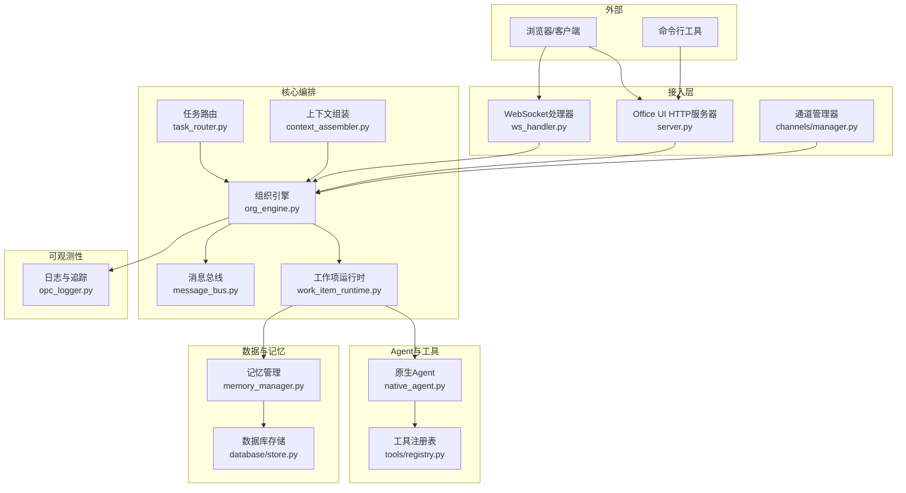
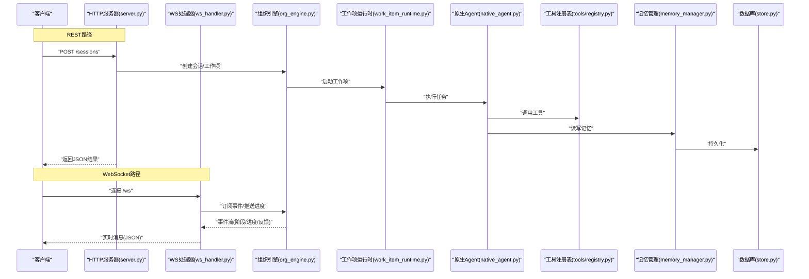
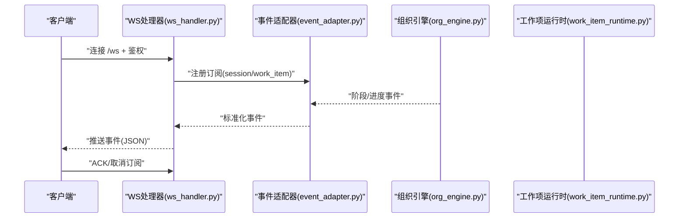
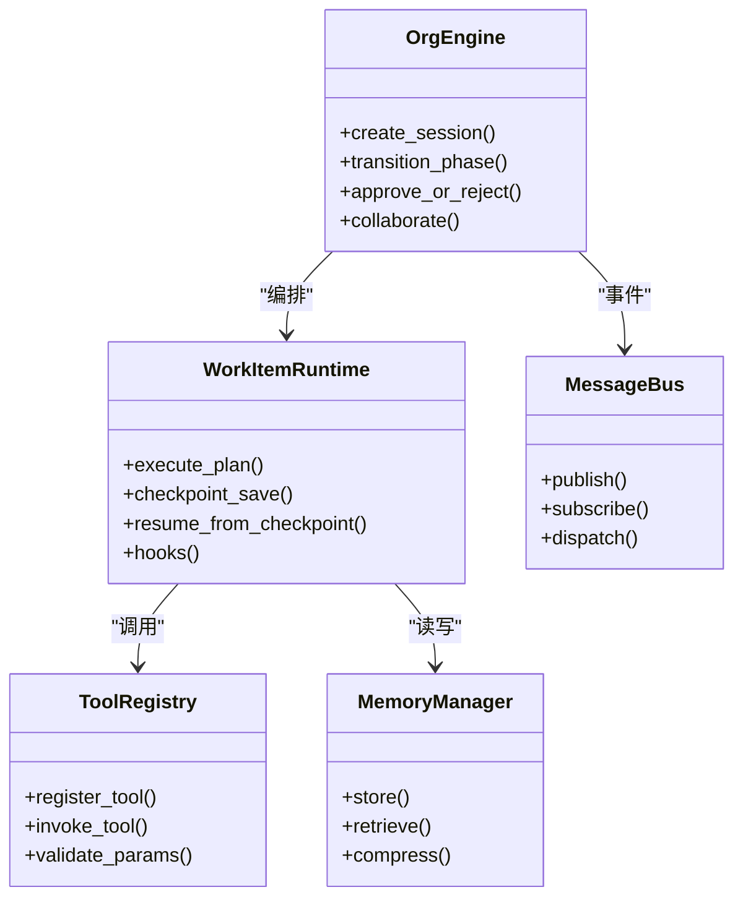
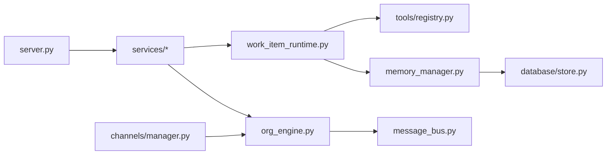

# API参考

<cite>
**本文引用的文件**   
- [README.md](file://README.md)
- [pyproject.toml](file://pyproject.toml)
- [opc/engine.py](file://opc/engine.py)
- [opc/cli/app.py](file://opc/cli/app.py)
- [opc/core/config.py](file://opc/core/config.py)
- [opc/core/models.py](file://opc/core/models.py)
- [opc/core/events.py](file://opc/core/events.py)
- [opc/layer0_interaction/message_bus.py](file://opc/layer0_interaction/message_bus.py)
- [opc/layer1_perception/context_assembler.py](file://opc/layer1_perception/context_assembler.py)
- [opc/layer1_perception/task_router.py](file://opc/layer1_perception/task_router.py)
- [opc/layer2_organization/org_engine.py](file://opc/layer2_organization/org_engine.py)
- [opc/layer2_organization/work_item_runtime.py](file://opc/layer2_organization/work_item_runtime.py)
- [opc/layer3_agent/native_agent.py](file://opc/layer3_agent/native_agent.py)
- [opc/layer4_tools/registry.py](file://opc/layer4_tools/registry.py)
- [opc/layer5_memory/memory_manager.py](file://opc/layer5_memory/memory_manager.py)
- [opc/layer6_observability/opc_logger.py](file://opc/layer6_observability/opc_logger.py)
- [opc/plugins/office_ui/server.py](file://opc/plugins/office_ui/server.py)
- [opc/plugins/office_ui/ws_handler.py](file://opc/plugins/office_ui/ws_handler.py)
- [opc/plugins/office_ui/services/factory.py](file://opc/plugins/office_ui/services/factory.py)
- [opc/plugins/office_ui/services/runtime.py](file://opc/plugins/office_ui/services/runtime.py)
- [opc/plugins/office_ui/services/comms.py](file://opc/plugins/office_ui/services/comms.py)
- [opc/plugins/office_ui/services/session.py](file://opc/plugins/office_ui/services/session.py)
- [opc/plugins/office_ui/services/work_item.py](file://opc/plugins/office_ui/services/work_item.py)
- [opc/plugins/office_ui/event_adapter.py](file://opc/plugins/office_ui/event_adapter.py)
- [opc/plugins/office_ui/chat_store.py](file://opc/plugins/office_ui/chat_store.py)
- [opc/plugins/office_ui/agent_store.py](file://opc/plugins/office_ui/agent_store.py)
- [opc/plugins/office_ui/dispatcher.py](file://opc/plugins/office_ui/dispatcher.py)
- [opc/channels/manager.py](file://opc/channels/manager.py)
- [opc/channels/base.py](file://opc/channels/base.py)
- [opc/channels/provider_registry.py](file://opc/channels/provider_registry.py)
- [opc/database/store.py](file://opc/database/store.py)
- [tests/test_ws_handler_progress_parsing.py](file://tests/test_ws_handler_progress_parsing.py)
- [tests/test_ws_handler_escalations.py](file://tests/test_ws_handler_escalations.py)
</cite>

## 目录
1. [简介](#简介)
2. [项目结构](#项目结构)
3. [核心组件](#核心组件)
4. [架构总览](#架构总览)
5. [详细组件分析](#详细组件分析)
6. [依赖关系分析](#依赖关系分析)
7. [性能与限流](#性能与限流)
8. [安全与认证](#安全与认证)
9. [错误码与异常处理](#错误码与异常处理)
10. [API版本管理与兼容性](#api版本管理与兼容性)
11. [测试与调试](#测试与调试)
12. [最佳实践与示例](#最佳实践与示例)
13. [结论](#结论)

## 简介
本API参考文档面向OpenOPC的集成开发者，覆盖以下接口与能力：
- REST API端点（HTTP方法、URL模式、请求/响应模型、认证方式）
- WebSocket API（连接建立、消息格式、事件类型、实时交互）
- 内部服务接口（组织引擎、工作项运行时、工具注册表、记忆管理等）
- SDK与客户端库使用指南（前端Office UI与后端服务协作）
- 错误码定义与异常处理策略
- API版本管理与向后兼容保证
- 限流与安全防护建议
- 测试工具与调试方法
- 完整调用示例与最佳实践

## 项目结构
OpenOPC采用分层架构，围绕“通道接入—感知—组织—代理—工具—记忆—可观测性”的主干路径构建。Web界面插件通过内置HTTP服务器暴露REST与WebSocket接口，驱动上层业务逻辑。

图表来源
- [opc/plugins/office_ui/server.py](file://opc/plugins/office_ui/server.py)
- [opc/plugins/office_ui/ws_handler.py](file://opc/plugins/office_ui/ws_handler.py)
- [opc/channels/manager.py](file://opc/channels/manager.py)
- [opc/layer2_organization/org_engine.py](file://opc/layer2_organization/org_engine.py)
- [opc/layer2_organization/work_item_runtime.py](file://opc/layer2_organization/work_item_runtime.py)
- [opc/layer1_perception/task_router.py](file://opc/layer1_perception/task_router.py)
- [opc/layer1_perception/context_assembler.py](file://opc/layer1_perception/context_assembler.py)
- [opc/layer0_interaction/message_bus.py](file://opc/layer0_interaction/message_bus.py)
- [opc/layer3_agent/native_agent.py](file://opc/layer3_agent/native_agent.py)
- [opc/layer4_tools/registry.py](file://opc/layer4_tools/registry.py)
- [opc/layer5_memory/memory_manager.py](file://opc/layer5_memory/memory_manager.py)
- [opc/database/store.py](file://opc/database/store.py)
- [opc/layer6_observability/opc_logger.py](file://opc/layer6_observability/opc_logger.py)

章节来源
- [README.md](file://README.md)
- [pyproject.toml](file://pyproject.toml)

## 核心组件
- Office UI服务器与WS处理器：提供REST与WebSocket入口，负责会话、工作项、通信等服务的调度与事件转发。
- 组织引擎与工作项运行时：编排任务生命周期、阶段转换、权限与审批、协作策略等。
- Agent与工具：原生Agent协调工具执行，工具通过注册表发现与调用。
- 记忆与持久化：统一记忆管理，对接底层存储。
- 通道与消息总线：多通道接入与内部事件分发。
- 可观测性：结构化日志与追踪。

章节来源
- [opc/plugins/office_ui/server.py](file://opc/plugins/office_ui/server.py)
- [opc/plugins/office_ui/ws_handler.py](file://opc/plugins/office_ui/ws_handler.py)
- [opc/layer2_organization/org_engine.py](file://opc/layer2_organization/org_engine.py)
- [opc/layer2_organization/work_item_runtime.py](file://opc/layer2_organization/work_item_runtime.py)
- [opc/layer3_agent/native_agent.py](file://opc/layer3_agent/native_agent.py)
- [opc/layer4_tools/registry.py](file://opc/layer4_tools/registry.py)
- [opc/layer5_memory/memory_manager.py](file://opc/layer5_memory/memory_manager.py)
- [opc/database/store.py](file://opc/database/store.py)
- [opc/channels/manager.py](file://opc/channels/manager.py)
- [opc/layer0_interaction/message_bus.py](file://opc/layer0_interaction/message_bus.py)
- [opc/layer6_observability/opc_logger.py](file://opc/layer6_observability/opc_logger.py)

## 架构总览
下图展示从客户端到内部服务的关键调用链，包括REST与WebSocket两条路径。

图表来源
- [opc/plugins/office_ui/server.py](file://opc/plugins/office_ui/server.py)
- [opc/plugins/office_ui/ws_handler.py](file://opc/plugins/office_ui/ws_handler.py)
- [opc/layer2_organization/org_engine.py](file://opc/layer2_organization/org_engine.py)
- [opc/layer2_organization/work_item_runtime.py](file://opc/layer2_organization/work_item_runtime.py)
- [opc/layer3_agent/native_agent.py](file://opc/layer3_agent/native_agent.py)
- [opc/layer4_tools/registry.py](file://opc/layer4_tools/registry.py)
- [opc/layer5_memory/memory_manager.py](file://opc/layer5_memory/memory_manager.py)
- [opc/database/store.py](file://opc/database/store.py)

## 详细组件分析

### REST API（Office UI服务）
- 基础信息
  - 协议：HTTP/HTTPS
  - 内容类型：application/json
  - 认证：见“安全与认证”节
  - 版本控制：见“API版本管理与兼容性”节
- 主要端点（按功能域）
  - 会话与会话列表
    - POST /api/sessions
      - 作用：创建新会话
      - 请求体：包含会话元数据（如标题、初始上下文、目标角色等）
      - 响应：会话ID、状态、初始工作项信息
    - GET /api/sessions/{id}
      - 作用：获取会话详情
      - 响应：会话状态、关联工作项、时间线摘要
    - DELETE /api/sessions/{id}
      - 作用：终止会话
  - 工作项
    - POST /api/work-items
      - 作用：在工作项下创建子任务或步骤
      - 请求体：任务描述、优先级、依赖、期望输出
      - 响应：工作项ID、阶段、计划
    - GET /api/work-items/{id}
      - 作用：查询工作项状态与进度
    - PATCH /api/work-items/{id}/phase
      - 作用：推进阶段（需权限校验）
  - 通信与消息
    - POST /api/messages
      - 作用：发送消息至当前会话/工作项
      - 请求体：消息文本、附件引用、可见性策略
      - 响应：消息ID、投递状态
    - GET /api/messages?session_id=...&page=...
      - 作用：分页拉取消息历史
  - 运行与执行
    - POST /api/runs
      - 作用：触发一次执行（例如工具调用、脚本执行）
      - 请求体：工具名、参数、上下文
      - 响应：运行ID、状态
    - GET /api/runs/{id}
      - 作用：查询执行结果与日志
  - 组织与配置
    - GET /api/org/info
      - 作用：获取组织快照（角色、岗位、策略）
    - PUT /api/org/config
      - 作用：更新组织配置（需管理员权限）
- 通用响应模型
  - 成功：{ code, data }
  - 失败：{ code, error: { message, details } }
- 典型流程
  - 创建会话→创建工作项→发送消息→轮询/订阅进度→获取结果

章节来源
- [opc/plugins/office_ui/server.py](file://opc/plugins/office_ui/server.py)
- [opc/plugins/office_ui/services/factory.py](file://opc/plugins/office_ui/services/factory.py)
- [opc/plugins/office_ui/services/runtime.py](file://opc/plugins/office_ui/services/runtime.py)
- [opc/plugins/office_ui/services/comms.py](file://opc/plugins/office_ui/services/comms.py)
- [opc/plugins/office_ui/services/session.py](file://opc/plugins/office_ui/services/session.py)
- [opc/plugins/office_ui/services/work_item.py](file://opc/plugins/office_ui/services/work_item.py)

### WebSocket API（实时交互）
- 连接建立
  - URL：/ws
  - 握手：标准WebSocket握手，可选携带鉴权头
- 消息格式（JSON）
  - 上行（客户端→服务端）
    - type: 指令类型（如 subscribe、publish、ack）
    - payload: 具体载荷（如 session_id、work_item_id、消息体）
  - 下行（服务端→客户端）
    - type: 事件类型（如 progress、phase_change、message、error）
    - payload: 事件数据（含时间戳、来源、上下文）
- 事件类型
  - 进度事件：任务执行进度、工具调用状态
  - 阶段变更：工作项阶段推进、回退
  - 消息事件：系统/用户消息广播
  - 错误事件：异常、超时、权限拒绝
- 交互模式
  - 订阅-发布：客户端订阅特定会话/工作项的事件流
  - 双向确认：关键事件支持ACK机制
  - 断线重连：客户端实现指数退避重连

图表来源
- [opc/plugins/office_ui/ws_handler.py](file://opc/plugins/office_ui/ws_handler.py)
- [opc/plugins/office_ui/event_adapter.py](file://opc/plugins/office_ui/event_adapter.py)
- [opc/layer2_organization/org_engine.py](file://opc/layer2_organization/org_engine.py)
- [opc/layer2_organization/work_item_runtime.py](file://opc/layer2_organization/work_item_runtime.py)

章节来源
- [opc/plugins/office_ui/ws_handler.py](file://opc/plugins/office_ui/ws_handler.py)
- [opc/plugins/office_ui/event_adapter.py](file://opc/plugins/office_ui/event_adapter.py)
- [tests/test_ws_handler_progress_parsing.py](file://tests/test_ws_handler_progress_parsing.py)
- [tests/test_ws_handler_escalations.py](file://tests/test_ws_handler_escalations.py)

### 内部服务接口（组织与运行时）
- 组织引擎（Org Engine）
  - 职责：会话与工作项生命周期管理、阶段机、权限与审批、协作策略
  - 关键能力：创建/切换阶段、委派、升级、合并/拆分工作项
- 工作项运行时（Work Item Runtime）
  - 职责：执行计划、状态同步、钩子与检查点、重试与恢复
- 工具注册表（Tool Registry）
  - 职责：工具发现、参数校验、执行封装、结果归一化
- 记忆管理（Memory Manager）
  - 职责：短期/长期记忆、压缩与检索、偏好与策略
- 消息总线（Message Bus）
  - 职责：内部事件分发、跨模块解耦、顺序与幂等保障

图表来源
- [opc/layer2_organization/org_engine.py](file://opc/layer2_organization/org_engine.py)
- [opc/layer2_organization/work_item_runtime.py](file://opc/layer2_organization/work_item_runtime.py)
- [opc/layer4_tools/registry.py](file://opc/layer4_tools/registry.py)
- [opc/layer5_memory/memory_manager.py](file://opc/layer5_memory/memory_manager.py)
- [opc/layer0_interaction/message_bus.py](file://opc/layer0_interaction/message_bus.py)

章节来源
- [opc/layer2_organization/org_engine.py](file://opc/layer2_organization/org_engine.py)
- [opc/layer2_organization/work_item_runtime.py](file://opc/layer2_organization/work_item_runtime.py)
- [opc/layer4_tools/registry.py](file://opc/layer4_tools/registry.py)
- [opc/layer5_memory/memory_manager.py](file://opc/layer5_memory/memory_manager.py)
- [opc/layer0_interaction/message_bus.py](file://opc/layer0_interaction/message_bus.py)

### 通道与CLI
- 通道管理器
  - 职责：多通道接入（IM、邮件、矩阵等）、会话映射、消息路由
- CLI应用
  - 职责：本地命令入口、交互式会话、批量操作

章节来源
- [opc/channels/manager.py](file://opc/channels/manager.py)
- [opc/channels/base.py](file://opc/channels/base.py)
- [opc/channels/provider_registry.py](file://opc/channels/provider_registry.py)
- [opc/cli/app.py](file://opc/cli/app.py)

## 依赖关系分析
- 低耦合高内聚：各层通过明确接口交互，事件总线降低直接依赖
- 外部依赖：数据库存储、LLM提供者、第三方通道
- 潜在循环依赖：通过消息总线与适配器避免

图表来源
- [opc/plugins/office_ui/server.py](file://opc/plugins/office_ui/server.py)
- [opc/plugins/office_ui/services/factory.py](file://opc/plugins/office_ui/services/factory.py)
- [opc/layer2_organization/org_engine.py](file://opc/layer2_organization/org_engine.py)
- [opc/layer2_organization/work_item_runtime.py](file://opc/layer2_organization/work_item_runtime.py)
- [opc/layer4_tools/registry.py](file://opc/layer4_tools/registry.py)
- [opc/layer5_memory/memory_manager.py](file://opc/layer5_memory/memory_manager.py)
- [opc/database/store.py](file://opc/database/store.py)
- [opc/layer0_interaction/message_bus.py](file://opc/layer0_interaction/message_bus.py)
- [opc/channels/manager.py](file://opc/channels/manager.py)

章节来源
- [opc/plugins/office_ui/server.py](file://opc/plugins/office_ui/server.py)
- [opc/layer2_organization/org_engine.py](file://opc/layer2_organization/org_engine.py)
- [opc/layer2_organization/work_item_runtime.py](file://opc/layer2_organization/work_item_runtime.py)
- [opc/layer4_tools/registry.py](file://opc/layer4_tools/registry.py)
- [opc/layer5_memory/memory_manager.py](file://opc/layer5_memory/memory_manager.py)
- [opc/database/store.py](file://opc/database/store.py)
- [opc/layer0_interaction/message_bus.py](file://opc/layer0_interaction/message_bus.py)
- [opc/channels/manager.py](file://opc/channels/manager.py)

## 性能与限流
- 建议措施
  - 请求级限流：基于IP/用户/会话维度限制QPS与并发
  - 连接级限流：WebSocket最大连接数、单会话最大订阅数
  - 资源配额：工具执行时长、内存与CPU上限
  - 缓存策略：热点会话/工作项元数据缓存
  - 异步化：长耗时任务走队列与回调
- 监控指标
  - 端到端延迟、P95/P99
  - 错误率、重试率、超时率
  - 工具调用成功率与耗时分布
  - 记忆写入吞吐与延迟

[本节为通用指导，不直接分析具体文件]

## 安全与认证
- 认证方式
  - 推荐：Bearer Token（JWT），在HTTP头或WebSocket握手时携带
  - 可选：TLS双向认证（mTLS）用于内网服务间通信
- 授权模型
  - 基于角色的访问控制（RBAC）：会话/工作项级别权限
  - 细粒度：读/写/执行/管理
- 输入校验与输出净化
  - 严格JSON Schema校验
  - 富文本/Markdown输出净化，防止注入
- 审计与追踪
  - 全链路Trace ID
  - 敏感字段脱敏

章节来源
- [opc/plugins/office_ui/server.py](file://opc/plugins/office_ui/server.py)
- [opc/plugins/office_ui/ws_handler.py](file://opc/plugins/office_ui/ws_handler.py)
- [opc/core/config.py](file://opc/core/config.py)

## 错误码与异常处理
- 错误码约定
  - 2xx：成功
  - 4xx：客户端错误（参数无效、权限不足、未找到）
  - 5xx：服务端错误（内部异常、下游不可用）
- 常见错误
  - 400 参数校验失败
  - 401 未认证
  - 403 无权限
  - 404 资源不存在
  - 409 冲突（重复提交、状态不一致）
  - 429 限流
  - 500 内部错误
  - 503 服务不可用
- 异常处理策略
  - 统一错误包装：code、message、details
  - 幂等键：对写操作提供idempotency-key
  - 重试与退避：客户端指数退避，服务端去抖
  - 降级与熔断：下游不可用时快速失败并告警

章节来源
- [opc/plugins/office_ui/server.py](file://opc/plugins/office_ui/server.py)
- [opc/plugins/office_ui/ws_handler.py](file://opc/plugins/office_ui/ws_handler.py)
- [opc/layer6_observability/opc_logger.py](file://opc/layer6_observability/opc_logger.py)

## API版本管理与兼容性
- 版本策略
  - URL前缀或Header指定版本（如 /v1/... 或 X-API-Version）
  - 语义化版本：主版本破坏性变更，次版本新增能力，补丁版本修复
- 兼容性保证
  - 废弃字段保留至少两个大版本
  - 新增字段默认值与向后兼容
  - 行为变更通过特性开关控制
- 迁移指引
  - 提供迁移脚本与对照表
  - 灰度发布与双写期

章节来源
- [pyproject.toml](file://pyproject.toml)
- [opc/core/models.py](file://opc/core/models.py)

## 测试与调试
- 单元测试与集成测试
  - 针对WS进度解析与升级事件的用例
  - 针对通道契约与运行时集成的用例
- 调试方法
  - 启用详细日志与Trace ID
  - 使用CLI进行本地复现
  - 回放事件与快照对比
- 测试工具
  - 自动化脚本与E2E用例
  - 压测与混沌工程

章节来源
- [tests/test_ws_handler_progress_parsing.py](file://tests/test_ws_handler_progress_parsing.py)
- [tests/test_ws_handler_escalations.py](file://tests/test_ws_handler_escalations.py)
- [opc/cli/app.py](file://opc/cli/app.py)
- [opc/layer6_observability/opc_logger.py](file://opc/layer6_observability/opc_logger.py)

## 最佳实践与示例
- REST调用示例
  - 创建会话：POST /api/sessions，携带必要元数据，记录返回的会话ID
  - 发送消息：POST /api/messages，附带会话ID与消息体
  - 查询进度：GET /api/work-items/{id}，轮询或结合WebSocket
- WebSocket示例
  - 连接后订阅会话事件，收到progress与phase_change事件更新UI
  - 对关键事件发送ACK，确保可靠交付
- 错误处理
  - 捕获429并重试，指数退避
  - 对5xx进行熔断与降级提示
- 性能优化
  - 批量消息合并发送
  - 前端分页与虚拟滚动
  - 服务端缓存热点数据
- 安全加固
  - 最小权限原则
  - 输入校验与输出净化
  - 定期轮换密钥与证书

[本节为通用指导，不直接分析具体文件]

## 结论
OpenOPC通过清晰的REST与WebSocket接口、完善的内部服务抽象与可观测性支撑，提供了可扩展、可维护的企业级协作与Agent执行平台。遵循本文档的规范与最佳实践，开发者可高效集成并稳定运行于生产环境。