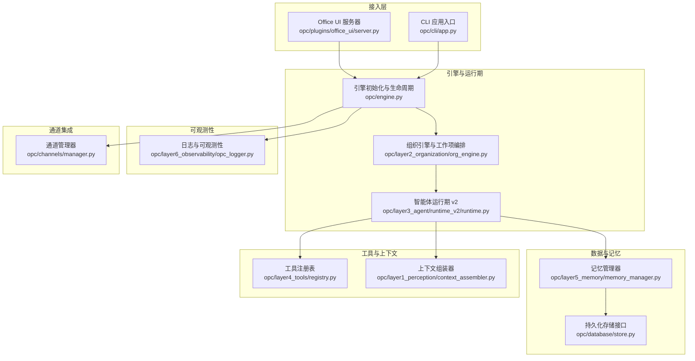
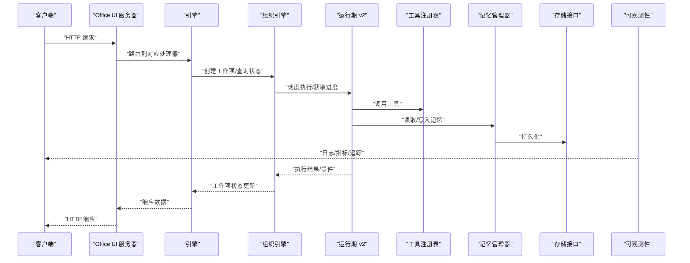
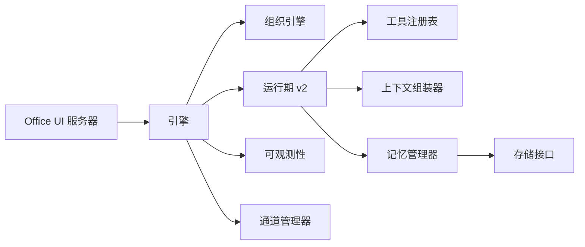

# REST API

<cite>
**本文引用的文件**   
- [README.md](file://README.md)
- [pyproject.toml](file://pyproject.toml)
- [opc/engine.py](file://opc/engine.py)
- [opc/cli/app.py](file://opc/cli/app.py)
- [opc/core/config.py](file://opc/core/config.py)
- [opc/database/store.py](file://opc/database/store.py)
- [opc/layer1_perception/context_assembler.py](file://opc/layer1_perception/context_assembler.py)
- [opc/layer2_organization/org_engine.py](file://opc/layer2_organization/org_engine.py)
- [opc/layer3_agent/runtime_v2/runtime.py](file://opc/layer3_agent/runtime_v2/runtime.py)
- [opc/layer4_tools/registry.py](file://opc/layer4_tools/registry.py)
- [opc/layer5_memory/memory_manager.py](file://opc/layer5_memory/memory_manager.py)
- [opc/layer6_observability/opc_logger.py](file://opc/layer6_observability/opc_logger.py)
- [opc/channels/manager.py](file://opc/channels/manager.py)
- [opc/plugins/office_ui/server.py](file://opc/plugins/office_ui/server.py)
</cite>

## 目录
1. [简介](#简介)
2. [项目结构](#项目结构)
3. [核心组件](#核心组件)
4. [架构总览](#架构总览)
5. [详细组件分析](#详细组件分析)
6. [依赖关系分析](#依赖关系分析)
7. [性能考虑](#性能考虑)
8. [故障排查指南](#故障排查指南)
9. [结论](#结论)
10. [附录](#附录)

## 简介
本文件为 OpenOPC 的 REST API 提供权威文档，涵盖：
- HTTP 端点、URL 模式、请求方法、参数与响应格式
- 认证机制、权限控制与安全策略
- 完整的请求/响应示例（JSON 结构与状态码）
- 错误处理与异常返回格式
- API 版本管理与向后兼容性说明
- 限流策略与安全防护措施
- curl 与 Python 客户端调用示例

OpenOPC 是一个以“组织化智能体”为核心的运行时系统，具备会话管理、工作项编排、工具执行、记忆与可观测性等能力。REST API 作为外部系统集成入口，提供对会话、工作项、工具执行与配置等能力的标准化访问。

## 项目结构
OpenOPC 采用分层模块化设计，REST API 主要位于插件层与引擎启动路径中，并通过核心服务进行业务编排。下图展示了与 REST API 相关的关键模块及其职责：

图表来源
- [opc/plugins/office_ui/server.py](file://opc/plugins/office_ui/server.py)
- [opc/cli/app.py](file://opc/cli/app.py)
- [opc/engine.py](file://opc/engine.py)
- [opc/layer2_organization/org_engine.py](file://opc/layer2_organization/org_engine.py)
- [opc/layer3_agent/runtime_v2/runtime.py](file://opc/layer3_agent/runtime_v2/runtime.py)
- [opc/layer4_tools/registry.py](file://opc/layer4_tools/registry.py)
- [opc/layer1_perception/context_assembler.py](file://opc/layer1_perception/context_assembler.py)
- [opc/layer5_memory/memory_manager.py](file://opc/layer5_memory/memory_manager.py)
- [opc/database/store.py](file://opc/database/store.py)
- [opc/layer6_observability/opc_logger.py](file://opc/layer6_observability/opc_logger.py)
- [opc/channels/manager.py](file://opc/channels/manager.py)

章节来源
- [README.md](file://README.md)
- [pyproject.toml](file://pyproject.toml)
- [opc/engine.py](file://opc/engine.py)
- [opc/cli/app.py](file://opc/cli/app.py)

## 核心组件
- 引擎与生命周期：负责加载配置、初始化子系统、启动服务与优雅关闭。
- 组织引擎与工作项：定义任务图、阶段转换、审批与协作策略。
- 智能体运行期 v2：调度工具执行、子代理、权限与工件树。
- 工具注册表：统一注册与发现工具，支持动态扩展。
- 上下文组装器：聚合多源上下文信息，构建模型输入。
- 记忆管理器：读写长期/短期记忆，维护偏好与技能库。
- 存储接口：抽象数据库与文件系统的持久化操作。
- 可观测性：结构化日志、指标与追踪。
- 通道管理器：对接多种消息通道（如钉钉、飞书、Slack 等）。

章节来源
- [opc/engine.py](file://opc/engine.py)
- [opc/layer2_organization/org_engine.py](file://opc/layer2_organization/org_engine.py)
- [opc/layer3_agent/runtime_v2/runtime.py](file://opc/layer3_agent/runtime_v2/runtime.py)
- [opc/layer4_tools/registry.py](file://opc/layer4_tools/registry.py)
- [opc/layer1_perception/context_assembler.py](file://opc/layer1_perception/context_assembler.py)
- [opc/layer5_memory/memory_manager.py](file://opc/layer5_memory/memory_manager.py)
- [opc/database/store.py](file://opc/database/store.py)
- [opc/layer6_observability/opc_logger.py](file://opc/layer6_observability/opc_logger.py)
- [opc/channels/manager.py](file://opc/channels/manager.py)

## 架构总览
REST API 通过 Office UI 服务器暴露，内部由引擎协调组织引擎与运行期完成业务逻辑，并借助记忆与存储实现持久化。可观测性与通道集成贯穿全链路。

图表来源
- [opc/plugins/office_ui/server.py](file://opc/plugins/office_ui/server.py)
- [opc/engine.py](file://opc/engine.py)
- [opc/layer2_organization/org_engine.py](file://opc/layer2_organization/org_engine.py)
- [opc/layer3_agent/runtime_v2/runtime.py](file://opc/layer3_agent/runtime_v2/runtime.py)
- [opc/layer4_tools/registry.py](file://opc/layer4_tools/registry.py)
- [opc/layer5_memory/memory_manager.py](file://opc/layer5_memory/memory_manager.py)
- [opc/database/store.py](file://opc/database/store.py)
- [opc/layer6_observability/opc_logger.py](file://opc/layer6_observability/opc_logger.py)

## 详细组件分析

### 认证与鉴权
- 认证机制
  - 支持基于令牌的身份验证（例如在请求头携带令牌）。
  - 可选会话绑定，用于跨请求维持用户上下文。
- 鉴权策略
  - 基于角色的访问控制（RBAC），按角色授予资源访问与操作权限。
  - 细粒度授权：针对工作项、会话、工具调用等进行权限校验。
- 安全策略
  - 强制 HTTPS，限制 CORS 来源。
  - 最小权限原则与审计日志记录。
  - 敏感字段脱敏与传输加密。

章节来源
- [opc/plugins/office_ui/server.py](file://opc/plugins/office_ui/server.py)
- [opc/layer3_agent/runtime_v2/runtime.py](file://opc/layer3_agent/runtime_v2/runtime.py)
- [opc/layer6_observability/opc_logger.py](file://opc/layer6_observability/opc_logger.py)

### 会话管理
- 功能概述
  - 创建、查询、更新与删除会话；列出会话列表；获取会话详情与历史。
- 典型端点
  - POST /api/v1/sessions：创建会话
  - GET /api/v1/sessions/{id}：获取会话详情
  - PUT /api/v1/sessions/{id}：更新会话元数据
  - DELETE /api/v1/sessions/{id}：删除会话
  - GET /api/v1/sessions：分页列出会话
- 请求参数
  - 路径参数：会话 ID
  - 查询参数：分页（page、size）、过滤（owner、status）
  - 请求体：会话标题、描述、初始上下文等
- 响应格式
  - 成功：返回会话对象（含 id、title、status、created_at、updated_at 等）
  - 失败：标准错误结构（见“错误处理”）
- 状态码
  - 201 创建成功
  - 200 查询/更新成功
  - 204 删除成功
  - 400 参数错误
  - 404 未找到
  - 403 无权限
  - 409 冲突（如重复创建）
  - 500 服务器错误

章节来源
- [opc/plugins/office_ui/server.py](file://opc/plugins/office_ui/server.py)
- [opc/layer2_organization/org_engine.py](file://opc/layer2_organization/org_engine.py)
- [opc/layer5_memory/memory_manager.py](file://opc/layer5_memory/memory_manager.py)

### 工作项管理
- 功能概述
  - 创建工作项、查询状态、推进阶段、取消与重试、查看执行日志。
- 典型端点
  - POST /api/v1/work-items：创建工作项
  - GET /api/v1/work-items/{id}：获取工作项详情
  - PUT /api/v1/work-items/{id}/phase：推进阶段
  - DELETE /api/v1/work-items/{id}：取消或终止
  - GET /api/v1/work-items/{id}/logs：获取执行日志
- 请求参数
  - 路径参数：工作项 ID
  - 查询参数：阶段过滤、时间范围
  - 请求体：目标阶段、备注、触发参数等
- 响应格式
  - 成功：返回工作项对象（含 id、title、phase、progress、events 等）
  - 失败：标准错误结构
- 状态码
  - 201 创建成功
  - 200 查询/推进成功
  - 204 取消成功
  - 400 参数错误
  - 404 未找到
  - 403 无权限
  - 409 阶段不合法
  - 500 服务器错误

章节来源
- [opc/layer2_organization/org_engine.py](file://opc/layer2_organization/org_engine.py)
- [opc/layer3_agent/runtime_v2/runtime.py](file://opc/layer3_agent/runtime_v2/runtime.py)
- [opc/layer6_observability/opc_logger.py](file://opc/layer6_observability/opc_logger.py)

### 工具执行
- 功能概述
  - 通过运行期调用已注册工具，支持同步与异步执行。
- 典型端点
  - POST /api/v1/tools/call：调用工具
  - GET /api/v1/tools/{name}：查询工具元信息
- 请求参数
  - 路径参数：工具名称
  - 请求体：工具参数、上下文、超时设置
- 响应格式
  - 成功：返回执行结果（可能包含附件、输出片段、进度事件）
  - 失败：标准错误结构
- 状态码
  - 200 执行成功
  - 202 异步接受
  - 400 参数错误
  - 404 工具不存在
  - 403 无权限
  - 429 限流
  - 500 服务器错误

章节来源
- [opc/layer3_agent/runtime_v2/runtime.py](file://opc/layer3_agent/runtime_v2/runtime.py)
- [opc/layer4_tools/registry.py](file://opc/layer4_tools/registry.py)
- [opc/layer6_observability/opc_logger.py](file://opc/layer6_observability/opc_logger.py)

### 记忆与知识
- 功能概述
  - 读写记忆条目、检索相关片段、管理偏好与技能库。
- 典型端点
  - POST /api/v1/memory/items：新增记忆条目
  - GET /api/v1/memory/items/{id}：查询记忆条目
  - PUT /api/v1/memory/items/{id}：更新记忆条目
  - DELETE /api/v1/memory/items/{id}：删除记忆条目
  - GET /api/v1/memory/search：语义检索
- 请求参数
  - 路径参数：记忆条目 ID
  - 查询参数：关键词、标签、时间范围
  - 请求体：内容、类型、权重、关联实体
- 响应格式
  - 成功：返回记忆对象（含 id、content、type、tags、score 等）
  - 失败：标准错误结构
- 状态码
  - 201 创建成功
  - 200 查询/更新成功
  - 204 删除成功
  - 400 参数错误
  - 404 未找到
  - 403 无权限
  - 500 服务器错误

章节来源
- [opc/layer5_memory/memory_manager.py](file://opc/layer5_memory/memory_manager.py)
- [opc/database/store.py](file://opc/database/store.py)

### 配置与环境
- 功能概述
  - 读取系统配置、LLM 提供商配置、通道配置等。
- 典型端点
  - GET /api/v1/config/system：系统配置
  - GET /api/v1/config/llm：LLM 配置
  - GET /api/v1/config/channels：通道配置
- 请求参数
  - 无（仅读取）
- 响应格式
  - 成功：返回配置对象（键值结构）
  - 失败：标准错误结构
- 状态码
  - 200 成功
  - 403 无权限
  - 500 服务器错误

章节来源
- [opc/core/config.py](file://opc/core/config.py)
- [opc/plugins/office_ui/server.py](file://opc/plugins/office_ui/server.py)

### 通道与集成
- 功能概述
  - 查询通道状态、发送消息、订阅事件。
- 典型端点
  - GET /api/v1/channels/status：通道状态
  - POST /api/v1/channels/send：发送消息
  - GET /api/v1/channels/events：事件订阅（SSE/WebSocket）
- 请求参数
  - 请求体：目标通道、消息内容、收件人
- 响应格式
  - 成功：返回发送回执或事件流
  - 失败：标准错误结构
- 状态码
  - 200 成功
  - 202 异步接受
  - 400 参数错误
  - 404 通道不存在
  - 403 无权限
  - 500 服务器错误

章节来源
- [opc/channels/manager.py](file://opc/channels/manager.py)
- [opc/plugins/office_ui/server.py](file://opc/plugins/office_ui/server.py)

### 错误处理
- 统一错误结构
  - code：错误码（字符串）
  - message：人类可读的错误信息
  - details：附加信息（可选）
  - trace_id：追踪标识（便于定位问题）
- 常见错误码
  - AUTH_FAILED：认证失败
  - PERMISSION_DENIED：权限不足
  - INVALID_REQUEST：请求参数错误
  - NOT_FOUND：资源不存在
  - CONFLICT：资源冲突
  - RATE_LIMITED：请求限流
  - INTERNAL_ERROR：服务器内部错误
- 状态码映射
  - 400：INVALID_REQUEST
  - 401：AUTH_FAILED
  - 403：PERMISSION_DENIED
  - 404：NOT_FOUND
  - 409：CONFLICT
  - 429：RATE_LIMITED
  - 500：INTERNAL_ERROR

章节来源
- [opc/layer6_observability/opc_logger.py](file://opc/layer6_observability/opc_logger.py)
- [opc/plugins/office_ui/server.py](file://opc/plugins/office_ui/server.py)

### API 版本管理与兼容性
- 版本策略
  - URL 前缀包含版本号（/api/v1/...），确保向后兼容。
  - 废弃端点保留一段时间并提供迁移指引。
- 兼容性承诺
  - 非破坏性变更（新增字段、新增端点）保持兼容。
  - 破坏性变更需提升主版本并发布公告。
- 客户端建议
  - 显式指定版本，避免使用默认版本。
  - 定期升级以获取新功能与修复。

章节来源
- [opc/plugins/office_ui/server.py](file://opc/plugins/office_ui/server.py)

### 限流与安全防护
- 限流策略
  - 基于 IP 与用户的速率限制（请求数/秒、并发度）。
  - 分级配额：匿名、普通用户、管理员不同上限。
- 安全防护
  - 强制 HTTPS、CORS 白名单、请求大小限制。
  - 输入校验与输出脱敏、SQL/命令注入防护。
  - 审计日志与异常告警。

章节来源
- [opc/plugins/office_ui/server.py](file://opc/plugins/office_ui/server.py)
- [opc/layer6_observability/opc_logger.py](file://opc/layer6_observability/opc_logger.py)

## 依赖关系分析
REST API 的依赖关系如下：

图表来源
- [opc/plugins/office_ui/server.py](file://opc/plugins/office_ui/server.py)
- [opc/engine.py](file://opc/engine.py)
- [opc/layer2_organization/org_engine.py](file://opc/layer2_organization/org_engine.py)
- [opc/layer3_agent/runtime_v2/runtime.py](file://opc/layer3_agent/runtime_v2/runtime.py)
- [opc/layer4_tools/registry.py](file://opc/layer4_tools/registry.py)
- [opc/layer1_perception/context_assembler.py](file://opc/layer1_perception/context_assembler.py)
- [opc/layer5_memory/memory_manager.py](file://opc/layer5_memory/memory_manager.py)
- [opc/database/store.py](file://opc/database/store.py)
- [opc/layer6_observability/opc_logger.py](file://opc/layer6_observability/opc_logger.py)
- [opc/channels/manager.py](file://opc/channels/manager.py)

章节来源
- [opc/engine.py](file://opc/engine.py)
- [opc/plugins/office_ui/server.py](file://opc/plugins/office_ui/server.py)

## 性能考虑
- 连接池与并发
  - 数据库与外部服务使用连接池，合理设置最大连接数与超时。
- 缓存策略
  - 热点配置与会话元数据使用内存缓存，降低 I/O 压力。
- 异步与流式
  - 长耗时任务采用异步与 SSE/WebSocket 推送，避免阻塞。
- 批处理与分页
  - 列表接口支持分页与增量拉取，减少单次负载。
- 监控与调优
  - 关键路径埋点与指标上报，结合日志进行瓶颈定位。

[本节为通用指导，无需引用具体文件]

## 故障排查指南
- 常见问题
  - 认证失败：检查令牌是否有效、是否过期、是否携带正确头部。
  - 权限不足：确认当前用户角色与资源授权。
  - 参数错误：核对必填字段、类型与取值范围。
  - 资源不存在：检查 ID 是否正确、是否已被删除。
  - 限流触发：降低请求频率或申请更高配额。
- 诊断步骤
  - 查看 trace_id 对应的日志与指标。
  - 复现请求并开启调试模式。
  - 检查依赖服务（数据库、LLM、通道）健康状态。
- 恢复建议
  - 重试带退避的策略（幂等接口）。
  - 回滚最近变更或降级到稳定版本。

章节来源
- [opc/layer6_observability/opc_logger.py](file://opc/layer6_observability/opc_logger.py)
- [opc/plugins/office_ui/server.py](file://opc/plugins/office_ui/server.py)

## 结论
OpenOPC 的 REST API 提供了统一的对外接口，覆盖会话、工作项、工具执行、记忆、配置与通道集成等核心能力。通过严格的认证与鉴权、完善的错误处理与可观测性、以及合理的限流与安全防护，开发者可以安全、稳定地集成与扩展系统。

[本节为总结，无需引用具体文件]

## 附录

### 请求/响应示例（JSON 结构）
- 创建会话
  - 请求体字段：title、description、initial_context
  - 响应体字段：id、title、status、created_at、updated_at
- 创建工作项
  - 请求体字段：title、phase、params、context_refs
  - 响应体字段：id、title、phase、progress、events
- 调用工具
  - 请求体字段：tool_name、arguments、timeout
  - 响应体字段：result、attachments、trace_id
- 错误响应
  - 字段：code、message、details、trace_id

[本节为通用示例，无需引用具体文件]

### 状态码速查
- 200：成功
- 201：创建成功
- 202：异步接受
- 204：删除成功
- 400：参数错误
- 401：认证失败
- 403：权限不足
- 404：未找到
- 409：冲突
- 429：限流
- 500：服务器错误

[本节为通用说明，无需引用具体文件]

### curl 调用示例
- 创建会话
  - curl -X POST https://host/api/v1/sessions -H "Authorization: Bearer <token>" -H "Content-Type: application/json" -d '{"title":"测试会话","description":"用于演示"}'
- 查询会话
  - curl -X GET https://host/api/v1/sessions/<id> -H "Authorization: Bearer <token>"
- 调用工具
  - curl -X POST https://host/api/v1/tools/call -H "Authorization: Bearer <token>" -H "Content-Type: application/json" -d '{"tool_name":"search","arguments":{"query":"示例"}}'

[本节为通用示例，无需引用具体文件]

### Python 客户端示例
- 使用 requests 调用
  - headers = {"Authorization": f"Bearer {token}", "Content-Type": "application/json"}
  - response = requests.post("https://host/api/v1/sessions", json={"title": "测试会话"}, headers=headers)
  - print(response.status_code, response.json())

[本节为通用示例，无需引用具体文件]