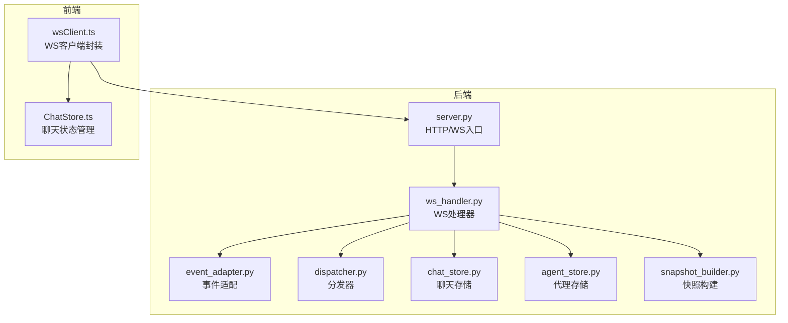
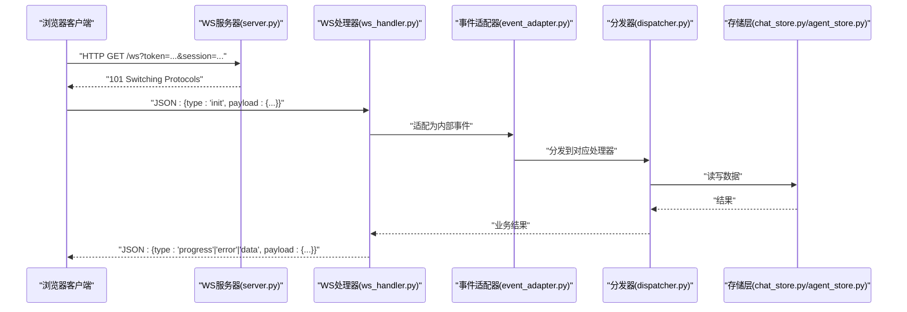
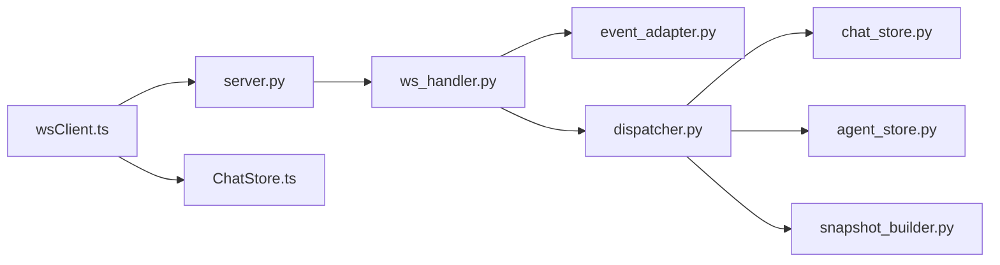

# WebSocket API

<cite>
**本文引用的文件**   
- [ws_handler.py](file://opc/plugins/office_ui/ws_handler.py)
- [server.py](file://opc/plugins/office_ui/server.py)
- [event_adapter.py](file://opc/plugins/office_ui/event_adapter.py)
- [dispatcher.py](file://opc/plugins/office_ui/dispatcher.py)
- [chat_store.py](file://opc/plugins/office_ui/chat_store.py)
- [agent_store.py](file://opc/plugins/office_ui/agent_store.py)
- [snapshot_builder.py](file://opc/plugins/office_ui/snapshot_builder.py)
- [wsClient.ts](file://opc/plugins/office_ui/frontend_src/lib/wsClient.ts)
- [ChatStore.ts](file://opc/plugins/office_ui/frontend_src/chat/ChatStore.ts)
- [test_ws_handler_progress_parsing.py](file://tests/test_ws_handler_progress_parsing.py)
- [test_ws_handler_escalations.py](file://tests/test_ws_handler_escalations.py)
</cite>

## 目录
1. [简介](#简介)
2. [项目结构](#项目结构)
3. [核心组件](#核心组件)
4. [架构总览](#架构总览)
5. [详细组件分析](#详细组件分析)
6. [依赖关系分析](#依赖关系分析)
7. [性能考虑](#性能考虑)
8. [故障排查指南](#故障排查指南)
9. [结论](#结论)
10. [附录](#附录)

## 简介
本技术文档面向OpenOPC的WebSocket API，聚焦于：
- WebSocket连接建立、握手协议与连接管理
- 消息格式规范（事件类型、消息结构、序列化/反序列化规则）
- 实时通信模式（双向消息传递、事件订阅与发布）
- 连接状态管理、断线重连与错误处理策略
- 完整的消息交换示例与JavaScript客户端实现要点
- 性能优化技巧与最佳实践
- 调试工具与监控方法

目标是帮助开发者快速构建高效、稳定的实时通信功能。

## 项目结构
与WebSocket API相关的后端与前端关键位置如下：
- 后端服务与WS路由：server.py、ws_handler.py
- 事件适配与分发：event_adapter.py、dispatcher.py
- 业务数据与快照：chat_store.py、agent_store.py、snapshot_builder.py
- 前端WS客户端与聊天状态：wsClient.ts、ChatStore.ts
- 测试用例：test_ws_handler_progress_parsing.py、test_ws_handler_escalations.py

图表来源
- [server.py](file://opc/plugins/office_ui/server.py)
- [ws_handler.py](file://opc/plugins/office_ui/ws_handler.py)
- [event_adapter.py](file://opc/plugins/office_ui/event_adapter.py)
- [dispatcher.py](file://opc/plugins/office_ui/dispatcher.py)
- [chat_store.py](file://opc/plugins/office_ui/chat_store.py)
- [agent_store.py](file://opc/plugins/office_ui/agent_store.py)
- [snapshot_builder.py](file://opc/plugins/office_ui/snapshot_builder.py)
- [wsClient.ts](file://opc/plugins/office_ui/frontend_src/lib/wsClient.ts)
- [ChatStore.ts](file://opc/plugins/office_ui/frontend_src/chat/ChatStore.ts)

章节来源
- [server.py](file://opc/plugins/office_ui/server.py)
- [ws_handler.py](file://opc/plugins/office_ui/ws_handler.py)
- [event_adapter.py](file://opc/plugins/office_ui/event_adapter.py)
- [dispatcher.py](file://opc/plugins/office_ui/dispatcher.py)
- [chat_store.py](file://opc/plugins/office_ui/chat_store.py)
- [agent_store.py](file://opc/plugins/office_ui/agent_store.py)
- [snapshot_builder.py](file://opc/plugins/office_ui/snapshot_builder.py)
- [wsClient.ts](file://opc/plugins/office_ui/frontend_src/lib/wsClient.ts)
- [ChatStore.ts](file://opc/plugins/office_ui/frontend_src/chat/ChatStore.ts)

## 核心组件
- WS服务器与路由：负责HTTP升级至WebSocket、生命周期管理与会话绑定
- WS处理器：解析入站消息、路由到具体业务逻辑、推送出站消息
- 事件适配器：将内部事件转换为统一的WS消息格式
- 分发器：根据事件类型进行任务派发与编排
- 存储层：聊天与代理相关数据的持久化与查询
- 快照构建器：生成一致性快照用于初始化或增量同步
- 前端WS客户端：封装连接、心跳、重连、编解码与事件回调

章节来源
- [ws_handler.py](file://opc/plugins/office_ui/ws_handler.py)
- [event_adapter.py](file://opc/plugins/office_ui/event_adapter.py)
- [dispatcher.py](file://opc/plugins/office_ui/dispatcher.py)
- [chat_store.py](file://opc/plugins/office_ui/chat_store.py)
- [agent_store.py](file://opc/plugins/office_ui/agent_store.py)
- [snapshot_builder.py](file://opc/plugins/office_ui/snapshot_builder.py)
- [wsClient.ts](file://opc/plugins/office_ui/frontend_src/lib/wsClient.ts)

## 架构总览
WebSocket在浏览器与后端之间提供全双工通道。典型流程包括：
- 客户端发起HTTP请求并携带必要的握手参数（如会话标识、鉴权信息）
- 服务端完成握手后返回101切换协议
- 双方基于统一的消息协议进行双向通信
- 服务端通过事件适配器与分发器驱动业务逻辑，并将结果推送到客户端
- 客户端维护连接状态、自动重连与消息队列

图表来源
- [server.py](file://opc/plugins/office_ui/server.py)
- [ws_handler.py](file://opc/plugins/office_ui/ws_handler.py)
- [event_adapter.py](file://opc/plugins/office_ui/event_adapter.py)
- [dispatcher.py](file://opc/plugins/office_ui/dispatcher.py)
- [chat_store.py](file://opc/plugins/office_ui/chat_store.py)
- [agent_store.py](file://opc/plugins/office_ui/agent_store.py)

## 详细组件分析

### WS服务器与路由（server.py）
- 职责：注册HTTP与WS路由、启动服务、处理跨域与安全策略
- 关键点：
  - 监听端口与路径配置
  - 中间件链（鉴权、限流、日志）
  - 将HTTP请求升级为WebSocket连接
- 建议：
  - 使用反向代理（Nginx/Traefik）管理TLS终止与连接池
  - 对WS路径启用访问控制与速率限制

章节来源
- [server.py](file://opc/plugins/office_ui/server.py)

### WS处理器（ws_handler.py）
- 职责：接收与发送消息、维护连接上下文、调用业务逻辑
- 关键点：
  - 消息解析与校验（类型、必需字段、签名/鉴权）
  - 连接生命周期（on_open/on_message/on_close）
  - 错误码与异常映射
  - 心跳保活与空闲超时
- 建议：
  - 严格区分系统消息与业务消息
  - 对大消息进行分片与压缩
  - 记录结构化日志（包含traceId、sessionId）

章节来源
- [ws_handler.py](file://opc/plugins/office_ui/ws_handler.py)

### 事件适配器（event_adapter.py）
- 职责：将外部WS消息转换为内部事件对象，或将内部事件序列化为WS消息
- 关键点：
  - 事件命名空间与版本兼容
  - 字段映射与默认值填充
  - 校验失败时的错误响应构造
- 建议：
  - 采用向后兼容的schema演进策略
  - 对未知字段进行白名单过滤

章节来源
- [event_adapter.py](file://opc/plugins/office_ui/event_adapter.py)

### 分发器（dispatcher.py）
- 职责：根据事件类型路由到具体处理器，协调异步执行与结果聚合
- 关键点：
  - 处理器注册表与优先级
  - 并发控制与背压
  - 事务边界与补偿机制
- 建议：
  - 对耗时操作引入队列与重试
  - 使用幂等键避免重复处理

章节来源
- [dispatcher.py](file://opc/plugins/office_ui/dispatcher.py)

### 存储层（chat_store.py, agent_store.py）
- 职责：持久化聊天历史、代理状态、会话元数据等
- 关键点：
  - 读写一致性与索引设计
  - 分页与游标
  - 清理与归档策略
- 建议：
  - 热点数据缓存（内存/Redis）
  - 写放大场景下采用批写入

章节来源
- [chat_store.py](file://opc/plugins/office_ui/chat_store.py)
- [agent_store.py](file://opc/plugins/office_ui/agent_store.py)

### 快照构建器（snapshot_builder.py）
- 职责：生成一致的快照用于初始化或增量同步
- 关键点：
  - 快照粒度与范围
  - 版本号与变更追踪
  - 增量合并策略
- 建议：
  - 快照压缩与去重
  - 冷备与恢复演练

章节来源
- [snapshot_builder.py](file://opc/plugins/office_ui/snapshot_builder.py)

### 前端WS客户端（wsClient.ts）
- 职责：封装连接、心跳、重连、编解码、事件回调
- 关键点：
  - 连接状态机（connecting/open/closed/reconnecting）
  - 心跳检测与超时处理
  - 断线重连退避策略
  - 消息队列与顺序保证
- 建议：
  - 对UI渲染进行节流与批量更新
  - 错误上报与用户提示

章节来源
- [wsClient.ts](file://opc/plugins/office_ui/frontend_src/lib/wsClient.ts)

### 前端聊天状态（ChatStore.ts）
- 职责：维护聊天列表、消息排序、未读计数、本地缓存
- 关键点：
  - 与WS事件联动更新
  - 乐观更新与回滚
  - 分页加载与虚拟滚动
- 建议：
  - 使用不可变数据结构提升渲染性能
  - 对长列表做窗口化渲染

章节来源
- [ChatStore.ts](file://opc/plugins/office_ui/frontend_src/chat/ChatStore.ts)

## 依赖关系分析
- server.py作为入口，依赖ws_handler.py进行WS处理
- ws_handler.py依赖event_adapter.py与dispatcher.py进行事件适配与分发
- dispatcher.py可能依赖chat_store.py、agent_store.py与snapshot_builder.py进行数据读写与快照生成
- 前端wsClient.ts与服务端server.py建立WS连接，并通过ChatStore.ts管理UI状态

图表来源
- [server.py](file://opc/plugins/office_ui/server.py)
- [ws_handler.py](file://opc/plugins/office_ui/ws_handler.py)
- [event_adapter.py](file://opc/plugins/office_ui/event_adapter.py)
- [dispatcher.py](file://opc/plugins/office_ui/dispatcher.py)
- [chat_store.py](file://opc/plugins/office_ui/chat_store.py)
- [agent_store.py](file://opc/plugins/office_ui/agent_store.py)
- [snapshot_builder.py](file://opc/plugins/office_ui/snapshot_builder.py)
- [wsClient.ts](file://opc/plugins/office_ui/frontend_src/lib/wsClient.ts)
- [ChatStore.ts](file://opc/plugins/office_ui/frontend_src/chat/ChatStore.ts)

章节来源
- [server.py](file://opc/plugins/office_ui/server.py)
- [ws_handler.py](file://opc/plugins/office_ui/ws_handler.py)
- [event_adapter.py](file://opc/plugins/office_ui/event_adapter.py)
- [dispatcher.py](file://opc/plugins/office_ui/dispatcher.py)
- [chat_store.py](file://opc/plugins/office_ui/chat_store.py)
- [agent_store.py](file://opc/plugins/office_ui/agent_store.py)
- [snapshot_builder.py](file://opc/plugins/office_ui/snapshot_builder.py)
- [wsClient.ts](file://opc/plugins/office_ui/frontend_src/lib/wsClient.ts)
- [ChatStore.ts](file://opc/plugins/office_ui/frontend_src/chat/ChatStore.ts)

## 性能考虑
- 连接与资源
  - 合理设置最大连接数与每进程工作线程数
  - 使用连接池与复用底层TCP连接
- 消息与序列化
  - 优先使用轻量JSON；对大负载启用gzip/deflate
  - 对高频小消息进行合并与批量推送
- 存储与缓存
  - 热点数据缓存，减少数据库压力
  - 分页与游标避免全量拉取
- 前端渲染
  - 虚拟列表与增量更新
  - 防抖/节流降低UI抖动
- 网络与代理
  - 反向代理开启HTTP/2与连接复用
  - 合理配置超时与重试

[本节为通用指导，不直接分析具体文件]

## 故障排查指南
- 常见问题定位
  - 握手失败：检查鉴权参数、跨域配置、代理转发
  - 频繁断线：检查心跳间隔、空闲超时、网络质量
  - 消息乱序：确认客户端是否维护顺序队列与重放保护
  - 性能瓶颈：观察CPU/IO/DB指标，定位慢查询与锁竞争
- 日志与监控
  - 结构化日志（traceId、sessionId、eventType）
  - 指标采集（连接数、消息吞吐、延迟分布、错误率）
  - 链路追踪（从前端到后端各阶段耗时）
- 测试与验证
  - 进度解析与错误分支覆盖
  - 升级与降级兼容性回归

章节来源
- [test_ws_handler_progress_parsing.py](file://tests/test_ws_handler_progress_parsing.py)
- [test_ws_handler_escalations.py](file://tests/test_ws_handler_escalations.py)

## 结论
通过清晰的WS握手与消息协议、稳健的连接管理与错误处理、以及前后端的协同优化，OpenOPC的WebSocket API能够提供高可靠、低延迟的实时通信能力。建议在生产环境结合反向代理、监控告警与自动化测试，持续提升稳定性与可观测性。

[本节为总结性内容，不直接分析具体文件]

## 附录

### 连接建立与握手协议
- 客户端发起HTTP请求，携带必要参数（如token、session）
- 服务端校验通过后返回101切换协议
- 首次消息通常为初始化指令，携带会话上下文与能力协商

章节来源
- [server.py](file://opc/plugins/office_ui/server.py)
- [ws_handler.py](file://opc/plugins/office_ui/ws_handler.py)

### 消息格式规范
- 基础结构
  - type：消息类型（如init、progress、error、data、ack）
  - payload：业务载荷，按事件类型定义字段
  - meta：可选元数据（traceId、version、timestamp）
- 序列化/反序列化
  - JSON为主，必要时使用二进制扩展
  - 严格校验必填字段与类型，未知字段忽略或拒绝
- 事件类型
  - 系统事件：连接、心跳、错误
  - 业务事件：进度、结果、通知、命令
- 错误码
  - 统一错误码与人类可读消息
  - 区分客户端错误与服务端错误

章节来源
- [event_adapter.py](file://opc/plugins/office_ui/event_adapter.py)
- [ws_handler.py](file://opc/plugins/office_ui/ws_handler.py)

### 实时通信模式
- 双向消息传递
  - 客户端主动发起请求，服务端异步处理并推送结果
- 事件订阅与发布
  - 客户端声明订阅主题，服务端按条件推送
- 确认与重试
  - 重要消息需ACK；失败时指数退避重试

章节来源
- [dispatcher.py](file://opc/plugins/office_ui/dispatcher.py)
- [wsClient.ts](file://opc/plugins/office_ui/frontend_src/lib/wsClient.ts)

### 连接状态管理、断线重连与错误处理
- 状态机
  - connecting → open → closed/reconnecting
- 心跳与保活
  - 定期ping/pong，超时触发重连
- 重连策略
  - 指数退避+抖动，上限次数与最长等待时间
- 错误处理
  - 分类错误（网络、鉴权、业务），差异化提示与重试

章节来源
- [wsClient.ts](file://opc/plugins/office_ui/frontend_src/lib/wsClient.ts)
- [ws_handler.py](file://opc/plugins/office_ui/ws_handler.py)

### 完整消息交换示例（文字描述）
- 初始化
  - 客户端：{type:"init", payload:{session, token}, meta:{traceId}}
  - 服务端：{type:"init_ack", payload:{sessionId, version}, meta:{traceId}}
- 进度推送
  - 服务端：{type:"progress", payload:{step, percent, detail}, meta:{traceId}}
- 错误通知
  - 服务端：{type:"error", payload:{code, message}, meta:{traceId}}
- 业务数据
  - 服务端：{type:"data", payload:{items:[], cursor}, meta:{traceId}}
- 客户端确认
  - 客户端：{type:"ack", payload:{messageId}, meta:{traceId}}

章节来源
- [ws_handler.py](file://opc/plugins/office_ui/ws_handler.py)
- [event_adapter.py](file://opc/plugins/office_ui/event_adapter.py)

### JavaScript客户端实现要点（参考路径）
- 连接与事件
  - 使用wsClient.ts中的封装类进行连接、订阅与回调注册
- 状态与UI
  - 通过ChatStore.ts管理消息列表与未读状态
- 重连与健壮性
  - 利用内置重连策略与心跳机制，确保用户体验

章节来源
- [wsClient.ts](file://opc/plugins/office_ui/frontend_src/lib/wsClient.ts)
- [ChatStore.ts](file://opc/plugins/office_ui/frontend_src/chat/ChatStore.ts)

### 调试工具与监控方法
- 本地调试
  - 浏览器开发者工具Network面板查看WS帧
  - 服务端日志输出traceId关联请求链路
- 生产监控
  - 指标：连接数、消息QPS、P95/P99延迟、错误率
  - 告警：连接中断、错误率突增、延迟飙升
- 问题复现
  - 录制WS会话并重放
  - 使用最小化用例隔离问题

章节来源
- [test_ws_handler_progress_parsing.py](file://tests/test_ws_handler_progress_parsing.py)
- [test_ws_handler_escalations.py](file://tests/test_ws_handler_escalations.py)