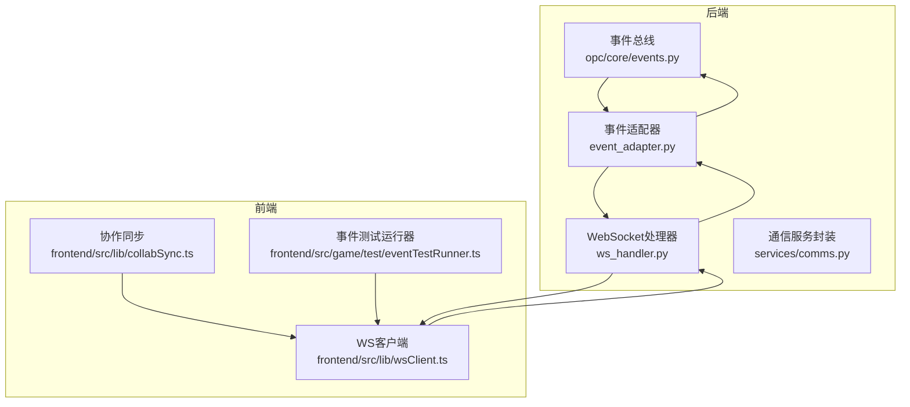
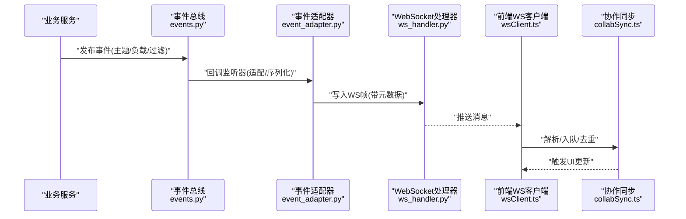
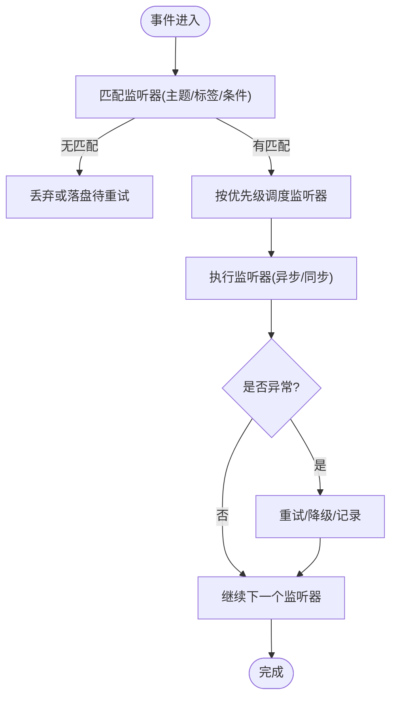
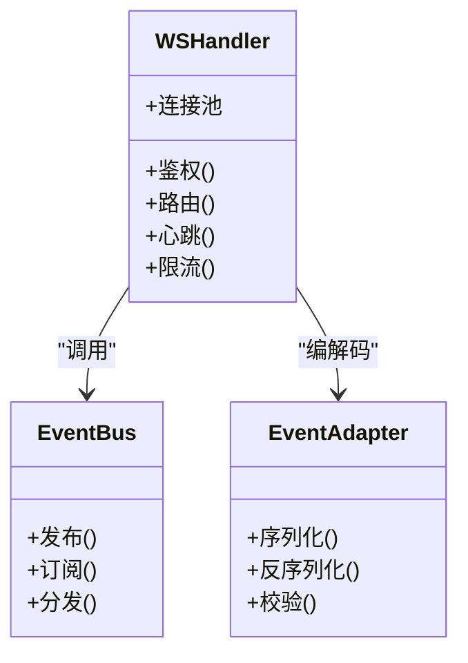
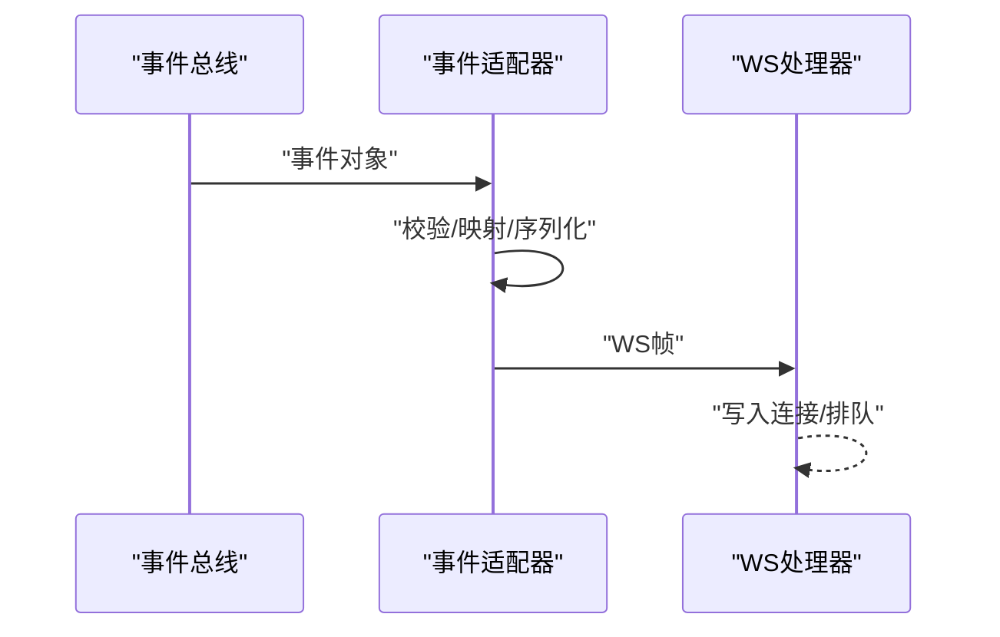
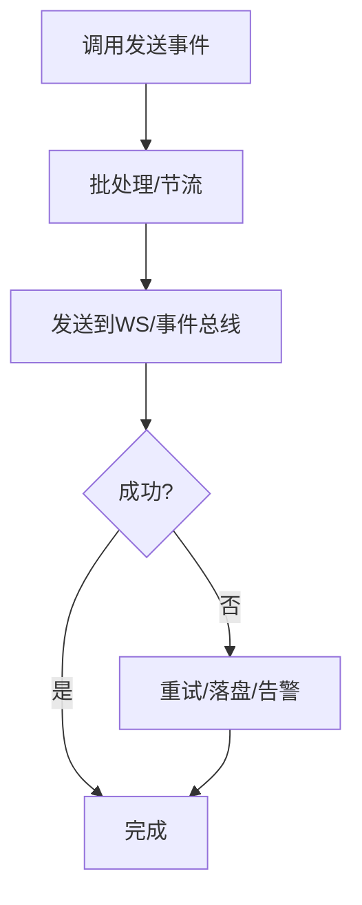
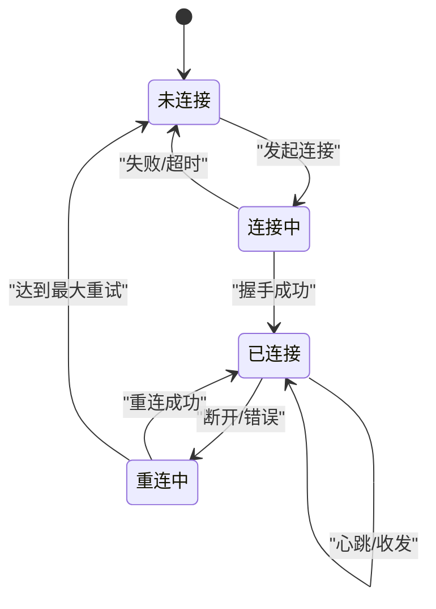
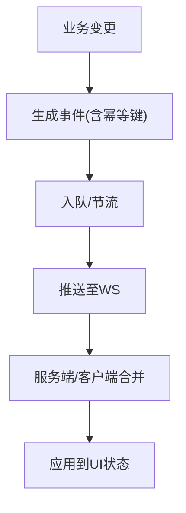
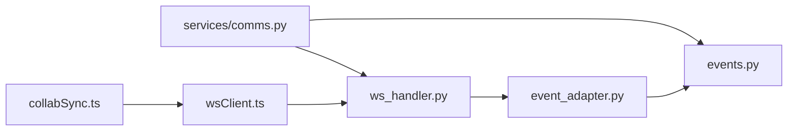

# 事件系统

<cite>
**本文引用的文件**   
- [opc/core/events.py](file://opc/core/events.py)
- [opc/plugins/office_ui/ws_handler.py](file://opc/plugins/office_ui/ws_handler.py)
- [opc/plugins/office_ui/event_adapter.py](file://opc/plugins/office_ui/event_adapter.py)
- [opc/plugins/office_ui/services/comms.py](file://opc/plugins/office_ui/services/comms.py)
- [opc/plugins/office_ui/frontend_src/lib/wsClient.ts](file://opc/plugins/office_ui/frontend_src/lib/wsClient.ts)
- [opc/plugins/office_ui/frontend_src/lib/collabSync.ts](file://opc/plugins/office_ui/frontend_src/lib/collabSync.ts)
- [opc/plugins/office_ui/frontend_src/game/test/eventTestRunner.ts](file://opc/plugins/office_ui/frontend_src/game/test/eventTestRunner.ts)
</cite>

## 目录
1. [简介](#简介)
2. [项目结构](#项目结构)
3. [核心组件](#核心组件)
4. [架构总览](#架构总览)
5. [详细组件分析](#详细组件分析)
6. [依赖关系分析](#依赖关系分析)
7. [性能考虑](#性能考虑)
8. [故障排查指南](#故障排查指南)
9. [结论](#结论)
10. [附录](#附录)

## 简介
本文件面向OpenOPC的WebSocket事件系统，聚焦于后端事件发布订阅机制、前端WebSocket客户端与UI层的事件桥接。文档围绕以下目标展开：
- 事件注册、监听器管理与事件分发流程
- 事件生命周期（创建到处理）
- 事件过滤与条件匹配
- 批处理与节流策略
- 完整示例与最佳实践
- 持久化、重试与错误恢复策略
- 高效可靠的事件驱动通信实现建议

## 项目结构
事件系统贯穿后端核心事件总线、Office UI插件的WebSocket处理器与适配器、以及前端的WS客户端与协作同步模块。关键路径如下：
- 后端事件总线：opc/core/events.py
- WebSocket接入与路由：opc/plugins/office_ui/ws_handler.py
- 事件适配与转换：opc/plugins/office_ui/event_adapter.py
- 服务层通信封装：opc/plugins/office_ui/services/comms.py
- 前端WS客户端：opc/plugins/office_ui/frontend_src/lib/wsClient.ts
- 前端协作同步：opc/plugins/office_ui/frontend_src/lib/collabSync.ts
- 前端事件测试运行器：opc/plugins/office_ui/frontend_src/game/test/eventTestRunner.ts

图表来源
- [opc/core/events.py](file://opc/core/events.py)
- [opc/plugins/office_ui/ws_handler.py](file://opc/plugins/office_ui/ws_handler.py)
- [opc/plugins/office_ui/event_adapter.py](file://opc/plugins/office_ui/event_adapter.py)
- [opc/plugins/office_ui/services/comms.py](file://opc/plugins/office_ui/services/comms.py)
- [opc/plugins/office_ui/frontend_src/lib/wsClient.ts](file://opc/plugins/office_ui/frontend_src/lib/wsClient.ts)
- [opc/plugins/office_ui/frontend_src/lib/collabSync.ts](file://opc/plugins/office_ui/frontend_src/lib/collabSync.ts)
- [opc/plugins/office_ui/frontend_src/game/test/eventTestRunner.ts](file://opc/plugins/office_ui/frontend_src/game/test/eventTestRunner.ts)

章节来源
- [opc/core/events.py](file://opc/core/events.py)
- [opc/plugins/office_ui/ws_handler.py](file://opc/plugins/office_ui/ws_handler.py)
- [opc/plugins/office_ui/event_adapter.py](file://opc/plugins/office_ui/event_adapter.py)
- [opc/plugins/office_ui/services/comms.py](file://opc/plugins/office_ui/services/comms.py)
- [opc/plugins/office_ui/frontend_src/lib/wsClient.ts](file://opc/plugins/office_ui/frontend_src/lib/wsClient.ts)
- [opc/plugins/office_ui/frontend_src/lib/collabSync.ts](file://opc/plugins/office_ui/frontend_src/lib/collabSync.ts)
- [opc/plugins/office_ui/frontend_src/game/test/eventTestRunner.ts](file://opc/plugins/office_ui/frontend_src/game/test/eventTestRunner.ts)

## 核心组件
- 事件总线（后端）
  - 职责：提供事件类型定义、注册监听器、按主题/标签分发事件、支持过滤与优先级。
  - 关键点：监听器集合管理、匹配规则、异步派发、错误隔离。
- WebSocket处理器（后端）
  - 职责：维护连接上下文、鉴权与会话绑定、消息编解码、转发至事件总线或业务服务。
  - 关键点：连接生命周期、心跳保活、断线重连触发、限流与背压。
- 事件适配器（后端）
  - 职责：将领域事件转换为WS协议帧、统一序列化格式、附加元数据（会话ID、时间戳、追踪ID）。
  - 关键点：兼容多版本协议、字段映射、校验与降级。
- 通信服务封装（后端）
  - 职责：为上层业务提供统一的“发送事件”接口，屏蔽底层WS细节。
  - 关键点：批量发送、重试与退避、失败回退。
- 前端WS客户端
  - 职责：建立与维护WS连接、消息队列、自动重连、去抖与节流、本地缓存。
  - 关键点：连接状态机、消息顺序保证、离线缓冲。
- 协作同步（前端）
  - 职责：将业务变更转化为事件并推送，合并冲突，保持UI一致性。
  - 关键点：操作序列号、幂等性、增量同步。
- 事件测试运行器（前端）
  - 职责：模拟事件流、验证订阅与分发逻辑、回归测试。
  - 关键点：可插拔事件源、断言框架集成。

章节来源
- [opc/core/events.py](file://opc/core/events.py)
- [opc/plugins/office_ui/ws_handler.py](file://opc/plugins/office_ui/ws_handler.py)
- [opc/plugins/office_ui/event_adapter.py](file://opc/plugins/office_ui/event_adapter.py)
- [opc/plugins/office_ui/services/comms.py](file://opc/plugins/office_ui/services/comms.py)
- [opc/plugins/office_ui/frontend_src/lib/wsClient.ts](file://opc/plugins/office_ui/frontend_src/lib/wsClient.ts)
- [opc/plugins/office_ui/frontend_src/lib/collabSync.ts](file://opc/plugins/office_ui/frontend_src/lib/collabSync.ts)
- [opc/plugins/office_ui/frontend_src/game/test/eventTestRunner.ts](file://opc/plugins/office_ui/frontend_src/game/test/eventTestRunner.ts)

## 架构总览
下图展示了从业务侧产生事件到前端渲染的端到端流程，包括适配、分发、传输与消费环节。

图表来源
- [opc/core/events.py](file://opc/core/events.py)
- [opc/plugins/office_ui/event_adapter.py](file://opc/plugins/office_ui/event_adapter.py)
- [opc/plugins/office_ui/ws_handler.py](file://opc/plugins/office_ui/ws_handler.py)
- [opc/plugins/office_ui/frontend_src/lib/wsClient.ts](file://opc/plugins/office_ui/frontend_src/lib/wsClient.ts)
- [opc/plugins/office_ui/frontend_src/lib/collabSync.ts](file://opc/plugins/office_ui/frontend_src/lib/collabSync.ts)

## 详细组件分析

### 事件总线（后端）
- 设计要点
  - 监听器注册：支持按主题精确匹配、通配符匹配与标签过滤。
  - 分发策略：同步/异步两种模式；高优先级监听器优先执行；异常隔离避免影响其他监听器。
  - 生命周期：事件对象包含唯一ID、时间戳、来源、负载与扩展元数据。
- 复杂度与优化
  - 匹配阶段采用索引+过滤器链，降低全量扫描成本。
  - 对热点主题使用分片监听器表，提升并发性能。
- 错误处理
  - 单个监听器异常不影响整体分发；记录错误上下文并上报。
  - 支持重试策略（指数退避）与死信通道。

图表来源
- [opc/core/events.py](file://opc/core/events.py)

章节来源
- [opc/core/events.py](file://opc/core/events.py)

### WebSocket处理器（后端）
- 职责边界
  - 连接管理：握手、鉴权、会话绑定、心跳检测、优雅关闭。
  - 消息路由：根据消息类型路由至事件总线或具体业务处理器。
  - 流量控制：基于连接维度的速率限制与背压。
- 可靠性
  - 断线重连：服务端主动断开时返回重连提示码；客户端依据策略重试。
  - 幂等处理：对重复消息进行去重（基于消息ID）。
- 安全
  - 鉴权令牌校验、来源IP白名单、敏感字段脱敏。

图表来源
- [opc/plugins/office_ui/ws_handler.py](file://opc/plugins/office_ui/ws_handler.py)
- [opc/core/events.py](file://opc/core/events.py)
- [opc/plugins/office_ui/event_adapter.py](file://opc/plugins/office_ui/event_adapter.py)

章节来源
- [opc/plugins/office_ui/ws_handler.py](file://opc/plugins/office_ui/ws_handler.py)

### 事件适配器（后端）
- 功能说明
  - 将领域事件转换为WS协议帧，附加会话ID、追踪ID、版本号等元数据。
  - 提供向后兼容的字段映射与降级策略。
- 性能与安全
  - 批量打包减少网络往返。
  - 输入校验与大小限制，防止恶意负载。

图表来源
- [opc/plugins/office_ui/event_adapter.py](file://opc/plugins/office_ui/event_adapter.py)
- [opc/plugins/office_ui/ws_handler.py](file://opc/plugins/office_ui/ws_handler.py)

章节来源
- [opc/plugins/office_ui/event_adapter.py](file://opc/plugins/office_ui/event_adapter.py)

### 通信服务封装（后端）
- 能力
  - 对外暴露统一的“发送事件”API，内部组合事件总线与WS处理器。
  - 支持批量发送、重试与退避、失败回退（如落库）。
- 适用场景
  - 业务服务无需感知WS细节，专注事件语义。

图表来源
- [opc/plugins/office_ui/services/comms.py](file://opc/plugins/office_ui/services/comms.py)

章节来源
- [opc/plugins/office_ui/services/comms.py](file://opc/plugins/office_ui/services/comms.py)

### 前端WS客户端
- 连接管理
  - 自动重连、指数退避、最大重试次数、连接超时。
  - 心跳保活与空闲清理。
- 消息处理
  - 入队与出队、顺序保证、去重与幂等。
  - 本地缓存与离线恢复。
- 用户体验
  - 节流与防抖，避免高频事件导致UI抖动。

图表来源
- [opc/plugins/office_ui/frontend_src/lib/wsClient.ts](file://opc/plugins/office_ui/frontend_src/lib/wsClient.ts)

章节来源
- [opc/plugins/office_ui/frontend_src/lib/wsClient.ts](file://opc/plugins/office_ui/frontend_src/lib/wsClient.ts)

### 协作同步（前端）
- 职责
  - 将业务变更转为事件，合并冲突，确保UI一致性与最终一致性。
  - 维护操作序列号，支持增量同步与回放。
- 策略
  - 幂等键、去重窗口、冲突解决策略（最后写入胜出或自定义合并）。

图表来源
- [opc/plugins/office_ui/frontend_src/lib/collabSync.ts](file://opc/plugins/office_ui/frontend_src/lib/collabSync.ts)

章节来源
- [opc/plugins/office_ui/frontend_src/lib/collabSync.ts](file://opc/plugins/office_ui/frontend_src/lib/collabSync.ts)

### 事件测试运行器（前端）
- 用途
  - 模拟事件源，验证订阅与分发逻辑，覆盖边界条件与异常路径。
- 特性
  - 可插拔事件源、断言集成、可视化输出。

章节来源
- [opc/plugins/office_ui/frontend_src/game/test/eventTestRunner.ts](file://opc/plugins/office_ui/frontend_src/game/test/eventTestRunner.ts)

## 依赖关系分析
- 耦合度
  - ws_handler与event_adapter强耦合（编解码），通过接口抽象降低变更影响。
  - comms作为门面，解耦业务与WS细节。
- 外部依赖
  - 事件总线为核心依赖，所有WS相关事件均经过其分发。
- 潜在循环
  - 避免WS处理器直接依赖业务服务，应通过comms或事件总线间接调用。

图表来源
- [opc/plugins/office_ui/ws_handler.py](file://opc/plugins/office_ui/ws_handler.py)
- [opc/plugins/office_ui/event_adapter.py](file://opc/plugins/office_ui/event_adapter.py)
- [opc/core/events.py](file://opc/core/events.py)
- [opc/plugins/office_ui/services/comms.py](file://opc/plugins/office_ui/services/comms.py)
- [opc/plugins/office_ui/frontend_src/lib/wsClient.ts](file://opc/plugins/office_ui/frontend_src/lib/wsClient.ts)
- [opc/plugins/office_ui/frontend_src/lib/collabSync.ts](file://opc/plugins/office_ui/frontend_src/lib/collabSync.ts)

章节来源
- [opc/plugins/office_ui/ws_handler.py](file://opc/plugins/office_ui/ws_handler.py)
- [opc/plugins/office_ui/event_adapter.py](file://opc/plugins/office_ui/event_adapter.py)
- [opc/core/events.py](file://opc/core/events.py)
- [opc/plugins/office_ui/services/comms.py](file://opc/plugins/office_ui/services/comms.py)
- [opc/plugins/office_ui/frontend_src/lib/wsClient.ts](file://opc/plugins/office_ui/frontend_src/lib/wsClient.ts)
- [opc/plugins/office_ui/frontend_src/lib/collabSync.ts](file://opc/plugins/office_ui/frontend_src/lib/collabSync.ts)

## 性能考虑
- 事件分发
  - 热点主题分片监听器表，避免单点瓶颈。
  - 异步派发与批量处理，减少锁竞争。
- 传输层
  - 压缩与二进制编码（可选），降低带宽占用。
  - 连接级限流与全局背压，保护服务端稳定性。
- 前端
  - 节流与防抖，合并相近变更。
  - 本地缓存与增量同步，减少全量拉取。

[本节为通用指导，不直接分析具体文件]

## 故障排查指南
- 常见问题
  - 连接频繁断开：检查心跳配置、网络质量与服务端限流策略。
  - 事件丢失：确认事件ID幂等、重试与死信通道是否启用。
  - 事件乱序：检查客户端出队顺序与服务端写入顺序一致性。
- 定位手段
  - 查看WS处理器日志中的连接与消息ID。
  - 在事件适配器增加字段校验与版本兼容性日志。
  - 使用前端测试运行器复现问题路径。

章节来源
- [opc/plugins/office_ui/ws_handler.py](file://opc/plugins/office_ui/ws_handler.py)
- [opc/plugins/office_ui/event_adapter.py](file://opc/plugins/office_ui/event_adapter.py)
- [opc/plugins/office_ui/frontend_src/game/test/eventTestRunner.ts](file://opc/plugins/office_ui/frontend_src/game/test/eventTestRunner.ts)

## 结论
通过事件总线与WebSocket适配器的分层设计，OpenOPC实现了可扩展、高性能且可靠的事件驱动通信。结合批处理、节流、重试与幂等策略，可在复杂业务场景中保障事件的一致性与实时性。建议在新增事件类型时遵循统一适配器规范，并在前端引入节流与去重，以获得更稳定的用户体验。

[本节为总结，不直接分析具体文件]

## 附录
- 示例与最佳实践
  - 事件注册与监听：在后端通过事件总线注册监听器，指定主题与过滤条件；在前端通过WS客户端订阅对应频道。
  - 批处理与节流：在服务端对高频事件进行聚合；在前端对UI更新进行节流，避免抖动。
  - 持久化与重试：对关键事件落盘，配合重试与死信通道，确保最终可达。
  - 错误恢复：连接断开后指数退避重连；事件处理异常时记录上下文并告警。
- 参考路径
  - 后端事件总线：[opc/core/events.py](file://opc/core/events.py)
  - WebSocket处理器：[opc/plugins/office_ui/ws_handler.py](file://opc/plugins/office_ui/ws_handler.py)
  - 事件适配器：[opc/plugins/office_ui/event_adapter.py](file://opc/plugins/office_ui/event_adapter.py)
  - 通信服务封装：[opc/plugins/office_ui/services/comms.py](file://opc/plugins/office_ui/services/comms.py)
  - 前端WS客户端：[opc/plugins/office_ui/frontend_src/lib/wsClient.ts](file://opc/plugins/office_ui/frontend_src/lib/wsClient.ts)
  - 协作同步：[opc/plugins/office_ui/frontend_src/lib/collabSync.ts](file://opc/plugins/office_ui/frontend_src/lib/collabSync.ts)
  - 事件测试运行器：[opc/plugins/office_ui/frontend_src/game/test/eventTestRunner.ts](file://opc/plugins/office_ui/frontend_src/game/test/eventTestRunner.ts)