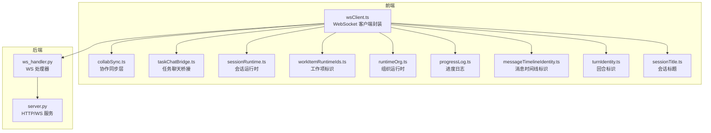
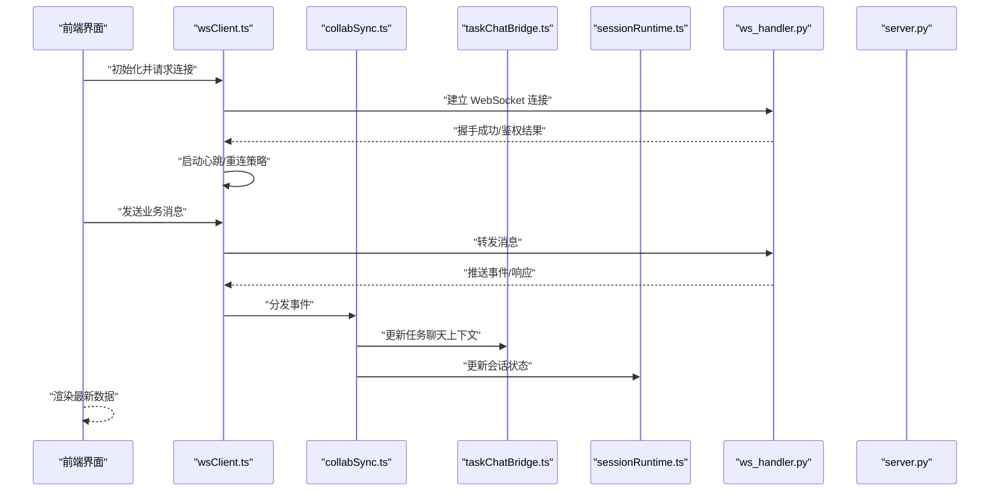
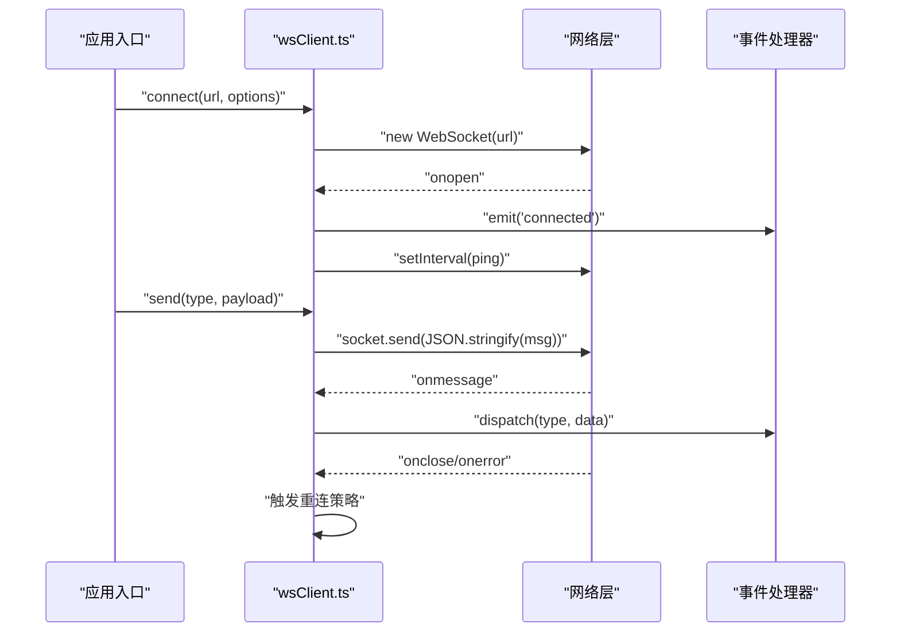
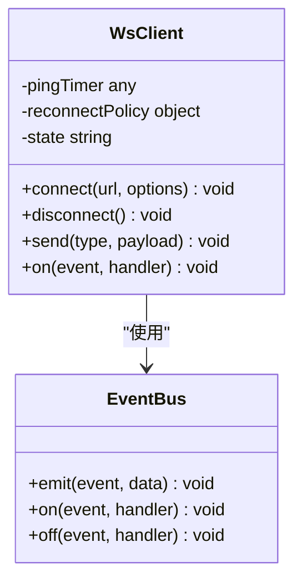
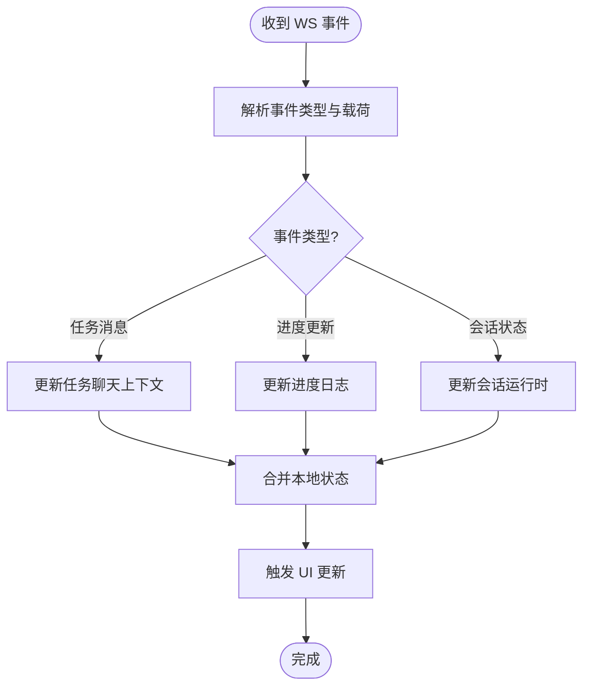
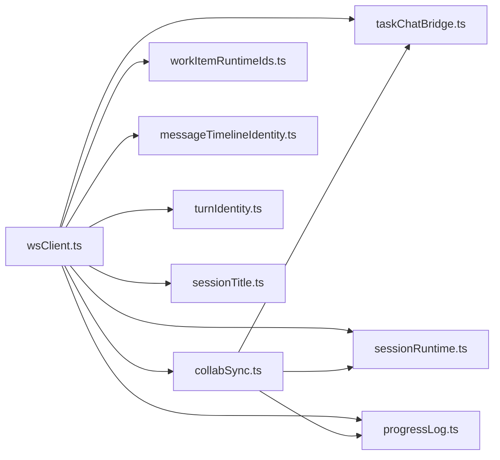

# 客户端集成

<cite>
**本文引用的文件**   
- [wsClient.ts](file://opc/plugins/office_ui/frontend_src/lib/wsClient.ts)
- [wsClient.test.ts](file://opc/plugins/office_ui/frontend_src/lib/wsClient.test.ts)
- [collabSync.ts](file://opc/plugins/office_ui/frontend_src/lib/collabSync.ts)
- [taskChatBridge.ts](file://opc/plugins/office_ui/frontend_src/lib/taskChatBridge.ts)
- [sessionRuntime.ts](file://opc/plugins/office_ui/frontend_src/lib/sessionRuntime.ts)
- [workItemRuntimeIds.ts](file://opc/plugins/office_ui/frontend_src/lib/workItemRuntimeIds.ts)
- [runtimeOrg.ts](file://opc/plugins/office_ui/frontend_src/lib/runtimeOrg.ts)
- [progressLog.ts](file://opc/plugins/office_ui/frontend_src/lib/progressLog.ts)
- [messageTimelineIdentity.ts](file://opc/plugins/office_ui/frontend_src/lib/messageTimelineIdentity.ts)
- [turnIdentity.ts](file://opc/plugins/office_ui/frontend_src/lib/turnIdentity.ts)
- [sessionTitle.ts](file://opc/plugins/office_ui/frontend_src/lib/sessionTitle.ts)
- [ws_handler.py](file://opc/plugins/office_ui/ws_handler.py)
- [server.py](file://opc/plugins/office_ui/server.py)
</cite>

## 目录
1. [简介](#简介)
2. [项目结构](#项目结构)
3. [核心组件](#核心组件)
4. [架构总览](#架构总览)
5. [详细组件分析](#详细组件分析)
6. [依赖关系分析](#依赖关系分析)
7. [性能考虑](#性能考虑)
8. [故障排查指南](#故障排查指南)
9. [结论](#结论)
10. [附录](#附录)

## 简介
本文件面向前端开发者，提供 OpenOPC 的 WebSocket 客户端集成技术文档。内容涵盖：
- JavaScript/TypeScript 客户端实现要点：连接建立、消息发送与接收处理、断线重连与状态管理
- 前端框架集成最佳实践（React、Vue）
- 客户端状态管理与数据同步策略
- 浏览器兼容性与移动端适配建议
- 性能优化与内存管理建议
- 完整示例代码路径与模板指引

## 项目结构
OpenOPC 的前端位于 office_ui 插件中，WebSocket 客户端核心逻辑集中在 lib 目录下，服务端在 ws_handler.py 和 server.py 中提供路由与协议处理。

图表来源
- [wsClient.ts:1-200](file://opc/plugins/office_ui/frontend_src/lib/wsClient.ts#L1-L200)
- [collabSync.ts:1-200](file://opc/plugins/office_ui/frontend_src/lib/collabSync.ts#L1-L200)
- [taskChatBridge.ts:1-200](file://opc/plugins/office_ui/frontend_src/lib/taskChatBridge.ts#L1-L200)
- [sessionRuntime.ts:1-200](file://opc/plugins/office_ui/frontend_src/lib/sessionRuntime.ts#L1-L200)
- [workItemRuntimeIds.ts:1-200](file://opc/plugins/office_ui/frontend_src/lib/workItemRuntimeIds.ts#L1-L200)
- [runtimeOrg.ts:1-200](file://opc/plugins/office_ui/frontend_src/lib/runtimeOrg.ts#L1-L200)
- [progressLog.ts:1-200](file://opc/plugins/office_ui/frontend_src/lib/progressLog.ts#L1-L200)
- [messageTimelineIdentity.ts:1-200](file://opc/plugins/office_ui/frontend_src/lib/messageTimelineIdentity.ts#L1-L200)
- [turnIdentity.ts:1-200](file://opc/plugins/office_ui/frontend_src/lib/turnIdentity.ts#L1-L200)
- [sessionTitle.ts:1-200](file://opc/plugins/office_ui/frontend_src/lib/sessionTitle.ts#L1-L200)
- [ws_handler.py:1-200](file://opc/plugins/office_ui/ws_handler.py#L1-L200)
- [server.py:1-200](file://opc/plugins/office_ui/server.py#L1-L200)

章节来源
- [wsClient.ts:1-200](file://opc/plugins/office_ui/frontend_src/lib/wsClient.ts#L1-L200)
- [ws_handler.py:1-200](file://opc/plugins/office_ui/ws_handler.py#L1-L200)
- [server.py:1-200](file://opc/plugins/office_ui/server.py#L1-L200)

## 核心组件
- WebSocket 客户端封装（wsClient.ts）
  - 负责连接生命周期管理、心跳保活、自动重连、消息编解码、事件分发与错误恢复
  - 提供统一的 send/receive API，屏蔽底层细节
- 协作同步层（collabSync.ts）
  - 将 WS 事件映射为业务模型变更，驱动 UI 更新
- 任务聊天桥接（taskChatBridge.ts）
  - 将聊天消息与工作项上下文关联，维护消息时间线与身份
- 会话运行时（sessionRuntime.ts）
  - 管理会话级状态、生命周期与跨模块共享数据
- 标识与序列化辅助（workItemRuntimeIds.ts、messageTimelineIdentity.ts、turnIdentity.ts、sessionTitle.ts）
  - 统一 ID 生成与解析，确保前后端一致性
- 进度日志（progressLog.ts）
  - 记录与回放执行进度，便于调试与审计

章节来源
- [wsClient.ts:1-200](file://opc/plugins/office_ui/frontend_src/lib/wsClient.ts#L1-L200)
- [collabSync.ts:1-200](file://opc/plugins/office_ui/frontend_src/lib/collabSync.ts#L1-L200)
- [taskChatBridge.ts:1-200](file://opc/plugins/office_ui/frontend_src/lib/taskChatBridge.ts#L1-L200)
- [sessionRuntime.ts:1-200](file://opc/plugins/office_ui/frontend_src/lib/sessionRuntime.ts#L1-L200)
- [workItemRuntimeIds.ts:1-200](file://opc/plugins/office_ui/frontend_src/lib/workItemRuntimeIds.ts#L1-L200)
- [messageTimelineIdentity.ts:1-200](file://opc/plugins/office_ui/frontend_src/lib/messageTimelineIdentity.ts#L1-L200)
- [turnIdentity.ts:1-200](file://opc/plugins/office_ui/frontend_src/lib/turnIdentity.ts#L1-L200)
- [sessionTitle.ts:1-200](file://opc/plugins/office_ui/frontend_src/lib/sessionTitle.ts#L1-L200)
- [progressLog.ts:1-200](file://opc/plugins/office_ui/frontend_src/lib/progressLog.ts#L1-L200)

## 架构总览
下图展示从前端到后端的端到端交互流程，包括连接建立、消息收发、事件分发与状态同步。

图表来源
- [wsClient.ts:1-200](file://opc/plugins/office_ui/frontend_src/lib/wsClient.ts#L1-L200)
- [collabSync.ts:1-200](file://opc/plugins/office_ui/frontend_src/lib/collabSync.ts#L1-L200)
- [taskChatBridge.ts:1-200](file://opc/plugins/office_ui/frontend_src/lib/taskChatBridge.ts#L1-L200)
- [sessionRuntime.ts:1-200](file://opc/plugins/office_ui/frontend_src/lib/sessionRuntime.ts#L1-L200)
- [ws_handler.py:1-200](file://opc/plugins/office_ui/ws_handler.py#L1-L200)
- [server.py:1-200](file://opc/plugins/office_ui/server.py#L1-L200)

## 详细组件分析

### WebSocket 客户端（wsClient.ts）
职责与能力
- 连接管理：创建连接、鉴权、关闭、销毁
- 心跳与保活：周期性 ping/pong，超时检测
- 自动重连：指数退避、最大重试次数、抖动随机化
- 消息通道：send/receive、类型化事件分发、错误回调
- 状态机：连接状态（空闲、连接中、已连接、断开）、错误码映射

关键流程（序列图）

图表来源
- [wsClient.ts:1-200](file://opc/plugins/office_ui/frontend_src/lib/wsClient.ts#L1-L200)

类关系（概念性）

图表来源
- [wsClient.ts:1-200](file://opc/plugins/office_ui/frontend_src/lib/wsClient.ts#L1-L200)

章节来源
- [wsClient.ts:1-200](file://opc/plugins/office_ui/frontend_src/lib/wsClient.ts#L1-L200)
- [wsClient.test.ts:1-200](file://opc/plugins/office_ui/frontend_src/lib/wsClient.test.ts#L1-L200)

### 协作同步层（collabSync.ts）
职责与能力
- 将 WS 事件转换为本地状态变更
- 合并增量更新，避免重复渲染
- 与任务聊天桥接、会话运行时协作，保证一致性

流程图（概念）

图表来源
- [collabSync.ts:1-200](file://opc/plugins/office_ui/frontend_src/lib/collabSync.ts#L1-L200)

章节来源
- [collabSync.ts:1-200](file://opc/plugins/office_ui/frontend_src/lib/collabSync.ts#L1-L200)

### 任务聊天桥接（taskChatBridge.ts）
职责与能力
- 将聊天消息与工作项上下文绑定
- 维护消息时间线标识与顺序
- 支持分页加载与滚动定位

章节来源
- [taskChatBridge.ts:1-200](file://opc/plugins/office_ui/frontend_src/lib/taskChatBridge.ts#L1-L200)
- [messageTimelineIdentity.ts:1-200](file://opc/plugins/office_ui/frontend_src/lib/messageTimelineIdentity.ts#L1-L200)

### 会话运行时（sessionRuntime.ts）
职责与能力
- 管理会话级状态（如当前工作项、用户角色、权限）
- 提供跨模块共享的数据访问接口
- 与 wsClient 协同，处理会话生命周期

章节来源
- [sessionRuntime.ts:1-200](file://opc/plugins/office_ui/frontend_src/lib/sessionRuntime.ts#L1-L200)

### 标识与序列化辅助
- workItemRuntimeIds.ts：工作项 ID 生成与校验
- messageTimelineIdentity.ts：消息时间线唯一标识
- turnIdentity.ts：回合标识，用于多轮对话上下文
- sessionTitle.ts：会话标题生成与格式化

章节来源
- [workItemRuntimeIds.ts:1-200](file://opc/plugins/office_ui/frontend_src/lib/workItemRuntimeIds.ts#L1-L200)
- [messageTimelineIdentity.ts:1-200](file://opc/plugins/office_ui/frontend_src/lib/messageTimelineIdentity.ts#L1-L200)
- [turnIdentity.ts:1-200](file://opc/plugins/office_ui/frontend_src/lib/turnIdentity.ts#L1-L200)
- [sessionTitle.ts:1-200](file://opc/plugins/office_ui/frontend_src/lib/sessionTitle.ts#L1-L200)

### 进度日志（progressLog.ts）
职责与能力
- 记录执行步骤、耗时、状态码
- 支持回放与导出，便于问题定位

章节来源
- [progressLog.ts:1-200](file://opc/plugins/office_ui/frontend_src/lib/progressLog.ts#L1-L200)

### 后端集成点（ws_handler.py、server.py）
- ws_handler.py：处理 WebSocket 握手、鉴权、路由与事件广播
- server.py：注册 HTTP/WS 路由，启动服务

章节来源
- [ws_handler.py:1-200](file://opc/plugins/office_ui/ws_handler.py#L1-L200)
- [server.py:1-200](file://opc/plugins/office_ui/server.py#L1-L200)

## 依赖关系分析
前端模块间依赖关系如下：

图表来源
- [wsClient.ts:1-200](file://opc/plugins/office_ui/frontend_src/lib/wsClient.ts#L1-L200)
- [collabSync.ts:1-200](file://opc/plugins/office_ui/frontend_src/lib/collabSync.ts#L1-L200)
- [taskChatBridge.ts:1-200](file://opc/plugins/office_ui/frontend_src/lib/taskChatBridge.ts#L1-L200)
- [sessionRuntime.ts:1-200](file://opc/plugins/office_ui/frontend_src/lib/sessionRuntime.ts#L1-L200)
- [workItemRuntimeIds.ts:1-200](file://opc/plugins/office_ui/frontend_src/lib/workItemRuntimeIds.ts#L1-L200)
- [messageTimelineIdentity.ts:1-200](file://opc/plugins/office_ui/frontend_src/lib/messageTimelineIdentity.ts#L1-L200)
- [turnIdentity.ts:1-200](file://opc/plugins/office_ui/frontend_src/lib/turnIdentity.ts#L1-L200)
- [sessionTitle.ts:1-200](file://opc/plugins/office_ui/frontend_src/lib/sessionTitle.ts#L1-L200)
- [progressLog.ts:1-200](file://opc/plugins/office_ui/frontend_src/lib/progressLog.ts#L1-L200)

章节来源
- [wsClient.ts:1-200](file://opc/plugins/office_ui/frontend_src/lib/wsClient.ts#L1-L200)
- [collabSync.ts:1-200](file://opc/plugins/office_ui/frontend_src/lib/collabSync.ts#L1-L200)

## 性能考虑
- 连接与重连
  - 使用指数退避与抖动，避免雪崩效应
  - 限制最大重连次数，失败时降级为轮询或提示用户
- 心跳与保活
  - 合理设置心跳间隔与超时阈值，平衡实时性与资源消耗
- 消息批处理
  - 对高频小消息进行合并，减少渲染压力
- 状态更新
  - 使用增量更新与不可变数据结构，避免不必要的重渲染
- 内存管理
  - 及时移除事件监听器与定时器
  - 大列表采用虚拟滚动与分页加载
- 前端框架集成
  - React：使用 useMemo/useCallback 缓存计算与回调；useEffect 清理副作用
  - Vue：使用 computed/watch 精确依赖；onUnmounted 释放资源

[本节为通用指导，不直接分析具体文件]

## 故障排查指南
常见问题与定位方法
- 连接失败
  - 检查 URL 与端口、跨域配置、证书与代理
  - 查看 wsClient 的连接状态与错误码
- 消息丢失或乱序
  - 确认消息时序标识与去重逻辑
  - 核对 collabSync 的合并策略
- 频繁重连
  - 调整心跳与超时参数
  - 检查网络稳定性与服务端负载
- UI 卡顿
  - 启用虚拟滚动与分页
  - 减少批量更新粒度

章节来源
- [wsClient.ts:1-200](file://opc/plugins/office_ui/frontend_src/lib/wsClient.ts#L1-L200)
- [collabSync.ts:1-200](file://opc/plugins/office_ui/frontend_src/lib/collabSync.ts#L1-L200)

## 结论
通过 wsClient.ts 的统一封装与 collabSync.ts 的状态同步，OpenOPC 提供了稳定高效的 WebSocket 客户端集成方案。结合任务聊天桥接与会话运行时，可实现实时协作与一致的用户体验。遵循本文的性能与兼容性建议，可快速在前端应用中落地 WebSocket 功能。

[本节为总结，不直接分析具体文件]

## 附录

### 前端框架集成最佳实践
- React
  - 在根组件中初始化 wsClient，并通过 Context 或状态库（如 Zustand/Redux）暴露 send/receive 接口
  - 使用 useEffect 订阅事件，并在卸载时清理
- Vue
  - 在 app 启动阶段创建 wsClient 实例，注入到全局状态（如 Pinia）
  - 使用 watch/computed 响应式更新视图

[本节为通用指导，不直接分析具体文件]

### 示例代码与模板路径
- 客户端封装与测试
  - [wsClient.ts](file://opc/plugins/office_ui/frontend_src/lib/wsClient.ts)
  - [wsClient.test.ts](file://opc/plugins/office_ui/frontend_src/lib/wsClient.test.ts)
- 同步与桥接
  - [collabSync.ts](file://opc/plugins/office_ui/frontend_src/lib/collabSync.ts)
  - [taskChatBridge.ts](file://opc/plugins/office_ui/frontend_src/lib/taskChatBridge.ts)
- 运行时与标识
  - [sessionRuntime.ts](file://opc/plugins/office_ui/frontend_src/lib/sessionRuntime.ts)
  - [workItemRuntimeIds.ts](file://opc/plugins/office_ui/frontend_src/lib/workItemRuntimeIds.ts)
  - [messageTimelineIdentity.ts](file://opc/plugins/office_ui/frontend_src/lib/messageTimelineIdentity.ts)
  - [turnIdentity.ts](file://opc/plugins/office_ui/frontend_src/lib/turnIdentity.ts)
  - [sessionTitle.ts](file://opc/plugins/office_ui/frontend_src/lib/sessionTitle.ts)
- 进度日志
  - [progressLog.ts](file://opc/plugins/office_ui/frontend_src/lib/progressLog.ts)
- 后端集成
  - [ws_handler.py](file://opc/plugins/office_ui/ws_handler.py)
  - [server.py](file://opc/plugins/office_ui/server.py)

[本节为路径索引，不直接分析具体文件]