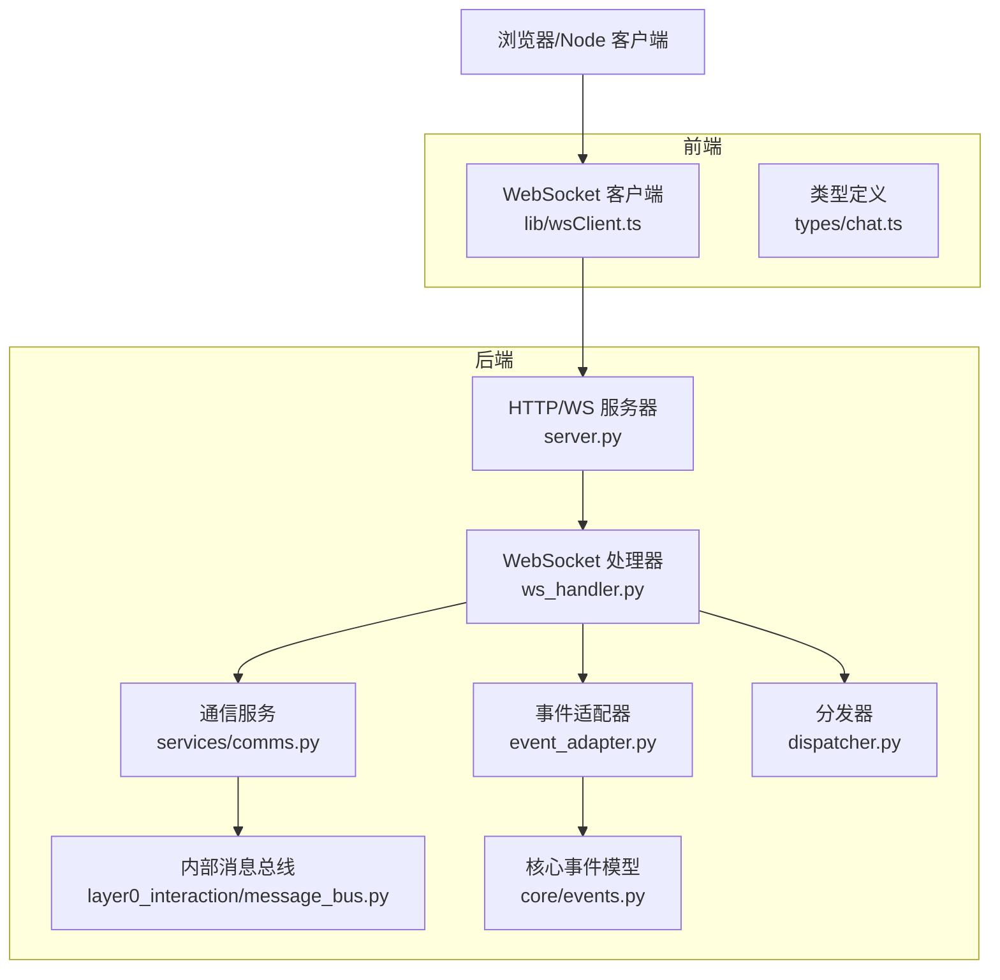
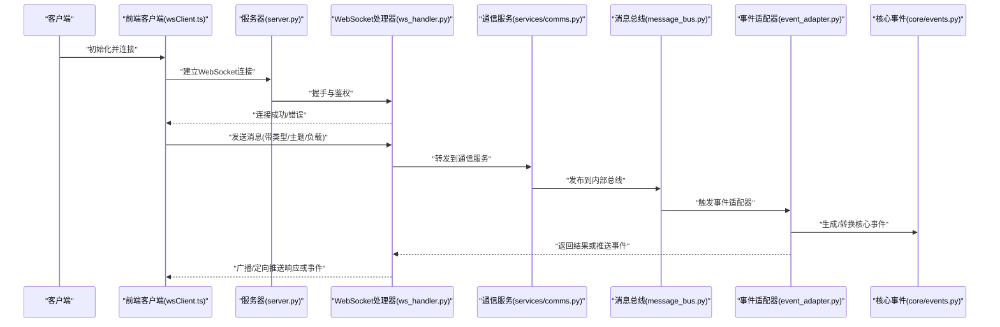
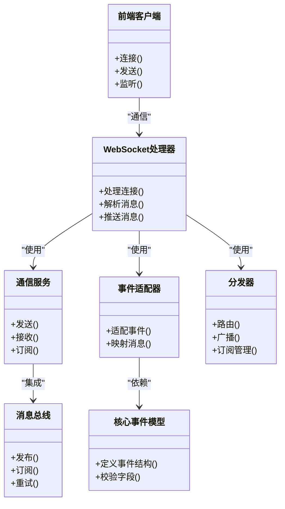

# 消息协议

<cite>
**本文引用的文件**   
- [ws_handler.py](file://opc/plugins/office_ui/ws_handler.py)
- [event_adapter.py](file://opc/plugins/office_ui/event_adapter.py)
- [dispatcher.py](file://opc/plugins/office_ui/dispatcher.py)
- [server.py](file://opc/plugins/office_ui/server.py)
- [services/comms.py](file://opc/plugins/office_ui/services/comms.py)
- [layer0_interaction/message_bus.py](file://opc/layer0_interaction/message_bus.py)
- [core/events.py](file://opc/core/events.py)
- [lib/wsClient.ts](file://opc/plugins/office_ui/frontend_src/lib/wsClient.ts)
- [types/chat.ts](file://opc/plugins/office_ui/frontend_src/types/chat.ts)
</cite>

## 目录
1. [简介](#简介)
2. [项目结构](#项目结构)
3. [核心组件](#核心组件)
4. [架构总览](#架构总览)
5. [详细组件分析](#详细组件分析)
6. [依赖分析](#依赖分析)
7. [性能考虑](#性能考虑)
8. [故障排查指南](#故障排查指南)
9. [结论](#结论)
10. [附录](#附录)

## 简介
本文件为 OpenOPC 的 WebSocket 消息协议提供完整技术说明，覆盖以下方面：
- 消息格式规范：JSON 结构定义、字段类型与数据验证规则
- 事件类型系统：内置事件类型、自定义事件扩展与分类机制
- 消息路由机制：分发、订阅模式与广播策略
- 序列化与反序列化：完整的编解码规范
- 客户端实现：JavaScript 客户端示例与最佳实践
- 高级特性：消息优先级、批量处理与压缩选项

目标是帮助开发者正确解析和处理所有消息类型，构建稳定高效的实时通信能力。

## 项目结构
OpenOPC 的 WebSocket 相关实现主要位于 office_ui 插件层与前端库中，后端通过服务层与内部消息总线交互，前端通过 TypeScript 客户端封装连接与事件处理。

**图示来源** 
- [ws_handler.py](file://opc/plugins/office_ui/ws_handler.py)
- [server.py](file://opc/plugins/office_ui/server.py)
- [services/comms.py](file://opc/plugins/office_ui/services/comms.py)
- [layer0_interaction/message_bus.py](file://opc/layer0_interaction/message_bus.py)
- [event_adapter.py](file://opc/plugins/office_ui/event_adapter.py)
- [dispatcher.py](file://opc/plugins/office_ui/dispatcher.py)
- [core/events.py](file://opc/core/events.py)
- [lib/wsClient.ts](file://opc/plugins/office_ui/frontend_src/lib/wsClient.ts)
- [types/chat.ts](file://opc/plugins/office_ui/frontend_src/types/chat.ts)

**章节来源**
- [ws_handler.py](file://opc/plugins/office_ui/ws_handler.py)
- [server.py](file://opc/plugins/office_ui/server.py)
- [services/comms.py](file://opc/plugins/office_ui/services/comms.py)
- [layer0_interaction/message_bus.py](file://opc/layer0_interaction/message_bus.py)
- [event_adapter.py](file://opc/plugins/office_ui/event_adapter.py)
- [dispatcher.py](file://opc/plugins/office_ui/dispatcher.py)
- [core/events.py](file://opc/core/events.py)
- [lib/wsClient.ts](file://opc/plugins/office_ui/frontend_src/lib/wsClient.ts)
- [types/chat.ts](file://opc/plugins/office_ui/frontend_src/types/chat.ts)

## 核心组件
- WebSocket 处理器：负责连接生命周期管理、鉴权与会话绑定、消息收发与错误处理。
- 通信服务：封装业务级消息的发送、接收与路由逻辑，对接内部消息总线。
- 事件适配器：将内部事件模型转换为 WebSocket 消息，或将外部消息映射到内部事件。
- 分发器：根据消息类型与上下文进行路由，支持订阅与广播策略。
- 内部消息总线：跨模块的事件与命令通道，解耦前后端与子系统。
- 前端客户端：封装连接、重连、心跳、消息编解码与事件回调。

**章节来源**
- [ws_handler.py](file://opc/plugins/office_ui/ws_handler.py)
- [services/comms.py](file://opc/plugins/office_ui/services/comms.py)
- [event_adapter.py](file://opc/plugins/office_ui/event_adapter.py)
- [dispatcher.py](file://opc/plugins/office_ui/dispatcher.py)
- [layer0_interaction/message_bus.py](file://opc/layer0_interaction/message_bus.py)
- [lib/wsClient.ts](file://opc/plugins/office_ui/frontend_src/lib/wsClient.ts)

## 架构总览
下图展示从客户端到后端的端到端流程，包括连接建立、消息路由、事件适配与广播。

**图示来源** 
- [server.py](file://opc/plugins/office_ui/server.py)
- [ws_handler.py](file://opc/plugins/office_ui/ws_handler.py)
- [services/comms.py](file://opc/plugins/office_ui/services/comms.py)
- [layer0_interaction/message_bus.py](file://opc/layer0_interaction/message_bus.py)
- [event_adapter.py](file://opc/plugins/office_ui/event_adapter.py)
- [core/events.py](file://opc/core/events.py)
- [lib/wsClient.ts](file://opc/plugins/office_ui/frontend_src/lib/wsClient.ts)

## 详细组件分析

### WebSocket 处理器（ws_handler.py）
职责：
- 连接管理与鉴权：维护会话状态、用户身份与权限。
- 消息收发：解析入站 JSON，校验必填字段，调用上层服务。
- 错误处理：统一错误码与异常包装，确保客户端可恢复。
- 心跳与保活：检测空闲连接，主动断开或重试。

关键流程：
- 入站消息解析与校验
- 路由到通信服务或事件适配器
- 出站消息序列化与推送

**章节来源**
- [ws_handler.py](file://opc/plugins/office_ui/ws_handler.py)

### 通信服务（services/comms.py）
职责：
- 封装业务消息的发送与接收接口
- 与内部消息总线集成，实现跨进程/模块通信
- 支持批量发送与去重策略

关键流程：
- 消息入队与调度
- 订阅关系维护
- 失败重试与限流

**章节来源**
- [services/comms.py](file://opc/plugins/office_ui/services/comms.py)

### 事件适配器（event_adapter.py）
职责：
- 将内部事件模型转换为 WebSocket 消息
- 将外部消息映射到内部事件
- 提供事件分类与过滤

关键流程：
- 事件类型识别与路由
- 载荷校验与规范化
- 扩展点注册与自定义事件注入

**章节来源**
- [event_adapter.py](file://opc/plugins/office_ui/event_adapter.py)

### 分发器（dispatcher.py）
职责：
- 基于消息类型与主题进行分发
- 支持订阅模式与广播策略
- 控制消息优先级与并发度

关键流程：
- 路由表匹配
- 订阅者集合计算
- 广播扇出与顺序保证

**章节来源**
- [dispatcher.py](file://opc/plugins/office_ui/dispatcher.py)

### 内部消息总线（layer0_interaction/message_bus.py）
职责：
- 提供事件与命令的发布/订阅通道
- 解耦前后端与子系统
- 支持持久化与重试

关键流程：
- 发布事件到主题
- 订阅者回调执行
- 死信队列与监控

**章节来源**
- [layer0_interaction/message_bus.py](file://opc/layer0_interaction/message_bus.py)

### 核心事件模型（core/events.py）
职责：
- 定义标准事件结构与字段约束
- 提供事件类型枚举与版本兼容
- 作为事件适配器的输入输出契约

关键流程：
- 事件创建与校验
- 序列化与反序列化
- 扩展字段约定

**章节来源**
- [core/events.py](file://opc/core/events.py)

### 前端客户端（lib/wsClient.ts）
职责：
- 连接管理：自动重连、心跳、断线恢复
- 消息编解码：JSON 序列化与类型校验
- 事件回调：订阅与分发到业务逻辑
- 错误处理：网络异常与业务错误的统一处理

关键流程：
- 建立连接与鉴权
- 发送请求与监听响应
- 订阅主题与接收广播

**章节来源**
- [lib/wsClient.ts](file://opc/plugins/office_ui/frontend_src/lib/wsClient.ts)

### 类型定义（types/chat.ts）
职责：
- 定义前端消息与事件的 TypeScript 类型
- 提供字段约束与可选性说明
- 辅助 IDE 提示与静态检查

**章节来源**
- [types/chat.ts](file://opc/plugins/office_ui/frontend_src/types/chat.ts)

## 依赖分析
组件间依赖关系如下：

**图示来源** 
- [ws_handler.py](file://opc/plugins/office_ui/ws_handler.py)
- [services/comms.py](file://opc/plugins/office_ui/services/comms.py)
- [event_adapter.py](file://opc/plugins/office_ui/event_adapter.py)
- [dispatcher.py](file://opc/plugins/office_ui/dispatcher.py)
- [layer0_interaction/message_bus.py](file://opc/layer0_interaction/message_bus.py)
- [core/events.py](file://opc/core/events.py)
- [lib/wsClient.ts](file://opc/plugins/office_ui/frontend_src/lib/wsClient.ts)

**章节来源**
- [ws_handler.py](file://opc/plugins/office_ui/ws_handler.py)
- [services/comms.py](file://opc/plugins/office_ui/services/comms.py)
- [event_adapter.py](file://opc/plugins/office_ui/event_adapter.py)
- [dispatcher.py](file://opc/plugins/office_ui/dispatcher.py)
- [layer0_interaction/message_bus.py](file://opc/layer0_interaction/message_bus.py)
- [core/events.py](file://opc/core/events.py)
- [lib/wsClient.ts](file://opc/plugins/office_ui/frontend_src/lib/wsClient.ts)

## 性能考虑
- 批量处理：对高频小消息进行聚合，减少帧数量与开销。
- 压缩选项：在带宽受限场景启用压缩，权衡 CPU 与带宽。
- 优先级队列：高优先级消息优先处理，避免阻塞。
- 背压与限流：防止突发流量导致内存溢出。
- 连接池与会话复用：降低握手成本。

[本节为通用指导，不直接分析具体文件]

## 故障排查指南
常见问题与定位步骤：
- 连接失败：检查鉴权参数、网络可达性与证书配置。
- 消息丢失：确认订阅关系是否正确，查看死信队列与重试日志。
- 事件未触发：核对事件类型与主题匹配，检查适配器映射。
- 性能问题：监控队列长度、CPU 与内存占用，调整批大小与并发度。

**章节来源**
- [ws_handler.py](file://opc/plugins/office_ui/ws_handler.py)
- [services/comms.py](file://opc/plugins/office_ui/services/comms.py)
- [event_adapter.py](file://opc/plugins/office_ui/event_adapter.py)
- [dispatcher.py](file://opc/plugins/office_ui/dispatcher.py)
- [layer0_interaction/message_bus.py](file://opc/layer0_interaction/message_bus.py)

## 结论
本文件系统化梳理了 OpenOPC 的 WebSocket 消息协议，涵盖消息格式、事件系统、路由机制、序列化规范与客户端实现要点。遵循本文档的规范与最佳实践，可显著提升系统的稳定性与可维护性。

[本节为总结，不直接分析具体文件]

## 附录

### 消息格式规范
- 根对象字段
  - type: 字符串，消息类型标识，必填
  - id: 字符串，唯一消息 ID，必填
  - ts: 数字，时间戳（毫秒），必填
  - payload: 对象，业务负载，必填
  - meta: 对象，元数据（如优先级、压缩标志等），可选
- 字段类型与验证
  - type 必须在白名单内
  - id 需满足唯一性与不可变性
  - ts 必须为非负整数
  - payload 按具体消息类型进行子结构校验
  - meta.priority 为整数范围，meta.compress 为布尔值

**章节来源**
- [core/events.py](file://opc/core/events.py)
- [types/chat.ts](file://opc/plugins/office_ui/frontend_src/types/chat.ts)

### 事件类型系统与扩展
- 内置事件类型：由核心事件模型定义，包含系统级与业务级事件
- 自定义事件扩展：通过事件适配器注册新类型，保持向后兼容
- 分类机制：基于主题与标签进行分组，便于订阅与过滤

**章节来源**
- [core/events.py](file://opc/core/events.py)
- [event_adapter.py](file://opc/plugins/office_ui/event_adapter.py)

### 消息路由机制
- 分发策略：基于 type 与 meta.topic 进行精确或模糊匹配
- 订阅模式：点对点、一对多与广播三种模式
- 广播策略：按订阅者集合扇出，支持顺序与幂等保证

**章节来源**
- [dispatcher.py](file://opc/plugins/office_ui/dispatcher.py)
- [services/comms.py](file://opc/plugins/office_ui/services/comms.py)

### 序列化与反序列化规范
- 编码：UTF-8 JSON，严格模式，禁止循环引用
- 解码：先校验根字段，再按 type 分支解析 payload
- 兼容性：新增字段默认可选，旧客户端忽略未知字段

**章节来源**
- [core/events.py](file://opc/core/events.py)
- [lib/wsClient.ts](file://opc/plugins/office_ui/frontend_src/lib/wsClient.ts)

### 客户端实现要点（JavaScript/TypeScript）
- 连接建立：支持自动重连与指数退避
- 心跳保活：定期发送 ping，服务端超时则断开
- 消息发送：构造符合规范的 JSON，附加必要元数据
- 事件监听：按主题订阅，处理响应与广播事件
- 错误处理：捕获网络与业务错误，记录日志并告警

**章节来源**
- [lib/wsClient.ts](file://opc/plugins/office_ui/frontend_src/lib/wsClient.ts)
- [types/chat.ts](file://opc/plugins/office_ui/frontend_src/types/chat.ts)

### 高级特性
- 优先级：meta.priority 越高越先处理，避免低优先级阻塞
- 批量处理：合并多个小消息为一个批次，减少帧数
- 压缩选项：meta.compress 为真时启用压缩，注意 CPU 与带宽权衡

**章节来源**
- [dispatcher.py](file://opc/plugins/office_ui/dispatcher.py)
- [services/comms.py](file://opc/plugins/office_ui/services/comms.py)