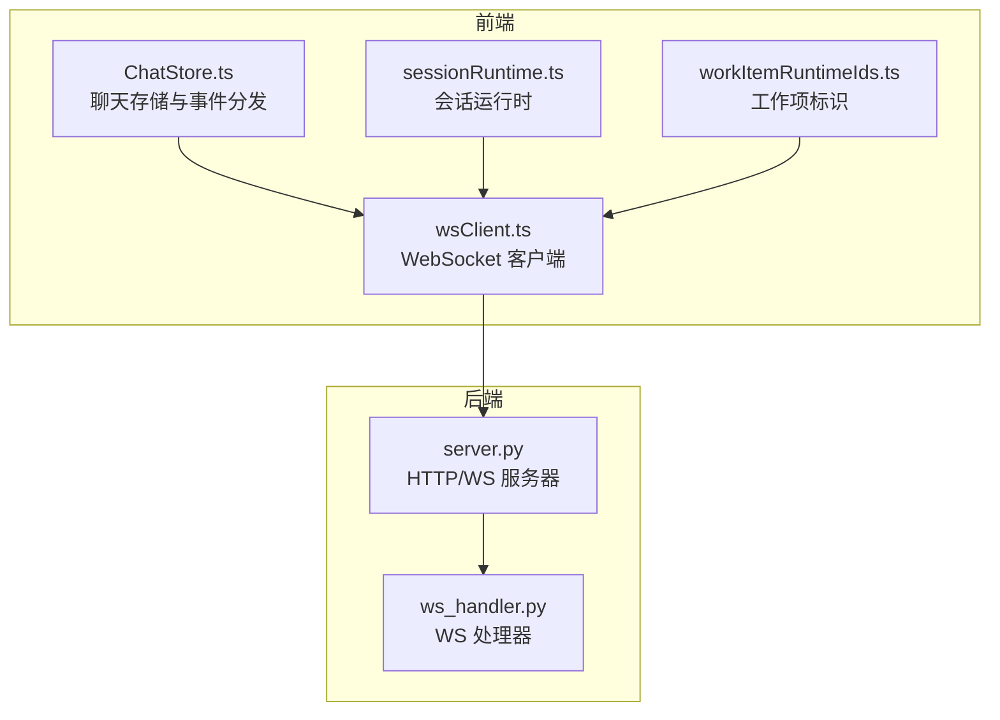
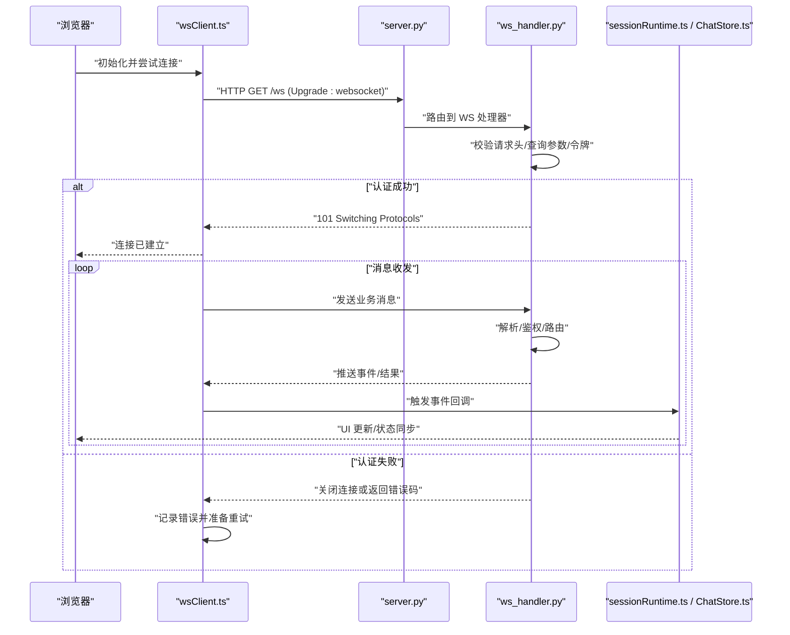
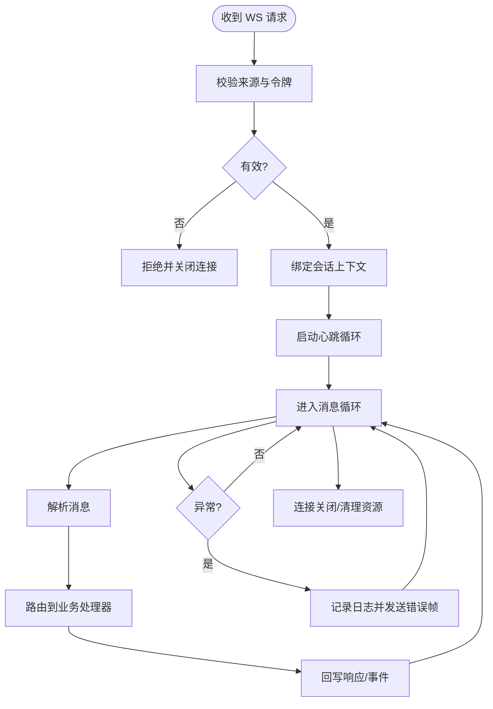
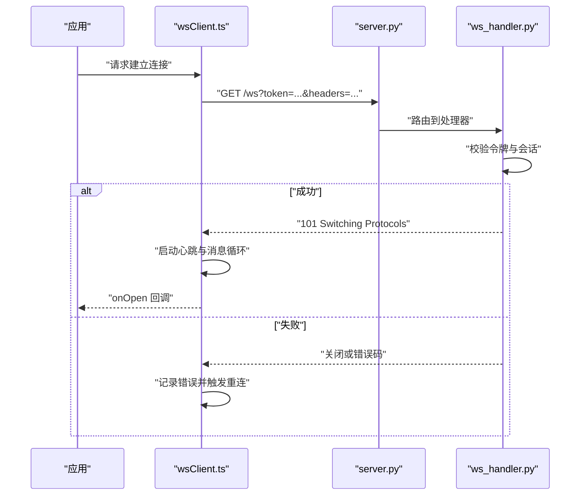
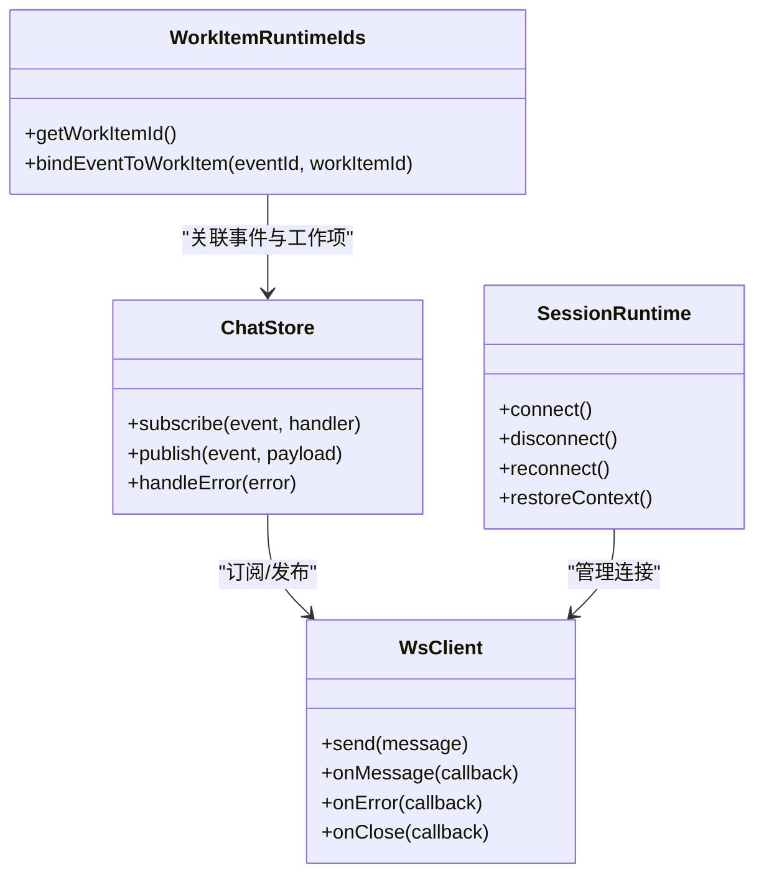
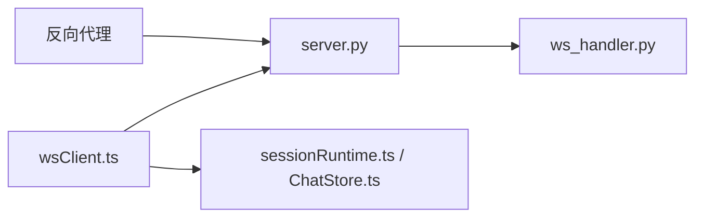

# 连接管理

<cite>
**本文引用的文件**   
- [ws_handler.py](file://opc/plugins/office_ui/ws_handler.py)
- [server.py](file://opc/plugins/office_ui/server.py)
- [wsClient.ts](file://opc/plugins/office_ui/frontend_src/lib/wsClient.ts)
- [ChatStore.ts](file://opc/plugins/office_ui/frontend_src/chat/ChatStore.ts)
- [sessionRuntime.ts](file://opc/plugins/office_ui/frontend_src/lib/sessionRuntime.ts)
- [workItemRuntimeIds.ts](file://opc/plugins/office_ui/frontend_src/lib/workItemRuntimeIds.ts)
- [test_ws_handler_escalations.py](file://tests/test_ws_handler_escalations.py)
- [test_ws_handler_progress_parsing.py](file://tests/test_ws_handler_progress_parsing.py)
</cite>

## 目录
1. [简介](#简介)
2. [项目结构](#项目结构)
3. [核心组件](#核心组件)
4. [架构总览](#架构总览)
5. [详细组件分析](#详细组件分析)
6. [依赖关系分析](#依赖关系分析)
7. [性能考虑](#性能考虑)
8. [故障排查指南](#故障排查指南)
9. [结论](#结论)
10. [附录](#附录)

## 简介
本技术文档聚焦于 OpenOPC 的 WebSocket 连接管理，覆盖从浏览器前端到后端服务的完整链路：连接的建立、握手与认证、生命周期管理（创建、验证、维护、销毁）、并发与连接池策略、状态监控与健康检查、错误处理与恢复机制。文档同时提供面向开发者的最佳实践与优化建议，帮助正确实现与管理 WebSocket 连接。

## 项目结构
OpenOPC 的 WebSocket 相关代码主要分布在以下位置：
- 后端服务与处理器：位于 opc/plugins/office_ui 下的 server.py 与 ws_handler.py
- 前端客户端：位于 opc/plugins/office_ui/frontend_src/lib/wsClient.ts 及相关会话/工作项运行时模块
- 测试用例：tests 目录下针对 WS 处理器行为与消息解析的测试

图表来源
- [server.py](file://opc/plugins/office_ui/server.py)
- [ws_handler.py](file://opc/plugins/office_ui/ws_handler.py)
- [wsClient.ts](file://opc/plugins/office_ui/frontend_src/lib/wsClient.ts)
- [ChatStore.ts](file://opc/plugins/office_ui/frontend_src/chat/ChatStore.ts)
- [sessionRuntime.ts](file://opc/plugins/office_ui/frontend_src/lib/sessionRuntime.ts)
- [workItemRuntimeIds.ts](file://opc/plugins/office_ui/frontend_src/lib/workItemRuntimeIds.ts)

章节来源
- [server.py](file://opc/plugins/office_ui/server.py)
- [ws_handler.py](file://opc/plugins/office_ui/ws_handler.py)
- [wsClient.ts](file://opc/plugins/office_ui/frontend_src/lib/wsClient.ts)
- [ChatStore.ts](file://opc/plugins/office_ui/frontend_src/chat/ChatStore.ts)
- [sessionRuntime.ts](file://opc/plugins/office_ui/frontend_src/lib/sessionRuntime.ts)
- [workItemRuntimeIds.ts](file://opc/plugins/office_ui/frontend_src/lib/workItemRuntimeIds.ts)

## 核心组件
- 后端服务器（server.py）
  - 负责 HTTP 路由与 WebSocket 升级入口，将请求转发至 WS 处理器进行鉴权与会话绑定。
- 后端处理器（ws_handler.py）
  - 实现 WS 握手后的认证、会话上下文装配、消息路由、心跳保活、错误上报与异常恢复。
- 前端客户端（wsClient.ts）
  - 封装连接建立、重连策略、消息编解码、事件回调、断线检测与自动恢复。
- 前端运行时与存储（ChatStore.ts、sessionRuntime.ts、workItemRuntimeIds.ts）
  - 消费 WS 事件，驱动 UI 更新与业务逻辑；维护会话与工作项的关联关系。

章节来源
- [server.py](file://opc/plugins/office_ui/server.py)
- [ws_handler.py](file://opc/plugins/office_ui/ws_handler.py)
- [wsClient.ts](file://opc/plugins/office_ui/frontend_src/lib/wsClient.ts)
- [ChatStore.ts](file://opc/plugins/office_ui/frontend_src/chat/ChatStore.ts)
- [sessionRuntime.ts](file://opc/plugins/office_ui/frontend_src/lib/sessionRuntime.ts)
- [workItemRuntimeIds.ts](file://opc/plugins/office_ui/frontend_src/lib/workItemRuntimeIds.ts)

## 架构总览
下图展示了从浏览器发起 WS 连接到后端处理器的端到端流程，包括握手、认证、会话绑定与消息流转。

图表来源
- [server.py](file://opc/plugins/office_ui/server.py)
- [ws_handler.py](file://opc/plugins/office_ui/ws_handler.py)
- [wsClient.ts](file://opc/plugins/office_ui/frontend_src/lib/wsClient.ts)
- [ChatStore.ts](file://opc/plugins/office_ui/frontend_src/chat/ChatStore.ts)
- [sessionRuntime.ts](file://opc/plugins/office_ui/frontend_src/lib/sessionRuntime.ts)

## 详细组件分析

### 后端服务器（server.py）
- 职责
  - 注册 HTTP 与 WS 路由，统一入口接收连接请求。
  - 对 WS 请求执行基础校验后委派给处理器。
- 关键点
  - 路径与中间件：确保仅允许受信任的路径与来源。
  - 超时与资源清理：为长时间运行的 WS 连接设置合理的超时与清理策略。
- 建议
  - 在反向代理层启用限流与白名单，减少恶意连接风险。

章节来源
- [server.py](file://opc/plugins/office_ui/server.py)

### 后端处理器（ws_handler.py）
- 职责
  - 完成 WS 握手后的认证与会话绑定。
  - 解析消息、执行业务逻辑、回写结果与事件。
  - 维护心跳、健康检查与异常恢复。
- 关键流程
  - 认证：基于请求头或查询参数中的令牌进行身份核验。
  - 会话：根据用户/租户维度建立会话上下文，隔离数据与权限。
  - 心跳：周期性 ping/pong 维持连接活性，超时则主动断开。
  - 错误：捕获异常并转换为标准错误帧，便于前端统一处理。
- 并发与连接池
  - 使用异步 I/O 模型处理多连接；按会话维度组织连接映射。
  - 限制单用户并发连接数，防止资源耗尽。
- 健康检查
  - 暴露轻量级健康接口或内部指标，用于外部探针探测。

图表来源
- [ws_handler.py](file://opc/plugins/office_ui/ws_handler.py)

章节来源
- [ws_handler.py](file://opc/plugins/office_ui/ws_handler.py)

### 前端客户端（wsClient.ts）
- 职责
  - 封装 WS 连接建立、重连、心跳、消息编解码与事件分发。
  - 与运行时模块协作，驱动 UI 与业务状态同步。
- 连接建立与握手
  - 构造 URL 与必要头部（如令牌），发起 Upgrade 请求。
  - 监听 open/close/error 事件，统一处理生命周期。
- 重连策略
  - 指数退避 + 抖动，避免雪崩式重连。
  - 最大重试次数与冷却时间控制。
- 心跳与保活
  - 定时发送心跳，服务端未响应则判定断线并触发重连。
- 错误处理
  - 区分网络错误、认证失败、业务错误，分别采取不同恢复策略。

图表来源
- [wsClient.ts](file://opc/plugins/office_ui/frontend_src/lib/wsClient.ts)
- [server.py](file://opc/plugins/office_ui/server.py)
- [ws_handler.py](file://opc/plugins/office_ui/ws_handler.py)

章节来源
- [wsClient.ts](file://opc/plugins/office_ui/frontend_src/lib/wsClient.ts)

### 前端运行时与存储（ChatStore.ts、sessionRuntime.ts、workItemRuntimeIds.ts）
- ChatStore.ts
  - 订阅 WS 事件，更新聊天消息列表与进度卡片。
  - 处理错误提示与用户反馈。
- sessionRuntime.ts
  - 管理会话生命周期，协调 WS 连接与会话状态。
  - 在连接重建时恢复上下文与订阅。
- workItemRuntimeIds.ts
  - 维护工作项 ID 与 WS 事件的关联，确保消息路由准确。

图表来源
- [ChatStore.ts](file://opc/plugins/office_ui/frontend_src/chat/ChatStore.ts)
- [sessionRuntime.ts](file://opc/plugins/office_ui/frontend_src/lib/sessionRuntime.ts)
- [workItemRuntimeIds.ts](file://opc/plugins/office_ui/frontend_src/lib/workItemRuntimeIds.ts)
- [wsClient.ts](file://opc/plugins/office_ui/frontend_src/lib/wsClient.ts)

章节来源
- [ChatStore.ts](file://opc/plugins/office_ui/frontend_src/chat/ChatStore.ts)
- [sessionRuntime.ts](file://opc/plugins/office_ui/frontend_src/lib/sessionRuntime.ts)
- [workItemRuntimeIds.ts](file://opc/plugins/office_ui/frontend_src/lib/workItemRuntimeIds.ts)

## 依赖关系分析
- 耦合关系
  - server.py 与 ws_handler.py 通过路由与处理器接口解耦。
  - wsClient.ts 与后端通过标准化消息协议交互，降低前后端耦合。
- 外部依赖
  - 反向代理（Nginx/Ingress）用于 TLS 终止、限流与访问控制。
  - 认证服务（可选）用于令牌签发与校验。
- 潜在循环依赖
  - 前后端通过消息契约而非直接导入，避免循环依赖。

图表来源
- [server.py](file://opc/plugins/office_ui/server.py)
- [ws_handler.py](file://opc/plugins/office_ui/ws_handler.py)
- [wsClient.ts](file://opc/plugins/office_ui/frontend_src/lib/wsClient.ts)
- [ChatStore.ts](file://opc/plugins/office_ui/frontend_src/chat/ChatStore.ts)
- [sessionRuntime.ts](file://opc/plugins/office_ui/frontend_src/lib/sessionRuntime.ts)

章节来源
- [server.py](file://opc/plugins/office_ui/server.py)
- [ws_handler.py](file://opc/plugins/office_ui/ws_handler.py)
- [wsClient.ts](file://opc/plugins/office_ui/frontend_src/lib/wsClient.ts)
- [ChatStore.ts](file://opc/plugins/office_ui/frontend_src/chat/ChatStore.ts)
- [sessionRuntime.ts](file://opc/plugins/office_ui/frontend_src/lib/sessionRuntime.ts)

## 性能考虑
- 连接复用与并发
  - 利用异步 I/O 提升并发处理能力；合理设置线程/进程池上限。
  - 限制单用户并发连接数，避免资源争用。
- 消息批处理与压缩
  - 合并高频小消息，减少帧开销；必要时启用二进制或压缩传输。
- 心跳与超时
  - 调整心跳间隔与超时阈值，平衡实时性与资源消耗。
- 缓存与会话持久化
  - 热点数据缓存，减轻后端压力；会话状态可持久化以便恢复。
- 监控与告警
  - 采集连接数、消息吞吐、延迟与错误率，设置阈值告警。

[本节为通用指导，不直接分析具体文件]

## 故障排查指南
- 常见问题
  - 握手失败：检查令牌有效性、来源白名单与跨域配置。
  - 频繁断线：确认心跳间隔与超时设置是否匹配网络环境。
  - 消息丢失：核对消息序列号与去重逻辑，检查前端重传策略。
- 定位方法
  - 查看后端处理器日志与错误帧内容。
  - 在前端控制台输出连接状态与错误堆栈。
  - 使用测试用例复现问题，缩小范围。
- 参考测试
  - 针对升级与错误处理的测试有助于快速定位问题。

章节来源
- [test_ws_handler_escalations.py](file://tests/test_ws_handler_escalations.py)
- [test_ws_handler_progress_parsing.py](file://tests/test_ws_handler_progress_parsing.py)

## 结论
OpenOPC 的 WebSocket 连接管理采用前后端分离的清晰分层设计：后端通过 server.py 与 ws_handler.py 实现统一的握手、认证与会话管理；前端通过 wsClient.ts 封装连接细节并提供健壮的重连与错误处理。结合心跳、健康检查与监控告警，系统能够在高并发场景下保持稳定与可靠。开发者应遵循本文的最佳实践，合理配置安全与性能参数，确保连接的正确实现与高效管理。

[本节为总结性内容，不直接分析具体文件]

## 附录
- 连接建立示例（步骤说明）
  - 前端初始化 wsClient，传入服务端地址与认证令牌。
  - 调用 connect() 发起 WS 升级请求。
  - 成功后注册 onMessage/onError/onClose 回调。
  - 在需要时发送业务消息并处理响应。
  - 连接异常时触发重连逻辑，直至达到最大重试次数。
- 错误处理模式
  - 网络错误：指数退避重连。
  - 认证失败：提示用户重新登录并刷新令牌。
  - 业务错误：展示友好提示并记录日志。
- 安全配置
  - 强制 HTTPS/TLS。
  - 令牌短期有效并支持刷新。
  - 来源白名单与速率限制。
- 性能优化技巧
  - 批量发送与消息压缩。
  - 合理的心跳与超时配置。
  - 连接池与会话隔离。

[本节为概念性指导，不直接分析具体文件]