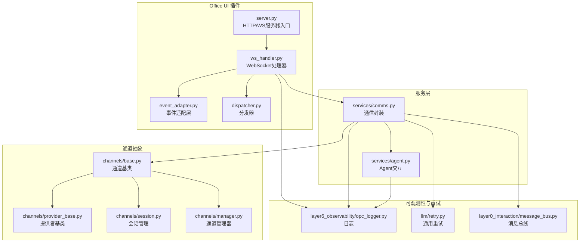
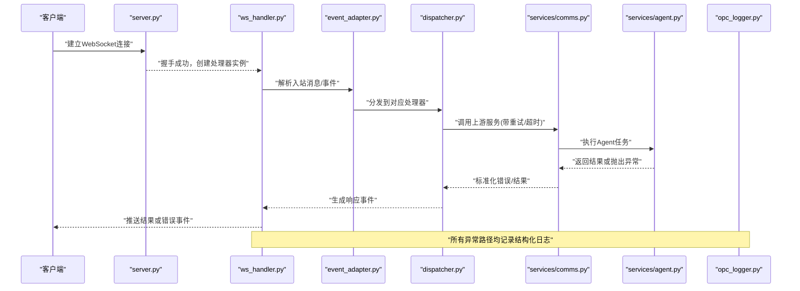
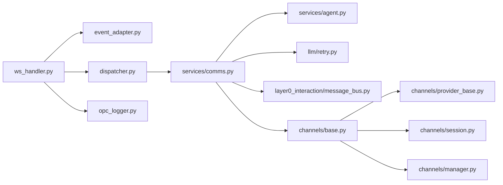
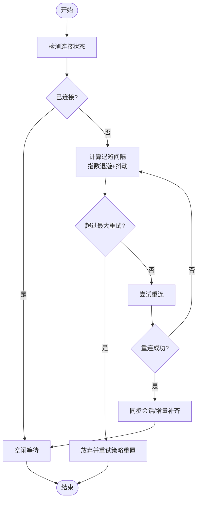

# 错误处理

<cite>
**本文引用的文件**   
- [ws_handler.py](file://opc/plugins/office_ui/ws_handler.py)
- [server.py](file://opc/plugins/office_ui/server.py)
- [comms.py](file://opc/plugins/office_ui/services/comms.py)
- [event_adapter.py](file://opc/plugins/office_ui/event_adapter.py)
- [dispatcher.py](file://opc/plugins/office_ui/dispatcher.py)
- [agent.py](file://opc/plugins/office_ui/services/agent.py)
- [session.py](file://opc/channels/session.py)
- [base.py](file://opc/channels/base.py)
- [provider_base.py](file://opc/channels/provider_base.py)
- [manager.py](file://opc/channels/manager.py)
- [message_bus.py](file://opc/layer0_interaction/message_bus.py)
- [retry.py](file://opc/llm/retry.py)
- [opc_logger.py](file://opc/layer6_observability/opc_logger.py)
- [test_ws_handler_progress_parsing.py](file://tests/test_ws_handler_progress_parsing.py)
- [test_ws_handler_escalations.py](file://tests/test_ws_handler_escalations.py)
</cite>

## 目录
1. [简介](#简介)
2. [项目结构](#项目结构)
3. [核心组件](#核心组件)
4. [架构总览](#架构总览)
5. [详细组件分析](#详细组件分析)
6. [依赖关系分析](#依赖关系分析)
7. [性能考虑](#性能考虑)
8. [故障排查指南](#故障排查指南)
9. [结论](#结论)
10. [附录](#附录)

## 简介
本文件面向OpenOPC的WebSocket错误处理，目标是帮助开发者构建健壮的实时通信能力。文档涵盖：
- 错误分类体系（网络、协议、业务逻辑等）
- 错误码规范与消息格式约定
- 断线重连机制（策略、退避算法、连接恢复流程）
- 异常捕获与日志记录最佳实践
- 完整的错误处理示例路径与调试技巧
- 错误监控、告警与故障诊断方法

## 项目结构
与WebSocket错误处理直接相关的后端模块主要位于 office_ui 插件与服务层，以及通道抽象与可观测性工具中。下图展示了与WS错误处理相关的关键文件及其职责边界。

图表来源
- [server.py](file://opc/plugins/office_ui/server.py)
- [ws_handler.py](file://opc/plugins/office_ui/ws_handler.py)
- [event_adapter.py](file://opc/plugins/office_ui/event_adapter.py)
- [dispatcher.py](file://opc/plugins/office_ui/dispatcher.py)
- [comms.py](file://opc/plugins/office_ui/services/comms.py)
- [agent.py](file://opc/plugins/office_ui/services/agent.py)
- [base.py](file://opc/channels/base.py)
- [provider_base.py](file://opc/channels/provider_base.py)
- [session.py](file://opc/channels/session.py)
- [manager.py](file://opc/channels/manager.py)
- [opc_logger.py](file://opc/layer6_observability/opc_logger.py)
- [retry.py](file://opc/llm/retry.py)
- [message_bus.py](file://opc/layer0_interaction/message_bus.py)

章节来源
- [server.py](file://opc/plugins/office_ui/server.py)
- [ws_handler.py](file://opc/plugins/office_ui/ws_handler.py)
- [event_adapter.py](file://opc/plugins/office_ui/event_adapter.py)
- [dispatcher.py](file://opc/plugins/office_ui/dispatcher.py)
- [comms.py](file://opc/plugins/office_ui/services/comms.py)
- [agent.py](file://opc/plugins/office_ui/services/agent.py)
- [base.py](file://opc/channels/base.py)
- [provider_base.py](file://opc/channels/provider_base.py)
- [session.py](file://opc/channels/session.py)
- [manager.py](file://opc/channels/manager.py)
- [opc_logger.py](file://opc/layer6_observability/opc_logger.py)
- [retry.py](file://opc/llm/retry.py)
- [message_bus.py](file://opc/layer0_interaction/message_bus.py)

## 核心组件
- WebSocket处理器：负责建立连接、接收/发送消息、生命周期管理与错误上报。
- 事件适配器：将底层事件转换为统一的事件模型，便于上层消费与错误归因。
- 分发器：根据事件类型路由到具体处理逻辑，集中处理异常与降级。
- 通信封装：对上游服务调用进行封装，提供重试、超时、熔断与错误转换。
- 通道抽象：为不同渠道提供统一的会话与连接语义，屏蔽差异并收敛错误形态。
- 可观测性：统一的日志、指标与追踪输出，支撑监控与告警。

章节来源
- [ws_handler.py](file://opc/plugins/office_ui/ws_handler.py)
- [event_adapter.py](file://opc/plugins/office_ui/event_adapter.py)
- [dispatcher.py](file://opc/plugins/office_ui/dispatcher.py)
- [comms.py](file://opc/plugins/office_ui/services/comms.py)
- [base.py](file://opc/channels/base.py)
- [provider_base.py](file://opc/channels/provider_base.py)
- [session.py](file://opc/channels/session.py)
- [manager.py](file://opc/channels/manager.py)
- [opc_logger.py](file://opc/layer6_observability/opc_logger.py)

## 架构总览
下图展示从客户端发起WS连接到服务端处理、转发、响应与错误回传的端到端流程，并标注关键错误点与重试位置。

图表来源
- [server.py](file://opc/plugins/office_ui/server.py)
- [ws_handler.py](file://opc/plugins/office_ui/ws_handler.py)
- [event_adapter.py](file://opc/plugins/office_ui/event_adapter.py)
- [dispatcher.py](file://opc/plugins/office_ui/dispatcher.py)
- [comms.py](file://opc/plugins/office_ui/services/comms.py)
- [agent.py](file://opc/plugins/office_ui/services/agent.py)
- [opc_logger.py](file://opc/layer6_observability/opc_logger.py)

## 详细组件分析

### WebSocket处理器错误处理
- 职责
  - 维护连接状态、心跳保活、消息编解码与反序列化校验。
  - 捕获网络层异常（断开、超时、读写失败），转化为标准错误事件。
  - 触发断线重连流程（由客户端实现；服务端通过关闭帧或特定事件通知）。
- 错误分类
  - 网络错误：连接中断、DNS解析失败、TLS握手失败、读写超时。
  - 协议错误：消息格式非法、字段缺失、版本不兼容、序列号错乱。
  - 业务逻辑错误：权限不足、资源不存在、参数越界、下游服务不可用。
- 错误码规范（建议）
  - 使用分层前缀区分来源：NET、PROTO、BUS、SYS。
  - 三位数字编码：百位表示类别，十位表示子域，个位表示具体原因。
  - 示例范围：NET_1xx（网络）、PROTO_2xx（协议）、BUS_3xx（业务）、SYS_4xx（系统）。
- 错误消息格式（建议）
  - 包含：错误码、时间戳、请求ID、上下文摘要、详情对象、是否可重试标志。
  - 详情对象：原始错误类型、堆栈摘要（生产环境脱敏）、关联资源标识。
- 断线重连策略（客户端侧）
  - 指数退避 + 抖动：基础间隔、最大间隔、随机抖动因子。
  - 最大重试次数与全局冷却期，避免雪崩。
  - 幂等恢复：基于请求ID去重，确保重复推送不会导致副作用。
- 连接恢复流程
  - 客户端检测到断开后，按策略重连；成功后携带上次会话上下文或增量同步。
  - 服务端在收到重连时校验会话有效性，必要时触发全量快照或增量补齐。

章节来源
- [ws_handler.py](file://opc/plugins/office_ui/ws_handler.py)
- [server.py](file://opc/plugins/office_ui/server.py)

### 事件适配器与分发器
- 事件适配器
  - 将底层事件规范化，提取必要上下文（如会话ID、用户ID、操作类型）。
  - 对异常进行初步归类与包装，保证后续处理一致性。
- 分发器
  - 根据事件类型路由到具体处理器，集中捕获未处理异常并转为错误事件。
  - 支持降级策略：当某处理器不可用时，返回友好错误并记录告警。

章节来源
- [event_adapter.py](file://opc/plugins/office_ui/event_adapter.py)
- [dispatcher.py](file://opc/plugins/office_ui/dispatcher.py)

### 通信封装与重试
- 通信封装
  - 统一封装HTTP/gRPC/内部RPC调用，提供超时、重试、熔断与错误转换。
  - 将外部异常映射为内部错误码，保持接口契约稳定。
- 重试策略
  - 参考通用重试模块，结合业务场景选择幂等重试与非幂等限流。
  - 针对瞬时错误（如5xx、超时）采用指数退避+抖动；对于确定性错误立即失败。

章节来源
- [comms.py](file://opc/plugins/office_ui/services/comms.py)
- [retry.py](file://opc/llm/retry.py)

### 通道抽象与会话管理
- 通道基类与提供者基类
  - 定义统一的连接、发送、订阅、鉴权与错误上报接口。
  - 将各渠道差异收敛为一致的错误形态，便于上层统一处理。
- 会话管理
  - 维护会话生命周期、上下文持久化与跨进程/节点共享。
  - 在断线重连时恢复会话状态，确保连续性。

章节来源
- [base.py](file://opc/channels/base.py)
- [provider_base.py](file://opc/channels/provider_base.py)
- [session.py](file://opc/channels/session.py)
- [manager.py](file://opc/channels/manager.py)

### Agent交互与错误传播
- Agent交互
  - 将业务任务委托给Agent执行，捕获执行异常并转换为标准错误事件。
  - 对长耗时任务提供进度事件与取消信号，避免阻塞与泄漏。
- 错误传播
  - 自下而上逐层包装错误，保留根因信息，同时对外暴露最小必要细节。

章节来源
- [agent.py](file://opc/plugins/office_ui/services/agent.py)

### 可观测性与日志
- 日志规范
  - 结构化日志：包含级别、时间、来源、请求ID、错误码、上下文键值对。
  - 敏感信息脱敏：令牌、密码、个人身份信息需过滤。
- 指标与追踪
  - 统计错误率、延迟分位数、重连次数、重试成功率等关键指标。
  - 使用分布式追踪ID串联一次请求的全链路日志。

章节来源
- [opc_logger.py](file://opc/layer6_observability/opc_logger.py)

## 依赖关系分析
下图展示错误处理相关模块之间的依赖与耦合关系，突出错误传播路径与重试落点。

图表来源
- [ws_handler.py](file://opc/plugins/office_ui/ws_handler.py)
- [event_adapter.py](file://opc/plugins/office_ui/event_adapter.py)
- [dispatcher.py](file://opc/plugins/office_ui/dispatcher.py)
- [comms.py](file://opc/plugins/office_ui/services/comms.py)
- [agent.py](file://opc/plugins/office_ui/services/agent.py)
- [retry.py](file://opc/llm/retry.py)
- [message_bus.py](file://opc/layer0_interaction/message_bus.py)
- [base.py](file://opc/channels/base.py)
- [provider_base.py](file://opc/channels/provider_base.py)
- [session.py](file://opc/channels/session.py)
- [manager.py](file://opc/channels/manager.py)
- [opc_logger.py](file://opc/layer6_observability/opc_logger.py)

章节来源
- [ws_handler.py](file://opc/plugins/office_ui/ws_handler.py)
- [event_adapter.py](file://opc/plugins/office_ui/event_adapter.py)
- [dispatcher.py](file://opc/plugins/office_ui/dispatcher.py)
- [comms.py](file://opc/plugins/office_ui/services/comms.py)
- [agent.py](file://opc/plugins/office_ui/services/agent.py)
- [retry.py](file://opc/llm/retry.py)
- [message_bus.py](file://opc/layer0_interaction/message_bus.py)
- [base.py](file://opc/channels/base.py)
- [provider_base.py](file://opc/channels/provider_base.py)
- [session.py](file://opc/channels/session.py)
- [manager.py](file://opc/channels/manager.py)
- [opc_logger.py](file://opc/layer6_observability/opc_logger.py)

## 性能考虑
- 控制日志体积：仅记录必要上下文，避免大对象序列化。
- 合理设置超时与重试上限，防止级联放大。
- 批量错误聚合：对高频瞬时错误进行合并上报，降低噪声。
- 背压与限流：在高并发下限制并发任务数，保护下游服务。

## 故障排查指南
- 快速定位
  - 通过请求ID检索全链路日志，确认错误发生阶段（网络/协议/业务）。
  - 检查错误码前缀，快速识别错误来源。
- 常见症状与对策
  - 频繁断线：检查网络质量、证书配置、代理与防火墙策略。
  - 协议错误：核对消息Schema、字段必填项与版本兼容性。
  - 业务错误：查看上游服务健康度与配额限制。
- 调试技巧
  - 开启调试日志级别，捕获完整上下文。
  - 使用回放工具复现问题，验证修复效果。
  - 编写单测覆盖典型错误路径，确保回归稳定。

章节来源
- [test_ws_handler_progress_parsing.py](file://tests/test_ws_handler_progress_parsing.py)
- [test_ws_handler_escalations.py](file://tests/test_ws_handler_escalations.py)

## 结论
通过统一的错误分类、规范的错误码与消息格式、稳健的重连与重试策略、完善的日志与监控，OpenOPC的WebSocket子系统能够在复杂网络与高负载环境下保持稳定与可观测。遵循本文档的实践，开发者可以构建具备强韧性的实时通信应用。

## 附录

### 错误分类与错误码建议
- 网络错误（NET）
  - 101：连接失败
  - 102：握手失败
  - 103：读写超时
  - 104：证书错误
- 协议错误（PROTO）
  - 201：消息格式非法
  - 202：字段缺失
  - 203：版本不兼容
  - 204：序列号错乱
- 业务逻辑错误（BUS）
  - 301：权限不足
  - 302：资源不存在
  - 303：参数越界
  - 304：下游服务不可用
- 系统错误（SYS）
  - 401：内存不足
  - 402：线程池耗尽
  - 403：配置错误

### 错误消息格式建议
- 字段
  - code：错误码（字符串，如“NET_103”）
  - timestamp：时间戳（ISO8601）
  - request_id：请求ID（用于追踪）
  - context：上下文摘要（键值对）
  - detail：详情对象（含原始错误类型、堆栈摘要、关联资源）
  - retryable：是否可重试（布尔）

### 断线重连流程图（客户端侧）

[本图为概念性流程，无需图表来源]

### 异常捕获与日志记录最佳实践
- 在边界处捕获异常，尽早转换为标准错误事件。
- 记录结构化日志，包含请求ID、错误码、上下文键值对。
- 对敏感信息进行脱敏，避免泄露。
- 使用指标与告警规则监控错误率与延迟。

章节来源
- [opc_logger.py](file://opc/layer6_observability/opc_logger.py)

### 错误处理示例代码路径
- WebSocket处理器中的错误捕获与上报：
  - [ws_handler.py](file://opc/plugins/office_ui/ws_handler.py)
- 事件适配器的错误包装与分发：
  - [event_adapter.py](file://opc/plugins/office_ui/event_adapter.py)
  - [dispatcher.py](file://opc/plugins/office_ui/dispatcher.py)
- 通信封装的重试与错误转换：
  - [comms.py](file://opc/plugins/office_ui/services/comms.py)
  - [retry.py](file://opc/llm/retry.py)
- 通道抽象的统一错误形态：
  - [base.py](file://opc/channels/base.py)
  - [provider_base.py](file://opc/channels/provider_base.py)
  - [session.py](file://opc/channels/session.py)
  - [manager.py](file://opc/channels/manager.py)
- 测试用例覆盖的典型错误路径：
  - [test_ws_handler_progress_parsing.py](file://tests/test_ws_handler_progress_parsing.py)
  - [test_ws_handler_escalations.py](file://tests/test_ws_handler_escalations.py)