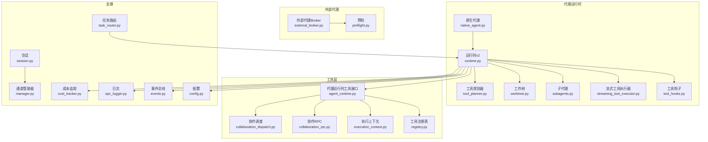
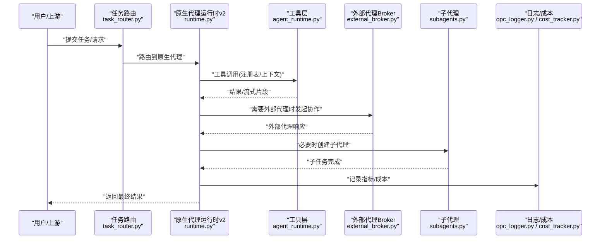
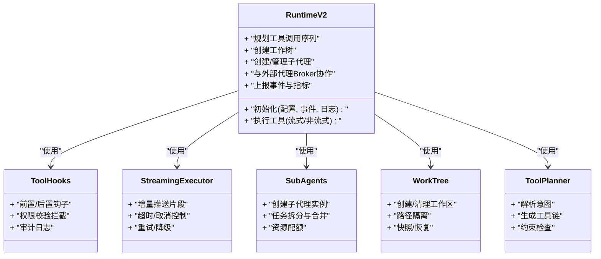
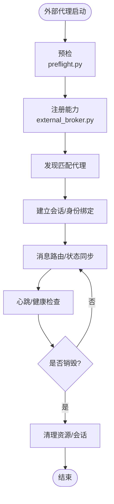
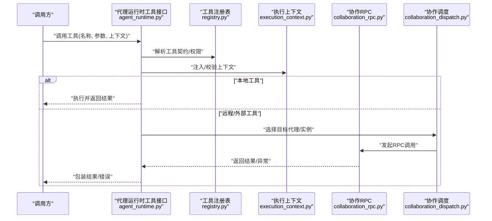
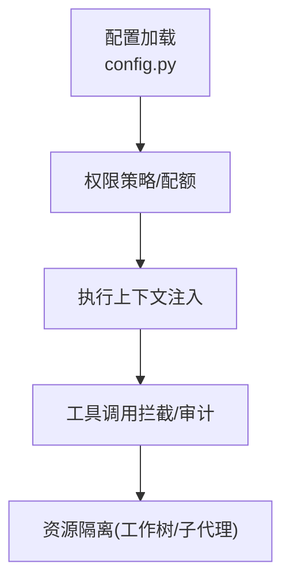
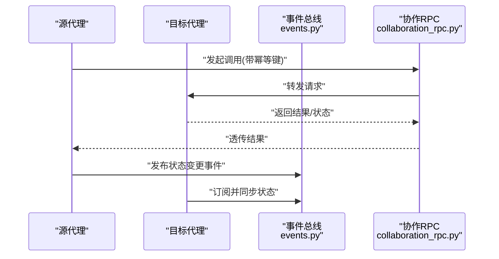
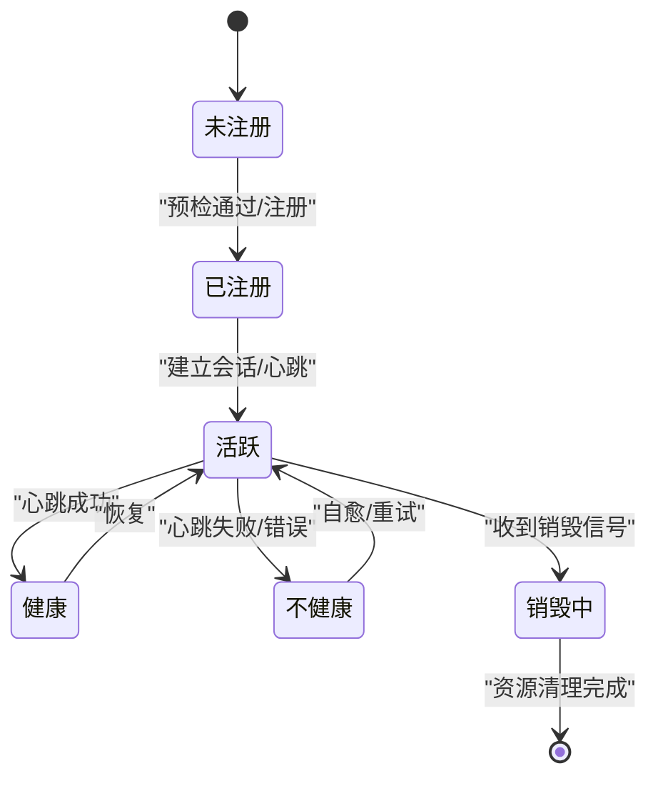
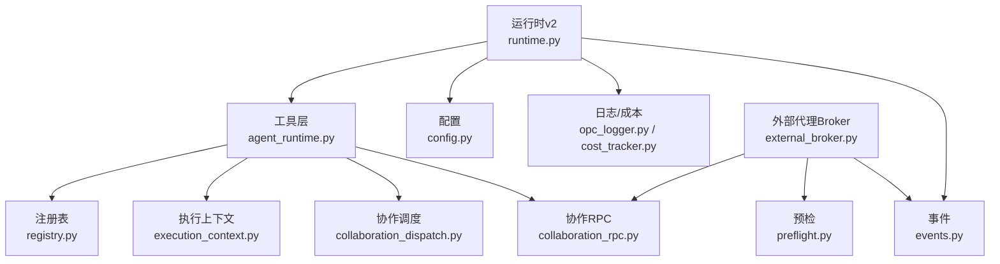

# 代理运行时接口

<cite>
**本文引用的文件**   
- [opc/layer3_agent/native_agent.py](file://opc/layer3_agent/native_agent.py)
- [opc/layer3_agent/external_broker.py](file://opc/layer3_agent/external_broker.py)
- [opc/layer3_agent/runtime_v2/runtime.py](file://opc/layer3_agent/runtime_v2/runtime.py)
- [opc/layer3_agent/runtime_v2/tool_hooks.py](file://opc/layer3_agent/runtime_v2/tool_hooks.py)
- [opc/layer3_agent/runtime_v2/streaming_tool_executor.py](file://opc/layer3_agent/runtime_v2/streaming_tool_executor.py)
- [opc/layer3_agent/runtime_v2/subagents.py](file://opc/layer3_agent/runtime_v2/subagents.py)
- [opc/layer3_agent/runtime_v2/worktree.py](file://opc/layer3_agent/runtime_v2/worktree.py)
- [opc/layer3_agent/runtime_v2/tool_planner.py](file://opc/layer3_agent/runtime_v2/tool_planner.py)
- [opc/layer4_tools/agent_runtime.py](file://opc/layer4_tools/agent_runtime.py)
- [opc/layer4_tools/registry.py](file://opc/layer4_tools/registry.py)
- [opc/layer4_tools/execution_context.py](file://opc/layer4_tools/execution_context.py)
- [opc/layer4_tools/collaboration_rpc.py](file://opc/layer4_tools/collaboration_rpc.py)
- [opc/layer4_tools/collaboration_dispatch.py](file://opc/layer4_tools/collaboration_dispatch.py)
- [opc/core/config.py](file://opc/core/config.py)
- [opc/core/events.py](file://opc/core/events.py)
- [opc/layer6_observability/opc_logger.py](file://opc/layer6_observability/opc_logger.py)
- [opc/layer6_observability/cost_tracker.py](file://opc/layer6_observability/cost_tracker.py)
- [opc/layer3_agent/preflight.py](file://opc/layer3_agent/preflight.py)
- [opc/layer3_agent/company_runtime_contract.py](file://opc/layer3_agent/company_runtime_contract.py)
- [opc/layer1_perception/task_router.py](file://opc/layer1_perception/task_router.py)
- [opc/channels/session.py](file://opc/channels/session.py)
- [opc/channels/manager.py](file://opc/channels/manager.py)
</cite>

## 目录
1. [简介](#简介)
2. [项目结构](#项目结构)
3. [核心组件](#核心组件)
4. [架构总览](#架构总览)
5. [详细组件分析](#详细组件分析)
6. [依赖分析](#依赖分析)
7. [性能考虑](#性能考虑)
8. [故障诊断指南](#故障诊断指南)
9. [结论](#结论)
10. [附录](#附录)

## 简介
本文件面向OpenOPC的“代理运行时接口”，聚焦原生代理与外部代理的运行时API，覆盖以下关键主题：
- 代理生命周期管理（注册、发现、启动、销毁）
- 会话控制与上下文隔离
- 工具调用与流式执行
- 代理间通信协议与状态同步
- 错误处理策略与可观测性
- 配置管理、权限控制与资源隔离
- 监控、调试与故障诊断
- 代理适配器开发规范与集成方式

目标是帮助开发者正确扩展与管理代理运行时功能，确保在复杂协作场景下的稳定性与可扩展性。

## 项目结构
围绕代理运行时的代码主要分布在如下模块：
- 原生代理与运行时v2：定义原生代理能力、工具编排、子代理与工作树等
- 外部代理：通过Broker进行外部代理的注册、发现、会话与消息路由
- 工具层：统一工具注册、执行上下文、协作RPC与调度
- 配置与事件：集中配置加载与系统事件总线
- 可观测性：日志与成本追踪
- 通道与会话：跨渠道的会话抽象与管理

图表来源
- [opc/layer3_agent/native_agent.py](file://opc/layer3_agent/native_agent.py)
- [opc/layer3_agent/runtime_v2/runtime.py](file://opc/layer3_agent/runtime_v2/runtime.py)
- [opc/layer3_agent/runtime_v2/tool_hooks.py](file://opc/layer3_agent/runtime_v2/tool_hooks.py)
- [opc/layer3_agent/runtime_v2/streaming_tool_executor.py](file://opc/layer3_agent/runtime_v2/streaming_tool_executor.py)
- [opc/layer3_agent/runtime_v2/subagents.py](file://opc/layer3_agent/runtime_v2/subagents.py)
- [opc/layer3_agent/runtime_v2/worktree.py](file://opc/layer3_agent/runtime_v2/worktree.py)
- [opc/layer3_agent/runtime_v2/tool_planner.py](file://opc/layer3_agent/runtime_v2/tool_planner.py)
- [opc/layer3_agent/external_broker.py](file://opc/layer3_agent/external_broker.py)
- [opc/layer3_agent/preflight.py](file://opc/layer3_agent/preflight.py)
- [opc/layer4_tools/agent_runtime.py](file://opc/layer4_tools/agent_runtime.py)
- [opc/layer4_tools/registry.py](file://opc/layer4_tools/registry.py)
- [opc/layer4_tools/execution_context.py](file://opc/layer4_tools/execution_context.py)
- [opc/layer4_tools/collaboration_rpc.py](file://opc/layer4_tools/collaboration_rpc.py)
- [opc/layer4_tools/collaboration_dispatch.py](file://opc/layer4_tools/collaboration_dispatch.py)
- [opc/core/config.py](file://opc/core/config.py)
- [opc/core/events.py](file://opc/core/events.py)
- [opc/layer6_observability/opc_logger.py](file://opc/layer6_observability/opc_logger.py)
- [opc/layer6_observability/cost_tracker.py](file://opc/layer6_observability/cost_tracker.py)
- [opc/layer1_perception/task_router.py](file://opc/layer1_perception/task_router.py)
- [opc/channels/session.py](file://opc/channels/session.py)
- [opc/channels/manager.py](file://opc/channels/manager.py)

章节来源
- [opc/layer3_agent/native_agent.py](file://opc/layer3_agent/native_agent.py)
- [opc/layer3_agent/runtime_v2/runtime.py](file://opc/layer3_agent/runtime_v2/runtime.py)
- [opc/layer3_agent/external_broker.py](file://opc/layer3_agent/external_broker.py)
- [opc/layer4_tools/agent_runtime.py](file://opc/layer4_tools/agent_runtime.py)
- [opc/core/config.py](file://opc/core/config.py)
- [opc/core/events.py](file://opc/core/events.py)
- [opc/layer6_observability/opc_logger.py](file://opc/layer6_observability/opc_logger.py)
- [opc/layer6_observability/cost_tracker.py](file://opc/layer6_observability/cost_tracker.py)
- [opc/layer1_perception/task_router.py](file://opc/layer1_perception/task_router.py)
- [opc/channels/session.py](file://opc/channels/session.py)
- [opc/channels/manager.py](file://opc/channels/manager.py)

## 核心组件
- 原生代理运行时v2：提供统一的工具编排、流式执行、子代理与工作树管理能力，是原生代理的核心运行时。
- 外部代理Broker：负责外部代理的注册、发现、会话建立、消息路由与生命周期协调。
- 工具层：统一工具注册表、执行上下文、协作RPC与调度，为原生与外部代理提供一致的工具调用体验。
- 配置与事件：集中读取配置项，发布/订阅系统事件，贯穿代理生命周期。
- 可观测性：结构化日志与成本追踪，用于性能分析与费用归因。
- 通道与会话：跨渠道的会话抽象，承载用户交互与状态持久化。

章节来源
- [opc/layer3_agent/runtime_v2/runtime.py](file://opc/layer3_agent/runtime_v2/runtime.py)
- [opc/layer3_agent/external_broker.py](file://opc/layer3_agent/external_broker.py)
- [opc/layer4_tools/agent_runtime.py](file://opc/layer4_tools/agent_runtime.py)
- [opc/core/config.py](file://opc/core/config.py)
- [opc/core/events.py](file://opc/core/events.py)
- [opc/layer6_observability/opc_logger.py](file://opc/layer6_observability/opc_logger.py)
- [opc/layer6_observability/cost_tracker.py](file://opc/layer6_observability/cost_tracker.py)
- [opc/channels/session.py](file://opc/channels/session.py)
- [opc/channels/manager.py](file://opc/channels/manager.py)

## 架构总览
下图展示原生代理与外部代理在运行时中的交互关系，包括工具调用、协作RPC、事件与配置注入。

图表来源
- [opc/layer1_perception/task_router.py](file://opc/layer1_perception/task_router.py)
- [opc/layer3_agent/runtime_v2/runtime.py](file://opc/layer3_agent/runtime_v2/runtime.py)
- [opc/layer4_tools/agent_runtime.py](file://opc/layer4_tools/agent_runtime.py)
- [opc/layer3_agent/external_broker.py](file://opc/layer3_agent/external_broker.py)
- [opc/layer3_agent/runtime_v2/subagents.py](file://opc/layer3_agent/runtime_v2/subagents.py)
- [opc/layer6_observability/opc_logger.py](file://opc/layer6_observability/opc_logger.py)
- [opc/layer6_observability/cost_tracker.py](file://opc/layer6_observability/cost_tracker.py)

## 详细组件分析

### 原生代理运行时v2
- 职责
  - 组织工具规划与执行，支持流式输出
  - 管理工作树（工作区/产物）与上下文
  - 管理子代理的创建、委派与回收
  - 与外部代理Broker协作，完成跨进程/跨实例的任务分发
- 关键接口
  - 工具编排：基于工具规划器生成执行计划，结合流式执行器逐步产出中间结果
  - 子代理：按需创建并隔离执行环境，聚合子任务结果
  - 工作树：维护临时工作空间与产物路径，保证并发安全
- 设计要点
  - 将“工具调用”与“执行上下文”解耦，便于权限控制与资源隔离
  - 通过事件总线上报进度、错误与指标，供上层可视化与审计

图表来源
- [opc/layer3_agent/runtime_v2/runtime.py](file://opc/layer3_agent/runtime_v2/runtime.py)
- [opc/layer3_agent/runtime_v2/tool_hooks.py](file://opc/layer3_agent/runtime_v2/tool_hooks.py)
- [opc/layer3_agent/runtime_v2/streaming_tool_executor.py](file://opc/layer3_agent/runtime_v2/streaming_tool_executor.py)
- [opc/layer3_agent/runtime_v2/subagents.py](file://opc/layer3_agent/runtime_v2/subagents.py)
- [opc/layer3_agent/runtime_v2/worktree.py](file://opc/layer3_agent/runtime_v2/worktree.py)
- [opc/layer3_agent/runtime_v2/tool_planner.py](file://opc/layer3_agent/runtime_v2/tool_planner.py)

章节来源
- [opc/layer3_agent/runtime_v2/runtime.py](file://opc/layer3_agent/runtime_v2/runtime.py)
- [opc/layer3_agent/runtime_v2/tool_hooks.py](file://opc/layer3_agent/runtime_v2/tool_hooks.py)
- [opc/layer3_agent/runtime_v2/streaming_tool_executor.py](file://opc/layer3_agent/runtime_v2/streaming_tool_executor.py)
- [opc/layer3_agent/runtime_v2/subagents.py](file://opc/layer3_agent/runtime_v2/subagents.py)
- [opc/layer3_agent/runtime_v2/worktree.py](file://opc/layer3_agent/runtime_v2/worktree.py)
- [opc/layer3_agent/runtime_v2/tool_planner.py](file://opc/layer3_agent/runtime_v2/tool_planner.py)

### 外部代理Broker
- 职责
  - 外部代理的注册与发现
  - 会话建立、心跳与健康检查
  - 消息路由与状态同步
  - 生命周期管理（启动、停止、销毁）
- 关键流程
  - 预检：连接可用性、能力清单、权限范围
  - 注册：向注册中心登记能力与元数据
  - 发现：按能力/标签选择合适的外部代理
  - 会话：建立会话上下文，绑定身份与权限
  - 通信：基于协作RPC或消息总线进行双向调用
  - 销毁：优雅关闭、释放资源、清理会话

图表来源
- [opc/layer3_agent/external_broker.py](file://opc/layer3_agent/external_broker.py)
- [opc/layer3_agent/preflight.py](file://opc/layer3_agent/preflight.py)

章节来源
- [opc/layer3_agent/external_broker.py](file://opc/layer3_agent/external_broker.py)
- [opc/layer3_agent/preflight.py](file://opc/layer3_agent/preflight.py)

### 工具调用与执行上下文
- 工具注册表：集中管理工具元数据、参数契约与权限要求
- 执行上下文：携带会话、用户、租户、配额、审计ID等上下文信息
- 协作RPC：跨代理/跨进程的远程过程调用封装，包含鉴权、限流与重试
- 协作调度：根据负载与能力进行任务分发与负载均衡

图表来源
- [opc/layer4_tools/agent_runtime.py](file://opc/layer4_tools/agent_runtime.py)
- [opc/layer4_tools/registry.py](file://opc/layer4_tools/registry.py)
- [opc/layer4_tools/execution_context.py](file://opc/layer4_tools/execution_context.py)
- [opc/layer4_tools/collaboration_rpc.py](file://opc/layer4_tools/collaboration_rpc.py)
- [opc/layer4_tools/collaboration_dispatch.py](file://opc/layer4_tools/collaboration_dispatch.py)

章节来源
- [opc/layer4_tools/agent_runtime.py](file://opc/layer4_tools/agent_runtime.py)
- [opc/layer4_tools/registry.py](file://opc/layer4_tools/registry.py)
- [opc/layer4_tools/execution_context.py](file://opc/layer4_tools/execution_context.py)
- [opc/layer4_tools/collaboration_rpc.py](file://opc/layer4_tools/collaboration_rpc.py)
- [opc/layer4_tools/collaboration_dispatch.py](file://opc/layer4_tools/collaboration_dispatch.py)

### 会话控制与通道
- 会话抽象：跨渠道的统一会话模型，承载消息、上下文与状态
- 通道管理器：统一管理不同渠道的接入、路由与生命周期
- 与代理运行时联动：会话变更事件驱动代理状态更新

图表来源
- [opc/channels/manager.py](file://opc/channels/manager.py)
- [opc/channels/session.py](file://opc/channels/session.py)
- [opc/layer3_agent/runtime_v2/runtime.py](file://opc/layer3_agent/runtime_v2/runtime.py)

章节来源
- [opc/channels/manager.py](file://opc/channels/manager.py)
- [opc/channels/session.py](file://opc/channels/session.py)
- [opc/layer3_agent/runtime_v2/runtime.py](file://opc/layer3_agent/runtime_v2/runtime.py)

### 配置管理与权限控制
- 配置来源：集中配置文件与环境变量，运行时动态加载
- 权限模型：基于工具契约与执行上下文的细粒度权限控制
- 资源隔离：工作树与子代理沙箱，限制I/O与计算配额

图表来源
- [opc/core/config.py](file://opc/core/config.py)
- [opc/layer4_tools/execution_context.py](file://opc/layer4_tools/execution_context.py)
- [opc/layer3_agent/runtime_v2/worktree.py](file://opc/layer3_agent/runtime_v2/worktree.py)
- [opc/layer3_agent/runtime_v2/subagents.py](file://opc/layer3_agent/runtime_v2/subagents.py)

章节来源
- [opc/core/config.py](file://opc/core/config.py)
- [opc/layer4_tools/execution_context.py](file://opc/layer4_tools/execution_context.py)
- [opc/layer3_agent/runtime_v2/worktree.py](file://opc/layer3_agent/runtime_v2/worktree.py)
- [opc/layer3_agent/runtime_v2/subagents.py](file://opc/layer3_agent/runtime_v2/subagents.py)

### 代理间通信协议与状态同步
- 协议抽象：协作RPC封装了序列化、鉴权、重试与超时
- 状态同步：通过事件总线与心跳机制保持代理间一致性
- 可靠性：幂等键、去重与补偿事务保障最终一致性

图表来源
- [opc/layer4_tools/collaboration_rpc.py](file://opc/layer4_tools/collaboration_rpc.py)
- [opc/core/events.py](file://opc/core/events.py)

章节来源
- [opc/layer4_tools/collaboration_rpc.py](file://opc/layer4_tools/collaboration_rpc.py)
- [opc/core/events.py](file://opc/core/events.py)

### 错误处理策略
- 分类：网络错误、权限拒绝、工具执行异常、超时与熔断
- 策略：重试退避、降级回退、快速失败、告警与审计
- 可观测：结构化日志、错误码与堆栈、成本与耗时统计

章节来源
- [opc/layer6_observability/opc_logger.py](file://opc/layer6_observability/opc_logger.py)
- [opc/layer6_observability/cost_tracker.py](file://opc/layer6_observability/cost_tracker.py)

### 代理生命周期管理
- 注册：外部代理启动后完成预检与能力注册
- 发现：根据能力/标签/权重选择目标代理
- 启动：建立会话、注入上下文、预热资源
- 运行：心跳、健康检查、状态同步
- 销毁：优雅关闭、释放资源、清理会话与缓存

图表来源
- [opc/layer3_agent/external_broker.py](file://opc/layer3_agent/external_broker.py)
- [opc/layer3_agent/preflight.py](file://opc/layer3_agent/preflight.py)

章节来源
- [opc/layer3_agent/external_broker.py](file://opc/layer3_agent/external_broker.py)
- [opc/layer3_agent/preflight.py](file://opc/layer3_agent/preflight.py)

### 代理适配器开发规范与集成方式
- 适配目标：实现外部代理的能力描述、会话协议与工具映射
- 必要接口：
  - 能力清单：声明可用工具、输入输出契约与权限要求
  - 会话协议：建立/维持/关闭会话，支持身份与上下文传递
  - 工具映射：将内部工具调用转换为外部代理可理解的格式
  - 错误映射：将外部错误码映射为内部标准错误
- 集成步骤：
  - 注册适配器到外部代理Broker
  - 配置能力与路由规则
  - 启用预检与心跳
  - 验证端到端调用链路

章节来源
- [opc/layer3_agent/external_broker.py](file://opc/layer3_agent/external_broker.py)
- [opc/layer3_agent/preflight.py](file://opc/layer3_agent/preflight.py)
- [opc/layer4_tools/agent_runtime.py](file://opc/layer4_tools/agent_runtime.py)

## 依赖分析
- 组件耦合
  - 原生代理运行时v2依赖工具层、事件总线、配置与可观测性
  - 外部代理Broker依赖预检、协作RPC与事件总线
  - 工具层依赖注册表、执行上下文与协作RPC/调度
- 外部依赖
  - 通道与消息：跨渠道会话与消息路由
  - 日志与成本：统一的可观测性基础设施

图表来源
- [opc/layer3_agent/runtime_v2/runtime.py](file://opc/layer3_agent/runtime_v2/runtime.py)
- [opc/layer4_tools/agent_runtime.py](file://opc/layer4_tools/agent_runtime.py)
- [opc/core/events.py](file://opc/core/events.py)
- [opc/core/config.py](file://opc/core/config.py)
- [opc/layer6_observability/opc_logger.py](file://opc/layer6_observability/opc_logger.py)
- [opc/layer6_observability/cost_tracker.py](file://opc/layer6_observability/cost_tracker.py)
- [opc/layer3_agent/external_broker.py](file://opc/layer3_agent/external_broker.py)
- [opc/layer3_agent/preflight.py](file://opc/layer3_agent/preflight.py)
- [opc/layer4_tools/registry.py](file://opc/layer4_tools/registry.py)
- [opc/layer4_tools/execution_context.py](file://opc/layer4_tools/execution_context.py)
- [opc/layer4_tools/collaboration_rpc.py](file://opc/layer4_tools/collaboration_rpc.py)
- [opc/layer4_tools/collaboration_dispatch.py](file://opc/layer4_tools/collaboration_dispatch.py)

章节来源
- [opc/layer3_agent/runtime_v2/runtime.py](file://opc/layer3_agent/runtime_v2/runtime.py)
- [opc/layer4_tools/agent_runtime.py](file://opc/layer4_tools/agent_runtime.py)
- [opc/core/events.py](file://opc/core/events.py)
- [opc/core/config.py](file://opc/core/config.py)
- [opc/layer6_observability/opc_logger.py](file://opc/layer6_observability/opc_logger.py)
- [opc/layer6_observability/cost_tracker.py](file://opc/layer6_observability/cost_tracker.py)
- [opc/layer3_agent/external_broker.py](file://opc/layer3_agent/external_broker.py)
- [opc/layer3_agent/preflight.py](file://opc/layer3_agent/preflight.py)
- [opc/layer4_tools/registry.py](file://opc/layer4_tools/registry.py)
- [opc/layer4_tools/execution_context.py](file://opc/layer4_tools/execution_context.py)
- [opc/layer4_tools/collaboration_rpc.py](file://opc/layer4_tools/collaboration_rpc.py)
- [opc/layer4_tools/collaboration_dispatch.py](file://opc/layer4_tools/collaboration_dispatch.py)

## 性能考虑
- 流式执行：减少大对象内存占用，提升首字节延迟
- 并行与隔离：子代理与工作树隔离，避免资源争用
- 重试与退避：对瞬时错误进行可控重试，避免雪崩
- 成本与度量：跟踪工具调用次数、时长与成本，指导优化
- 缓存与复用：会话上下文与工具结果的合理缓存策略

[本节为通用性能建议，无需特定文件引用]

## 故障诊断指南
- 日志定位：使用结构化日志关键字检索错误堆栈与上下文
- 成本追踪：结合成本追踪定位高耗工具与异常调用路径
- 事件回溯：通过事件总线回放关键状态变更，定位不一致问题
- 健康检查：关注外部代理心跳与健康状态，及时隔离不健康节点
- 会话诊断：核对会话上下文与权限，确认身份与配额是否正确注入

章节来源
- [opc/layer6_observability/opc_logger.py](file://opc/layer6_observability/opc_logger.py)
- [opc/layer6_observability/cost_tracker.py](file://opc/layer6_observability/cost_tracker.py)
- [opc/core/events.py](file://opc/core/events.py)

## 结论
本技术文档系统化梳理了OpenOPC代理运行时的核心接口与运行机制，涵盖原生与外部代理的生命周期、会话控制、工具调用、通信协议、状态同步、错误处理、配置与权限、资源隔离、性能监控与故障诊断，以及适配器开发规范。遵循本文档的设计与实践，可有效扩展与管理代理运行时功能，构建稳定、可观测、可扩展的代理生态。

[本节为总结性内容，无需特定文件引用]

## 附录
- 术语
  - 原生代理：由OpenOPC直接管理的代理实例
  - 外部代理：独立进程/服务实现的代理，通过Broker接入
  - 工具：可被代理调用的能力单元，具备契约与权限
  - 工作树：代理执行的临时工作空间与产物目录
  - 子代理：由主代理创建的从属代理，用于任务拆分与隔离
- 参考入口
  - 原生代理运行时v2：[opc/layer3_agent/runtime_v2/runtime.py](file://opc/layer3_agent/runtime_v2/runtime.py)
  - 外部代理Broker：[opc/layer3_agent/external_broker.py](file://opc/layer3_agent/external_broker.py)
  - 工具层接口：[opc/layer4_tools/agent_runtime.py](file://opc/layer4_tools/agent_runtime.py)
  - 配置与事件：[opc/core/config.py](file://opc/core/config.py)、[opc/core/events.py](file://opc/core/events.py)
  - 可观测性：[opc/layer6_observability/opc_logger.py](file://opc/layer6_observability/opc_logger.py)、[opc/layer6_observability/cost_tracker.py](file://opc/layer6_observability/cost_tracker.py)
  - 通道与会话：[opc/channels/manager.py](file://opc/channels/manager.py)、[opc/channels/session.py](file://opc/channels/session.py)