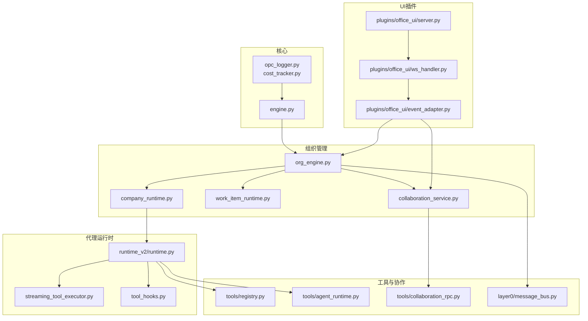
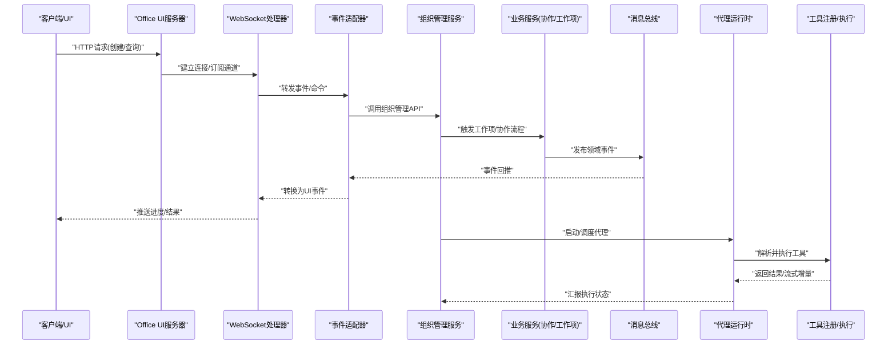
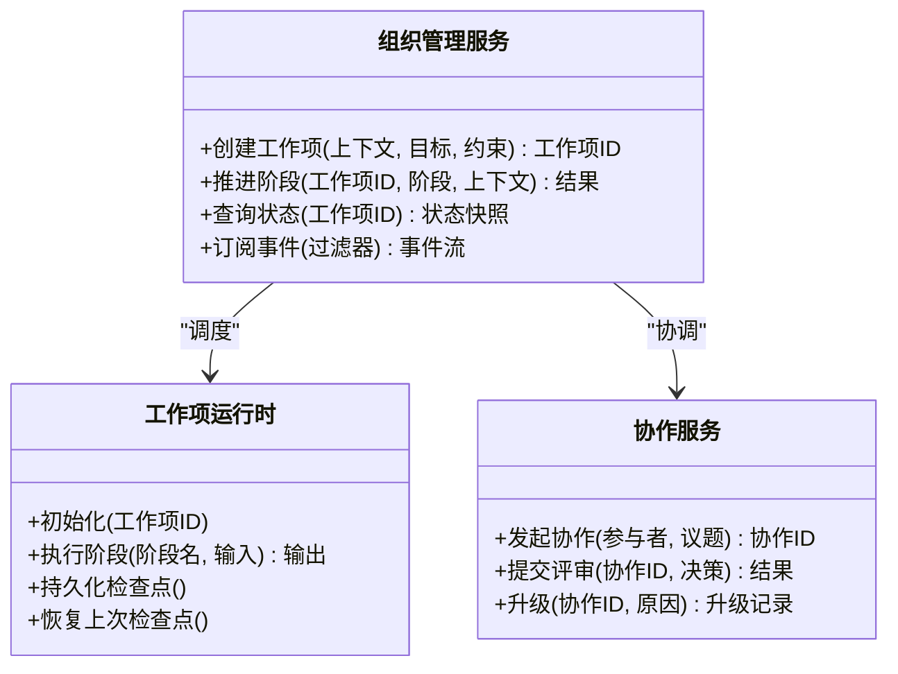
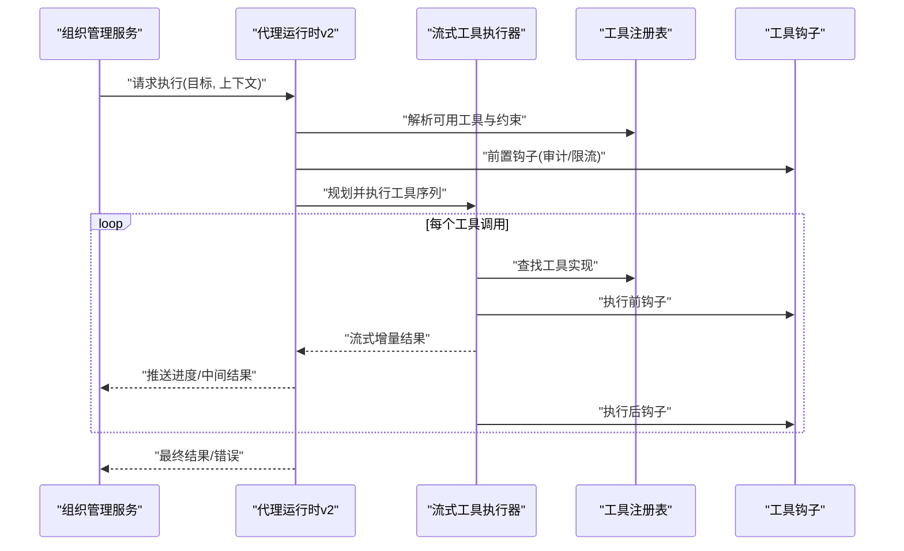
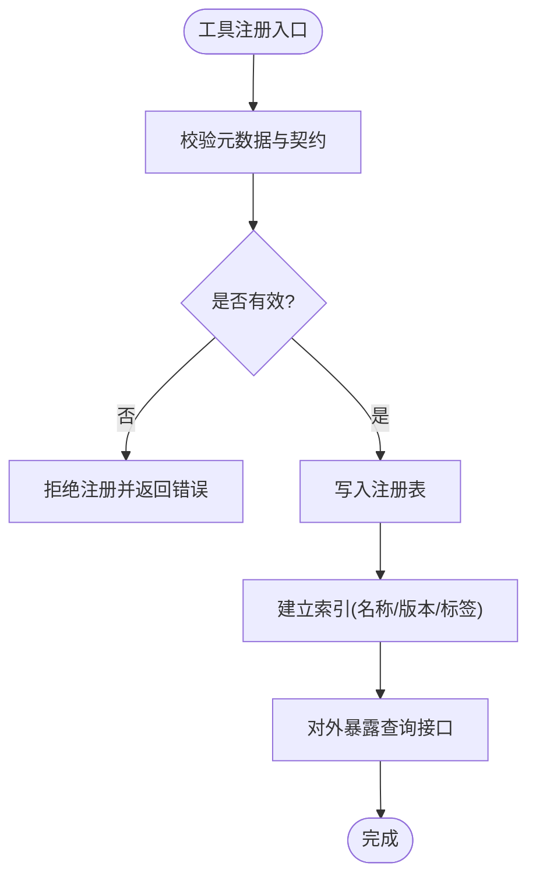
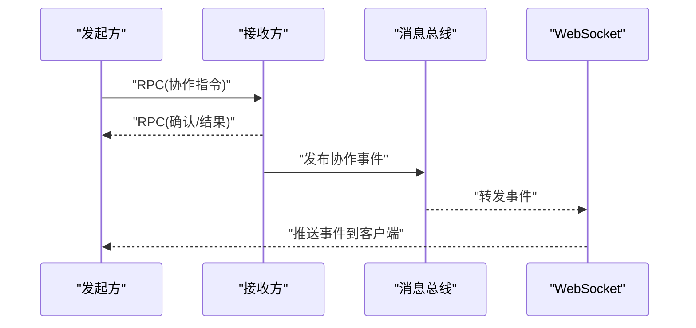
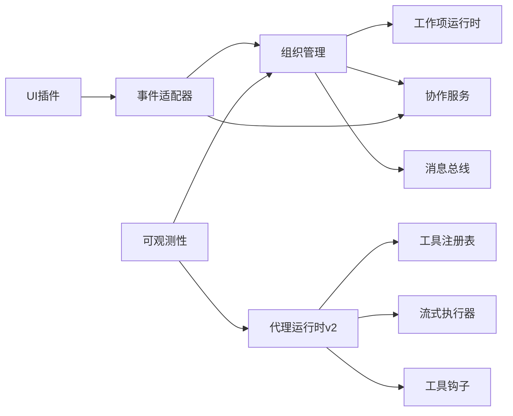

# 内部服务接口

<cite>
**本文引用的文件**   
- [engine.py](file://opc/engine.py)
- [org_engine.py](file://opc/layer2_organization/org_engine.py)
- [company_runtime.py](file://opc/layer2_organization/company_runtime.py)
- [work_item_runtime.py](file://opc/layer2_organization/work_item_runtime.py)
- [collaboration_service.py](file://opc/layer2_organization/collaboration_service.py)
- [collaboration_rpc.py](file://opc/layer4_tools/collaboration_rpc.py)
- [message_bus.py](file://opc/layer0_interaction/message_bus.py)
- [event_adapter.py](file://opc/plugins/office_ui/event_adapter.py)
- [ws_handler.py](file://opc/plugins/office_ui/ws_handler.py)
- [server.py](file://opc/plugins/office_ui/server.py)
- [registry.py](file://opc/layer4_tools/registry.py)
- [agent_runtime.py](file://opc/layer4_tools/agent_runtime.py)
- [runtime.py](file://opc/layer3_agent/runtime_v2/runtime.py)
- [streaming_tool_executor.py](file://opc/layer3_agent/runtime_v2/streaming_tool_executor.py)
- [tool_hooks.py](file://opc/layer3_agent/runtime_v2/tool_hooks.py)
- [opc_logger.py](file://opc/layer6_observability/opc_logger.py)
- [cost_tracker.py](file://opc/layer6_observability/cost_tracker.py)
</cite>

## 目录
1. [简介](#简介)
2. [项目结构](#项目结构)
3. [核心组件](#核心组件)
4. [架构总览](#架构总览)
5. [详细组件分析](#详细组件分析)
6. [依赖关系分析](#依赖关系分析)
7. [性能与可扩展性](#性能与可扩展性)
8. [故障排查指南](#故障排查指南)
9. [结论](#结论)
10. [附录：SDK与客户端使用示例](#附录sdk与客户端使用示例)

## 简介
本文件面向OpenOPC的内部服务接口，聚焦于组织管理服务、代理运行时服务和工具注册服务的定义与交互。文档覆盖以下方面：
- 服务边界与职责划分
- 服务间通信协议、数据交换格式与调用约定
- 异步调用机制、事件驱动架构与消息传递模式
- 服务发现、负载均衡与容错策略
- 监控、日志与性能追踪方法
- SDK封装与客户端库使用示例
- 版本管理与依赖关系说明

目标是帮助开发者基于内部服务进行功能扩展与集成，确保正确理解接口契约与运行期行为。

## 项目结构
OpenOPC采用分层与插件化设计：
- 核心引擎入口位于 opc/engine.py，负责生命周期编排与子系统装配
- 组织管理层位于 opc/layer2_organization，提供组织管理、工作项生命周期与公司级协作能力
- 代理运行时层位于 opc/layer3_agent，包含v2运行时与流式工具执行
- 工具层位于 opc/layer4_tools，提供工具注册、执行与协作RPC
- 可观测性位于 opc/layer6_observability，提供日志与成本追踪
- Office UI插件通过HTTP/WebSocket暴露前端交互面，内部通过事件适配器桥接后端服务

图表来源
- [engine.py](file://opc/engine.py)
- [org_engine.py](file://opc/layer2_organization/org_engine.py)
- [company_runtime.py](file://opc/layer2_organization/company_runtime.py)
- [work_item_runtime.py](file://opc/layer2_organization/work_item_runtime.py)
- [collaboration_service.py](file://opc/layer2_organization/collaboration_service.py)
- [message_bus.py](file://opc/layer0_interaction/message_bus.py)
- [runtime.py](file://opc/layer3_agent/runtime_v2/runtime.py)
- [streaming_tool_executor.py](file://opc/layer3_agent/runtime_v2/streaming_tool_executor.py)
- [tool_hooks.py](file://opc/layer3_agent/runtime_v2/tool_hooks.py)
- [registry.py](file://opc/layer4_tools/registry.py)
- [agent_runtime.py](file://opc/layer4_tools/agent_runtime.py)
- [collaboration_rpc.py](file://opc/layer4_tools/collaboration_rpc.py)
- [server.py](file://opc/plugins/office_ui/server.py)
- [ws_handler.py](file://opc/plugins/office_ui/ws_handler.py)
- [event_adapter.py](file://opc/plugins/office_ui/event_adapter.py)
- [opc_logger.py](file://opc/layer6_observability/opc_logger.py)
- [cost_tracker.py](file://opc/layer6_observability/cost_tracker.py)

章节来源
- [engine.py](file://opc/engine.py)
- [org_engine.py](file://opc/layer2_organization/org_engine.py)
- [company_runtime.py](file://opc/layer2_organization/company_runtime.py)
- [work_item_runtime.py](file://opc/layer2_organization/work_item_runtime.py)
- [collaboration_service.py](file://opc/layer2_organization/collaboration_service.py)
- [message_bus.py](file://opc/layer0_interaction/message_bus.py)
- [runtime.py](file://opc/layer3_agent/runtime_v2/runtime.py)
- [streaming_tool_executor.py](file://opc/layer3_agent/runtime_v2/streaming_tool_executor.py)
- [tool_hooks.py](file://opc/layer3_agent/runtime_v2/tool_hooks.py)
- [registry.py](file://opc/layer4_tools/registry.py)
- [agent_runtime.py](file://opc/layer4_tools/agent_runtime.py)
- [collaboration_rpc.py](file://opc/layer4_tools/collaboration_rpc.py)
- [server.py](file://opc/plugins/office_ui/server.py)
- [ws_handler.py](file://opc/plugins/office_ui/ws_handler.py)
- [event_adapter.py](file://opc/plugins/office_ui/event_adapter.py)
- [opc_logger.py](file://opc/layer6_observability/opc_logger.py)
- [cost_tracker.py](file://opc/layer6_observability/cost_tracker.py)

## 核心组件
本节概述三大内部服务及其职责：
- 组织管理服务：负责组织架构、角色与工作项的创建、调度、状态机推进与跨会话协作
- 代理运行时服务：提供Agent v2运行时，包括工具规划、流式执行、权限与钩子
- 工具注册服务：集中注册、发现与分发工具，支持动态加载与版本约束

关键要点：
- 组织管理以工作项为基本单元，结合阶段与状态机实现可靠推进
- 代理运行时通过工具钩子与流式执行器对接工具层，保证可观测性与可控性
- 工具注册表维护工具元数据、参数契约与兼容性信息，供运行时解析与校验

章节来源
- [org_engine.py](file://opc/layer2_organization/org_engine.py)
- [work_item_runtime.py](file://opc/layer2_organization/work_item_runtime.py)
- [company_runtime.py](file://opc/layer2_organization/company_runtime.py)
- [runtime.py](file://opc/layer3_agent/runtime_v2/runtime.py)
- [streaming_tool_executor.py](file://opc/layer3_agent/runtime_v2/streaming_tool_executor.py)
- [registry.py](file://opc/layer4_tools/registry.py)

## 架构总览
内部服务采用“事件总线 + RPC + WebSocket”的混合通信模型：
- 同步RPC用于强一致性的控制面操作（如创建工作项、查询状态）
- 事件总线用于解耦的领域事件传播（如任务完成、审批结果）
- WebSocket用于实时推送（如进度、日志、用户输入提示）

图表来源
- [server.py](file://opc/plugins/office_ui/server.py)
- [ws_handler.py](file://opc/plugins/office_ui/ws_handler.py)
- [event_adapter.py](file://opc/plugins/office_ui/event_adapter.py)
- [org_engine.py](file://opc/layer2_organization/org_engine.py)
- [collaboration_service.py](file://opc/layer2_organization/collaboration_service.py)
- [message_bus.py](file://opc/layer0_interaction/message_bus.py)
- [runtime.py](file://opc/layer3_agent/runtime_v2/runtime.py)
- [streaming_tool_executor.py](file://opc/layer3_agent/runtime_v2/streaming_tool_executor.py)
- [registry.py](file://opc/layer4_tools/registry.py)

## 详细组件分析

### 组织管理服务
职责范围：
- 组织配置与快照、公司级运行时上下文
- 工作项生命周期：创建、路由、阶段推进、恢复与检查点
- 协作策略与审批、升级、目标管理等

关键接口与约定：
- 工作项创建：接受上下文、目标与约束，返回工作项标识与初始阶段
- 阶段转换：携带前置条件与后置动作，支持幂等与重试
- 协作事件：通过事件总线广播，订阅者按需消费

图表来源
- [org_engine.py](file://opc/layer2_organization/org_engine.py)
- [work_item_runtime.py](file://opc/layer2_organization/work_item_runtime.py)
- [collaboration_service.py](file://opc/layer2_organization/collaboration_service.py)

章节来源
- [org_engine.py](file://opc/layer2_organization/org_engine.py)
- [work_item_runtime.py](file://opc/layer2_organization/work_item_runtime.py)
- [collaboration_service.py](file://opc/layer2_organization/collaboration_service.py)

### 代理运行时服务（v2）
职责范围：
- 工具规划与选择、权限校验、上下文组装
- 流式工具执行与增量结果推送
- 工具钩子：在工具前后注入审计、限流、缓存等横切逻辑

关键接口与约定：
- 规划阶段：根据目标生成工具调用序列
- 执行阶段：按序或并行执行，支持流式回调
- 钩子链：允许外部扩展拦截与增强

图表来源
- [runtime.py](file://opc/layer3_agent/runtime_v2/runtime.py)
- [streaming_tool_executor.py](file://opc/layer3_agent/runtime_v2/streaming_tool_executor.py)
- [registry.py](file://opc/layer4_tools/registry.py)
- [tool_hooks.py](file://opc/layer3_agent/runtime_v2/tool_hooks.py)

章节来源
- [runtime.py](file://opc/layer3_agent/runtime_v2/runtime.py)
- [streaming_tool_executor.py](file://opc/layer3_agent/runtime_v2/streaming_tool_executor.py)
- [tool_hooks.py](file://opc/layer3_agent/runtime_v2/tool_hooks.py)
- [registry.py](file://opc/layer4_tools/registry.py)

### 工具注册服务
职责范围：
- 工具元数据注册：名称、版本、参数契约、权限要求
- 动态发现与加载：支持热插拔与版本兼容检查
- 执行路由：根据上下文与策略选择合适实现

关键接口与约定：
- 注册：声明式注册，附带校验规则与描述
- 查询：按标签/版本/权限过滤
- 执行：由运行时调用，返回结构化结果与流式事件

图表来源
- [registry.py](file://opc/layer4_tools/registry.py)

章节来源
- [registry.py](file://opc/layer4_tools/registry.py)

### 协作RPC与服务间通信
职责范围：
- 组织内跨实体协作：邀请、评审、升级、共识达成
- 内部RPC：轻量远程过程调用，承载协作指令与结果

通信协议与数据格式：
- 同步RPC：请求-响应，带超时与重试策略
- 事件：不可变事件对象，含类型、时间戳、关联ID与负载
- WebSocket：双向通道，用于实时推送与交互式输入

图表来源
- [collaboration_rpc.py](file://opc/layer4_tools/collaboration_rpc.py)
- [message_bus.py](file://opc/layer0_interaction/message_bus.py)
- [ws_handler.py](file://opc/plugins/office_ui/ws_handler.py)

章节来源
- [collaboration_rpc.py](file://opc/layer4_tools/collaboration_rpc.py)
- [message_bus.py](file://opc/layer0_interaction/message_bus.py)
- [ws_handler.py](file://opc/plugins/office_ui/ws_handler.py)

## 依赖关系分析
- 组织管理依赖工作项运行时与协作服务，并通过消息总线与外部系统解耦
- 代理运行时依赖工具注册表与工具钩子，流式执行器作为执行内核
- UI插件通过事件适配器将Web事件映射为后端服务调用，同时订阅后端事件推送至前端
- 可观测性贯穿各层：日志与成本追踪在服务入口处采集，并在关键路径埋点

图表来源
- [org_engine.py](file://opc/layer2_organization/org_engine.py)
- [work_item_runtime.py](file://opc/layer2_organization/work_item_runtime.py)
- [collaboration_service.py](file://opc/layer2_organization/collaboration_service.py)
- [message_bus.py](file://opc/layer0_interaction/message_bus.py)
- [runtime.py](file://opc/layer3_agent/runtime_v2/runtime.py)
- [streaming_tool_executor.py](file://opc/layer3_agent/runtime_v2/streaming_tool_executor.py)
- [tool_hooks.py](file://opc/layer3_agent/runtime_v2/tool_hooks.py)
- [registry.py](file://opc/layer4_tools/registry.py)
- [event_adapter.py](file://opc/plugins/office_ui/event_adapter.py)
- [opc_logger.py](file://opc/layer6_observability/opc_logger.py)
- [cost_tracker.py](file://opc/layer6_observability/cost_tracker.py)

章节来源
- [org_engine.py](file://opc/layer2_organization/org_engine.py)
- [work_item_runtime.py](file://opc/layer2_organization/work_item_runtime.py)
- [collaboration_service.py](file://opc/layer2_organization/collaboration_service.py)
- [message_bus.py](file://opc/layer0_interaction/message_bus.py)
- [runtime.py](file://opc/layer3_agent/runtime_v2/runtime.py)
- [streaming_tool_executor.py](file://opc/layer3_agent/runtime_v2/streaming_tool_executor.py)
- [tool_hooks.py](file://opc/layer3_agent/runtime_v2/tool_hooks.py)
- [registry.py](file://opc/layer4_tools/registry.py)
- [event_adapter.py](file://opc/plugins/office_ui/event_adapter.py)
- [opc_logger.py](file://opc/layer6_observability/opc_logger.py)
- [cost_tracker.py](file://opc/layer6_observability/cost_tracker.py)

## 性能与可扩展性
- 异步与并发
  - 工作项阶段推进与工具执行采用异步队列与并发控制，避免阻塞主循环
  - 流式执行器支持增量结果推送，降低大对象传输延迟
- 事件驱动
  - 通过消息总线解耦生产与消费，支持水平扩展消费者
  - 事件去重与幂等处理保障重复投递安全
- 服务发现与负载均衡
  - 工具注册表提供本地发现；多实例部署时可通过外部注册中心或网关进行均衡
  - 建议对长耗时工具引入分片与优先级队列
- 容错与恢复
  - 工作项检查点与恢复机制保障失败重试与断点续跑
  - 工具执行设置超时、熔断与降级策略
- 可观测性
  - 统一日志与成本追踪，关键路径埋点（规划、执行、I/O）
  - 指标上报：QPS、延迟分布、错误率、资源占用

[本节为通用指导，不直接分析具体文件]

## 故障排查指南
常见问题与定位步骤：
- 工作项卡住
  - 检查工作项检查点与阶段状态机转换是否成功
  - 查看相关事件是否被正确消费与去重
- 工具执行异常
  - 核对工具注册元数据与参数契约
  - 检查工具钩子是否抛出未捕获异常
- 实时推送缺失
  - 验证WebSocket连接与订阅通道是否正确
  - 检查事件适配器映射与消息总线路由
- 性能瓶颈
  - 关注流式执行器的背压与并发度
  - 分析日志中的慢调用与锁竞争

章节来源
- [work_item_runtime.py](file://opc/layer2_organization/work_item_runtime.py)
- [streaming_tool_executor.py](file://opc/layer3_agent/runtime_v2/streaming_tool_executor.py)
- [event_adapter.py](file://opc/plugins/office_ui/event_adapter.py)
- [ws_handler.py](file://opc/plugins/office_ui/ws_handler.py)
- [opc_logger.py](file://opc/layer6_observability/opc_logger.py)
- [cost_tracker.py](file://opc/layer6_observability/cost_tracker.py)

## 结论
OpenOPC内部服务以组织管理为核心，结合代理运行时与工具注册形成完整执行闭环。通过事件总线与WebSocket实现高内聚、低耦合的异步与实时交互。配合检查点、钩子与可观测性，系统在可靠性、可维护性与扩展性上具备良好基础。开发者应遵循接口契约与事件语义，合理运用异步与流式能力，以获得稳定高效的集成体验。

[本节为总结，不直接分析具体文件]

## 附录：SDK与客户端使用示例
- 组织管理SDK
  - 创建工作项：传入上下文、目标与约束，获取工作项ID
  - 查询状态：按ID拉取当前阶段与历史快照
  - 订阅事件：按过滤器订阅领域事件，处理异步通知
- 代理运行时SDK
  - 执行目标：提交目标与上下文，监听流式增量与最终结果
  - 钩子扩展：注册前置/后置钩子，实现审计、限流与缓存
- 工具注册SDK
  - 注册工具：声明元数据与参数契约，启用版本与权限控制
  - 查询工具：按标签与版本筛选，适配不同环境
- 协作RPC客户端
  - 发起协作：构造协作指令，等待确认与结果
  - 事件消费：订阅协作事件，更新本地视图

章节来源
- [org_engine.py](file://opc/layer2_organization/org_engine.py)
- [work_item_runtime.py](file://opc/layer2_organization/work_item_runtime.py)
- [runtime.py](file://opc/layer3_agent/runtime_v2/runtime.py)
- [streaming_tool_executor.py](file://opc/layer3_agent/runtime_v2/streaming_tool_executor.py)
- [tool_hooks.py](file://opc/layer3_agent/runtime_v2/tool_hooks.py)
- [registry.py](file://opc/layer4_tools/registry.py)
- [collaboration_rpc.py](file://opc/layer4_tools/collaboration_rpc.py)