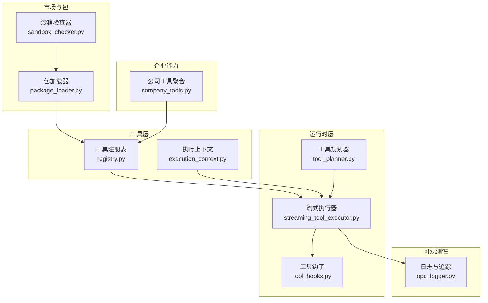
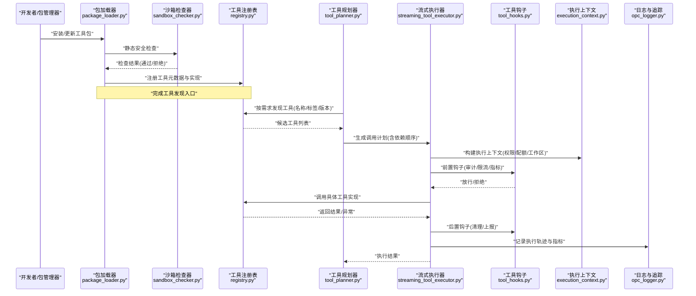
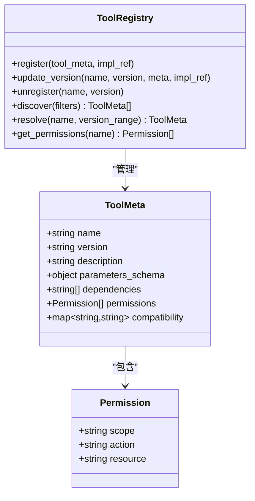
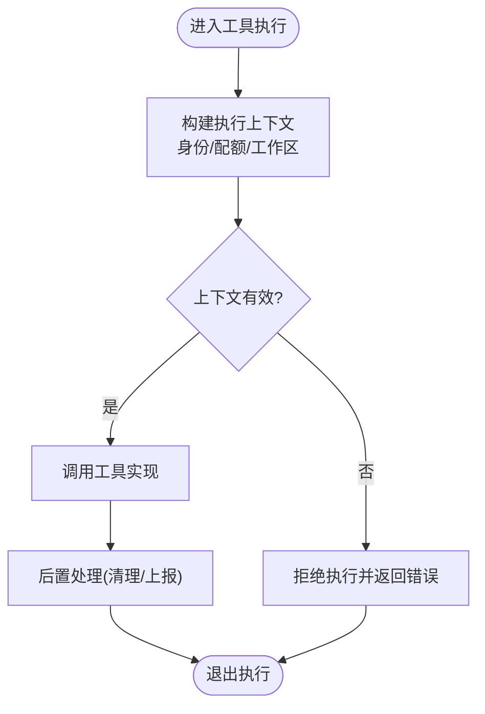
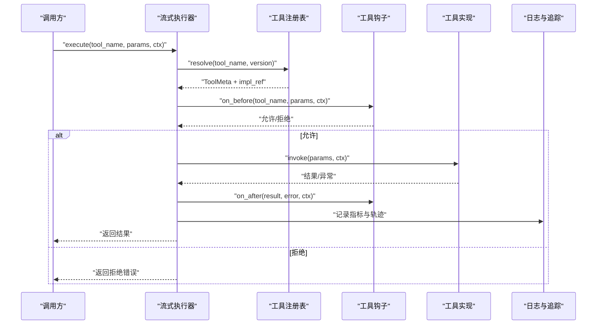
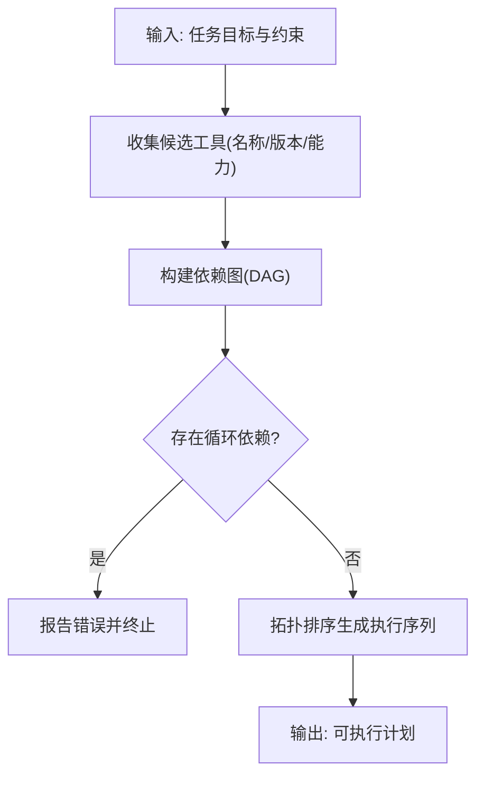
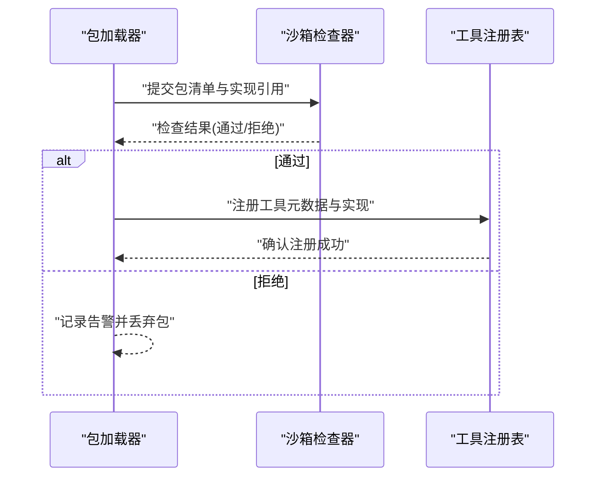
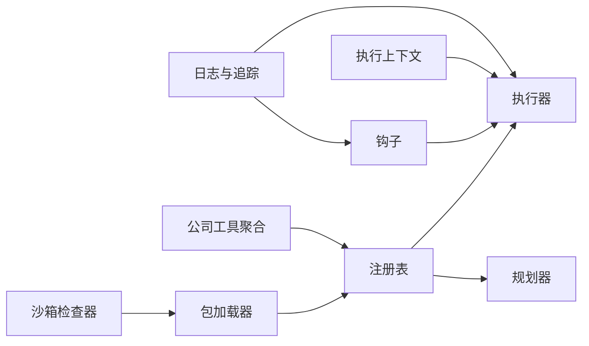

# 工具注册服务接口

<cite>
**本文引用的文件**   
- [opc/layer4_tools/registry.py](file://opc/layer4_tools/registry.py)
- [opc/layer4_tools/execution_context.py](file://opc/layer4_tools/execution_context.py)
- [opc/layer3_agent/runtime_v2/streaming_tool_executor.py](file://opc/layer3_agent/runtime_v2/streaming_tool_executor.py)
- [opc/layer3_agent/runtime_v2/tool_hooks.py](file://opc/layer3_agent/runtime_v2/tool_hooks.py)
- [opc/layer3_agent/runtime_v2/tool_planner.py](file://opc/layer3_agent/runtime_v2/tool_planner.py)
- [opc/market/package_loader.py](file://opc/market/package_loader.py)
- [opc/market/sandbox_checker.py](file://opc/market/sandbox_checker.py)
- [opc/core/company_tools.py](file://opc/core/company_tools.py)
- [opc/layer6_observability/opc_logger.py](file://opc/layer6_observability/opc_logger.py)
- [tests/test_native_tool_stack.py](file://tests/test_native_tool_stack.py)
</cite>

## 目录
1. [简介](#简介)
2. [项目结构](#项目结构)
3. [核心组件](#核心组件)
4. [架构总览](#架构总览)
5. [详细组件分析](#详细组件分析)
6. [依赖关系分析](#依赖关系分析)
7. [性能考量](#性能考量)
8. [故障排查指南](#故障排查指南)
9. [结论](#结论)
10. [附录](#附录)

## 简介
本文件面向OpenOPC的“工具注册服务接口”，聚焦于工具的注册、发现与执行全链路，覆盖以下关键主题：
- 工具元数据管理、参数校验与执行上下文
- 工具生命周期、依赖解析与版本控制
- 权限控制、安全沙箱与资源限制
- 开发规范、测试方法与部署指南
- 性能监控、错误处理与日志记录
- 工具包管理与分发机制

目标是帮助开发者正确开发与集成自定义工具，并在生产环境中稳定运行。

## 项目结构
围绕工具注册与执行的核心代码主要分布在如下模块：
- 工具注册与发现：opc/layer4_tools/registry.py
- 执行上下文：opc/layer4_tools/execution_context.py
- 流式执行器与钩子：opc/layer3_agent/runtime_v2/streaming_tool_executor.py、opc/layer3_agent/runtime_v2/tool_hooks.py
- 工具规划与编排：opc/layer3_agent/runtime_v2/tool_planner.py
- 工具包加载与沙箱检查：opc/market/package_loader.py、opc/market/sandbox_checker.py
- 企业级工具聚合：opc/core/company_tools.py
- 可观测性与日志：opc/layer6_observability/opc_logger.py
- 端到端测试用例：tests/test_native_tool_stack.py

图表来源
- [opc/layer4_tools/registry.py](file://opc/layer4_tools/registry.py)
- [opc/layer4_tools/execution_context.py](file://opc/layer4_tools/execution_context.py)
- [opc/layer3_agent/runtime_v2/streaming_tool_executor.py](file://opc/layer3_agent/runtime_v2/streaming_tool_executor.py)
- [opc/layer3_agent/runtime_v2/tool_hooks.py](file://opc/layer3_agent/runtime_v2/tool_hooks.py)
- [opc/layer3_agent/runtime_v2/tool_planner.py](file://opc/layer3_agent/runtime_v2/tool_planner.py)
- [opc/market/package_loader.py](file://opc/market/package_loader.py)
- [opc/market/sandbox_checker.py](file://opc/market/sandbox_checker.py)
- [opc/core/company_tools.py](file://opc/core/company_tools.py)
- [opc/layer6_observability/opc_logger.py](file://opc/layer6_observability/opc_logger.py)

章节来源
- [opc/layer4_tools/registry.py](file://opc/layer4_tools/registry.py)
- [opc/layer4_tools/execution_context.py](file://opc/layer4_tools/execution_context.py)
- [opc/layer3_agent/runtime_v2/streaming_tool_executor.py](file://opc/layer3_agent/runtime_v2/streaming_tool_executor.py)
- [opc/layer3_agent/runtime_v2/tool_hooks.py](file://opc/layer3_agent/runtime_v2/tool_hooks.py)
- [opc/layer3_agent/runtime_v2/tool_planner.py](file://opc/layer3_agent/runtime_v2/tool_planner.py)
- [opc/market/package_loader.py](file://opc/market/package_loader.py)
- [opc/market/sandbox_checker.py](file://opc/market/sandbox_checker.py)
- [opc/core/company_tools.py](file://opc/core/company_tools.py)
- [opc/layer6_observability/opc_logger.py](file://opc/layer6_observability/opc_logger.py)

## 核心组件
本节概述工具注册服务的核心职责与交互边界：
- 工具注册表（Registry）：负责工具元数据的声明、注册、查询与版本选择；提供按名称或标签的发现能力。
- 执行上下文（ExecutionContext）：封装工具执行所需的环境信息（如会话ID、工作区路径、权限令牌、资源配额等），贯穿整个调用链。
- 流式执行器（StreamingToolExecutor）：统一调度工具执行，支持流式输出、超时控制、重试与回退策略。
- 工具钩子（ToolHooks）：在工具执行前后注入审计、限流、指标上报等横切逻辑。
- 工具规划器（ToolPlanner）：根据任务目标与约束生成工具调用序列，进行依赖解析与顺序编排。
- 包加载器（PackageLoader）：从工具包中扫描并加载工具实现，完成元数据装配与依赖声明。
- 沙箱检查器（SandboxChecker）：对工具包进行静态安全检查，拦截高风险行为与不合规依赖。
- 公司工具聚合（CompanyTools）：将企业内多来源工具合并为统一视图，便于上层消费。
- 日志与追踪（OpcLogger）：提供结构化日志、指标与追踪事件，支撑可观测性。

章节来源
- [opc/layer4_tools/registry.py](file://opc/layer4_tools/registry.py)
- [opc/layer4_tools/execution_context.py](file://opc/layer4_tools/execution_context.py)
- [opc/layer3_agent/runtime_v2/streaming_tool_executor.py](file://opc/layer3_agent/runtime_v2/streaming_tool_executor.py)
- [opc/layer3_agent/runtime_v2/tool_hooks.py](file://opc/layer3_agent/runtime_v2/tool_hooks.py)
- [opc/layer3_agent/runtime_v2/tool_planner.py](file://opc/layer3_agent/runtime_v2/tool_planner.py)
- [opc/market/package_loader.py](file://opc/market/package_loader.py)
- [opc/market/sandbox_checker.py](file://opc/market/sandbox_checker.py)
- [opc/core/company_tools.py](file://opc/core/company_tools.py)
- [opc/layer6_observability/opc_logger.py](file://opc/layer6_observability/opc_logger.py)

## 架构总览
下图展示了从工具包到执行的完整流程，包括注册、发现、规划、执行与可观测性。

图表来源
- [opc/market/package_loader.py](file://opc/market/package_loader.py)
- [opc/market/sandbox_checker.py](file://opc/market/sandbox_checker.py)
- [opc/layer4_tools/registry.py](file://opc/layer4_tools/registry.py)
- [opc/layer3_agent/runtime_v2/tool_planner.py](file://opc/layer3_agent/runtime_v2/tool_planner.py)
- [opc/layer3_agent/runtime_v2/streaming_tool_executor.py](file://opc/layer3_agent/runtime_v2/streaming_tool_executor.py)
- [opc/layer3_agent/runtime_v2/tool_hooks.py](file://opc/layer3_agent/runtime_v2/tool_hooks.py)
- [opc/layer4_tools/execution_context.py](file://opc/layer4_tools/execution_context.py)
- [opc/layer6_observability/opc_logger.py](file://opc/layer6_observability/opc_logger.py)

## 详细组件分析

### 工具注册表（Registry）
职责与能力
- 工具元数据模型：包含名称、版本、描述、参数Schema、依赖声明、权限要求、兼容性矩阵等。
- 注册API：提供添加、更新、删除工具的能力，支持批量注册与热更新。
- 发现API：按名称、标签、版本范围、能力维度进行筛选与排序。
- 版本控制：支持语义化版本选择、冲突检测与降级策略。
- 权限绑定：将工具与角色/组织/环境绑定，作为后续鉴权依据。

典型交互
- 包加载器在完成沙箱检查后，向注册表提交工具清单与实现引用。
- 规划器在执行前查询可用工具集，结合依赖图生成调用序列。
- 执行器通过注册表解析最终要调用的具体实现。

图表来源
- [opc/layer4_tools/registry.py](file://opc/layer4_tools/registry.py)

章节来源
- [opc/layer4_tools/registry.py](file://opc/layer4_tools/registry.py)

### 执行上下文（ExecutionContext）
职责与能力
- 封装执行期环境变量：会话标识、工作区路径、用户身份、租户/组织、时间戳等。
- 资源配额：CPU/内存/IO/网络限额，用于执行器侧限流与熔断。
- 权限令牌：携带最小权限原则的访问凭证，供工具与外部系统使用。
- 生命周期：随请求创建，随执行结束销毁，确保隔离与回收。

图表来源
- [opc/layer4_tools/execution_context.py](file://opc/layer4_tools/execution_context.py)

章节来源
- [opc/layer4_tools/execution_context.py](file://opc/layer4_tools/execution_context.py)

### 流式执行器（StreamingToolExecutor）
职责与能力
- 统一执行入口：接收工具名与参数，基于注册表解析实现并执行。
- 流式输出：支持增量返回中间结果，提升长耗时任务的响应体验。
- 超时与重试：配置最大时长、重试次数与退避策略。
- 错误传播：将工具异常转换为标准错误对象，附带诊断信息。
- 与钩子协作：在前后置阶段触发审计、限流、指标上报等。

图表来源
- [opc/layer3_agent/runtime_v2/streaming_tool_executor.py](file://opc/layer3_agent/runtime_v2/streaming_tool_executor.py)
- [opc/layer3_agent/runtime_v2/tool_hooks.py](file://opc/layer3_agent/runtime_v2/tool_hooks.py)
- [opc/layer4_tools/registry.py](file://opc/layer4_tools/registry.py)
- [opc/layer6_observability/opc_logger.py](file://opc/layer6_observability/opc_logger.py)

章节来源
- [opc/layer3_agent/runtime_v2/streaming_tool_executor.py](file://opc/layer3_agent/runtime_v2/streaming_tool_executor.py)
- [opc/layer3_agent/runtime_v2/tool_hooks.py](file://opc/layer3_agent/runtime_v2/tool_hooks.py)

### 工具规划器（ToolPlanner）
职责与能力
- 依赖解析：基于工具声明的依赖关系构建有向无环图（DAG），确定执行顺序。
- 版本兼容：在满足版本约束的前提下选择最优实现。
- 并行度控制：识别可并行节点，提高吞吐。
- 失败恢复：在部分失败时尝试替代工具或回退路径。

图表来源
- [opc/layer3_agent/runtime_v2/tool_planner.py](file://opc/layer3_agent/runtime_v2/tool_planner.py)
- [opc/layer4_tools/registry.py](file://opc/layer4_tools/registry.py)

章节来源
- [opc/layer3_agent/runtime_v2/tool_planner.py](file://opc/layer3_agent/runtime_v2/tool_planner.py)
- [opc/layer4_tools/registry.py](file://opc/layer4_tools/registry.py)

### 包加载器（PackageLoader）与沙箱检查器（SandboxChecker）
职责与能力
- 包加载器：扫描工具包目录/清单，提取元数据与实现，完成注册前的预处理。
- 沙箱检查器：静态分析工具包，检查危险API调用、未授权网络访问、敏感文件读写等，阻断不合规包。

图表来源
- [opc/market/package_loader.py](file://opc/market/package_loader.py)
- [opc/market/sandbox_checker.py](file://opc/market/sandbox_checker.py)
- [opc/layer4_tools/registry.py](file://opc/layer4_tools/registry.py)

章节来源
- [opc/market/package_loader.py](file://opc/market/package_loader.py)
- [opc/market/sandbox_checker.py](file://opc/market/sandbox_checker.py)
- [opc/layer4_tools/registry.py](file://opc/layer4_tools/registry.py)

### 公司工具聚合（CompanyTools）
职责与能力
- 聚合多来源工具：将内置、企业私有与第三方工具统一暴露给上层。
- 命名空间隔离：避免同名冲突，支持按组织/团队划分可见范围。
- 权限过滤：根据当前用户角色与环境裁剪可见工具集。

章节来源
- [opc/core/company_tools.py](file://opc/core/company_tools.py)

### 日志与追踪（OpcLogger）
职责与能力
- 结构化日志：记录工具注册、发现、执行、错误等关键事件。
- 指标上报：统计QPS、延迟分布、错误率、资源使用等。
- 追踪关联：以唯一TraceId串联跨组件调用链，便于定位问题。

章节来源
- [opc/layer6_observability/opc_logger.py](file://opc/layer6_observability/opc_logger.py)

## 依赖关系分析
- 低耦合高内聚：注册表仅关注元数据与版本选择；执行器专注调度与流式输出；钩子负责横切逻辑；包加载器与沙箱检查器负责装载与安全。
- 直接依赖：
  - 执行器依赖注册表与钩子
  - 规划器依赖注册表
  - 包加载器依赖沙箱检查器与注册表
- 间接依赖：
  - 公司工具聚合依赖注册表
  - 日志与追踪被执行器与钩子广泛使用

图表来源
- [opc/layer4_tools/registry.py](file://opc/layer4_tools/registry.py)
- [opc/layer3_agent/runtime_v2/streaming_tool_executor.py](file://opc/layer3_agent/runtime_v2/streaming_tool_executor.py)
- [opc/layer3_agent/runtime_v2/tool_hooks.py](file://opc/layer3_agent/runtime_v2/tool_hooks.py)
- [opc/layer3_agent/runtime_v2/tool_planner.py](file://opc/layer3_agent/runtime_v2/tool_planner.py)
- [opc/market/package_loader.py](file://opc/market/package_loader.py)
- [opc/market/sandbox_checker.py](file://opc/market/sandbox_checker.py)
- [opc/core/company_tools.py](file://opc/core/company_tools.py)
- [opc/layer6_observability/opc_logger.py](file://opc/layer6_observability/opc_logger.py)

章节来源
- [opc/layer4_tools/registry.py](file://opc/layer4_tools/registry.py)
- [opc/layer3_agent/runtime_v2/streaming_tool_executor.py](file://opc/layer3_agent/runtime_v2/streaming_tool_executor.py)
- [opc/layer3_agent/runtime_v2/tool_hooks.py](file://opc/layer3_agent/runtime_v2/tool_hooks.py)
- [opc/layer3_agent/runtime_v2/tool_planner.py](file://opc/layer3_agent/runtime_v2/tool_planner.py)
- [opc/market/package_loader.py](file://opc/market/package_loader.py)
- [opc/market/sandbox_checker.py](file://opc/market/sandbox_checker.py)
- [opc/core/company_tools.py](file://opc/core/company_tools.py)
- [opc/layer6_observability/opc_logger.py](file://opc/layer6_observability/opc_logger.py)

## 性能考量
- 注册表查询优化：对常用过滤器建立索引（名称、标签、版本范围），减少线性扫描。
- 执行器并发控制：限制并发度与队列长度，避免资源争用；对I/O密集型工具采用异步流式返回。
- 依赖解析缓存：对工具依赖图进行缓存，避免重复计算。
- 钩子轻量化：避免在钩子中进行阻塞操作，必要时异步上报。
- 日志采样：在高吞吐场景下启用采样策略，降低写入开销。

[本节为通用指导，无需特定文件来源]

## 故障排查指南
常见问题与定位方法
- 工具未找到：检查注册表是否成功注册该工具；确认名称与版本匹配；查看包加载器日志。
- 权限不足：核对工具权限绑定与当前执行上下文中的权限令牌；审查钩子的前置校验逻辑。
- 依赖冲突：查看规划器的依赖图与版本选择日志；调整版本约束或替换实现。
- 执行超时：检查执行器超时配置与工具实际耗时；考虑增加超时阈值或拆分任务。
- 沙箱拒绝：查看沙箱检查器拒绝原因；修复不合规API调用或依赖。

建议的排查步骤
- 开启详细日志与追踪，获取TraceId与关键事件。
- 复现问题时采集执行上下文快照（身份、配额、工作区）。
- 针对特定工具编写单元测试与集成测试，验证参数校验与错误路径。

章节来源
- [opc/layer6_observability/opc_logger.py](file://opc/layer6_observability/opc_logger.py)
- [tests/test_native_tool_stack.py](file://tests/test_native_tool_stack.py)

## 结论
OpenOPC的工具注册服务通过清晰的职责划分与可扩展的钩子系统，实现了工具从包到执行的闭环管理。借助沙箱检查、权限控制与可观测性设施，开发者可以安全、高效地集成与扩展自定义工具。建议在开发过程中遵循本文的开发规范与测试方法，并在部署时启用资源限制与监控告警，以确保生产环境的稳定性与可维护性。

[本节为总结性内容，无需特定文件来源]

## 附录

### 工具开发规范
- 元数据完整性：提供名称、版本、描述、参数Schema、依赖与权限声明。
- 参数校验：在工具实现内部再次校验输入，保证健壮性。
- 幂等设计：尽量使工具具备幂等特性，便于重试与回滚。
- 错误处理：返回标准化错误对象，包含错误码与诊断信息。
- 资源使用：遵守配额限制，避免长时间阻塞与大量内存占用。
- 日志与追踪：记录关键步骤与异常，附带TraceId以便关联。

[本节为通用指导，无需特定文件来源]

### 测试方法
- 单元测试：覆盖参数校验、正常路径与异常分支。
- 集成测试：模拟注册、发现、规划与执行全流程。
- 沙箱测试：验证包加载器与沙箱检查器的拦截规则。
- 性能测试：评估并发、延迟与资源消耗。

章节来源
- [tests/test_native_tool_stack.py](file://tests/test_native_tool_stack.py)

### 部署指南
- 包管理：使用包加载器统一安装与更新工具包。
- 安全准入：确保所有工具包通过沙箱检查。
- 权限配置：在企业层面绑定工具权限与可见范围。
- 监控告警：接入日志与追踪，设置关键指标阈值。
- 灰度发布：先在小范围启用新工具，逐步扩大范围。

[本节为通用指导，无需特定文件来源]