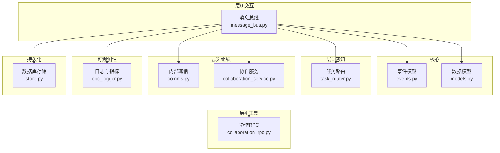
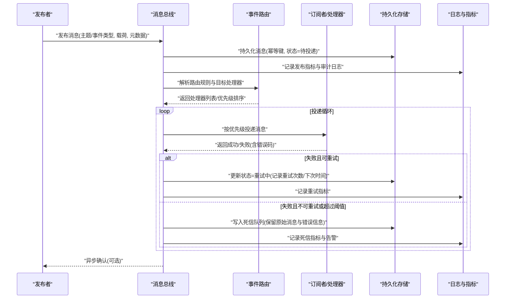
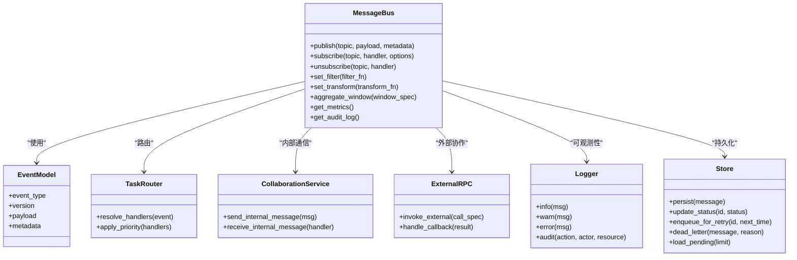
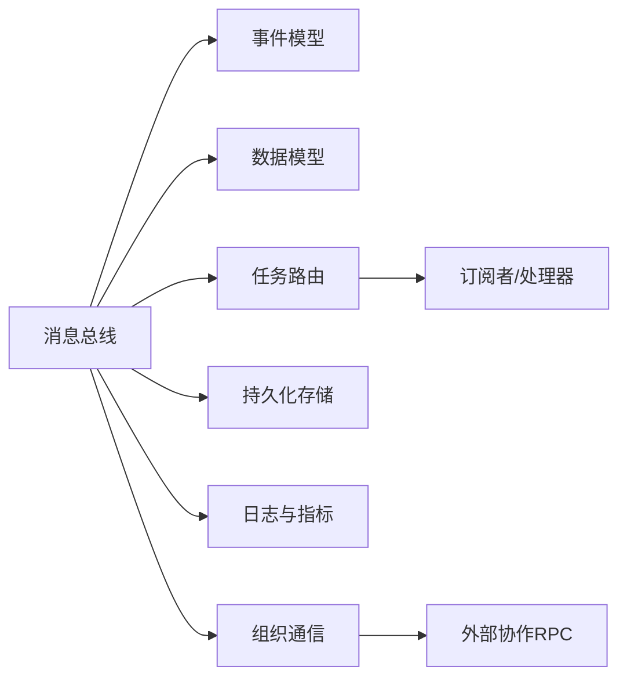

# 消息总线接口

<cite>
**本文引用的文件**   
- [layer0_interaction/message_bus.py](file://opc/layer0_interaction/message_bus.py)
- [core/events.py](file://opc/core/events.py)
- [core/models.py](file://opc/core/models.py)
- [layer1_perception/task_router.py](file://opc/layer1_perception/task_router.py)
- [layer2_organization/comms.py](file://opc/layer2_organization/comms.py)
- [layer2_organization/collaboration_service.py](file://opc/layer2_organization/collaboration_service.py)
- [layer4_tools/collaboration_rpc.py](file://opc/layer4_tools/collaboration_rpc.py)
- [layer6_observability/opc_logger.py](file://opc/layer6_observability/opc_logger.py)
- [database/store.py](file://opc/database/store.py)
</cite>

## 目录
1. [简介](#简介)
2. [项目结构](#项目结构)
3. [核心组件](#核心组件)
4. [架构总览](#架构总览)
5. [详细组件分析](#详细组件分析)
6. [依赖关系分析](#依赖关系分析)
7. [性能考虑](#性能考虑)
8. [故障诊断指南](#故障诊断指南)
9. [结论](#结论)
10. [附录](#附录)

## 简介
本文件为 OpenOPC 的消息总线接口提供系统化技术文档，聚焦于发布订阅机制、事件路由与消息持久化等核心能力。文档面向开发者，帮助其通过消息总线实现模块间解耦通信，并覆盖以下主题：
- 消息格式规范、序列化协议与传输编码方式
- 消息优先级、重试机制与死信队列处理
- 消息过滤、转换与聚合方法
- 消息流监控、性能指标收集与故障诊断工具
- 安全性、访问控制与审计日志
- 配置优化与扩展开发指南

## 项目结构
OpenOPC 将消息总线相关能力集中在层0交互层，并通过核心事件模型与上层组织协作、感知路由等模块协同工作。关键路径如下：
- 消息总线入口：layer0_interaction/message_bus.py
- 事件与数据模型：core/events.py、core/models.py
- 任务路由与分发：layer1_perception/task_router.py
- 组织内通信与协作：layer2_organization/comms.py、collaboration_service.py
- 外部协作 RPC 适配：layer4_tools/collaboration_rpc.py
- 可观测性与日志：layer6_observability/opc_logger.py
- 持久化存储：database/store.py

图示来源
- [layer0_interaction/message_bus.py](file://opc/layer0_interaction/message_bus.py)
- [core/events.py](file://opc/core/events.py)
- [core/models.py](file://opc/core/models.py)
- [layer1_perception/task_router.py](file://opc/layer1_perception/task_router.py)
- [layer2_organization/comms.py](file://opc/layer2_organization/comms.py)
- [layer2_organization/collaboration_service.py](file://opc/layer2_organization/collaboration_service.py)
- [layer4_tools/collaboration_rpc.py](file://opc/layer4_tools/collaboration_rpc.py)
- [layer6_observability/opc_logger.py](file://opc/layer6_observability/opc_logger.py)
- [database/store.py](file://opc/database/store.py)

章节来源
- [layer0_interaction/message_bus.py](file://opc/layer0_interaction/message_bus.py)
- [core/events.py](file://opc/core/events.py)
- [core/models.py](file://opc/core/models.py)
- [layer1_perception/task_router.py](file://opc/layer1_perception/task_router.py)
- [layer2_organization/comms.py](file://opc/layer2_organization/comms.py)
- [layer2_organization/collaboration_service.py](file://opc/layer2_organization/collaboration_service.py)
- [layer4_tools/collaboration_rpc.py](file://opc/layer4_tools/collaboration_rpc.py)
- [layer6_observability/opc_logger.py](file://opc/layer6_observability/opc_logger.py)
- [database/store.py](file://opc/database/store.py)

## 核心组件
- 消息总线（Message Bus）
  - 职责：提供统一的发布/订阅接口，负责消息的入队、路由、投递、重试与持久化；暴露过滤器、转换器与聚合器接口以支持灵活的消息处理链。
  - 关键能力：
    - 发布/订阅：按主题或事件类型进行广播与定向投递
    - 事件路由：基于事件元数据与规则引擎选择目标处理器
    - 持久化：落盘保证至少一次语义，支持断点恢复
    - 优先级与顺序：支持优先级队列与可选的顺序保证
    - 重试与死信：指数退避重试，失败后进入死信队列
    - 过滤/转换/聚合：在投递前对消息进行筛选、变换与合并
    - 可观测性：埋点日志、指标上报与追踪ID透传
    - 安全与审计：鉴权、访问控制与审计日志记录

- 事件与数据模型
  - 事件模型：定义事件类型、版本、载荷结构与元数据字段
  - 数据模型：统一消息体、上下文、结果与错误码的结构定义

- 任务路由与组织通信
  - 任务路由：根据业务上下文将消息路由到合适的执行单元
  - 组织通信：跨角色/会话的内部消息通道与协作协议

- 外部协作 RPC
  - 将内部消息转换为外部系统可调用的 RPC 调用，并提供反向适配

- 可观测性与持久化
  - 日志与指标：结构化日志、指标采集与链路追踪
  - 持久化：消息落库、状态机与补偿事务

章节来源
- [layer0_interaction/message_bus.py](file://opc/layer0_interaction/message_bus.py)
- [core/events.py](file://opc/core/events.py)
- [core/models.py](file://opc/core/models.py)
- [layer1_perception/task_router.py](file://opc/layer1_perception/task_router.py)
- [layer2_organization/comms.py](file://opc/layer2_organization/comms.py)
- [layer2_organization/collaboration_service.py](file://opc/layer2_organization/collaboration_service.py)
- [layer4_tools/collaboration_rpc.py](file://opc/layer4_tools/collaboration_rpc.py)
- [layer6_observability/opc_logger.py](file://opc/layer6_observability/opc_logger.py)
- [database/store.py](file://opc/database/store.py)

## 架构总览
消息总线作为系统内各模块的“中枢神经”，向上承接业务事件，向下驱动任务执行与外部协作，同时保障可靠性与可观测性。

图示来源
- [layer0_interaction/message_bus.py](file://opc/layer0_interaction/message_bus.py)
- [core/events.py](file://opc/core/events.py)
- [core/models.py](file://opc/core/models.py)
- [layer1_perception/task_router.py](file://opc/layer1_perception/task_router.py)
- [layer2_organization/comms.py](file://opc/layer2_organization/comms.py)
- [layer2_organization/collaboration_service.py](file://opc/layer2_organization/collaboration_service.py)
- [layer4_tools/collaboration_rpc.py](file://opc/layer4_tools/collaboration_rpc.py)
- [layer6_observability/opc_logger.py](file://opc/layer6_observability/opc_logger.py)
- [database/store.py](file://opc/database/store.py)

## 详细组件分析

### 消息总线（Message Bus）
- 设计要点
  - 发布/订阅：支持多订阅者与广播模式；同一消息可被多个处理器消费
  - 路由策略：基于事件类型、标签、租户/组织维度进行匹配；支持通配符与正则表达式
  - 优先级：整数或枚举级别；高优先级优先出队
  - 顺序保证：可选分区键保证同键消息顺序
  - 重试与死信：指数退避+抖动；最大重试次数后转入死信队列
  - 幂等：基于唯一键去重，避免重复处理
  - 过滤/转换/聚合：在投递前执行管道式处理链
  - 可观测性：埋点指标、审计日志、链路追踪ID透传
  - 安全：鉴权、授权、敏感字段脱敏

图示来源
- [layer0_interaction/message_bus.py](file://opc/layer0_interaction/message_bus.py)
- [core/events.py](file://opc/core/events.py)
- [core/models.py](file://opc/core/models.py)
- [layer1_perception/task_router.py](file://opc/layer1_perception/task_router.py)
- [layer2_organization/comms.py](file://opc/layer2_organization/comms.py)
- [layer2_organization/collaboration_service.py](file://opc/layer2_organization/collaboration_service.py)
- [layer4_tools/collaboration_rpc.py](file://opc/layer4_tools/collaboration_rpc.py)
- [layer6_observability/opc_logger.py](file://opc/layer6_observability/opc_logger.py)
- [database/store.py](file://opc/database/store.py)

章节来源
- [layer0_interaction/message_bus.py](file://opc/layer0_interaction/message_bus.py)
- [core/events.py](file://opc/core/events.py)
- [core/models.py](file://opc/core/models.py)
- [layer1_perception/task_router.py](file://opc/layer1_perception/task_router.py)
- [layer2_organization/comms.py](file://opc/layer2_organization/comms.py)
- [layer2_organization/collaboration_service.py](file://opc/layer2_organization/collaboration_service.py)
- [layer4_tools/collaboration_rpc.py](file://opc/layer4_tools/collaboration_rpc.py)
- [layer6_observability/opc_logger.py](file://opc/layer6_observability/opc_logger.py)
- [database/store.py](file://opc/database/store.py)

### 事件与数据模型
- 事件模型
  - 字段：事件类型、版本号、载荷、元数据（包含租户、会话、追踪ID、优先级、幂等键等）
  - 约束：必填字段校验、版本兼容策略、载荷大小限制
- 数据模型
  - 消息体：统一封装发送/接收数据结构
  - 上下文：携带运行时环境信息（如用户身份、权限、资源标识）
  - 结果与错误：标准化返回码与错误信息

章节来源
- [core/events.py](file://opc/core/events.py)
- [core/models.py](file://opc/core/models.py)

### 任务路由与组织通信
- 任务路由
  - 依据事件元数据与业务规则选择处理器集合
  - 支持动态注册与热更新处理器
- 组织通信
  - 提供内部消息通道，用于跨角色/会话的协作
  - 与消息总线集成，复用路由、重试与持久化能力

章节来源
- [layer1_perception/task_router.py](file://opc/layer1_perception/task_router.py)
- [layer2_organization/comms.py](file://opc/layer2_organization/comms.py)
- [layer2_organization/collaboration_service.py](file://opc/layer2_organization/collaboration_service.py)

### 外部协作 RPC
- 将内部消息映射为外部系统的 RPC 调用
- 处理回调与结果回写，确保双向一致性
- 与消息总线协作，对外部失败进行重试与死信管理

章节来源
- [layer4_tools/collaboration_rpc.py](file://opc/layer4_tools/collaboration_rpc.py)

### 可观测性与持久化
- 可观测性
  - 结构化日志：包含请求ID、主题、处理器、耗时、状态码
  - 指标：发布量、投递成功率、重试次数、死信数、延迟分位
  - 审计：记录关键操作（发布、订阅变更、权限校验）
- 持久化
  - 消息落库：状态机（待投递、投递中、成功、重试、死信）
  - 补偿：定时扫描重试与死信，支持人工干预

章节来源
- [layer6_observability/opc_logger.py](file://opc/layer6_observability/opc_logger.py)
- [database/store.py](file://opc/database/store.py)

## 依赖关系分析
- 耦合与内聚
  - 消息总线与事件/数据模型低耦合，通过接口契约交互
  - 路由与处理器解耦，支持插件化扩展
  - 持久化与可观测性作为横切关注点，通过中间件注入
- 外部依赖
  - 数据库：消息持久化与状态管理
  - 日志/指标：集中式采集与可视化
  - 外部系统：通过 RPC 适配器进行互操作

图示来源
- [layer0_interaction/message_bus.py](file://opc/layer0_interaction/message_bus.py)
- [core/events.py](file://opc/core/events.py)
- [core/models.py](file://opc/core/models.py)
- [layer1_perception/task_router.py](file://opc/layer1_perception/task_router.py)
- [layer2_organization/comms.py](file://opc/layer2_organization/comms.py)
- [layer2_organization/collaboration_service.py](file://opc/layer2_organization/collaboration_service.py)
- [layer4_tools/collaboration_rpc.py](file://opc/layer4_tools/collaboration_rpc.py)
- [layer6_observability/opc_logger.py](file://opc/layer6_observability/opc_logger.py)
- [database/store.py](file://opc/database/store.py)

章节来源
- [layer0_interaction/message_bus.py](file://opc/layer0_interaction/message_bus.py)
- [core/events.py](file://opc/core/events.py)
- [core/models.py](file://opc/core/models.py)
- [layer1_perception/task_router.py](file://opc/layer1_perception/task_router.py)
- [layer2_organization/comms.py](file://opc/layer2_organization/comms.py)
- [layer2_organization/collaboration_service.py](file://opc/layer2_organization/collaboration_service.py)
- [layer4_tools/collaboration_rpc.py](file://opc/layer4_tools/collaboration_rpc.py)
- [layer6_observability/opc_logger.py](file://opc/layer6_observability/opc_logger.py)
- [database/store.py](file://opc/database/store.py)

## 性能考虑
- 吞吐与延迟
  - 批量发布与投递，减少锁竞争与IO开销
  - 分区并行处理，按主题或键哈希分流
- 内存与GC
  - 大载荷分片与流式处理
  - 对象池与零拷贝路径（在可用时）
- 存储与索引
  - 消息表按时间/主题分区，合理索引幂等键与状态
  - 定期归档与压缩历史消息
- 重试与背压
  - 自适应退避与限流，防止雪崩
  - 消费者侧背压，避免积压放大
- 可观测性开销
  - 采样日志与指标，降低额外成本

[本节为通用指导，不直接分析具体文件]

## 故障诊断指南
- 常见问题定位
  - 发布失败：检查鉴权、主题存在性、载荷校验与持久化落库
  - 投递失败：查看处理器异常堆栈、超时与重试计数
  - 死信堆积：分析失败原因（业务逻辑错误、下游不可用），必要时人工修复并重放
- 诊断工具
  - 日志检索：按追踪ID、主题、处理器名过滤
  - 指标看板：发布量、成功率、重试率、死信数、P95/P99延迟
  - 消息回放：从持久化源加载指定范围消息进行重放测试
- 恢复流程
  - 快速止血：降级非关键处理器、提升优先级队列容量
  - 根因修复：修复代码缺陷或配置错误，清理死信并重新投递
  - 验证回归：端到端冒烟测试与指标对比

章节来源
- [layer6_observability/opc_logger.py](file://opc/layer6_observability/opc_logger.py)
- [database/store.py](file://opc/database/store.py)

## 结论
OpenOPC 的消息总线提供了高可靠、可扩展的模块间通信基础设施。通过统一的事件模型、灵活的路由策略、完善的持久化与可观测性，开发者可以构建解耦、健壮的系统。建议在生产环境中结合指标与日志持续优化，建立完善的监控与告警体系，并制定标准化的消息治理规范。

[本节为总结性内容，不直接分析具体文件]

## 附录

### 消息格式规范
- 字段说明
  - 事件类型：字符串，区分不同业务事件
  - 版本：整数或语义化版本，用于兼容演进
  - 载荷：JSON 或二进制（需声明编码），受大小限制
  - 元数据：包含租户、会话、追踪ID、优先级、幂等键、时间戳等
- 序列化协议
  - 默认 JSON；可选 Protobuf/MessagePack（需协商）
- 传输编码
  - 文本型：UTF-8
  - 二进制：Base64 或独立附件存储（URL引用）

章节来源
- [core/events.py](file://opc/core/events.py)
- [core/models.py](file://opc/core/models.py)

### 优先级、重试与死信
- 优先级
  - 数值越大优先级越高；可按主题设置默认优先级
- 重试机制
  - 指数退避+随机抖动；最大重试次数与退避上限可配置
- 死信队列
  - 超过阈值的失败消息进入死信；保留原始消息与错误信息，支持重放

章节来源
- [layer0_interaction/message_bus.py](file://opc/layer0_interaction/message_bus.py)
- [database/store.py](file://opc/database/store.py)

### 过滤、转换与聚合
- 过滤
  - 基于元数据字段、正则匹配、白名单/黑名单
- 转换
  - 字段映射、类型转换、敏感信息脱敏
- 聚合
  - 窗口聚合（时间/数量）、去重、合并相似事件

章节来源
- [layer0_interaction/message_bus.py](file://opc/layer0_interaction/message_bus.py)

### 监控、指标与审计
- 监控
  - 实时看板：吞吐量、延迟、错误率、死信数
- 指标
  - 计数器、直方图、仪表盘；支持导出至监控系统
- 审计
  - 记录发布/订阅变更、权限校验、关键操作轨迹

章节来源
- [layer6_observability/opc_logger.py](file://opc/layer6_observability/opc_logger.py)

### 安全性、访问控制与合规
- 鉴权与授权
  - 基于令牌/证书的身份认证；细粒度主题级访问控制
- 数据安全
  - 传输加密（TLS）、敏感字段脱敏、最小权限原则
- 合规
  - 审计日志留存周期、数据保留策略与删除流程

章节来源
- [layer0_interaction/message_bus.py](file://opc/layer0_interaction/message_bus.py)
- [layer6_observability/opc_logger.py](file://opc/layer6_observability/opc_logger.py)

### 配置优化与扩展开发
- 配置项
  - 连接参数、线程池大小、批大小、重试策略、持久化策略、指标采样率
- 扩展点
  - 自定义处理器、过滤器、转换器、聚合器、路由策略
- 最佳实践
  - 幂等设计、错误分类、优雅降级、灰度发布与回滚

章节来源
- [layer0_interaction/message_bus.py](file://opc/layer0_interaction/message_bus.py)
- [layer1_perception/task_router.py](file://opc/layer1_perception/task_router.py)
- [layer2_organization/comms.py](file://opc/layer2_organization/comms.py)
- [layer2_organization/collaboration_service.py](file://opc/layer2_organization/collaboration_service.py)
- [layer4_tools/collaboration_rpc.py](file://opc/layer4_tools/collaboration_rpc.py)
- [layer6_observability/opc_logger.py](file://opc/layer6_observability/opc_logger.py)
- [database/store.py](file://opc/database/store.py)