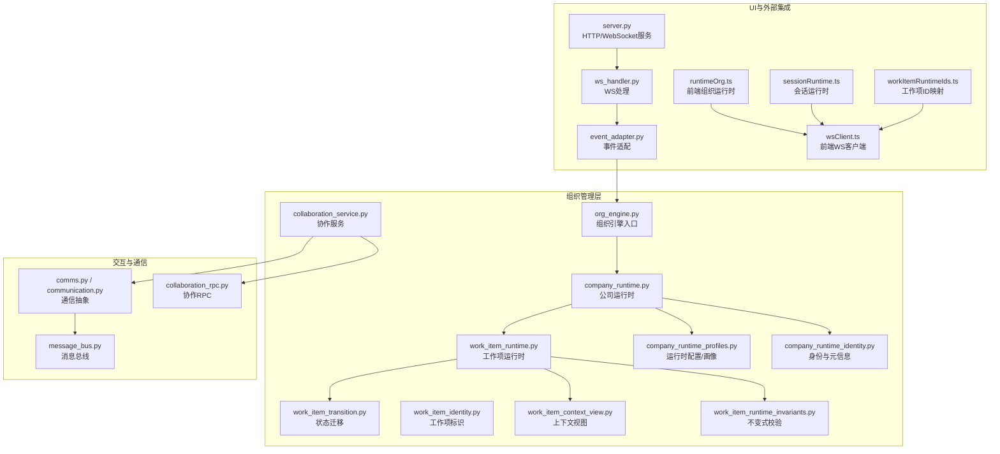
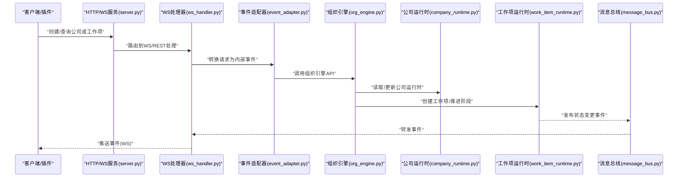
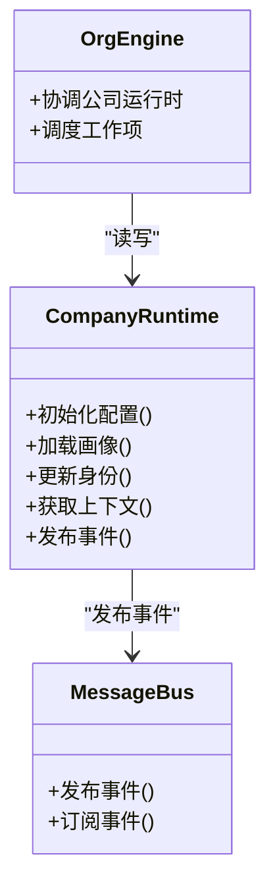
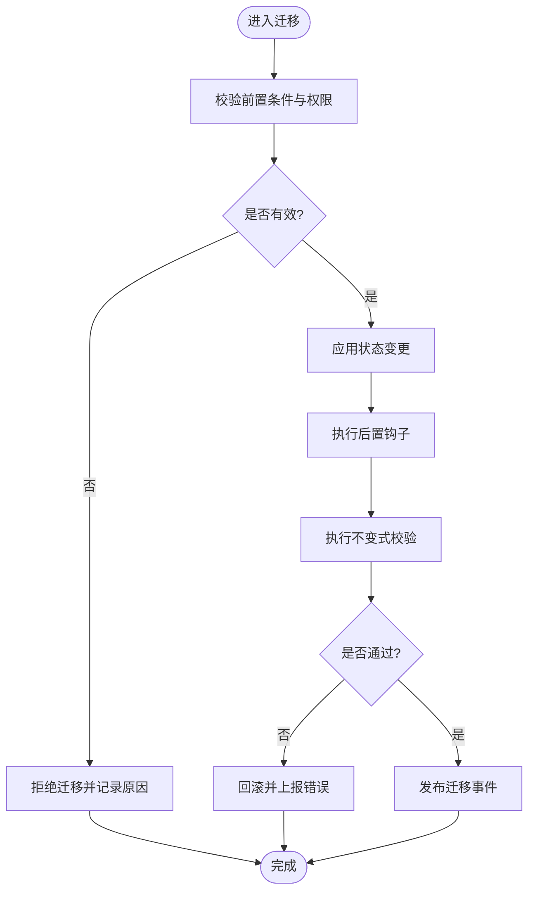
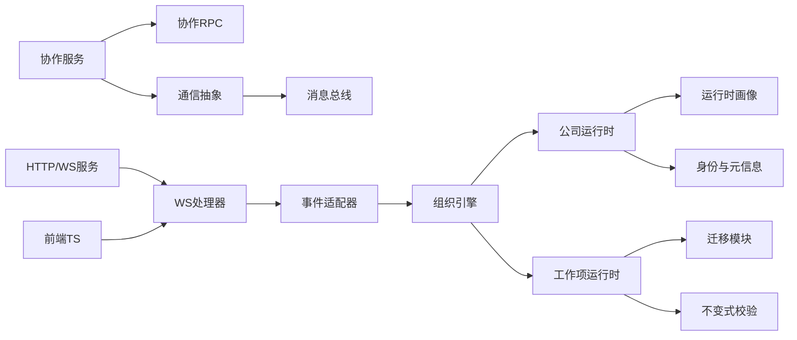

# 组织管理服务接口

<cite>
**本文引用的文件**   
- [org_engine.py](file://opc/layer2_organization/org_engine.py)
- [company_runtime.py](file://opc/layer2_organization/company_runtime.py)
- [work_item_runtime.py](file://opc/layer2_organization/work_item_runtime.py)
- [work_item_transition.py](file://opc/layer2_organization/work_item_transition.py)
- [work_item_identity.py](file://opc/layer2_organization/work_item_identity.py)
- [work_item_context_view.py](file://opc/layer2_organization/work_item_context_view.py)
- [work_item_runtime_invariants.py](file://opc/layer2_organization/work_item_runtime_invariants.py)
- [company_runtime_profiles.py](file://opc/layer2_organization/company_runtime_profiles.py)
- [company_runtime_identity.py](file://opc/layer2_organization/company_runtime_identity.py)
- [collaboration_service.py](file://opc/layer2_organization/collaboration_service.py)
- [collaboration_rpc.py](file://opc/layer4_tools/collaboration_rpc.py)
- [comms.py](file://opc/layer2_organization/comms.py)
- [communication.py](file://opc/layer2_organization/communication.py)
- [message_bus.py](file://opc/layer1_interaction/message_bus.py)
- [event_adapter.py](file://opc/plugins/office_ui/event_adapter.py)
- [ws_handler.py](file://opc/plugins/office_ui/ws_handler.py)
- [server.py](file://opc/plugins/office_ui/server.py)
- [runtime_org.ts](file://opc/plugins/office_ui/frontend_src/lib/runtimeOrg.ts)
- [wsClient.ts](file://opc/plugins/office_ui/frontend_src/lib/wsClient.ts)
- [sessionRuntime.ts](file://opc/plugins/office_ui/frontend_src/lib/sessionRuntime.ts)
- [workItemRuntimeIds.ts](file://opc/plugins/office_ui/frontend_src/lib/workItemRuntimeIds.ts)
- [roleWorkItems.test.ts](file://opc/plugins/office_ui/frontend_src/lib/roleWorkItems.test.ts)
- [test_company_reorg.py](file://tests/test_company_reorg.py)
- [test_work_item_transition.py](file://tests/test_work_item_transition.py)
- [test_work_item_runtime_invariants.py](file://tests/test_work_item_runtime_invariants.py)
</cite>

## 目录
1. [简介](#简介)
2. [项目结构](#项目结构)
3. [核心组件](#核心组件)
4. [架构总览](#架构总览)
5. [详细组件分析](#详细组件分析)
6. [依赖关系分析](#依赖关系分析)
7. [性能与可观测性](#性能与可观测性)
8. [故障排查指南](#故障排查指南)
9. [结论](#结论)
10. [附录：SDK与客户端使用示例](#附录sdk与客户端使用示例)

## 简介
本文件面向OpenOPC“组织管理服务”的接口与实现，聚焦公司运行时管理、工作项生命周期控制、角色与权限管理等核心能力。文档覆盖服务间通信协议、数据交换格式与调用约定；解释异步调用机制、事件驱动架构与消息传递模式；提供发现、负载均衡与容错策略建议；并给出监控、日志与性能追踪方法以及SDK封装和客户端库使用示例，帮助开发者正确扩展组织管理能力。

## 项目结构
组织管理相关代码主要位于 layer2_organization 层，配合 layer1_interaction（消息总线）、layer4_tools（协作RPC）、plugins/office_ui（前端与服务端桥接）共同构成端到端能力。

图表来源
- [org_engine.py](file://opc/layer2_organization/org_engine.py)
- [company_runtime.py](file://opc/layer2_organization/company_runtime.py)
- [work_item_runtime.py](file://opc/layer2_organization/work_item_runtime.py)
- [work_item_transition.py](file://opc/layer2_organization/work_item_transition.py)
- [work_item_identity.py](file://opc/layer2_organization/work_item_identity.py)
- [work_item_context_view.py](file://opc/layer2_organization/work_item_context_view.py)
- [work_item_runtime_invariants.py](file://opc/layer2_organization/work_item_runtime_invariants.py)
- [company_runtime_profiles.py](file://opc/layer2_organization/company_runtime_profiles.py)
- [company_runtime_identity.py](file://opc/layer2_organization/company_runtime_identity.py)
- [collaboration_service.py](file://opc/layer2_organization/collaboration_service.py)
- [collaboration_rpc.py](file://opc/layer4_tools/collaboration_rpc.py)
- [comms.py](file://opc/layer2_organization/comms.py)
- [communication.py](file://opc/layer2_organization/communication.py)
- [message_bus.py](file://opc/layer1_interaction/message_bus.py)
- [server.py](file://opc/plugins/office_ui/server.py)
- [ws_handler.py](file://opc/plugins/office_ui/ws_handler.py)
- [event_adapter.py](file://opc/plugins/office_ui/event_adapter.py)
- [runtimeOrg.ts](file://opc/plugins/office_ui/frontend_src/lib/runtimeOrg.ts)
- [wsClient.ts](file://opc/plugins/office_ui/frontend_src/lib/wsClient.ts)
- [sessionRuntime.ts](file://opc/plugins/office_ui/frontend_src/lib/sessionRuntime.ts)
- [workItemRuntimeIds.ts](file://opc/plugins/office_ui/frontend_src/lib/workItemRuntimeIds.ts)

章节来源
- [org_engine.py](file://opc/layer2_organization/org_engine.py)
- [company_runtime.py](file://opc/layer2_organization/company_runtime.py)
- [work_item_runtime.py](file://opc/layer2_organization/work_item_runtime.py)
- [work_item_transition.py](file://opc/layer2_organization/work_item_transition.py)
- [work_item_identity.py](file://opc/layer2_organization/work_item_identity.py)
- [work_item_context_view.py](file://opc/layer2_organization/work_item_context_view.py)
- [work_item_runtime_invariants.py](file://opc/layer2_organization/work_item_runtime_invariants.py)
- [company_runtime_profiles.py](file://opc/layer2_organization/company_runtime_profiles.py)
- [company_runtime_identity.py](file://opc/layer2_organization/company_runtime_identity.py)
- [collaboration_service.py](file://opc/layer2_organization/collaboration_service.py)
- [collaboration_rpc.py](file://opc/layer4_tools/collaboration_rpc.py)
- [comms.py](file://opc/layer2_organization/comms.py)
- [communication.py](file://opc/layer2_organization/communication.py)
- [message_bus.py](file://opc/layer1_interaction/message_bus.py)
- [server.py](file://opc/plugins/office_ui/server.py)
- [ws_handler.py](file://opc/plugins/office_ui/ws_handler.py)
- [event_adapter.py](file://opc/plugins/office_ui/event_adapter.py)
- [runtimeOrg.ts](file://opc/plugins/office_ui/frontend_src/lib/runtimeOrg.ts)
- [wsClient.ts](file://opc/plugins/office_ui/frontend_src/lib/wsClient.ts)
- [sessionRuntime.ts](file://opc/plugins/office_ui/frontend_src/lib/sessionRuntime.ts)
- [workItemRuntimeIds.ts](file://opc/plugins/office_ui/frontend_src/lib/workItemRuntimeIds.ts)

## 核心组件
- 组织引擎（org_engine）：对外暴露组织管理的统一入口，协调公司运行时与工作项生命周期。
- 公司运行时（company_runtime）：维护公司级运行态、配置画像、身份与元信息，承载跨工作项的全局上下文。
- 工作项运行时（work_item_runtime）：负责单个工作项的执行上下文、进度、阶段推进与资源隔离。
- 工作项迁移（work_item_transition）：定义状态机与迁移钩子，确保状态变更的可审计性与幂等性。
- 工作项标识与上下文视图（work_item_identity, work_item_context_view）：稳定标识与只读视图，支撑查询与展示。
- 不变式校验（work_item_runtime_invariants）：在关键路径上执行一致性检查，保障系统健壮性。
- 协作服务与RPC（collaboration_service, collaboration_rpc）：跨进程/跨服务的协作与远程调用封装。
- 通信抽象与消息总线（comms, communication, message_bus）：统一消息通道与事件分发。
- UI集成（server, ws_handler, event_adapter, 前端TS）：将后端组织事件以WebSocket推送至前端，并提供REST/WS API。

章节来源
- [org_engine.py](file://opc/layer2_organization/org_engine.py)
- [company_runtime.py](file://opc/layer2_organization/company_runtime.py)
- [work_item_runtime.py](file://opc/layer2_organization/work_item_runtime.py)
- [work_item_transition.py](file://opc/layer2_organization/work_item_transition.py)
- [work_item_identity.py](file://opc/layer2_organization/work_item_identity.py)
- [work_item_context_view.py](file://opc/layer2_organization/work_item_context_view.py)
- [work_item_runtime_invariants.py](file://opc/layer2_organization/work_item_runtime_invariants.py)
- [collaboration_service.py](file://opc/layer2_organization/collaboration_service.py)
- [collaboration_rpc.py](file://opc/layer4_tools/collaboration_rpc.py)
- [comms.py](file://opc/layer2_organization/comms.py)
- [communication.py](file://opc/layer2_organization/communication.py)
- [message_bus.py](file://opc/layer1_interaction/message_bus.py)
- [server.py](file://opc/plugins/office_ui/server.py)
- [ws_handler.py](file://opc/plugins/office_ui/ws_handler.py)
- [event_adapter.py](file://opc/plugins/office_ui/event_adapter.py)

## 架构总览
组织管理服务采用分层与事件驱动相结合的设计：上层通过组织引擎与公司运行时暴露API；中层由工作项运行时与迁移模块驱动任务流转；底层通过消息总线与通信抽象进行事件广播与跨服务调用；前端通过WebSocket订阅组织事件，实时反映状态变化。

图表来源
- [server.py](file://opc/plugins/office_ui/server.py)
- [ws_handler.py](file://opc/plugins/office_ui/ws_handler.py)
- [event_adapter.py](file://opc/plugins/office_ui/event_adapter.py)
- [org_engine.py](file://opc/layer2_organization/org_engine.py)
- [company_runtime.py](file://opc/layer2_organization/company_runtime.py)
- [work_item_runtime.py](file://opc/layer2_organization/work_item_runtime.py)
- [message_bus.py](file://opc/layer1_interaction/message_bus.py)

## 详细组件分析

### 公司运行时管理（Company Runtime）
- 职责：维护公司级配置、画像、身份与全局上下文；提供创建、更新、查询与快照能力；作为工作项运行的基础环境。
- 关键能力：
  - 初始化与加载运行时配置/画像
  - 身份与元信息管理
  - 与组织引擎对接，响应工作项生命周期事件
- 典型流程：
  - 启动时加载配置与画像
  - 接收组织引擎指令，更新公司状态
  - 向消息总线广播公司级事件

图表来源
- [company_runtime.py](file://opc/layer2_organization/company_runtime.py)
- [company_runtime_profiles.py](file://opc/layer2_organization/company_runtime_profiles.py)
- [company_runtime_identity.py](file://opc/layer2_organization/company_runtime_identity.py)
- [org_engine.py](file://opc/layer2_organization/org_engine.py)
- [message_bus.py](file://opc/layer1_interaction/message_bus.py)

章节来源
- [company_runtime.py](file://opc/layer2_organization/company_runtime.py)
- [company_runtime_profiles.py](file://opc/layer2_organization/company_runtime_profiles.py)
- [company_runtime_identity.py](file://opc/layer2_organization/company_runtime_identity.py)
- [org_engine.py](file://opc/layer2_organization/org_engine.py)

### 工作项生命周期控制（Work Item Lifecycle）
- 职责：定义工作项的状态机、迁移规则与钩子；保证迁移的原子性与可审计性；提供上下文视图与不变式校验。
- 关键能力：
  - 创建工作项并分配初始状态
  - 触发状态迁移（含前置条件与后置钩子）
  - 生成只读上下文视图供查询与展示
  - 执行不变式校验，防止非法状态
- 迁移流程图：

图表来源
- [work_item_transition.py](file://opc/layer2_organization/work_item_transition.py)
- [work_item_runtime.py](file://opc/layer2_organization/work_item_runtime.py)
- [work_item_context_view.py](file://opc/layer2_organization/work_item_context_view.py)
- [work_item_runtime_invariants.py](file://opc/layer2_organization/work_item_runtime_invariants.py)

章节来源
- [work_item_transition.py](file://opc/layer2_organization/work_item_transition.py)
- [work_item_runtime.py](file://opc/layer2_organization/work_item_runtime.py)
- [work_item_context_view.py](file://opc/layer2_organization/work_item_context_view.py)
- [work_item_runtime_invariants.py](file://opc/layer2_organization/work_item_runtime_invariants.py)

### 角色与权限管理（Role & Permissions）
- 职责：在公司运行时中维护角色定义与权限策略，结合工作项上下文进行访问控制。
- 关键点：
  - 角色定义与继承关系
  - 基于上下文（公司/工作项/会话）的权限判定
  - 与协作服务联动，限制跨域操作
- 注意：具体策略细节请参考公司运行时与协作服务中的权限相关实现。

章节来源
- [company_runtime.py](file://opc/layer2_organization/company_runtime.py)
- [collaboration_service.py](file://opc/layer2_organization/collaboration_service.py)

### 协作服务与RPC（Collaboration Service & RPC）
- 职责：封装跨服务/跨进程的协作调用，提供统一的RPC接口与重试、超时、熔断等通用能力。
- 要点：
  - 服务发现与地址解析
  - 请求序列化与反序列化
  - 错误码与异常映射
  - 限流与退避策略

章节来源
- [collaboration_service.py](file://opc/layer2_organization/collaboration_service.py)
- [collaboration_rpc.py](file://opc/layer4_tools/collaboration_rpc.py)

### 通信抽象与消息总线（Comms & Message Bus）
- 职责：统一消息通道，支持事件发布/订阅、点对点消息与广播；为UI与后端提供一致的事件模型。
- 要点：
  - 事件类型与载荷规范
  - 订阅过滤与去重
  - 持久化与回放（可选）
  - 与WS处理器协同，将事件推送到前端

章节来源
- [comms.py](file://opc/layer2_organization/comms.py)
- [communication.py](file://opc/layer2_organization/communication.py)
- [message_bus.py](file://opc/layer1_interaction/message_bus.py)
- [ws_handler.py](file://opc/plugins/office_ui/ws_handler.py)
- [event_adapter.py](file://opc/plugins/office_ui/event_adapter.py)

### 前端集成与事件流（Frontend Integration）
- 职责：通过WebSocket连接后端，订阅组织事件，渲染公司/工作项状态，并提供用户交互。
- 要点：
  - 连接建立与心跳
  - 事件订阅与本地状态同步
  - 工作项ID映射与会话绑定
  - 错误重连与降级

章节来源
- [server.py](file://opc/plugins/office_ui/server.py)
- [ws_handler.py](file://opc/plugins/office_ui/ws_handler.py)
- [event_adapter.py](file://opc/plugins/office_ui/event_adapter.py)
- [runtimeOrg.ts](file://opc/plugins/office_ui/frontend_src/lib/runtimeOrg.ts)
- [wsClient.ts](file://opc/plugins/office_ui/frontend_src/lib/wsClient.ts)
- [sessionRuntime.ts](file://opc/plugins/office_ui/frontend_src/lib/sessionRuntime.ts)
- [workItemRuntimeIds.ts](file://opc/plugins/office_ui/frontend_src/lib/workItemRuntimeIds.ts)

## 依赖关系分析
- 内聚与耦合：
  - 组织引擎对公司运行时与工作项运行时高内聚，降低外部耦合。
  - 协作服务与RPC解耦于具体传输协议，便于替换与扩展。
  - 消息总线与通信抽象屏蔽底层实现差异。
- 外部依赖：
  - WebSocket服务用于实时事件推送。
  - 前端TS库消费后端事件，形成闭环。

图表来源
- [org_engine.py](file://opc/layer2_organization/org_engine.py)
- [company_runtime.py](file://opc/layer2_organization/company_runtime.py)
- [work_item_runtime.py](file://opc/layer2_organization/work_item_runtime.py)
- [work_item_transition.py](file://opc/layer2_organization/work_item_transition.py)
- [work_item_runtime_invariants.py](file://opc/layer2_organization/work_item_runtime_invariants.py)
- [company_runtime_profiles.py](file://opc/layer2_organization/company_runtime_profiles.py)
- [company_runtime_identity.py](file://opc/layer2_organization/company_runtime_identity.py)
- [collaboration_service.py](file://opc/layer2_organization/collaboration_service.py)
- [collaboration_rpc.py](file://opc/layer4_tools/collaboration_rpc.py)
- [comms.py](file://opc/layer2_organization/comms.py)
- [communication.py](file://opc/layer2_organization/communication.py)
- [message_bus.py](file://opc/layer1_interaction/message_bus.py)
- [server.py](file://opc/plugins/office_ui/server.py)
- [ws_handler.py](file://opc/plugins/office_ui/ws_handler.py)
- [event_adapter.py](file://opc/plugins/office_ui/event_adapter.py)

章节来源
- [org_engine.py](file://opc/layer2_organization/org_engine.py)
- [company_runtime.py](file://opc/layer2_organization/company_runtime.py)
- [work_item_runtime.py](file://opc/layer2_organization/work_item_runtime.py)
- [work_item_transition.py](file://opc/layer2_organization/work_item_transition.py)
- [work_item_runtime_invariants.py](file://opc/layer2_organization/work_item_runtime_invariants.py)
- [collaboration_service.py](file://opc/layer2_organization/collaboration_service.py)
- [collaboration_rpc.py](file://opc/layer4_tools/collaboration_rpc.py)
- [comms.py](file://opc/layer2_organization/comms.py)
- [communication.py](file://opc/layer2_organization/communication.py)
- [message_bus.py](file://opc/layer1_interaction/message_bus.py)
- [server.py](file://opc/plugins/office_ui/server.py)
- [ws_handler.py](file://opc/plugins/office_ui/ws_handler.py)
- [event_adapter.py](file://opc/plugins/office_ui/event_adapter.py)

## 性能与可观测性
- 异步与并发：
  - 工作项迁移与事件发布应尽可能异步化，避免阻塞主线程。
  - 对长耗时操作引入队列与批处理，减少锁竞争。
- 缓存与视图：
  - 工作项上下文视图应为只读且可缓存，提高查询性能。
- 可观测性：
  - 在关键路径埋点（迁移前后、RPC调用、事件发布）。
  - 结构化日志包含公司/工作项/会话标识，便于追踪。
  - 指标采集包括延迟、吞吐、错误率与队列深度。

[本节为通用指导，不直接分析具体文件]

## 故障排查指南
- 常见问题定位：
  - 状态迁移失败：检查前置条件、权限与不变式校验结果。
  - 事件未到达前端：确认WS连接、事件订阅与过滤器配置。
  - 协作RPC超时：检查目标服务健康、网络与重试策略。
- 调试建议：
  - 开启详细日志与追踪ID，关联公司/工作项/会话维度。
  - 使用测试用例复现问题（如迁移与不变式相关测试）。

章节来源
- [test_work_item_transition.py](file://tests/test_work_item_transition.py)
- [test_work_item_runtime_invariants.py](file://tests/test_work_item_runtime_invariants.py)
- [test_company_reorg.py](file://tests/test_company_reorg.py)

## 结论
组织管理服务通过清晰的层次划分与事件驱动架构，提供了稳定的公司运行时与工作项生命周期管理能力。借助协作RPC与消息总线，系统具备良好的可扩展性与可观测性。遵循本文档的接口约定与实践建议，开发者可以安全地扩展组织管理功能，并确保在高可用场景下的稳定性。

[本节为总结，不直接分析具体文件]

## 附录：SDK与客户端使用示例
- 服务端SDK（Python）：
  - 通过组织引擎与公司运行时提供的API进行公司初始化、工作项创建与状态迁移。
  - 使用协作RPC进行跨服务调用，注意超时与重试配置。
  - 参考路径：
    - [org_engine.py](file://opc/layer2_organization/org_engine.py)
    - [company_runtime.py](file://opc/layer2_organization/company_runtime.py)
    - [work_item_runtime.py](file://opc/layer2_organization/work_item_runtime.py)
    - [work_item_transition.py](file://opc/layer2_organization/work_item_transition.py)
    - [collaboration_rpc.py](file://opc/layer4_tools/collaboration_rpc.py)
- 前端SDK（TypeScript）：
  - 使用wsClient建立WebSocket连接，订阅组织事件。
  - 通过runtimeOrg与sessionRuntime维护本地状态，结合workItemRuntimeIds进行工作项映射。
  - 参考路径：
    - [wsClient.ts](file://opc/plugins/office_ui/frontend_src/lib/wsClient.ts)
    - [runtimeOrg.ts](file://opc/plugins/office_ui/frontend_src/lib/runtimeOrg.ts)
    - [sessionRuntime.ts](file://opc/plugins/office_ui/frontend_src/lib/sessionRuntime.ts)
    - [workItemRuntimeIds.ts](file://opc/plugins/office_ui/frontend_src/lib/workItemRuntimeIds.ts)
    - [roleWorkItems.test.ts](file://opc/plugins/office_ui/frontend_src/lib/roleWorkItems.test.ts)

章节来源
- [org_engine.py](file://opc/layer2_organization/org_engine.py)
- [company_runtime.py](file://opc/layer2_organization/company_runtime.py)
- [work_item_runtime.py](file://opc/layer2_organization/work_item_runtime.py)
- [work_item_transition.py](file://opc/layer2_organization/work_item_transition.py)
- [collaboration_rpc.py](file://opc/layer4_tools/collaboration_rpc.py)
- [wsClient.ts](file://opc/plugins/office_ui/frontend_src/lib/wsClient.ts)
- [runtimeOrg.ts](file://opc/plugins/office_ui/frontend_src/lib/runtimeOrg.ts)
- [sessionRuntime.ts](file://opc/plugins/office_ui/frontend_src/lib/sessionRuntime.ts)
- [workItemRuntimeIds.ts](file://opc/plugins/office_ui/frontend_src/lib/workItemRuntimeIds.ts)
- [roleWorkItems.test.ts](file://opc/plugins/office_ui/frontend_src/lib/roleWorkItems.test.ts)