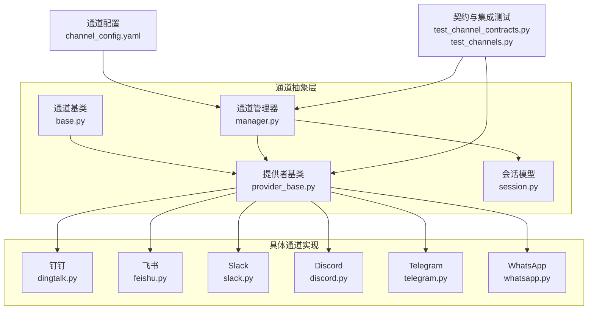
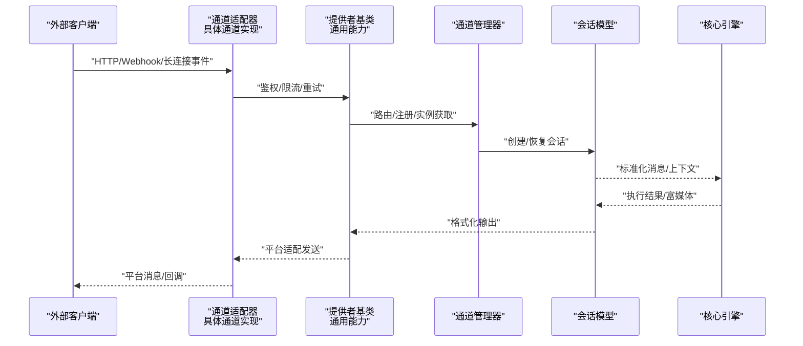
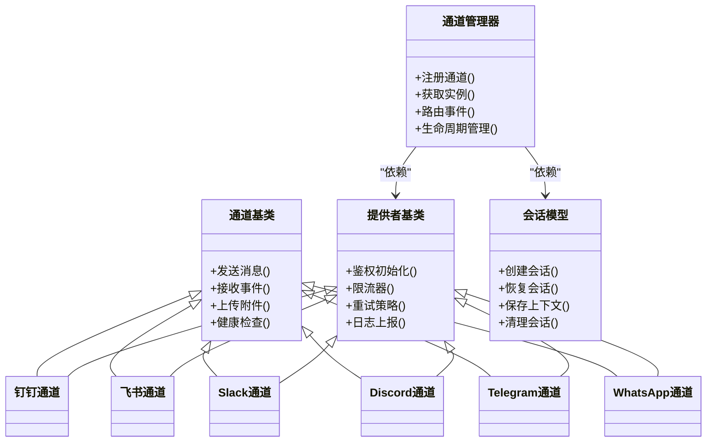

# 内置通道实现

<cite>
**本文引用的文件**   
- [opc/channels/base.py](file://opc/channels/base.py)
- [opc/channels/provider_base.py](file://opc/channels/provider_base.py)
- [opc/channels/manager.py](file://opc/channels/manager.py)
- [opc/channels/session.py](file://opc/channels/session.py)
- [opc/channels/dingtalk.py](file://opc/channels/dingtalk.py)
- [opc/channels/feishu.py](file://opc/channels/feishu.py)
- [opc/channels/slack.py](file://opc/channels/slack.py)
- [opc/channels/discord.py](file://opc/channels/discord.py)
- [opc/channels/telegram.py](file://opc/channels/telegram.py)
- [opc/channels/whatsapp.py](file://opc/channels/whatsapp.py)
- [config/channel_config.yaml](file://config/channel_config.yaml)
- [tests/test_channel_contracts.py](file://tests/test_channel_contracts.py)
- [tests/test_channels.py](file://tests/test_channels.py)
</cite>

## 目录
1. [简介](#简介)
2. [项目结构](#项目结构)
3. [核心组件](#核心组件)
4. [架构总览](#架构总览)
5. [详细组件分析](#详细组件分析)
6. [依赖关系分析](#依赖关系分析)
7. [性能考虑](#性能考虑)
8. [故障排查指南](#故障排查指南)
9. [结论](#结论)
10. [附录](#附录)

## 简介
本文件为 OpenOPC 的内置通道实现提供系统化技术文档，覆盖钉钉、飞书、Slack、Discord、Telegram 与 WhatsApp 六大通道的差异与特性。文档从认证方式、API 限制与速率控制、消息格式转换与富媒体支持、会话管理、用户身份映射与权限控制、配置参数与最佳实践、常见问题与调优、测试方法与模拟环境、迁移与升级注意事项等维度进行深度解析，帮助读者快速理解并高效使用各通道。

## 项目结构
OpenOPC 的通道子系统位于 opc/channels 目录下，采用“基础抽象 + 提供者基类 + 具体通道实现 + 管理器”的分层组织方式：
- 基础抽象与通用能力：base.py、provider_base.py
- 通道注册与管理：manager.py
- 会话模型与生命周期：session.py
- 具体通道实现：dingtalk.py、feishu.py、slack.py、discord.py、telegram.py、whatsapp.py
- 配置入口：config/channel_config.yaml
- 测试与契约校验：tests/test_channel_contracts.py、tests/test_channels.py

图表来源
- [opc/channels/base.py](file://opc/channels/base.py)
- [opc/channels/provider_base.py](file://opc/channels/provider_base.py)
- [opc/channels/manager.py](file://opc/channels/manager.py)
- [opc/channels/session.py](file://opc/channels/session.py)
- [config/channel_config.yaml](file://config/channel_config.yaml)
- [tests/test_channel_contracts.py](file://tests/test_channel_contracts.py)
- [tests/test_channels.py](file://tests/test_channels.py)

章节来源
- [opc/channels/base.py](file://opc/channels/base.py)
- [opc/channels/provider_base.py](file://opc/channels/provider_base.py)
- [opc/channels/manager.py](file://opc/channels/manager.py)
- [opc/channels/session.py](file://opc/channels/session.py)
- [config/channel_config.yaml](file://config/channel_config.yaml)
- [tests/test_channel_contracts.py](file://tests/test_channel_contracts.py)
- [tests/test_channels.py](file://tests/test_channels.py)

## 核心组件
- 通道基类（base.py）：定义统一的通道接口契约，包括发送消息、接收事件、上传附件、错误处理、健康检查等。所有具体通道需遵循该契约以保证上层调用一致性。
- 提供者基类（provider_base.py）：封装跨通道的通用逻辑，如鉴权初始化、重试策略、限流器、日志与指标上报、连接池管理等。具体通道继承后只需实现平台差异化细节。
- 通道管理器（manager.py）：负责通道的发现、注册、实例化、路由与生命周期管理；根据配置加载不同通道并提供统一入口。
- 会话模型（session.py）：抽象会话状态、上下文、持久化与恢复机制，屏蔽底层平台差异，向上层暴露一致的会话操作。

章节来源
- [opc/channels/base.py](file://opc/channels/base.py)
- [opc/channels/provider_base.py](file://opc/channels/provider_base.py)
- [opc/channels/manager.py](file://opc/channels/manager.py)
- [opc/channels/session.py](file://opc/channels/session.py)

## 架构总览
下图展示了从外部消息到内部处理的端到端流程，以及各通道在其中的角色与交互。

图表来源
- [opc/channels/base.py](file://opc/channels/base.py)
- [opc/channels/provider_base.py](file://opc/channels/provider_base.py)
- [opc/channels/manager.py](file://opc/channels/manager.py)
- [opc/channels/session.py](file://opc/channels/session.py)

## 详细组件分析

### 钉钉通道（DingTalk）
- 认证方式
  - 基于企业应用凭证（AppKey/AppSecret）或机器人令牌进行鉴权，支持签名校验与时间戳防重放。
  - 通过回调地址配置 Webhook 接收事件，或使用长轮询拉取消息。
- API 限制与速率控制
  - 遵循钉钉开放平台的频率限制（按 App 维度），需在提供者层实现令牌桶/漏桶限流与指数退避重试。
  - 对图片、文件等大附件上传需分片与断点续传，避免超时失败。
- 消息格式转换与富媒体
  - 将内部 Markdown/富文本转换为钉钉卡片消息或纯文本；支持图片、文件、链接卡片等富媒体。
  - 特殊功能适配：群机器人、@提醒、消息回执、已读状态同步。
- 会话管理与身份映射
  - 以钉钉 userId 作为唯一标识，结合 openConversationId 维护会话上下文；支持多群隔离与会话合并策略。
  - 权限控制：依据企业内部角色与群组权限决定可访问范围。
- 配置参数与最佳实践
  - 关键参数：AppKey、AppSecret、回调 URL、消息类型映射、附件存储路径、限流阈值。
  - 建议：开启消息去重、启用异步发送队列、合理设置重试次数与退避间隔。
- 常见问题与排障
  - 回调验证失败：检查签名算法与时钟同步。
  - 附件上传失败：确认网络连通性与存储空间配额。
- 测试与模拟
  - 使用本地 Mock 服务模拟钉钉回调；利用契约测试验证消息结构与字段映射。
- 迁移与升级
  - 注意钉钉 API 版本变更与废弃字段；保持配置项向后兼容。

章节来源
- [opc/channels/dingtalk.py](file://opc/channels/dingtalk.py)
- [opc/channels/provider_base.py](file://opc/channels/provider_base.py)
- [config/channel_config.yaml](file://config/channel_config.yaml)

### 飞书通道（FeiShu/Lark）
- 认证方式
  - 使用 App ID 与 App Secret 获取临时或长期访问令牌；支持事件订阅与回调地址。
- API 限制与速率控制
  - 遵循飞书开放平台频率限制；实现令牌桶限流与重试策略，避免触发风控。
- 消息格式转换与富媒体
  - 将内部内容转换为飞书消息卡片、富文本与多媒体；支持 @成员、消息卡片按钮与回调。
- 会话管理与身份映射
  - 以 open_id/user_id 作为用户标识，结合 chat_id 管理会话；支持单聊与群聊区分。
- 配置参数与最佳实践
  - 关键参数：App ID、App Secret、事件订阅密钥、回调 URL、消息模板、附件存储。
  - 建议：启用消息压缩与批量发送，减少 API 调用次数。
- 常见问题与排障
  - 事件订阅未生效：检查事件类型配置与域名白名单。
  - 卡片点击无响应：确认回调签名与请求体解密。
- 测试与模拟
  - 使用飞书开发者工具与本地隧道进行事件调试；契约测试确保字段一致。
- 迁移与升级
  - 关注飞书新版 API 与弃用字段；保持配置项兼容。

章节来源
- [opc/channels/feishu.py](file://opc/channels/feishu.py)
- [opc/channels/provider_base.py](file://opc/channels/provider_base.py)
- [config/channel_config.yaml](file://config/channel_config.yaml)

### Slack 通道
- 认证方式
  - 使用 Bot Token（xoxb-*）进行鉴权；支持 OAuth 安装流程与用户授权。
- API 限制与速率控制
  - 遵循 Slack API 速率限制（Ratelimit）；实现动态降速与重试，避免触发 Too Many Requests。
- 消息格式转换与富媒体
  - 将内部内容转换为 Block Kit 结构；支持图片、文件、交互式按钮与消息更新。
- 会话管理与身份映射
  - 以 user id 与 channel id 作为会话键；支持 DM 与频道场景。
- 配置参数与最佳实践
  - 关键参数：Bot Token、Channel 列表、Block 模板、附件存储、限流阈值。
  - 建议：使用消息线程提升可读性，合理使用富媒体减少文本长度。
- 常见问题与排障
  - 权限不足：检查 Bot 权限范围与用户授权。
  - 消息不显示：确认 Block 结构合法性与平台渲染限制。
- 测试与模拟
  - 使用 Slack CLI 与本地反向代理模拟事件；契约测试验证 Block 结构。
- 迁移与升级
  - 关注 Slack API 版本与弃用字段；保持 Block 结构兼容。

章节来源
- [opc/channels/slack.py](file://opc/channels/slack.py)
- [opc/channels/provider_base.py](file://opc/channels/provider_base.py)
- [config/channel_config.yaml](file://config/channel_config.yaml)

### Discord 通道
- 认证方式
  - 使用 Bot Token 进行鉴权；支持 Gateway 事件订阅与 WebSocket 长连接。
- API 限制与速率控制
  - 遵循 Discord 速率限制与 Gateway 限制；实现令牌桶与心跳保活。
- 消息格式转换与富媒体
  - 将内部内容转换为 Embed 与附件；支持富文本、图片与文件。
- 会话管理与身份映射
  - 以 user id 与 channel id 作为会话键；支持私聊与服务器频道。
- 配置参数与最佳实践
  - 关键参数：Bot Token、Channel ID、Embed 模板、附件存储、限流阈值。
  - 建议：使用 Embed 提升展示效果，合理拆分大消息。
- 常见问题与排障
  - 无法发送消息：检查 Bot 权限与 Channel 可见性。
  - 连接断开：实现自动重连与心跳检测。
- 测试与模拟
  - 使用本地 Gateway 模拟器与事件回放；契约测试验证消息结构。
- 迁移与升级
  - 关注 Discord API 版本与弃用字段；保持 Embed 结构兼容。

章节来源
- [opc/channels/discord.py](file://opc/channels/discord.py)
- [opc/channels/provider_base.py](file://opc/channels/provider_base.py)
- [config/channel_config.yaml](file://config/channel_config.yaml)

### Telegram 通道
- 认证方式
  - 使用 Bot Token 进行鉴权；支持 Webhook 或长轮询模式。
- API 限制与速率控制
  - 遵循 Telegram Bot API 限制；实现限流与重试，避免触发 Flood Control。
- 消息格式转换与富媒体
  - 将内部内容转换为 MarkdownV2/HTML 格式；支持图片、文件、视频与内联键盘。
- 会话管理与身份映射
  - 以 chat id 作为会话键；支持私聊与群组场景。
- 配置参数与最佳实践
  - 关键参数：Bot Token、Webhook URL、Markdown 模板、附件存储、限流阈值。
  - 建议：使用内联键盘提升交互体验，合理控制消息长度。
- 常见问题与排障
  - Webhook 不可达：检查公网可达性与证书配置。
  - 消息过长：使用分页或分段发送。
- 测试与模拟
  - 使用本地 Webhook 代理与事件回放；契约测试验证格式。
- 迁移与升级
  - 关注 Telegram Bot API 版本与弃用字段；保持格式兼容。

章节来源
- [opc/channels/telegram.py](file://opc/channels/telegram.py)
- [opc/channels/provider_base.py](file://opc/channels/provider_base.py)
- [config/channel_config.yaml](file://config/channel_config.yaml)

### WhatsApp 通道
- 认证方式
  - 使用 Meta Cloud API 的 Access Token 与 Phone Number ID；支持 Webhook 事件回调。
- API 限制与速率控制
  - 遵循 Meta 平台限制；实现限流与重试，避免触发业务限制。
- 消息格式转换与富媒体
  - 将内部内容转换为 WhatsApp 消息模板与富媒体（图片、文件、位置等）。
- 会话管理与身份映射
  - 以 phone number 与会话窗口作为会话键；支持一对一聊天。
- 配置参数与最佳实践
  - 关键参数：Access Token、Phone Number ID、Webhook 验证令牌、模板 ID、附件存储。
  - 建议：使用官方模板提升送达率，合理控制消息频率。
- 常见问题与排障
  - Webhook 验证失败：检查验证令牌与签名。
  - 模板审核未通过：调整模板内容与格式。
- 测试与模拟
  - 使用 Meta 开发控制台与本地代理；契约测试验证消息结构。
- 迁移与升级
  - 关注 Meta API 版本与弃用字段；保持模板兼容。

章节来源
- [opc/channels/whatsapp.py](file://opc/channels/whatsapp.py)
- [opc/channels/provider_base.py](file://opc/channels/provider_base.py)
- [config/channel_config.yaml](file://config/channel_config.yaml)

## 依赖关系分析
通道子系统的关键依赖如下：
- 具体通道均依赖提供者基类以实现通用能力（鉴权、限流、重试、日志）。
- 通道管理器负责加载配置、实例化通道、路由事件与统一管理。
- 会话模型为所有通道提供一致的会话抽象与持久化。
- 测试套件通过契约测试确保各通道实现符合统一接口。

图表来源
- [opc/channels/base.py](file://opc/channels/base.py)
- [opc/channels/provider_base.py](file://opc/channels/provider_base.py)
- [opc/channels/manager.py](file://opc/channels/manager.py)
- [opc/channels/session.py](file://opc/channels/session.py)
- [opc/channels/dingtalk.py](file://opc/channels/dingtalk.py)
- [opc/channels/feishu.py](file://opc/channels/feishu.py)
- [opc/channels/slack.py](file://opc/channels/slack.py)
- [opc/channels/discord.py](file://opc/channels/discord.py)
- [opc/channels/telegram.py](file://opc/channels/telegram.py)
- [opc/channels/whatsapp.py](file://opc/channels/whatsapp.py)

章节来源
- [opc/channels/base.py](file://opc/channels/base.py)
- [opc/channels/provider_base.py](file://opc/channels/provider_base.py)
- [opc/channels/manager.py](file://opc/channels/manager.py)
- [opc/channels/session.py](file://opc/channels/session.py)

## 性能考虑
- 限流与重试
  - 在各通道提供者层实现令牌桶/漏桶限流，结合指数退避与抖动策略，避免突发流量导致 API 拒绝。
- 并发与队列
  - 使用异步任务队列与连接池提高吞吐；对大附件上传采用分片与并行策略。
- 缓存与去重
  - 对频繁查询的用户信息与元数据进行缓存；对重复事件进行去重，降低无效处理。
- 资源监控
  - 记录关键指标（QPS、延迟、错误率、内存占用），设置告警阈值，便于容量规划与问题定位。

[本节为通用指导，无需特定文件引用]

## 故障排查指南
- 认证失败
  - 检查凭证是否正确、是否过期；确认签名算法与时钟同步。
- 回调不可达
  - 验证公网可达性、防火墙与证书配置；检查回调 URL 与事件类型。
- 限流触发
  - 观察限流日志，调整阈值与重试策略；必要时降级非关键功能。
- 附件上传失败
  - 检查存储空间与网络连通性；确认分片大小与重试次数。
- 会话异常
  - 核对会话键生成规则与持久化状态；清理僵尸会话并恢复上下文。

章节来源
- [tests/test_channel_contracts.py](file://tests/test_channel_contracts.py)
- [tests/test_channels.py](file://tests/test_channels.py)

## 结论
OpenOPC 的通道子系统通过统一的抽象与提供者基类，实现了跨平台的一致性与可扩展性。各通道在认证、限流、富媒体与会话管理方面具备平台特色，同时遵循契约保证上层稳定。通过合理的配置与性能调优，可在多通道环境下获得高可用与高性能表现。

[本节为总结，无需特定文件引用]

## 附录

### 配置参数详解（示例要点）
- 通用参数
  - 名称、启用开关、日志级别、重试次数、退避策略、限流阈值。
- 钉钉
  - AppKey、AppSecret、回调 URL、消息类型映射、附件存储路径。
- 飞书
  - App ID、App Secret、事件订阅密钥、回调 URL、消息模板。
- Slack
  - Bot Token、Channel 列表、Block 模板、附件存储。
- Discord
  - Bot Token、Channel ID、Embed 模板、附件存储。
- Telegram
  - Bot Token、Webhook URL、Markdown 模板、附件存储。
- WhatsApp
  - Access Token、Phone Number ID、Webhook 验证令牌、模板 ID、附件存储。

章节来源
- [config/channel_config.yaml](file://config/channel_config.yaml)

### 测试方法与模拟环境搭建
- 契约测试
  - 使用 test_channel_contracts.py 验证各通道实现是否符合统一接口与消息结构。
- 集成测试
  - 使用 test_channels.py 进行端到端流程验证，包含发送、接收、附件与错误处理。
- 模拟环境
  - 使用本地代理服务模拟平台回调与事件；使用固定种子数据回放历史事件。

章节来源
- [tests/test_channel_contracts.py](file://tests/test_channel_contracts.py)
- [tests/test_channels.py](file://tests/test_channels.py)

### 迁移指南与版本升级注意事项
- 迁移步骤
  - 备份现有配置与数据；逐步切换至新通道实现；验证消息与富媒体兼容性。
- 版本升级
  - 关注平台 API 版本变更与弃用字段；保持配置项向后兼容；更新模板与权限范围。
- 回滚策略
  - 保留旧版本通道实现与配置；出现问题时快速回滚至稳定版本。

[本节为通用指导，无需特定文件引用]