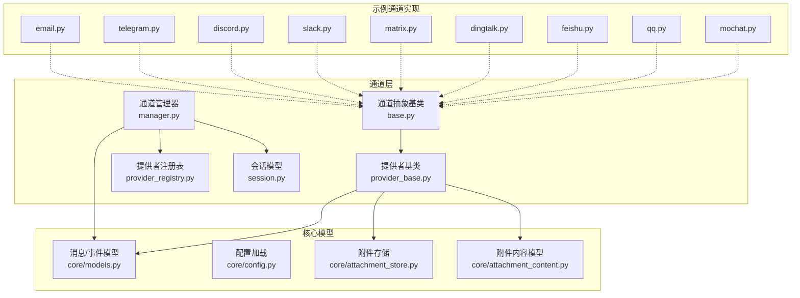
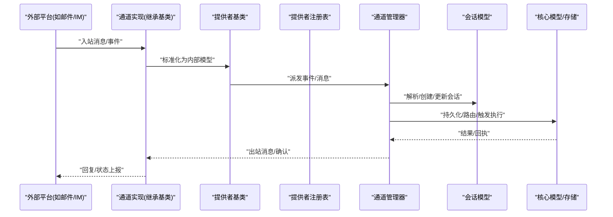
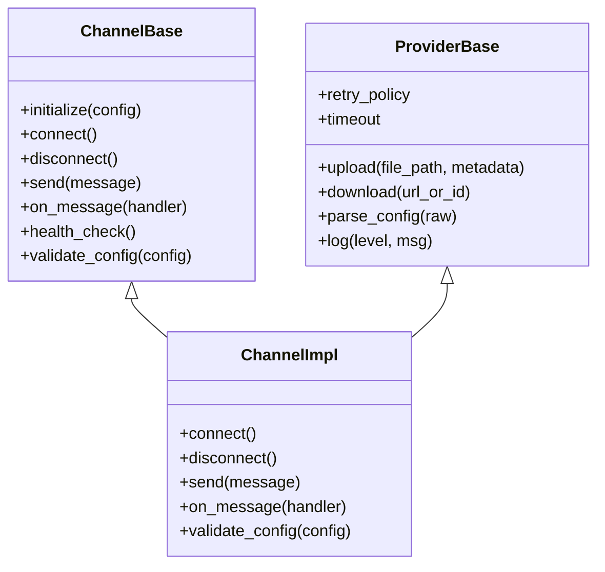
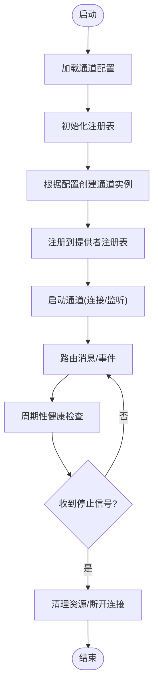
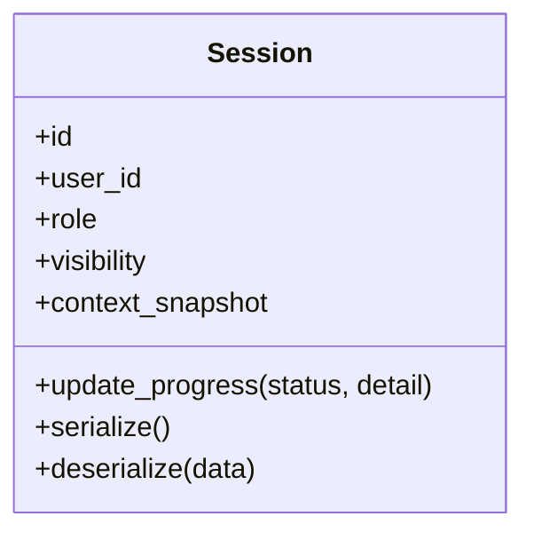
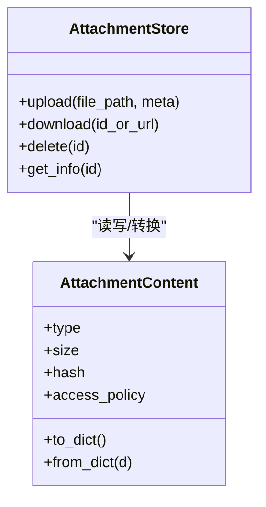
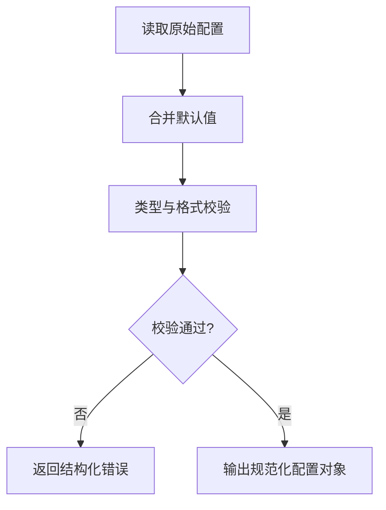
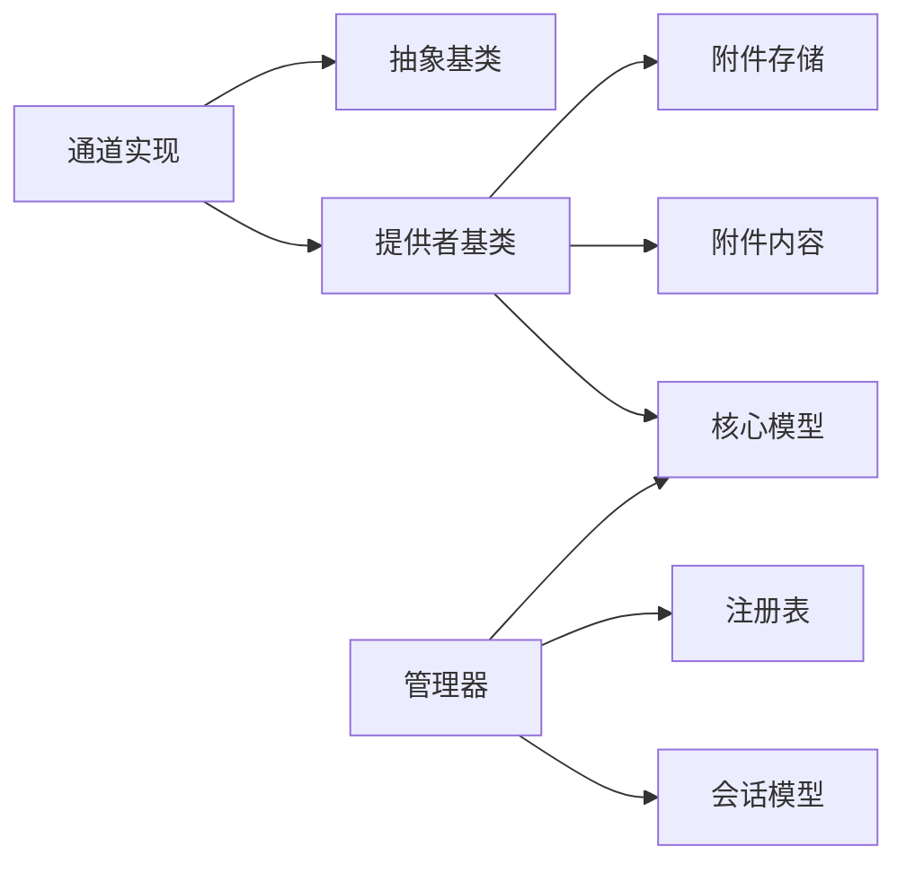

# 自定义通道开发

<cite>
**本文引用的文件**   
- [opc/channels/base.py](file://opc/channels/base.py)
- [opc/channels/provider_base.py](file://opc/channels/provider_base.py)
- [opc/channels/manager.py](file://opc/channels/manager.py)
- [opc/channels/provider_registry.py](file://opc/channels/provider_registry.py)
- [opc/channels/session.py](file://opc/channels/session.py)
- [opc/core/models.py](file://opc/core/models.py)
- [opc/core/config.py](file://opc/core/config.py)
- [opc/core/attachment_store.py](file://opc/core/attachment_store.py)
- [opc/core/attachment_content.py](file://opc/core/attachment_content.py)
- [opc/channels/email.py](file://opc/channels/email.py)
- [opc/channels/telegram.py](file://opc/channels/telegram.py)
- [opc/channels/discord.py](file://opc/channels/discord.py)
- [opc/channels/slack.py](file://opc/channels/slack.py)
- [opc/channels/matrix.py](file://opc/channels/matrix.py)
- [opc/channels/dingtalk.py](file://opc/channels/dingtalk.py)
- [opc/channels/feishu.py](file://opc/channels/feishu.py)
- [opc/channels/qq.py](file://opc/channels/qq.py)
- [opc/channels/mochat.py](file://opc/channels/mochat.py)
- [opc/channels/__init__.py](file://opc/channels/__init__.py)
- [config/channel_config.yaml](file://config/channel_config.yaml)
- [tests/test_channel_contracts.py](file://tests/test_channel_contracts.py)
- [tests/test_channels.py](file://tests/test_channels.py)
- [tests/test_channel_runtime_integration.py](file://tests/test_channel_runtime_integration.py)
</cite>

## 目录
1. [简介](#简介)
2. [项目结构](#项目结构)
3. [核心组件](#核心组件)
4. [架构总览](#架构总览)
5. [详细组件分析](#详细组件分析)
6. [依赖关系分析](#依赖关系分析)
7. [性能考虑](#性能考虑)
8. [故障排查指南](#故障排查指南)
9. [结论](#结论)
10. [附录](#附录)

## 简介
本指南面向需要在 OpenOPC 中从零实现“自定义通道”的开发者。内容涵盖：
- 项目结构与依赖管理
- 必需接口与实现步骤（消息发送、接收、连接管理、配置校验）
- 多类型消息处理（文本、图片、文件、富媒体）
- 会话状态同步、用户身份与权限控制
- 单元测试与集成测试、Mock 使用
- 性能优化、内存管理与资源释放
- 调试方法与常见问题排查

## 项目结构
OpenOPC 的通道子系统位于 opc/channels，采用“抽象基类 + 提供者注册 + 管理器调度”的分层设计。核心要点：
- 抽象基类定义通道契约（发送、接收、连接、配置等）
- 具体通道实现继承基类并注册到提供者注册表
- 管理器负责生命周期、路由与事件分发
- 会话模型统一承载上下文与会话状态
- 附件存储与内容模型支撑多模态消息

图表来源
- [opc/channels/base.py](file://opc/channels/base.py)
- [opc/channels/provider_base.py](file://opc/channels/provider_base.py)
- [opc/channels/manager.py](file://opc/channels/manager.py)
- [opc/channels/provider_registry.py](file://opc/channels/provider_registry.py)
- [opc/channels/session.py](file://opc/channels/session.py)
- [opc/core/models.py](file://opc/core/models.py)
- [opc/core/config.py](file://opc/core/config.py)
- [opc/core/attachment_store.py](file://opc/core/attachment_store.py)
- [opc/core/attachment_content.py](file://opc/core/attachment_content.py)
- [opc/channels/email.py](file://opc/channels/email.py)
- [opc/channels/telegram.py](file://opc/channels/telegram.py)
- [opc/channels/discord.py](file://opc/channels/discord.py)
- [opc/channels/slack.py](file://opc/channels/slack.py)
- [opc/channels/matrix.py](file://opc/channels/matrix.py)
- [opc/channels/dingtalk.py](file://opc/channels/dingtalk.py)
- [opc/channels/feishu.py](file://opc/channels/feishu.py)
- [opc/channels/qq.py](file://opc/channels/qq.py)
- [opc/channels/mochat.py](file://opc/channels/mochat.py)

章节来源
- [opc/channels/base.py](file://opc/channels/base.py)
- [opc/channels/provider_base.py](file://opc/channels/provider_base.py)
- [opc/channels/manager.py](file://opc/channels/manager.py)
- [opc/channels/provider_registry.py](file://opc/channels/provider_registry.py)
- [opc/channels/session.py](file://opc/channels/session.py)
- [opc/core/models.py](file://opc/core/models.py)
- [opc/core/config.py](file://opc/core/config.py)
- [opc/core/attachment_store.py](file://opc/core/attachment_store.py)
- [opc/core/attachment_content.py](file://opc/core/attachment_content.py)
- [opc/channels/email.py](file://opc/channels/email.py)
- [opc/channels/telegram.py](file://opc/channels/telegram.py)
- [opc/channels/discord.py](file://opc/channels/discord.py)
- [opc/channels/slack.py](file://opc/channels/slack.py)
- [opc/channels/matrix.py](file://opc/channels/matrix.py)
- [opc/channels/dingtalk.py](file://opc/channels/dingtalk.py)
- [opc/channels/feishu.py](file://opc/channels/feishu.py)
- [opc/channels/qq.py](file://opc/channels/qq.py)
- [opc/channels/mochat.py](file://opc/channels/mochat.py)

## 核心组件
- 通道抽象基类：定义通道必须实现的接口，包括连接建立/断开、消息发送、消息接收回调、配置校验、健康检查等。
- 提供者基类：提供通用能力（如重试、日志、配置解析、附件上传下载），降低重复实现成本。
- 通道管理器：负责通道的创建、启动、停止、路由与事件分发；维护会话映射与并发控制。
- 提供者注册表：集中管理通道提供者实例，支持按名称或类型查找与生命周期管理。
- 会话模型：封装会话标识、上下文、权限、可见性、进度等元数据，供通道与上层协作。
- 核心模型：消息、事件、任务、工作项等数据结构，保证跨模块一致的数据契约。
- 附件存储与内容模型：统一处理图片、文件、富媒体资源的持久化与传输。

章节来源
- [opc/channels/base.py](file://opc/channels/base.py)
- [opc/channels/provider_base.py](file://opc/channels/provider_base.py)
- [opc/channels/manager.py](file://opc/channels/manager.py)
- [opc/channels/provider_registry.py](file://opc/channels/provider_registry.py)
- [opc/channels/session.py](file://opc/channels/session.py)
- [opc/core/models.py](file://opc/core/models.py)
- [opc/core/attachment_store.py](file://opc/core/attachment_store.py)
- [opc/core/attachment_content.py](file://opc/core/attachment_content.py)

## 架构总览
下图展示了从外部平台到 OpenOPC 核心的一条典型消息路径，以及通道在其中的职责边界。

图表来源
- [opc/channels/base.py](file://opc/channels/base.py)
- [opc/channels/provider_base.py](file://opc/channels/provider_base.py)
- [opc/channels/manager.py](file://opc/channels/manager.py)
- [opc/channels/provider_registry.py](file://opc/channels/provider_registry.py)
- [opc/channels/session.py](file://opc/channels/session.py)
- [opc/core/models.py](file://opc/core/models.py)

## 详细组件分析

### 通道抽象基类与提供者基类
- 抽象基类职责
  - 定义连接生命周期方法（初始化、连接、心跳、断开）
  - 定义消息发送与接收回调接口
  - 定义配置校验与参数注入
  - 定义健康检查与错误上报
- 提供者基类职责
  - 提供通用重试、超时、限流策略
  - 提供配置解析与默认值合并
  - 提供附件上传/下载与内容类型推断
  - 提供日志与指标埋点模板

图表来源
- [opc/channels/base.py](file://opc/channels/base.py)
- [opc/channels/provider_base.py](file://opc/channels/provider_base.py)

章节来源
- [opc/channels/base.py](file://opc/channels/base.py)
- [opc/channels/provider_base.py](file://opc/channels/provider_base.py)

### 通道管理器与提供者注册表
- 管理器
  - 负责通道实例的创建、启动、停止
  - 维护会话映射、路由规则、并发队列
  - 聚合健康检查与告警
- 注册表
  - 以名称/类型为键管理通道提供者
  - 提供按需加载与单例复用
  - 暴露查询与生命周期钩子

图表来源
- [opc/channels/manager.py](file://opc/channels/manager.py)
- [opc/channels/provider_registry.py](file://opc/channels/provider_registry.py)

章节来源
- [opc/channels/manager.py](file://opc/channels/manager.py)
- [opc/channels/provider_registry.py](file://opc/channels/provider_registry.py)

### 会话模型与身份/权限
- 会话模型
  - 包含会话ID、关联用户、角色、可见性、进度、上下文快照等
  - 提供序列化/反序列化工具
- 身份与权限
  - 基于会话上下文进行鉴权决策
  - 结合组织/角色策略限制操作范围

图表来源
- [opc/channels/session.py](file://opc/channels/session.py)
- [opc/core/models.py](file://opc/core/models.py)

章节来源
- [opc/channels/session.py](file://opc/channels/session.py)
- [opc/core/models.py](file://opc/core/models.py)

### 附件存储与多模态消息
- 附件存储
  - 统一接入本地/云存储，提供上传、下载、删除、URL生成
  - 支持分块上传与断点续传（可选）
- 附件内容模型
  - 描述类型（图片/文件/富媒体）、大小、哈希、访问策略
  - 与消息模型组合形成多模态消息

图表来源
- [opc/core/attachment_store.py](file://opc/core/attachment_store.py)
- [opc/core/attachment_content.py](file://opc/core/attachment_content.py)

章节来源
- [opc/core/attachment_store.py](file://opc/core/attachment_store.py)
- [opc/core/attachment_content.py](file://opc/core/attachment_content.py)

### 配置加载与验证
- 配置来源
  - YAML/环境变量/运行时参数
- 校验流程
  - 必填字段校验、类型校验、格式校验、业务约束校验
  - 失败时抛出明确异常并附带修复建议

图表来源
- [opc/core/config.py](file://opc/core/config.py)
- [config/channel_config.yaml](file://config/channel_config.yaml)

章节来源
- [opc/core/config.py](file://opc/core/config.py)
- [config/channel_config.yaml](file://config/channel_config.yaml)

### 现有通道实现参考
以下通道可作为新通道开发的参考实现，覆盖不同协议与特性：
- email.py：邮件收发、附件处理、SMTP/IMAP 连接管理
- telegram.py：Bot 模式、长轮询/Webhook、富文本与媒体
- discord.py：Gateway 事件、Embed/Attachment、权限范围
- slack.py：Events API、Block Kit、文件分享
- matrix.py：Matrix Client、房间/线程、端到端加密（可选）
- dingtalk.py/feishu.py/qq.py/mochat.py：国内 IM 适配，注意鉴权与速率限制

章节来源
- [opc/channels/email.py](file://opc/channels/email.py)
- [opc/channels/telegram.py](file://opc/channels/telegram.py)
- [opc/channels/discord.py](file://opc/channels/discord.py)
- [opc/channels/slack.py](file://opc/channels/slack.py)
- [opc/channels/matrix.py](file://opc/channels/matrix.py)
- [opc/channels/dingtalk.py](file://opc/channels/dingtalk.py)
- [opc/channels/feishu.py](file://opc/channels/feishu.py)
- [opc/channels/qq.py](file://opc/channels/qq.py)
- [opc/channels/mochat.py](file://opc/channels/mochat.py)

## 依赖关系分析
- 低耦合高内聚
  - 通道实现仅依赖抽象基类与提供者基类，避免直接耦合管理器
  - 管理器通过注册表解耦具体通道类型
- 关键依赖链
  - 通道实现 → 提供者基类 → 附件存储/内容模型 → 核心模型
  - 管理器 → 注册表 → 会话模型 → 核心模型

图表来源
- [opc/channels/base.py](file://opc/channels/base.py)
- [opc/channels/provider_base.py](file://opc/channels/provider_base.py)
- [opc/channels/manager.py](file://opc/channels/manager.py)
- [opc/channels/provider_registry.py](file://opc/channels/provider_registry.py)
- [opc/channels/session.py](file://opc/channels/session.py)
- [opc/core/models.py](file://opc/core/models.py)
- [opc/core/attachment_store.py](file://opc/core/attachment_store.py)
- [opc/core/attachment_content.py](file://opc/core/attachment_content.py)

章节来源
- [opc/channels/base.py](file://opc/channels/base.py)
- [opc/channels/provider_base.py](file://opc/channels/provider_base.py)
- [opc/channels/manager.py](file://opc/channels/manager.py)
- [opc/channels/provider_registry.py](file://opc/channels/provider_registry.py)
- [opc/channels/session.py](file://opc/channels/session.py)
- [opc/core/models.py](file://opc/core/models.py)
- [opc/core/attachment_store.py](file://opc/core/attachment_store.py)
- [opc/core/attachment_content.py](file://opc/core/attachment_content.py)

## 性能考虑
- 连接池与复用
  - 复用底层客户端连接，减少握手开销
  - 合理设置最大连接数与空闲回收
- 异步与批处理
  - 使用异步 I/O 提升吞吐
  - 批量发送/拉取，降低网络往返
- 背压与限流
  - 对上游事件与下游写入实施限流与退避
  - 使用队列缓冲与水位线控制内存占用
- 缓存与去重
  - 消息去重（基于 ID/指纹）
  - 热点配置/字典缓存（带过期策略）
- 资源释放
  - 显式关闭连接、释放句柄、清理临时文件
  - 优雅停机：等待队列清空后再退出

[本节为通用指导，不直接分析具体文件]

## 故障排查指南
- 常见错误定位
  - 配置错误：检查必填字段、类型与格式
  - 认证失败：核对凭据、权限范围、IP 白名单
  - 网络问题：DNS、代理、证书、端口连通性
  - 速率限制：观察 429/限流响应，调整重试间隔
- 诊断手段
  - 开启详细日志与请求/响应追踪
  - 健康检查端点与指标上报
  - 回放与 Mock 外部服务
- 恢复策略
  - 自动重试与指数退避
  - 熔断与降级
  - 快速回滚配置与切换备用通道

章节来源
- [tests/test_channel_contracts.py](file://tests/test_channel_contracts.py)
- [tests/test_channels.py](file://tests/test_channels.py)
- [tests/test_channel_runtime_integration.py](file://tests/test_channel_runtime_integration.py)

## 结论
通过遵循抽象基类与提供者基类的契约，配合管理器与注册表的解耦设计，开发者可以高效地实现稳定、可观测、可扩展的自定义通道。在多模态消息、会话同步、身份权限方面，应优先复用核心模型与附件系统，确保一致性。完善的测试与监控是保障质量的关键。

[本节为总结，不直接分析具体文件]

## 附录

### 从零开始实现新通道的步骤清单
- 规划与准备
  - 确定通道类型（IM/邮件/其他）、协议与鉴权方式
  - 评估是否需要 Webhook 或长轮询
- 搭建项目结构
  - 在 opc/channels 下新增通道文件（例如 mychannel.py）
  - 在 __init__.py 中导出新通道（如需）
- 实现基础能力
  - 继承抽象基类与提供者基类
  - 实现 connect/disconnect、send、on_message、validate_config
  - 使用提供者基类的重试、超时、日志、附件工具
- 配置与注册
  - 在 channel_config.yaml 中添加通道配置项
  - 将通道注册到提供者注册表（若需要）
- 多模态消息
  - 使用附件存储上传/下载，构造附件内容模型
  - 将文本与附件组合为消息模型
- 会话与权限
  - 基于会话模型维护上下文与进度
  - 在发送前进行权限校验
- 测试与发布
  - 编写单元测试与集成测试
  - 使用 Mock 模拟外部平台
  - 运行回归与性能基准

章节来源
- [opc/channels/__init__.py](file://opc/channels/__init__.py)
- [config/channel_config.yaml](file://config/channel_config.yaml)

### 单元测试编写指南
- 目标
  - 覆盖配置校验、连接建立、消息发送/接收、附件上传下载、错误分支
- 方法
  - 使用 Mock 替换外部网络调用
  - 使用夹具准备最小可用配置
  - 断言副作用（日志、指标、存储写入）
- 推荐用例
  - 正常路径、参数缺失、网络异常、鉴权失败、附件过大、速率限制

章节来源
- [tests/test_channel_contracts.py](file://tests/test_channel_contracts.py)
- [tests/test_channels.py](file://tests/test_channels.py)

### 集成测试方法与 Mock 使用
- 集成测试
  - 使用沙箱环境或测试账号
  - 端到端验证：入站消息 → 通道 → 管理器 → 核心 → 出站回复
- Mock 策略
  - 模拟外部平台 API 响应
  - 注入可控延迟与错误
  - 验证重试与熔断行为

章节来源
- [tests/test_channel_runtime_integration.py](file://tests/test_channel_runtime_integration.py)

### 最佳实践模式
- 幂等性
  - 为每条消息分配唯一 ID，避免重复处理
- 可观测性
  - 记录关键事件与耗时，暴露健康检查
- 可配置性
  - 将敏感信息放入环境变量或密钥管理服务
- 健壮性
  - 全面的错误分类与恢复策略
  - 优雅停机与资源清理

[本节为通用指导，不直接分析具体文件]