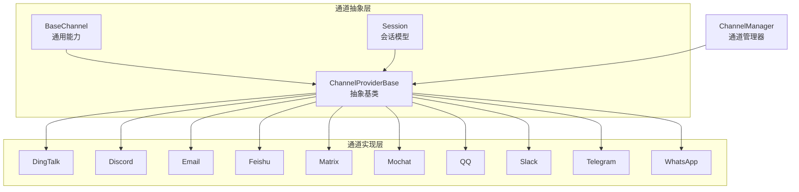
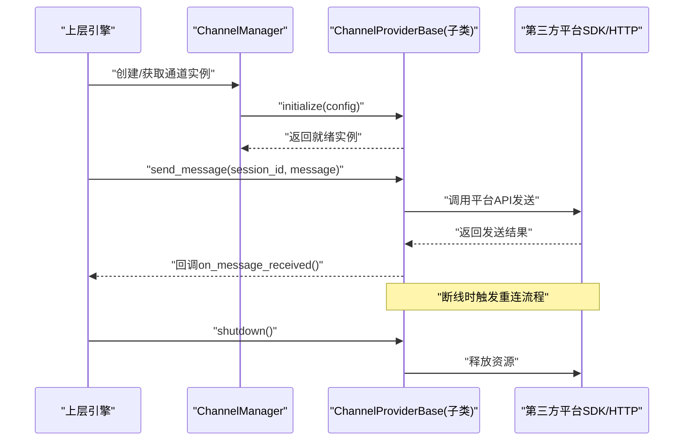
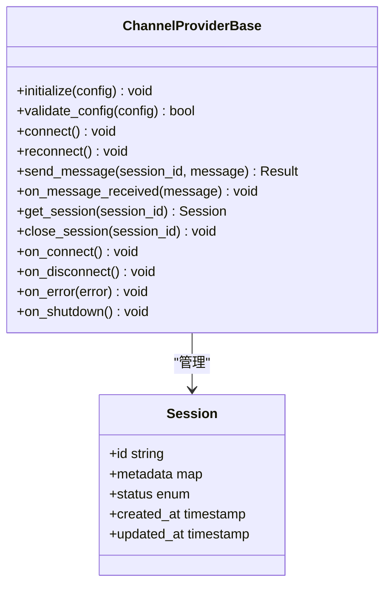
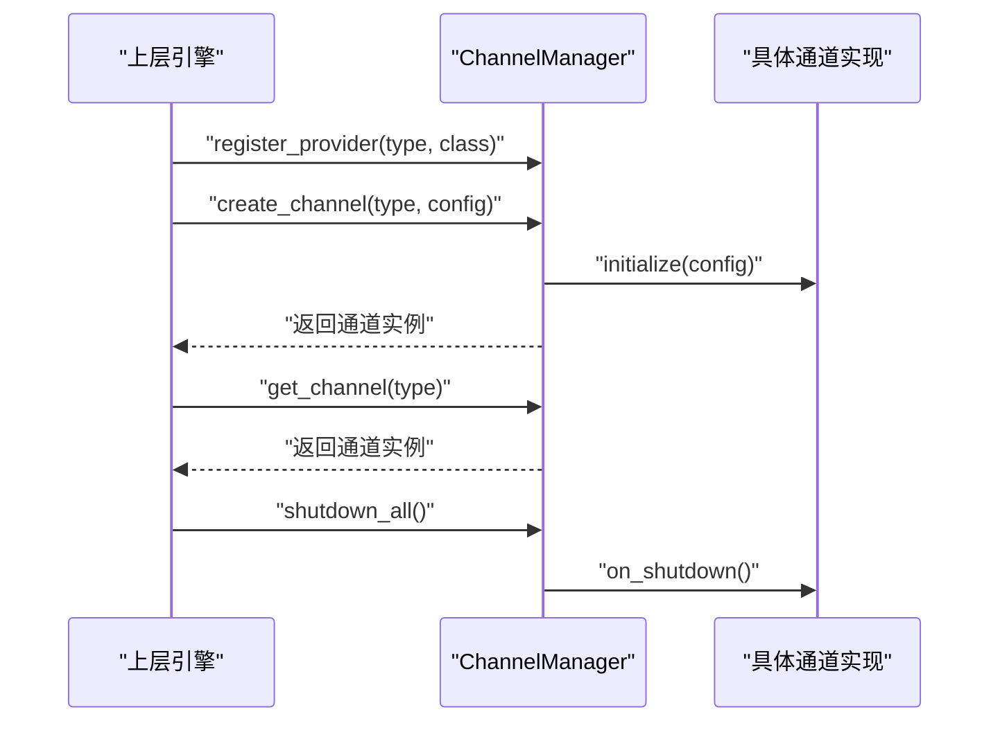
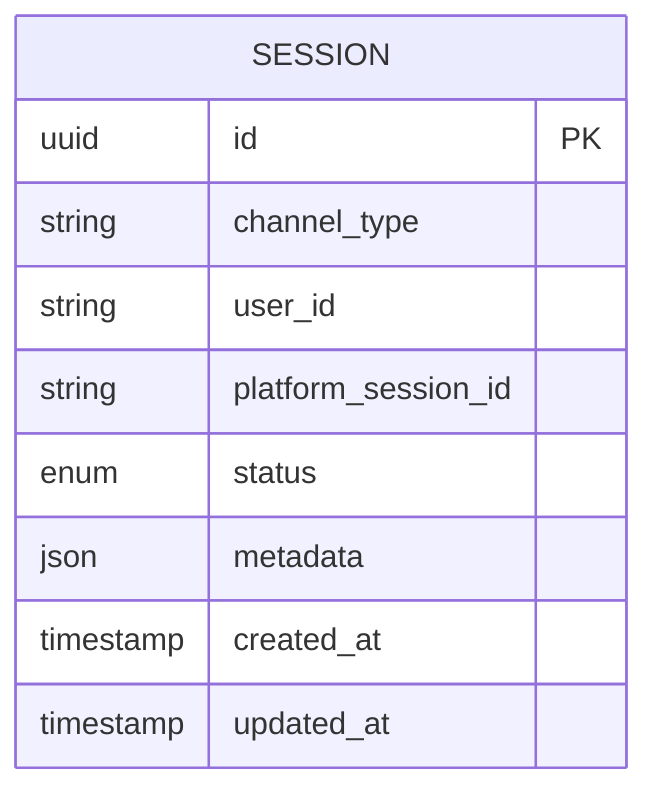
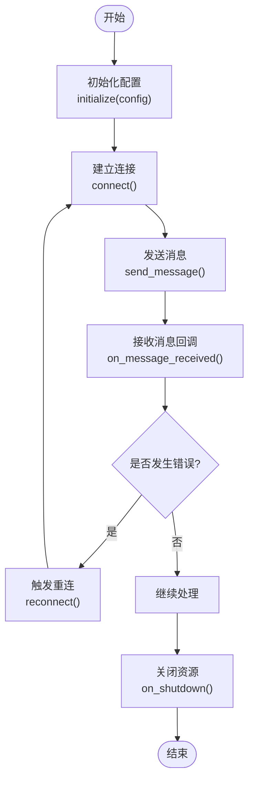
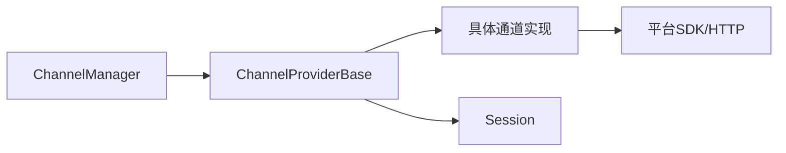

# 通道基础接口

<cite>
**本文引用的文件**   
- [provider_base.py](file://opc/channels/provider_base.py)
- [base.py](file://opc/channels/base.py)
- [manager.py](file://opc/channels/manager.py)
- [session.py](file://opc/channels/session.py)
- [dingtalk.py](file://opc/channels/dingtalk.py)
- [discord.py](file://opc/channels/discord.py)
- [email.py](file://opc/channels/email.py)
- [feishu.py](file://opc/channels/feishu.py)
- [matrix.py](file://opc/channels/matrix.py)
- [mochat.py](file://opc/channels/mochat.py)
- [qq.py](file://opc/channels/qq.py)
- [slack.py](file://opc/channels/slack.py)
- [telegram.py](file://opc/channels/telegram.py)
- [whatsapp.py](file://opc/channels/whatsapp.py)
- [channel_config.yaml](file://config/channel_config.yaml)
</cite>

## 目录
1. [简介](#简介)
2. [项目结构](#项目结构)
3. [核心组件](#核心组件)
4. [架构总览](#架构总览)
5. [详细组件分析](#详细组件分析)
6. [依赖关系分析](#依赖关系分析)
7. [性能考虑](#性能考虑)
8. [故障排查指南](#故障排查指南)
9. [结论](#结论)
10. [附录](#附录)

## 简介
本文件聚焦于OpenOPC的“通道基础接口”，围绕ChannelProviderBase抽象基类的设计与实现，系统阐述消息发送、消息接收回调、会话管理、配置校验、生命周期（初始化、连接建立、断线重连、资源清理）、错误处理与重试策略、线程安全与异步处理、以及与上层引擎的交互模式与事件通知机制。文档旨在帮助开发者快速理解并正确扩展新的通道实现。

## 项目结构
通道子系统位于 opc/channels 目录下，采用“抽象基类 + 具体通道实现 + 管理器”的分层组织方式：
- 抽象基类与通用能力：provider_base.py、base.py、session.py
- 通道管理器：manager.py
- 各平台通道实现：dingtalk.py、discord.py、email.py、feishu.py、matrix.py、mochat.py、qq.py、slack.py、telegram.py、whatsapp.py
- 配置示例：config/channel_config.yaml

图表来源
- [provider_base.py:1-200](file://opc/channels/provider_base.py#L1-L200)
- [base.py:1-200](file://opc/channels/base.py#L1-L200)
- [session.py:1-200](file://opc/channels/session.py#L1-L200)
- [manager.py:1-200](file://opc/channels/manager.py#L1-L200)
- [dingtalk.py:1-200](file://opc/channels/dingtalk.py#L1-L200)
- [discord.py:1-200](file://opc/channels/discord.py#L1-L200)
- [email.py:1-200](file://opc/channels/email.py#L1-L200)
- [feishu.py:1-200](file://opc/channels/feishu.py#L1-L200)
- [matrix.py:1-200](file://opc/channels/matrix.py#L1-L200)
- [mochat.py:1-200](file://opc/channels/mochat.py#L1-L200)
- [qq.py:1-200](file://opc/channels/qq.py#L1-L200)
- [slack.py:1-200](file://opc/channels/slack.py#L1-L200)
- [telegram.py:1-200](file://opc/channels/telegram.py#L1-L200)
- [whatsapp.py:1-200](file://opc/channels/whatsapp.py#L1-L200)

章节来源
- [provider_base.py:1-200](file://opc/channels/provider_base.py#L1-L200)
- [base.py:1-200](file://opc/channels/base.py#L1-L200)
- [session.py:1-200](file://opc/channels/session.py#L1-L200)
- [manager.py:1-200](file://opc/channels/manager.py#L1-L200)

## 核心组件
本节深入解析ChannelProviderBase抽象基类的设计理念与核心接口定义，包括：
- 消息发送接口 send_message()
- 消息接收回调 on_message_received()
- 会话管理接口与会话模型
- 配置验证方法
- 生命周期钩子（初始化、连接建立、断线重连、资源清理）
- 错误处理与重试策略
- 线程安全与异步处理建议
- 与上层引擎的交互与事件通知

章节来源
- [provider_base.py:1-200](file://opc/channels/provider_base.py#L1-L200)
- [session.py:1-200](file://opc/channels/session.py#L1-L200)
- [manager.py:1-200](file://opc/channels/manager.py#L1-L200)

## 架构总览
通道子系统通过统一的抽象基类屏蔽底层平台差异，由ChannelManager负责实例化、注册与调度；具体通道实现继承抽象基类，完成平台特定的连接、收发与状态维护。

图表来源
- [manager.py:1-200](file://opc/channels/manager.py#L1-L200)
- [provider_base.py:1-200](file://opc/channels/provider_base.py#L1-L200)

## 详细组件分析

### ChannelProviderBase 抽象基类
- 设计理念
  - 统一抽象：为所有通道提供一致的接口契约，屏蔽平台差异。
  - 生命周期清晰：将初始化、连接、重连、关闭等阶段明确暴露为可覆写钩子。
  - 可扩展性：通过配置校验、会话模型、事件回调等扩展点支持多样化平台。
- 核心接口与方法
  - 初始化与配置校验
    - initialize(config): 加载并校验配置，准备内部状态。
    - validate_config(config): 校验必填字段、类型与约束。
  - 连接与重连
    - connect(): 建立到平台的连接（如WebSocket/HTTP长连接）。
    - reconnect(): 断线后自动或手动触发重连逻辑。
  - 消息发送
    - send_message(session_id, message): 向指定会话发送消息，返回发送结果或抛出异常。
  - 消息接收回调
    - on_message_received(message): 平台侧消息到达时的回调入口，供上层处理。
  - 会话管理
    - get_session(session_id): 获取或创建会话上下文。
    - close_session(session_id): 关闭会话并清理相关资源。
  - 生命周期钩子
    - on_connect(), on_disconnect(), on_error(error), on_shutdown(): 在关键状态变化时触发。
  - 错误处理与重试
    - 定义标准异常类型与错误码映射。
    - 提供可配置的重试策略（指数退避、最大重试次数、超时控制）。
- 线程安全与异步
  - 建议在子类中保证并发安全（如使用锁保护共享状态）。
  - 对阻塞I/O操作建议使用异步队列或事件循环，避免阻塞主线程。

图表来源
- [provider_base.py:1-200](file://opc/channels/provider_base.py#L1-L200)
- [session.py:1-200](file://opc/channels/session.py#L1-L200)

章节来源
- [provider_base.py:1-200](file://opc/channels/provider_base.py#L1-L200)
- [session.py:1-200](file://opc/channels/session.py#L1-L200)

### 通道管理器 ChannelManager
- 职责
  - 通道实例的创建、注册、查找与销毁。
  - 根据配置选择具体通道实现。
  - 协调通道的生命周期与全局事件。
- 关键方法
  - register_provider(provider_type, provider_class): 注册通道提供者。
  - create_channel(provider_type, config): 创建并初始化通道实例。
  - get_channel(provider_type): 获取已存在的通道实例。
  - shutdown_all(): 优雅关闭所有通道。
- 与上层引擎交互
  - 向上层暴露统一的通道访问接口。
  - 转发通道事件（连接、断开、错误、消息）给上层订阅者。

图表来源
- [manager.py:1-200](file://opc/channels/manager.py#L1-L200)

章节来源
- [manager.py:1-200](file://opc/channels/manager.py#L1-L200)

### 会话模型 Session
- 作用
  - 封装一次对话或通信会话的上下文信息。
  - 记录会话元数据、状态、时间戳等。
- 关键字段
  - id: 会话唯一标识。
  - metadata: 附加元数据（如用户ID、渠道信息等）。
  - status: 会话状态（活跃、暂停、关闭等）。
  - created_at / updated_at: 创建与更新时间。
- 与通道提供者关系
  - 通道提供者负责会话的创建、查询与关闭。
  - 消息发送与接收均基于会话上下文进行路由与持久化。

图表来源
- [session.py:1-200](file://opc/channels/session.py#L1-L200)

章节来源
- [session.py:1-200](file://opc/channels/session.py#L1-L200)

### 具体通道实现示例（以钉钉为例）
- 设计要点
  - 继承ChannelProviderBase，覆写必要方法。
  - 实现平台特定的连接与认证逻辑。
  - 将平台消息转换为统一的消息格式，调用on_message_received回调。
  - 处理平台错误码并映射为标准异常。
- 关键实现点
  - initialize(config): 读取钉钉AppKey/AppSecret等配置。
  - connect(): 建立长连接或轮询任务。
  - send_message(session_id, message): 调用钉钉API发送消息。
  - on_message_received(message): 解析平台消息并回调。
  - reconnect(): 捕获断线异常并触发重连。
  - on_shutdown(): 停止轮询或关闭连接。

图表来源
- [dingtalk.py:1-200](file://opc/channels/dingtalk.py#L1-L200)
- [provider_base.py:1-200](file://opc/channels/provider_base.py#L1-L200)

章节来源
- [dingtalk.py:1-200](file://opc/channels/dingtalk.py#L1-L200)
- [provider_base.py:1-200](file://opc/channels/provider_base.py#L1-L200)

### 其他通道实现概览
- Discord、Email、飞书、Matrix、Mochat、QQ、Slack、Telegram、WhatsApp 等通道均遵循相同抽象契约，各自实现平台特定逻辑。
- 共性模式
  - 配置项标准化（如token、endpoint、超时、重试参数）。
  - 统一的消息结构与错误码映射。
  - 一致的生命周期钩子与事件通知。

章节来源
- [discord.py:1-200](file://opc/channels/discord.py#L1-L200)
- [email.py:1-200](file://opc/channels/email.py#L1-L200)
- [feishu.py:1-200](file://opc/channels/feishu.py#L1-L200)
- [matrix.py:1-200](file://opc/channels/matrix.py#L1-L200)
- [mochat.py:1-200](file://opc/channels/mochat.py#L1-L200)
- [qq.py:1-200](file://opc/channels/qq.py#L1-L200)
- [slack.py:1-200](file://opc/channels/slack.py#L1-L200)
- [telegram.py:1-200](file://opc/channels/telegram.py#L1-L200)
- [whatsapp.py:1-200](file://opc/channels/whatsapp.py#L1-L200)

## 依赖关系分析
- 模块耦合
  - ChannelProviderBase 作为核心抽象，被所有具体通道实现与管理器依赖。
  - Session 作为数据模型被通道提供者广泛使用。
- 外部依赖
  - 各通道实现依赖对应平台的SDK或HTTP客户端。
  - 管理器可能依赖配置加载与日志记录模块。
- 潜在循环依赖
  - 当前分层清晰，未见明显循环依赖风险。

图表来源
- [provider_base.py:1-200](file://opc/channels/provider_base.py#L1-L200)
- [manager.py:1-200](file://opc/channels/manager.py#L1-L200)
- [session.py:1-200](file://opc/channels/session.py#L1-L200)

章节来源
- [provider_base.py:1-200](file://opc/channels/provider_base.py#L1-L200)
- [manager.py:1-200](file://opc/channels/manager.py#L1-L200)
- [session.py:1-200](file://opc/channels/session.py#L1-L200)

## 性能考虑
- 连接复用
  - 尽量复用长连接，减少频繁握手开销。
- 批量发送
  - 对于高吞吐场景，支持消息批处理与合并发送。
- 异步与并发
  - 使用异步I/O与事件循环，避免阻塞主线程。
  - 合理设置并发度与队列长度，防止内存溢出。
- 重试与退避
  - 采用指数退避与抖动策略，降低雪崩风险。
- 资源清理
  - 及时释放连接、文件句柄与定时器，避免资源泄漏。

[本节为通用指导，不直接分析具体文件]

## 故障排查指南
- 常见问题
  - 配置错误：检查必填字段与类型，确保符合validate_config约束。
  - 连接失败：确认网络可达性与凭据有效性，查看on_error回调日志。
  - 消息丢失：检查会话状态与重试策略，确认幂等性与去重逻辑。
  - 断线重连：观察reconnect触发条件与退避参数，必要时调整超时与最大重试次数。
- 诊断步骤
  - 启用详细日志，定位错误码与堆栈。
  - 复现最小用例，隔离问题范围。
  - 检查平台侧限流与配额限制。

章节来源
- [provider_base.py:1-200](file://opc/channels/provider_base.py#L1-L200)
- [manager.py:1-200](file://opc/channels/manager.py#L1-L200)

## 结论
ChannelProviderBase为OpenOPC通道子系统提供了统一、可扩展且健壮的基础抽象。通过清晰的接口定义、生命周期管理与错误处理机制，开发者可以快速实现新通道并保持与上层引擎的一致交互体验。结合合理的线程安全与异步处理策略，可在保证稳定性的同时获得良好的性能表现。

[本节为总结性内容，不直接分析具体文件]

## 附录
- 配置参考
  - 通道配置示例见 channel_config.yaml，包含各通道所需的密钥、端点、超时与重试参数等。

章节来源
- [channel_config.yaml:1-200](file://config/channel_config.yaml#L1-L200)