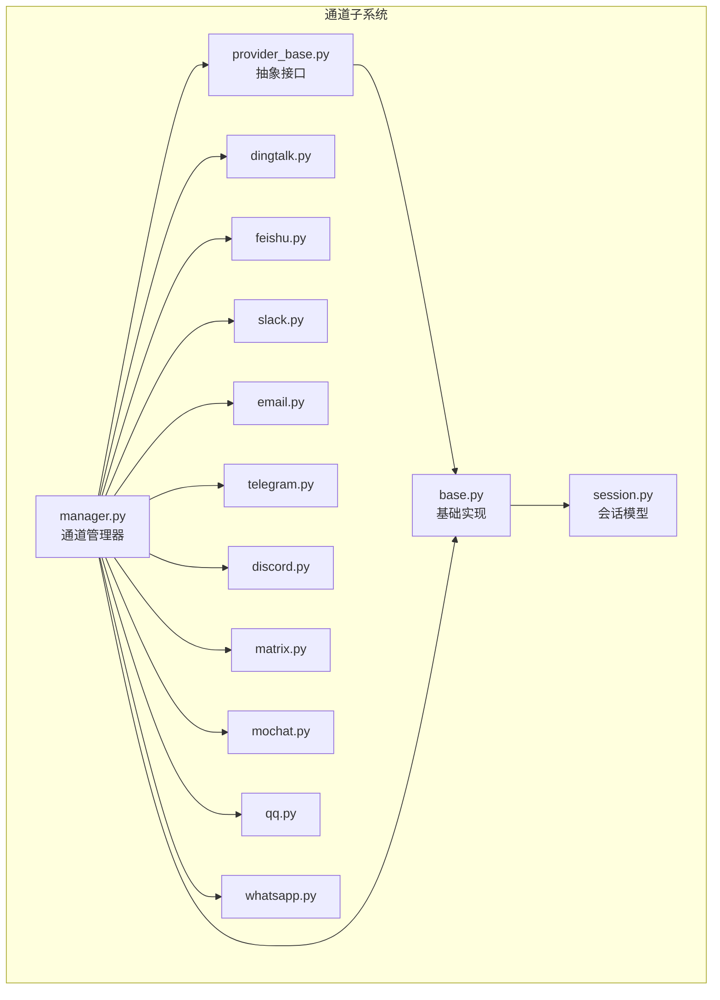
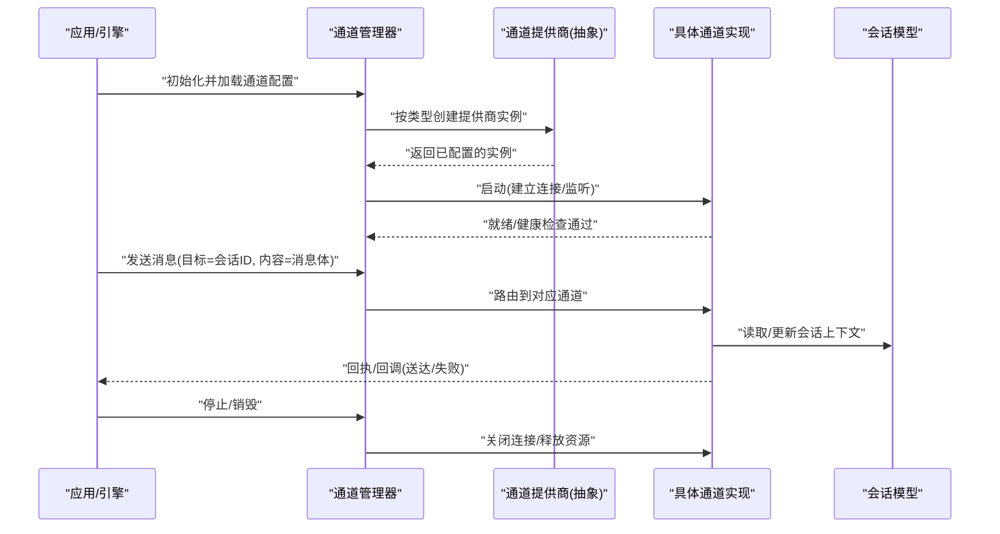
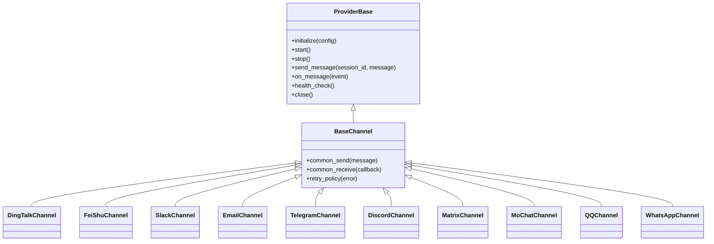
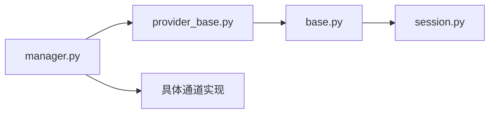

# 通道接口

<cite>
**本文引用的文件**   
- [opc/channels/provider_base.py](file://opc/channels/provider_base.py)
- [opc/channels/base.py](file://opc/channels/base.py)
- [opc/channels/manager.py](file://opc/channels/manager.py)
- [opc/channels/session.py](file://opc/channels/session.py)
- [opc/channels/dingtalk.py](file://opc/channels/dingtalk.py)
- [opc/channels/feishu.py](file://opc/channels/feishu.py)
- [opc/channels/slack.py](file://opc/channels/slack.py)
- [opc/channels/email.py](file://opc/channels/email.py)
- [opc/channels/telegram.py](file://opc/channels/telegram.py)
- [opc/channels/discord.py](file://opc/channels/discord.py)
- [opc/channels/matrix.py](file://opc/channels/matrix.py)
- [opc/channels/mochat.py](file://opc/channels/mochat.py)
- [opc/channels/qq.py](file://opc/channels/qq.py)
- [opc/channels/whatsapp.py](file://opc/channels/whatsapp.py)
- [config/channel_config.yaml](file://config/channel_config.yaml)
- [tests/test_channel_contracts.py](file://tests/test_channel_contracts.py)
- [tests/test_channels.py](file://tests/test_channels.py)
</cite>

## 目录
1. [简介](#简介)
2. [项目结构](#项目结构)
3. [核心组件](#核心组件)
4. [架构总览](#架构总览)
5. [详细组件分析](#详细组件分析)
6. [依赖关系分析](#依赖关系分析)
7. [性能考虑](#性能考虑)
8. [故障排除指南](#故障排除指南)
9. [结论](#结论)
10. [附录](#附录)

## 简介
本文件面向希望为 OpenOPC 集成新通信渠道的开发者，系统化阐述“通道接口”的设计与实现。内容覆盖：
- 通道提供商基类的接口定义与抽象方法
- 消息收发、会话管理、配置管理的接口约定
- 通道的注册机制、生命周期管理与错误处理策略
- 自定义通道开发完整指南（含示例路径与测试方法）
- 内置通道（钉钉、飞书、Slack 等）的实现差异
- 性能调优与扩展性建议
- 调试工具与故障排除方法

目标是帮助开发者快速理解并稳定地接入新的通信渠道。

## 项目结构
OpenOPC 的通道子系统位于 opc/channels 目录，采用“提供者基类 + 具体通道实现 + 管理器 + 会话模型”的分层组织方式：
- provider_base.py：定义通道提供商的抽象接口与通用能力
- base.py：提供基础通道实现或通用行为
- manager.py：负责通道发现、注册、生命周期与路由
- session.py：会话模型与上下文
- 各具体通道实现：dingtalk.py、feishu.py、slack.py、email.py、telegram.py、discord.py、matrix.py、mochat.py、qq.py、whatsapp.py
- 配置：config/channel_config.yaml 用于声明式启用/配置通道
- 测试：tests/test_channel_contracts.py、tests/test_channels.py 验证契约与端到端流程

图表来源
- [opc/channels/provider_base.py](file://opc/channels/provider_base.py)
- [opc/channels/base.py](file://opc/channels/base.py)
- [opc/channels/manager.py](file://opc/channels/manager.py)
- [opc/channels/session.py](file://opc/channels/session.py)
- [opc/channels/dingtalk.py](file://opc/channels/dingtalk.py)
- [opc/channels/feishu.py](file://opc/channels/feishu.py)
- [opc/channels/slack.py](file://opc/channels/slack.py)
- [opc/channels/email.py](file://opc/channels/email.py)
- [opc/channels/telegram.py](file://opc/channels/telegram.py)
- [opc/channels/discord.py](file://opc/channels/discord.py)
- [opc/channels/matrix.py](file://opc/channels/matrix.py)
- [opc/channels/mochat.py](file://opc/channels/mochat.py)
- [opc/channels/qq.py](file://opc/channels/qq.py)
- [opc/channels/whatsapp.py](file://opc/channels/whatsapp.py)

章节来源
- [opc/channels/provider_base.py](file://opc/channels/provider_base.py)
- [opc/channels/base.py](file://opc/channels/base.py)
- [opc/channels/manager.py](file://opc/channels/manager.py)
- [opc/channels/session.py](file://opc/channels/session.py)
- [config/channel_config.yaml](file://config/channel_config.yaml)

## 核心组件
本节聚焦通道子系统的核心职责与关键接口：
- 通道提供商基类：定义统一的能力边界（连接、认证、发送、接收、事件回调、健康检查、关闭等）
- 通道管理器：负责通道实例的发现、注册、启动、停止、路由与资源回收
- 会话模型：封装一次对话的上下文、状态与持久化键
- 具体通道实现：对接不同平台协议（IM、邮件、Webhook 等）

章节来源
- [opc/channels/provider_base.py](file://opc/channels/provider_base.py)
- [opc/channels/manager.py](file://opc/channels/manager.py)
- [opc/channels/session.py](file://opc/channels/session.py)

## 架构总览
下图展示了从上层调用到具体通道实现的典型交互路径，包括注册、启动、消息收发与会话绑定。

图表来源
- [opc/channels/manager.py](file://opc/channels/manager.py)
- [opc/channels/provider_base.py](file://opc/channels/provider_base.py)
- [opc/channels/session.py](file://opc/channels/session.py)

## 详细组件分析

### 通道提供商基类与抽象接口
- 设计目标
  - 统一所有通道的能力边界，屏蔽底层协议差异
  - 明确生命周期阶段：创建、配置、启动、运行、停止、销毁
  - 标准化消息收发、事件回调、健康检查与错误上报
- 关键抽象点（概念说明）
  - 连接与认证：根据配置完成鉴权与长连接建立
  - 发送消息：支持文本、富文本、附件等多模态
  - 接收消息：基于回调或轮询将外部消息转换为内部事件
  - 会话管理：绑定用户/群组与内部会话标识
  - 健康检查：心跳/探测接口，供管理器监控
  - 错误处理：区分可重试与不可重试错误，提供统一异常类型
- 扩展建议
  - 新增通道时优先继承提供商基类，仅实现必要抽象方法
  - 复用 base.py 中的通用逻辑以减少重复代码

章节来源
- [opc/channels/provider_base.py](file://opc/channels/provider_base.py)
- [opc/channels/base.py](file://opc/channels/base.py)

### 消息收发接口
- 发送侧
  - 输入：会话标识、消息体（文本/富文本/附件）、可选元数据（如优先级、追踪ID）
  - 输出：发送结果（成功/失败/部分失败），附带平台侧消息ID
  - 幂等与去重：建议在实现中维护去重键，避免网络抖动导致重复投递
- 接收侧
  - 事件模型：统一的消息事件对象（包含来源、时间戳、类型、内容、附件等）
  - 回调机制：通过回调函数或事件总线将外部消息推入系统
  - 反序列化：将平台特定格式映射为内部标准结构
- 错误与重试
  - 分类：网络错误、认证失效、限流、业务校验失败
  - 策略：指数退避、熔断、降级（例如先落盘再重试）

章节来源
- [opc/channels/provider_base.py](file://opc/channels/provider_base.py)
- [opc/channels/base.py](file://opc/channels/base.py)

### 会话管理接口
- 会话标识
  - 外部会话ID（平台侧）与内部会话ID的映射关系
  - 多租户/多组织隔离：在会话键中包含组织/企业维度
- 会话状态
  - 活跃/休眠/冻结等状态机
  - 超时清理与自动归档策略
- 上下文与持久化
  - 会话上下文（历史摘要、偏好设置、权限范围）
  - 持久化存储键空间与版本兼容策略

章节来源
- [opc/channels/session.py](file://opc/channels/session.py)

### 配置管理接口
- 配置来源
  - 配置文件（YAML/JSON）与环境变量
  - 运行时动态更新（热重载）
- 配置项规范
  - 连接参数（URL、端口、证书）
  - 认证凭据（密钥、令牌、证书路径）
  - 功能开关（是否启用附件、是否开启日志）
  - 速率限制与并发控制
- 校验与默认值
  - 必填字段校验、类型转换、默认值填充
  - 敏感信息加密与脱敏

章节来源
- [config/channel_config.yaml](file://config/channel_config.yaml)
- [opc/channels/provider_base.py](file://opc/channels/provider_base.py)

### 通道注册机制
- 注册入口
  - 通过管理器集中注册，支持按类型/别名查找
  - 自动发现：扫描已安装通道包并注册
- 生命周期钩子
  - 启动前准备（预检、依赖注入）
  - 启动后通知（健康检查、指标上报）
  - 停止与销毁（资源释放、断连）
- 容错与回滚
  - 单个通道启动失败不影响其他通道
  - 启动失败自动回滚已变更状态

章节来源
- [opc/channels/manager.py](file://opc/channels/manager.py)

### 生命周期管理
- 阶段划分
  - 初始化 -> 配置加载 -> 连接建立 -> 监听/轮询 -> 运行 -> 优雅关闭
- 监控与告警
  - 健康探针、延迟/吞吐指标、错误率统计
- 恢复策略
  - 断线重连、会话恢复、任务补偿

章节来源
- [opc/channels/manager.py](file://opc/channels/manager.py)
- [opc/channels/provider_base.py](file://opc/channels/provider_base.py)

### 错误处理策略
- 错误分类
  - 客户端错误（参数非法、权限不足）
  - 服务端错误（限流、服务不可用）
  - 网络错误（超时、DNS解析失败）
- 处理原则
  - 可重试错误：带退避的重试
  - 不可重试错误：快速失败并记录诊断信息
  - 统一异常类型与错误码，便于上层聚合与展示

章节来源
- [opc/channels/provider_base.py](file://opc/channels/provider_base.py)

### 自定义通道开发指南
- 步骤概览
  1) 新建通道模块（例如 mychannel.py），继承提供商基类
  2) 实现抽象方法：连接、发送、接收、健康检查、关闭
  3) 在管理器中注册通道类型与工厂
  4) 在 channel_config.yaml 中添加配置项
  5) 编写单元测试与集成测试
- 参考实现路径
  - 基类与通用逻辑：[opc/channels/provider_base.py](file://opc/channels/provider_base.py)、[opc/channels/base.py](file://opc/channels/base.py)
  - 注册与管理：[opc/channels/manager.py](file://opc/channels/manager.py)
  - 会话模型：[opc/channels/session.py](file://opc/channels/session.py)
  - 配置样例：[config/channel_config.yaml](file://config/channel_config.yaml)
- 测试方法
  - 契约测试：验证接口一致性
  - 模拟外部依赖：使用桩对象模拟平台 API
  - 端到端测试：在沙箱环境进行真实链路验证

章节来源
- [opc/channels/provider_base.py](file://opc/channels/provider_base.py)
- [opc/channels/base.py](file://opc/channels/base.py)
- [opc/channels/manager.py](file://opc/channels/manager.py)
- [opc/channels/session.py](file://opc/channels/session.py)
- [config/channel_config.yaml](file://config/channel_config.yaml)
- [tests/test_channel_contracts.py](file://tests/test_channel_contracts.py)
- [tests/test_channels.py](file://tests/test_channels.py)

### 内置通道实现差异
- 钉钉（dingtalk.py）
  - 特点：企业级 IM，强依赖企业应用凭证与回调签名校验
  - 关注点：安全签名、消息模板、附件上传
- 飞书（feishu.py）
  - 特点：开放平台 API，支持事件订阅与机器人
  - 关注点：事件去重、消息卡片、权限范围
- Slack（slack.py）
  - 特点：Bot 模式与 Webhook 并存
  - 关注点：OAuth 刷新、频道权限、线程消息
- 邮件（email.py）
  - 特点：SMTP/IMAP 协议，非实时
  - 关注点：附件大小、编码、退信处理
- Telegram（telegram.py）
  - 特点：长轮询或 Webhook
  - 关注点：更新去重、大文件分片
- Discord（discord.py）
  - 特点：WebSocket 长连接
  - 关注点：网关限流、身份验证、事件压缩
- Matrix（matrix.py）
  - 特点：联邦协议，支持自托管
  - 关注点：房间同步、端到端加密
- MoChat（mochat.py）
  - 特点：企业微信生态
  - 关注点：回调验签、通讯录同步
- QQ（qq.py）
  - 特点：QQ 开放平台
  - 关注点：消息格式、频率限制
- WhatsApp（whatsapp.py）
  - 特点：官方 Business API
  - 关注点：会话窗口、模板消息、媒体上传

章节来源
- [opc/channels/dingtalk.py](file://opc/channels/dingtalk.py)
- [opc/channels/feishu.py](file://opc/channels/feishu.py)
- [opc/channels/slack.py](file://opc/channels/slack.py)
- [opc/channels/email.py](file://opc/channels/email.py)
- [opc/channels/telegram.py](file://opc/channels/telegram.py)
- [opc/channels/discord.py](file://opc/channels/discord.py)
- [opc/channels/matrix.py](file://opc/channels/matrix.py)
- [opc/channels/mochat.py](file://opc/channels/mochat.py)
- [opc/channels/qq.py](file://opc/channels/qq.py)
- [opc/channels/whatsapp.py](file://opc/channels/whatsapp.py)

### 类图（代码级关系）

图表来源
- [opc/channels/provider_base.py](file://opc/channels/provider_base.py)
- [opc/channels/base.py](file://opc/channels/base.py)
- [opc/channels/dingtalk.py](file://opc/channels/dingtalk.py)
- [opc/channels/feishu.py](file://opc/channels/feishu.py)
- [opc/channels/slack.py](file://opc/channels/slack.py)
- [opc/channels/email.py](file://opc/channels/email.py)
- [opc/channels/telegram.py](file://opc/channels/telegram.py)
- [opc/channels/discord.py](file://opc/channels/discord.py)
- [opc/channels/matrix.py](file://opc/channels/matrix.py)
- [opc/channels/mochat.py](file://opc/channels/mochat.py)
- [opc/channels/qq.py](file://opc/channels/qq.py)
- [opc/channels/whatsapp.py](file://opc/channels/whatsapp.py)

## 依赖关系分析
- 组件耦合
  - 管理器对提供商基类存在强依赖，对具体实现弱依赖（通过类型/工厂）
  - 具体通道对会话模型存在依赖，用于上下文读写
- 外部依赖
  - 各通道依赖各自平台的 SDK 或 HTTP/WebSocket 库
- 潜在循环依赖
  - 应避免在通道实现中反向引用管理器，防止循环导入

图表来源
- [opc/channels/manager.py](file://opc/channels/manager.py)
- [opc/channels/provider_base.py](file://opc/channels/provider_base.py)
- [opc/channels/base.py](file://opc/channels/base.py)
- [opc/channels/session.py](file://opc/channels/session.py)

章节来源
- [opc/channels/manager.py](file://opc/channels/manager.py)
- [opc/channels/provider_base.py](file://opc/channels/provider_base.py)
- [opc/channels/base.py](file://opc/channels/base.py)
- [opc/channels/session.py](file://opc/channels/session.py)

## 性能考虑
- 连接复用与池化
  - 对 HTTP/WS 连接进行池化管理，减少握手开销
- 并发与限流
  - 按通道维度设置并发上限与令牌桶限流
- 批处理与合并
  - 批量发送、消息合并以降低平台侧压力
- 异步与非阻塞
  - 使用异步 I/O 提升吞吐，避免阻塞主循环
- 缓存与去重
  - 本地缓存热点配置与会话上下文
  - 基于消息指纹的去重，避免重复处理
- 观测性与降级
  - 指标采集（延迟、吞吐、错误率）
  - 降级策略（限流、丢弃低优先级消息）

## 故障排除指南
- 常见问题定位
  - 连接失败：检查认证凭据、网络连通性、证书有效性
  - 消息未送达：查看平台侧回执、重试次数、限流状态
  - 会话丢失：核对会话键生成规则与持久化状态
- 调试技巧
  - 开启通道级调试日志（脱敏）
  - 使用契约测试验证接口一致性
  - 回放外部事件以复现问题
- 恢复手段
  - 重启通道实例、重建连接
  - 清理过期会话与临时文件
  - 回滚配置变更并重新加载

章节来源
- [tests/test_channel_contracts.py](file://tests/test_channel_contracts.py)
- [tests/test_channels.py](file://tests/test_channels.py)

## 结论
通过统一的提供商基类与清晰的接口约定，OpenOPC 的通道子系统实现了高内聚、低耦合的可插拔架构。开发者只需遵循契约并在管理器中注册，即可快速接入新的通信渠道。配合完善的测试与观测手段，可在保证稳定性的同时持续提升扩展性与性能。

## 附录
- 术语
  - 通道：对外通信能力的抽象封装
  - 提供商：通道能力的抽象基类
  - 会话：一次对话的上下文与状态
- 最佳实践
  - 严格遵循错误分类与重试策略
  - 保持配置项的最小可用集，避免过度暴露
  - 在单元测试中覆盖边界条件与异常路径