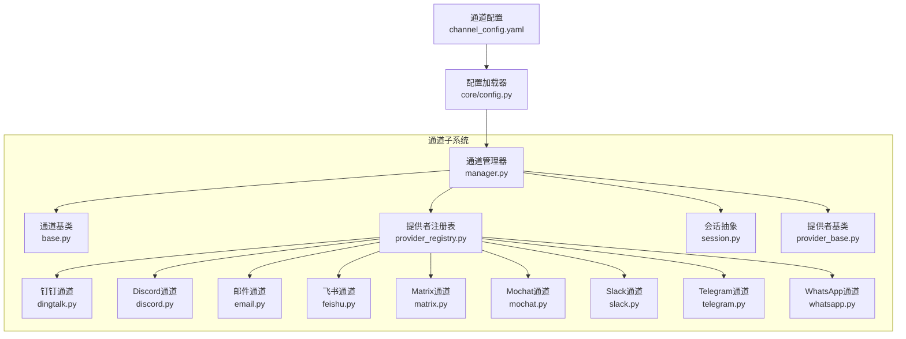
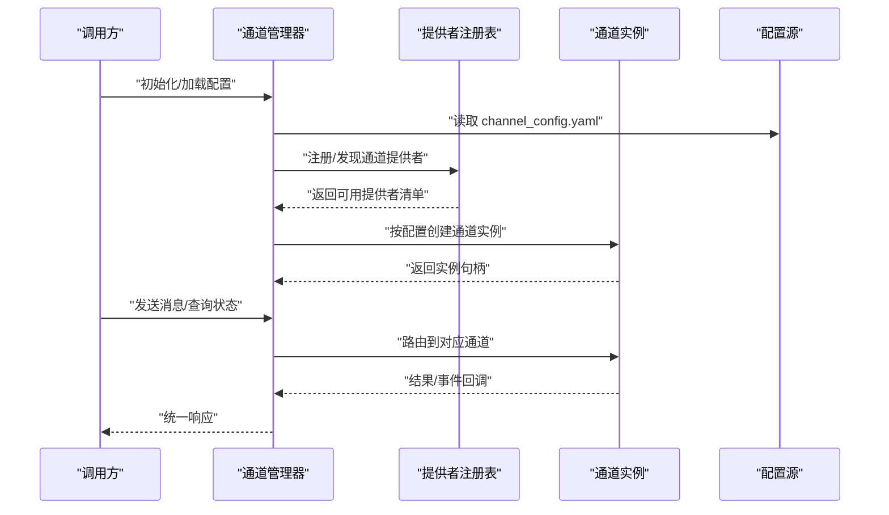
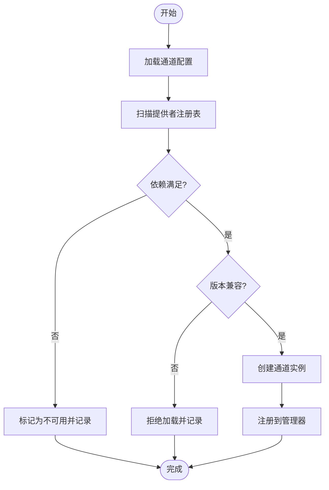
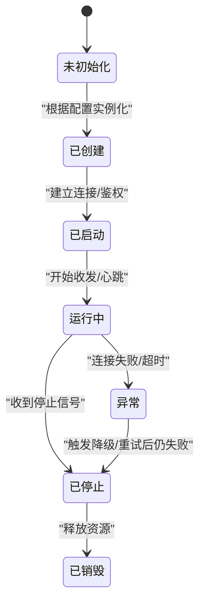
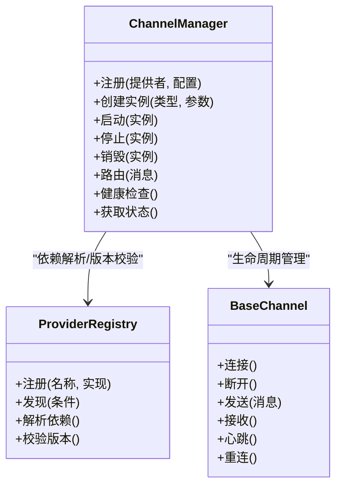
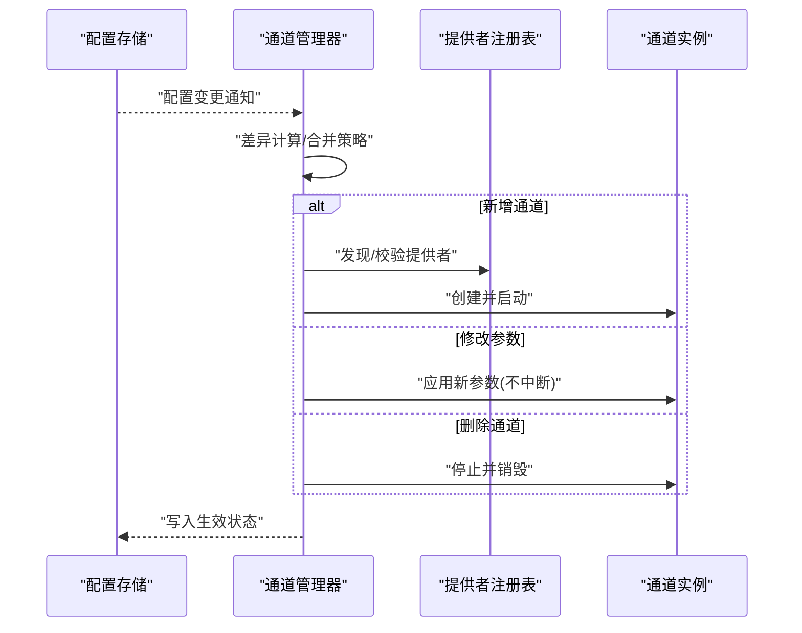
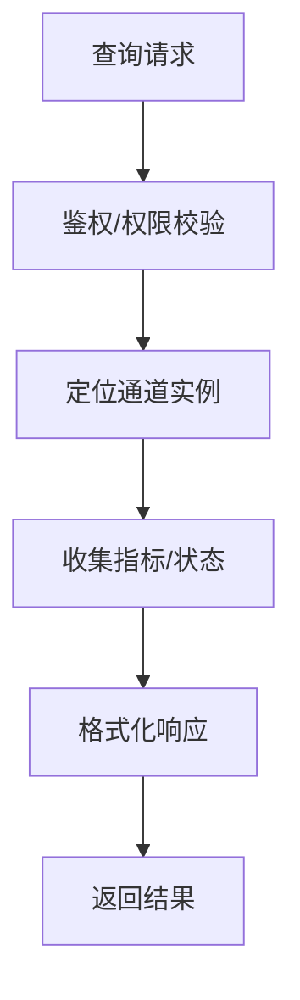
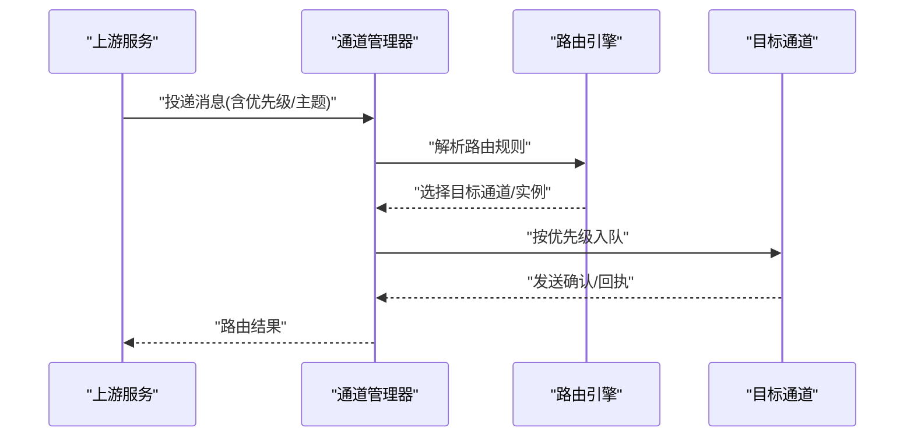
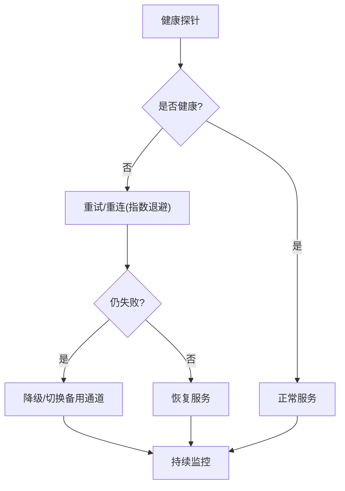
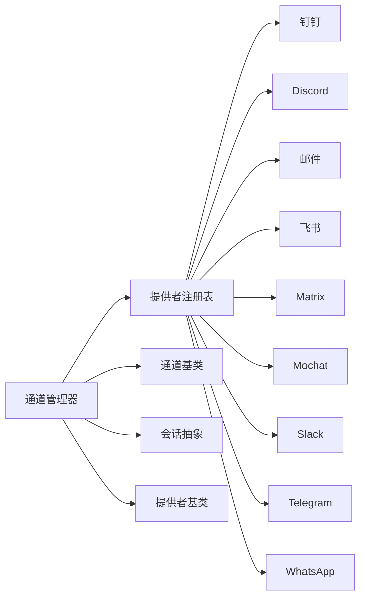

# 通道管理器

<cite>
**本文引用的文件**   
- [opc/channels/manager.py](file://opc/channels/manager.py)
- [opc/channels/base.py](file://opc/channels/base.py)
- [opc/channels/provider_registry.py](file://opc/channels/provider_registry.py)
- [opc/channels/session.py](file://opc/channels/session.py)
- [config/channel_config.yaml](file://config/channel_config.yaml)
- [opc/core/config.py](file://opc/core/config.py)
- [opc/channels/dingtalk.py](file://opc/channels/dingtalk.py)
- [opc/channels/discord.py](file://opc/channels/discord.py)
- [opc/channels/email.py](file://opc/channels/email.py)
- [opc/channels/feishu.py](file://opc/channels/feishu.py)
- [opc/channels/matrix.py](file://opc/channels/matrix.py)
- [opc/channels/mochat.py](file://opc/channels/mochat.py)
- [opc/channels/slack.py](file://opc/channels/slack.py)
- [opc/channels/telegram.py](file://opc/channels/telegram.py)
- [opc/channels/whatsapp.py](file://opc/channels/whatsapp.py)
- [opc/channels/__init__.py](file://opc/channels/__init__.py)
- [opc/channels/provider_base.py](file://opc/channels/provider_base.py)
</cite>

## 目录
1. [简介](#简介)
2. [项目结构](#项目结构)
3. [核心组件](#核心组件)
4. [架构总览](#架构总览)
5. [详细组件分析](#详细组件分析)
6. [依赖关系分析](#依赖关系分析)
7. [性能考量](#性能考量)
8. [故障排查指南](#故障排查指南)
9. [结论](#结论)
10. [附录](#附录)

## 简介
本技术文档聚焦于 OpenOPC 的“通道管理器”，围绕以下目标展开：
- 通道注册机制：动态加载、依赖解析与版本兼容性检查
- 通道实例生命周期：创建、启动、停止与销毁
- 并发处理、负载均衡与故障转移策略
- 配置热重载与动态更新
- 监控与状态查询接口
- 通道间通信协议、消息路由规则与优先级处理
- 健康检查、自动恢复与降级策略
- 调试工具与性能分析方法

## 项目结构
通道子系统位于 opc/channels 目录下，采用“基类 + 提供者实现 + 注册表 + 管理器”的分层组织方式。配置文件集中于 config/channel_config.yaml，并通过 core.config 统一加载。

图表来源
- [opc/channels/manager.py](file://opc/channels/manager.py)
- [opc/channels/base.py](file://opc/channels/base.py)
- [opc/channels/provider_registry.py](file://opc/channels/provider_registry.py)
- [opc/channels/session.py](file://opc/channels/session.py)
- [opc/channels/provider_base.py](file://opc/channels/provider_base.py)
- [config/channel_config.yaml](file://config/channel_config.yaml)
- [opc/core/config.py](file://opc/core/config.py)
- [opc/channels/dingtalk.py](file://opc/channels/dingtalk.py)
- [opc/channels/discord.py](file://opc/channels/discord.py)
- [opc/channels/email.py](file://opc/channels/email.py)
- [opc/channels/feishu.py](file://opc/channels/feishu.py)
- [opc/channels/matrix.py](file://opc/channels/matrix.py)
- [opc/channels/mochat.py](file://opc/channels/mochat.py)
- [opc/channels/slack.py](file://opc/channels/slack.py)
- [opc/channels/telegram.py](file://opc/channels/telegram.py)
- [opc/channels/whatsapp.py](file://opc/channels/whatsapp.py)

章节来源
- [opc/channels/manager.py](file://opc/channels/manager.py)
- [opc/channels/base.py](file://opc/channels/base.py)
- [opc/channels/provider_registry.py](file://opc/channels/provider_registry.py)
- [opc/channels/session.py](file://opc/channels/session.py)
- [config/channel_config.yaml](file://config/channel_config.yaml)
- [opc/core/config.py](file://opc/core/config.py)

## 核心组件
- 通道管理器（ChannelManager）
  - 职责：集中管理通道的注册、发现、生命周期、路由、监控与配置热更新。
  - 关键能力：动态加载通道提供者、解析依赖、校验版本兼容、维护多实例并发、提供健康检查与状态查询。
- 通道基类（BaseChannel）
  - 职责：定义通道通用接口与默认行为，包括连接、发送、接收、心跳、重连等。
- 提供者注册表（ProviderRegistry）
  - 职责：维护通道类型到具体实现的映射，支持按名称或元数据查找，并参与依赖与版本约束解析。
- 会话抽象（Session）
  - 职责：封装一次对话上下文，承载消息序列、状态与生命周期钩子。
- 提供者基类（ProviderBase）
  - 职责：为各平台通道提供统一的接入骨架，如鉴权、重试、限流、错误码映射等。

章节来源
- [opc/channels/manager.py](file://opc/channels/manager.py)
- [opc/channels/base.py](file://opc/channels/base.py)
- [opc/channels/provider_registry.py](file://opc/channels/provider_registry.py)
- [opc/channels/session.py](file://opc/channels/session.py)
- [opc/channels/provider_base.py](file://opc/channels/provider_base.py)

## 架构总览
通道管理器作为编排中心，向上暴露统一 API，向下通过注册表动态装配不同平台的通道实现。配置由外部 YAML 驱动，运行时可热更新。

图表来源
- [opc/channels/manager.py](file://opc/channels/manager.py)
- [opc/channels/provider_registry.py](file://opc/channels/provider_registry.py)
- [config/channel_config.yaml](file://config/channel_config.yaml)

## 详细组件分析

### 通道注册机制（动态加载、依赖解析、版本兼容）
- 动态加载
  - 管理器在启动时扫描已注册的通道提供者，依据配置项按需实例化。
  - 提供者通过注册表以“名称 -> 实现类”的方式被发现，避免硬编码耦合。
- 依赖解析
  - 每个通道可能声明其运行依赖（例如第三方库、网络可达性、凭据）。
  - 注册表在实例化前进行依赖检查，缺失则跳过或标记不可用。
- 版本兼容性
  - 通道提供者可声明支持的最低/最高版本范围。
  - 管理器在加载阶段对比当前环境版本，不满足则拒绝加载并记录告警。

图表来源
- [opc/channels/manager.py](file://opc/channels/manager.py)
- [opc/channels/provider_registry.py](file://opc/channels/provider_registry.py)

章节来源
- [opc/channels/manager.py](file://opc/channels/manager.py)
- [opc/channels/provider_registry.py](file://opc/channels/provider_registry.py)

### 通道实例生命周期（创建、启动、停止、销毁）
- 创建
  - 基于配置项生成实例参数，调用提供者工厂创建对象。
- 启动
  - 建立底层连接（如 WebSocket/HTTP/SMTP），执行鉴权与握手，预热必要资源。
- 运行
  - 处理入站消息、出站发送、心跳保活、断线重连。
- 停止
  - 优雅关闭连接，清理定时器与队列，释放资源。
- 销毁
  - 解除引用，回收内存，确保无后台任务泄漏。

图表来源
- [opc/channels/manager.py](file://opc/channels/manager.py)
- [opc/channels/base.py](file://opc/channels/base.py)

章节来源
- [opc/channels/manager.py](file://opc/channels/manager.py)
- [opc/channels/base.py](file://opc/channels/base.py)

### 多通道并发、负载均衡与故障转移
- 并发模型
  - 每个通道实例独立运行，内部使用异步 I/O 与线程隔离，避免相互阻塞。
- 负载均衡
  - 对同一类型的多个通道实例，管理器可按权重或最小活跃数进行分发。
- 故障转移
  - 当主通道不可用时，自动切换到备用通道；切换过程保持会话连续性。

图表来源
- [opc/channels/manager.py](file://opc/channels/manager.py)
- [opc/channels/base.py](file://opc/channels/base.py)
- [opc/channels/provider_registry.py](file://opc/channels/provider_registry.py)

章节来源
- [opc/channels/manager.py](file://opc/channels/manager.py)
- [opc/channels/base.py](file://opc/channels/base.py)
- [opc/channels/provider_registry.py](file://opc/channels/provider_registry.py)

### 配置热重载与动态更新
- 热重载流程
  - 监听配置变更事件，增量合并新配置，仅重启受影响通道。
  - 对新增通道立即加载，对删除通道安全销毁。
- 动态更新
  - 运行时调整权重、超时、重试次数等参数，无需重启进程。

图表来源
- [opc/channels/manager.py](file://opc/channels/manager.py)
- [config/channel_config.yaml](file://config/channel_config.yaml)

章节来源
- [opc/channels/manager.py](file://opc/channels/manager.py)
- [config/channel_config.yaml](file://config/channel_config.yaml)

### 监控与状态查询接口
- 健康检查
  - 周期性探测连接、延迟、错误率，输出健康指标。
- 状态查询
  - 返回通道列表、实例状态、最近事件、队列长度、吞吐等。
- 告警与审计
  - 对异常事件与切换动作进行记录，便于追踪。

图表来源
- [opc/channels/manager.py](file://opc/channels/manager.py)

章节来源
- [opc/channels/manager.py](file://opc/channels/manager.py)

### 通道间通信协议、消息路由与优先级
- 通信协议
  - 通道间通过统一的消息信封传递，包含来源、目标、主题、优先级、时间戳与负载。
- 路由规则
  - 基于主题匹配、标签过滤与目标通道类型进行转发。
- 优先级处理
  - 高优先级消息优先调度，必要时抢占低优先级队列资源。

图表来源
- [opc/channels/manager.py](file://opc/channels/manager.py)

章节来源
- [opc/channels/manager.py](file://opc/channels/manager.py)

### 健康检查、自动恢复与降级策略
- 健康检查
  - 心跳探针、连接存活检测、业务级可用性探测。
- 自动恢复
  - 指数退避重连、熔断保护、快速失败与回退路径。
- 降级策略
  - 在部分功能不可用时启用简化模式（如纯文本、降低频率）。

图表来源
- [opc/channels/manager.py](file://opc/channels/manager.py)
- [opc/channels/base.py](file://opc/channels/base.py)

章节来源
- [opc/channels/manager.py](file://opc/channels/manager.py)
- [opc/channels/base.py](file://opc/channels/base.py)

### 调试工具与性能分析技巧
- 调试建议
  - 开启详细日志级别，关注连接、认证、重试、路由与切换事件。
  - 使用状态查询接口观察队列积压与吞吐变化。
- 性能分析
  - 识别热点通道与瓶颈环节（网络、序列化、下游限流）。
  - 调整并发度、批大小与超时参数，结合压测验证效果。

章节来源
- [opc/channels/manager.py](file://opc/channels/manager.py)

## 依赖关系分析
通道子系统内部依赖清晰：管理器依赖注册表与基类，具体通道实现遵循提供者基类约定。

图表来源
- [opc/channels/manager.py](file://opc/channels/manager.py)
- [opc/channels/provider_registry.py](file://opc/channels/provider_registry.py)
- [opc/channels/base.py](file://opc/channels/base.py)
- [opc/channels/session.py](file://opc/channels/session.py)
- [opc/channels/provider_base.py](file://opc/channels/provider_base.py)
- [opc/channels/dingtalk.py](file://opc/channels/dingtalk.py)
- [opc/channels/discord.py](file://opc/channels/discord.py)
- [opc/channels/email.py](file://opc/channels/email.py)
- [opc/channels/feishu.py](file://opc/channels/feishu.py)
- [opc/channels/matrix.py](file://opc/channels/matrix.py)
- [opc/channels/mochat.py](file://opc/channels/mochat.py)
- [opc/channels/slack.py](file://opc/channels/slack.py)
- [opc/channels/telegram.py](file://opc/channels/telegram.py)
- [opc/channels/whatsapp.py](file://opc/channels/whatsapp.py)

章节来源
- [opc/channels/manager.py](file://opc/channels/manager.py)
- [opc/channels/provider_registry.py](file://opc/channels/provider_registry.py)
- [opc/channels/base.py](file://opc/channels/base.py)
- [opc/channels/session.py](file://opc/channels/session.py)
- [opc/channels/provider_base.py](file://opc/channels/provider_base.py)
- [opc/channels/dingtalk.py](file://opc/channels/dingtalk.py)
- [opc/channels/discord.py](file://opc/channels/discord.py)
- [opc/channels/email.py](file://opc/channels/email.py)
- [opc/channels/feishu.py](file://opc/channels/feishu.py)
- [opc/channels/matrix.py](file://opc/channels/matrix.py)
- [opc/channels/mochat.py](file://opc/channels/mochat.py)
- [opc/channels/slack.py](file://opc/channels/slack.py)
- [opc/channels/telegram.py](file://opc/channels/telegram.py)
- [opc/channels/whatsapp.py](file://opc/channels/whatsapp.py)

## 性能考量
- 连接复用与池化：减少频繁建链开销。
- 批量发送与压缩：提升吞吐，降低带宽占用。
- 背压与限流：防止下游过载导致雪崩。
- 超时与重试：合理设置退避策略，避免放大抖动。
- 资源隔离：按通道划分线程/协程池，避免互相影响。

[本节为通用指导，不涉及具体文件分析]

## 故障排查指南
- 常见问题
  - 通道无法启动：检查依赖是否满足、版本是否兼容、凭据是否正确。
  - 频繁切换：关注健康探针阈值与重试策略，避免震荡。
  - 消息丢失：核对路由规则与优先级队列，确认消费者消费能力。
- 定位方法
  - 查看健康检查与状态查询结果，定位异常通道。
  - 打开详细日志，跟踪连接、认证、重试与切换事件。
  - 使用压测脚本模拟峰值流量，复现问题边界。

章节来源
- [opc/channels/manager.py](file://opc/channels/manager.py)

## 结论
通道管理器通过“注册表 + 基类 + 管理器”的解耦设计，实现了多通道统一接入、动态装配与稳定运行。配合配置热重载、健康检查与降级策略，系统具备较强的弹性与可观测性。建议在上线前完善监控指标与告警规则，并在生产环境中进行充分的容量与稳定性测试。

[本节为总结性内容，不涉及具体文件分析]

## 附录
- 相关入口与初始化
  - 通道模块初始化与导出入口参考：[opc/channels/__init__.py](file://opc/channels/__init__.py)
- 配置示例
  - 通道配置模板与字段说明参考：[config/channel_config.yaml](file://config/channel_config.yaml)
- 配置加载
  - 配置加载与合并逻辑参考：[opc/core/config.py](file://opc/core/config.py)

章节来源
- [opc/channels/__init__.py](file://opc/channels/__init__.py)
- [config/channel_config.yaml](file://config/channel_config.yaml)
- [opc/core/config.py](file://opc/core/config.py)