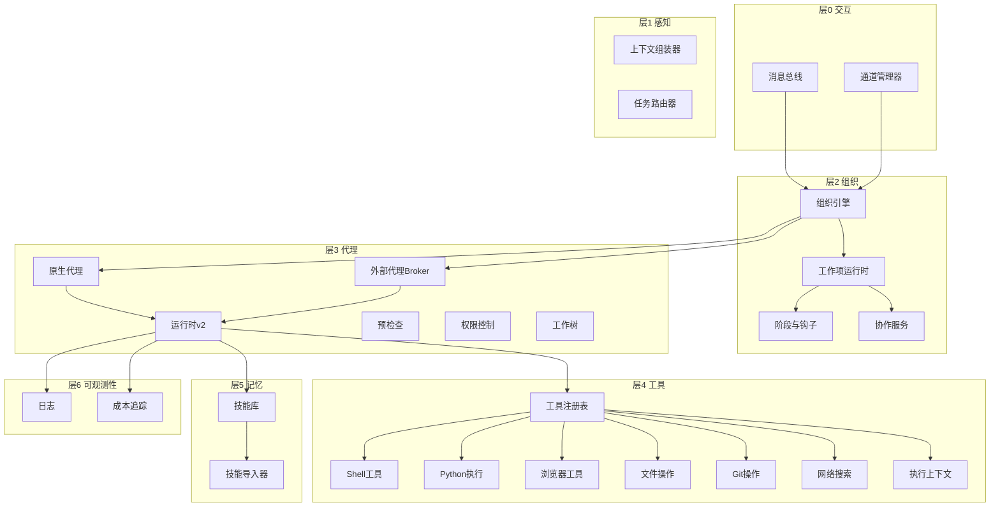
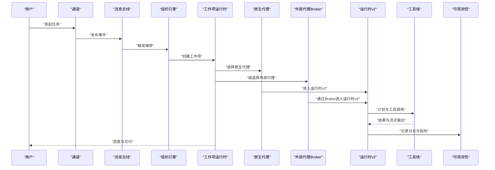
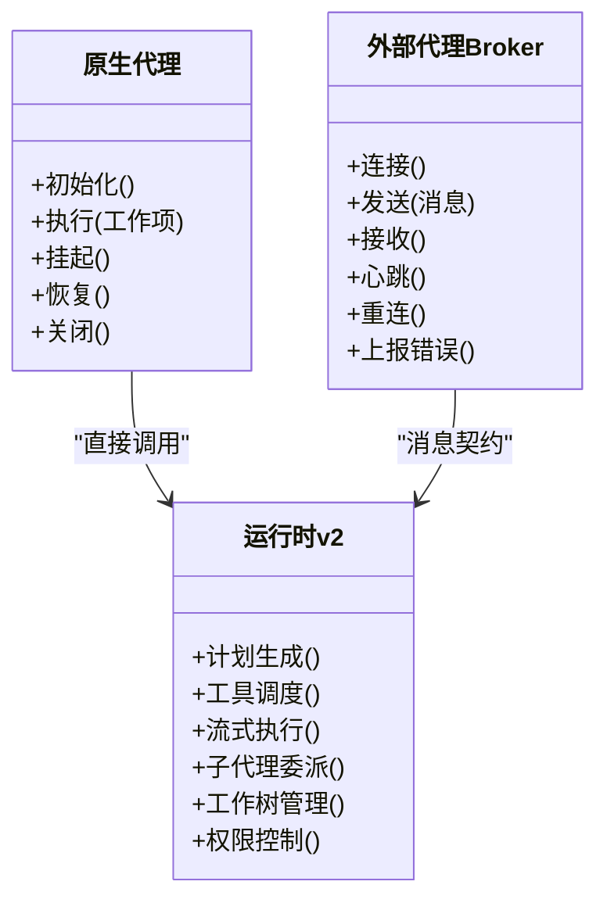
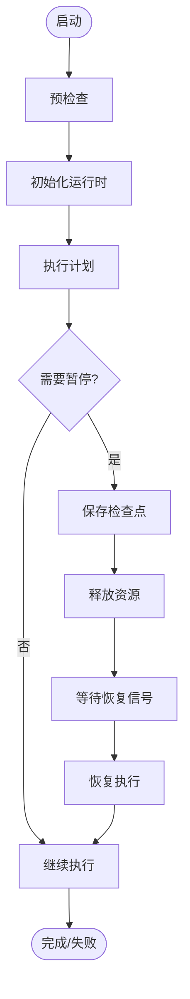
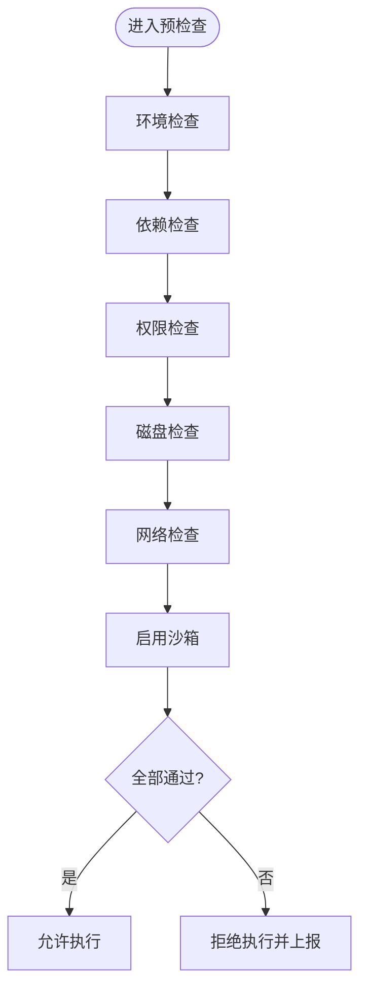
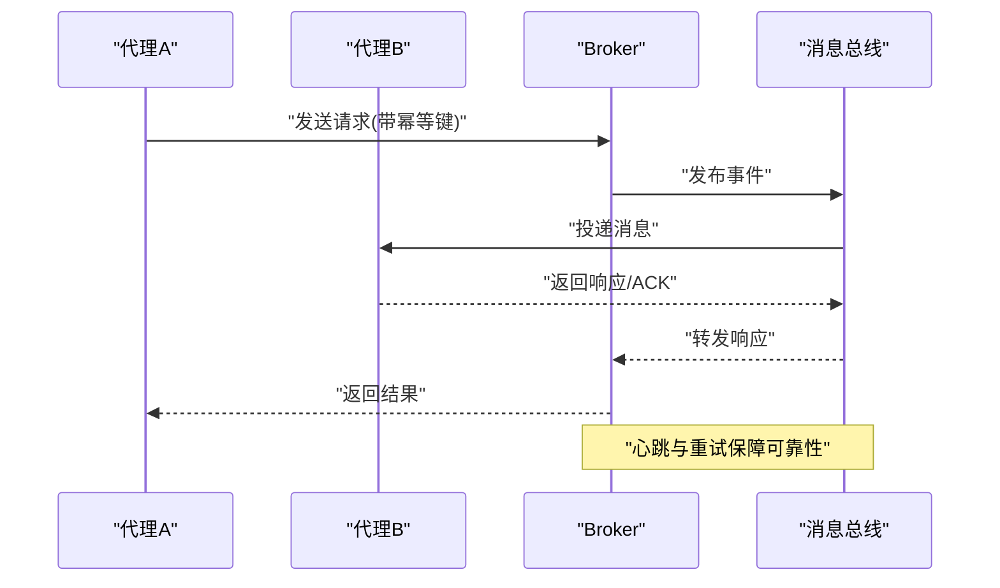
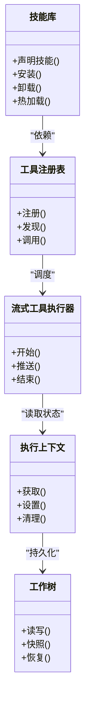
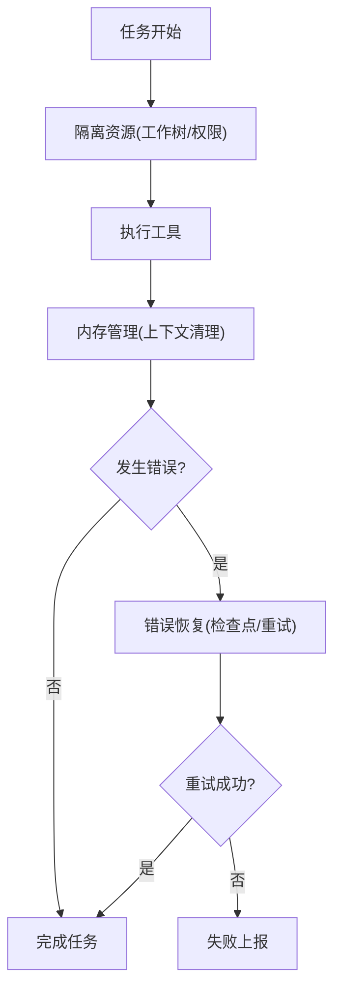
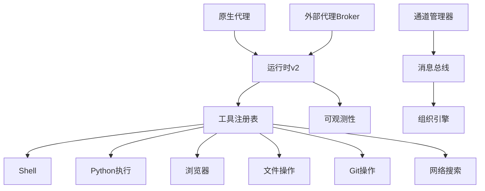

# 代理运行时

<cite>
**本文引用的文件**   
- [opc/layer3_agent/native_agent.py](file://opc/layer3_agent/native_agent.py)
- [opc/layer3_agent/external_broker.py](file://opc/layer3_agent/external_broker.py)
- [opc/layer3_agent/preflight.py](file://opc/layer3_agent/preflight.py)
- [opc/layer3_agent/runtime_v2/runtime.py](file://opc/layer3_agent/runtime_v2/runtime.py)
- [opc/layer3_agent/runtime_v2/tool_hooks.py](file://opc/layer3_agent/runtime_v2/tool_hooks.py)
- [opc/layer3_agent/runtime_v2/streaming_tool_executor.py](file://opc/layer3_agent/runtime_v2/streaming_tool_executor.py)
- [opc/layer3_agent/runtime_v2/subagents.py](file://opc/layer3_agent/runtime_v2/subagents.py)
- [opc/layer3_agent/runtime_v2/worktree.py](file://opc/layer3_agent/runtime_v2/worktree.py)
- [opc/layer3_agent/runtime_v2/permissions.py](file://opc/layer3_agent/runtime_v2/permissions.py)
- [opc/layer4_tools/agent_runtime.py](file://opc/layer4_tools/agent_runtime.py)
- [opc/layer4_tools/execution_context.py](file://opc/layer4_tools/execution_context.py)
- [opc/layer4_tools/shell.py](file://opc/layer4_tools/shell.py)
- [opc/layer4_tools/python_exec.py](file://opc/layer4_tools/python_exec.py)
- [opc/layer4_tools/browser.py](file://opc/layer4_tools/browser.py)
- [opc/layer4_tools/file_ops.py](file://opc/layer4_tools/file_ops.py)
- [opc/layer4_tools/git_ops.py](file://opc/layer4_tools/git_ops.py)
- [opc/layer4_tools/web_search.py](file://opc/layer4_tools/web_search.py)
- [opc/layer4_tools/collaboration.py](file://opc/layer4_tools/collaboration.py)
- [opc/layer4_tools/collaboration_rpc.py](file://opc/layer4_tools/collaboration_rpc.py)
- [opc/layer4_tools/registry.py](file://opc/layer4_tools/registry.py)
- [opc/layer5_memory/skill_library.py](file://opc/layer5_memory/skill_library.py)
- [opc/layer5_memory/skill_importer.py](file://opc/layer5_memory/skill_importer.py)
- [opc/market/sandbox_checker.py](file://opc/market/sandbox_checker.py)
- [opc/core/config.py](file://opc/core/config.py)
- [opc/core/events.py](file://opc/core/events.py)
- [opc/layer6_observability/opc_logger.py](file://opc/layer6_observability/opc_logger.py)
- [opc/layer6_observability/cost_tracker.py](file://opc/layer6_observability/cost_tracker.py)
- [opc/channels/manager.py](file://opc/channels/manager.py)
- [opc/cli/app.py](file://opc/cli/app.py)
- [opc/engine.py](file://opc/engine.py)
</cite>

## 目录
1. [简介](#简介)
2. [项目结构](#项目结构)
3. [核心组件](#核心组件)
4. [架构总览](#架构总览)
5. [详细组件分析](#详细组件分析)
6. [依赖关系分析](#依赖关系分析)
7. [性能考量](#性能考量)
8. [故障排查指南](#故障排查指南)
9. [结论](#结论)
10. [附录](#附录)

## 简介
本文件面向OpenOPC代理运行时的开发者与运维人员，系统性阐述原生代理与外部代理的架构差异、集成方式、生命周期管理（启动、执行、暂停与恢复）、预检查与安全沙箱、代理间通信协议与消息传递机制、技能定义与工具调用、状态管理、资源隔离与内存管理、错误恢复策略，以及性能监控与调试方法。文档同时提供常见问题排查与解决方案，帮助读者快速定位并解决问题。

## 项目结构
OpenOPC采用分层架构，围绕“感知-组织-代理-工具-记忆-可观测性”展开：
- 层0交互：消息总线与通道桥接
- 层1感知：上下文组装、任务路由
- 层2组织：公司模式、工作项编排、阶段与钩子、协作与审批
- 层3代理：原生代理与外部代理、运行时v2、预检查、会话身份
- 层4工具：文件系统、Shell、Python执行、浏览器、搜索、协作等
- 层5记忆：技能库、导入器、历史压缩、偏好等
- 层6可观测性：日志、成本追踪

图表来源
- [opc/engine.py:1-200](file://opc/engine.py#L1-L200)
- [opc/channels/manager.py:1-200](file://opc/channels/manager.py#L1-L200)
- [opc/layer3_agent/native_agent.py:1-200](file://opc/layer3_agent/native_agent.py#L1-L200)
- [opc/layer3_agent/external_broker.py:1-200](file://opc/layer3_agent/external_broker.py#L1-L200)
- [opc/layer3_agent/runtime_v2/runtime.py:1-200](file://opc/layer3_agent/runtime_v2/runtime.py#L1-L200)
- [opc/layer4_tools/registry.py:1-200](file://opc/layer4_tools/registry.py#L1-L200)
- [opc/layer5_memory/skill_library.py:1-200](file://opc/layer5_memory/skill_library.py#L1-L200)
- [opc/layer6_observability/opc_logger.py:1-200](file://opc/layer6_observability/opc_logger.py#L1-L200)

章节来源
- [opc/engine.py:1-200](file://opc/engine.py#L1-L200)
- [opc/channels/manager.py:1-200](file://opc/channels/manager.py#L1-L200)
- [opc/layer3_agent/native_agent.py:1-200](file://opc/layer3_agent/native_agent.py#L1-L200)
- [opc/layer3_agent/external_broker.py:1-200](file://opc/layer3_agent/external_broker.py#L1-L200)
- [opc/layer3_agent/runtime_v2/runtime.py:1-200](file://opc/layer3_agent/runtime_v2/runtime.py#L1-L200)
- [opc/layer4_tools/registry.py:1-200](file://opc/layer4_tools/registry.py#L1-L200)
- [opc/layer5_memory/skill_library.py:1-200](file://opc/layer5_memory/skill_library.py#L1-L200)
- [opc/layer6_observability/opc_logger.py:1-200](file://opc/layer6_observability/opc_logger.py#L1-L200)

## 核心组件
- 原生代理：在进程内直接由运行时v2驱动，具备完整的工具栈、沙箱与权限控制，适合高内聚、强一致性的任务执行。
- 外部代理：通过Broker以进程外或跨语言方式接入，遵循统一的消息契约，支持异构环境部署与弹性扩展。
- 运行时v2：负责计划生成、工具调度、流式工具执行、子代理委派、工作树管理与持久化。
- 预检查与安全沙箱：在任务进入执行前进行环境与能力校验，结合权限控制与工作树隔离，降低风险面。
- 工具栈：文件、Shell、Python执行、浏览器、搜索、协作等，均通过注册表统一管理，支持动态发现与版本兼容。
- 记忆与技能：技能库与导入器提供技能声明、安装与热加载；记忆层提供历史压缩与偏好存储。
- 可观测性：结构化日志与成本追踪贯穿代理生命周期，便于问题定位与容量规划。

章节来源
- [opc/layer3_agent/native_agent.py:1-200](file://opc/layer3_agent/native_agent.py#L1-L200)
- [opc/layer3_agent/external_broker.py:1-200](file://opc/layer3_agent/external_broker.py#L1-L200)
- [opc/layer3_agent/runtime_v2/runtime.py:1-200](file://opc/layer3_agent/runtime_v2/runtime.py#L1-L200)
- [opc/layer3_agent/preflight.py:1-200](file://opc/layer3_agent/preflight.py#L1-L200)
- [opc/layer4_tools/registry.py:1-200](file://opc/layer4_tools/registry.py#L1-L200)
- [opc/layer5_memory/skill_library.py:1-200](file://opc/layer5_memory/skill_library.py#L1-L200)
- [opc/layer6_observability/opc_logger.py:1-200](file://opc/layer6_observability/opc_logger.py#L1-L200)

## 架构总览
下图展示原生与外部代理在组织编排中的角色与交互路径，包括通道、消息总线、工作项运行时、代理运行时与工具栈的协作关系。

图表来源
- [opc/channels/manager.py:1-200](file://opc/channels/manager.py#L1-L200)
- [opc/layer3_agent/native_agent.py:1-200](file://opc/layer3_agent/native_agent.py#L1-L200)
- [opc/layer3_agent/external_broker.py:1-200](file://opc/layer3_agent/external_broker.py#L1-L200)
- [opc/layer3_agent/runtime_v2/runtime.py:1-200](file://opc/layer3_agent/runtime_v2/runtime.py#L1-L200)
- [opc/layer4_tools/registry.py:1-200](file://opc/layer4_tools/registry.py#L1-L200)
- [opc/layer6_observability/opc_logger.py:1-200](file://opc/layer6_observability/opc_logger.py#L1-L200)

## 详细组件分析

### 原生代理与外部代理的差异与集成
- 原生代理
  - 进程内执行，低延迟，可直接访问运行时v2的全部能力。
  - 与工具栈共享进程空间，便于调试与性能优化。
  - 通过运行时v2进行计划、工具调度与子代理委派。
- 外部代理
  - 进程外或跨语言实现，通过Broker进行消息契约交互。
  - 支持异构部署与独立扩缩容，但需处理序列化、超时与重试。
  - Broker负责连接管理、心跳、重连与错误上报。

图表来源
- [opc/layer3_agent/native_agent.py:1-200](file://opc/layer3_agent/native_agent.py#L1-L200)
- [opc/layer3_agent/external_broker.py:1-200](file://opc/layer3_agent/external_broker.py#L1-L200)
- [opc/layer3_agent/runtime_v2/runtime.py:1-200](file://opc/layer3_agent/runtime_v2/runtime.py#L1-L200)

章节来源
- [opc/layer3_agent/native_agent.py:1-200](file://opc/layer3_agent/native_agent.py#L1-L200)
- [opc/layer3_agent/external_broker.py:1-200](file://opc/layer3_agent/external_broker.py#L1-L200)
- [opc/layer3_agent/runtime_v2/runtime.py:1-200](file://opc/layer3_agent/runtime_v2/runtime.py#L1-L200)

### 生命周期管理：启动、执行、暂停与恢复
- 启动
  - 配置加载与环境准备，预检查通过后创建运行时实例。
  - 原生代理直接初始化；外部代理Broker建立连接并注册能力。
- 执行
  - 工作项进入运行时v2，生成计划，按序或并行调用工具。
  - 流式工具执行支持增量输出与中间状态更新。
- 暂停
  - 保存检查点（工作树、上下文、工具状态），释放锁与资源。
  - 外部代理需持久化队列与心跳状态。
- 恢复
  - 从检查点重建上下文，恢复工具状态，继续执行。
  - 外部代理Broker检测断线后自动重连并回放未确认消息。

图表来源
- [opc/layer3_agent/preflight.py:1-200](file://opc/layer3_agent/preflight.py#L1-L200)
- [opc/layer3_agent/runtime_v2/runtime.py:1-200](file://opc/layer3_agent/runtime_v2/runtime.py#L1-L200)
- [opc/layer3_agent/runtime_v2/worktree.py:1-200](file://opc/layer3_agent/runtime_v2/worktree.py#L1-L200)
- [opc/layer3_agent/external_broker.py:1-200](file://opc/layer3_agent/external_broker.py#L1-L200)

章节来源
- [opc/layer3_agent/preflight.py:1-200](file://opc/layer3_agent/preflight.py#L1-L200)
- [opc/layer3_agent/runtime_v2/runtime.py:1-200](file://opc/layer3_agent/runtime_v2/runtime.py#L1-L200)
- [opc/layer3_agent/runtime_v2/worktree.py:1-200](file://opc/layer3_agent/runtime_v2/worktree.py#L1-L200)
- [opc/layer3_agent/external_broker.py:1-200](file://opc/layer3_agent/external_broker.py#L1-L200)

### 预检查机制与安全沙箱
- 预检查
  - 验证依赖、环境变量、权限、磁盘空间与网络可达性。
  - 对敏感工具（Shell、Python执行）进行白名单与参数校验。
- 安全沙箱
  - 基于权限控制限制系统调用与文件访问范围。
  - 工作树隔离确保每个任务拥有独立的工作目录与临时空间。
  - 外部代理通过Broker强制最小权限原则与消息签名校验。

图表来源
- [opc/layer3_agent/preflight.py:1-200](file://opc/layer3_agent/preflight.py#L1-L200)
- [opc/layer3_agent/runtime_v2/permissions.py:1-200](file://opc/layer3_agent/runtime_v2/permissions.py#L1-L200)
- [opc/layer3_agent/runtime_v2/worktree.py:1-200](file://opc/layer3_agent/runtime_v2/worktree.py#L1-L200)
- [opc/market/sandbox_checker.py:1-200](file://opc/market/sandbox_checker.py#L1-200)

章节来源
- [opc/layer3_agent/preflight.py:1-200](file://opc/layer3_agent/preflight.py#L1-L200)
- [opc/layer3_agent/runtime_v2/permissions.py:1-200](file://opc/layer3_agent/runtime_v2/permissions.py#L1-L200)
- [opc/layer3_agent/runtime_v2/worktree.py:1-200](file://opc/layer3_agent/runtime_v2/worktree.py#L1-L200)
- [opc/market/sandbox_checker.py:1-200](file://opc/market/sandbox_checker.py#L1-200)

### 代理间通信协议与消息传递机制
- 协议要点
  - 统一消息模型：包含类型、标识、负载、时间戳与签名。
  - 可靠传输：ACK/NACK、重试与幂等键保证一致性。
  - 心跳与保活：定期心跳检测，异常时触发重连与降级。
- 消息流转
  - 外部代理Broker负责编解码、路由与错误上报。
  - 内部使用事件总线分发，订阅者按需消费。

图表来源
- [opc/layer3_agent/external_broker.py:1-200](file://opc/layer3_agent/external_broker.py#L1-200)
- [opc/core/events.py:1-200](file://opc/core/events.py#L1-200)

章节来源
- [opc/layer3_agent/external_broker.py:1-200](file://opc/layer3_agent/external_broker.py#L1-200)
- [opc/core/events.py:1-200](file://opc/core/events.py#L1-200)

### 代理开发指南：技能定义、工具调用与状态管理
- 技能定义
  - 在技能库中声明能力、输入输出契约与依赖。
  - 使用导入器进行安装与热加载，支持版本回滚。
- 工具调用
  - 通过注册表发现与调用工具，支持同步与异步模式。
  - 流式工具执行器支持增量输出与中间状态推送。
- 状态管理
  - 使用执行上下文维护会话级状态与临时数据。
  - 工作树提供持久化的文件与工件管理。

图表来源
- [opc/layer5_memory/skill_library.py:1-200](file://opc/layer5_memory/skill_library.py#L1-200)
- [opc/layer5_memory/skill_importer.py:1-200](file://opc/layer5_memory/skill_importer.py#L1-200)
- [opc/layer4_tools/registry.py:1-200](file://opc/layer4_tools/registry.py#L1-200)
- [opc/layer3_agent/runtime_v2/streaming_tool_executor.py:1-200](file://opc/layer3_agent/runtime_v2/streaming_tool_executor.py#L1-200)
- [opc/layer4_tools/execution_context.py:1-200](file://opc/layer4_tools/execution_context.py#L1-200)
- [opc/layer3_agent/runtime_v2/worktree.py:1-200](file://opc/layer3_agent/runtime_v2/worktree.py#L1-200)

章节来源
- [opc/layer5_memory/skill_library.py:1-200](file://opc/layer5_memory/skill_library.py#L1-200)
- [opc/layer5_memory/skill_importer.py:1-200](file://opc/layer5_memory/skill_importer.py#L1-200)
- [opc/layer4_tools/registry.py:1-200](file://opc/layer4_tools/registry.py#L1-200)
- [opc/layer3_agent/runtime_v2/streaming_toolexecutor.py:1-200](file://opc/layer3_agent/runtime_v2/streaming_tool_executor.py#L1-200)
- [opc/layer4_tools/execution_context.py:1-200](file://opc/layer4_tools/execution_context.py#L1-200)
- [opc/layer3_agent/runtime_v2/worktree.py:1-200](file://opc/layer3_agent/runtime_v2/worktree.py#L1-200)

### 资源隔离、内存管理与错误恢复策略
- 资源隔离
  - 工作树为每个任务提供独立目录，避免文件冲突。
  - 权限控制限制系统调用与外部资源访问。
- 内存管理
  - 执行上下文在任务完成后清理，防止泄漏。
  - 历史记录压缩减少上下文窗口占用。
- 错误恢复
  - 检查点与快照用于中断恢复。
  - 外部代理Broker支持重试与降级策略。

图表来源
- [opc/layer3_agent/runtime_v2/worktree.py:1-200](file://opc/layer3_agent/runtime_v2/worktree.py#L1-200)
- [opc/layer3_agent/runtime_v2/permissions.py:1-200](file://opc/layer3_agent/runtime_v2/permissions.py#L1-200)
- [opc/layer4_tools/execution_context.py:1-200](file://opc/layer4_tools/execution_context.py#L1-200)
- [opc/layer3_agent/external_broker.py:1-200](file://opc/layer3_agent/external_broker.py#L1-200)

章节来源
- [opc/layer3_agent/runtime_v2/worktree.py:1-200](file://opc/layer3_agent/runtime_v2/worktree.py#L1-200)
- [opc/layer3_agent/runtime_v2/permissions.py:1-200](file://opc/layer3_agent/runtime_v2/permissions.py#L1-200)
- [opc/layer4_tools/execution_context.py:1-200](file://opc/layer4_tools/execution_context.py#L1-200)
- [opc/layer3_agent/external_broker.py:1-200](file://opc/layer3_agent/external_broker.py#L1-200)

### 工具栈详解
- Shell工具：受限命令执行，白名单与参数校验。
- Python执行：隔离解释器，限制模块导入与系统调用。
- 浏览器工具：无头浏览与页面交互，防注入与超时控制。
- 文件与Git操作：在工作树内进行变更，支持提交与回滚。
- 网络搜索：限频与缓存，避免重复请求。
- 协作工具：跨代理协作与任务委派。

章节来源
- [opc/layer4_tools/shell.py:1-200](file://opc/layer4_tools/shell.py#L1-200)
- [opc/layer4_tools/python_exec.py:1-200](file://opc/layer4_tools/python_exec.py#L1-200)
- [opc/layer4_tools/browser.py:1-200](file://opc/layer4_tools/browser.py#L1-200)
- [opc/layer4_tools/file_ops.py:1-200](file://opc/layer4_tools/file_ops.py#L1-200)
- [opc/layer4_tools/git_ops.py:1-200](file://opc/layer4_tools/git_ops.py#L1-200)
- [opc/layer4_tools/web_search.py:1-200](file://opc/layer4_tools/web_search.py#L1-200)
- [opc/layer4_tools/collaboration.py:1-200](file://opc/layer4_tools/collaboration.py#L1-200)

### 子代理委派与编排
- 运行时v2支持将复杂任务拆分为子任务，委派给子代理执行。
- 子代理继承父代理的权限与工作树上下文，确保一致性与安全性。
- 编排器协调子任务依赖与合并结果。

章节来源
- [opc/layer3_agent/runtime_v2/subagents.py:1-200](file://opc/layer3_agent/runtime_v2/subagents.py#L1-200)
- [opc/layer3_agent/runtime_v2/runtime.py:1-200](file://opc/layer3_agent/runtime_v2/runtime.py#L1-200)

### 工具钩子与流式执行
- 工具钩子：在执行前后插入自定义逻辑，如审计、限流与度量。
- 流式执行：支持长耗时任务的增量输出，提升用户体验与可观测性。

章节来源
- [opc/layer3_agent/runtime_v2/tool_hooks.py:1-200](file://opc/layer3_agent/runtime_v2/tool_hooks.py#L1-200)
- [opc/layer3_agent/runtime_v2/streaming_tool_executor.py:1-200](file://opc/layer3_agent/runtime_v2/streaming_tool_executor.py#L1-200)

## 依赖关系分析
- 组件耦合
  - 原生代理与运行时v2紧密耦合，外部代理通过Broker解耦。
  - 工具栈通过注册表松耦合，便于扩展与维护。
- 外部依赖
  - 通道管理器与消息总线提供事件驱动能力。
  - 可观测性组件贯穿全链路，提供日志与成本追踪。

图表来源
- [opc/layer3_agent/native_agent.py:1-200](file://opc/layer3_agent/native_agent.py#L1-200)
- [opc/layer3_agent/external_broker.py:1-200](file://opc/layer3_agent/external_broker.py#L1-200)
- [opc/layer3_agent/runtime_v2/runtime.py:1-200](file://opc/layer3_agent/runtime_v2/runtime.py#L1-200)
- [opc/layer4_tools/registry.py:1-200](file://opc/layer4_tools/registry.py#L1-200)
- [opc/channels/manager.py:1-200](file://opc/channels/manager.py#L1-200)
- [opc/layer6_observability/opc_logger.py:1-200](file://opc/layer6_observability/opc_logger.py#L1-200)

章节来源
- [opc/layer3_agent/native_agent.py:1-200](file://opc/layer3_agent/native_agent.py#L1-200)
- [opc/layer3_agent/external_broker.py:1-200](file://opc/layer3_agent/external_broker.py#L1-200)
- [opc/layer3_agent/runtime_v2/runtime.py:1-200](file://opc/layer3_agent/runtime_v2/runtime.py#L1-200)
- [opc/layer4_tools/registry.py:1-200](file://opc/layer4_tools/registry.py#L1-200)
- [opc/channels/manager.py:1-200](file://opc/channels/manager.py#L1-200)
- [opc/layer6_observability/opc_logger.py:1-200](file://opc/layer6_observability/opc_logger.py#L1-200)

## 性能考量
- 流式工具执行减少端到端延迟，提升交互体验。
- 工作树与上下文隔离避免竞争条件，提高并发稳定性。
- 历史记录压缩与偏好缓存降低上下文窗口压力。
- 外部代理Broker的重试与心跳机制保障高可用。
- 建议：合理设置超时与限流，监控关键指标（CPU、内存、I/O、网络）。

[本节为通用指导，不直接分析具体文件]

## 故障排查指南
- 常见问题
  - 外部代理断线：检查Broker心跳与重连逻辑，查看错误上报。
  - 工具执行失败：核对权限与工作树隔离，检查预检查结果。
  - 内存泄漏：确认执行上下文清理与工作树回收。
  - 性能瓶颈：分析流式执行与工具调用热点，调整并发与缓存策略。
- 调试工具
  - 结构化日志：定位关键路径与异常堆栈。
  - 成本追踪：评估工具调用与LLM使用成本。
  - CLI与UI：观察任务进度、工作项状态与协作面板。

章节来源
- [opc/layer3_agent/external_broker.py:1-200](file://opc/layer3_agent/external_broker.py#L1-200)
- [opc/layer3_agent/preflight.py:1-200](file://opc/layer3_agent/preflight.py#L1-200)
- [opc/layer4_tools/execution_context.py:1-200](file://opc/layer4_tools/execution_context.py#L1-200)
- [opc/layer6_observability/opc_logger.py:1-200](file://opc/layer6_observability/opc_logger.py#L1-200)
- [opc/layer6_observability/cost_tracker.py:1-200](file://opc/layer6_observability/cost_tracker.py#L1-200)
- [opc/cli/app.py:1-200](file://opc/cli/app.py#L1-200)

## 结论
OpenOPC代理运行时通过分层架构与模块化设计，实现了原生与外部代理的统一编排、严格的安全沙箱与可靠的通信机制。运行时v2提供了强大的计划与工具调度能力，配合技能系统与可观测性组件，形成可扩展、可观测、可恢复的企业级代理平台。遵循本文的开发指南与最佳实践，可高效构建稳定高效的代理应用。

[本节为总结性内容，不直接分析具体文件]

## 附录
- 配置参考
  - 系统配置、通道配置、LLM配置与代理配置位于config目录，可按需调整。
- 示例与测试
  - tests目录包含大量用例，覆盖代理生命周期、工具栈、协作与可观测性等场景。

章节来源
- [opc/core/config.py:1-200](file://opc/core/config.py#L1-200)
- [tests/test_native_runtime_v2.py:1-200](file://tests/test_native_runtime_v2.py#L1-200)
- [tests/test_external_agent_preflight.py:1-200](file://tests/test_external_agent_preflight.py#L1-200)
- [tests/test_external_agent_monitoring.py:1-200](file://tests/test_external_agent_monitoring.py#L1-200)