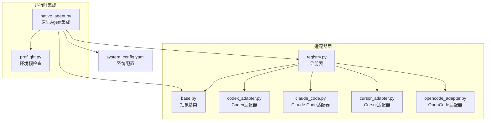
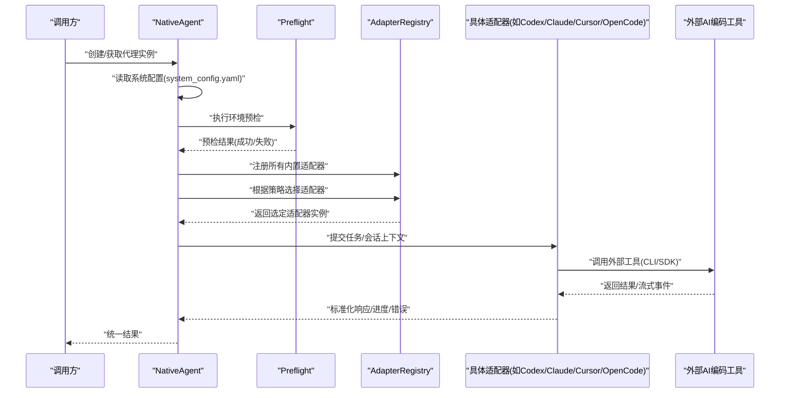
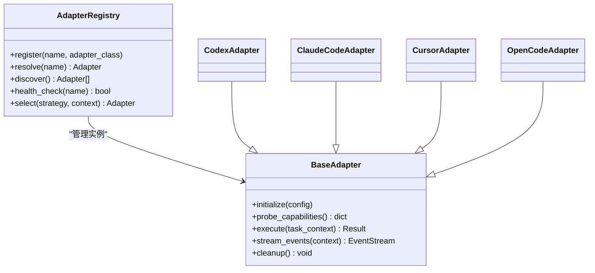
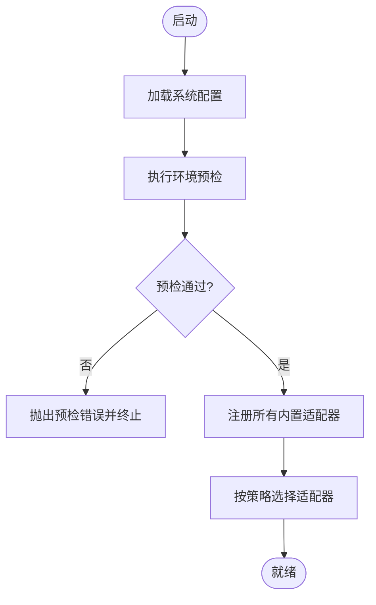
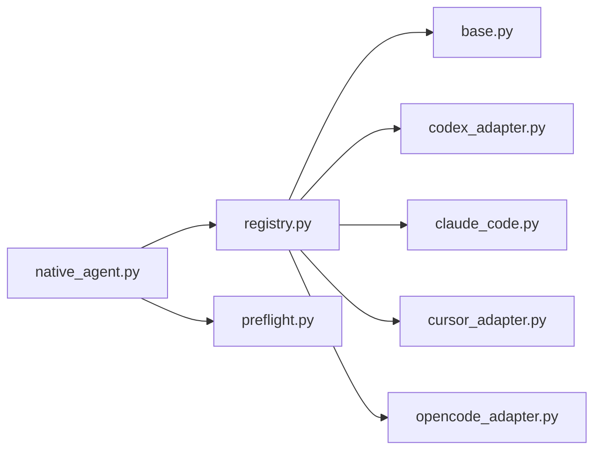

# 代理适配器

<cite>
**本文引用的文件**   
- [opc/layer3_agent/adapters/base.py](file://opc/layer3_agent/adapters/base.py)
- [opc/layer3_agent/adapters/registry.py](file://opc/layer3_agent/adapters/registry.py)
- [opc/layer3_agent/adapters/codex_adapter.py](file://opc/layer3_agent/adapters/codex_adapter.py)
- [opc/layer3_agent/adapters/claude_code.py](file://opc/layer3_agent/adapters/claude_code.py)
- [opc/layer3_agent/adapters/cursor_adapter.py](file://opc/layer3_agent/adapters/cursor_adapter.py)
- [opc/layer3_agent/adapters/opencode_adapter.py](file://opc/layer3_agent/adapters/opencode_adapter.py)
- [opc/layer3_agent/native_agent.py](file://opc/layer3_agent/native_agent.py)
- [opc/layer3_agent/preflight.py](file://opc/layer3_agent/preflight.py)
- [config/system_config.yaml](file://config/system_config.yaml)
- [tests/test_native_agent_integration.py](file://tests/test_native_agent_integration.py)
</cite>

## 目录
1. [简介](#简介)
2. [项目结构](#项目结构)
3. [核心组件](#核心组件)
4. [架构总览](#架构总览)
5. [详细组件分析](#详细组件分析)
6. [依赖关系分析](#依赖关系分析)
7. [性能考虑](#性能考虑)
8. [故障排查指南](#故障排查指南)
9. [结论](#结论)
10. [附录](#附录)

## 简介
本文件面向OpenOPC的“代理适配器”子系统，聚焦于通过适配器模式将多种主流AI编码工具（如Codex、Claude Code、Cursor、OpenCode等）统一接入OpenOPC的Agent运行时。文档涵盖：
- 适配器模式的设计理念与统一接口定义
- 内置适配器的实现要点与差异
- 适配器的注册机制与动态加载流程
- 自定义适配器开发指南（接口实现、配置管理、错误处理）
- 适配器选择策略与负载均衡机制
- 测试方法与性能调优建议
- 完整的开发示例与最佳实践

## 项目结构
与代理适配器相关的代码主要位于 layer3_agent/adapters 目录，并配合 native_agent 和 preflight 模块完成运行期集成与环境预检。配置项集中在 system_config.yaml。

图表来源
- [opc/layer3_agent/adapters/base.py](file://opc/layer3_agent/adapters/base.py)
- [opc/layer3_agent/adapters/registry.py](file://opc/layer3_agent/adapters/registry.py)
- [opc/layer3_agent/adapters/codex_adapter.py](file://opc/layer3_agent/adapters/codex_adapter.py)
- [opc/layer3_agent/adapters/claude_code.py](file://opc/layer3_agent/adapters/claude_code.py)
- [opc/layer3_agent/adapters/cursor_adapter.py](file://opc/layer3_agent/adapters/cursor_adapter.py)
- [opc/layer3_agent/adapters/opencode_adapter.py](file://opc/layer3_agent/adapters/opencode_adapter.py)
- [opc/layer3_agent/native_agent.py](file://opc/layer3_agent/native_agent.py)
- [opc/layer3_agent/preflight.py](file://opc/layer3_agent/preflight.py)
- [config/system_config.yaml](file://config/system_config.yaml)

章节来源
- [opc/layer3_agent/adapters/base.py](file://opc/layer3_agent/adapters/base.py)
- [opc/layer3_agent/adapters/registry.py](file://opc/layer3_agent/adapters/registry.py)
- [opc/layer3_agent/native_agent.py](file://opc/layer3_agent/native_agent.py)
- [opc/layer3_agent/preflight.py](file://opc/layer3_agent/preflight.py)
- [config/system_config.yaml](file://config/system_config.yaml)

## 核心组件
- 抽象基类（BaseAdapter）
  - 定义统一的适配器契约：初始化、能力探测、任务执行、流式输出、资源清理等。
  - 提供通用校验、日志、重试与超时控制等横切能力。
- 注册表（AdapterRegistry）
  - 维护适配器名称到具体实现的映射。
  - 支持按名称解析、批量发现、健康检查与选择策略。
- 内置适配器
  - Codex、Claude Code、Cursor、OpenCode 等，各自封装对应工具的CLI/SDK调用、参数映射、事件解析与错误归一化。
- 运行时集成（NativeAgent）
  - 在Agent启动时加载配置、预检环境、注册适配器、选择默认或目标适配器，并将请求路由至具体实现。
- 环境预检（Preflight）
  - 验证外部工具是否可用、环境变量是否就绪、权限与路径是否正确。

章节来源
- [opc/layer3_agent/adapters/base.py](file://opc/layer3_agent/adapters/base.py)
- [opc/layer3_agent/adapters/registry.py](file://opc/layer3_agent/adapters/registry.py)
- [opc/layer3_agent/native_agent.py](file://opc/layer3_agent/native_agent.py)
- [opc/layer3_agent/preflight.py](file://opc/layer3_agent/preflight.py)

## 架构总览
下图展示了从上层调用到具体适配器执行的端到端流程，包括配置加载、预检、注册、选择与执行。

图表来源
- [opc/layer3_agent/native_agent.py](file://opc/layer3_agent/native_agent.py)
- [opc/layer3_agent/preflight.py](file://opc/layer3_agent/preflight.py)
- [opc/layer3_agent/adapters/registry.py](file://opc/layer3_agent/adapters/registry.py)
- [config/system_config.yaml](file://config/system_config.yaml)

## 详细组件分析

### 抽象基类与统一接口
- 设计目标
  - 为不同AI编码工具提供一致的调用入口，屏蔽底层差异。
  - 统一错误模型、进度上报、流式输出与资源生命周期管理。
- 关键职责
  - 初始化与能力探测：检测工具版本、鉴权状态、工作区支持等。
  - 任务执行：接收标准化输入，转换为工具特定格式，执行并收集输出。
  - 流式处理：将长耗时任务的增量输出以事件形式回传。
  - 错误归一化：将各工具异常转换为内部统一错误类型与消息。
  - 资源清理：确保进程/连接/临时文件被正确释放。
- 复杂度与扩展性
  - 新增适配器只需实现基类约定方法，并在注册表中登记即可。

章节来源
- [opc/layer3_agent/adapters/base.py](file://opc/layer3_agent/adapters/base.py)

### 适配器注册与动态加载
- 注册表职责
  - 维护适配器名称到类的映射。
  - 提供按名称解析、批量发现、健康检查与选择策略。
- 动态加载
  - 启动时扫描内置适配器并自动注册。
  - 支持通过配置开关启用/禁用特定适配器。
- 选择策略
  - 支持按名称硬指定、按能力匹配、按负载与健康度选择。
- 可观测性
  - 记录注册、选择、健康检查与错误统计。

图表来源
- [opc/layer3_agent/adapters/registry.py](file://opc/layer3_agent/adapters/registry.py)
- [opc/layer3_agent/adapters/base.py](file://opc/layer3_agent/adapters/base.py)
- [opc/layer3_agent/adapters/codex_adapter.py](file://opc/layer3_agent/adapters/codex_adapter.py)
- [opc/layer3_agent/adapters/claude_code.py](file://opc/layer3_agent/adapters/claude_code.py)
- [opc/layer3_agent/adapters/cursor_adapter.py](file://opc/layer3_agent/adapters/cursor_adapter.py)
- [opc/layer3_agent/adapters/opencode_adapter.py](file://opc/layer3_agent/adapters/opencode_adapter.py)

章节来源
- [opc/layer3_agent/adapters/registry.py](file://opc/layer3_agent/adapters/registry.py)

### 内置适配器实现要点
- Codex 适配器
  - 负责与Codex CLI/SDK交互，映射OpenOPC任务上下文为Codex参数，解析其输出与事件。
  - 关注点：命令拼装、环境变量注入、输出流解析、错误码映射。
- Claude Code 适配器
  - 对接Claude Code工具，处理鉴权、会话上下文、增量输出与错误恢复。
  - 关注点：令牌管理、上下文窗口限制、重试与退避。
- Cursor 适配器
  - 与Cursor编辑器集成，利用其API或插件机制执行任务。
  - 关注点：编辑器进程通信、沙箱隔离、权限边界。
- OpenCode 适配器
  - 适配OpenCode工具，统一其协议与OpenOPC语义。
  - 关注点：协议兼容、事件对齐、异常归一化。

章节来源
- [opc/layer3_agent/adapters/codex_adapter.py](file://opc/layer3_agent/adapters/codex_adapter.py)
- [opc/layer3_agent/adapters/claude_code.py](file://opc/layer3_agent/adapters/claude_code.py)
- [opc/layer3_agent/adapters/cursor_adapter.py](file://opc/layer3_agent/adapters/cursor_adapter.py)
- [opc/layer3_agent/adapters/opencode_adapter.py](file://opc/layer3_agent/adapters/opencode_adapter.py)

### 运行时集成与环境预检
- NativeAgent
  - 负责装配配置、预检环境、注册适配器、选择默认适配器，并将上层请求路由到具体适配器。
- Preflight
  - 检查外部工具是否存在、版本是否满足、必要环境变量是否设置、工作目录权限是否足够。
- 配置驱动
  - 通过 system_config.yaml 指定默认适配器、启用/禁用列表、选择策略与全局超时/重试策略。

图表来源
- [opc/layer3_agent/native_agent.py](file://opc/layer3_agent/native_agent.py)
- [opc/layer3_agent/preflight.py](file://opc/layer3_agent/preflight.py)
- [config/system_config.yaml](file://config/system_config.yaml)

章节来源
- [opc/layer3_agent/native_agent.py](file://opc/layer3_agent/native_agent.py)
- [opc/layer3_agent/preflight.py](file://opc/layer3_agent/preflight.py)
- [config/system_config.yaml](file://config/system_config.yaml)

### 适配器选择策略与负载均衡
- 选择策略
  - 名称直选：直接按配置中的名称解析。
  - 能力匹配：根据任务需求（如是否需要流式、是否要求特定功能）选择最合适的适配器。
  - 健康优先：优先选择健康检查通过的适配器。
- 负载均衡
  - 轮询/随机：在多实例或多后端场景下分散压力。
  - 权重分配：基于历史成功率、延迟、成本等指标动态调整权重。
  - 熔断与降级：当某适配器持续失败时快速失败并切换到备用适配器。

章节来源
- [opc/layer3_agent/adapters/registry.py](file://opc/layer3_agent/adapters/registry.py)

### 自定义适配器开发指南
- 步骤概览
  1) 继承抽象基类，实现初始化、能力探测、执行、流式输出与清理方法。
  2) 在注册表中登记新适配器名称与类引用。
  3) 在系统配置中声明默认或可选的适配器集合。
  4) 编写单元测试与集成测试，覆盖正常路径、异常路径与边界条件。
- 接口实现要点
  - 初始化：读取配置、建立连接、缓存必要资源。
  - 能力探测：返回支持的特性（如流式、并行、最大上下文长度）。
  - 执行：将OpenOPC任务上下文转换为工具特定格式，执行并返回标准化结果。
  - 流式：以事件形式推送进度与中间结果。
  - 清理：关闭连接、释放进程、删除临时文件。
- 配置管理
  - 使用系统配置统一管理密钥、超时、重试、并发等参数。
  - 对敏感信息采用安全存储与最小权限原则。
- 错误处理
  - 捕获外部异常，转换为内部统一错误类型。
  - 区分可重试与不可重试错误，实施指数退避与熔断。
  - 记录结构化日志，便于定位问题。
- 示例路径参考
  - 参考现有内置适配器实现，对照基类契约补齐方法。
  - 在注册表中添加新适配器条目，并在配置中启用。

章节来源
- [opc/layer3_agent/adapters/base.py](file://opc/layer3_agent/adapters/base.py)
- [opc/layer3_agent/adapters/registry.py](file://opc/layer3_agent/adapters/registry.py)
- [config/system_config.yaml](file://config/system_config.yaml)

### 适配器测试方法
- 单测
  - 针对基类契约进行桩对象测试，验证方法签名与返回值形状。
  - 模拟外部工具响应，覆盖成功、失败、超时、断连等分支。
- 集成测试
  - 使用真实或Mock的外部工具环境，验证端到端流程。
  - 验证预检逻辑、注册流程、选择策略与错误传播。
- 回归与稳定性
  - 引入长时间运行的流式任务测试，验证内存与资源释放。
  - 压测多并发场景，评估吞吐与延迟。

章节来源
- [tests/test_native_agent_integration.py](file://tests/test_native_agent_integration.py)

## 依赖关系分析
- 组件耦合
  - NativeAgent 依赖注册表与预检模块；注册表依赖抽象基类与各具体适配器。
  - 各适配器仅依赖基类契约与外部工具，避免跨适配器耦合。
- 外部依赖
  - 外部AI编码工具（CLI/SDK）、系统环境变量、文件系统与网络访问。
- 潜在循环依赖
  - 当前分层清晰，未见循环导入风险。

图表来源
- [opc/layer3_agent/native_agent.py](file://opc/layer3_agent/native_agent.py)
- [opc/layer3_agent/adapters/registry.py](file://opc/layer3_agent/adapters/registry.py)
- [opc/layer3_agent/adapters/base.py](file://opc/layer3_agent/adapters/base.py)
- [opc/layer3_agent/adapters/codex_adapter.py](file://opc/layer3_agent/adapters/codex_adapter.py)
- [opc/layer3_agent/adapters/claude_code.py](file://opc/layer3_agent/adapters/claude_code.py)
- [opc/layer3_agent/adapters/cursor_adapter.py](file://opc/layer3_agent/adapters/cursor_adapter.py)
- [opc/layer3_agent/adapters/opencode_adapter.py](file://opc/layer3_agent/adapters/opencode_adapter.py)

章节来源
- [opc/layer3_agent/native_agent.py](file://opc/layer3_agent/native_agent.py)
- [opc/layer3_agent/adapters/registry.py](file://opc/layer3_agent/adapters/registry.py)

## 性能考虑
- 连接复用
  - 复用外部工具的连接/会话，减少握手开销。
- 并发与限流
  - 合理设置并发上限与队列长度，避免外部工具过载。
- 超时与重试
  - 针对不同操作设置差异化超时；对瞬态错误实施指数退避重试。
- 流式输出
  - 尽可能使用流式传输，降低首字节延迟与内存占用。
- 资源清理
  - 及时释放进程句柄、文件描述符与临时文件，防止泄漏。
- 监控与度量
  - 采集成功率、P95/P99延迟、错误分类与资源使用指标，指导容量规划。

[本节为通用性能建议，不直接分析具体文件]

## 故障排查指南
- 常见问题
  - 外部工具未安装或路径不正确：检查预检日志与PATH配置。
  - 鉴权失败：核对密钥与令牌有效期，确认权限范围。
  - 上下文过大导致失败：裁剪上下文或切换支持更大窗口的适配器。
  - 超时与中断：调整超时阈值，增加重试次数，观察外部工具负载。
- 诊断步骤
  - 查看预检结果与注册清单，确认适配器已正确加载。
  - 开启调试日志，定位具体适配器执行阶段的异常堆栈。
  - 使用最小复现用例，逐步缩小问题范围。
- 恢复策略
  - 启用熔断与降级，自动切换到备用适配器。
  - 重启相关服务或进程，清理残留会话与锁文件。

章节来源
- [opc/layer3_agent/preflight.py](file://opc/layer3_agent/preflight.py)
- [opc/layer3_agent/adapters/registry.py](file://opc/layer3_agent/adapters/registry.py)

## 结论
通过适配器模式，OpenOPC将多样化的AI编码工具统一纳入同一运行时，显著降低了集成与维护成本。借助注册表与选择策略，系统具备良好的可扩展性与弹性。遵循本文的开发指南与最佳实践，可以快速构建高质量的新适配器，并通过完善的测试与性能调优保障生产稳定性。

[本节为总结性内容，不直接分析具体文件]

## 附录
- 配置项建议
  - 默认适配器名称、启用/禁用列表、选择策略、全局超时与重试策略、并发上限、日志级别等。
- 最佳实践
  - 严格遵循基类契约，保持适配器间解耦。
  - 对外部依赖做最小权限与健壮性处理。
  - 完善错误分类与可观测性，便于排障与优化。
  - 持续进行压测与回归测试，确保升级稳定。

[本节为补充说明，不直接分析具体文件]