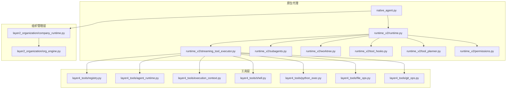
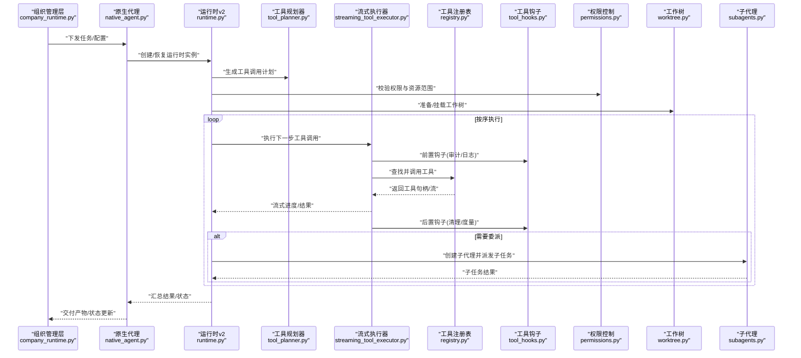
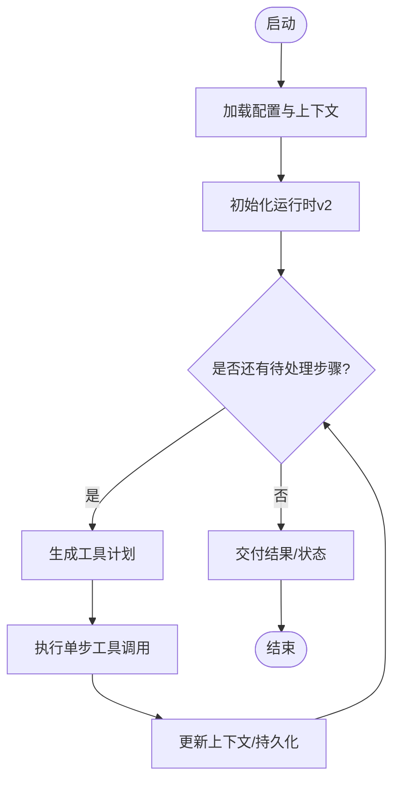
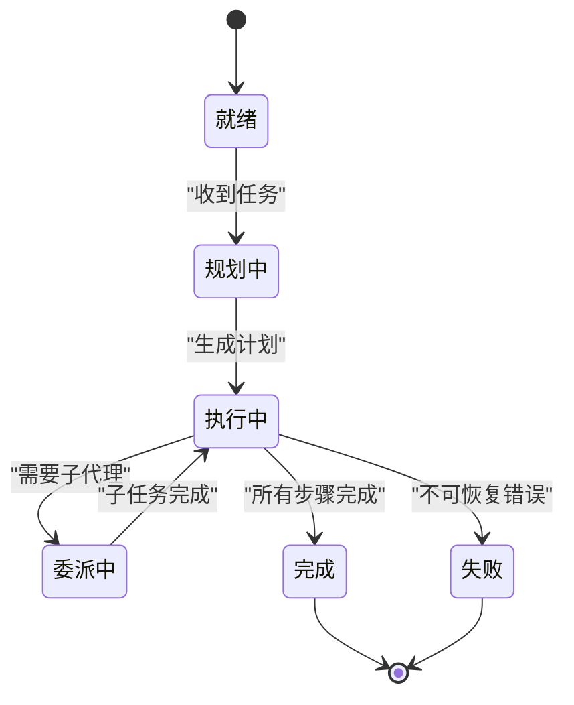
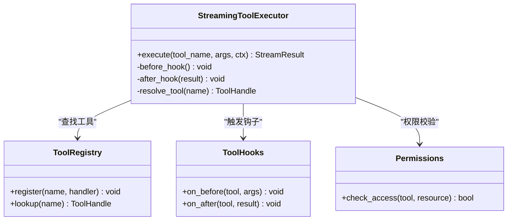
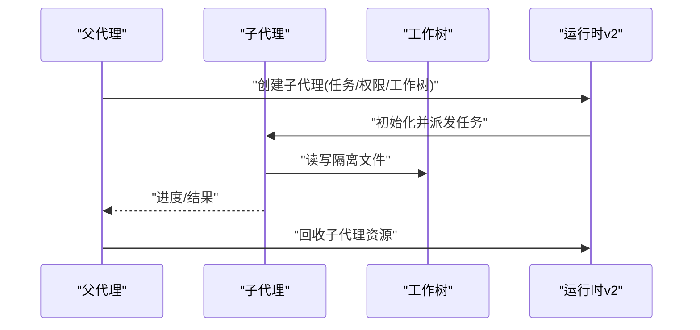
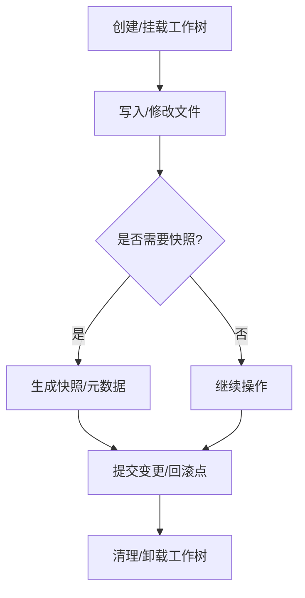
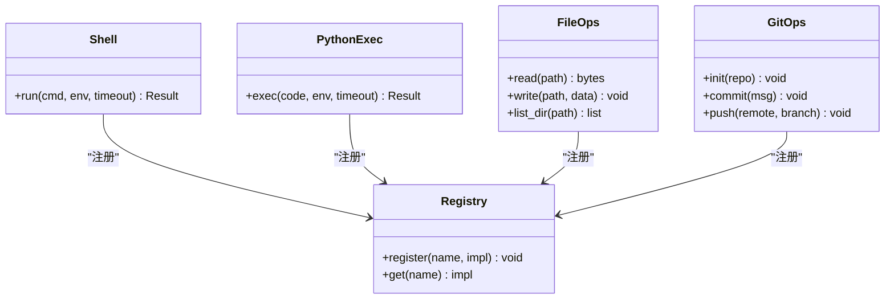
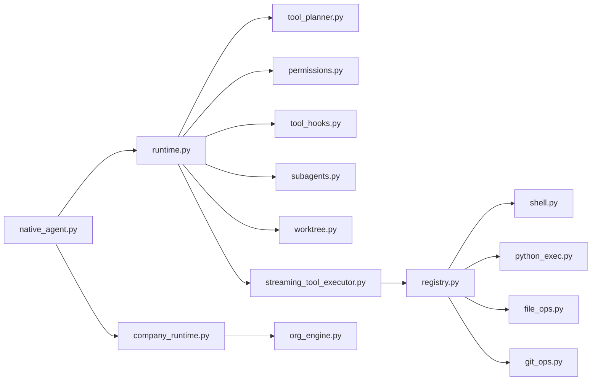

# 原生代理实现

<cite>
**本文引用的文件**   
- [native_agent.py](file://opc/layer3_agent/native_agent.py)
- [runtime.py](file://opc/layer3_agent/runtime_v2/runtime.py)
- [streaming_tool_executor.py](file://opc/layer3_agent/runtime_v2/streaming_tool_executor.py)
- [subagents.py](file://opc/layer3_agent/runtime_v2/subagents.py)
- [worktree.py](file://opc/layer3_agent/runtime_v2/worktree.py)
- [tool_hooks.py](file://opc/layer3_agent/runtime_v2/tool_hooks.py)
- [tool_planner.py](file://opc/layer3_agent/runtime_v2/tool_planner.py)
- [permissions.py](file://opc/layer3_agent/runtime_v2/permissions.py)
- [agent_runtime.py](file://opc/layer4_tools/agent_runtime.py)
- [execution_context.py](file://opc/layer4_tools/execution_context.py)
- [registry.py](file://opc/layer4_tools/registry.py)
- [shell.py](file://opc/layer4_tools/shell.py)
- [python_exec.py](file://opc/layer4_tools/python_exec.py)
- [file_ops.py](file://opc/layer4_tools/file_ops.py)
- [git_ops.py](file://opc/layer4_tools/git_ops.py)
- [company_runtime.py](file://opc/layer2_organization/company_runtime.py)
- [org_engine.py](file://opc/layer2_organization/org_engine.py)
- [test_native_agent_integration.py](file://tests/test_native_agent_integration.py)
- [test_native_runtime_v2.py](file://tests/test_native_runtime_v2.py)
</cite>

## 目录
1. [简介](#简介)
2. [项目结构](#项目结构)
3. [核心组件](#核心组件)
4. [架构总览](#架构总览)
5. [详细组件分析](#详细组件分析)
6. [依赖关系分析](#依赖关系分析)
7. [性能考虑](#性能考虑)
8. [故障排查指南](#故障排查指南)
9. [结论](#结论)
10. [附录](#附录)

## 简介
本文件面向OpenOPC“原生代理”的实现与使用，聚焦以下目标：
- 解释原生代理的架构设计与核心组件，包括生命周期管理、状态机转换与上下文维护。
- 深入说明运行时环境v2（Runtime v2）的实现机制，涵盖工具执行器、子代理管理与工作树操作。
- 描述代理的配置选项、参数传递与结果处理流程。
- 提供原生代理开发指南：自定义工具集成、错误处理与性能优化实践。
- 阐明与组织管理层（Layer2）和工具层（Layer4）的交互方式。

## 项目结构
围绕原生代理的关键代码主要分布在以下模块：
- 原生代理入口与编排：opc/layer3_agent/native_agent.py
- 运行时v2：opc/layer3_agent/runtime_v2/*
- 工具层接口与内置工具：opc/layer4_tools/*
- 组织管理层对接：opc/layer2_organization/*
- 测试用例：tests/*

图表来源
- [native_agent.py](file://opc/layer3_agent/native_agent.py)
- [runtime.py](file://opc/layer3_agent/runtime_v2/runtime.py)
- [streaming_tool_executor.py](file://opc/layer3_agent/runtime_v2/streaming_tool_executor.py)
- [subagents.py](file://opc/layer3_agent/runtime_v2/subagents.py)
- [worktree.py](file://opc/layer3_agent/runtime_v2/worktree.py)
- [tool_hooks.py](file://opc/layer3_agent/runtime_v2/tool_hooks.py)
- [tool_planner.py](file://opc/layer3_agent/runtime_v2/tool_planner.py)
- [permissions.py](file://opc/layer3_agent/runtime_v2/permissions.py)
- [registry.py](file://opc/layer4_tools/registry.py)
- [agent_runtime.py](file://opc/layer4_tools/agent_runtime.py)
- [execution_context.py](file://opc/layer4_tools/execution_context.py)
- [shell.py](file://opc/layer4_tools/shell.py)
- [python_exec.py](file://opc/layer4_tools/python_exec.py)
- [file_ops.py](file://opc/layer4_tools/file_ops.py)
- [git_ops.py](file://opc/layer4_tools/git_ops.py)
- [company_runtime.py](file://opc/layer2_organization/company_runtime.py)
- [org_engine.py](file://opc/layer2_organization/org_engine.py)

章节来源
- [native_agent.py](file://opc/layer3_agent/native_agent.py)
- [runtime.py](file://opc/layer3_agent/runtime_v2/runtime.py)
- [company_runtime.py](file://opc/layer2_organization/company_runtime.py)
- [org_engine.py](file://opc/layer2_organization/org_engine.py)

## 核心组件
- 原生代理（Native Agent）：负责会话生命周期、与组织管理层协调、调度运行时v2实例、维护上下文与持久化。
- 运行时v2（Runtime v2）：封装工具计划、权限控制、流式工具执行、子代理与工作树管理。
- 流式工具执行器（Streaming Tool Executor）：统一调用工具注册表，支持流式输出与进度上报。
- 子代理（Subagents）：在隔离上下文中委派任务，具备独立的工作树与权限边界。
- 工作树（Worktree）：为每次执行或子代理提供隔离的文件系统视图与变更追踪。
- 工具钩子（Tool Hooks）：在执行前后注入审计、日志、度量等横切关注点。
- 工具规划器（Tool Planner）：将高层意图分解为可执行的工具调用序列。
- 权限（Permissions）：对工具访问范围、资源白名单进行约束。
- 工具层（Layer4 Tools）：提供Shell、Python执行、文件与Git操作等能力，并通过注册表暴露给上层。

章节来源
- [native_agent.py](file://opc/layer3_agent/native_agent.py)
- [runtime.py](file://opc/layer3_agent/runtime_v2/runtime.py)
- [streaming_tool_executor.py](file://opc/layer3_agent/runtime_v2/streaming_tool_executor.py)
- [subagents.py](file://opc/layer3_agent/runtime_v2/subagents.py)
- [worktree.py](file://opc/layer3_agent/runtime_v2/worktree.py)
- [tool_hooks.py](file://opc/layer3_agent/runtime_v2/tool_hooks.py)
- [tool_planner.py](file://opc/layer3_agent/runtime_v2/tool_planner.py)
- [permissions.py](file://opc/layer3_agent/runtime_v2/permissions.py)
- [registry.py](file://opc/layer4_tools/registry.py)
- [agent_runtime.py](file://opc/layer4_tools/agent_runtime.py)
- [execution_context.py](file://opc/layer4_tools/execution_context.py)
- [shell.py](file://opc/layer4_tools/shell.py)
- [python_exec.py](file://opc/layer4_tools/python_exec.py)
- [file_ops.py](file://opc/layer4_tools/file_ops.py)
- [git_ops.py](file://opc/layer4_tools/git_ops.py)

## 架构总览
原生代理作为编排者，向上承接组织管理层下发的任务与策略，向下驱动运行时v2完成工具编排与执行。运行时v2通过工具注册表发现并调用具体工具，结合权限与工作树确保执行安全与隔离。

图表来源
- [native_agent.py](file://opc/layer3_agent/native_agent.py)
- [runtime.py](file://opc/layer3_agent/runtime_v2/runtime.py)
- [tool_planner.py](file://opc/layer3_agent/runtime_v2/tool_planner.py)
- [streaming_tool_executor.py](file://opc/layer3_agent/runtime_v2/streaming_tool_executor.py)
- [registry.py](file://opc/layer4_tools/registry.py)
- [tool_hooks.py](file://opc/layer3_agent/runtime_v2/tool_hooks.py)
- [permissions.py](file://opc/layer3_agent/runtime_v2/permissions.py)
- [worktree.py](file://opc/layer3_agent/runtime_v2/worktree.py)
- [subagents.py](file://opc/layer3_agent/runtime_v2/subagents.py)
- [company_runtime.py](file://opc/layer2_organization/company_runtime.py)

## 详细组件分析

### 原生代理（Native Agent）
职责
- 初始化与生命周期管理：启动、挂起、恢复、关闭。
- 上下文维护：会话ID、工作项标识、组织配置、记忆与可见性策略。
- 与组织管理层协作：接收任务、汇报进度、提交产物。
- 调度运行时v2：根据策略选择执行模式与资源配额。

关键流程
- 启动阶段：加载配置、建立与组织管理层的连接、初始化运行时v2。
- 运行阶段：解析输入、构建上下文、驱动工具计划与执行、处理中间结果。
- 收尾阶段：持久化状态、释放资源、上报最终结果。

图表来源
- [native_agent.py](file://opc/layer3_agent/native_agent.py)
- [runtime.py](file://opc/layer3_agent/runtime_v2/runtime.py)

章节来源
- [native_agent.py](file://opc/layer3_agent/native_agent.py)
- [test_native_agent_integration.py](file://tests/test_native_agent_integration.py)

### 运行时v2（Runtime v2）
职责
- 编排工具计划与执行，维护执行上下文与状态机。
- 管理子代理与工作树，保证隔离性与可观测性。
- 集成权限控制与工具钩子，保障安全与可审计。

状态机要点
- 空闲/就绪：等待任务输入。
- 规划中：基于当前上下文生成工具调用序列。
- 执行中：逐步执行工具调用，支持流式反馈。
- 委派中：创建子代理处理子任务。
- 完成/失败：产出结果或错误信息，进入收尾。

图表来源
- [runtime.py](file://opc/layer3_agent/runtime_v2/runtime.py)

章节来源
- [runtime.py](file://opc/layer3_agent/runtime_v2/runtime.py)
- [test_native_runtime_v2.py](file://tests/test_native_runtime_v2.py)

### 流式工具执行器（Streaming Tool Executor）
职责
- 统一调用工具注册表中的工具，支持流式输出与进度事件。
- 在工具执行前后触发钩子，记录审计与度量。
- 聚合工具返回值，转换为统一的中间表示供上层消费。

图表来源
- [streaming_tool_executor.py](file://opc/layer3_agent/runtime_v2/streaming_tool_executor.py)
- [registry.py](file://opc/layer4_tools/registry.py)
- [tool_hooks.py](file://opc/layer3_agent/runtime_v2/tool_hooks.py)
- [permissions.py](file://opc/layer3_agent/runtime_v2/permissions.py)

章节来源
- [streaming_tool_executor.py](file://opc/layer3_agent/runtime_v2/streaming_tool_executor.py)
- [registry.py](file://opc/layer4_tools/registry.py)
- [tool_hooks.py](file://opc/layer3_agent/runtime_v2/tool_hooks.py)
- [permissions.py](file://opc/layer3_agent/runtime_v2/permissions.py)

### 子代理（Subagents）
职责
- 在隔离上下文中委派子任务，拥有独立的工作树与权限集。
- 与父代理通信，回传进度与结果。
- 支持并发与超时控制，避免阻塞主流程。

图表来源
- [subagents.py](file://opc/layer3_agent/runtime_v2/subagents.py)
- [worktree.py](file://opc/layer3_agent/runtime_v2/worktree.py)
- [runtime.py](file://opc/layer3_agent/runtime_v2/runtime.py)

章节来源
- [subagents.py](file://opc/layer3_agent/runtime_v2/subagents.py)
- [worktree.py](file://opc/layer3_agent/runtime_v2/worktree.py)
- [runtime.py](file://opc/layer3_agent/runtime_v2/runtime.py)

### 工作树（Worktree）
职责
- 为每次执行或子代理提供隔离的文件系统视图。
- 跟踪变更、快照与回滚，便于调试与重试。
- 与权限控制联动，限制可访问路径与资源类型。

图表来源
- [worktree.py](file://opc/layer3_agent/runtime_v2/worktree.py)

章节来源
- [worktree.py](file://opc/layer3_agent/runtime_v2/worktree.py)

### 工具钩子（Tool Hooks）
职责
- 在工具执行前/后注入审计、日志、指标收集与清理逻辑。
- 支持扩展点，允许第三方插件接入。

章节来源
- [tool_hooks.py](file://opc/layer3_agent/runtime_v2/tool_hooks.py)

### 工具规划器（Tool Planner）
职责
- 将高层意图分解为有序的工具调用序列。
- 依据上下文与策略动态调整计划，支持分支与合并。

章节来源
- [tool_planner.py](file://opc/layer3_agent/runtime_v2/tool_planner.py)

### 权限（Permissions）
职责
- 定义工具访问的资源白名单与黑名单。
- 在执行前进行校验，拒绝越权操作。

章节来源
- [permissions.py](file://opc/layer3_agent/runtime_v2/permissions.py)

### 工具层（Layer4 Tools）
职责
- 提供Shell、Python执行、文件与Git操作等基础能力。
- 通过注册表暴露给运行时v2，支持动态发现与版本管理。

图表来源
- [shell.py](file://opc/layer4_tools/shell.py)
- [python_exec.py](file://opc/layer4_tools/python_exec.py)
- [file_ops.py](file://opc/layer4_tools/file_ops.py)
- [git_ops.py](file://opc/layer4_tools/git_ops.py)
- [registry.py](file://opc/layer4_tools/registry.py)

章节来源
- [shell.py](file://opc/layer4_tools/shell.py)
- [python_exec.py](file://opc/layer4_tools/python_exec.py)
- [file_ops.py](file://opc/layer4_tools/file_ops.py)
- [git_ops.py](file://opc/layer4_tools/git_ops.py)
- [registry.py](file://opc/layer4_tools/registry.py)

### 与组织管理层（Layer2）的交互
- 原生代理通过公司运行时与公司引擎对接，获取任务、策略与身份上下文。
- 运行时v2的状态与结果会回传给组织管理层，用于看板展示、审批与审计。

章节来源
- [company_runtime.py](file://opc/layer2_organization/company_runtime.py)
- [org_engine.py](file://opc/layer2_organization/org_engine.py)
- [native_agent.py](file://opc/layer3_agent/native_agent.py)

## 依赖关系分析
- 原生代理依赖运行时v2；运行时v2依赖工具规划器、权限、钩子、子代理与工作树。
- 流式执行器依赖工具注册表与工具实现（Shell、Python、文件、Git）。
- 工具层通过注册表解耦，便于扩展与替换。
- 组织管理层与原生代理之间通过明确接口契约交互，降低耦合度。

图表来源
- [native_agent.py](file://opc/layer3_agent/native_agent.py)
- [runtime.py](file://opc/layer3_agent/runtime_v2/runtime.py)
- [tool_planner.py](file://opc/layer3_agent/runtime_v2/tool_planner.py)
- [permissions.py](file://opc/layer3_agent/runtime_v2/permissions.py)
- [tool_hooks.py](file://opc/layer3_agent/runtime_v2/tool_hooks.py)
- [subagents.py](file://opc/layer3_agent/runtime_v2/subagents.py)
- [worktree.py](file://opc/layer3_agent/runtime_v2/worktree.py)
- [streaming_tool_executor.py](file://opc/layer3_agent/runtime_v2/streaming_tool_executor.py)
- [registry.py](file://opc/layer4_tools/registry.py)
- [shell.py](file://opc/layer4_tools/shell.py)
- [python_exec.py](file://opc/layer4_tools/python_exec.py)
- [file_ops.py](file://opc/layer4_tools/file_ops.py)
- [git_ops.py](file://opc/layer4_tools/git_ops.py)
- [company_runtime.py](file://opc/layer2_organization/company_runtime.py)
- [org_engine.py](file://opc/layer2_organization/org_engine.py)

章节来源
- [native_agent.py](file://opc/layer3_agent/native_agent.py)
- [runtime.py](file://opc/layer3_agent/runtime_v2/runtime.py)
- [registry.py](file://opc/layer4_tools/registry.py)
- [company_runtime.py](file://opc/layer2_organization/company_runtime.py)

## 性能考虑
- 流式执行：优先使用流式工具执行器，减少内存峰值并提升响应速度。
- 并行与隔离：合理使用子代理并发，配合工作树隔离避免锁竞争。
- 权限预检：在执行前进行权限校验，避免无效I/O与网络调用。
- 钩子轻量化：审计与度量钩子应避免重型计算，必要时异步落盘。
- 工具缓存：对读多写少的工具结果进行短期缓存，注意失效策略。
- 资源限额：为Shell与Python执行设置超时与资源上限，防止长尾任务拖垮系统。

[本节为通用指导，不直接分析具体文件]

## 故障排查指南
- 工具执行失败：检查工具注册表是否正确注册、权限是否放行、工作树路径是否有效。
- 子代理异常：确认子代理上下文隔离、资源配额与超时设置，查看钩子日志。
- 状态不一致：核对运行时v2状态机转换与持久化点，必要时从快照恢复。
- 组织管理层同步问题：验证原生代理与公司运行时之间的消息格式与重试策略。

章节来源
- [streaming_tool_executor.py](file://opc/layer3_agent/runtime_v2/streaming_tool_executor.py)
- [subagents.py](file://opc/layer3_agent/runtime_v2/subagents.py)
- [runtime.py](file://opc/layer3_agent/runtime_v2/runtime.py)
- [native_agent.py](file://opc/layer3_agent/native_agent.py)

## 结论
原生代理以运行时v2为核心，结合工具规划、权限控制、钩子与子代理/工作树隔离，形成高内聚、低耦合的执行框架。通过流式执行与细粒度权限，系统在安全性与性能之间取得平衡。与组织管理层的清晰契约使得代理能够融入企业级编排与治理体系。

[本节为总结性内容，不直接分析具体文件]

## 附录

### 配置与参数传递
- 配置来源：原生代理与运行时v2均支持外部配置注入，包含工具白名单、权限策略、工作树根路径、超时与并发限制等。
- 参数传递：通过执行上下文对象在各层间传递，避免全局状态污染。
- 结果处理：工具执行结果经执行器标准化后，由运行时v2汇总并持久化，再回传给原生代理与组织管理层。

章节来源
- [runtime.py](file://opc/layer3_agent/runtime_v2/runtime.py)
- [execution_context.py](file://opc/layer4_tools/execution_context.py)
- [streaming_tool_executor.py](file://opc/layer3_agent/runtime_v2/streaming_tool_executor.py)

### 开发指南：自定义工具集成
- 在工具注册表中注册新工具，实现标准接口（名称、参数、返回值、流式输出可选）。
- 在权限策略中声明该工具可访问的资源范围。
- 在工具钩子中补充必要的审计与度量逻辑。
- 在工作树中验证读写路径是否符合预期，必要时增加沙箱限制。

章节来源
- [registry.py](file://opc/layer4_tools/registry.py)
- [permissions.py](file://opc/layer3_agent/runtime_v2/permissions.py)
- [tool_hooks.py](file://opc/layer3_agent/runtime_v2/tool_hooks.py)
- [worktree.py](file://opc/layer3_agent/runtime_v2/worktree.py)

### 最佳实践
- 小步快跑：将复杂任务拆分为多个小工具调用，提高可观测性与可恢复性。
- 幂等设计：工具尽量幂等，便于重试与回滚。
- 错误分类：区分可重试与不可恢复错误，制定差异化处理策略。
- 监控告警：在钩子中埋点关键指标，结合组织管理层的看板进行可视化。

[本节为通用指导，不直接分析具体文件]