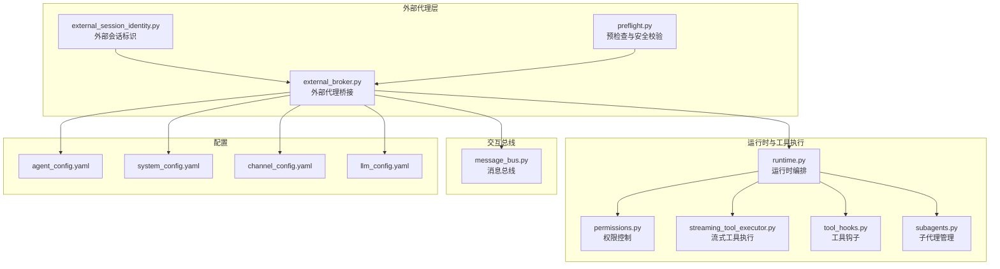
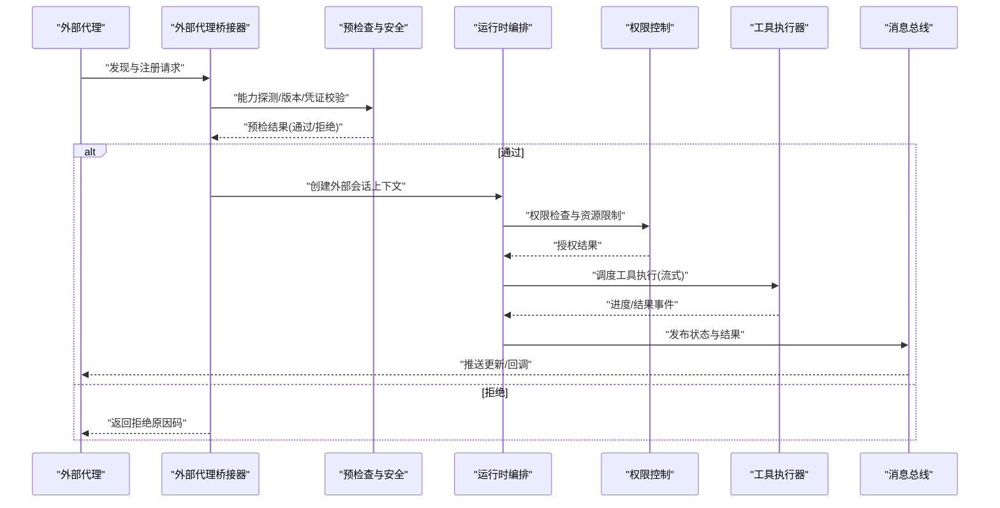
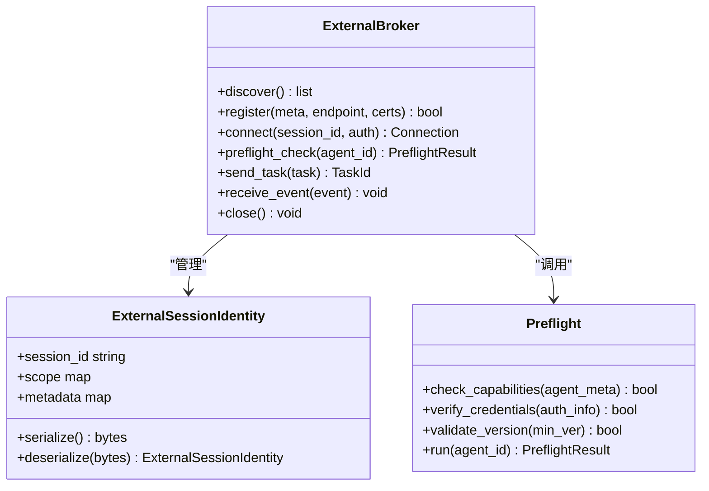
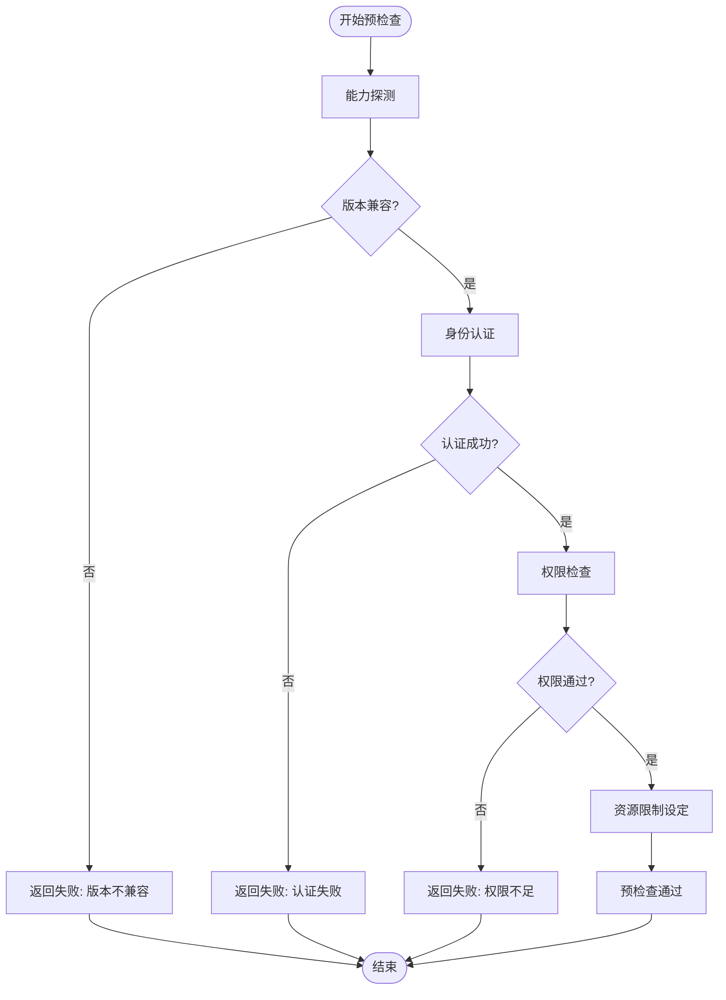
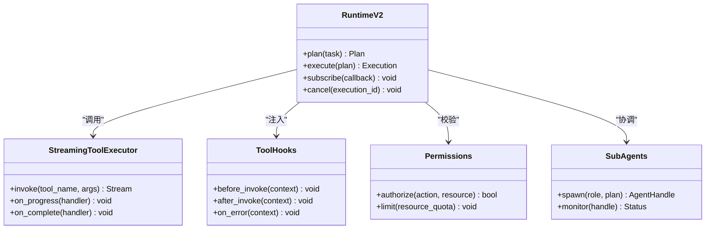
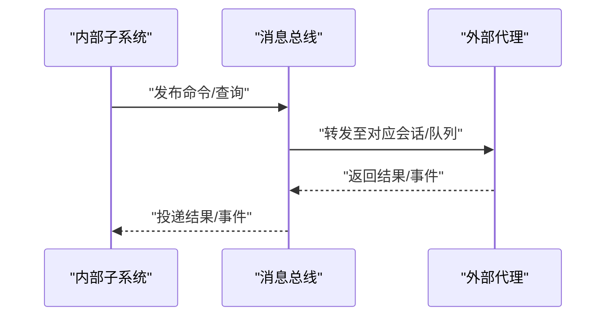
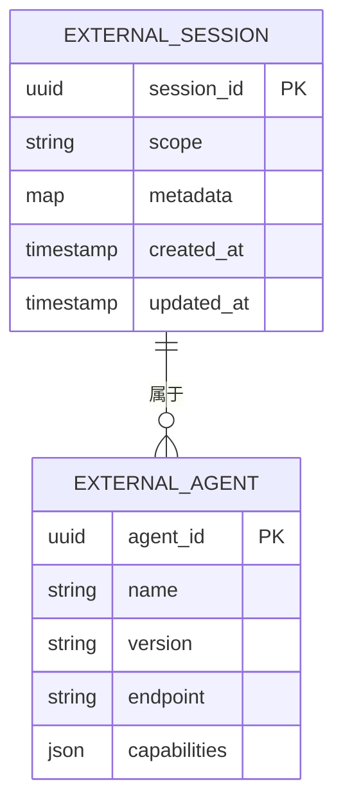
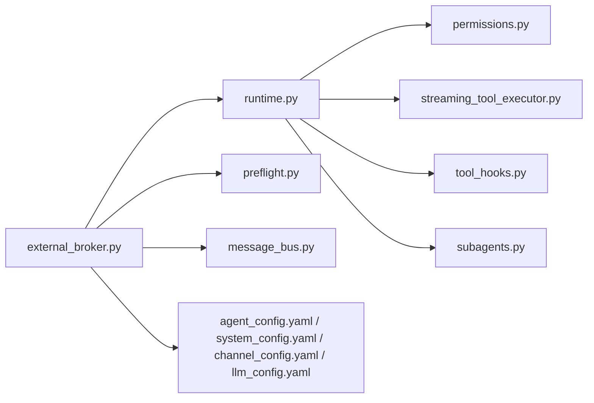

# 外部代理集成

<cite>
**本文引用的文件**   
- [external_broker.py](file://opc/layer3_agent/external_broker.py)
- [external_session_identity.py](file://opc/layer3_agent/external_session_identity.py)
- [preflight.py](file://opc/layer3_agent/preflight.py)
- [company_runtime_contract.py](file://opc/layer3_agent/company_runtime_contract.py)
- [runtime.py](file://opc/layer3_agent/runtime_v2/runtime.py)
- [permissions.py](file://opc/layer3_agent/runtime_v2/permissions.py)
- [streaming_tool_executor.py](file://opc/layer3_agent/runtime_v2/streaming_tool_executor.py)
- [tool_hooks.py](file://opc/layer3_agent/runtime_v2/tool_hooks.py)
- [subagents.py](file://opc/layer3_agent/runtime_v2/subagents.py)
- [message_bus.py](file://opc/layer0_interaction/message_bus.py)
- [agent_config.yaml](file://config/agent_config.yaml)
- [system_config.yaml](file://config/system_config.yaml)
- [channel_config.yaml](file://config/channel_config.yaml)
- [llm_config.yaml](file://config/llm_config.yaml)
- [test_external_agent_preflight.py](file://tests/test_external_agent_preflight.py)
- [test_external_agent_monitoring.py](file://tests/test_external_agent_monitoring.py)
- [test_external_session_continuity.py](file://tests/test_external_session_continuity.py)
</cite>

## 目录
1. [简介](#简介)
2. [项目结构](#项目结构)
3. [核心组件](#核心组件)
4. [架构总览](#架构总览)
5. [详细组件分析](#详细组件分析)
6. [依赖关系分析](#依赖关系分析)
7. [性能考虑](#性能考虑)
8. [故障排除指南](#故障排除指南)
9. [结论](#结论)
10. [附录](#附录)

## 简介
本文件面向“OpenOPC 外部代理”的集成与开发，聚焦以下目标：
- 明确外部代理与 OpenOPC 的通信协议与消息格式约定
- 说明外部代理的发现、注册与连接管理机制
- 描述预检查流程与安全验证（身份认证、权限检查、资源限制）
- 解释会话标识管理与状态同步机制
- 提供外部代理开发指南（SDK 使用、错误处理与重试策略）
- 阐述与内部代理的互操作性与数据转换
- 给出完整集成示例与故障排除建议

## 项目结构
与外部代理相关的关键代码位于 layer3_agent 与 runtime_v2 子模块中，并通过配置与测试用例进行约束与验证。

图表来源
- [external_broker.py:1-200](file://opc/layer3_agent/external_broker.py#L1-L200)
- [external_session_identity.py:1-120](file://opc/layer3_agent/external_session_identity.py#L1-L120)
- [preflight.py:1-150](file://opc/layer3_agent/preflight.py#L1-L150)
- [runtime.py:1-200](file://opc/layer3_agent/runtime_v2/runtime.py#L1-L200)
- [permissions.py:1-120](file://opc/layer3_agent/runtime_v2/permissions.py#L1-L120)
- [streaming_tool_executor.py:1-150](file://opc/layer3_agent/runtime_v2/streaming_tool_executor.py#L1-L150)
- [tool_hooks.py:1-120](file://opc/layer3_agent/runtime_v2/tool_hooks.py#L1-L120)
- [subagents.py:1-120](file://opc/layer3_agent/runtime_v2/subagents.py#L1-L120)
- [message_bus.py:1-120](file://opc/layer0_interaction/message_bus.py#L1-L120)
- [agent_config.yaml:1-200](file://config/agent_config.yaml#L1-L200)
- [system_config.yaml:1-200](file://config/system_config.yaml#L1-L200)
- [channel_config.yaml:1-200](file://config/channel_config.yaml#L1-L200)
- [llm_config.yaml:1-200](file://config/llm_config.yaml#L1-L200)

章节来源
- [external_broker.py:1-200](file://opc/layer3_agent/external_broker.py#L1-L200)
- [external_session_identity.py:1-120](file://opc/layer3_agent/external_session_identity.py#L1-L120)
- [preflight.py:1-150](file://opc/layer3_agent/preflight.py#L1-L150)
- [runtime.py:1-200](file://opc/layer3_agent/runtime_v2/runtime.py#L1-L200)
- [permissions.py:1-120](file://opc/layer3_agent/runtime_v2/permissions.py#L1-L120)
- [streaming_tool_executor.py:1-150](file://opc/layer3_agent/runtime_v2/streaming_tool_executor.py#L1-L150)
- [tool_hooks.py:1-120](file://opc/layer3_agent/runtime_v2/tool_hooks.py#L1-L120)
- [subagents.py:1-120](file://opc/layer3_agent/runtime_v2/subagents.py#L1-L120)
- [message_bus.py:1-120](file://opc/layer0_interaction/message_bus.py#L1-L120)
- [agent_config.yaml:1-200](file://config/agent_config.yaml#L1-L200)
- [system_config.yaml:1-200](file://config/system_config.yaml#L1-L200)
- [channel_config.yaml:1-200](file://config/channel_config.yaml#L1-L200)
- [llm_config.yaml:1-200](file://config/llm_config.yaml#L1-L200)

## 核心组件
- 外部代理桥接器（External Broker）
  - 负责外部代理发现、注册、连接生命周期管理
  - 承载预检查与安全校验入口
  - 维护与外部代理的会话上下文与状态同步
- 外部会话标识（External Session Identity）
  - 定义外部会话的唯一标识与映射规则
  - 保证跨进程/跨网络会话的一致性与可追踪性
- 预检查与安全（Preflight）
  - 在建立连接前完成能力探测、版本兼容、安全凭证校验
  - 输出通过/拒绝结果并附带原因码
- 运行时与工具执行（Runtime v2）
  - 编排外部代理任务、协调工具执行、流式输出
  - 与权限系统、工具钩子、子代理协作
- 消息总线（Message Bus）
  - 作为内部子系统与外部代理之间的统一消息通道
  - 支持事件驱动的消息路由与可靠性保障

章节来源
- [external_broker.py:1-200](file://opc/layer3_agent/external_broker.py#L1-L200)
- [external_session_identity.py:1-120](file://opc/layer3_agent/external_session_identity.py#L1-L120)
- [preflight.py:1-150](file://opc/layer3_agent/preflight.py#L1-L150)
- [runtime.py:1-200](file://opc/layer3_agent/runtime_v2/runtime.py#L1-L200)
- [permissions.py:1-120](file://opc/layer3_agent/runtime_v2/permissions.py#L1-L120)
- [streaming_tool_executor.py:1-150](file://opc/layer3_agent/runtime_v2/streaming_tool_executor.py#L1-L150)
- [tool_hooks.py:1-120](file://opc/layer3_agent/runtime_v2/tool_hooks.py#L1-L120)
- [subagents.py:1-120](file://opc/layer3_agent/runtime_v2/subagents.py#L1-L120)
- [message_bus.py:1-120](file://opc/layer0_interaction/message_bus.py#L1-L120)

## 架构总览
下图展示了外部代理与 OpenOPC 运行时的整体交互路径，包括发现、注册、预检、会话建立、任务编排与工具执行。

图表来源
- [external_broker.py:1-200](file://opc/layer3_agent/external_broker.py#L1-L200)
- [preflight.py:1-150](file://opc/layer3_agent/preflight.py#L1-L150)
- [runtime.py:1-200](file://opc/layer3_agent/runtime_v2/runtime.py#L1-L200)
- [permissions.py:1-120](file://opc/layer3_agent/runtime_v2/permissions.py#L1-L120)
- [streaming_tool_executor.py:1-150](file://opc/layer3_agent/runtime_v2/streaming_tool_executor.py#L1-L150)
- [message_bus.py:1-120](file://opc/layer0_interaction/message_bus.py#L1-L120)

## 详细组件分析

### 外部代理桥接器（External Broker）
职责
- 发现：扫描可用外部代理实例或接收其主动上报
- 注册：登记元信息（能力、版本、端点、证书指纹等）
- 连接：建立长连接/心跳，维持健康检查与重连
- 会话：绑定外部会话标识，维护上下文与状态同步
- 预检：调用预检查模块完成能力/安全校验
- 路由：将内部任务转换为外部消息，并将外部响应转回内部

关键接口与行为
- 发现与注册 API：用于外部代理上报自身能力与连接地址
- 连接生命周期：握手、鉴权、保活、断线重连
- 会话上下文：封装会话 ID、角色、权限范围、资源配额
- 预检入口：触发能力探测、版本兼容、凭据校验
- 消息路由：内部任务到外部消息的序列化与反序列化

图表来源
- [external_broker.py:1-200](file://opc/layer3_agent/external_broker.py#L1-L200)
- [external_session_identity.py:1-120](file://opc/layer3_agent/external_session_identity.py#L1-L120)
- [preflight.py:1-150](file://opc/layer3_agent/preflight.py#L1-L150)

章节来源
- [external_broker.py:1-200](file://opc/layer3_agent/external_broker.py#L1-L200)
- [external_session_identity.py:1-120](file://opc/layer3_agent/external_session_identity.py#L1-L120)
- [preflight.py:1-150](file://opc/layer3_agent/preflight.py#L1-L150)

### 预检查与安全（Preflight）
流程要点
- 能力探测：确认外部代理支持的协议版本、工具集、并发度
- 版本兼容：比较最小要求版本与当前实现
- 身份认证：校验证书/令牌/签名等凭据
- 权限检查：基于角色与资源范围决定允许的操作
- 资源限制：设置速率限制、超时、最大并发等

图表来源
- [preflight.py:1-150](file://opc/layer3_agent/preflight.py#L1-L150)
- [permissions.py:1-120](file://opc/layer3_agent/runtime_v2/permissions.py#L1-L120)

章节来源
- [preflight.py:1-150](file://opc/layer3_agent/preflight.py#L1-L150)
- [permissions.py:1-120](file://opc/layer3_agent/runtime_v2/permissions.py#L1-L120)

### 运行时与工具执行（Runtime v2）
职责
- 任务编排：解析外部任务、生成执行计划、协调子代理
- 工具执行：调用工具执行器，支持流式输出与进度反馈
- 权限与限制：在执行前再次校验权限与资源配额
- 钩子扩展：在工具执行前后注入日志、审计、监控

图表来源
- [runtime.py:1-200](file://opc/layer3_agent/runtime_v2/runtime.py#L1-L200)
- [streaming_tool_executor.py:1-150](file://opc/layer3_agent/runtime_v2/streaming_tool_executor.py#L1-L150)
- [tool_hooks.py:1-120](file://opc/layer3_agent/runtime_v2/tool_hooks.py#L1-L120)
- [permissions.py:1-120](file://opc/layer3_agent/runtime_v2/permissions.py#L1-L120)
- [subagents.py:1-120](file://opc/layer3_agent/runtime_v2/subagents.py#L1-L120)

章节来源
- [runtime.py:1-200](file://opc/layer3_agent/runtime_v2/runtime.py#L1-L200)
- [streaming_tool_executor.py:1-150](file://opc/layer3_agent/runtime_v2/streaming_tool_executor.py#L1-L150)
- [tool_hooks.py:1-120](file://opc/layer3_agent/runtime_v2/tool_hooks.py#L1-L120)
- [permissions.py:1-120](file://opc/layer3_agent/runtime_v2/permissions.py#L1-L120)
- [subagents.py:1-120](file://opc/layer3_agent/runtime_v2/subagents.py#L1-L120)

### 消息总线（Message Bus）
职责
- 统一消息通道：内部子系统与外部代理之间的事件与命令路由
- 可靠性：至少一次投递、去重、顺序保证（按会话）
- 可扩展：支持插件化适配器以对接不同传输层

图表来源
- [message_bus.py:1-120](file://opc/layer0_interaction/message_bus.py#L1-L120)

章节来源
- [message_bus.py:1-120](file://opc/layer0_interaction/message_bus.py#L1-L120)

### 会话标识与状态同步
- 会话标识：每个外部会话拥有唯一 ID，携带作用域与元数据
- 状态同步：通过消息总线持续推送进度、中间结果与最终状态
- 一致性：确保同一会话内消息顺序与幂等处理

图表来源
- [external_session_identity.py:1-120](file://opc/layer3_agent/external_session_identity.py#L1-L120)
- [external_broker.py:1-200](file://opc/layer3_agent/external_broker.py#L1-L200)

章节来源
- [external_session_identity.py:1-120](file://opc/layer3_agent/external_session_identity.py#L1-L120)
- [external_broker.py:1-200](file://opc/layer3_agent/external_broker.py#L1-L200)

## 依赖关系分析
外部代理桥接器依赖运行时、预检查、权限控制与消息总线；运行时进一步依赖工具执行器、工具钩子、子代理与权限系统。配置项影响发现、注册、安全与资源限制等行为。

图表来源
- [external_broker.py:1-200](file://opc/layer3_agent/external_broker.py#L1-L200)
- [runtime.py:1-200](file://opc/layer3_agent/runtime_v2/runtime.py#L1-L200)
- [preflight.py:1-150](file://opc/layer3_agent/preflight.py#L1-L150)
- [permissions.py:1-120](file://opc/layer3_agent/runtime_v2/permissions.py#L1-L120)
- [streaming_tool_executor.py:1-150](file://opc/layer3_agent/runtime_v2/streaming_tool_executor.py#L1-L150)
- [tool_hooks.py:1-120](file://opc/layer3_agent/runtime_v2/tool_hooks.py#L1-L120)
- [subagents.py:1-120](file://opc/layer3_agent/runtime_v2/subagents.py#L1-L120)
- [message_bus.py:1-120](file://opc/layer0_interaction/message_bus.py#L1-L120)
- [agent_config.yaml:1-200](file://config/agent_config.yaml#L1-L200)
- [system_config.yaml:1-200](file://config/system_config.yaml#L1-L200)
- [channel_config.yaml:1-200](file://config/channel_config.yaml#L1-L200)
- [llm_config.yaml:1-200](file://config/llm_config.yaml#L1-L200)

章节来源
- [external_broker.py:1-200](file://opc/layer3_agent/external_broker.py#L1-L200)
- [runtime.py:1-200](file://opc/layer3_agent/runtime_v2/runtime.py#L1-L200)
- [preflight.py:1-150](file://opc/layer3_agent/preflight.py#L1-L150)
- [permissions.py:1-120](file://opc/layer3_agent/runtime_v2/permissions.py#L1-L120)
- [streaming_tool_executor.py:1-150](file://opc/layer3_agent/runtime_v2/streaming_tool_executor.py#L1-L150)
- [tool_hooks.py:1-120](file://opc/layer3_agent/runtime_v2/tool_hooks.py#L1-L120)
- [subagents.py:1-120](file://opc/layer3_agent/runtime_v2/subagents.py#L1-L120)
- [message_bus.py:1-120](file://opc/layer0_interaction/message_bus.py#L1-L120)
- [agent_config.yaml:1-200](file://config/agent_config.yaml#L1-L200)
- [system_config.yaml:1-200](file://config/system_config.yaml#L1-L200)
- [channel_config.yaml:1-200](file://config/channel_config.yaml#L1-L200)
- [llm_config.yaml:1-200](file://config/llm_config.yaml#L1-L200)

## 性能考虑
- 流式执行：优先采用流式工具执行以减少端到端延迟
- 批处理与合并：对高频小消息进行聚合以降低总线压力
- 连接复用：保持长连接与心跳，避免频繁握手开销
- 限流与背压：在权限与资源限制层实施速率控制与队列深度上限
- 缓存与幂等：对只读查询启用缓存，结合幂等键避免重复执行

[本节为通用指导，无需源码引用]

## 故障排除指南
常见问题与定位步骤
- 预检查失败
  - 检查能力探测与版本兼容结果
  - 核对身份认证凭据与证书链
  - 查看权限与资源限制是否满足
- 连接不稳定
  - 观察心跳与重连日志
  - 检查网络连通性与防火墙策略
- 任务无进展
  - 确认工具执行器是否正常订阅进度事件
  - 检查权限与资源配额是否被触发
- 会话不一致
  - 验证会话标识与作用域是否正确传递
  - 检查消息顺序与幂等处理逻辑

参考测试用例
- 预检查流程与边界条件
- 外部代理监控与健康检查
- 外部会话连续性与恢复

章节来源
- [test_external_agent_preflight.py:1-200](file://tests/test_external_agent_preflight.py#L1-L200)
- [test_external_agent_monitoring.py:1-200](file://tests/test_external_agent_monitoring.py#L1-L200)
- [test_external_session_continuity.py:1-200](file://tests/test_external_session_continuity.py#L1-L200)

## 结论
外部代理集成围绕“发现—注册—预检—连接—编排—执行—同步”的主链路展开。通过统一的会话标识、严格的预检查与权限控制、以及流式工具执行与消息总线，OpenOPC 能够稳定地协同外部代理完成复杂任务。建议在开发时遵循幂等设计、完善的错误处理与重试策略，并结合配置项进行资源与安全的精细化管控。

[本节为总结，无需源码引用]

## 附录

### 通信协议与消息格式约定（摘要）
- 发现与注册
  - 方法：发现/注册
  - 载荷：代理元信息（名称、版本、端点、能力清单、证书指纹）
  - 响应：注册结果与必要参数（如会话前缀、能力协商结果）
- 预检查
  - 方法：预检查
  - 载荷：会话上下文、认证信息、能力协商参数
  - 响应：通过/拒绝及原因码
- 任务与事件
  - 方法：提交任务/取消任务
  - 载荷：任务描述、参数、优先级、超时
  - 事件：进度、中间结果、完成、错误
- 会话管理
  - 方法：心跳/续期/关闭
  - 载荷：会话 ID、时间戳、签名
  - 响应：确认/拒绝

[本节为概念性约定，无需源码引用]

### 与内部代理的互操作性与数据转换
- 语义对齐：将外部工具能力映射为内部工具契约
- 类型转换：外部数据类型与内部模型的双向转换
- 错误映射：外部错误码到内部异常体系的映射
- 审计与追踪：统一 trace id 贯穿内外流程

[本节为概念性说明，无需源码引用]

### 外部代理开发指南（SDK 使用、错误处理与重试策略）
- SDK 使用
  - 初始化：加载配置、建立连接、注册能力
  - 会话：创建会话、发送任务、订阅事件
  - 退出：优雅关闭、释放资源
- 错误处理
  - 分类：网络错误、认证失败、权限不足、业务错误
  - 动作：重试、降级、告警、回滚
- 重试策略
  - 指数退避与抖动
  - 最大重试次数与超时控制
  - 幂等键与去重

[本节为通用实践，无需源码引用]

### 完整集成示例（步骤）
- 准备配置：填写代理元信息、端点、证书与权限范围
- 启动外部代理：实现发现与注册接口，完成预检查
- 建立会话：获取会话标识，订阅事件通道
- 提交任务：构造任务载荷，等待进度与结果
- 监控与排障：观察健康检查、错误日志与指标

[本节为操作指引，无需源码引用]