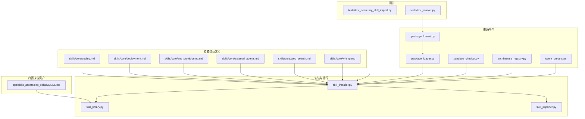
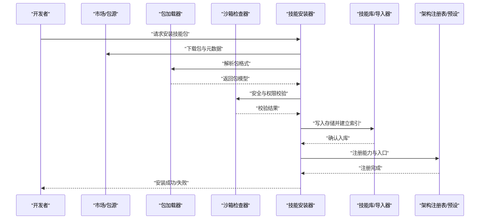
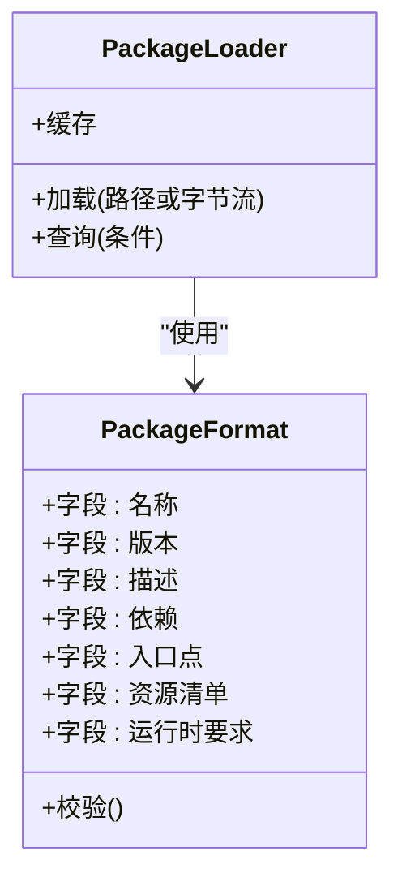
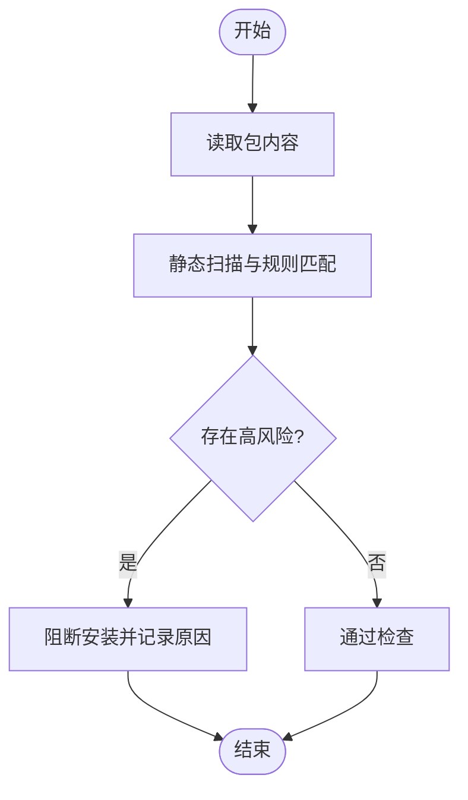
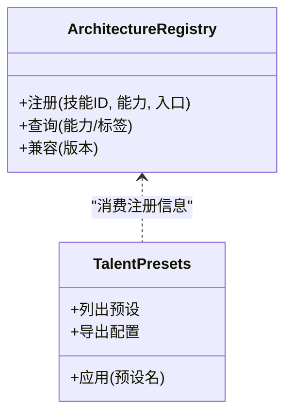
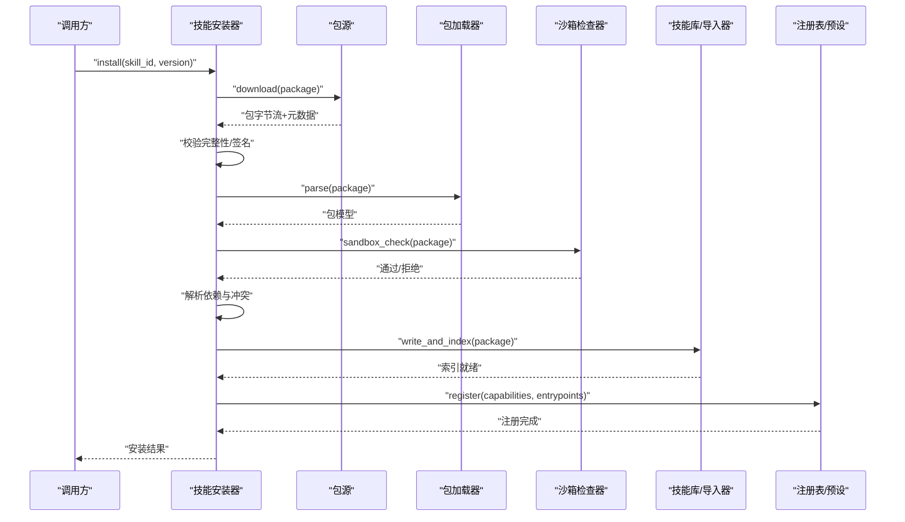
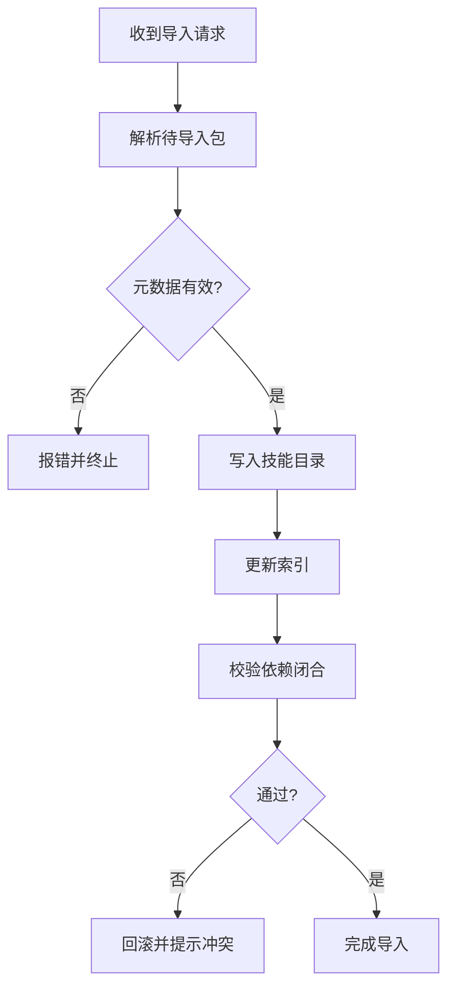
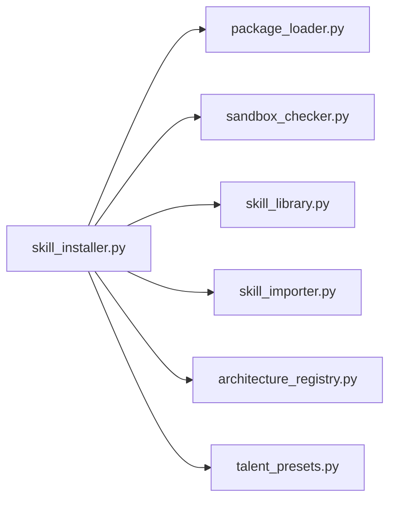

# 技能管理

<cite>
**本文引用的文件**   
- [skill_installer.py](file://opc/layer3_agent/skill_installer.py)
- [skill_library.py](file://opc/layer5_memory/skill_library.py)
- [skill_importer.py](file://opc/layer5_memory/skill_importer.py)
- [package_format.py](file://opc/market/package_format.py)
- [package_loader.py](file://opc/market/package_loader.py)
- [sandbox_checker.py](file://opc/market/sandbox_checker.py)
- [architecture_registry.py](file://opc/market/architecture_registry.py)
- [talent_presets.py](file://opc/market/talent_presets.py)
- [SKILL.md](file://opc/skills_assets/opc_collab/SKILL.md)
- [coding.md](file://skills/core/coding.md)
- [deployment.md](file://skills/core/deployment.md)
- [env_provisioning.md](file://skills/core/env_provisioning.md)
- [external_agents.md](file://skills/core/external_agents.md)
- [web_search.md](file://skills/core/web_search.md)
- [writing.md](file://skills/core/writing.md)
- [test_secretary_skill_import.py](file://tests/test_secretary_skill_import.py)
- [test_market.py](file://tests/test_market.py)
</cite>

## 目录
1. [简介](#简介)
2. [项目结构](#项目结构)
3. [核心组件](#核心组件)
4. [架构总览](#架构总览)
5. [详细组件分析](#详细组件分析)
6. [依赖关系分析](#依赖关系分析)
7. [性能考虑](#性能考虑)
8. [故障排查指南](#故障排查指南)
9. [结论](#结论)
10. [附录](#附录)

## 简介
本文件面向OpenOPC“技能”（Skill）体系，系统性阐述技能的定义格式、元数据与依赖关系；详解技能安装器的下载、校验与部署流程；说明技能库的存储结构与索引机制；提供技能开发指南（模板、API参考、测试方法）；解释版本管理与冲突解决策略；描述技能发现与推荐机制；并给出完整的示例与发布流程，以及质量评估与性能监控方法。

## 项目结构
围绕技能管理的代码主要分布在以下模块：
- 市场与包规范：market/*
- 技能安装器：layer3_agent/skill_installer.py
- 技能库与导入：layer5_memory/skill_library.py, layer5_memory/skill_importer.py
- 内置技能资产：opc/skills_assets/*
- 技能核心文档与模板：skills/core/*
- 相关测试：tests/test_secretary_skill_import.py, tests/test_market.py

图表来源
- [package_format.py](file://opc/market/package_format.py)
- [package_loader.py](file://opc/market/package_loader.py)
- [sandbox_checker.py](file://opc/market/sandbox_checker.py)
- [architecture_registry.py](file://opc/market/architecture_registry.py)
- [talent_presets.py](file://opc/market/talent_presets.py)
- [skill_installer.py](file://opc/layer3_agent/skill_installer.py)
- [skill_library.py](file://opc/layer5_memory/skill_library.py)
- [skill_importer.py](file://opc/layer5_memory/skill_importer.py)
- [SKILL.md](file://opc/skills_assets/opc_collab/SKILL.md)
- [coding.md](file://skills/core/coding.md)
- [deployment.md](file://skills/core/deployment.md)
- [env_provisioning.md](file://skills/core/env_provisioning.md)
- [external_agents.md](file://skills/core/external_agents.md)
- [web_search.md](file://skills/core/web_search.md)
- [writing.md](file://skills/core/writing.md)
- [test_secretary_skill_import.py](file://tests/test_secretary_skill_import.py)
- [test_market.py](file://tests/test_market.py)

章节来源
- [package_format.py](file://opc/market/package_format.py)
- [package_loader.py](file://opc/market/package_loader.py)
- [sandbox_checker.py](file://opc/market/sandbox_checker.py)
- [architecture_registry.py](file://opc/market/architecture_registry.py)
- [talent_presets.py](file://opc/market/talent_presets.py)
- [skill_installer.py](file://opc/layer3_agent/skill_installer.py)
- [skill_library.py](file://opc/layer5_memory/skill_library.py)
- [skill_importer.py](file://opc/layer5_memory/skill_importer.py)
- [SKILL.md](file://opc/skills_assets/opc_collab/SKILL.md)
- [coding.md](file://skills/core/coding.md)
- [deployment.md](file://skills/core/deployment.md)
- [env_provisioning.md](file://skills/core/env_provisioning.md)
- [external_agents.md](file://skills/core/external_agents.md)
- [web_search.md](file://skills/core/web_search.md)
- [writing.md](file://skills/core/writing.md)
- [test_secretary_skill_import.py](file://tests/test_secretary_skill_import.py)
- [test_market.py](file://tests/test_market.py)

## 核心组件
- 包格式与加载
  - 包格式定义：规定技能包的元数据字段、依赖声明、资源清单等。
  - 包加载器：负责解析包内容、构建内存模型、暴露查询接口。
- 沙箱检查器
  - 对包内脚本与资源进行安全扫描与权限约束，防止越权访问。
- 架构注册表
  - 维护技能能力、入口点、运行时契约等注册信息。
- 人才预设
  - 提供预置的技能组合与角色映射，辅助快速装配。
- 技能安装器
  - 实现从源下载、校验签名/完整性、依赖解析、隔离部署、注册索引的全流程。
- 技能库与导入器
  - 持久化存储已安装技能、索引与元数据；支持增量导入与更新。
- 内置技能资产
  - 提供开箱即用的协作类技能示例与模板。
- 技能核心文档
  - 覆盖编码规范、部署步骤、环境准备、外部代理集成、搜索与写作等主题。

章节来源
- [package_format.py](file://opc/market/package_format.py)
- [package_loader.py](file://opc/market/package_loader.py)
- [sandbox_checker.py](file://opc/market/sandbox_checker.py)
- [architecture_registry.py](file://opc/market/architecture_registry.py)
- [talent_presets.py](file://opc/market/talent_presets.py)
- [skill_installer.py](file://opc/layer3_agent/skill_installer.py)
- [skill_library.py](file://opc/layer5_memory/skill_library.py)
- [skill_importer.py](file://opc/layer5_memory/skill_importer.py)
- [SKILL.md](file://opc/skills_assets/opc_collab/SKILL.md)
- [coding.md](file://skills/core/coding.md)
- [deployment.md](file://skills/core/deployment.md)
- [env_provisioning.md](file://skills/core/env_provisioning.md)
- [external_agents.md](file://skills/core/external_agents.md)
- [web_search.md](file://skills/core/web_search.md)
- [writing.md](file://skills/core/writing.md)

## 架构总览
技能管理由“市场层—安装层—存储层—运行层”构成。市场层定义包格式并提供加载与安全检查；安装层协调下载、校验、依赖解析与部署；存储层维护技能库与索引；运行层通过注册表与预设将技能接入执行上下文。

图表来源
- [package_format.py](file://opc/market/package_format.py)
- [package_loader.py](file://opc/market/package_loader.py)
- [sandbox_checker.py](file://opc/market/sandbox_checker.py)
- [skill_installer.py](file://opc/layer3_agent/skill_installer.py)
- [skill_library.py](file://opc/layer5_memory/skill_library.py)
- [skill_importer.py](file://opc/layer5_memory/skill_importer.py)
- [architecture_registry.py](file://opc/market/architecture_registry.py)
- [talent_presets.py](file://opc/market/talent_presets.py)

## 详细组件分析

### 包格式与加载
- 包格式
  - 定义技能包的元数据结构：名称、版本、描述、作者、许可证、依赖列表、入口点、资源清单、运行时要求等。
  - 提供字段校验规则与默认值，确保包一致性。
- 包加载器
  - 读取包内容，构造内存中的包对象，暴露查询接口（按名称、版本、能力标签等）。
  - 缓存已加载包以提升重复查询性能。

图表来源
- [package_format.py](file://opc/market/package_format.py)
- [package_loader.py](file://opc/market/package_loader.py)

章节来源
- [package_format.py](file://opc/market/package_format.py)
- [package_loader.py](file://opc/market/package_loader.py)

### 沙箱检查器
- 功能要点
  - 扫描包内可执行脚本与动态加载项，识别潜在风险。
  - 限制文件系统、网络、进程等系统调用范围。
  - 输出结构化检查结果，供安装器决策。
- 集成方式
  - 安装器在部署前调用检查器，未通过则中止安装并返回错误详情。

图表来源
- [sandbox_checker.py](file://opc/market/sandbox_checker.py)

章节来源
- [sandbox_checker.py](file://opc/market/sandbox_checker.py)

### 架构注册表与人才预设
- 架构注册表
  - 登记技能的能力、工具入口、运行时契约、兼容性矩阵。
  - 为上层编排与路由提供统一发现接口。
- 人才预设
  - 将一组技能打包为“人才/角色”，简化装配流程。
  - 支持基于场景的推荐与一键部署。

图表来源
- [architecture_registry.py](file://opc/market/architecture_registry.py)
- [talent_presets.py](file://opc/market/talent_presets.py)

章节来源
- [architecture_registry.py](file://opc/market/architecture_registry.py)
- [talent_presets.py](file://opc/market/talent_presets.py)

### 技能安装器
- 职责
  - 接收安装请求，解析目标包标识（名称、版本、来源）。
  - 从市场/仓库下载包与元数据，计算并校验完整性。
  - 调用包加载器解析包，调用沙箱检查器进行安全校验。
  - 解析依赖图，处理版本约束与冲突。
  - 将包部署到隔离目录，更新技能库索引，注册能力与入口。
- 关键流程
  - 下载与校验：网络获取、哈希校验、签名验证（若启用）。
  - 依赖解析：拓扑排序、循环依赖检测、最小满足集选择。
  - 冲突解决：优先策略（最新稳定版、指定版本、回退策略）。
  - 部署与注册：原子写入、索引重建、热重载（可选）。

图表来源
- [skill_installer.py](file://opc/layer3_agent/skill_installer.py)
- [package_loader.py](file://opc/market/package_loader.py)
- [sandbox_checker.py](file://opc/market/sandbox_checker.py)
- [skill_library.py](file://opc/layer5_memory/skill_library.py)
- [skill_importer.py](file://opc/layer5_memory/skill_importer.py)
- [architecture_registry.py](file://opc/market/architecture_registry.py)
- [talent_presets.py](file://opc/market/talent_presets.py)

章节来源
- [skill_installer.py](file://opc/layer3_agent/skill_installer.py)
- [package_loader.py](file://opc/market/package_loader.py)
- [sandbox_checker.py](file://opc/market/sandbox_checker.py)
- [skill_library.py](file://opc/layer5_memory/skill_library.py)
- [skill_importer.py](file://opc/layer5_memory/skill_importer.py)
- [architecture_registry.py](file://opc/market/architecture_registry.py)
- [talent_presets.py](file://opc/market/talent_presets.py)

### 技能库与导入器
- 存储结构
  - 以目录形式组织已安装技能，每个技能包含元数据、资源与可执行单元。
  - 维护全局索引文件，支持按名称、版本、能力标签检索。
- 导入机制
  - 支持增量导入与全量重建。
  - 导入时校验元数据一致性与依赖完整性。
- 索引优化
  - 增量更新索引条目，避免全量扫描。
  - 缓存热点查询结果，提升发现速度。

图表来源
- [skill_library.py](file://opc/layer5_memory/skill_library.py)
- [skill_importer.py](file://opc/layer5_memory/skill_importer.py)

章节来源
- [skill_library.py](file://opc/layer5_memory/skill_library.py)
- [skill_importer.py](file://opc/layer5_memory/skill_importer.py)

### 内置技能资产与核心文档
- 内置技能资产
  - 提供协作类技能示例，便于快速上手与二次开发。
- 核心文档
  - 编码规范、部署步骤、环境准备、外部代理集成、搜索与写作等主题，指导开发者高质量产出技能。

章节来源
- [SKILL.md](file://opc/skills_assets/opc_collab/SKILL.md)
- [coding.md](file://skills/core/coding.md)
- [deployment.md](file://skills/core/deployment.md)
- [env_provisioning.md](file://skills/core/env_provisioning.md)
- [external_agents.md](file://skills/core/external_agents.md)
- [web_search.md](file://skills/core/web_search.md)
- [writing.md](file://skills/core/writing.md)

## 依赖关系分析
- 组件耦合
  - 安装器强依赖包加载器与沙箱检查器，弱依赖注册表与预设。
  - 技能库与导入器相互协作，共同维护存储与索引。
- 外部依赖
  - 包源/市场服务用于下载与元数据获取。
  - 文件系统用于持久化与隔离部署。
- 循环依赖
  - 当前设计无直接循环依赖；注册表与预设仅消费安装后信息。

图表来源
- [skill_installer.py](file://opc/layer3_agent/skill_installer.py)
- [package_loader.py](file://opc/market/package_loader.py)
- [sandbox_checker.py](file://opc/market/sandbox_checker.py)
- [skill_library.py](file://opc/layer5_memory/skill_library.py)
- [skill_importer.py](file://opc/layer5_memory/skill_importer.py)
- [architecture_registry.py](file://opc/market/architecture_registry.py)
- [talent_presets.py](file://opc/market/talent_presets.py)

章节来源
- [skill_installer.py](file://opc/layer3_agent/skill_installer.py)
- [package_loader.py](file://opc/market/package_loader.py)
- [sandbox_checker.py](file://opc/market/sandbox_checker.py)
- [skill_library.py](file://opc/layer5_memory/skill_library.py)
- [skill_importer.py](file://opc/layer5_memory/skill_importer.py)
- [architecture_registry.py](file://opc/market/architecture_registry.py)
- [talent_presets.py](file://opc/market/talent_presets.py)

## 性能考虑
- 包加载缓存：避免重复解析，降低CPU与IO开销。
- 索引增量更新：减少全量扫描时间，提高发现效率。
- 并行下载与校验：在网络受限环境下提升吞吐。
- 沙箱检查批量化：合并规则扫描，减少多次I/O。
- 注册表查询优化：建立能力与标签的反向索引，加速路由。

[本节为通用性能建议，不直接分析具体文件]

## 故障排查指南
- 常见错误
  - 包格式无效：检查元数据字段与必填项。
  - 依赖冲突：查看版本约束与最小满足集选择策略。
  - 沙箱检查失败：定位被拦截的系统调用或危险模式。
  - 索引不一致：触发索引重建或回滚最近一次导入。
- 诊断手段
  - 启用详细日志，记录下载、校验、解析、部署各阶段状态。
  - 使用测试用例复现问题，如技能导入与市场行为测试。

章节来源
- [test_secretary_skill_import.py](file://tests/test_secretary_skill_import.py)
- [test_market.py](file://tests/test_market.py)

## 结论
OpenOPC技能管理体系通过清晰的包格式、严格的沙箱检查、可靠的安装流程与高效的索引机制，实现了技能的可发现、可安装、可运行与可治理。结合内置资产与核心文档，开发者可以快速构建高质量技能，并通过注册表与预设实现规模化编排与推荐。

[本节为总结性内容，不直接分析具体文件]

## 附录

### 技能定义格式与元数据
- 关键字段
  - 名称、版本、描述、作者、许可证
  - 依赖列表（含版本约束）
  - 入口点（能力/工具/钩子）
  - 资源清单（脚本、配置文件、数据）
  - 运行时要求（Python版本、外部依赖）
- 校验规则
  - 必填字段检查、类型校验、依赖闭合性检查
- 参考实现
  - 包格式定义与加载逻辑

章节来源
- [package_format.py](file://opc/market/package_format.py)
- [package_loader.py](file://opc/market/package_loader.py)

### 技能安装器实现机制
- 下载与验证
  - 从市场/仓库拉取包与元数据，计算哈希并验证签名（若启用）。
- 依赖解析与冲突解决
  - 构建依赖图，拓扑排序，选择满足约束的最小版本集合。
  - 冲突策略：最新稳定版优先、指定版本优先、回退到兼容版本。
- 部署与注册
  - 原子写入技能目录，重建索引，注册能力与入口点。
- 参考实现
  - 安装器主流程、与包加载器与沙箱检查器的交互

章节来源
- [skill_installer.py](file://opc/layer3_agent/skill_installer.py)
- [package_loader.py](file://opc/market/package_loader.py)
- [sandbox_checker.py](file://opc/market/sandbox_checker.py)

### 技能库存储结构与索引机制
- 存储结构
  - 每个技能独立目录，包含元数据、资源与可执行单元。
- 索引机制
  - 全局索引文件，支持按名称、版本、能力标签检索。
  - 增量更新与缓存策略。
- 参考实现
  - 技能库与导入器

章节来源
- [skill_library.py](file://opc/layer5_memory/skill_library.py)
- [skill_importer.py](file://opc/layer5_memory/skill_importer.py)

### 技能开发指南
- 技能模板
  - 使用内置协作技能作为起点，遵循编码规范与目录约定。
- API参考
  - 入口点定义、能力注册、参数契约、返回值规范。
- 测试方法
  - 单元测试覆盖入口点与核心逻辑；集成测试验证依赖与沙箱行为。
- 参考文档
  - 编码、部署、环境准备、外部代理、搜索与写作

章节来源
- [SKILL.md](file://opc/skills_assets/opc_collab/SKILL.md)
- [coding.md](file://skills/core/coding.md)
- [deployment.md](file://skills/core/deployment.md)
- [env_provisioning.md](file://skills/core/env_provisioning.md)
- [external_agents.md](file://skills/core/external_agents.md)
- [web_search.md](file://skills/core/web_search.md)
- [writing.md](file://skills/core/writing.md)

### 版本管理与冲突解决策略
- 版本语义
  - 采用语义化版本，明确兼容性与破坏性变更边界。
- 冲突解决
  - 依赖图求解、最小满足集选择、回退策略与人工干预提示。
- 参考实现
  - 安装器依赖解析与注册表兼容性检查

章节来源
- [skill_installer.py](file://opc/layer3_agent/skill_installer.py)
- [architecture_registry.py](file://opc/market/architecture_registry.py)

### 技能发现与推荐算法
- 发现机制
  - 基于注册表与索引，按能力、标签、版本筛选。
- 推荐算法
  - 基于人才预设与场景模板，提供一键装配与组合推荐。
- 参考实现
  - 注册表查询与预设应用

章节来源
- [architecture_registry.py](file://opc/market/architecture_registry.py)
- [talent_presets.py](file://opc/market/talent_presets.py)

### 完整示例与发布流程
- 示例
  - 以内置协作技能为蓝本，补充元数据与入口点，编写测试用例。
- 发布流程
  - 本地校验与沙箱检查 → 打包 → 上传至市场/仓库 → 版本标记与签名 → 通知与回滚预案。
- 参考实现
  - 包格式、加载器、安装器与测试套件

章节来源
- [package_format.py](file://opc/market/package_format.py)
- [package_loader.py](file://opc/market/package_loader.py)
- [skill_installer.py](file://opc/layer3_agent/skill_installer.py)
- [test_market.py](file://tests/test_market.py)

### 技能质量评估与性能监控
- 质量评估
  - 静态扫描、依赖健康度、覆盖率、回归通过率。
- 性能监控
  - 安装耗时、索引构建时间、查询延迟、沙箱检查成本。
- 改进建议
  - 引入基准测试与持续集成，定期生成质量报告。

[本节为通用质量与监控建议，不直接分析具体文件]