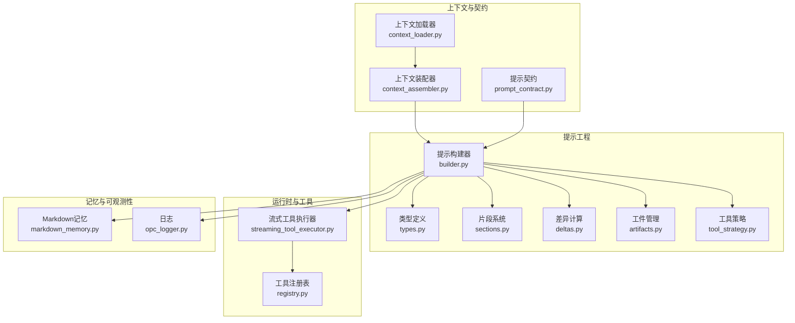
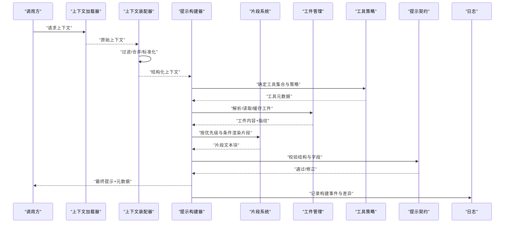
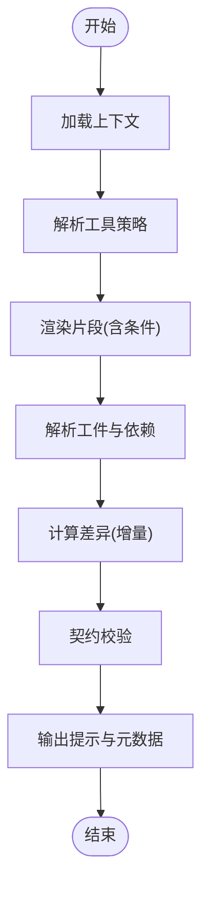
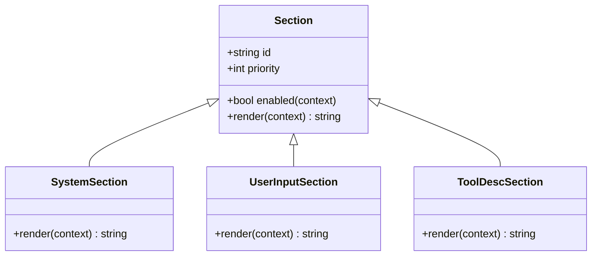
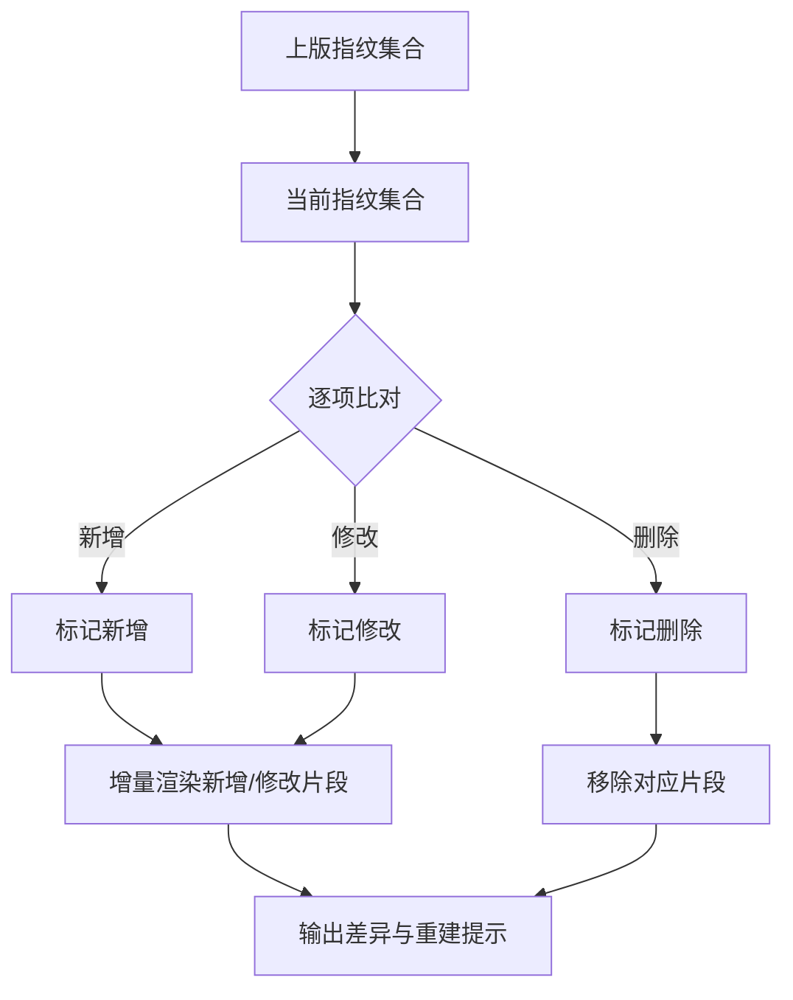
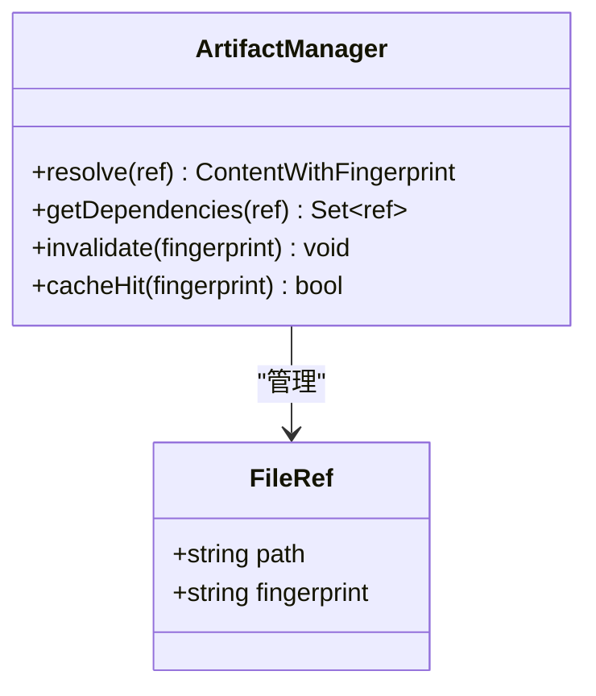
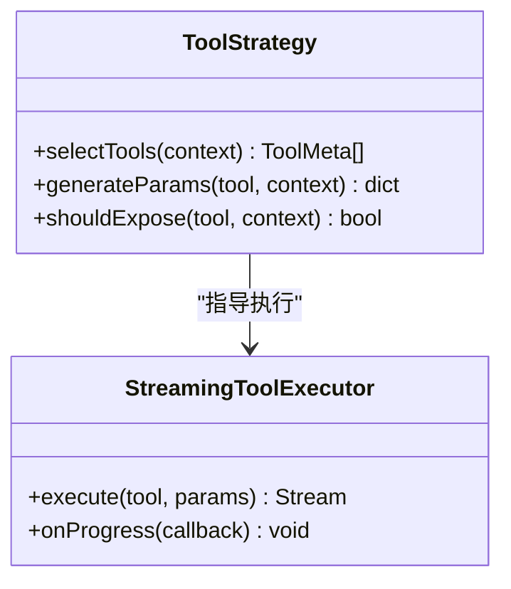
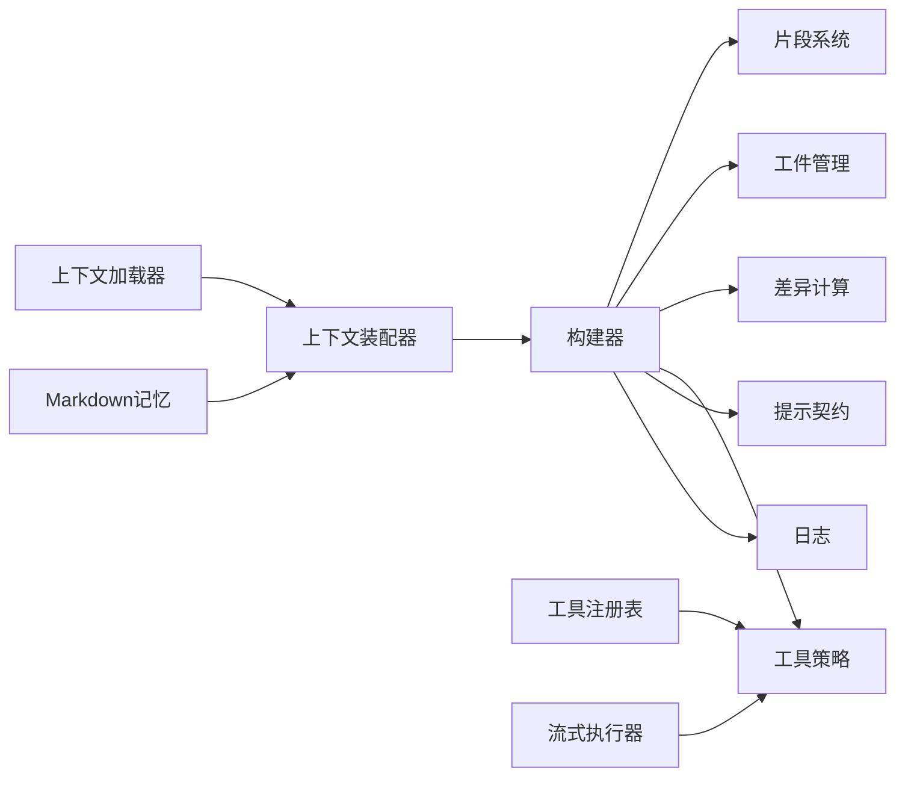

# 提示工程框架

<cite>
**本文引用的文件**   
- [prompt_harness/builder.py](file://opc/layer3_agent/prompt_harness/builder.py)
- [prompt_harness/artifacts.py](file://opc/layer3_agent/prompt_harness/artifacts.py)
- [prompt_harness/deltas.py](file://opc/layer3_agent/prompt_harness/deltas.py)
- [prompt_harness/sections.py](file://opc/layer3_agent/prompt_harness/sections.py)
- [prompt_harness/tool_strategy.py](file://opc/layer3_agent/prompt_harness/tool_strategy.py)
- [prompt_harness/types.py](file://opc/layer3_agent/prompt_harness/types.py)
- [layer1_perception/context_assembler.py](file://opc/layer1_perception/context_assembler.py)
- [layer1_perception/context_loader.py](file://opc/layer1_perception/context_loader.py)
- [layer2_organization/prompt_contract.py](file://opc/layer2_organization/prompt_contract.py)
- [layer3_agent/runtime_v2/streaming_tool_executor.py](file://opc/layer3_agent/runtime_v2/streaming_tool_executor.py)
- [layer4_tools/registry.py](file://opc/layer4_tools/registry.py)
- [layer5_memory/markdown_memory.py](file://opc/layer5_memory/markdown_memory.py)
- [layer6_observability/opc_logger.py](file://opc/layer6_observability/opc_logger.py)
- [tests/test_prompt_assembly.py](file://tests/test_prompt_assembly.py)
- [tests/test_prompt_assembly_dedup.py](file://tests/test_prompt_assembly_dedup.py)
- [tests/test_prompt_harness_builder.py](file://tests/test_prompt_harness_builder.py)
</cite>

## 目录
1. [简介](#简介)
2. [项目结构](#项目结构)
3. [核心组件](#核心组件)
4. [架构总览](#架构总览)
5. [详细组件分析](#详细组件分析)
6. [依赖关系分析](#依赖关系分析)
7. [性能考虑](#性能考虑)
8. [故障排查指南](#故障排查指南)
9. [结论](#结论)
10. [附录：开发指南与最佳实践](#附录开发指南与最佳实践)

## 简介
本文件面向OpenOPC的“提示工程框架”，聚焦于提示构建器、模板管理、片段组装、版本控制与增量更新、工件管理（文件引用、依赖解析、缓存）、工具调用策略与参数生成，并提供可操作的开发指南、调试技巧与优化建议。文档以代码级事实为依据，辅以可视化图示，帮助读者从高层到细节全面理解该框架的设计与实现。

## 项目结构
提示工程相关能力集中在以下模块：
- 提示构建与渲染：prompt_harness（构建器、类型、片段、差异、工件、工具策略）
- 上下文装配：layer1_perception（上下文加载与组装）
- 组织层契约：layer2_organization（提示契约）
- 运行时工具执行：layer3_agent/runtime_v2（流式工具执行）
- 工具注册：layer4_tools（工具注册表）
- 记忆与持久化：layer5_memory（Markdown记忆）
- 可观测性：layer6_observability（日志）

图表来源
- [prompt_harness/builder.py](file://opc/layer3_agent/prompt_harness/builder.py)
- [prompt_harness/types.py](file://opc/layer3_agent/prompt_harness/types.py)
- [prompt_harness/sections.py](file://opc/layer3_agent/prompt_harness/sections.py)
- [prompt_harness/deltas.py](file://opc/layer3_agent/prompt_harness/deltas.py)
- [prompt_harness/artifacts.py](file://opc/layer3_agent/prompt_harness/artifacts.py)
- [prompt_harness/tool_strategy.py](file://opc/layer3_agent/prompt_harness/tool_strategy.py)
- [layer1_perception/context_assembler.py](file://opc/layer1_perception/context_assembler.py)
- [layer1_perception/context_loader.py](file://opc/layer1_perception/context_loader.py)
- [layer2_organization/prompt_contract.py](file://opc/layer2_organization/prompt_contract.py)
- [layer3_agent/runtime_v2/streaming_tool_executor.py](file://opc/layer3_agent/runtime_v2/streaming_tool_executor.py)
- [layer4_tools/registry.py](file://opc/layer4_tools/registry.py)
- [layer5_memory/markdown_memory.py](file://opc/layer5_memory/markdown_memory.py)
- [layer6_observability/opc_logger.py](file://opc/layer6_observability/opc_logger.py)

章节来源
- [prompt_harness/builder.py](file://opc/layer3_agent/prompt_harness/builder.py)
- [prompt_harness/types.py](file://opc/layer3_agent/prompt_harness/types.py)
- [prompt_harness/sections.py](file://opc/layer3_agent/prompt_harness/sections.py)
- [prompt_harness/deltas.py](file://opc/layer3_agent/prompt_harness/deltas.py)
- [prompt_harness/artifacts.py](file://opc/layer3_agent/prompt_harness/artifacts.py)
- [prompt_harness/tool_strategy.py](file://opc/layer3_agent/prompt_harness/tool_strategy.py)
- [layer1_perception/context_assembler.py](file://opc/layer1_perception/context_assembler.py)
- [layer1_perception/context_loader.py](file://opc/layer1_perception/context_loader.py)
- [layer2_organization/prompt_contract.py](file://opc/layer2_organization/prompt_contract.py)
- [layer3_agent/runtime_v2/streaming_tool_executor.py](file://opc/layer3_agent/runtime_v2/streaming_tool_executor.py)
- [layer4_tools/registry.py](file://opc/layer4_tools/registry.py)
- [layer5_memory/markdown_memory.py](file://opc/layer5_memory/markdown_memory.py)
- [layer6_observability/opc_logger.py](file://opc/layer6_observability/opc_logger.py)

## 核心组件
- 提示构建器（Builder）：负责将片段、工件、工具策略与上下文组合为最终提示；维护版本与变更追踪；提供增量更新能力。
- 片段系统（Sections）：定义可插拔的提示片段（如系统指令、用户输入、工具说明等），支持条件渲染与优先级排序。
- 差异计算（Deltas）：基于内容哈希或结构化快照对比，识别最小变更集，用于增量渲染与缓存失效。
- 工件管理（Artifacts）：管理外部文件、资源与依赖的引用、解析与缓存，确保提示中嵌入内容的稳定性与一致性。
- 工具策略（Tool Strategy）：决定何时、如何以及以何种粒度向模型暴露工具描述与调用约定，并参与参数生成。
- 类型定义（Types）：统一数据结构，包括片段、工件、差异、构建结果等。
- 上下文装配（Context Assembler/Loader）：在构建前收集会话、任务、组织配置等上下文，注入到构建流程。
- 提示契约（Prompt Contract）：约束提示的结构、字段与语义，保证跨模块一致性与可测试性。
- 流式工具执行（Streaming Tool Executor）：与提示构建协同，按策略动态调整工具可见性与参数。
- 工具注册表（Registry）：集中注册与发现工具，供策略与执行器使用。
- Markdown记忆（Markdown Memory）：持久化历史与摘要，作为提示上下文的来源之一。
- 日志（Logger）：记录构建过程、差异与错误，便于调试与审计。

章节来源
- [prompt_harness/builder.py](file://opc/layer3_agent/prompt_harness/builder.py)
- [prompt_harness/sections.py](file://opc/layer3_agent/prompt_harness/sections.py)
- [prompt_harness/deltas.py](file://opc/layer3_agent/prompt_harness/deltas.py)
- [prompt_harness/artifacts.py](file://opc/layer3_agent/prompt_harness/artifacts.py)
- [prompt_harness/tool_strategy.py](file://opc/layer3_agent/prompt_harness/tool_strategy.py)
- [prompt_harness/types.py](file://opc/layer3_agent/prompt_harness/types.py)
- [layer1_perception/context_assembler.py](file://opc/layer1_perception/context_assembler.py)
- [layer1_perception/context_loader.py](file://opc/layer1_perception/context_loader.py)
- [layer2_organization/prompt_contract.py](file://opc/layer2_organization/prompt_contract.py)
- [layer3_agent/runtime_v2/streaming_tool_executor.py](file://opc/layer3_agent/runtime_v2/streaming_tool_executor.py)
- [layer4_tools/registry.py](file://opc/layer4_tools/registry.py)
- [layer5_memory/markdown_memory.py](file://opc/layer5_memory/markdown_memory.py)
- [layer6_observability/opc_logger.py](file://opc/layer6_observability/opc_logger.py)

## 架构总览
提示构建流程由上下文驱动，经构建器编排片段与工件，结合工具策略生成最终提示；差异与工件缓存保障增量更新效率；契约校验确保输出稳定；日志贯穿全链路。

图表来源
- [layer1_perception/context_loader.py](file://opc/layer1_perception/context_loader.py)
- [layer1_perception/context_assembler.py](file://opc/layer1_perception/context_assembler.py)
- [prompt_harness/builder.py](file://opc/layer3_agent/prompt_harness/builder.py)
- [prompt_harness/sections.py](file://opc/layer3_agent/prompt_harness/sections.py)
- [prompt_harness/artifacts.py](file://opc/layer3_agent/prompt_harness/artifacts.py)
- [prompt_harness/tool_strategy.py](file://opc/layer3_agent/prompt_harness/tool_strategy.py)
- [layer2_organization/prompt_contract.py](file://opc/layer2_organization/prompt_contract.py)
- [layer6_observability/opc_logger.py](file://opc/layer6_observability/opc_logger.py)

## 详细组件分析

### 提示构建器（Builder）
职责
- 协调上下文、片段、工件与工具策略，生成最终提示。
- 维护版本信息（如构建ID、时间戳、依赖指纹）。
- 计算差异（与上次构建相比），支持增量更新。
- 触发契约校验与日志记录。

关键流程
- 初始化：加载上下文、策略、片段与工件管理器。
- 构建：遍历片段，应用条件渲染；解析工件并写入缓存；整合工具描述。
- 校验：依据契约检查必需字段与格式。
- 输出：返回提示文本与元数据（版本、差异、工件清单）。

图表来源
- [prompt_harness/builder.py](file://opc/layer3_agent/prompt_harness/builder.py)
- [prompt_harness/sections.py](file://opc/layer3_agent/prompt_harness/sections.py)
- [prompt_harness/artifacts.py](file://opc/layer3_agent/prompt_harness/artifacts.py)
- [prompt_harness/deltas.py](file://opc/layer3_agent/prompt_harness/deltas.py)
- [prompt_harness/tool_strategy.py](file://opc/layer3_agent/prompt_harness/tool_strategy.py)
- [layer2_organization/prompt_contract.py](file://opc/layer2_organization/prompt_contract.py)

章节来源
- [prompt_harness/builder.py](file://opc/layer3_agent/prompt_harness/builder.py)
- [prompt_harness/sections.py](file://opc/layer3_agent/prompt_harness/sections.py)
- [prompt_harness/artifacts.py](file://opc/layer3_agent/prompt_harness/artifacts.py)
- [prompt_harness/deltas.py](file://opc/layer3_agent/prompt_harness/deltas.py)
- [prompt_harness/tool_strategy.py](file://opc/layer3_agent/prompt_harness/tool_strategy.py)
- [layer2_organization/prompt_contract.py](file://opc/layer2_organization/prompt_contract.py)

### 片段系统（Sections）
设计要点
- 片段类型：系统指令、用户输入、工具说明、上下文摘要等。
- 条件渲染：基于上下文键、角色、阶段或策略开关决定是否包含。
- 优先级与顺序：保证关键片段优先渲染，避免被后续覆盖。
- 可扩展：新增片段只需注册类型与渲染逻辑。

图表来源
- [prompt_harness/sections.py](file://opc/layer3_agent/prompt_harness/sections.py)

章节来源
- [prompt_harness/sections.py](file://opc/layer3_agent/prompt_harness/sections.py)

### 差异计算（Deltas）
算法思路
- 对片段与工件生成稳定指纹（如内容哈希或结构化快照）。
- 比较当前与上次构建的指纹集合，得到新增、修改、删除项。
- 仅重新渲染受影响片段，复用未变部分，提升增量更新性能。

图表来源
- [prompt_harness/deltas.py](file://opc/layer3_agent/prompt_harness/deltas.py)

章节来源
- [prompt_harness/deltas.py](file://opc/layer3_agent/prompt_harness/deltas.py)

### 工件管理（Artifacts）
功能
- 文件引用：以路径或标识符引用外部文件、资源。
- 依赖解析：解析间接依赖（如导入链），构建依赖图。
- 缓存策略：基于内容指纹缓存已解析内容，命中则直接返回，减少IO。
- 一致性：确保同一工件在不同构建中内容稳定。

图表来源
- [prompt_harness/artifacts.py](file://opc/layer3_agent/prompt_harness/artifacts.py)

章节来源
- [prompt_harness/artifacts.py](file://opc/layer3_agent/prompt_harness/artifacts.py)

### 工具策略（Tool Strategy）
目标
- 根据上下文与阶段选择工具子集，控制提示中的工具描述长度。
- 生成参数模板与默认值，辅助调用方构造参数。
- 与流式执行器协作，动态调整工具可见性与调用方式。

图表来源
- [prompt_harness/tool_strategy.py](file://opc/layer3_agent/prompt_harness/tool_strategy.py)
- [layer3_agent/runtime_v2/streaming_tool_executor.py](file://opc/layer3_agent/runtime_v2/streaming_tool_executor.py)

章节来源
- [prompt_harness/tool_strategy.py](file://opc/layer3_agent/prompt_harness/tool_strategy.py)
- [layer3_agent/runtime_v2/streaming_tool_executor.py](file://opc/layer3_agent/runtime_v2/streaming_tool_executor.py)

### 类型定义（Types）
作用
- 统一定义片段、工件、差异、构建结果等数据结构，确保各模块间一致。
- 提供序列化/反序列化能力，便于存储与传输。

章节来源
- [prompt_harness/types.py](file://opc/layer3_agent/prompt_harness/types.py)

### 上下文装配（Context Assembler/Loader）
职责
- 加载会话、任务、组织配置等原始上下文。
- 清洗、合并、标准化后提供给构建器。
- 与记忆模块交互，获取历史摘要与偏好。

章节来源
- [layer1_perception/context_loader.py](file://opc/layer1_perception/context_loader.py)
- [layer1_perception/context_assembler.py](file://opc/layer1_perception/context_assembler.py)
- [layer5_memory/markdown_memory.py](file://opc/layer5_memory/markdown_memory.py)

### 提示契约（Prompt Contract）
职责
- 定义提示的最小结构、必填字段与约束。
- 在构建完成后进行校验，失败时给出修复建议或回退策略。

章节来源
- [layer2_organization/prompt_contract.py](file://opc/layer2_organization/prompt_contract.py)

### 工具注册表（Registry）
职责
- 集中注册工具元数据与实现。
- 供策略与执行器查询与发现。

章节来源
- [layer4_tools/registry.py](file://opc/layer4_tools/registry.py)

## 依赖关系分析
- 构建器强耦合片段系统与工件管理，弱耦合上下文装配与契约校验。
- 工具策略与执行器解耦，通过元数据与回调通信。
- 差异计算依赖稳定的指纹生成，受工件与片段影响。
- 记忆与日志为横切关注点，贯穿构建全流程。

图表来源
- [prompt_harness/builder.py](file://opc/layer3_agent/prompt_harness/builder.py)
- [prompt_harness/sections.py](file://opc/layer3_agent/prompt_harness/sections.py)
- [prompt_harness/artifacts.py](file://opc/layer3_agent/prompt_harness/artifacts.py)
- [prompt_harness/deltas.py](file://opc/layer3_agent/prompt_harness/deltas.py)
- [prompt_harness/tool_strategy.py](file://opc/layer3_agent/prompt_harness/tool_strategy.py)
- [layer2_organization/prompt_contract.py](file://opc/layer2_organization/prompt_contract.py)
- [layer1_perception/context_assembler.py](file://opc/layer1_perception/context_assembler.py)
- [layer1_perception/context_loader.py](file://opc/layer1_perception/context_loader.py)
- [layer3_agent/runtime_v2/streaming_tool_executor.py](file://opc/layer3_agent/runtime_v2/streaming_tool_executor.py)
- [layer4_tools/registry.py](file://opc/layer4_tools/registry.py)
- [layer5_memory/markdown_memory.py](file://opc/layer5_memory/markdown_memory.py)
- [layer6_observability/opc_logger.py](file://opc/layer6_observability/opc_logger.py)

章节来源
- [prompt_harness/builder.py](file://opc/layer3_agent/prompt_harness/builder.py)
- [prompt_harness/sections.py](file://opc/layer3_agent/prompt_harness/sections.py)
- [prompt_harness/artifacts.py](file://opc/layer3_agent/prompt_harness/artifacts.py)
- [prompt_harness/deltas.py](file://opc/layer3_agent/prompt_harness/deltas.py)
- [prompt_harness/tool_strategy.py](file://opc/layer3_agent/prompt_harness/tool_strategy.py)
- [layer2_organization/prompt_contract.py](file://opc/layer2_organization/prompt_contract.py)
- [layer1_perception/context_assembler.py](file://opc/layer1_perception/context_assembler.py)
- [layer1_perception/context_loader.py](file://opc/layer1_perception/context_loader.py)
- [layer3_agent/runtime_v2/streaming_tool_executor.py](file://opc/layer3_agent/runtime_v2/streaming_tool_executor.py)
- [layer4_tools/registry.py](file://opc/layer4_tools/registry.py)
- [layer5_memory/markdown_memory.py](file://opc/layer5_memory/markdown_memory.py)
- [layer6_observability/opc_logger.py](file://opc/layer6_observability/opc_logger.py)

## 性能考虑
- 增量更新：利用差异计算仅重绘变化片段，显著降低CPU与I/O开销。
- 工件缓存：基于内容指纹命中缓存，避免重复读取大文件或解析依赖。
- 工具裁剪：策略按需选择工具描述，控制提示长度与模型处理成本。
- 片段去重：对相同内容与指纹的片段进行去重，减少冗余。
- 并行渲染：片段渲染可并行化（无共享状态前提下），缩短构建延迟。
- 记忆压缩：对历史摘要进行压缩与分页，减少上下文窗口占用。

[本节为通用性能建议，不直接分析具体文件]

## 故障排查指南
常见问题与定位方法
- 构建失败：查看契约校验错误与日志，确认缺失字段或格式异常。
- 提示过长：检查工具策略是否过度暴露工具描述，适当裁剪。
- 增量无效：核对指纹生成是否稳定，确认差异计算是否正确识别变更。
- 工件不一致：检查缓存键与内容指纹是否匹配，必要时强制失效。
- 工具调用异常：核对工具注册表与策略选择，确认参数模板正确。

定位步骤
- 启用详细日志，捕获构建前后指纹与差异。
- 打印片段渲染顺序与条件判断结果。
- 验证工件依赖图与缓存命中情况。
- 使用最小上下文复现问题，逐步缩小范围。

章节来源
- [layer6_observability/opc_logger.py](file://opc/layer6_observability/opc_logger.py)
- [layer2_organization/prompt_contract.py](file://opc/layer2_organization/prompt_contract.py)
- [prompt_harness/deltas.py](file://opc/layer3_agent/prompt_harness/deltas.py)
- [prompt_harness/artifacts.py](file://opc/layer3_agent/prompt_harness/artifacts.py)
- [prompt_harness/tool_strategy.py](file://opc/layer3_agent/prompt_harness/tool_strategy.py)
- [layer4_tools/registry.py](file://opc/layer4_tools/registry.py)

## 结论
OpenOPC提示工程框架通过构建器、片段系统、工件管理与差异计算，实现了高内聚、低耦合的提示组装流水线。配合工具策略与契约校验，既保证了提示质量与一致性，又提供了良好的扩展性与性能。建议在业务场景中充分利用增量更新与缓存机制，并结合日志与测试用例持续优化。

[本节为总结性内容，不直接分析具体文件]

## 附录：开发指南与最佳实践

- 自定义片段
  - 继承片段基类，实现条件渲染与优先级设置。
  - 在构建器中注册新片段类型，确保顺序与依赖正确。
  - 参考现有片段实现，保持命名与结构一致。

- 条件渲染
  - 基于上下文键、角色、阶段或策略开关控制片段可见性。
  - 避免复杂嵌套条件，保持可读性与可测试性。

- 调试技巧
  - 开启详细日志，观察构建事件、差异与错误堆栈。
  - 打印片段渲染前后的内容指纹，定位不稳定因素。
  - 使用最小上下文与单一样例复现问题。

- 提示优化技术
  - 合理裁剪工具描述，仅暴露必要工具。
  - 对长上下文进行摘要与分页，控制窗口大小。
  - 使用去重与缓存减少重复计算。

- 示例与测试
  - 参考测试用例了解典型用法与边界场景。
  - 为新片段与策略编写单元测试，覆盖条件分支与异常路径。

章节来源
- [tests/test_prompt_assembly.py](file://tests/test_prompt_assembly.py)
- [tests/test_prompt_assembly_dedup.py](file://tests/test_prompt_assembly_dedup.py)
- [tests/test_prompt_harness_builder.py](file://tests/test_prompt_harness_builder.py)