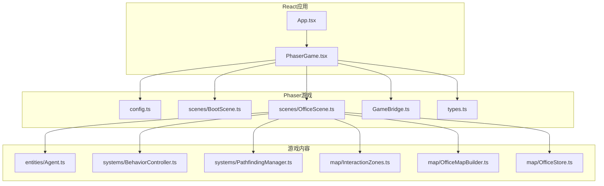
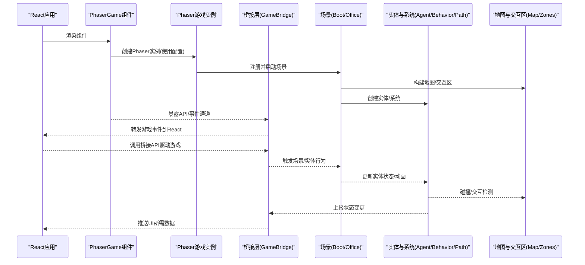
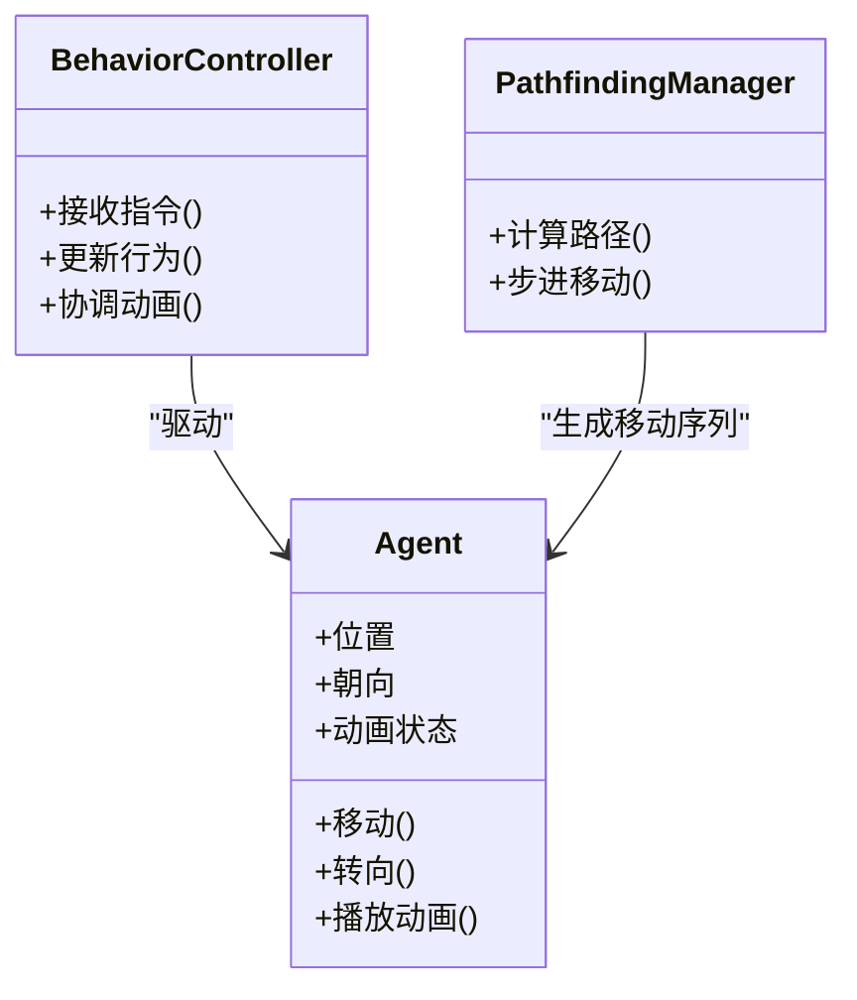
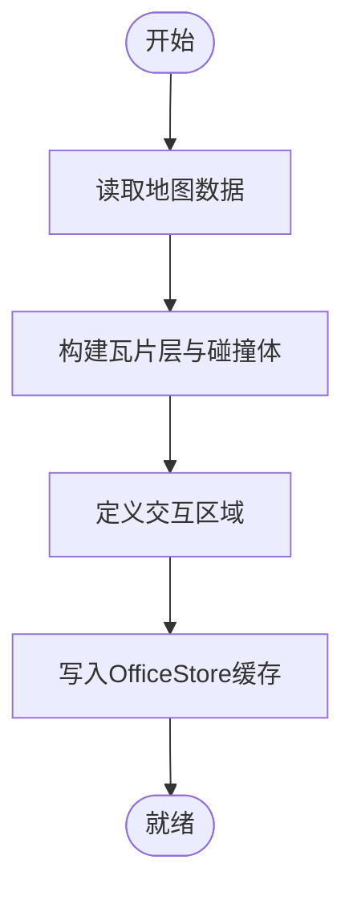
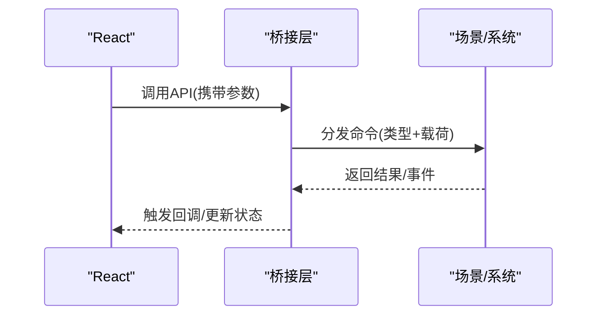
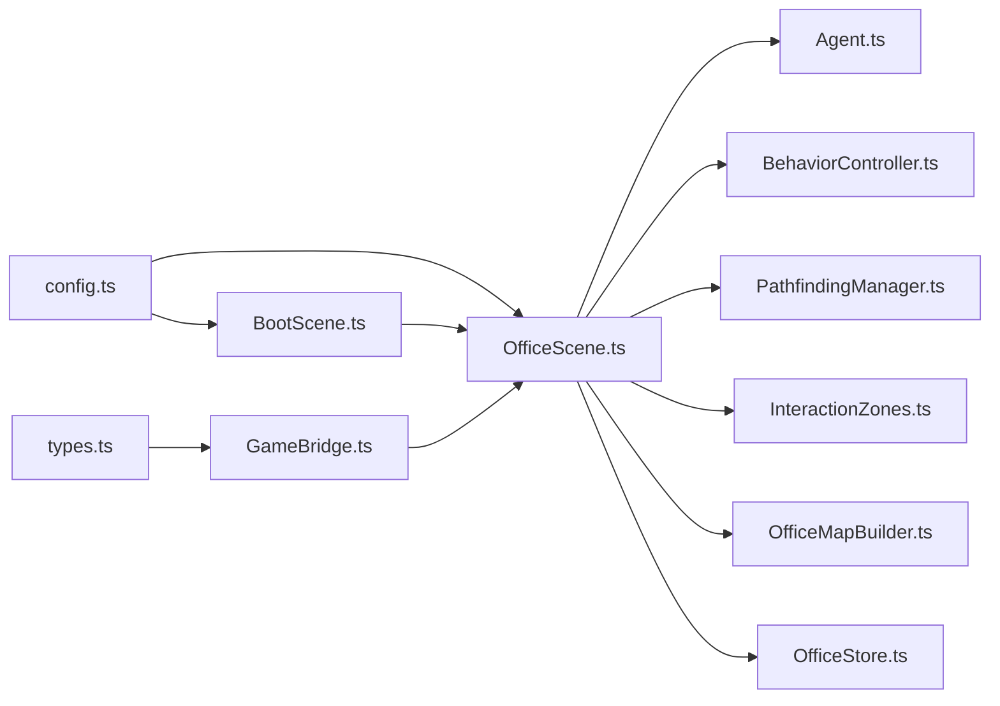

# Phaser游戏引擎集成

<cite>
**本文引用的文件**   
- [PhaserGame.tsx](file://opc/plugins/office_ui/frontend_src/game/PhaserGame.tsx)
- [config.ts](file://opc/plugins/office_ui/frontend_src/game/config.ts)
- [BootScene.ts](file://opc/plugins/office_ui/frontend_src/game/scenes/BootScene.ts)
- [OfficeScene.ts](file://opc/plugins/office_ui/frontend_src/game/scenes/OfficeScene.ts)
- [Agent.ts](file://opc/plugins/office_ui/frontend_src/game/entities/Agent.ts)
- [BehaviorController.ts](file://opc/plugins/office_ui/frontend_src/game/systems/BehaviorController.ts)
- [PathfindingManager.ts](file://opc/plugins/office_ui/frontend_src/game/systems/PathfindingManager.ts)
- [InteractionZones.ts](file://opc/plugins/office_ui/frontend_src/game/map/InteractionZones.ts)
- [OfficeMapBuilder.ts](file://opc/plugins/office_ui/frontend_src/game/map/OfficeMapBuilder.ts)
- [OfficeStore.ts](file://opc/plugins/office_ui/frontend_src/game/map/OfficeStore.ts)
- [GameBridge.ts](file://opc/plugins/office_ui/frontend_src/game/GameBridge.ts)
- [types.ts](file://opc/plugins/office_ui/frontend_src/game/types.ts)
</cite>

## 目录
1. [简介](#简介)
2. [项目结构](#项目结构)
3. [核心组件](#核心组件)
4. [架构总览](#架构总览)
5. [详细组件分析](#详细组件分析)
6. [依赖关系分析](#依赖关系分析)
7. [性能考虑](#性能考虑)
8. [故障排查指南](#故障排查指南)
9. [结论](#结论)
10. [附录](#附录)

## 简介
本文件面向在React应用中集成Phaser.js的开发者，围绕以下目标提供系统化文档：
- React与Phaser.js的集成架构、生命周期管理与状态同步机制
- 游戏场景初始化流程（配置参数、资源加载、场景管理）
- 桥接层设计（React与Phaser之间的通信协议与数据传递）
- 游戏循环处理机制与性能优化策略
- 完整的游戏场景开发指南（实体创建、动画系统、输入处理）
- 游戏状态的持久化保存与恢复机制
- 调试工具与性能监控方法

## 项目结构
前端游戏子系统位于 office_ui 插件的前端源码中，采用“按功能域组织”的结构：
- game：Phaser游戏核心（入口组件、配置、场景、实体、系统、地图、桥接、类型定义）
- chat、kanban、org、workspace：UI面板与业务逻辑
- stores：全局状态存储
- lib：通用库（WebSocket客户端、会话与任务辅助等）

图表来源
- [PhaserGame.tsx](file://opc/plugins/office_ui/frontend_src/game/PhaserGame.tsx)
- [config.ts](file://opc/plugins/office_ui/frontend_src/game/config.ts)
- [BootScene.ts](file://opc/plugins/office_ui/frontend_src/game/scenes/BootScene.ts)
- [OfficeScene.ts](file://opc/plugins/office_ui/frontend_src/game/scenes/OfficeScene.ts)
- [GameBridge.ts](file://opc/plugins/office_ui/frontend_src/game/GameBridge.ts)
- [types.ts](file://opc/plugins/office_ui/frontend_src/game/types.ts)
- [Agent.ts](file://opc/plugins/office_ui/frontend_src/game/entities/Agent.ts)
- [BehaviorController.ts](file://opc/plugins/office_ui/frontend_src/game/systems/BehaviorController.ts)
- [PathfindingManager.ts](file://opc/plugins/office_ui/frontend_src/game/systems/PathfindingManager.ts)
- [InteractionZones.ts](file://opc/plugins/office_ui/frontend_src/game/map/InteractionZones.ts)
- [OfficeMapBuilder.ts](file://opc/plugins/office_ui/frontend_src/game/map/OfficeMapBuilder.ts)
- [OfficeStore.ts](file://opc/plugins/office_ui/frontend_src/game/map/OfficeStore.ts)

章节来源
- [PhaserGame.tsx](file://opc/plugins/office_ui/frontend_src/game/PhaserGame.tsx)
- [config.ts](file://opc/plugins/office_ui/frontend_src/game/config.ts)
- [BootScene.ts](file://opc/plugins/office_ui/frontend_src/game/scenes/BootScene.ts)
- [OfficeScene.ts](file://opc/plugins/office_ui/frontend_src/game/scenes/OfficeScene.ts)
- [GameBridge.ts](file://opc/plugins/office_ui/frontend_src/game/GameBridge.ts)
- [types.ts](file://opc/plugins/office_ui/frontend_src/game/types.ts)
- [Agent.ts](file://opc/plugins/office_ui/frontend_src/game/entities/Agent.ts)
- [BehaviorController.ts](file://opc/plugins/office_ui/frontend_src/game/systems/BehaviorController.ts)
- [PathfindingManager.ts](file://opc/plugins/office_ui/frontend_src/game/systems/PathfindingManager.ts)
- [InteractionZones.ts](file://opc/plugins/office_ui/frontend_src/game/map/InteractionZones.ts)
- [OfficeMapBuilder.ts](file://opc/plugins/office_ui/frontend_src/game/map/OfficeMapBuilder.ts)
- [OfficeStore.ts](file://opc/plugins/office_ui/frontend_src/game/map/OfficeStore.ts)

## 核心组件
- React集成组件：负责挂载Phaser实例、生命周期管理、事件订阅与状态同步。
- 配置模块：集中管理Phaser运行参数、渲染器设置、场景注册与资源路径。
- 场景系统：启动场景负责预加载资源；办公场景承载主交互逻辑。
- 桥接层：统一React与Phaser之间的消息协议，实现双向通信。
- 实体与系统：实体封装角色对象；系统负责行为控制与寻路。
- 地图与交互区：构建地图、划分交互区域并维护空间索引。
- 类型定义：为桥接消息、实体属性、场景数据提供TS类型约束。

章节来源
- [PhaserGame.tsx](file://opc/plugins/office_ui/frontend_src/game/PhaserGame.tsx)
- [config.ts](file://opc/plugins/office_ui/frontend_src/game/config.ts)
- [BootScene.ts](file://opc/plugins/office_ui/frontend_src/game/scenes/BootScene.ts)
- [OfficeScene.ts](file://opc/plugins/office_ui/frontend_src/game/scenes/OfficeScene.ts)
- [GameBridge.ts](file://opc/plugins/office_ui/frontend_src/game/GameBridge.ts)
- [types.ts](file://opc/plugins/office_ui/frontend_src/game/types.ts)
- [Agent.ts](file://opc/plugins/office_ui/frontend_src/game/entities/Agent.ts)
- [BehaviorController.ts](file://opc/plugins/office_ui/frontend_src/game/systems/BehaviorController.ts)
- [PathfindingManager.ts](file://opc/plugins/office_ui/frontend_src/game/systems/PathfindingManager.ts)
- [InteractionZones.ts](file://opc/plugins/office_ui/frontend_src/game/map/InteractionZones.ts)
- [OfficeMapBuilder.ts](file://opc/plugins/office_ui/frontend_src/game/map/OfficeMapBuilder.ts)
- [OfficeStore.ts](file://opc/plugins/office_ui/frontend_src/game/map/OfficeStore.ts)

## 架构总览
下图展示了React与Phaser的集成边界、数据流向与关键职责分工。

图表来源
- [PhaserGame.tsx](file://opc/plugins/office_ui/frontend_src/game/PhaserGame.tsx)
- [config.ts](file://opc/plugins/office_ui/frontend_src/game/config.ts)
- [BootScene.ts](file://opc/plugins/office_ui/frontend_src/game/scenes/BootScene.ts)
- [OfficeScene.ts](file://opc/plugins/office_ui/frontend_src/game/scenes/OfficeScene.ts)
- [GameBridge.ts](file://opc/plugins/office_ui/frontend_src/game/GameBridge.ts)
- [Agent.ts](file://opc/plugins/office_ui/frontend_src/game/entities/Agent.ts)
- [BehaviorController.ts](file://opc/plugins/office_ui/frontend_src/game/systems/BehaviorController.ts)
- [PathfindingManager.ts](file://opc/plugins/office_ui/frontend_src/game/systems/PathfindingManager.ts)
- [InteractionZones.ts](file://opc/plugins/office_ui/frontend_src/game/map/InteractionZones.ts)
- [OfficeMapBuilder.ts](file://opc/plugins/office_ui/frontend_src/game/map/OfficeMapBuilder.ts)

## 详细组件分析

### React与Phaser集成组件
- 职责
  - 在React生命周期中创建/销毁Phaser实例
  - 注入配置、注册场景、挂载桥接层
  - 监听Phaser事件并同步至React状态
  - 将React侧操作通过桥接层下发到游戏
- 关键点
  - 避免重复创建实例，确保清理DOM与事件
  - 将Phaser上下文安全地传递给场景与系统
  - 对高频事件进行节流/合并，降低React重渲染压力

章节来源
- [PhaserGame.tsx](file://opc/plugins/office_ui/frontend_src/game/PhaserGame.tsx)
- [GameBridge.ts](file://opc/plugins/office_ui/frontend_src/game/GameBridge.ts)
- [types.ts](file://opc/plugins/office_ui/frontend_src/game/types.ts)

### 配置模块
- 职责
  - 集中Phaser运行参数（分辨率、缩放、渲染器类型、物理系统等）
  - 注册场景列表与默认场景
  - 定义资源路径与加载策略
- 关键点
  - 将环境差异（如跨平台）抽象为可配置项
  - 为调试模式提供额外开关（如显示FPS、网格线）

章节来源
- [config.ts](file://opc/plugins/office_ui/frontend_src/game/config.ts)

### 启动场景（BootScene）
- 职责
  - 预加载公共资源（图片、音频、字体、瓦片图等）
  - 校验资源完整性，失败时给出降级或重试策略
  - 完成后切换到主场景
- 关键点
  - 资源分组与并发控制
  - 进度反馈与错误上报

章节来源
- [BootScene.ts](file://opc/plugins/office_ui/frontend_src/game/scenes/BootScene.ts)

### 办公场景（OfficeScene）
- 职责
  - 构建地图与交互区域
  - 初始化实体与系统（行为控制器、寻路管理器）
  - 处理用户输入与交互事件
  - 驱动游戏循环中的更新与渲染
- 关键点
  - 将地图构建与交互区解耦，便于复用与测试
  - 通过桥接层向React广播关键状态变化

章节来源
- [OfficeScene.ts](file://opc/plugins/office_ui/frontend_src/game/scenes/OfficeScene.ts)
- [OfficeMapBuilder.ts](file://opc/plugins/office_ui/frontend_src/game/map/OfficeMapBuilder.ts)
- [InteractionZones.ts](file://opc/plugins/office_ui/frontend_src/game/map/InteractionZones.ts)
- [Agent.ts](file://opc/plugins/office_ui/frontend_src/game/entities/Agent.ts)
- [BehaviorController.ts](file://opc/plugins/office_ui/frontend_src/game/systems/BehaviorController.ts)
- [PathfindingManager.ts](file://opc/plugins/office_ui/frontend_src/game/systems/PathfindingManager.ts)

### 实体与系统
- 实体（Agent）
  - 封装角色的位置、朝向、动画帧、状态机
  - 提供移动、转向、播放动画等基础能力
- 行为控制器（BehaviorController）
  - 根据外部指令或内部状态机驱动实体行为
  - 协调动画切换与动作序列
- 寻路管理器（PathfindingManager）
  - 计算从起点到终点的路径
  - 与实体协作，逐步推进移动

图表来源
- [Agent.ts](file://opc/plugins/office_ui/frontend_src/game/entities/Agent.ts)
- [BehaviorController.ts](file://opc/plugins/office_ui/frontend_src/game/systems/BehaviorController.ts)
- [PathfindingManager.ts](file://opc/plugins/office_ui/frontend_src/game/systems/PathfindingManager.ts)

章节来源
- [Agent.ts](file://opc/plugins/office_ui/frontend_src/game/entities/Agent.ts)
- [BehaviorController.ts](file://opc/plugins/office_ui/frontend_src/game/systems/BehaviorController.ts)
- [PathfindingManager.ts](file://opc/plugins/office_ui/frontend_src/game/systems/PathfindingManager.ts)

### 地图与交互区
- 地图构建（OfficeMapBuilder）
  - 解析地图数据，生成瓦片层与碰撞体
  - 输出供交互区使用的几何信息
- 交互区（InteractionZones）
  - 定义可交互区域集合
  - 提供点是否在区域内、区域间跳转等查询
- 办公室状态（OfficeStore）
  - 缓存地图与交互区的运行时数据
  - 为场景与系统提供只读访问

图表来源
- [OfficeMapBuilder.ts](file://opc/plugins/office_ui/frontend_src/game/map/OfficeMapBuilder.ts)
- [InteractionZones.ts](file://opc/plugins/office_ui/frontend_src/game/map/InteractionZones.ts)
- [OfficeStore.ts](file://opc/plugins/office_ui/frontend_src/game/map/OfficeStore.ts)

章节来源
- [OfficeMapBuilder.ts](file://opc/plugins/office_ui/frontend_src/game/map/OfficeMapBuilder.ts)
- [InteractionZones.ts](file://opc/plugins/office_ui/frontend_src/game/map/InteractionZones.ts)
- [OfficeStore.ts](file://opc/plugins/office_ui/frontend_src/game/map/OfficeStore.ts)

### 桥接层（React ↔ Phaser）
- 职责
  - 定义统一的通信协议（消息类型、载荷结构）
  - 提供React可调用的API（如发起对话、切换视角、触发行为）
  - 将Phaser事件转换为React友好的数据结构
- 设计要点
  - 单向事件流优先，命令式API用于React→Phaser
  - 批量/节流上报，避免频繁重渲染
  - 类型安全：基于types.ts约束消息形状

图表来源
- [GameBridge.ts](file://opc/plugins/office_ui/frontend_src/game/GameBridge.ts)
- [types.ts](file://opc/plugins/office_ui/frontend_src/game/types.ts)

章节来源
- [GameBridge.ts](file://opc/plugins/office_ui/frontend_src/game/GameBridge.ts)
- [types.ts](file://opc/plugins/office_ui/frontend_src/game/types.ts)

## 依赖关系分析
- 低耦合高内聚
  - 场景仅依赖配置与桥接层，不直接耦合React
  - 实体与系统通过接口交互，便于替换实现
- 外部依赖
  - Phaser引擎（渲染、物理、输入、动画、场景）
  - TypeScript类型系统保障契约
- 潜在风险
  - 桥接层消息膨胀导致维护成本上升
  - 高频事件未做节流可能引发性能问题

图表来源
- [config.ts](file://opc/plugins/office_ui/frontend_src/game/config.ts)
- [BootScene.ts](file://opc/plugins/office_ui/frontend_src/game/scenes/BootScene.ts)
- [OfficeScene.ts](file://opc/plugins/office_ui/frontend_src/game/scenes/OfficeScene.ts)
- [Agent.ts](file://opc/plugins/office_ui/frontend_src/game/entities/Agent.ts)
- [BehaviorController.ts](file://opc/plugins/office_ui/frontend_src/game/systems/BehaviorController.ts)
- [PathfindingManager.ts](file://opc/plugins/office_ui/frontend_src/game/systems/PathfindingManager.ts)
- [InteractionZones.ts](file://opc/plugins/office_ui/frontend_src/game/map/InteractionZones.ts)
- [OfficeMapBuilder.ts](file://opc/plugins/office_ui/frontend_src/game/map/OfficeMapBuilder.ts)
- [OfficeStore.ts](file://opc/plugins/office_ui/frontend_src/game/map/OfficeStore.ts)
- [GameBridge.ts](file://opc/plugins/office_ui/frontend_src/game/GameBridge.ts)
- [types.ts](file://opc/plugins/office_ui/frontend_src/game/types.ts)

章节来源
- [config.ts](file://opc/plugins/office_ui/frontend_src/game/config.ts)
- [BootScene.ts](file://opc/plugins/office_ui/frontend_src/game/scenes/BootScene.ts)
- [OfficeScene.ts](file://opc/plugins/office_ui/frontend_src/game/scenes/OfficeScene.ts)
- [GameBridge.ts](file://opc/plugins/office_ui/frontend_src/game/GameBridge.ts)
- [types.ts](file://opc/plugins/office_ui/frontend_src/game/types.ts)

## 性能考虑
- 渲染与更新
  - 合理设置渲染器与物理系统，关闭不必要的调试绘制
  - 使用对象池减少频繁分配与GC抖动
- 事件与状态同步
  - 对高频事件进行节流/合并，批量上报给React
  - 仅在必要字段变化时触发UI更新
- 资源与内存
  - 资源按需加载与卸载，避免一次性全部载入
  - 复用纹理与图集，减少显存占用
- 算法与数据结构
  - 寻路与碰撞检测使用合适的数据结构（如四叉树/网格）
  - 限制每帧计算量，必要时分帧执行

[本节为通用指导，无需代码来源]

## 故障排查指南
- 常见问题定位
  - 资源加载失败：检查资源路径与网络可达性，确认BootScene的错误分支是否上报
  - 场景切换异常：确认场景注册顺序与默认场景设置
  - 桥接通信无响应：核对消息类型与载荷是否符合types.ts约定
  - 实体不移动/动画不播放：检查行为控制器指令与动画状态机
- 建议手段
  - 启用调试模式（如显示FPS、网格、碰撞体）
  - 在桥接层增加日志与时间戳，区分React与Phaser侧耗时
  - 对关键路径添加断言与单元测试

章节来源
- [BootScene.ts](file://opc/plugins/office_ui/frontend_src/game/scenes/BootScene.ts)
- [GameBridge.ts](file://opc/plugins/office_ui/frontend_src/game/GameBridge.ts)
- [types.ts](file://opc/plugins/office_ui/frontend_src/game/types.ts)

## 结论
通过将Phaser嵌入React组件，并以桥接层作为统一通信契约，实现了清晰的职责分离与良好的可维护性。配合合理的场景初始化、实体与系统设计、以及性能优化策略，可在保证用户体验的同时，快速迭代游戏功能。

[本节为总结性内容，无需代码来源]

## 附录

### 场景初始化流程（步骤说明）
- 准备配置：在配置模块中声明渲染参数、场景列表与资源路径
- 启动场景：BootScene预加载资源，完成后切换到主场景
- 主场景构建：OfficeScene构建地图与交互区，初始化实体与系统
- 桥接接入：React通过桥接层调用游戏API，订阅游戏事件

章节来源
- [config.ts](file://opc/plugins/office_ui/frontend_src/game/config.ts)
- [BootScene.ts](file://opc/plugins/office_ui/frontend_src/game/scenes/BootScene.ts)
- [OfficeScene.ts](file://opc/plugins/office_ui/frontend_src/game/scenes/OfficeScene.ts)
- [GameBridge.ts](file://opc/plugins/office_ui/frontend_src/game/GameBridge.ts)

### 游戏循环与状态同步机制
- 游戏循环由Phaser驱动，场景在update阶段更新实体与系统
- 桥接层在关键节点收集状态变更，批量推送至React
- React侧对数据进行去抖与最小化更新，保持界面流畅

章节来源
- [OfficeScene.ts](file://opc/plugins/office_ui/frontend_src/game/scenes/OfficeScene.ts)
- [GameBridge.ts](file://opc/plugins/office_ui/frontend_src/game/GameBridge.ts)

### 实体创建、动画系统与输入处理
- 实体创建：在场景中实例化实体，绑定纹理与初始状态
- 动画系统：为实体注册动画片段，依据行为控制器切换
- 输入处理：捕获键盘/鼠标/触摸事件，转化为高层指令下发至行为控制器

章节来源
- [Agent.ts](file://opc/plugins/office_ui/frontend_src/game/entities/Agent.ts)
- [BehaviorController.ts](file://opc/plugins/office_ui/frontend_src/game/systems/BehaviorController.ts)
- [OfficeScene.ts](file://opc/plugins/office_ui/frontend_src/game/scenes/OfficeScene.ts)

### 状态持久化与恢复
- 持久化策略：将关键状态序列化后存入本地存储或后端
- 恢复流程：应用启动时读取快照，重建场景与实体状态
- 一致性保障：在桥接层记录版本与校验和，防止脏数据

章节来源
- [GameBridge.ts](file://opc/plugins/office_ui/frontend_src/game/GameBridge.ts)
- [types.ts](file://opc/plugins/office_ui/frontend_src/game/types.ts)

### 调试工具与性能监控
- 内置调试：开启渲染调试、碰撞体可视化、路径可视化
- 指标采集：统计FPS、内存峰值、事件频率
- 日志与追踪：在桥接层与关键系统输出结构化日志，便于定位瓶颈

章节来源
- [GameBridge.ts](file://opc/plugins/office_ui/frontend_src/game/GameBridge.ts)
- [OfficeScene.ts](file://opc/plugins/office_ui/frontend_src/game/scenes/OfficeScene.ts)