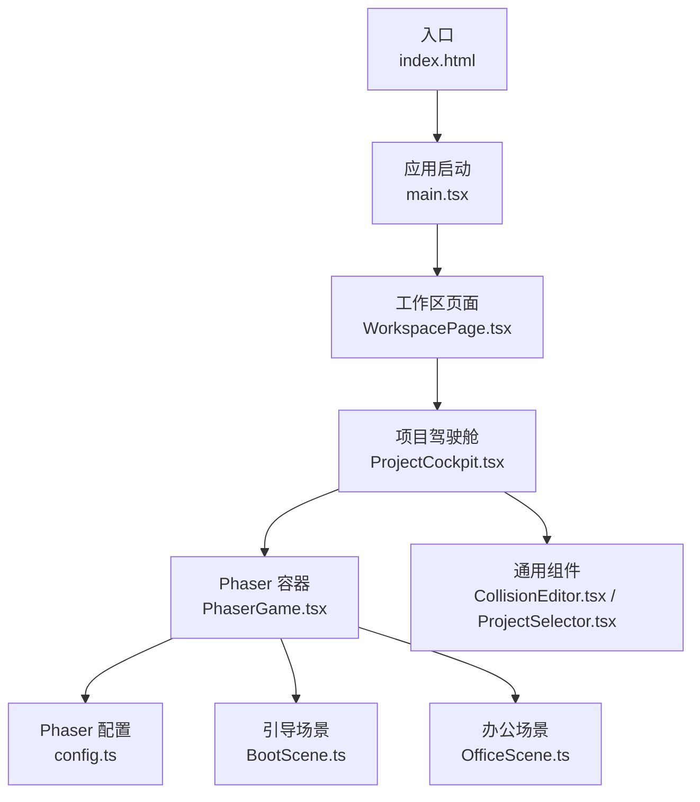
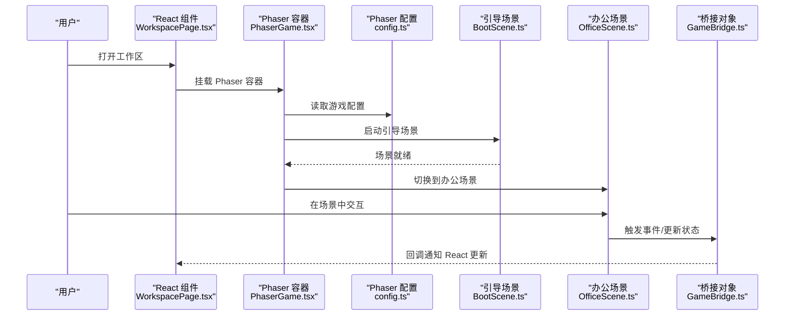
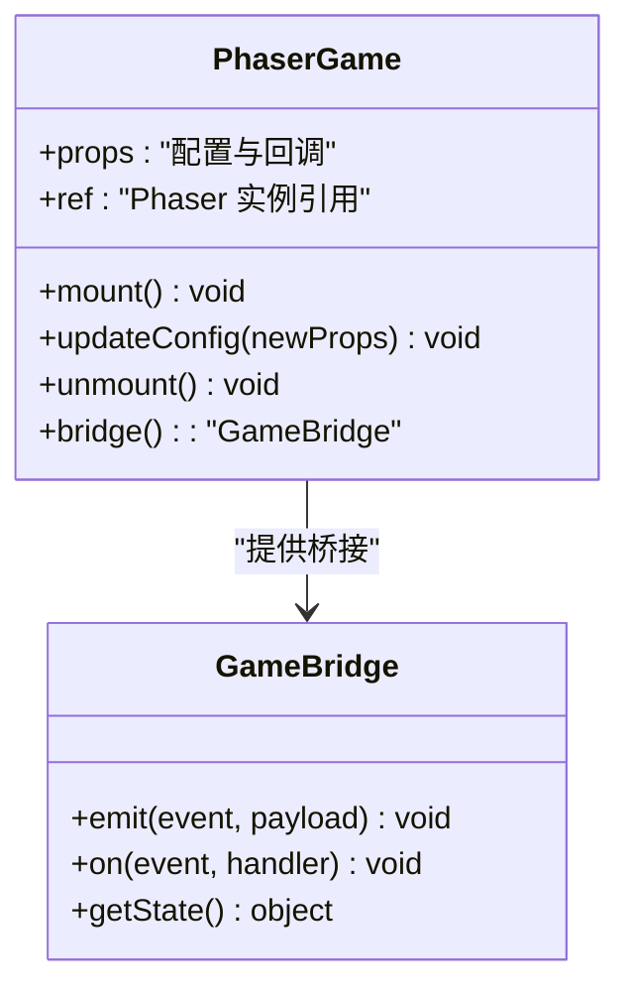
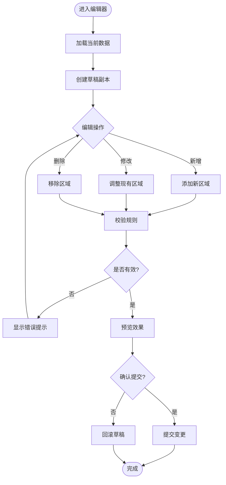
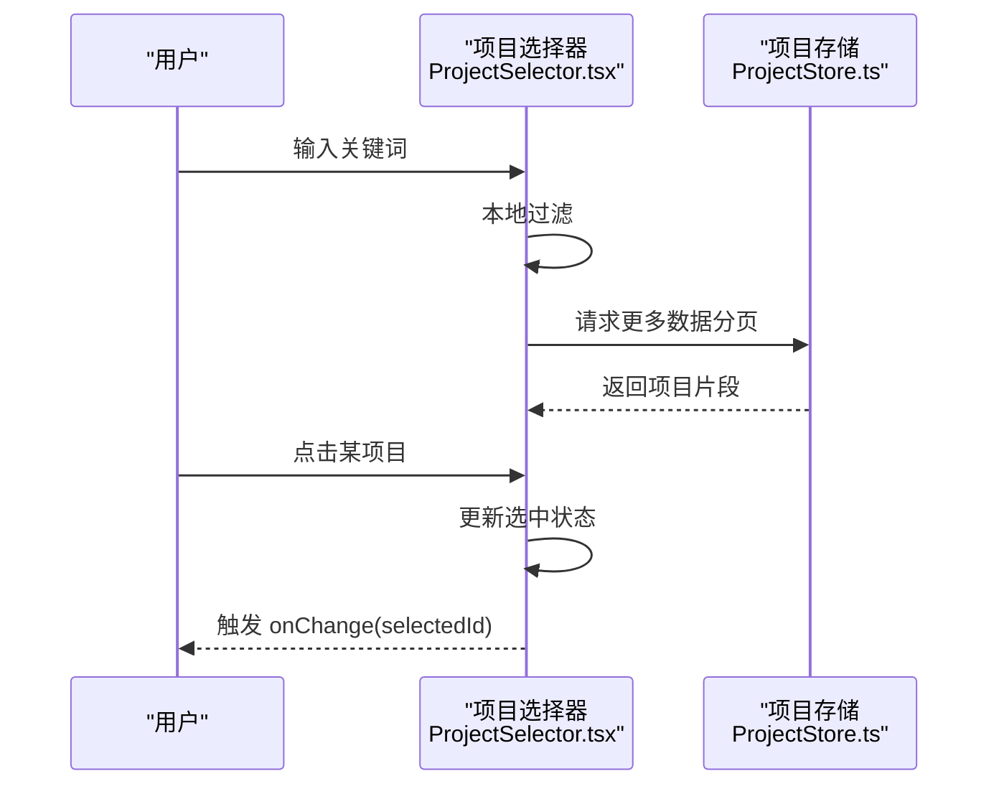
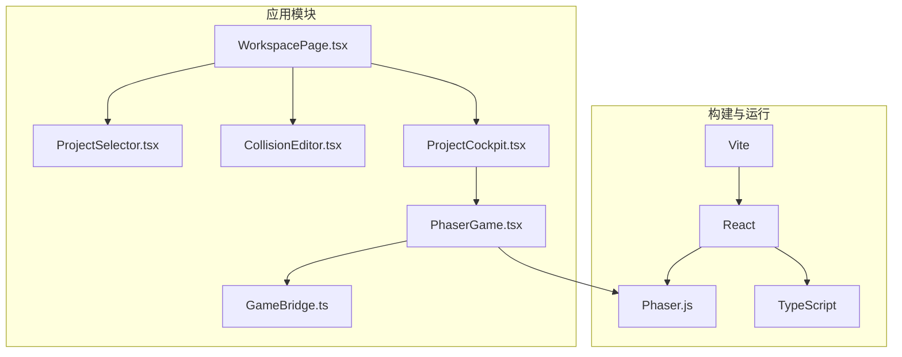

# UI组件库

<cite>
**本文引用的文件**   
- [OfficeScene.ts](file://opc/plugins/office_ui/frontend_src/game/scenes/OfficeScene.ts)
- [BootScene.ts](file://opc/plugins/office_ui/frontend_src/game/scenes/BootScene.ts)
- [PhaserGame.tsx](file://opc/plugins/office_ui/frontend_src/game/PhaserGame.tsx)
- [config.ts](file://opc/plugins/office_ui/frontend_src/game/config.ts)
- [types.ts](file://opc/plugins/office_ui/frontend_src/game/types.ts)
- [GameBridge.ts](file://opc/plugins/office_ui/frontend_src/game/GameBridge.ts)
- [CollisionEditor.tsx](file://opc/plugins/office_ui/frontend_src/components/CollisionEditor.tsx)
- [ProjectSelector.tsx](file://opc/plugins/office_ui/frontend_src/components/ProjectSelector.tsx)
- [WorkspacePage.tsx](file://opc/plugins/office_ui/frontend_src/workspace/WorkspacePage.tsx)
- [ProjectCockpit.tsx](file://opc/plugins/office_ui/frontend_src/workspace/ProjectCockpit.tsx)
- [index.html](file://opc/plugins/office_ui/frontend_src/index.html)
- [main.tsx](file://opc/plugins/office_ui/frontend_src/main.tsx)
- [package.json](file://opc/plugins/office_ui/frontend_src/package.json)
- [vite.config.ts](file://opc/plugins/office_ui/frontend_src/vite.config.ts)
</cite>

## 目录
1. [简介](#简介)
2. [项目结构](#项目结构)
3. [核心组件](#核心组件)
4. [架构总览](#架构总览)
5. [详细组件分析](#详细组件分析)
6. [依赖分析](#依赖分析)
7. [性能考虑](#性能考虑)
8. [故障排查指南](#故障排查指南)
9. [结论](#结论)
10. [附录](#附录)

## 简介
本文件为 OpenOPC 前端 UI 组件库的技术文档，聚焦于通用 UI 组件与游戏引擎集成。内容涵盖：
- 通用 UI 组件设计与实现（碰撞编辑器、项目选择器等）
- 游戏引擎集成（Phaser.js 初始化与 React 集成方式）
- 组件 API 设计（属性定义、事件处理与回调机制）
- 样式系统与主题定制方法
- 可访问性与国际化支持
- 使用示例与最佳实践
- 测试策略与性能优化技巧

## 项目结构
OpenOPC 的 Office UI 前端位于 opc/plugins/office_ui/frontend_src 下，采用 Vite + React + TypeScript 构建，并通过 Phaser.js 提供 2D 场景交互能力。关键目录与职责如下：
- game：Phaser 游戏场景、配置、类型定义以及与 React 的桥接组件
- components：通用 UI 组件（如碰撞编辑器、项目选择器）
- workspace：工作区页面与容器组件
- stores：状态管理（项目、会话等）
- chat、kanban、org、lib：业务功能模块与工具函数
- public/assets：静态资源（角色素材等）

图表来源
- [index.html:1-50](file://opc/plugins/office_ui/frontend_src/index.html#L1-L50)
- [main.tsx:1-50](file://opc/plugins/office_ui/frontend_src/main.tsx#L1-L50)
- [WorkspacePage.tsx:1-120](file://opc/plugins/office_ui/frontend_src/workspace/WorkspacePage.tsx#L1-L120)
- [ProjectCockpit.tsx:1-120](file://opc/plugins/office_ui/frontend_src/workspace/ProjectCockpit.tsx#L1-L120)
- [PhaserGame.tsx:1-120](file://opc/plugins/office_ui/frontend_src/game/PhaserGame.tsx#L1-L120)
- [config.ts:1-120](file://opc/plugins/office_ui/frontend_src/game/config.ts#L1-L120)
- [BootScene.ts:1-120](file://opc/plugins/office_ui/frontend_src/game/scenes/BootScene.ts#L1-L120)
- [OfficeScene.ts:1-120](file://opc/plugins/office_ui/frontend_src/game/scenes/OfficeScene.ts#L1-L120)

章节来源
- [index.html:1-50](file://opc/plugins/office_ui/frontend_src/index.html#L1-L50)
- [main.tsx:1-50](file://opc/plugins/office_ui/frontend_src/main.tsx#L1-L50)
- [package.json:1-50](file://opc/plugins/office_ui/frontend_src/package.json#L1-L50)
- [vite.config.ts:1-50](file://opc/plugins/office_ui/frontend_src/vite.config.ts#L1-L50)

## 核心组件
本节概述通用 UI 组件的设计要点与职责边界，重点说明碰撞编辑器与项目选择器的 API 约定、事件模型与数据流。

- 碰撞编辑器（CollisionEditor）
  - 职责：可视化编辑地图或实体的碰撞区域，支持增删改查与预览
  - 输入属性：当前选中实体/区域、编辑模式、变更回调
  - 输出事件：区域变更、确认提交、取消编辑
  - 数据绑定：通过受控模式与父级状态同步，避免重复渲染
  - 可访问性：键盘导航、ARIA 标签、焦点管理
  - 主题化：CSS 变量驱动颜色、尺寸与间距

- 项目选择器（ProjectSelector）
  - 职责：展示项目列表并支持筛选、搜索与切换
  - 输入属性：项目数据源、默认选中项、过滤条件、变更回调
  - 输出事件：选择变更、加载失败、分页请求
  - 数据绑定：受控与非受控两种模式，支持懒加载
  - 可访问性：列表项语义化、快捷键操作、屏幕阅读器友好
  - 主题化：通过 CSS 变量与类名组合实现多主题

章节来源
- [CollisionEditor.tsx:1-200](file://opc/plugins/office_ui/frontend_src/components/CollisionEditor.tsx#L1-L200)
- [ProjectSelector.tsx:1-200](file://opc/plugins/office_ui/frontend_src/components/ProjectSelector.tsx#L1-L200)

## 架构总览
UI 层由 React 组件树构成，Phaser 作为独立渲染上下文嵌入到 React 中。React 负责布局、表单与业务面板；Phaser 负责 2D 场景、实体与交互。两者通过桥接对象进行消息传递与状态同步。

图表来源
- [WorkspacePage.tsx:1-120](file://opc/plugins/office_ui/frontend_src/workspace/WorkspacePage.tsx#L1-L120)
- [PhaserGame.tsx:1-120](file://opc/plugins/office_ui/frontend_src/game/PhaserGame.tsx#L1-L120)
- [config.ts:1-120](file://opc/plugins/office_ui/frontend_src/game/config.ts#L1-L120)
- [BootScene.ts:1-120](file://opc/plugins/office_ui/frontend_src/game/scenes/BootScene.ts#L1-L120)
- [OfficeScene.ts:1-120](file://opc/plugins/office_ui/frontend_src/game/scenes/OfficeScene.ts#L1-L120)
- [GameBridge.ts:1-120](file://opc/plugins/office_ui/frontend_src/game/GameBridge.ts#L1-L120)

## 详细组件分析

### 组件A：Phaser 与 React 集成（PhaserGame.tsx）
- 设计目标：将 Phaser 实例生命周期与 React 组件生命周期对齐，确保挂载、更新与卸载时正确初始化与销毁
- 关键流程：
  - 在 useEffect 中创建 Phaser 实例并注册场景
  - 根据 props 动态更新配置（分辨率、缩放、调试开关等）
  - 在卸载时销毁 Phaser 实例，释放资源
  - 暴露桥接接口供子组件调用（如发送事件、查询状态）
- 错误处理：捕获 Phaser 初始化异常，降级为纯 React 视图
- 性能优化：按需加载场景、延迟初始化非关键资源

图表来源
- [PhaserGame.tsx:1-120](file://opc/plugins/office_ui/frontend_src/game/PhaserGame.tsx#L1-L120)
- [GameBridge.ts:1-120](file://opc/plugins/office_ui/frontend_src/game/GameBridge.ts#L1-L120)

章节来源
- [PhaserGame.tsx:1-120](file://opc/plugins/office_ui/frontend_src/game/PhaserGame.tsx#L1-L120)
- [GameBridge.ts:1-120](file://opc/plugins/office_ui/frontend_src/game/GameBridge.ts#L1-L120)

### 组件B：碰撞编辑器（CollisionEditor.tsx）
- 设计目标：提供可视化的碰撞区域编辑体验，支持拖拽、旋转与批量操作
- 输入属性：
  - 数据源：当前选中的实体或区域集合
  - 模式：新增/编辑/预览
  - 回调：onChange、onConfirm、onCancel
- 内部逻辑：
  - 维护本地草稿状态，提交后合并至父级状态
  - 撤销/重做栈记录变更历史
  - 校验规则：重叠检测、最小面积限制
- 可访问性：
  - 键盘快捷键（删除、复制、粘贴）
  - 焦点顺序与 Tab 导航
  - 描述性 aria-label 与 role
- 主题化：
  - 通过 CSS 变量控制选中态、网格线、手柄颜色
  - 支持暗色/亮色主题切换

图表来源
- [CollisionEditor.tsx:1-200](file://opc/plugins/office_ui/frontend_src/components/CollisionEditor.tsx#L1-L200)

章节来源
- [CollisionEditor.tsx:1-200](file://opc/plugins/office_ui/frontend_src/components/CollisionEditor.tsx#L1-L200)

### 组件C：项目选择器（ProjectSelector.tsx）
- 设计目标：高效展示与筛选项目列表，支持分页与搜索
- 输入属性：
  - items：项目数组
  - selectedId：当前选中项 ID
  - filter：过滤条件（关键词、分类）
  - onChange：选择变更回调
- 内部逻辑：
  - 受控模式：外部状态驱动渲染
  - 非受控模式：内部缓存最近选择
  - 虚拟滚动：大数据量时仅渲染可视区域
- 可访问性：
  - 列表项使用 button 或 option 语义
  - 键盘上下键导航，Enter 确认
  - 屏幕阅读器朗读选中项
- 主题化：
  - 高亮选中项背景与边框
  - 支持自定义图标与占位图

图表来源
- [ProjectSelector.tsx:1-200](file://opc/plugins/office_ui/frontend_src/components/ProjectSelector.tsx#L1-L200)
- [ProjectStore.ts:1-120](file://opc/plugins/office_ui/frontend_src/stores/ProjectStore.ts#L1-L120)

章节来源
- [ProjectSelector.tsx:1-200](file://opc/plugins/office_ui/frontend_src/components/ProjectSelector.tsx#L1-L200)
- [ProjectStore.ts:1-120](file://opc/plugins/office_ui/frontend_src/stores/ProjectStore.ts#L1-L120)

### 组件D：工作区页面（WorkspacePage.tsx）
- 职责：编排各功能面板与游戏容器，管理路由与全局状态
- 关键特性：
  - 响应式布局：侧边栏、主内容区、底部状态栏
  - 权限控制：基于角色的可见性
  - 错误边界：捕获子组件异常并展示恢复按钮
- 与游戏集成：
  - 通过 PhaserGame 组件嵌入场景
  - 监听场景事件以更新 UI 状态

章节来源
- [WorkspacePage.tsx:1-120](file://opc/plugins/office_ui/frontend_src/workspace/WorkspacePage.tsx#L1-L120)

### 组件E：项目驾驶舱（ProjectCockpit.tsx）
- 职责：聚合项目相关视图（看板、聊天、组织），提供统一入口
- 关键特性：
  - 标签页切换与深度链接
  - 共享上下文（会话、任务、进度）
  - 与 Phaser 场景联动（如查看协作空间）

章节来源
- [ProjectCockpit.tsx:1-120](file://opc/plugins/office_ui/frontend_src/workspace/ProjectCockpit.tsx#L1-L120)

## 依赖分析
- 构建与运行
  - Vite 作为开发与构建工具，提供热重载与资源优化
  - React 18+ 用于组件化 UI，TypeScript 保证类型安全
  - Phaser.js 作为 2D 渲染引擎，提供场景与实体系统
- 运行时依赖
  - 浏览器环境要求 WebGL 支持（可选）
  - 网络请求用于加载远程资源（头像、地图等）
- 模块耦合
  - PhaserGame 与 GameBridge 低耦合，便于替换或扩展
  - 通用组件与业务模块解耦，通过 props 与事件通信

图表来源
- [package.json:1-50](file://opc/plugins/office_ui/frontend_src/package.json#L1-L50)
- [vite.config.ts:1-50](file://opc/plugins/office_ui/frontend_src/vite.config.ts#L1-L50)
- [WorkspacePage.tsx:1-120](file://opc/plugins/office_ui/frontend_src/workspace/WorkspacePage.tsx#L1-L120)
- [ProjectCockpit.tsx:1-120](file://opc/plugins/office_ui/frontend_src/workspace/ProjectCockpit.tsx#L1-L120)
- [PhaserGame.tsx:1-120](file://opc/plugins/office_ui/frontend_src/game/PhaserGame.tsx#L1-L120)
- [GameBridge.ts:1-120](file://opc/plugins/office_ui/frontend_src/game/GameBridge.ts#L1-L120)
- [CollisionEditor.tsx:1-200](file://opc/plugins/office_ui/frontend_src/components/CollisionEditor.tsx#L1-L200)
- [ProjectSelector.tsx:1-200](file://opc/plugins/office_ui/frontend_src/components/ProjectSelector.tsx#L1-L200)

章节来源
- [package.json:1-50](file://opc/plugins/office_ui/frontend_src/package.json#L1-L50)
- [vite.config.ts:1-50](file://opc/plugins/office_ui/frontend_src/vite.config.ts#L1-L50)

## 性能考虑
- 渲染优化
  - 使用 React.memo 与 useMemo 减少不必要的重渲染
  - 对长列表采用虚拟滚动（项目选择器）
- 资源加载
  - 分阶段加载 Phaser 场景与资源，首屏优先
  - 图片与音频启用压缩与懒加载
- 内存管理
  - 在组件卸载时销毁 Phaser 实例与事件监听
  - 及时清理定时器与 WebSocket 连接
- 计算优化
  - 碰撞检测与路径规划在 Web Worker 中执行（可选）
  - 节流与防抖高频事件（鼠标移动、滚动）

[本节为通用指导，不直接分析具体文件]

## 故障排查指南
- 常见问题
  - Phaser 初始化失败：检查浏览器兼容性、WebGL 支持与资源路径
  - 事件未触发：确认桥接对象是否正确注册与注销
  - 样式错乱：验证 CSS 变量与主题类名是否生效
- 定位步骤
  - 使用浏览器开发者工具监控网络与资源加载
  - 在 React DevTools 中检查组件状态与副作用
  - 在 Phaser 控制台查看场景日志与错误堆栈
- 恢复策略
  - 提供“重试”按钮与降级视图
  - 自动重试与指数退避（网络请求）
  - 错误上报与埋点收集

章节来源
- [PhaserGame.tsx:1-120](file://opc/plugins/office_ui/frontend_src/game/PhaserGame.tsx#L1-L120)
- [GameBridge.ts:1-120](file://opc/plugins/office_ui/frontend_src/game/GameBridge.ts#L1-L120)

## 结论
本组件库通过 React 与 Phaser 的有机结合，提供了可扩展的 UI 框架与强大的 2D 场景能力。通用组件遵循受控模式与可访问性规范，具备良好的主题化与国际化基础。建议在生产环境中结合性能监控与自动化测试，持续优化用户体验与稳定性。

[本节为总结性内容，不直接分析具体文件]

## 附录
- 使用示例
  - 在工作区页面中嵌入 Phaser 容器，并传入必要配置与回调
  - 在项目选择器中绑定数据源与选择回调，实现受控模式
  - 在碰撞编辑器中启用预览模式，快速验证编辑结果
- 最佳实践
  - 保持组件职责单一，通过组合而非继承扩展功能
  - 使用 TypeScript 严格模式，明确接口契约
  - 为关键路径编写单元测试与端到端测试
- 主题定制
  - 通过 CSS 变量集中管理颜色、字体与间距
  - 提供明暗主题切换与品牌色注入
- 国际化
  - 使用 i18n 库统一管理文案与复数形式
  - 支持运行时语言切换与回退策略

[本节为补充信息，不直接分析具体文件]