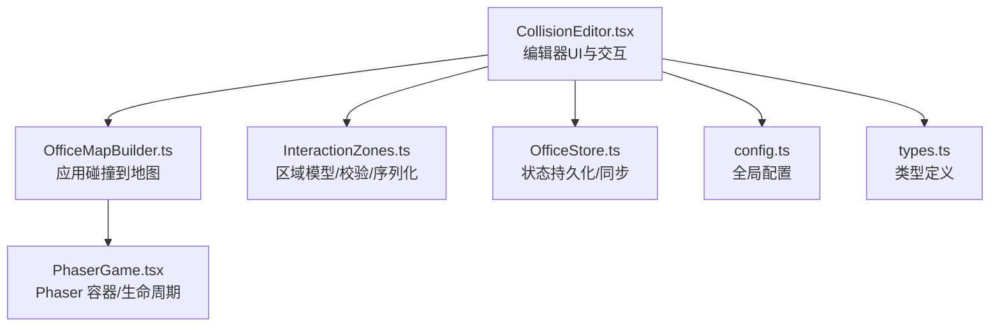
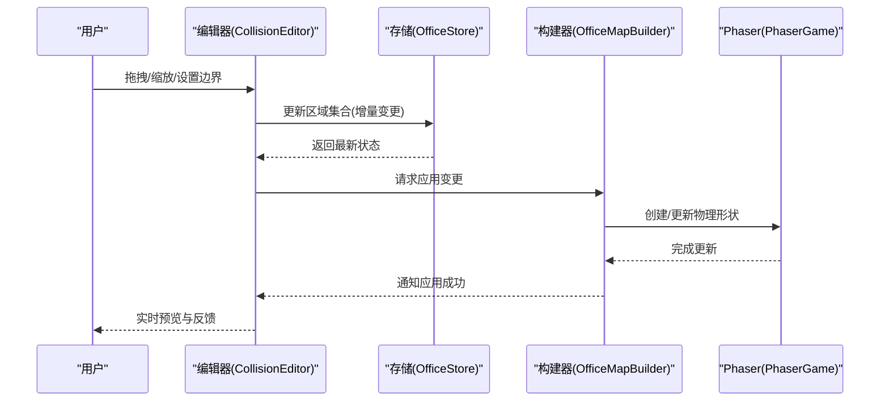
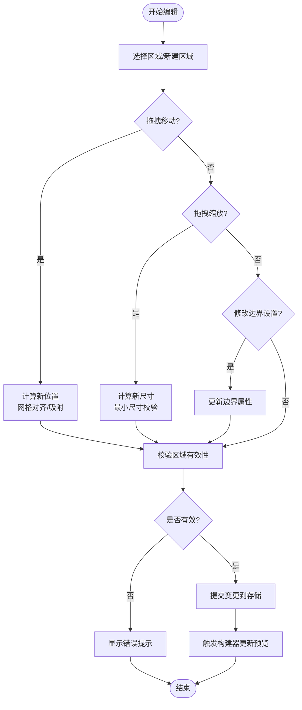
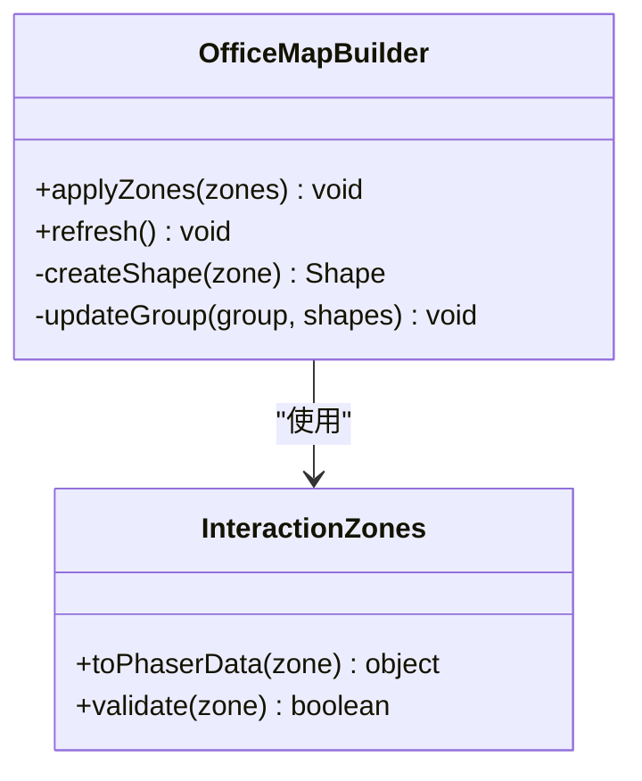
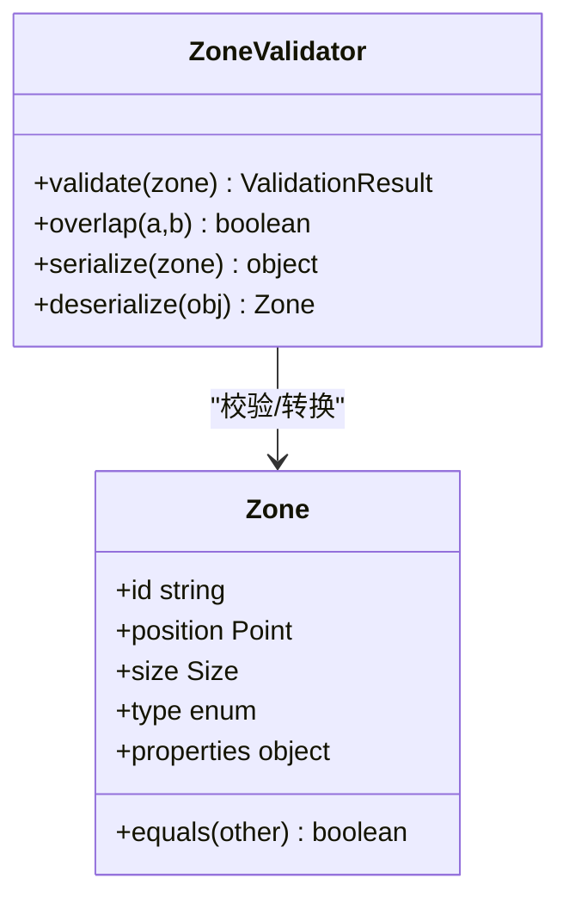
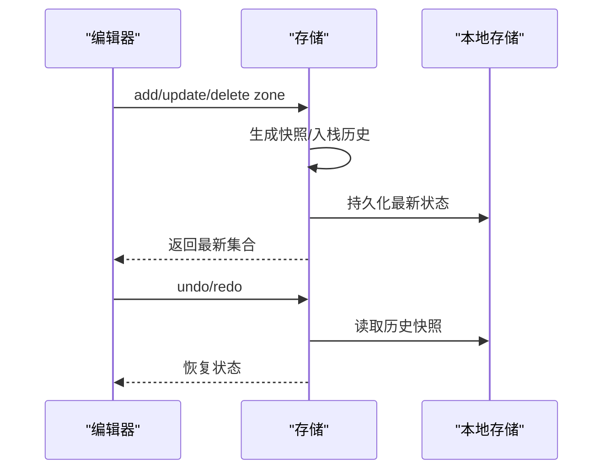
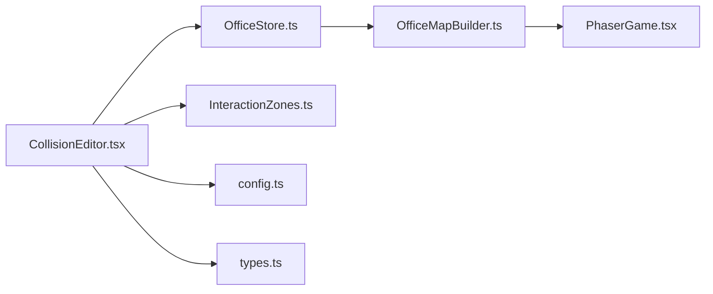

# 碰撞编辑器组件

<cite>
**本文引用的文件**   
- [CollisionEditor.tsx](file://opc/plugins/office_ui/frontend_src/components/CollisionEditor.tsx)
- [OfficeMapBuilder.ts](file://opc/plugins/office_ui/frontend_src/game/map/OfficeMapBuilder.ts)
- [InteractionZones.ts](file://opc/plugins/office_ui/frontend_src/game/map/InteractionZones.ts)
- [OfficeStore.ts](file://opc/plugins/office_ui/frontend_src/game/map/OfficeStore.ts)
- [PhaserGame.tsx](file://opc/plugins/office_ui/frontend_src/game/PhaserGame.tsx)
- [config.ts](file://opc/plugins/office_ui/frontend_src/game/config.ts)
- [types.ts](file://opc/plugins/office_ui/frontend_src/game/types.ts)
</cite>

## 目录
1. [简介](#简介)
2. [项目结构](#项目结构)
3. [核心组件](#核心组件)
4. [架构总览](#架构总览)
5. [详细组件分析](#详细组件分析)
6. [依赖关系分析](#依赖关系分析)
7. [性能考虑](#性能考虑)
8. [故障排查指南](#故障排查指南)
9. [结论](#结论)
10. [附录](#附录)

## 简介
本文件为“碰撞编辑器组件”的完整技术文档，面向游戏场景中的碰撞区域定义与管理。该组件提供可视化编辑能力，支持在场景中拖拽、调整尺寸与设置边界，并通过事件与回调机制与游戏运行时进行交互。文档涵盖：
- 功能与用途：在游戏场景中定义和管理碰撞区域
- API 接口：属性配置、事件处理与回调函数
- 可视化编辑：拖拽操作、尺寸调整、边界设置
- 检测算法与优化：原理说明与性能策略
- 使用示例与集成指南：快速上手与嵌入流程
- 错误处理与用户反馈：异常捕获与提示设计
- 可访问性与键盘导航：无障碍支持与快捷键

## 项目结构
碰撞编辑器位于前端 UI 层，并与游戏地图构建器、交互区域管理以及 Phaser 渲染容器协作。关键文件职责如下：
- CollisionEditor.tsx：编辑器面板与交互逻辑（拖拽、尺寸调整、边界设置）
- OfficeMapBuilder.ts：将编辑器输出的碰撞数据应用到地图对象
- InteractionZones.ts：碰撞区域的建模、序列化与校验
- OfficeStore.ts：持久化与状态同步（保存/加载/撤销重做）
- PhaserGame.tsx：Phaser 实例挂载与生命周期桥接
- config.ts：编辑器与运行时的全局配置项
- types.ts：类型定义与约束

图表来源
- [CollisionEditor.tsx](file://opc/plugins/office_ui/frontend_src/components/CollisionEditor.tsx)
- [OfficeMapBuilder.ts](file://opc/plugins/office_ui/frontend_src/game/map/OfficeMapBuilder.ts)
- [InteractionZones.ts](file://opc/plugins/office_ui/frontend_src/game/map/InteractionZones.ts)
- [OfficeStore.ts](file://opc/plugins/office_ui/frontend_src/game/map/OfficeStore.ts)
- [PhaserGame.tsx](file://opc/plugins/office_ui/frontend_src/game/PhaserGame.tsx)
- [config.ts](file://opc/plugins/office_ui/frontend_src/game/config.ts)
- [types.ts](file://opc/plugins/office_ui/frontend_src/game/types.ts)

章节来源
- [CollisionEditor.tsx](file://opc/plugins/office_ui/frontend_src/components/CollisionEditor.tsx)
- [OfficeMapBuilder.ts](file://opc/plugins/office_ui/frontend_src/game/map/OfficeMapBuilder.ts)
- [InteractionZones.ts](file://opc/plugins/office_ui/frontend_src/game/map/InteractionZones.ts)
- [OfficeStore.ts](file://opc/plugins/office_ui/frontend_src/game/map/OfficeStore.ts)
- [PhaserGame.tsx](file://opc/plugins/office_ui/frontend_src/game/PhaserGame.tsx)
- [config.ts](file://opc/plugins/office_ui/frontend_src/game/config.ts)
- [types.ts](file://opc/plugins/office_ui/frontend_src/game/types.ts)

## 核心组件
- 碰撞编辑器（CollisionEditor.tsx）
  - 负责展示与编辑碰撞区域列表，提供新增、删除、选择、拖拽移动、四角/边拖拽缩放、边界吸附等交互
  - 通过事件总线或回调向父级暴露变更，如 onZoneChange、onValidate、onSave
- 地图构建器（OfficeMapBuilder.ts）
  - 接收编辑器产出的碰撞区域数据，将其转换为 Phaser 可用的物理形状并添加到场景
- 交互区域（InteractionZones.ts）
  - 定义碰撞区域的数据结构、坐标变换、重叠判定与序列化格式
- 存储与同步（OfficeStore.ts）
  - 维护当前项目的碰撞区域集合，提供增删改查、版本快照、撤销重做与本地持久化
- 运行时桥接（PhaserGame.tsx）
  - 管理 Phaser 实例生命周期，注入/更新物理世界与碰撞组
- 配置与类型（config.ts, types.ts）
  - 统一配置项（如网格大小、吸附阈值、默认尺寸）、类型约束与枚举值

章节来源
- [CollisionEditor.tsx](file://opc/plugins/office_ui/frontend_src/components/CollisionEditor.tsx)
- [OfficeMapBuilder.ts](file://opc/plugins/office_ui/frontend_src/game/map/OfficeMapBuilder.ts)
- [InteractionZones.ts](file://opc/plugins/office_ui/frontend_src/game/map/InteractionZones.ts)
- [OfficeStore.ts](file://opc/plugins/office_ui/frontend_src/game/map/OfficeStore.ts)
- [PhaserGame.tsx](file://opc/plugins/office_ui/frontend_src/game/PhaserGame.tsx)
- [config.ts](file://opc/plugins/office_ui/frontend_src/game/config.ts)
- [types.ts](file://opc/plugins/office_ui/frontend_src/game/types.ts)

## 架构总览
碰撞编辑器采用“视图-模型-构建器-运行时”的分层架构：
- 视图层：编辑器 UI 与交互（拖拽、缩放、边界设置）
- 模型层：区域数据结构与校验规则
- 构建层：将模型映射为 Phaser 物理对象
- 运行时：Phaser 场景与物理引擎执行碰撞检测

图表来源
- [CollisionEditor.tsx](file://opc/plugins/office_ui/frontend_src/components/CollisionEditor.tsx)
- [OfficeStore.ts](file://opc/plugins/office_ui/frontend_src/game/map/OfficeStore.ts)
- [OfficeMapBuilder.ts](file://opc/plugins/office_ui/frontend_src/game/map/OfficeMapBuilder.ts)
- [PhaserGame.tsx](file://opc/plugins/office_ui/frontend_src/game/PhaserGame.tsx)

## 详细组件分析

### 编辑器组件（CollisionEditor.tsx）
- 功能要点
  - 区域列表管理与选中态
  - 拖拽移动：鼠标/触摸事件驱动，基于网格对齐与吸附
  - 尺寸调整：四角与边拖拽，最小尺寸限制
  - 边界设置：允许设置不可穿越边界、触发区、只读区域等
  - 事件与回调：onZoneChange、onValidate、onSave、onSelect、onDelete
  - 可访问性：Tab 焦点顺序、Enter/Space 确认、方向键微调、Esc 取消
- 关键实现模式
  - 受控组件：外部状态驱动渲染，内部仅派发变更事件
  - 增量更新：对区域集合进行 diff 后批量提交
  - 校验前置：在提交前进行合法性检查并给出即时反馈

图表来源
- [CollisionEditor.tsx](file://opc/plugins/office_ui/frontend_src/components/CollisionEditor.tsx)
- [InteractionZones.ts](file://opc/plugins/office_ui/frontend_src/game/map/InteractionZones.ts)
- [OfficeStore.ts](file://opc/plugins/office_ui/frontend_src/game/map/OfficeStore.ts)
- [OfficeMapBuilder.ts](file://opc/plugins/office_ui/frontend_src/game/map/OfficeMapBuilder.ts)

章节来源
- [CollisionEditor.tsx](file://opc/plugins/office_ui/frontend_src/components/CollisionEditor.tsx)

### 地图构建器（OfficeMapBuilder.ts）
- 功能要点
  - 将区域模型转换为 Phaser 物理形状（矩形/多边形）
  - 按层级与分组添加至场景，支持启用/禁用与可见性控制
  - 提供刷新接口以响应编辑器的增量变更
- 关键实现模式
  - 批处理更新：合并多次变更，减少场景重建开销
  - 失效缓存：对未变更区域复用已有物理对象

图表来源
- [OfficeMapBuilder.ts](file://opc/plugins/office_ui/frontend_src/game/map/OfficeMapBuilder.ts)
- [InteractionZones.ts](file://opc/plugins/office_ui/frontend_src/game/map/InteractionZones.ts)

章节来源
- [OfficeMapBuilder.ts](file://opc/plugins/office_ui/frontend_src/game/map/OfficeMapBuilder.ts)

### 交互区域模型（InteractionZones.ts）
- 功能要点
  - 定义区域数据结构（位置、尺寸、类型、属性）
  - 提供坐标变换、重叠检测与序列化方法
  - 内置校验规则（越界、重叠、最小尺寸等）
- 关键实现模式
  - 纯函数校验：无副作用，便于单元测试
  - 不可变更新：每次变更生成新对象引用

图表来源
- [InteractionZones.ts](file://opc/plugins/office_ui/frontend_src/game/map/InteractionZones.ts)

章节来源
- [InteractionZones.ts](file://opc/plugins/office_ui/frontend_src/game/map/InteractionZones.ts)

### 存储与同步（OfficeStore.ts）
- 功能要点
  - 维护当前项目的所有碰撞区域集合
  - 提供增删改查、撤销/重做、本地持久化
  - 与编辑器保持双向绑定（受控/非受控混合）
- 关键实现模式
  - 时间旅行：记录历史快照，支持回滚
  - 增量同步：仅推送差异，降低通信成本

图表来源
- [OfficeStore.ts](file://opc/plugins/office_ui/frontend_src/game/map/OfficeStore.ts)

章节来源
- [OfficeStore.ts](file://opc/plugins/office_ui/frontend_src/game/map/OfficeStore.ts)

### 运行时桥接（PhaserGame.tsx）
- 功能要点
  - 初始化 Phaser 实例与物理世界
  - 监听构建器更新，动态创建/销毁物理对象
  - 暴露钩子用于调试与日志
- 关键实现模式
  - 生命周期管理：在合适时机挂载/卸载物理组
  - 事件桥接：将运行时事件转发给上层

章节来源
- [PhaserGame.tsx](file://opc/plugins/office_ui/frontend_src/game/PhaserGame.tsx)

### 配置与类型（config.ts, types.ts）
- 功能要点
  - 统一配置：网格大小、吸附阈值、默认尺寸、颜色主题
  - 类型约束：区域类型、事件回调签名、错误码
- 关键实现模式
  - 常量集中：避免魔法数字与字符串
  - 类型安全：严格 TS 类型定义

章节来源
- [config.ts](file://opc/plugins/office_ui/frontend_src/game/config.ts)
- [types.ts](file://opc/plugins/office_ui/frontend_src/game/types.ts)

## 依赖关系分析
- 耦合与内聚
  - 编辑器与存储松耦合：通过事件/回调通信
  - 构建器与运行时紧耦合：直接操作 Phaser 对象
  - 区域模型高内聚：纯函数与不可变更新提升可测试性
- 外部依赖
  - Phaser 物理引擎：用于碰撞检测与渲染
  - 本地存储：用于持久化与撤销重做

图表来源
- [CollisionEditor.tsx](file://opc/plugins/office_ui/frontend_src/components/CollisionEditor.tsx)
- [OfficeStore.ts](file://opc/plugins/office_ui/frontend_src/game/map/OfficeStore.ts)
- [InteractionZones.ts](file://opc/plugins/office_ui/frontend_src/game/map/InteractionZones.ts)
- [OfficeMapBuilder.ts](file://opc/plugins/office_ui/frontend_src/game/map/OfficeMapBuilder.ts)
- [PhaserGame.tsx](file://opc/plugins/office_ui/frontend_src/game/PhaserGame.tsx)
- [config.ts](file://opc/plugins/office_ui/frontend_src/game/config.ts)
- [types.ts](file://opc/plugins/office_ui/frontend_src/game/types.ts)

章节来源
- [CollisionEditor.tsx](file://opc/plugins/office_ui/frontend_src/components/CollisionEditor.tsx)
- [OfficeStore.ts](file://opc/plugins/office_ui/frontend_src/game/map/OfficeStore.ts)
- [InteractionZones.ts](file://opc/plugins/office_ui/frontend_src/game/map/InteractionZones.ts)
- [OfficeMapBuilder.ts](file://opc/plugins/office_ui/frontend_src/game/map/OfficeMapBuilder.ts)
- [PhaserGame.tsx](file://opc/plugins/office_ui/frontend_src/game/PhaserGame.tsx)
- [config.ts](file://opc/plugins/office_ui/frontend_src/game/config.ts)
- [types.ts](file://opc/plugins/office_ui/frontend_src/game/types.ts)

## 性能考虑
- 增量更新与批处理
  - 编辑器侧合并多次拖拽/缩放操作，减少提交频率
  - 构建器侧合并物理对象创建/销毁，避免频繁重建场景
- 碰撞检测优化
  - 使用空间分区（如四叉树/网格）降低重叠检测复杂度
  - 对静态区域预计算包围盒，动态区域按需更新
- 渲染优化
  - 仅重绘受影响区域，避免全量刷新
  - 使用离屏渲染或纹理缓存提升拖拽流畅度
- 内存管理
  - 及时释放不再使用的物理对象与事件监听
  - 限制历史快照数量，避免内存泄漏

[本节为通用性能建议，不直接分析具体文件]

## 故障排查指南
- 常见问题
  - 拖拽卡顿：检查事件节流与渲染帧率；确认是否频繁触发全量重建
  - 碰撞无效：确认区域已正确添加到物理组且启用碰撞
  - 数据不同步：检查存储层是否收到增量变更；确认撤销/重做栈一致性
- 错误处理与用户反馈
  - 校验失败时即时提示，明确错误原因与修复建议
  - 异步操作失败时提供重试与回退路径
  - 记录关键操作日志，便于定位问题
- 调试工具
  - 开启调试模式，可视化物理边界与重叠区域
  - 导出/导入区域数据，复现问题场景

章节来源
- [CollisionEditor.tsx](file://opc/plugins/office_ui/frontend_src/components/CollisionEditor.tsx)
- [OfficeStore.ts](file://opc/plugins/office_ui/frontend_src/game/map/OfficeStore.ts)
- [OfficeMapBuilder.ts](file://opc/plugins/office_ui/frontend_src/game/map/OfficeMapBuilder.ts)

## 结论
碰撞编辑器组件通过清晰的层次结构与松耦合设计，实现了高效的可视化碰撞区域编辑与运行时集成。借助增量更新、空间分区与渲染优化，可在复杂场景中保持良好的交互体验与性能表现。配合完善的错误处理、用户反馈与可访问性支持，组件易于集成与维护。

[本节为总结性内容，不直接分析具体文件]

## 附录

### API 参考（概念性）
- 属性配置
  - zones：区域集合（受控）
  - gridSize：网格大小
  - snapThreshold：吸附阈值
  - defaultSize：默认区域尺寸
  - theme：主题色配置
- 事件与回调
  - onZoneChange：区域变更回调
  - onValidate：校验结果回调
  - onSave：保存回调
  - onSelect/onDelete：选择/删除回调
- 方法
  - addZone：新增区域
  - updateZone：更新区域
  - deleteZone：删除区域
  - undo/redo：撤销/重做
  - export/import：导出/导入区域数据

[本节为概念性 API 描述，不直接分析具体文件]

### 使用示例与集成指南（步骤）
- 引入编辑器组件并传入初始区域数据
- 订阅 onZoneChange 事件以同步到后端或本地存储
- 在保存时调用构建器刷新物理对象
- 在运行时启用对应物理组以实现碰撞检测

[本节为概念性集成步骤，不直接分析具体文件]

### 可访问性与键盘导航
- Tab 顺序：区域列表 → 工具栏 → 画布
- 快捷键：Enter/Space 确认，方向键微调，Esc 取消
- 屏幕阅读器：为区域提供语义化标签与状态描述

[本节为概念性可访问性说明，不直接分析具体文件]