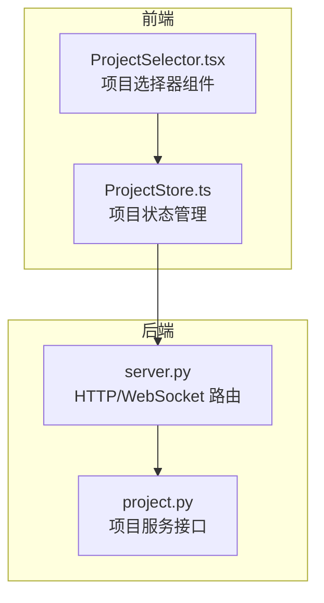
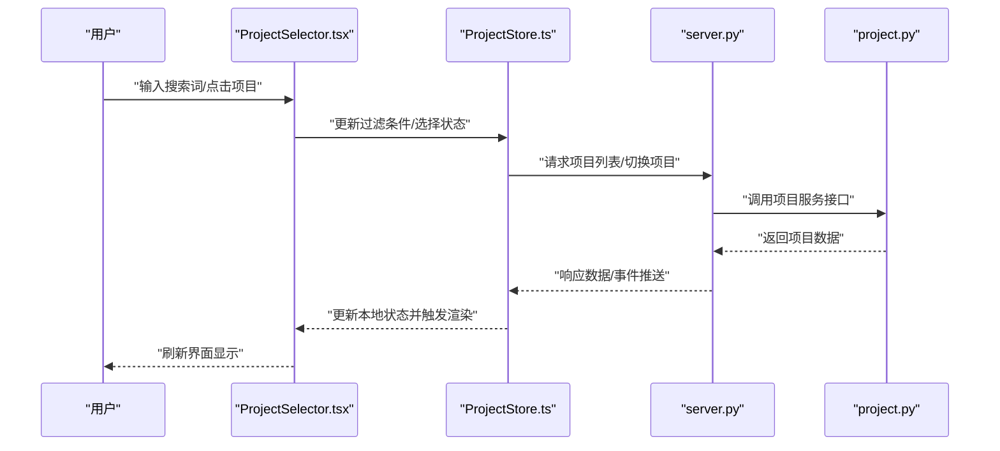
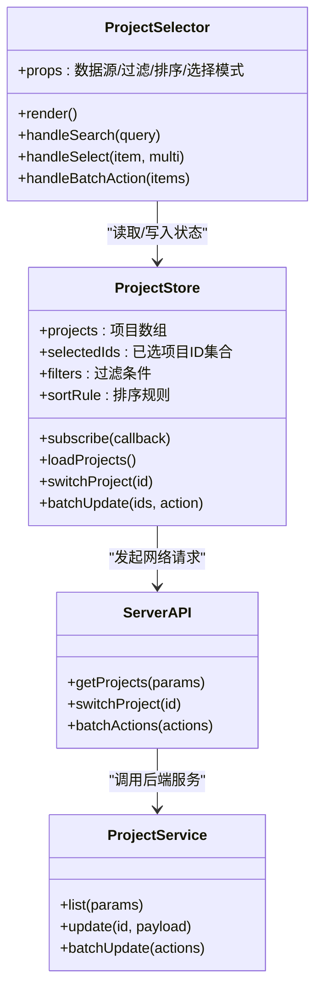
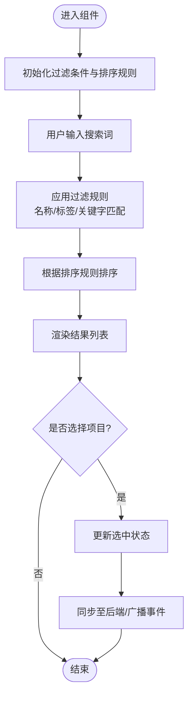
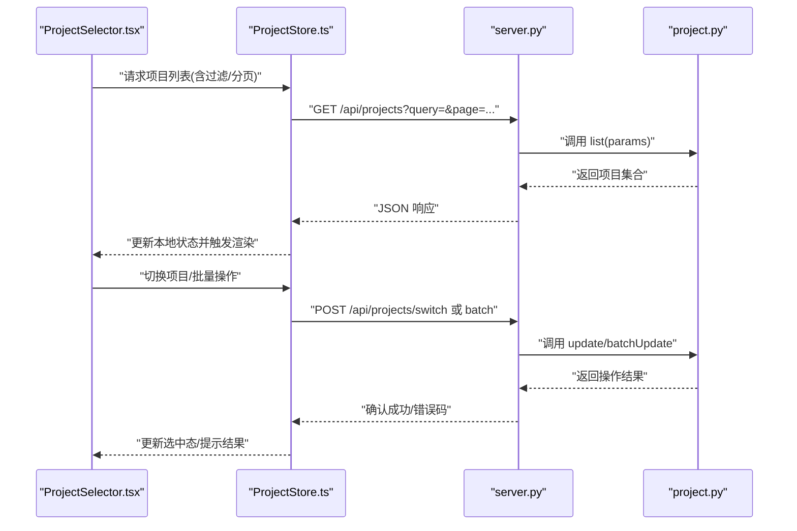
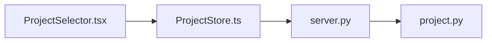

# 项目选择器组件

<cite>
**本文引用的文件**   
- [ProjectSelector.tsx](file://opc/plugins/office_ui/frontend_src/components/ProjectSelector.tsx)
- [ProjectStore.ts](file://opc/plugins/office_ui/frontend_src/stores/ProjectStore.ts)
- [project.py](file://opc/plugins/office_ui/services/project.py)
- [server.py](file://opc/plugins/office_ui/server.py)
</cite>

## 目录
1. [简介](#简介)
2. [项目结构](#项目结构)
3. [核心组件](#核心组件)
4. [架构总览](#架构总览)
5. [详细组件分析](#详细组件分析)
6. [依赖关系分析](#依赖关系分析)
7. [性能考虑](#性能考虑)
8. [故障排查指南](#故障排查指南)
9. [结论](#结论)
10. [附录](#附录)

## 简介
本项目中的“项目选择器”是一个前端 React 组件，用于在 Office UI 插件中加载、显示与切换项目。它通过状态管理（Store）与后端服务进行数据同步，支持搜索过滤、多选与批量操作等交互能力，并提供样式定制与主题适配方案。同时，文档给出性能优化策略，包括虚拟滚动与懒加载的实现建议。

## 项目结构
该组件位于前端源码的 components 目录下，其数据层位于 stores 目录，后端接口由 services 与 server 模块提供。整体采用“组件-存储-服务-服务器”的分层结构：
- 组件层：负责渲染与用户交互
- 存储层：维护本地状态、缓存与事件订阅
- 服务层：封装对后端的调用
- 服务端：暴露 REST/WebSocket 接口并访问持久化存储

图表来源
- [ProjectSelector.tsx](file://opc/plugins/office_ui/frontend_src/components/ProjectSelector.tsx)
- [ProjectStore.ts](file://opc/plugins/office_ui/frontend_src/stores/ProjectStore.ts)
- [server.py](file://opc/plugins/office_ui/server.py)
- [project.py](file://opc/plugins/office_ui/services/project.py)

章节来源
- [ProjectSelector.tsx](file://opc/plugins/office_ui/frontend_src/components/ProjectSelector.tsx)
- [ProjectStore.ts](file://opc/plugins/office_ui/frontend_src/stores/ProjectStore.ts)
- [server.py](file://opc/plugins/office_ui/server.py)
- [project.py](file://opc/plugins/office_ui/services/project.py)

## 核心组件
- 组件职责
  - 展示项目列表，支持搜索过滤、分页与排序
  - 支持单选/多选模式，提供批量操作入口
  - 监听项目变更事件，保持视图与数据一致
- 关键属性配置
  - 数据源绑定：从 Store 获取项目集合与当前选中项
  - 过滤选项：按名称、标签或关键字模糊匹配
  - 排序规则：按创建时间、更新时间或自定义字段
- 用户交互流程
  - 输入关键词触发过滤
  - 点击项目项完成选择或取消选择
  - 批量勾选后执行批量操作（如批量启用/禁用）
- 状态管理与数据同步
  - 组件通过 Store 订阅项目列表与选中态变化
  - 当后端推送更新时，Store 合并增量数据并通知组件重渲染
- 集成与使用示例
  - 在页面中引入组件，传入必要 props（如 mode、initialSelection、onSelectChange）
  - 将组件挂载到 Workspace 或侧边栏区域
- 样式定制与主题适配
  - 通过 CSS 变量或主题上下文覆盖默认样式
  - 支持暗色/亮色主题切换

章节来源
- [ProjectSelector.tsx](file://opc/plugins/office_ui/frontend_src/components/ProjectSelector.tsx)
- [ProjectStore.ts](file://opc/plugins/office_ui/frontend_src/stores/ProjectStore.ts)

## 架构总览
下图展示了从用户交互到后端数据更新的完整链路，以及前后端之间的消息传递方式。

图表来源
- [ProjectSelector.tsx](file://opc/plugins/office_ui/frontend_src/components/ProjectSelector.tsx)
- [ProjectStore.ts](file://opc/plugins/office_ui/frontend_src/stores/ProjectStore.ts)
- [server.py](file://opc/plugins/office_ui/server.py)
- [project.py](file://opc/plugins/office_ui/services/project.py)

## 详细组件分析

### 组件类图（代码级关系）

图表来源
- [ProjectSelector.tsx](file://opc/plugins/office_ui/frontend_src/components/ProjectSelector.tsx)
- [ProjectStore.ts](file://opc/plugins/office_ui/frontend_src/stores/ProjectStore.ts)
- [server.py](file://opc/plugins/office_ui/server.py)
- [project.py](file://opc/plugins/office_ui/services/project.py)

章节来源
- [ProjectSelector.tsx](file://opc/plugins/office_ui/frontend_src/components/ProjectSelector.tsx)
- [ProjectStore.ts](file://opc/plugins/office_ui/frontend_src/stores/ProjectStore.ts)
- [server.py](file://opc/plugins/office_ui/server.py)
- [project.py](file://opc/plugins/office_ui/services/project.py)

### 搜索与过滤流程（算法流程图）

图表来源
- [ProjectSelector.tsx](file://opc/plugins/office_ui/frontend_src/components/ProjectSelector.tsx)
- [ProjectStore.ts](file://opc/plugins/office_ui/frontend_src/stores/ProjectStore.ts)

章节来源
- [ProjectSelector.tsx](file://opc/plugins/office_ui/frontend_src/components/ProjectSelector.tsx)
- [ProjectStore.ts](file://opc/plugins/office_ui/frontend_src/stores/ProjectStore.ts)

### API 与服务调用时序

图表来源
- [ProjectSelector.tsx](file://opc/plugins/office_ui/frontend_src/components/ProjectSelector.tsx)
- [ProjectStore.ts](file://opc/plugins/office_ui/frontend_src/stores/ProjectStore.ts)
- [server.py](file://opc/plugins/office_ui/server.py)
- [project.py](file://opc/plugins/office_ui/services/project.py)

章节来源
- [ProjectSelector.tsx](file://opc/plugins/office_ui/frontend_src/components/ProjectSelector.tsx)
- [ProjectStore.ts](file://opc/plugins/office_ui/frontend_src/stores/ProjectStore.ts)
- [server.py](file://opc/plugins/office_ui/server.py)
- [project.py](file://opc/plugins/office_ui/services/project.py)

## 依赖关系分析
- 组件与存储耦合度低：组件仅通过 Store 提供的接口读写状态，便于替换实现与测试
- 存储与后端解耦：通过统一的服务层封装网络请求，避免组件直接处理 HTTP
- 潜在循环依赖：确保组件不直接依赖服务层，仅依赖 Store；服务层不反向依赖组件
- 外部依赖点：WebSocket 推送（可选）用于实时同步项目状态变更

图表来源
- [ProjectSelector.tsx](file://opc/plugins/office_ui/frontend_src/components/ProjectSelector.tsx)
- [ProjectStore.ts](file://opc/plugins/office_ui/frontend_src/stores/ProjectStore.ts)
- [server.py](file://opc/plugins/office_ui/server.py)
- [project.py](file://opc/plugins/office_ui/services/project.py)

章节来源
- [ProjectSelector.tsx](file://opc/plugins/office_ui/frontend_src/components/ProjectSelector.tsx)
- [ProjectStore.ts](file://opc/plugins/office_ui/frontend_src/stores/ProjectStore.ts)
- [server.py](file://opc/plugins/office_ui/server.py)
- [project.py](file://opc/plugins/office_ui/services/project.py)

## 性能考虑
- 虚拟滚动
  - 当项目数量较大时，使用虚拟滚动只渲染可视区条目，显著降低 DOM 节点数量与重排开销
  - 建议结合固定行高或动态行高估算，提升滚动流畅度
- 懒加载
  - 首屏仅加载必要字段与少量项目，滚动到底部再按需加载更多
  - 结合分页参数与游标式加载，减少单次传输体积
- 去抖与节流
  - 搜索输入使用去抖，避免频繁触发过滤与网络请求
  - 批量操作按钮使用节流，防止重复提交
- 缓存策略
  - 对静态或低频变更的项目元数据进行本地缓存，缩短二次访问延迟
- 事件合并
  - 高频状态变更（如快速滚动）合并为批量更新，减少渲染次数

[本节为通用性能指导，无需特定文件引用]

## 故障排查指南
- 常见问题
  - 列表为空：检查后端接口返回格式与分页参数是否正确
  - 搜索无结果：确认过滤字段映射与大小写敏感设置
  - 切换失败：查看网络响应码与后端日志，确认权限与项目状态
  - 批量操作异常：核对批量动作校验逻辑与事务回滚机制
- 调试建议
  - 在 Store 中添加日志输出，记录请求参数与响应数据
  - 使用浏览器开发者工具监控网络请求与 WebSocket 事件
  - 针对复杂过滤逻辑，编写单元测试覆盖边界用例

章节来源
- [ProjectSelector.tsx](file://opc/plugins/office_ui/frontend_src/components/ProjectSelector.tsx)
- [ProjectStore.ts](file://opc/plugins/office_ui/frontend_src/stores/ProjectStore.ts)
- [server.py](file://opc/plugins/office_ui/server.py)
- [project.py](file://opc/plugins/office_ui/services/project.py)

## 结论
项目选择器组件通过清晰的分层架构与良好的状态管理，实现了高效、可扩展的项目加载、显示与切换能力。配合搜索过滤、多选与批量操作，能够满足复杂业务场景。借助虚拟滚动与懒加载等性能优化策略，可在大数据量下保持良好用户体验。建议在后续迭代中持续完善错误处理与可观测性，以提升稳定性与可维护性。

[本节为总结性内容，无需特定文件引用]

## 附录
- 集成步骤概览
  - 在页面中引入组件与 Store
  - 配置数据源、过滤与排序参数
  - 绑定选择回调与批量操作回调
  - 根据需要启用虚拟滚动与懒加载
- 样式定制要点
  - 使用主题上下文覆盖颜色与字体
  - 通过 CSS 变量控制间距与尺寸
  - 为暗色模式提供独立样式集

[本节为概念性说明，无需特定文件引用]