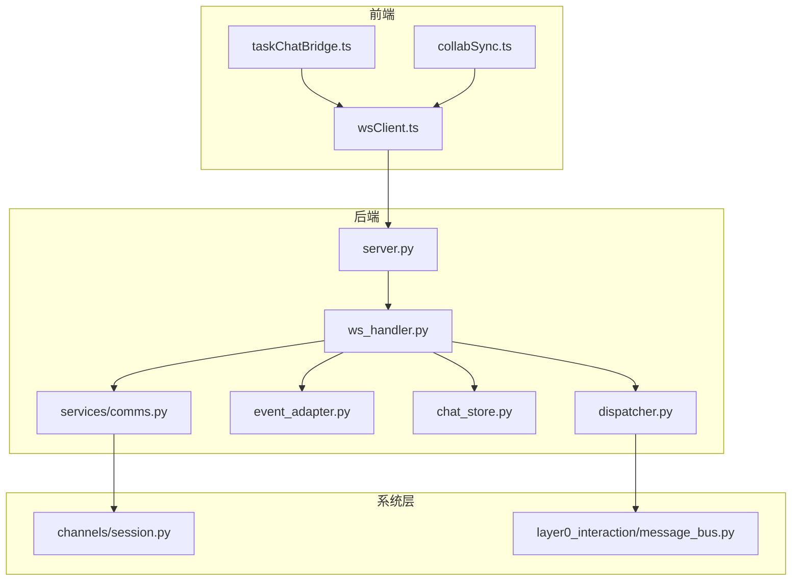
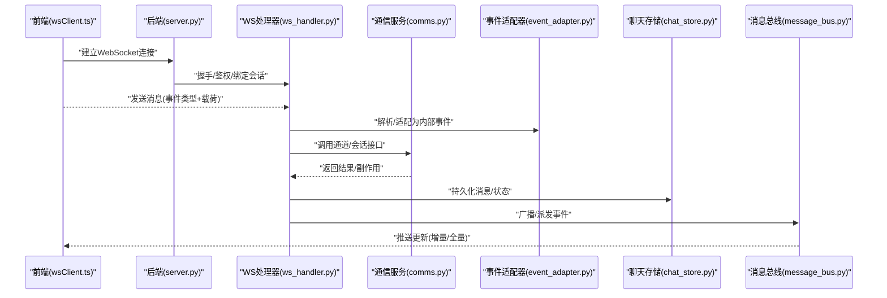
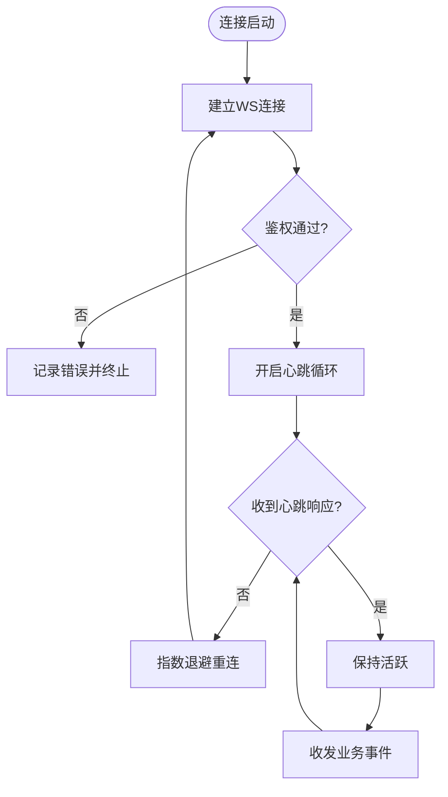
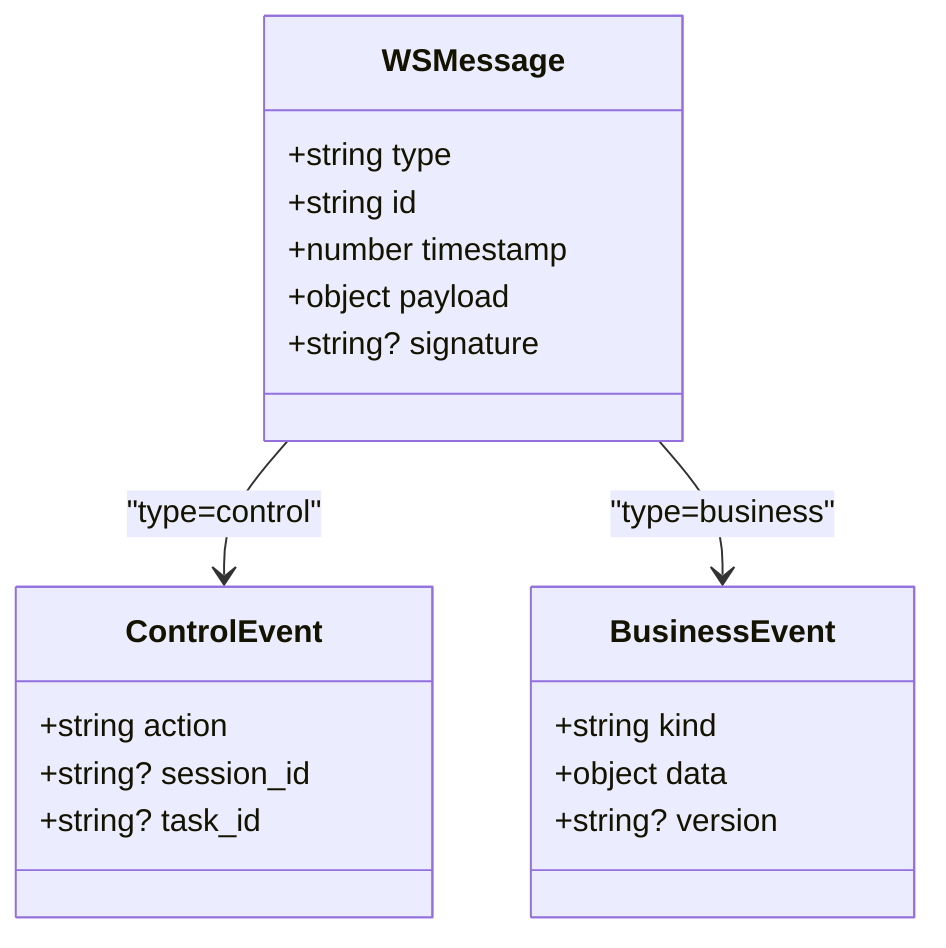
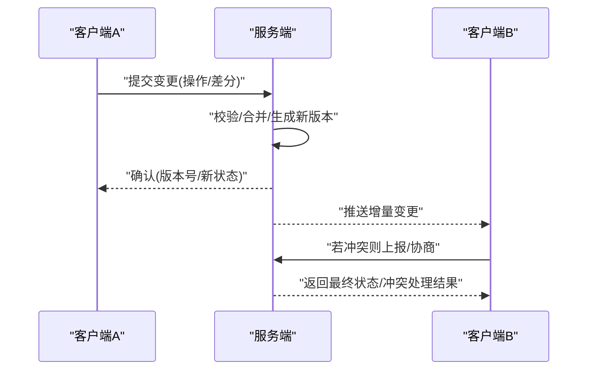
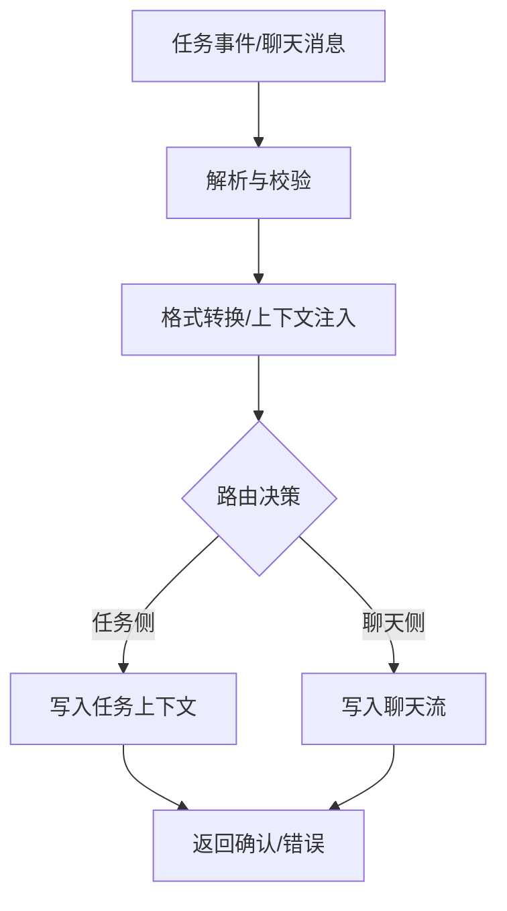
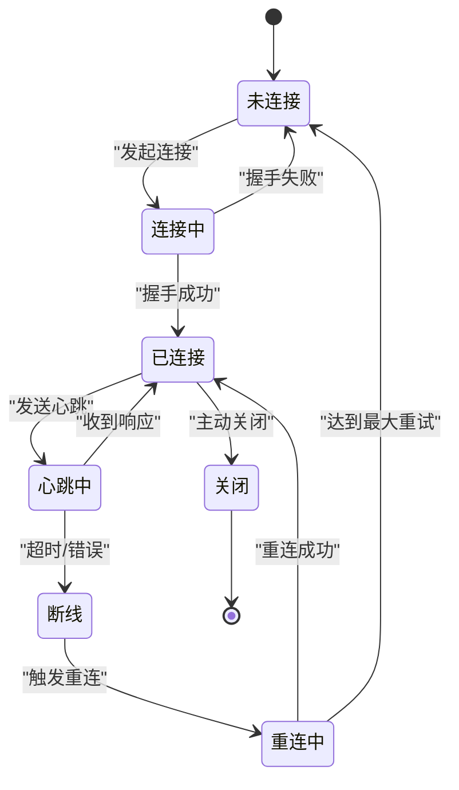
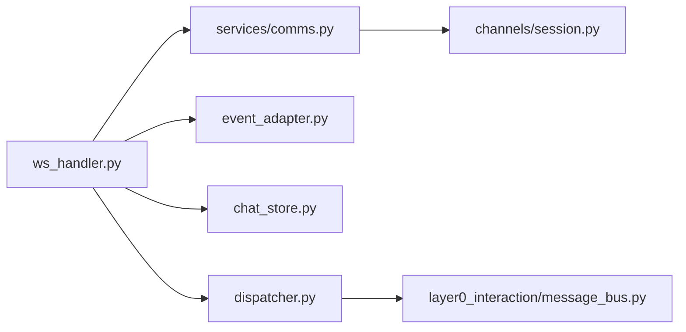

# WebSocket通信

<cite>
**本文引用的文件**   
- [ws_handler.py](file://opc/plugins/office_ui/ws_handler.py)
- [server.py](file://opc/plugins/office_ui/server.py)
- [taskChatBridge.ts](file://opc/plugins/office_ui/frontend_src/lib/taskChatBridge.ts)
- [collabSync.ts](file://opc/plugins/office_ui/frontend_src/lib/collabSync.ts)
- [wsClient.ts](file://opc/plugins/office_ui/frontend_src/lib/wsClient.ts)
- [comms.py](file://opc/plugins/office_ui/services/comms.py)
- [event_adapter.py](file://opc/plugins/office_ui/event_adapter.py)
- [chat_store.py](file://opc/plugins/office_ui/chat_store.py)
- [dispatcher.py](file://opc/plugins/office_ui/dispatcher.py)
- [session.py](file://opc/channels/session.py)
- [message_bus.py](file://opc/layer0_interaction/message_bus.py)
</cite>

## 目录
1. [简介](#简介)
2. [项目结构](#项目结构)
3. [核心组件](#核心组件)
4. [架构总览](#架构总览)
5. [详细组件分析](#详细组件分析)
6. [依赖关系分析](#依赖关系分析)
7. [性能考虑](#性能考虑)
8. [故障排查指南](#故障排查指南)
9. [结论](#结论)
10. [附录](#附录)

## 简介
本文件聚焦于OpenOPC的WebSocket通信机制，覆盖连接建立、维护与重连、消息协议设计（格式、事件类型、数据结构）、实时同步（协作编辑、状态同步、冲突解决）、任务聊天桥接器（消息转发、格式转换、错误处理）、连接状态管理与网络异常策略、调试与监控方法，以及安全与性能优化建议。文档以代码级实现为依据，提供可视化图示与可操作的排障指引，帮助读者快速理解并高效使用WebSocket能力。

## 项目结构
与WebSocket相关的后端与前端关键位置如下：
- 后端服务与WS处理器：server.py、ws_handler.py、services/comms.py、event_adapter.py、chat_store.py、dispatcher.py
- 前端WS客户端与桥接：frontend_src/lib/wsClient.ts、frontend_src/lib/taskChatBridge.ts、frontend_src/lib/collabSync.ts
- 会话与消息总线：channels/session.py、layer0_interaction/message_bus.py

图表来源
- [server.py](file://opc/plugins/office_ui/server.py)
- [ws_handler.py](file://opc/plugins/office_ui/ws_handler.py)
- [comms.py](file://opc/plugins/office_ui/services/comms.py)
- [event_adapter.py](file://opc/plugins/office_ui/event_adapter.py)
- [chat_store.py](file://opc/plugins/office_ui/chat_store.py)
- [dispatcher.py](file://opc/plugins/office_ui/dispatcher.py)
- [session.py](file://opc/channels/session.py)
- [message_bus.py](file://opc/layer0_interaction/message_bus.py)
- [wsClient.ts](file://opc/plugins/office_ui/frontend_src/lib/wsClient.ts)
- [taskChatBridge.ts](file://opc/plugins/office_ui/frontend_src/lib/taskChatBridge.ts)
- [collabSync.ts](file://opc/plugins/office_ui/frontend_src/lib/collabSync.ts)

章节来源
- [server.py](file://opc/plugins/office_ui/server.py)
- [ws_handler.py](file://opc/plugins/office_ui/ws_handler.py)
- [comms.py](file://opc/plugins/office_ui/services/comms.py)
- [event_adapter.py](file://opc/plugins/office_ui/event_adapter.py)
- [chat_store.py](file://opc/plugins/office_ui/chat_store.py)
- [dispatcher.py](file://opc/plugins/office_ui/dispatcher.py)
- [session.py](file://opc/channels/session.py)
- [message_bus.py](file://opc/layer0_interaction/message_bus.py)
- [wsClient.ts](file://opc/plugins/office_ui/frontend_src/lib/wsClient.ts)
- [taskChatBridge.ts](file://opc/plugins/office_ui/frontend_src/lib/taskChatBridge.ts)
- [collabSync.ts](file://opc/plugins/office_ui/frontend_src/lib/collabSync.ts)

## 核心组件
- 服务端WS入口与路由：负责接收连接、鉴权与会话绑定、按事件分发到具体处理器。
- WS处理器：解析消息、执行业务逻辑、持久化与广播、错误上报。
- 通信服务：封装与通道/会话层的交互，统一消息入出。
- 事件适配器：将内部事件转换为WS消息格式，或将WS消息转为内部事件。
- 聊天存储：消息落盘、历史查询、增量同步。
- 调度器：与消息总线集成，跨进程/模块派发事件。
- 前端WS客户端：连接管理、心跳、重连、编解码、重试退避。
- 任务聊天桥接器：在“任务上下文”和“聊天流”之间做消息转发与格式转换。
- 协作同步：基于操作/状态差分与冲突检测，保证多端一致。

章节来源
- [ws_handler.py](file://opc/plugins/office_ui/ws_handler.py)
- [server.py](file://opc/plugins/office_ui/server.py)
- [comms.py](file://opc/plugins/office_ui/services/comms.py)
- [event_adapter.py](file://opc/plugins/office_ui/event_adapter.py)
- [chat_store.py](file://opc/plugins/office_ui/chat_store.py)
- [dispatcher.py](file://opc/plugins/office_ui/dispatcher.py)
- [wsClient.ts](file://opc/plugins/office_ui/frontend_src/lib/wsClient.ts)
- [taskChatBridge.ts](file://opc/plugins/office_ui/frontend_src/lib/taskChatBridge.ts)
- [collabSync.ts](file://opc/plugins/office_ui/frontend_src/lib/collabSync.ts)

## 架构总览
WebSocket通信贯穿前后端，形成“客户端—网关—处理器—业务服务—存储/总线”的链路。

图表来源
- [server.py](file://opc/plugins/office_ui/server.py)
- [ws_handler.py](file://opc/plugins/office_ui/ws_handler.py)
- [comms.py](file://opc/plugins/office_ui/services/comms.py)
- [event_adapter.py](file://opc/plugins/office_ui/event_adapter.py)
- [chat_store.py](file://opc/plugins/office_ui/chat_store.py)
- [message_bus.py](file://opc/layer0_interaction/message_bus.py)
- [wsClient.ts](file://opc/plugins/office_ui/frontend_src/lib/wsClient.ts)

## 详细组件分析

### 连接建立、维护与重连
- 连接建立
  - 前端发起WS连接，携带必要认证信息；后端校验身份与会话权限，完成绑定。
  - 成功后进入活跃状态，开始监听事件与推送。
- 连接维护
  - 心跳保活：客户端周期性发送心跳，服务端响应或超时判定断开。
  - 空闲清理：长时间无活动连接将被回收。
- 重连机制
  - 指数退避：断线后按指数退避策略重连，避免雪崩。
  - 幂等恢复：重连后拉取增量快照或从最近序列号继续，确保不丢消息。
  - 去抖合并：短时间内多次断连只触发一次完整恢复流程。

图表来源
- [wsClient.ts](file://opc/plugins/office_ui/frontend_src/lib/wsClient.ts)
- [server.py](file://opc/plugins/office_ui/server.py)
- [ws_handler.py](file://opc/plugins/office_ui/ws_handler.py)

章节来源
- [wsClient.ts](file://opc/plugins/office_ui/frontend_src/lib/wsClient.ts)
- [server.py](file://opc/plugins/office_ui/server.py)
- [ws_handler.py](file://opc/plugins/office_ui/ws_handler.py)

### 消息协议设计
- 通用消息结构
  - 字段通常包含：事件类型、请求/响应标识、时间戳、会话/任务标识、载荷数据、可选签名/校验值。
  - 支持批量与分片传输，便于大对象与高吞吐场景。
- 事件类型
  - 控制类：连接、心跳、订阅/取消订阅、分页拉取、错误上报。
  - 业务类：消息发送/接收、进度更新、协作变更、状态同步、任务聊天桥接事件。
- 数据结构
  - 消息体采用JSON序列化，关键字段具备强约束与默认值，缺失时走降级策略。
  - 对敏感字段进行脱敏或加密传输。

图表来源
- [event_adapter.py](file://opc/plugins/office_ui/event_adapter.py)
- [ws_handler.py](file://opc/plugins/office_ui/ws_handler.py)
- [comms.py](file://opc/plugins/office_ui/services/comms.py)

章节来源
- [event_adapter.py](file://opc/plugins/office_ui/event_adapter.py)
- [ws_handler.py](file://opc/plugins/office_ui/ws_handler.py)
- [comms.py](file://opc/plugins/office_ui/services/comms.py)

### 实时同步（协作编辑、状态同步、冲突解决）
- 协作编辑
  - 基于操作型或状态差分模型，客户端生成最小变更集，服务端合并并广播。
  - 支持撤销/重做与版本回滚。
- 状态同步
  - 服务端维护权威状态，客户端缓存本地视图；差异通过增量推送补齐。
  - 首次连接或断线恢复时，拉取基线快照+后续增量。
- 冲突解决
  - 采用“最后写入胜出”或“语义合并”策略，针对不可合并字段提供提示与人工介入。
  - 冲突日志与审计追踪，便于回溯。

图表来源
- [collabSync.ts](file://opc/plugins/office_ui/frontend_src/lib/collabSync.ts)
- [chat_store.py](file://opc/plugins/office_ui/chat_store.py)
- [ws_handler.py](file://opc/plugins/office_ui/ws_handler.py)

章节来源
- [collabSync.ts](file://opc/plugins/office_ui/frontend_src/lib/collabSync.ts)
- [chat_store.py](file://opc/plugins/office_ui/chat_store.py)
- [ws_handler.py](file://opc/plugins/office_ui/ws_handler.py)

### 任务聊天桥接器
- 作用
  - 在“任务上下文”与“聊天流”之间双向转发消息，屏蔽两端格式差异。
  - 负责消息清洗、富文本/附件规范化、上下文注入与路由。
- 消息转发与格式转换
  - 输入侧：将任务系统的结构化事件转换为聊天友好的消息结构。
  - 输出侧：将聊天消息映射为任务动作或状态更新。
- 错误处理
  - 捕获转换异常、目标不可达、权限不足等错误，返回标准化错误码与提示。
  - 失败重试与死信队列，保障可靠性。

图表来源
- [taskChatBridge.ts](file://opc/plugins/office_ui/frontend_src/lib/taskChatBridge.ts)
- [event_adapter.py](file://opc/plugins/office_ui/event_adapter.py)
- [chat_store.py](file://opc/plugins/office_ui/chat_store.py)

章节来源
- [taskChatBridge.ts](file://opc/plugins/office_ui/frontend_src/lib/taskChatBridge.ts)
- [event_adapter.py](file://opc/plugins/office_ui/event_adapter.py)
- [chat_store.py](file://opc/plugins/office_ui/chat_store.py)

### 连接状态管理与网络异常处理
- 状态机
  - 状态包括：未连接、连接中、已连接、心跳中、断线、重连中、关闭。
  - 状态迁移由事件驱动，确保幂等与可观测。
- 异常处理
  - 网络抖动：短时断线自动重连，长时断线告警。
  - 服务端异常：错误码分类（鉴权、参数、业务、系统），客户端差异化处理。
  - 资源限制：限流、背压、降级（如暂停非关键推送）。
- 监控指标
  - 连接时长、重连次数、延迟分布、错误率、消息吞吐、堆积量。

图表来源
- [wsClient.ts](file://opc/plugins/office_ui/frontend_src/lib/wsClient.ts)
- [ws_handler.py](file://opc/plugins/office_ui/ws_handler.py)

章节来源
- [wsClient.ts](file://opc/plugins/office_ui/frontend_src/lib/wsClient.ts)
- [ws_handler.py](file://opc/plugins/office_ui/ws_handler.py)

## 依赖关系分析
- 耦合与内聚
  - ws_handler.py作为中心枢纽，对内聚合comms、event_adapter、chat_store、dispatcher，对外暴露统一的WS事件接口。
  - 前端wsClient.ts与taskChatBridge.ts、collabSync.ts职责清晰，分别承担连接、桥接与同步。
- 外部依赖
  - channels/session.py提供会话上下文与用户/任务关联。
  - layer0_interaction/message_bus.py用于跨模块事件分发与解耦。

图表来源
- [ws_handler.py](file://opc/plugins/office_ui/ws_handler.py)
- [comms.py](file://opc/plugins/office_ui/services/comms.py)
- [event_adapter.py](file://opc/plugins/office_ui/event_adapter.py)
- [chat_store.py](file://opc/plugins/office_ui/chat_store.py)
- [dispatcher.py](file://opc/plugins/office_ui/dispatcher.py)
- [message_bus.py](file://opc/layer0_interaction/message_bus.py)
- [session.py](file://opc/channels/session.py)

章节来源
- [ws_handler.py](file://opc/plugins/office_ui/ws_handler.py)
- [comms.py](file://opc/plugins/office_ui/services/comms.py)
- [event_adapter.py](file://opc/plugins/office_ui/event_adapter.py)
- [chat_store.py](file://opc/plugins/office_ui/chat_store.py)
- [dispatcher.py](file://opc/plugins/office_ui/dispatcher.py)
- [message_bus.py](file://opc/layer0_interaction/message_bus.py)
- [session.py](file://opc/channels/session.py)

## 性能考虑
- 连接与消息
  - 启用压缩与二进制帧（视浏览器/库支持），减少带宽占用。
  - 批量发送与合并推送，降低小包风暴。
  - 分页与增量拉取，避免一次性加载大量历史。
- 服务端
  - 读写分离与异步I/O，提升并发处理能力。
  - 热点会话缓存与惰性加载，减少数据库压力。
  - 背压与限流，保护下游服务。
- 前端
  - 渲染节流与虚拟列表，避免UI卡顿。
  - 离线队列与合并提交，弱网下体验更稳定。

[本节为通用指导，无需特定文件引用]

## 故障排查指南
- 常见问题定位
  - 连接失败：检查鉴权、端口/代理、证书与跨域配置。
  - 频繁重连：观察心跳超时、服务端负载与网络抖动。
  - 消息丢失：核对序列号/版本号、增量拉取是否生效。
  - 协作冲突：查看冲突日志与合并策略，必要时人工介入。
- 调试工具
  - 浏览器开发者工具的Network/WebSocket面板，过滤路径与事件类型。
  - 服务端日志：连接生命周期、错误堆栈、耗时统计。
  - 自定义探针：在关键路径埋点，输出时序与指标。
- 监控指标
  - 连接数、重连率、平均/分位延迟、错误率、消息吞吐、堆积深度。

章节来源
- [ws_handler.py](file://opc/plugins/office_ui/ws_handler.py)
- [wsClient.ts](file://opc/plugins/office_ui/frontend_src/lib/wsClient.ts)
- [chat_store.py](file://opc/plugins/office_ui/chat_store.py)

## 结论
OpenOPC的WebSocket通信以清晰的职责分层与稳健的连接管理为基础，结合标准化的消息协议、可靠的实时同步与任务聊天桥接，实现了高可用、可扩展的实时协作体验。通过完善的监控与排障手段，可在复杂网络与服务环境下保持稳定交付。建议在部署中关注安全加固与性能调优，以获得更佳的用户体验与系统稳定性。

[本节为总结性内容，无需特定文件引用]

## 附录
- 术语
  - 会话：用户与任务的运行时上下文。
  - 增量：仅包含自上次同步以来的变更。
  - 背压：当消费者慢于生产者时，上游减速以避免过载。
- 参考实现路径
  - 连接与心跳：wsClient.ts
  - 事件适配与分发：event_adapter.py、dispatcher.py
  - 消息持久化：chat_store.py
  - 会话与通道：session.py、comms.py
  - 协作同步：collabSync.ts
  - 任务聊天桥接：taskChatBridge.ts

[本节为补充说明，无需特定文件引用]