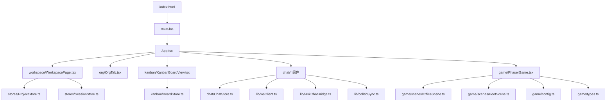
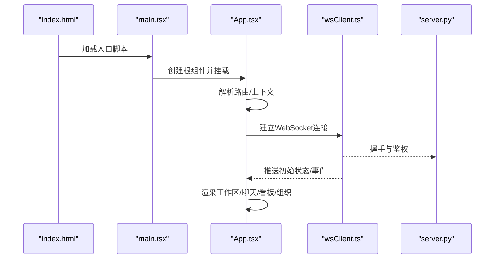
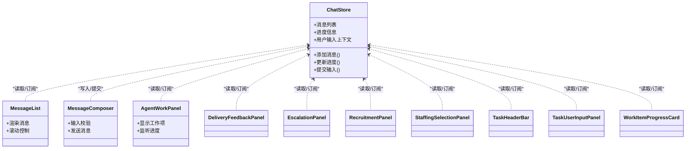
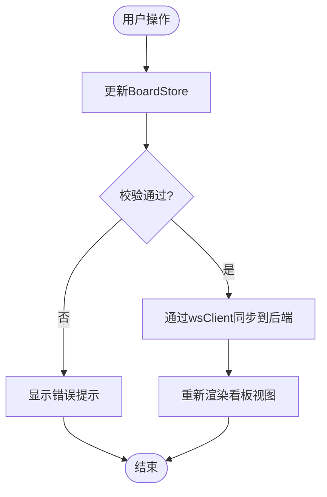
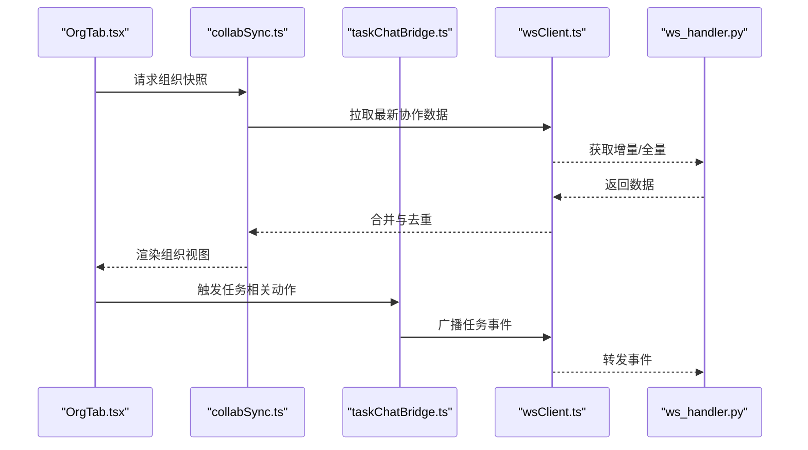
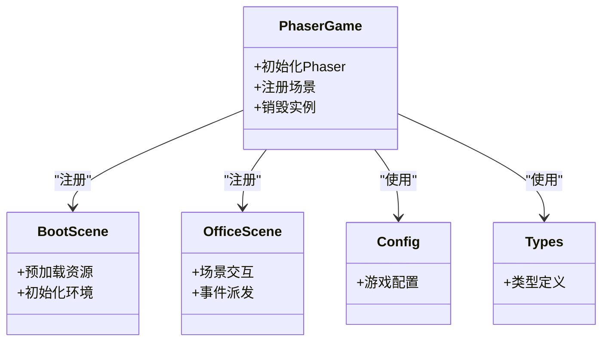
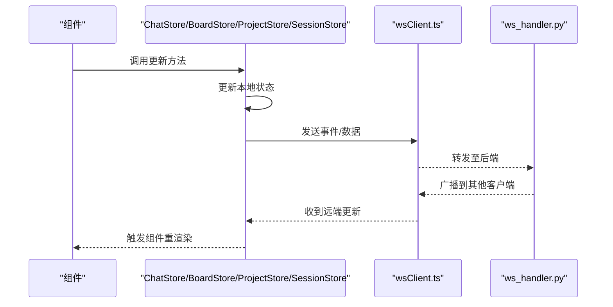
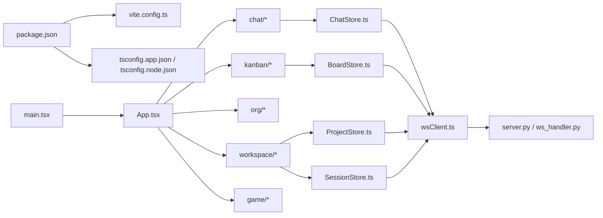

# 前端架构设计

<cite>
**本文引用的文件**   
- [vite.config.ts](file://opc/plugins/office_ui/frontend_src/vite.config.ts)
- [package.json](file://opc/plugins/office_ui/frontend_src/package.json)
- [tsconfig.app.json](file://opc/plugins/office_ui/frontend_src/tsconfig.app.json)
- [tsconfig.node.json](file://opc/plugins/office_ui/frontend_src/tsconfig.node.json)
- [index.html](file://opc/plugins/office_ui/frontend_src/index.html)
- [main.tsx](file://opc/plugins/office_ui/frontend_src/main.tsx)
- [App.tsx](file://opc/plugins/office_ui/frontend_src/App.tsx)
- [ChatStore.ts](file://opc/plugins/office_ui/frontend_src/chat/ChatStore.ts)
- [BoardStore.ts](file://opc/plugins/office_ui/frontend_src/kanban/BoardStore.ts)
- [ProjectStore.ts](file://opc/plugins/office_ui/frontend_src/stores/ProjectStore.ts)
- [SessionStore.ts](file://opc/plugins/office_ui/frontend_src/stores/SessionStore.ts)
- [wsClient.ts](file://opc/plugins/office_ui/frontend_src/lib/wsClient.ts)
- [taskChatBridge.ts](file://opc/plugins/office_ui/frontend_src/lib/taskChatBridge.ts)
- [collabSync.ts](file://opc/plugins/office_ui/frontend_src/lib/collabSync.ts)
- [PhaserGame.tsx](file://opc/plugins/office_ui/frontend_src/game/PhaserGame.tsx)
- [OfficeScene.ts](file://opc/plugins/office_ui/frontend_src/game/scenes/OfficeScene.ts)
- [BootScene.ts](file://opc/plugins/office_ui/frontend_src/game/scenes/BootScene.ts)
- [config.ts](file://opc/plugins/office_ui/frontend_src/game/config.ts)
- [types.ts](file://opc/plugins/office_ui/frontend_src/game/types.ts)
- [WorkspacePage.tsx](file://opc/plugins/office_ui/frontend_src/workspace/WorkspacePage.tsx)
- [OrgTab.tsx](file://opc/plugins/office_ui/frontend_src/org/OrgTab.tsx)
- [KanbanBoardView.tsx](file://opc/plugins/office_ui/frontend_src/kanban/KanbanBoardView.tsx)
- [MessageList.tsx](file://opc/plugins/office_ui/frontend_src/chat/MessageList.tsx)
- [MessageComposer.tsx](file://opc/plugins/office_ui/frontend_src/chat/MessageComposer.tsx)
- [AgentWorkPanel.tsx](file://opc/plugins/office_ui/frontend_src/chat/AgentWorkPanel.tsx)
- [DeliveryFeedbackPanel.tsx](file://opc/plugins/office_ui/frontend_src/chat/DeliveryFeedbackPanel.tsx)
- [EscalationPanel.tsx](file://opc/plugins/office_ui/frontend_src/chat/EscalationPanel.tsx)
- [RecruitmentPanel.tsx](file://opc/plugins/office_ui/frontend_src/chat/RecruitmentPanel.tsx)
- [StaffingSelectionPanel.tsx](file://opc/plugins/office_ui/frontend_src/chat/StaffingSelectionPanel.tsx)
- [TaskHeaderBar.tsx](file://opc/plugins/office_ui/frontend_src/chat/TaskHeaderBar.tsx)
- [TaskUserInputPanel.tsx](file://opc/plugins/office_ui/frontend_src/chat/TaskUserInputPanel.tsx)
- [WorkItemProgressCard.tsx](file://opc/plugins/office_ui/frontend_src/chat/WorkItemProgressCard.tsx)
- [checkpointUtils.ts](file://opc/plugins/office_ui/frontend_src/chat/checkpointUtils.ts)
- [Server.py](file://opc/plugins/office_ui/server.py)
- [ws_handler.py](file://opc/plugins/office_ui/ws_handler.py)
</cite>

## 目录
1. [简介](#简介)
2. [项目结构](#项目结构)
3. [核心组件](#核心组件)
4. [架构总览](#架构总览)
5. [详细组件分析](#详细组件分析)
6. [依赖分析](#依赖分析)
7. [性能考虑](#性能考虑)
8. [故障排查指南](#故障排查指南)
9. [结论](#结论)
10. [附录](#附录)

## 简介
本文件面向OpenOPC的前端架构设计与工程化实践，聚焦React + TypeScript技术栈与Vite构建体系。文档覆盖以下主题：
- 技术栈选择与整体架构模式
- Vite构建配置、模块组织与依赖管理策略
- 应用启动流程、路由设计与页面组织结构
- 状态管理模式（全局状态与组件通信）
- TypeScript类型定义与接口规范
- 工程化配置（代码规范、测试框架、开发工具链）
- 性能优化与打包优化策略

## 项目结构
前端源码位于插件子目录中，采用“按功能域+分层”的混合组织方式：
- 入口与运行时：index.html、main.tsx、App.tsx
- 业务域：chat、kanban、org、workspace、game
- 共享能力：lib（WebSocket、任务聊天桥接、协作同步等）
- 状态层：stores（项目、会话等）
- 游戏子系统：Phaser集成场景与实体系统
- 构建与配置：vite.config.ts、tsconfig.*、package.json



图表来源
- [index.html](file://opc/plugins/office_ui/frontend_src/index.html)
- [main.tsx](file://opc/plugins/office_ui/frontend_src/main.tsx)
- [App.tsx](file://opc/plugins/office_ui/frontend_src/App.tsx)
- [WorkspacePage.tsx](file://opc/plugins/office_ui/frontend_src/workspace/WorkspacePage.tsx)
- [OrgTab.tsx](file://opc/plugins/office_ui/frontend_src/org/OrgTab.tsx)
- [KanbanBoardView.tsx](file://opc/plugins/office_ui/frontend_src/kanban/KanbanBoardView.tsx)
- [MessageList.tsx](file://opc/plugins/office_ui/frontend_src/chat/MessageList.tsx)
- [MessageComposer.tsx](file://opc/plugins/office_ui/frontend_src/chat/MessageComposer.tsx)
- [AgentWorkPanel.tsx](file://opc/plugins/office_ui/frontend_src/chat/AgentWorkPanel.tsx)
- [DeliveryFeedbackPanel.tsx](file://opc/plugins/office_ui/frontend_src/chat/DeliveryFeedbackPanel.tsx)
- [EscalationPanel.tsx](file://opc/plugins/office_ui/frontend_src/chat/EscalationPanel.tsx)
- [RecruitmentPanel.tsx](file://opc/plugins/office_ui/frontend_src/chat/RecruitmentPanel.tsx)
- [StaffingSelectionPanel.tsx](file://opc/plugins/office_ui/frontend_src/chat/StaffingSelectionPanel.tsx)
- [TaskHeaderBar.tsx](file://opc/plugins/office_ui/frontend_src/chat/TaskHeaderBar.tsx)
- [TaskUserInputPanel.tsx](file://opc/plugins/office_ui/frontend_src/chat/TaskUserInputPanel.tsx)
- [WorkItemProgressCard.tsx](file://opc/plugins/office_ui/frontend_src/chat/WorkItemProgressCard.tsx)
- [ChatStore.ts](file://opc/plugins/office_ui/frontend_src/chat/ChatStore.ts)
- [BoardStore.ts](file://opc/plugins/office_ui/frontend_src/kanban/BoardStore.ts)
- [ProjectStore.ts](file://opc/plugins/office_ui/frontend_src/stores/ProjectStore.ts)
- [SessionStore.ts](file://opc/plugins/office_ui/frontend_src/stores/SessionStore.ts)
- [wsClient.ts](file://opc/plugins/office_ui/frontend_src/lib/wsClient.ts)
- [taskChatBridge.ts](file://opc/plugins/office_ui/frontend_src/lib/taskChatBridge.ts)
- [collabSync.ts](file://opc/plugins/office_ui/frontend_src/lib/collabSync.ts)
- [PhaserGame.tsx](file://opc/plugins/office_ui/frontend_src/game/PhaserGame.tsx)
- [OfficeScene.ts](file://opc/plugins/office_ui/frontend_src/game/scenes/OfficeScene.ts)
- [BootScene.ts](file://opc/plugins/office_ui/frontend_src/game/scenes/BootScene.ts)
- [config.ts](file://opc/plugins/office_ui/frontend_src/game/config.ts)
- [types.ts](file://opc/plugins/office_ui/frontend_src/game/types.ts)

章节来源
- [vite.config.ts](file://opc/plugins/office_ui/frontend_src/vite.config.ts)
- [package.json](file://opc/plugins/office_ui/frontend_src/package.json)
- [tsconfig.app.json](file://opc/plugins/office_ui/frontend_src/tsconfig.app.json)
- [tsconfig.node.json](file://opc/plugins/office_ui/frontend_src/tsconfig.node.json)
- [index.html](file://opc/plugins/office_ui/frontend_src/index.html)
- [main.tsx](file://opc/plugins/office_ui/frontend_src/main.tsx)
- [App.tsx](file://opc/plugins/office_ui/frontend_src/App.tsx)

## 核心组件
- 应用壳与页面容器
  - App.tsx作为根组件，负责挂载各业务视图与布局。
  - WorkspacePage.tsx承载工作区主界面，组合聊天、看板、组织管理等面板。
- 聊天域
  - ChatStore.ts维护消息流、进度与用户输入上下文。
  - MessageList.tsx、MessageComposer.tsx、AgentWorkPanel.tsx等构成对话交互。
  - DeliveryFeedbackPanel.tsx、EscalationPanel.tsx、RecruitmentPanel.tsx、StaffingSelectionPanel.tsx、TaskHeaderBar.tsx、TaskUserInputPanel.tsx、WorkItemProgressCard.tsx为任务与交付相关的专用面板。
- 看板域
  - BoardStore.ts维护看板数据与流转逻辑。
  - KanbanBoardView.tsx渲染列与卡片。
- 组织域
  - OrgTab.tsx提供组织架构与角色/人才市场等视图。
- 游戏域
  - PhaserGame.tsx封装Phaser实例生命周期。
  - OfficeScene.ts、BootScene.ts实现场景逻辑。
  - config.ts、types.ts提供游戏配置与类型。
- 共享能力
  - wsClient.ts封装WebSocket连接、重连与事件分发。
  - taskChatBridge.ts在任务系统与聊天之间做桥接。
  - collabSync.ts处理协作数据的同步与冲突解决。
- 状态层
  - ProjectStore.ts、SessionStore.ts分别管理项目与会话级状态。

章节来源
- [App.tsx](file://opc/plugins/office_ui/frontend_src/App.tsx)
- [WorkspacePage.tsx](file://opc/plugins/office_ui/frontend_src/workspace/WorkspacePage.tsx)
- [ChatStore.ts](file://opc/plugins/office_ui/frontend_src/chat/ChatStore.ts)
- [MessageList.tsx](file://opc/plugins/office_ui/frontend_src/chat/MessageList.tsx)
- [MessageComposer.tsx](file://opc/plugins/office_ui/frontend_src/chat/MessageComposer.tsx)
- [AgentWorkPanel.tsx](file://opc/plugins/office_ui/frontend_src/chat/AgentWorkPanel.tsx)
- [DeliveryFeedbackPanel.tsx](file://opc/plugins/office_ui/frontend_src/chat/DeliveryFeedbackPanel.tsx)
- [EscalationPanel.tsx](file://opc/plugins/office_ui/frontend_src/chat/EscalationPanel.tsx)
- [RecruitmentPanel.tsx](file://opc/plugins/office_ui/frontend_src/chat/RecruitmentPanel.tsx)
- [StaffingSelectionPanel.tsx](file://opc/plugins/office_ui/frontend_src/chat/StaffingSelectionPanel.tsx)
- [TaskHeaderBar.tsx](file://opc/plugins/office_ui/frontend_src/chat/TaskHeaderBar.tsx)
- [TaskUserInputPanel.tsx](file://opc/plugins/office_ui/frontend_src/chat/TaskUserInputPanel.tsx)
- [WorkItemProgressCard.tsx](file://opc/plugins/office_ui/frontend_src/chat/WorkItemProgressCard.tsx)
- [BoardStore.ts](file://opc/plugins/office_ui/frontend_src/kanban/BoardStore.ts)
- [KanbanBoardView.tsx](file://opc/plugins/office_ui/frontend_src/kanban/KanbanBoardView.tsx)
- [OrgTab.tsx](file://opc/plugins/office_ui/frontend_src/org/OrgTab.tsx)
- [PhaserGame.tsx](file://opc/plugins/office_ui/frontend_src/game/PhaserGame.tsx)
- [OfficeScene.ts](file://opc/plugins/office_ui/frontend_src/game/scenes/OfficeScene.ts)
- [BootScene.ts](file://opc/plugins/office_ui/frontend_src/game/scenes/BootScene.ts)
- [config.ts](file://opc/plugins/office_ui/frontend_src/game/config.ts)
- [types.ts](file://opc/plugins/office_ui/frontend_src/game/types.ts)
- [wsClient.ts](file://opc/plugins/office_ui/frontend_src/lib/wsClient.ts)
- [taskChatBridge.ts](file://opc/plugins/office_ui/frontend_src/lib/taskChatBridge.ts)
- [collabSync.ts](file://opc/plugins/office_ui/frontend_src/lib/collabSync.ts)
- [ProjectStore.ts](file://opc/plugins/office_ui/frontend_src/stores/ProjectStore.ts)
- [SessionStore.ts](file://opc/plugins/office_ui/frontend_src/stores/SessionStore.ts)

## 架构总览
前端采用“单页应用 + 多域组件 + 轻量状态库 + WebSocket实时通信”的模式。后端通过Python服务提供HTTP静态资源与WS通道，前端通过Vite进行开发与构建。

```mermaid
graph TB
subgraph "浏览器"
UI["React 组件树<br/>聊天/看板/组织/工作区"]
Store["状态存储<br/>ChatStore/BoardStore/ProjectStore/SessionStore"]
WS["wsClient.ts<br/>WebSocket客户端"]
Game["PhaserGame.tsx<br/>游戏场景"]
end
subgraph "后端服务"
HTTP["server.py<br/>静态资源与API"]
WSH["ws_handler.py<br/>WebSocket处理器"]
end
UI --> Store
UI --> WS
Game --> UI
WS <- --> WSH
UI <- --> HTTP
```

图表来源
- [main.tsx](file://opc/plugins/office_ui/frontend_src/main.tsx)
- [App.tsx](file://opc/plugins/office_ui/frontend_src/App.tsx)
- [ChatStore.ts](file://opc/plugins/office_ui/frontend_src/chat/ChatStore.ts)
- [BoardStore.ts](file://opc/plugins/office_ui/frontend_src/kanban/BoardStore.ts)
- [ProjectStore.ts](file://opc/plugins/office_ui/frontend_src/stores/ProjectStore.ts)
- [SessionStore.ts](file://opc/plugins/office_ui/frontend_src/stores/SessionStore.ts)
- [wsClient.ts](file://opc/plugins/office_ui/frontend_src/lib/wsClient.ts)
- [PhaserGame.tsx](file://opc/plugins/office_ui/frontend_src/game/PhaserGame.tsx)
- [Server.py](file://opc/plugins/office_ui/server.py)
- [ws_handler.py](file://opc/plugins/office_ui/ws_handler.py)

## 详细组件分析

### 应用启动与路由
- 启动流程
  - index.html加载main.tsx，初始化React根节点并挂载App。
  - App.tsx根据当前上下文渲染不同页面或面板（如工作区、组织、看板）。
- 路由设计
  - 采用基于条件渲染的路由策略，通过URL参数或内部状态切换视图。
  - 工作区页面WorkspacePage.tsx作为主容器，聚合聊天、看板、组织等子视图。



图表来源
- [index.html](file://opc/plugins/office_ui/frontend_src/index.html)
- [main.tsx](file://opc/plugins/office_ui/frontend_src/main.tsx)
- [App.tsx](file://opc/plugins/office_ui/frontend_src/App.tsx)
- [wsClient.ts](file://opc/plugins/office_ui/frontend_src/lib/wsClient.ts)
- [Server.py](file://opc/plugins/office_ui/server.py)

章节来源
- [index.html](file://opc/plugins/office_ui/frontend_src/index.html)
- [main.tsx](file://opc/plugins/office_ui/frontend_src/main.tsx)
- [App.tsx](file://opc/plugins/office_ui/frontend_src/App.tsx)
- [WorkspacePage.tsx](file://opc/plugins/office_ui/frontend_src/workspace/WorkspacePage.tsx)

### 聊天域组件与状态
- 状态模型
  - ChatStore.ts集中管理消息列表、进度、用户输入上下文与任务关联。
- 组件职责
  - MessageList.tsx负责消息渲染与滚动。
  - MessageComposer.tsx负责输入与发送。
  - AgentWorkPanel.tsx展示代理工作项与执行状态。
  - DeliveryFeedbackPanel.tsx、EscalationPanel.tsx、RecruitmentPanel.tsx、StaffingSelectionPanel.tsx、TaskHeaderBar.tsx、TaskUserInputPanel.tsx、WorkItemProgressCard.tsx分别承担交付反馈、升级、招聘、人员选择、任务头部、用户输入与进度卡片等职责。
- 数据流
  - 组件订阅ChatStore变更；用户操作触发store更新；store通过wsClient向服务端广播。



图表来源
- [ChatStore.ts](file://opc/plugins/office_ui/frontend_src/chat/ChatStore.ts)
- [MessageList.tsx](file://opc/plugins/office_ui/frontend_src/chat/MessageList.tsx)
- [MessageComposer.tsx](file://opc/plugins/office_ui/frontend_src/chat/MessageComposer.tsx)
- [AgentWorkPanel.tsx](file://opc/plugins/office_ui/frontend_src/chat/AgentWorkPanel.tsx)
- [DeliveryFeedbackPanel.tsx](file://opc/plugins/office_ui/frontend_src/chat/DeliveryFeedbackPanel.tsx)
- [EscalationPanel.tsx](file://opc/plugins/office_ui/frontend_src/chat/EscalationPanel.tsx)
- [RecruitmentPanel.tsx](file://opc/plugins/office_ui/frontend_src/chat/RecruitmentPanel.tsx)
- [StaffingSelectionPanel.tsx](file://opc/plugins/office_ui/frontend_src/chat/StaffingSelectionPanel.tsx)
- [TaskHeaderBar.tsx](file://opc/plugins/office_ui/frontend_src/chat/TaskHeaderBar.tsx)
- [TaskUserInputPanel.tsx](file://opc/plugins/office_ui/frontend_src/chat/TaskUserInputPanel.tsx)
- [WorkItemProgressCard.tsx](file://opc/plugins/office_ui/frontend_src/chat/WorkItemProgressCard.tsx)

章节来源
- [ChatStore.ts](file://opc/plugins/office_ui/frontend_src/chat/ChatStore.ts)
- [MessageList.tsx](file://opc/plugins/office_ui/frontend_src/chat/MessageList.tsx)
- [MessageComposer.tsx](file://opc/plugins/office_ui/frontend_src/chat/MessageComposer.tsx)
- [AgentWorkPanel.tsx](file://opc/plugins/office_ui/frontend_src/chat/AgentWorkPanel.tsx)
- [DeliveryFeedbackPanel.tsx](file://opc/plugins/office_ui/frontend_src/chat/DeliveryFeedbackPanel.tsx)
- [EscalationPanel.tsx](file://opc/plugins/office_ui/frontend_src/chat/EscalationPanel.tsx)
- [RecruitmentPanel.tsx](file://opc/plugins/office_ui/frontend_src/chat/RecruitmentPanel.tsx)
- [StaffingSelectionPanel.tsx](file://opc/plugins/office_ui/frontend_src/chat/StaffingSelectionPanel.tsx)
- [TaskHeaderBar.tsx](file://opc/plugins/office_ui/frontend_src/chat/TaskHeaderBar.tsx)
- [TaskUserInputPanel.tsx](file://opc/plugins/office_ui/frontend_src/chat/TaskUserInputPanel.tsx)
- [WorkItemProgressCard.tsx](file://opc/plugins/office_ui/frontend_src/chat/WorkItemProgressCard.tsx)

### 看板域组件与状态
- 状态模型
  - BoardStore.ts维护看板列、卡片与流转规则。
- 组件职责
  - KanbanBoardView.tsx渲染列与卡片，响应拖拽与状态变更。
- 数据流
  - 组件订阅BoardStore；用户交互触发store更新；store通过wsClient同步到后端。



图表来源
- [BoardStore.ts](file://opc/plugins/office_ui/frontend_src/kanban/BoardStore.ts)
- [KanbanBoardView.tsx](file://opc/plugins/office_ui/frontend_src/kanban/KanbanBoardView.tsx)
- [wsClient.ts](file://opc/plugins/office_ui/frontend_src/lib/wsClient.ts)

章节来源
- [BoardStore.ts](file://opc/plugins/office_ui/frontend_src/kanban/BoardStore.ts)
- [KanbanBoardView.tsx](file://opc/plugins/office_ui/frontend_src/kanban/KanbanBoardView.tsx)

### 组织域与协作同步
- 组织视图
  - OrgTab.tsx提供组织架构图、角色与人才市场等能力。
- 协作同步
  - collabSync.ts负责多端数据一致性、冲突检测与合并策略。
- 任务聊天桥接
  - taskChatBridge.ts将任务系统与聊天消息打通，确保上下文一致。



图表来源
- [OrgTab.tsx](file://opc/plugins/office_ui/frontend_src/org/OrgTab.tsx)
- [collabSync.ts](file://opc/plugins/office_ui/frontend_src/lib/collabSync.ts)
- [taskChatBridge.ts](file://opc/plugins/office_ui/frontend_src/lib/taskChatBridge.ts)
- [wsClient.ts](file://opc/plugins/office_ui/frontend_src/lib/wsClient.ts)
- [ws_handler.py](file://opc/plugins/office_ui/ws_handler.py)

章节来源
- [OrgTab.tsx](file://opc/plugins/office_ui/frontend_src/org/OrgTab.tsx)
- [collabSync.ts](file://opc/plugins/office_ui/frontend_src/lib/collabSync.ts)
- [taskChatBridge.ts](file://opc/plugins/office_ui/frontend_src/lib/taskChatBridge.ts)
- [wsClient.ts](file://opc/plugins/office_ui/frontend_src/lib/wsClient.ts)
- [ws_handler.py](file://opc/plugins/office_ui/ws_handler.py)

### 游戏子系统（Phaser）
- 组件职责
  - PhaserGame.tsx封装Phaser实例生命周期，管理场景注册与销毁。
  - BootScene.ts负责资源预加载与初始化。
  - OfficeScene.ts实现办公场景交互逻辑。
  - config.ts与types.ts提供游戏配置与类型约束。
- 数据流
  - 游戏事件通过回调与React组件通信，必要时借助wsClient与后端同步。



图表来源
- [PhaserGame.tsx](file://opc/plugins/office_ui/frontend_src/game/PhaserGame.tsx)
- [BootScene.ts](file://opc/plugins/office_ui/frontend_src/game/scenes/BootScene.ts)
- [OfficeScene.ts](file://opc/plugins/office_ui/frontend_src/game/scenes/OfficeScene.ts)
- [config.ts](file://opc/plugins/office_ui/frontend_src/game/config.ts)
- [types.ts](file://opc/plugins/office_ui/frontend_src/game/types.ts)

章节来源
- [PhaserGame.tsx](file://opc/plugins/office_ui/frontend_src/game/PhaserGame.tsx)
- [BootScene.ts](file://opc/plugins/office_ui/frontend_src/game/scenes/BootScene.ts)
- [OfficeScene.ts](file://opc/plugins/office_ui/frontend_src/game/scenes/OfficeScene.ts)
- [config.ts](file://opc/plugins/office_ui/frontend_src/game/config.ts)
- [types.ts](file://opc/plugins/office_ui/frontend_src/game/types.ts)

### 状态管理与组件通信机制
- 全局状态
  - ChatStore.ts、BoardStore.ts、ProjectStore.ts、SessionStore.ts分别管理聊天、看板、项目与会话状态。
- 组件通信
  - 组件通过订阅store变更实现单向数据流。
  - 跨域通信通过wsClient统一封装，避免分散的Socket调用。
- 典型流程
  - 用户输入 -> 组件调用store方法 -> store更新本地状态 -> 通过wsClient广播 -> 其他客户端接收并更新。



图表来源
- [ChatStore.ts](file://opc/plugins/office_ui/frontend_src/chat/ChatStore.ts)
- [BoardStore.ts](file://opc/plugins/office_ui/frontend_src/kanban/BoardStore.ts)
- [ProjectStore.ts](file://opc/plugins/office_ui/frontend_src/stores/ProjectStore.ts)
- [SessionStore.ts](file://opc/plugins/office_ui/frontend_src/stores/SessionStore.ts)
- [wsClient.ts](file://opc/plugins/office_ui/frontend_src/lib/wsClient.ts)
- [ws_handler.py](file://opc/plugins/office_ui/ws_handler.py)

章节来源
- [ChatStore.ts](file://opc/plugins/office_ui/frontend_src/chat/ChatStore.ts)
- [BoardStore.ts](file://opc/plugins/office_ui/frontend_src/kanban/BoardStore.ts)
- [ProjectStore.ts](file://opc/plugins/office_ui/frontend_src/stores/ProjectStore.ts)
- [SessionStore.ts](file://opc/plugins/office_ui/frontend_src/stores/SessionStore.ts)
- [wsClient.ts](file://opc/plugins/office_ui/frontend_src/lib/wsClient.ts)
- [ws_handler.py](file://opc/plugins/office_ui/ws_handler.py)

### 类型定义与接口规范
- TypeScript配置
  - tsconfig.app.json用于应用编译选项。
  - tsconfig.node.json用于Node侧工具链配置。
- 类型组织
  - game/types.ts定义游戏相关类型。
  - chat/checkpointUtils.ts包含检查点工具类型。
  - 各store与组件内定义局部类型，保持高内聚低耦合。
- 接口契约
  - wsClient.ts定义前后端消息协议与事件命名空间。
  - taskChatBridge.ts定义任务与聊天之间的转换接口。

章节来源
- [tsconfig.app.json](file://opc/plugins/office_ui/frontend_src/tsconfig.app.json)
- [tsconfig.node.json](file://opc/plugins/office_ui/frontend_src/tsconfig.node.json)
- [types.ts](file://opc/plugins/office_ui/frontend_src/game/types.ts)
- [checkpointUtils.ts](file://opc/plugins/office_ui/frontend_src/chat/checkpointUtils.ts)
- [wsClient.ts](file://opc/plugins/office_ui/frontend_src/lib/wsClient.ts)
- [taskChatBridge.ts](file://opc/plugins/office_ui/frontend_src/lib/taskChatBridge.ts)

## 依赖分析
- 构建与运行依赖
  - package.json声明了React、TypeScript、Vite及相关插件与工具。
- 模块依赖关系
  - main.tsx -> App.tsx -> 各业务域组件
  - 各store -> wsClient -> 后端服务
  - PhaserGame.tsx -> 场景与配置/类型



图表来源
- [package.json](file://opc/plugins/office_ui/frontend_src/package.json)
- [vite.config.ts](file://opc/plugins/office_ui/frontend_src/vite.config.ts)
- [tsconfig.app.json](file://opc/plugins/office_ui/frontend_src/tsconfig.app.json)
- [tsconfig.node.json](file://opc/plugins/office_ui/frontend_src/tsconfig.node.json)
- [main.tsx](file://opc/plugins/office_ui/frontend_src/main.tsx)
- [App.tsx](file://opc/plugins/office_ui/frontend_src/App.tsx)
- [ChatStore.ts](file://opc/plugins/office_ui/frontend_src/chat/ChatStore.ts)
- [BoardStore.ts](file://opc/plugins/office_ui/frontend_src/kanban/BoardStore.ts)
- [ProjectStore.ts](file://opc/plugins/office_ui/frontend_src/stores/ProjectStore.ts)
- [SessionStore.ts](file://opc/plugins/office_ui/frontend_src/stores/SessionStore.ts)
- [wsClient.ts](file://opc/plugins/office_ui/frontend_src/lib/wsClient.ts)
- [Server.py](file://opc/plugins/office_ui/server.py)
- [ws_handler.py](file://opc/plugins/office_ui/ws_handler.py)

章节来源
- [package.json](file://opc/plugins/office_ui/frontend_src/package.json)
- [vite.config.ts](file://opc/plugins/office_ui/frontend_src/vite.config.ts)
- [tsconfig.app.json](file://opc/plugins/office_ui/frontend_src/tsconfig.app.json)
- [tsconfig.node.json](file://opc/plugins/office_ui/frontend_src/tsconfig.node.json)
- [main.tsx](file://opc/plugins/office_ui/frontend_src/main.tsx)
- [App.tsx](file://opc/plugins/office_ui/frontend_src/App.tsx)
- [ChatStore.ts](file://opc/plugins/office_ui/frontend_src/chat/ChatStore.ts)
- [BoardStore.ts](file://opc/plugins/office_ui/frontend_src/kanban/BoardStore.ts)
- [ProjectStore.ts](file://opc/plugins/office_ui/frontend_src/stores/ProjectStore.ts)
- [SessionStore.ts](file://opc/plugins/office_ui/frontend_src/stores/SessionStore.ts)
- [wsClient.ts](file://opc/plugins/office_ui/frontend_src/lib/wsClient.ts)
- [Server.py](file://opc/plugins/office_ui/server.py)
- [ws_handler.py](file://opc/plugins/office_ui/ws_handler.py)

## 性能考虑
- 构建与打包
  - 使用Vite进行快速热重载与按需构建。
  - 合理拆分chunk，减少首屏体积。
- 渲染优化
  - 对长列表（如消息列表）采用虚拟滚动或分页加载。
  - 避免不必要的重渲染，利用store细粒度订阅。
- 网络优化
  - WebSocket消息批处理与节流，降低频繁更新带来的压力。
  - 增量同步与差异合并，减少传输数据量。
- 资源优化
  - 图片与字体压缩与懒加载。
  - 游戏资源预加载与分场景加载。

[本节为通用指导，不直接分析具体文件]

## 故障排查指南
- WebSocket连接问题
  - 检查wsClient.ts的连接与重连逻辑。
  - 确认后端ws_handler.py是否正常监听与处理握手。
- 状态不一致
  - 核对store更新路径与事件分发顺序。
  - 使用collabSync.ts的冲突检测与合并日志定位问题。
- 渲染卡顿
  - 检查MessageList.tsx等长列表组件是否启用虚拟化。
  - 评估ChatStore.ts的数据结构与更新频率。
- 构建失败
  - 查看vite.config.ts与tsconfig.*配置是否正确。
  - 清理缓存后重试构建。

章节来源
- [wsClient.ts](file://opc/plugins/office_ui/frontend_src/lib/wsClient.ts)
- [ws_handler.py](file://opc/plugins/office_ui/ws_handler.py)
- [collabSync.ts](file://opc/plugins/office_ui/frontend_src/lib/collabSync.ts)
- [ChatStore.ts](file://opc/plugins/office_ui/frontend_src/chat/ChatStore.ts)
- [MessageList.tsx](file://opc/plugins/office_ui/frontend_src/chat/MessageList.tsx)
- [vite.config.ts](file://opc/plugins/office_ui/frontend_src/vite.config.ts)
- [tsconfig.app.json](file://opc/plugins/office_ui/frontend_src/tsconfig.app.json)
- [tsconfig.node.json](file://opc/plugins/office_ui/frontend_src/tsconfig.node.json)

## 结论
OpenOPC前端采用React + TypeScript + Vite的现代工程化方案，结合轻量状态库与WebSocket实现实时协作。通过清晰的模块划分与类型约束，保证了可维护性与扩展性。后续可在性能优化、测试覆盖率与自动化流水线方面持续完善。

[本节为总结性内容，不直接分析具体文件]

## 附录
- 工程化建议
  - 引入ESLint与Prettier统一代码风格。
  - 使用Vitest/Jest进行单元测试与集成测试。
  - 配置CI/CD流水线，自动构建与部署。
- 开发工具链
  - 使用VSCode插件提升TypeScript与React体验。
  - 使用Chrome DevTools与React Profiler进行性能分析。

[本节为通用指导，不直接分析具体文件]