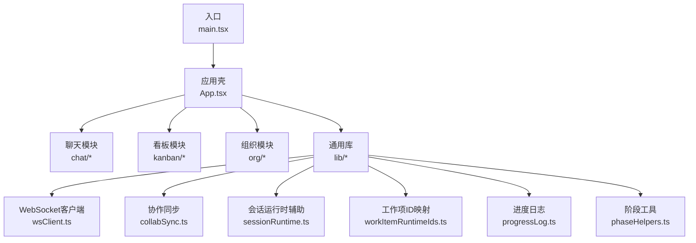
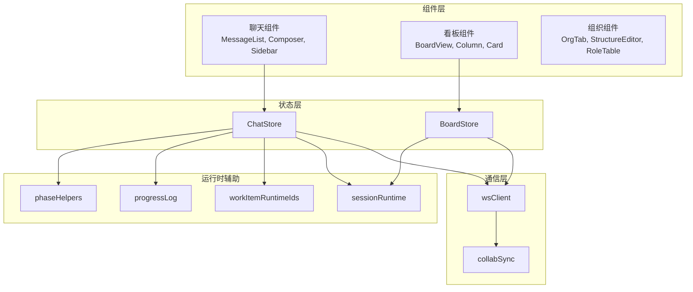
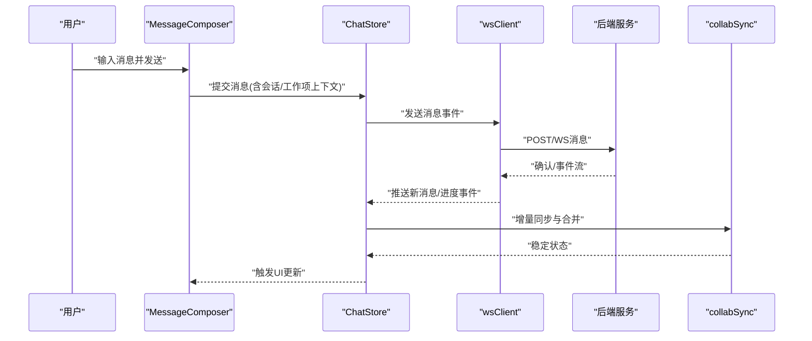
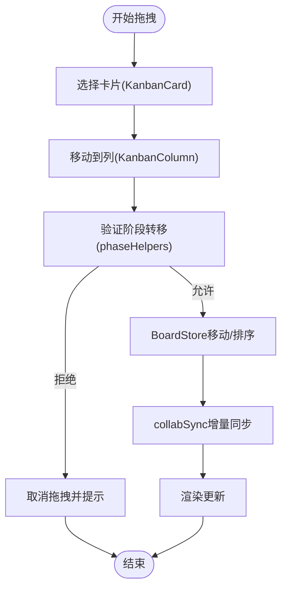
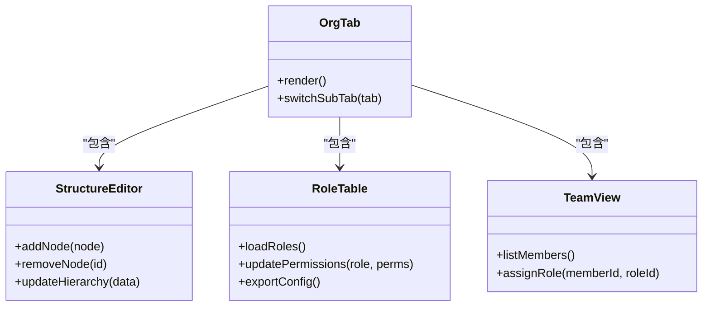
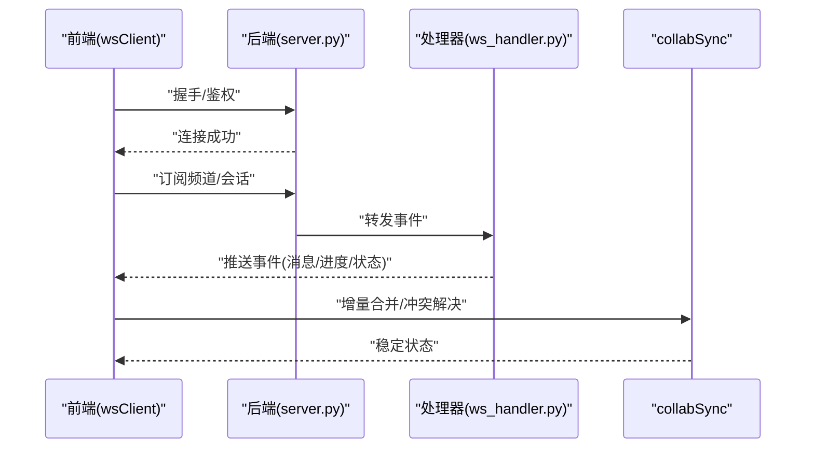
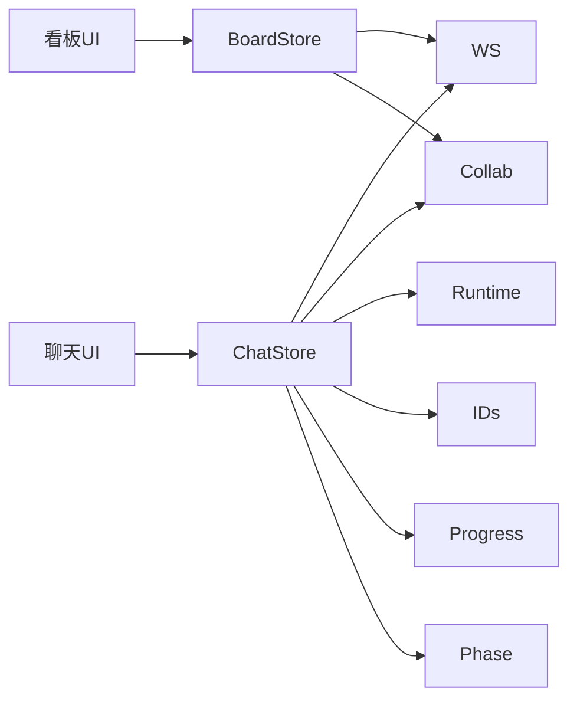

# 前端界面

<cite>
**本文引用的文件**   
- [App.tsx](file://opc/plugins/office_ui/frontend_src/App.tsx)
- [main.tsx](file://opc/plugins/office_ui/frontend_src/main.tsx)
- [index.html](file://opc/plugins/office_ui/frontend_src/index.html)
- [vite.config.ts](file://opc/plugins/office_ui/frontend_src/vite.config.ts)
- [package.json](file://opc/plugins/office_ui/frontend_src/package.json)
- [ChatStore.ts](file://opc/plugins/office_ui/frontend_src/chat/ChatStore.ts)
- [MessageList.tsx](file://opc/plugins/office_ui/frontend_src/chat/MessageList.tsx)
- [MessageComposer.tsx](file://opc/plugins/office_ui/frontend_src/chat/MessageComposer.tsx)
- [MarkdownBody.tsx](file://opc/plugins/office_ui/frontend_src/chat/MarkdownBody.tsx)
- [SessionSidebar.tsx](file://opc/plugins/office_ui/frontend_src/chat/SessionSidebar.tsx)
- [TaskHeaderBar.tsx](file://opc/plugins/office_ui/frontend_src/chat/TaskHeaderBar.tsx)
- [TaskUserInputPanel.tsx](file://opc/plugins/office_ui/frontend_src/chat/TaskUserInputPanel.tsx)
- [WorkItemProgressCard.tsx](file://opc/plugins/office_ui/frontend_src/chat/WorkItemProgressCard.tsx)
- [BoardStore.ts](file://opc/plugins/office_ui/frontend_src/kanban/BoardStore.ts)
- [KanbanBoardView.tsx](file://opc/plugins/office_ui/frontend_src/kanban/KanbanBoardView.tsx)
- [KanbanColumn.tsx](file://opc/plugins/office_ui/frontend_src/kanban/KanbanColumn.tsx)
- [KanbanCard.tsx](file://opc/plugins/office_ui/frontend_src/kanban/KanbanCard.tsx)
- [ExecutionPanel.tsx](file://opc/plugins/office_ui/frontend_src/kanban/ExecutionPanel.tsx)
- [collabSync.ts](file://opc/plugins/office_ui/frontend_src/lib/collabSync.ts)
- [wsClient.ts](file://opc/plugins/office_ui/frontend_src/lib/wsClient.ts)
- [sessionRuntime.ts](file://opc/plugins/office_ui/frontend_src/lib/sessionRuntime.ts)
- [workItemRuntimeIds.ts](file://opc/plugins/office_ui/frontend_src/lib/workItemRuntimeIds.ts)
- [progressLog.ts](file://opc/plugins/office_ui/frontend_src/lib/progressLog.ts)
- [phaseHelpers.ts](file://opc/plugins/office_ui/frontend_src/lib/phaseHelpers.ts)
- [org.css](file://opc/plugins/office_ui/frontend_src/org/org.css)
- [StructureEditor.tsx](file://opc/plugins/office_ui/frontend_src/org/StructureEditor.tsx)
- [RoleTable.tsx](file://opc/plugins/office_ui/frontend_src/org/RoleTable.tsx)
- [TeamView.tsx](file://opc/plugins/office_ui/frontend_src/org/TeamView.tsx)
- [OrgTab.tsx](file://opc/plugins/office_ui/frontend_src/org/OrgTab.tsx)
- [server.py](file://opc/plugins/office_ui/server.py)
- [ws_handler.py](file://opc/plugins/office_ui/ws_handler.py)
</cite>

## 目录
1. [简介](#简介)
2. [项目结构](#项目结构)
3. [核心组件](#核心组件)
4. [架构总览](#架构总览)
5. [详细组件分析](#详细组件分析)
6. [依赖分析](#依赖分析)
7. [性能考虑](#性能考虑)
8. [故障排查指南](#故障排查指南)
9. [结论](#结论)
10. [附录](#附录)

## 简介
本章节面向OpenOPC的前端界面，聚焦于React + TypeScript实现。文档覆盖以下目标：
- 前端架构与组件组织方式
- 聊天界面：消息渲染、实时通信、用户输入处理
- 看板界面：任务拖拽、状态管理、进度跟踪
- 组织管理界面：角色配置、权限设置、团队协作
- WebSocket通信与状态同步机制
- 开发指南与样式定制方法
- 响应式设计与跨浏览器兼容
- 前端性能优化与调试技巧

## 项目结构
前端源码位于 office_ui 插件的 frontend_src 目录，采用按功能域划分的目录组织：
- chat：聊天会话相关（消息列表、输入框、侧边栏、进度卡片等）
- kanban：看板视图（列、卡片、执行面板、存储）
- org：组织管理（结构编辑、角色表、团队视图、样式）
- lib：通用库（WebSocket客户端、协作同步、运行时辅助、进度日志等）
- stores：全局状态（如项目、会话）
- types：类型定义
- tests：测试用例与示例页面
- 根级入口：App.tsx、main.tsx、index.html、Vite配置与包管理

图表来源
- [main.tsx:1-50](file://opc/plugins/office_ui/frontend_src/main.tsx#L1-L50)
- [App.tsx:1-120](file://opc/plugins/office_ui/frontend_src/App.tsx#L1-L120)
- [wsClient.ts:1-120](file://opc/plugins/office_ui/frontend_src/lib/wsClient.ts#L1-L120)
- [collabSync.ts:1-120](file://opc/plugins/office_ui/frontend_src/lib/collabSync.ts#L1-L120)

章节来源
- [main.tsx:1-50](file://opc/plugins/office_ui/frontend_src/main.tsx#L1-L50)
- [App.tsx:1-120](file://opc/plugins/office_ui/frontend_src/App.tsx#L1-L120)
- [index.html:1-50](file://opc/plugins/office_ui/frontend_src/index.html#L1-L50)
- [vite.config.ts:1-80](file://opc/plugins/office_ui/frontend_src/vite.config.ts#L1-L80)
- [package.json:1-80](file://opc/plugins/office_ui/frontend_src/package.json#L1-L80)

## 核心组件
本节概述关键组件的职责与交互关系，帮助快速理解整体设计。

- 应用壳与路由
  - App.tsx：挂载各功能模块（聊天、看板、组织），提供布局与导航
  - main.tsx：初始化React应用与根节点
- 聊天模块
  - ChatStore.ts：聊天状态与事件订阅（消息、会话、进度）
  - MessageList.tsx：消息列表渲染与滚动定位
  - MessageComposer.tsx：用户输入与发送
  - MarkdownBody.tsx：富文本渲染
  - SessionSidebar.tsx：会话切换与上下文展示
  - TaskHeaderBar.tsx / TaskUserInputPanel.tsx：任务头信息与用户输入面板
  - WorkItemProgressCard.tsx：工作项进度卡片
- 看板模块
  - BoardStore.ts：看板数据与操作（增删改、排序、持久化）
  - KanbanBoardView.tsx：看板容器
  - KanbanColumn.tsx：列容器与拖放区域
  - KanbanCard.tsx：任务卡片与详情
  - ExecutionPanel.tsx：执行详情与日志
- 组织模块
  - OrgTab.tsx：组织页签与子模块入口
  - StructureEditor.tsx：组织结构图编辑
  - RoleTable.tsx：角色配置与权限矩阵
  - TeamView.tsx：团队成员与协作视图
  - org.css：组织模块样式主题
- 通用库
  - wsClient.ts：WebSocket连接、重连、心跳、消息分发
  - collabSync.ts：协作层同步策略（冲突解决、增量更新）
  - sessionRuntime.ts：会话生命周期与运行时辅助
  - workItemRuntimeIds.ts：工作项ID映射与一致性保证
  - progressLog.ts：进度日志聚合与折叠
  - phaseHelpers.ts：阶段转换与状态机辅助

章节来源
- [App.tsx:1-120](file://opc/plugins/office_ui/frontend_src/App.tsx#L1-L120)
- [ChatStore.ts:1-120](file://opc/plugins/office_ui/frontend_src/chat/ChatStore.ts#L1-L120)
- [MessageList.tsx:1-120](file://opc/plugins/office_ui/frontend_src/chat/MessageList.tsx#L1-L120)
- [MessageComposer.tsx:1-120](file://opc/plugins/office_ui/frontend_src/chat/MessageComposer.tsx#L1-L120)
- [BoardStore.ts:1-120](file://opc/plugins/office_ui/frontend_src/kanban/BoardStore.ts#L1-L120)
- [KanbanBoardView.tsx:1-120](file://opc/plugins/office_ui/frontend_src/kanban/KanbanBoardView.tsx#L1-L120)
- [KanbanColumn.tsx:1-120](file://opc/plugins/office_ui/frontend_src/kanban/KanbanColumn.tsx#L1-L120)
- [KanbanCard.tsx:1-120](file://opc/plugins/office_ui/frontend_src/kanban/KanbanCard.tsx#L1-L120)
- [ExecutionPanel.tsx:1-120](file://opc/plugins/office_ui/frontend_src/kanban/ExecutionPanel.tsx#L1-L120)
- [OrgTab.tsx:1-120](file://opc/plugins/office_ui/frontend_src/org/OrgTab.tsx#L1-L120)
- [StructureEditor.tsx:1-120](file://opc/plugins/office_ui/frontend_src/org/StructureEditor.tsx#L1-L120)
- [RoleTable.tsx:1-120](file://opc/plugins/office_ui/frontend_src/org/RoleTable.tsx#L1-L120)
- [TeamView.tsx:1-120](file://opc/plugins/office_ui/frontend_src/org/TeamView.tsx#L1-L120)
- [org.css:1-120](file://opc/plugins/office_ui/frontend_src/org/org.css#L1-L120)
- [wsClient.ts:1-120](file://opc/plugins/office_ui/frontend_src/lib/wsClient.ts#L1-L120)
- [collabSync.ts:1-120](file://opc/plugins/office_ui/frontend_src/lib/collabSync.ts#L1-L120)
- [sessionRuntime.ts:1-120](file://opc/plugins/office_ui/frontend_src/lib/sessionRuntime.ts#L1-L120)
- [workItemRuntimeIds.ts:1-120](file://opc/plugins/office_ui/frontend_src/lib/workItemRuntimeIds.ts#L1-L120)
- [progressLog.ts:1-120](file://opc/plugins/office_ui/frontend_src/lib/progressLog.ts#L1-L120)
- [phaseHelpers.ts:1-120](file://opc/plugins/office_ui/frontend_src/lib/phaseHelpers.ts#L1-L120)

## 架构总览
前端采用“模块化+状态集中”的架构：
- 组件层：以功能域划分（chat、kanban、org），每个域内包含UI组件与领域逻辑
- 状态层：通过Store（如ChatStore、BoardStore）集中管理状态，并提供变更API
- 通信层：wsClient统一封装WebSocket，collabSync负责多端同步与冲突解决
- 运行时辅助：sessionRuntime、workItemRuntimeIds、progressLog、phaseHelpers提供领域能力

图表来源
- [ChatStore.ts:1-120](file://opc/plugins/office_ui/frontend_src/chat/ChatStore.ts#L1-L120)
- [BoardStore.ts:1-120](file://opc/plugins/office_ui/frontend_src/kanban/BoardStore.ts#L1-L120)
- [wsClient.ts:1-120](file://opc/plugins/office_ui/frontend_src/lib/wsClient.ts#L1-L120)
- [collabSync.ts:1-120](file://opc/plugins/office_ui/frontend_src/lib/collabSync.ts#L1-L120)
- [sessionRuntime.ts:1-120](file://opc/plugins/office_ui/frontend_src/lib/sessionRuntime.ts#L1-L120)
- [workItemRuntimeIds.ts:1-120](file://opc/plugins/office_ui/frontend_src/lib/workItemRuntimeIds.ts#L1-L120)
- [progressLog.ts:1-120](file://opc/plugins/office_ui/frontend_src/lib/progressLog.ts#L1-L120)
- [phaseHelpers.ts:1-120](file://opc/plugins/office_ui/frontend_src/lib/phaseHelpers.ts#L1-L120)

## 详细组件分析

### 聊天界面
- 消息渲染
  - MessageList.tsx：负责消息列表渲染、自动滚动、虚拟滚动优化（可选）
  - MarkdownBody.tsx：将Markdown内容安全渲染为HTML，支持代码块与链接
- 实时通信
  - ChatStore.ts：订阅后端事件（新消息、进度、升级等），维护会话与消息状态
  - wsClient.ts：建立WebSocket连接、心跳保活、断线重连、消息路由
  - collabSync.ts：合并增量更新、去重、冲突检测与回退
- 用户输入处理
  - MessageComposer.tsx：输入校验、防抖发送、附件上传（如有）
  - TaskUserInputPanel.tsx：针对任务上下文的专用输入面板，绑定工作项ID与阶段

图表来源
- [MessageComposer.tsx:1-120](file://opc/plugins/office_ui/frontend_src/chat/MessageComposer.tsx#L1-L120)
- [ChatStore.ts:1-120](file://opc/plugins/office_ui/frontend_src/chat/ChatStore.ts#L1-L120)
- [wsClient.ts:1-120](file://opc/plugins/office_ui/frontend_src/lib/wsClient.ts#L1-L120)
- [collabSync.ts:1-120](file://opc/plugins/office_ui/frontend_src/lib/collabSync.ts#L1-L120)

章节来源
- [MessageList.tsx:1-120](file://opc/plugins/office_ui/frontend_src/chat/MessageList.tsx#L1-L120)
- [MessageComposer.tsx:1-120](file://opc/plugins/office_ui/frontend_src/chat/MessageComposer.tsx#L1-L120)
- [MarkdownBody.tsx:1-120](file://opc/plugins/office_ui/frontend_src/chat/MarkdownBody.tsx#L1-L120)
- [ChatStore.ts:1-120](file://opc/plugins/office_ui/frontend_src/chat/ChatStore.ts#L1-L120)
- [wsClient.ts:1-120](file://opc/plugins/office_ui/frontend_src/lib/wsClient.ts#L1-L120)
- [collabSync.ts:1-120](file://opc/plugins/office_ui/frontend_src/lib/collabSync.ts#L1-L120)
- [TaskUserInputPanel.tsx:1-120](file://opc/plugins/office_ui/frontend_src/chat/TaskUserInputPanel.tsx#L1-L120)
- [SessionSidebar.tsx:1-120](file://opc/plugins/office_ui/frontend_src/chat/SessionSidebar.tsx#L1-L120)
- [TaskHeaderBar.tsx:1-120](file://opc/plugins/office_ui/frontend_src/chat/TaskHeaderBar.tsx#L1-L120)
- [WorkItemProgressCard.tsx:1-120](file://opc/plugins/office_ui/frontend_src/chat/WorkItemProgressCard.tsx#L1-L120)

### 看板界面
- 任务拖拽
  - KanbanColumn.tsx：作为拖放目标，处理onDragOver/onDrop，调用BoardStore更新顺序
  - KanbanCard.tsx：可拖拽源，携带工作项ID与元信息
- 状态管理与进度跟踪
  - BoardStore.ts：维护列与卡片集合，提供移动、新增、删除、排序等方法；与collabSync集成进行多端同步
  - ExecutionPanel.tsx：显示当前选中任务的执行详情与日志
  - progressLog.ts：聚合进度条目，支持折叠与时间线展示
  - phaseHelpers.ts：根据阶段规则限制合法转移，防止非法状态跳变

图表来源
- [KanbanCard.tsx:1-120](file://opc/plugins/office_ui/frontend_src/kanban/KanbanCard.tsx#L1-L120)
- [KanbanColumn.tsx:1-120](file://opc/plugins/office_ui/frontend_src/kanban/KanbanColumn.tsx#L1-L120)
- [BoardStore.ts:1-120](file://opc/plugins/office_ui/frontend_src/kanban/BoardStore.ts#L1-L120)
- [collabSync.ts:1-120](file://opc/plugins/office_ui/frontend_src/lib/collabSync.ts#L1-L120)
- [progressLog.ts:1-120](file://opc/plugins/office_ui/frontend_src/lib/progressLog.ts#L1-L120)
- [phaseHelpers.ts:1-120](file://opc/plugins/office_ui/frontend_src/lib/phaseHelpers.ts#L1-L120)

章节来源
- [KanbanBoardView.tsx:1-120](file://opc/plugins/office_ui/frontend_src/kanban/KanbanBoardView.tsx#L1-L120)
- [KanbanColumn.tsx:1-120](file://opc/plugins/office_ui/frontend_src/kanban/KanbanColumn.tsx#L1-L120)
- [KanbanCard.tsx:1-120](file://opc/plugins/office_ui/frontend_src/kanban/KanbanCard.tsx#L1-L120)
- [BoardStore.ts:1-120](file://opc/plugins/office_ui/frontend_src/kanban/BoardStore.ts#L1-L120)
- [ExecutionPanel.tsx:1-120](file://opc/plugins/office_ui/frontend_src/kanban/ExecutionPanel.tsx#L1-L120)
- [progressLog.ts:1-120](file://opc/plugins/office_ui/frontend_src/lib/progressLog.ts#L1-L120)
- [phaseHelpers.ts:1-120](file://opc/plugins/office_ui/frontend_src/lib/phaseHelpers.ts#L1-L120)

### 组织管理界面
- 角色配置与权限设置
  - RoleTable.tsx：展示角色列表与权限矩阵，支持批量修改与导入导出
  - StructureEditor.tsx：可视化编辑组织结构，支持节点增删与层级调整
- 团队协作
  - TeamView.tsx：成员列表、角色分配、协作状态
  - OrgTab.tsx：组织模块入口，整合上述子视图
- 样式定制
  - org.css：主题变量、布局与组件样式，便于品牌化与深色模式适配

图表来源
- [OrgTab.tsx:1-120](file://opc/plugins/office_ui/frontend_src/org/OrgTab.tsx#L1-L120)
- [StructureEditor.tsx:1-120](file://opc/plugins/office_ui/frontend_src/org/StructureEditor.tsx#L1-L120)
- [RoleTable.tsx:1-120](file://opc/plugins/office_ui/frontend_src/org/RoleTable.tsx#L1-L120)
- [TeamView.tsx:1-120](file://opc/plugins/office_ui/frontend_src/org/TeamView.tsx#L1-L120)
- [org.css:1-120](file://opc/plugins/office_ui/frontend_src/org/org.css#L1-L120)

章节来源
- [OrgTab.tsx:1-120](file://opc/plugins/office_ui/frontend_src/org/OrgTab.tsx#L1-L120)
- [StructureEditor.tsx:1-120](file://opc/plugins/office_ui/frontend_src/org/StructureEditor.tsx#L1-L120)
- [RoleTable.tsx:1-120](file://opc/plugins/office_ui/frontend_src/org/RoleTable.tsx#L1-L120)
- [TeamView.tsx:1-120](file://opc/plugins/office_ui/frontend_src/org/TeamView.tsx#L1-L120)
- [org.css:1-120](file://opc/plugins/office_ui/frontend_src/org/org.css#L1-L120)

### WebSocket通信与状态同步
- 连接与心跳
  - wsClient.ts：建立连接、心跳检测、自动重连、错误上报
- 事件分发与路由
  - ChatStore.ts：监听消息、进度、升级等事件，更新本地状态
- 协作同步
  - collabSync.ts：基于版本戳或时间戳的增量合并，冲突时采用最后写入优先或协商策略
- 后端对接
  - server.py：HTTP与WS路由、鉴权、限流
  - ws_handler.py：事件解析、广播、持久化桥接

图表来源
- [wsClient.ts:1-120](file://opc/plugins/office_ui/frontend_src/lib/wsClient.ts#L1-L120)
- [server.py:1-120](file://opc/plugins/office_ui/server.py#L1-L120)
- [ws_handler.py:1-120](file://opc/plugins/office_ui/ws_handler.py#L1-L120)
- [collabSync.ts:1-120](file://opc/plugins/office_ui/frontend_src/lib/collabSync.ts#L1-L120)

章节来源
- [wsClient.ts:1-120](file://opc/plugins/office_ui/frontend_src/lib/wsClient.ts#L1-L120)
- [ChatStore.ts:1-120](file://opc/plugins/office_ui/frontend_src/chat/ChatStore.ts#L1-L120)
- [collabSync.ts:1-120](file://opc/plugins/office_ui/frontend_src/lib/collabSync.ts#L1-L120)
- [server.py:1-120](file://opc/plugins/office_ui/server.py#L1-L120)
- [ws_handler.py:1-120](file://opc/plugins/office_ui/ws_handler.py#L1-L120)

## 依赖分析
- 内部依赖
  - 组件对Store的依赖：聊天与看板各自拥有独立Store，避免跨域耦合
  - Store对lib的依赖：wsClient、collabSync、sessionRuntime、workItemRuntimeIds、progressLog、phaseHelpers
- 外部依赖
  - React与TypeScript：组件与类型系统
  - Vite：构建与开发服务器
  - Markdown渲染库：用于MarkdownBody
- 潜在循环依赖
  - 确保Store不直接依赖UI组件，仅通过回调与事件解耦
  - wsClient与collabSync之间单向依赖（wsClient→collabSync）

图表来源
- [ChatStore.ts:1-120](file://opc/plugins/office_ui/frontend_src/chat/ChatStore.ts#L1-L120)
- [BoardStore.ts:1-120](file://opc/plugins/office_ui/frontend_src/kanban/BoardStore.ts#L1-L120)
- [wsClient.ts:1-120](file://opc/plugins/office_ui/frontend_src/lib/wsClient.ts#L1-L120)
- [collabSync.ts:1-120](file://opc/plugins/office_ui/frontend_src/lib/collabSync.ts#L1-L120)
- [sessionRuntime.ts:1-120](file://opc/plugins/office_ui/frontend_src/lib/sessionRuntime.ts#L1-L120)
- [workItemRuntimeIds.ts:1-120](file://opc/plugins/office_ui/frontend_src/lib/workItemRuntimeIds.ts#L1-L120)
- [progressLog.ts:1-120](file://opc/plugins/office_ui/frontend_src/lib/progressLog.ts#L1-L120)
- [phaseHelpers.ts:1-120](file://opc/plugins/office_ui/frontend_src/lib/phaseHelpers.ts#L1-L120)

章节来源
- [package.json:1-80](file://opc/plugins/office_ui/frontend_src/package.json#L1-L80)
- [vite.config.ts:1-80](file://opc/plugins/office_ui/frontend_src/vite.config.ts#L1-L80)

## 性能考虑
- 渲染优化
  - 长列表：在MessageList中启用虚拟滚动或分页加载，减少DOM节点数量
  - 细粒度更新：使用不可变数据结构与选择性订阅，避免全量重渲染
- 网络优化
  - 心跳与重连：wsClient实现指数退避重连，降低抖动影响
  - 增量同步：collabSync仅传输差异，减少带宽占用
- 计算优化
  - 防抖与节流：在输入与拖拽操作中避免频繁状态更新
  - 阶段校验前置：phaseHelpers提前拦截非法转移，减少无效请求
- 资源优化
  - 按需加载：将大型Markdown渲染器与第三方库懒加载
  - 静态资源缓存：利用Vite构建产物与CDN缓存策略

[本节为通用指导，无需具体文件引用]

## 故障排查指南
- WebSocket连接问题
  - 检查wsClient心跳与重连日志，确认server.py路由与鉴权是否返回正确状态码
  - 查看ws_handler.py的事件分发与广播逻辑，确认频道订阅是否正确
- 状态不一致
  - 使用collabSync的冲突日志定位合并失败原因，必要时回滚到上一稳定版本
  - 核对workItemRuntimeIds映射，确保工作项ID一致性与唯一性
- 渲染异常
  - 在MarkdownBody中检查HTML白名单与转义逻辑，避免XSS风险
  - 在MessageList中检查滚动锚点与虚拟滚动边界条件
- 拖拽失效
  - 在KanbanColumn中检查dragover/drop事件冒泡与默认行为阻止
  - 使用phaseHelpers验证阶段转移合法性，输出诊断信息

章节来源
- [wsClient.ts:1-120](file://opc/plugins/office_ui/frontend_src/lib/wsClient.ts#L1-L120)
- [server.py:1-120](file://opc/plugins/office_ui/server.py#L1-L120)
- [ws_handler.py:1-120](file://opc/plugins/office_ui/ws_handler.py#L1-L120)
- [collabSync.ts:1-120](file://opc/plugins/office_ui/frontend_src/lib/collabSync.ts#L1-L120)
- [workItemRuntimeIds.ts:1-120](file://opc/plugins/office_ui/frontend_src/lib/workItemRuntimeIds.ts#L1-L120)
- [MarkdownBody.tsx:1-120](file://opc/plugins/office_ui/frontend_src/chat/MarkdownBody.tsx#L1-L120)
- [MessageList.tsx:1-120](file://opc/plugins/office_ui/frontend_src/chat/MessageList.tsx#L1-L120)
- [KanbanColumn.tsx:1-120](file://opc/plugins/office_ui/frontend_src/kanban/KanbanColumn.tsx#L1-L120)
- [phaseHelpers.ts:1-120](file://opc/plugins/office_ui/frontend_src/lib/phaseHelpers.ts#L1-L120)

## 结论
OpenOPC前端采用清晰的模块化架构与集中式状态管理，结合WebSocket与协作同步机制，实现了聊天、看板与组织管理等核心功能的实时交互与一致性保障。通过合理的性能优化与完善的故障排查手段，可在复杂业务场景下保持稳定的用户体验。

[本节为总结，无需具体文件引用]

## 附录
- 开发指南
  - 启动开发服务器：参考vite.config.ts与package.json脚本
  - 组件开发规范：遵循单一职责、不可变数据、事件驱动
  - 样式定制：在org.css中扩展主题变量与布局规则
- 响应式设计与跨浏览器兼容
  - 使用CSS Grid/Flexbox与媒体查询适配不同屏幕尺寸
  - 在wsClient中增加浏览器特性检测与降级策略
- 调试技巧
  - 使用浏览器开发者工具的Network与Console监控WebSocket事件
  - 在Store中添加结构化日志，便于追踪状态变更链路

[本节为通用指导，无需具体文件引用]