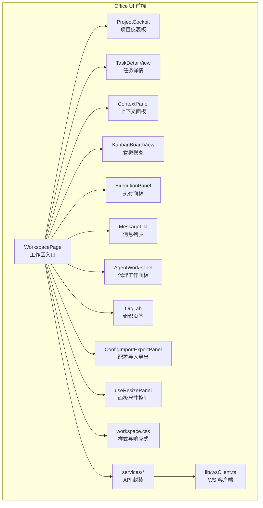
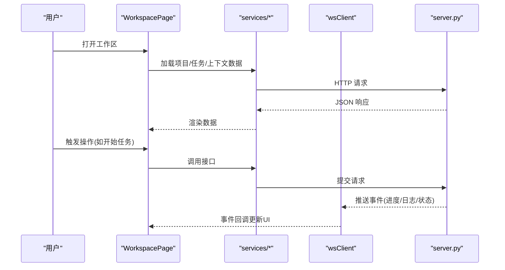
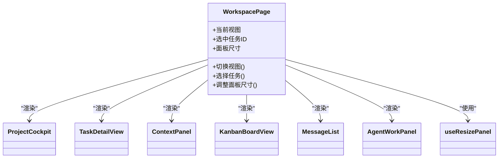
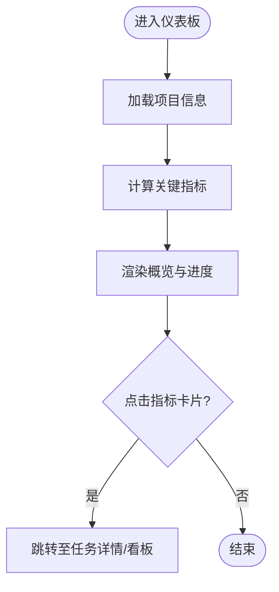
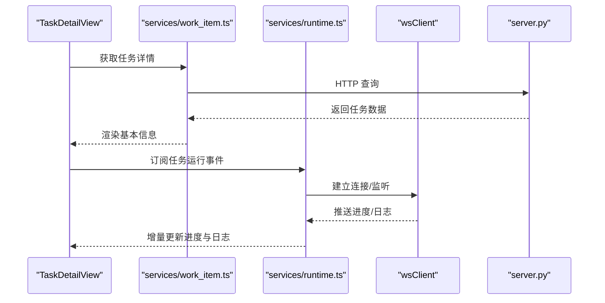
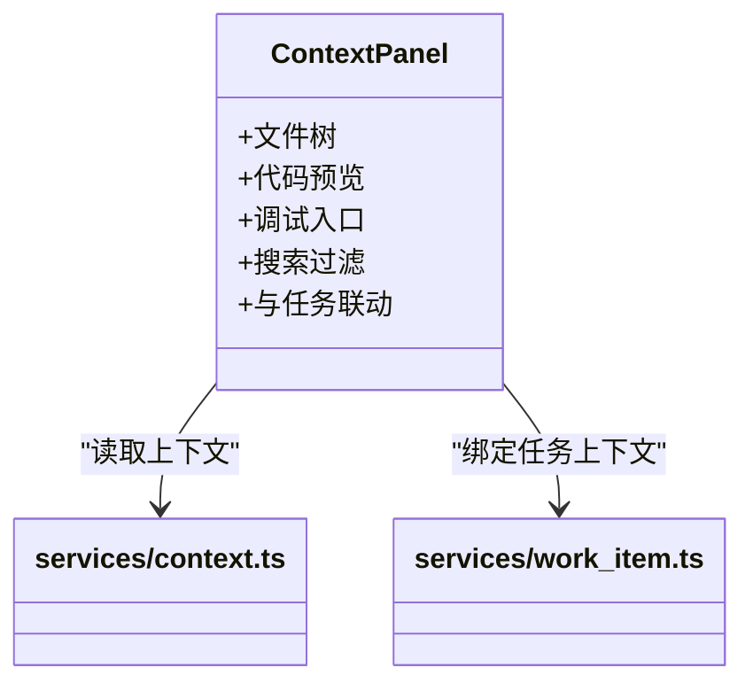
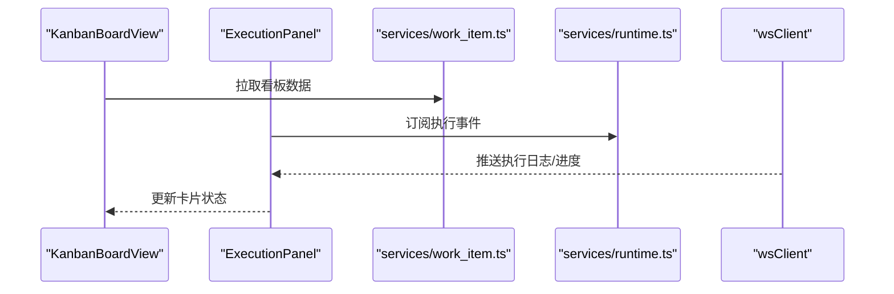
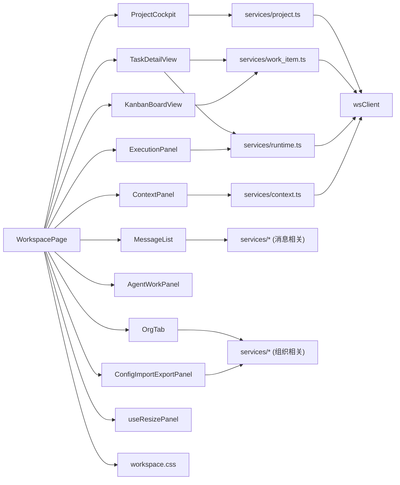

# 工作空间界面

<cite>
**本文引用的文件**   
- [workspace/WorkspacePage.tsx](file://opc/plugins/office_ui/frontend_src/workspace/WorkspacePage.tsx)
- [workspace/TaskDetailView.tsx](file://opc/plugins/office_ui/frontend_src/workspace/TaskDetailView.tsx)
- [workspace/ContextPanel.tsx](file://opc/plugins/office_ui/frontend_src/workspace/ContextPanel.tsx)
- [workspace/ProjectCockpit.tsx](file://opc/plugins/office_ui/frontend_src/workspace/ProjectCockpit.tsx)
- [workspace/useResizePanel.ts](file://opc/plugins/office_ui/frontend_src/workspace/useResizePanel.ts)
- [workspace/workspace.css](file://opc/plugins/office_ui/frontend_src/workspace/workspace.css)
- [kanban/KanbanBoardView.tsx](file://opc/plugins/office_ui/frontend_src/kanban/KanbanBoardView.tsx)
- [kanban/ExecutionPanel.tsx](file://opc/plugins/office_ui/frontend_src/kanban/ExecutionPanel.tsx)
- [chat/MessageList.tsx](file://opc/plugins/office_ui/frontend_src/chat/MessageList.tsx)
- [chat/AgentWorkPanel.tsx](file://opc/plugins/office_ui/frontend_src/chat/AgentWorkPanel.tsx)
- [org/OrgTab.tsx](file://opc/plugins/office_ui/frontend_src/org/OrgTab.tsx)
- [org/ConfigImportExportPanel.tsx](file://opc/plugins/office_ui/frontend_src/org/ConfigImportExportPanel.tsx)
- [services/project.ts](file://opc/plugins/office_ui/services/project.ts)
- [services/runtime.ts](file://opc/plugins/office_ui/services/runtime.ts)
- [services/context.ts](file://opc/plugins/office_ui/services/context.ts)
- [services/work_item.ts](file://opc/plugins/office_ui/services/work_item.ts)
- [lib/wsClient.ts](file://opc/plugins/office_ui/frontend_src/lib/wsClient.ts)
- [server.py](file://opc/plugins/office_ui/server.py)
</cite>

## 目录
1. [简介](#简介)
2. [项目结构](#项目结构)
3. [核心组件](#核心组件)
4. [架构总览](#架构总览)
5. [详细组件分析](#详细组件分析)
6. [依赖分析](#依赖分析)
7. [性能考虑](#性能考虑)
8. [故障排查指南](#故障排查指南)
9. [结论](#结论)
10. [附录](#附录)

## 简介
本章节面向 OpenOPC 的“工作空间界面”，聚焦于前端 Office UI 插件的工作区页面与相关面板。文档将解释整体布局与导航设计、项目仪表板（概览、进度跟踪、关键指标）、任务详情视图（信息展示、执行日志、进度条）、上下文面板（文件浏览、代码预览、调试集成），以及响应式设计与面板管理策略，并给出配置与个性化选项、性能优化与用户体验改进建议。

## 项目结构
工作空间界面位于 office_ui 插件的前端源码中，采用 React + TypeScript 组织，按功能域划分目录：
- workspace：工作区主页面、任务详情、上下文面板、项目驾驶舱、面板尺寸控制与样式
- kanban：看板视图与执行面板
- chat：消息列表与工作面板
- org：组织架构与配置导入导出
- services：后端服务封装（项目、运行时、上下文、工作项等）
- lib：通用库（WebSocket 客户端等）
- server.py：提供静态资源与 API 路由，承载前端构建产物

图表来源
- [workspace/WorkspacePage.tsx](file://opc/plugins/office_ui/frontend_src/workspace/WorkspacePage.tsx)
- [workspace/ProjectCockpit.tsx](file://opc/plugins/office_ui/frontend_src/workspace/ProjectCockpit.tsx)
- [workspace/TaskDetailView.tsx](file://opc/plugins/office_ui/frontend_src/workspace/TaskDetailView.tsx)
- [workspace/ContextPanel.tsx](file://opc/plugins/office_ui/frontend_src/workspace/ContextPanel.tsx)
- [workspace/useResizePanel.ts](file://opc/plugins/office_ui/frontend_src/workspace/useResizePanel.ts)
- [workspace/workspace.css](file://opc/plugins/office_ui/frontend_src/workspace/workspace.css)
- [kanban/KanbanBoardView.tsx](file://opc/plugins/office_ui/frontend_src/kanban/KanbanBoardView.tsx)
- [kanban/ExecutionPanel.tsx](file://opc/plugins/office_ui/frontend_src/kanban/ExecutionPanel.tsx)
- [chat/MessageList.tsx](file://opc/plugins/office_ui/frontend_src/chat/MessageList.tsx)
- [chat/AgentWorkPanel.tsx](file://opc/plugins/office_ui/frontend_src/chat/AgentWorkPanel.tsx)
- [org/OrgTab.tsx](file://opc/plugins/office_ui/frontend_src/org/OrgTab.tsx)
- [org/ConfigImportExportPanel.tsx](file://opc/plugins/office_ui/frontend_src/org/ConfigImportExportPanel.tsx)
- [services/project.ts](file://opc/plugins/office_ui/services/project.ts)
- [services/runtime.ts](file://opc/plugins/office_ui/services/runtime.ts)
- [services/context.ts](file://opc/plugins/office_ui/services/context.ts)
- [services/work_item.ts](file://opc/plugins/office_ui/services/work_item.ts)
- [lib/wsClient.ts](file://opc/plugins/office_ui/frontend_src/lib/wsClient.ts)

章节来源
- [workspace/WorkspacePage.tsx](file://opc/plugins/office_ui/frontend_src/workspace/WorkspacePage.tsx)
- [workspace/ProjectCockpit.tsx](file://opc/plugins/office_ui/frontend_src/workspace/ProjectCockpit.tsx)
- [workspace/TaskDetailView.tsx](file://opc/plugins/office_ui/frontend_src/workspace/TaskDetailView.tsx)
- [workspace/ContextPanel.tsx](file://opc/plugins/office_ui/frontend_src/workspace/ContextPanel.tsx)
- [workspace/useResizePanel.ts](file://opc/plugins/office_ui/frontend_src/workspace/useResizePanel.ts)
- [workspace/workspace.css](file://opc/plugins/office_ui/frontend_src/workspace/workspace.css)
- [kanban/KanbanBoardView.tsx](file://opc/plugins/office_ui/frontend_src/kanban/KanbanBoardView.tsx)
- [kanban/ExecutionPanel.tsx](file://opc/plugins/office_ui/frontend_src/kanban/ExecutionPanel.tsx)
- [chat/MessageList.tsx](file://opc/plugins/office_ui/frontend_src/chat/MessageList.tsx)
- [chat/AgentWorkPanel.tsx](file://opc/plugins/office_ui/frontend_src/chat/AgentWorkPanel.tsx)
- [org/OrgTab.tsx](file://opc/plugins/office_ui/frontend_src/org/OrgTab.tsx)
- [org/ConfigImportExportPanel.tsx](file://opc/plugins/office_ui/frontend_src/org/ConfigImportExportPanel.tsx)
- [services/project.ts](file://opc/plugins/office_ui/services/project.ts)
- [services/runtime.ts](file://opc/plugins/office_ui/services/runtime.ts)
- [services/context.ts](file://opc/plugins/office_ui/services/context.ts)
- [services/work_item.ts](file://opc/plugins/office_ui/services/work_item.ts)
- [lib/wsClient.ts](file://opc/plugins/office_ui/frontend_src/lib/wsClient.ts)

## 核心组件
- 工作区入口 WorkspacePage：负责页面级布局、导航切换、面板挂载与状态同步
- 项目仪表板 ProjectCockpit：展示项目概览、关键指标与进度汇总
- 任务详情 TaskDetailView：呈现任务元数据、执行日志与进度条
- 上下文面板 ContextPanel：文件浏览、代码预览与调试工具集成入口
- 看板与执行面板 KanbanBoardView / ExecutionPanel：可视化任务流转与执行过程
- 消息与工作面板 MessageList / AgentWorkPanel：会话消息与代理工作流展示
- 组织与配置 OrgTab / ConfigImportExportPanel：组织管理与配置导入导出
- 面板尺寸控制 useResizePanel：拖拽调整面板宽度/高度
- 样式 workspace.css：栅格、断点与主题变量

章节来源
- [workspace/WorkspacePage.tsx](file://opc/plugins/office_ui/frontend_src/workspace/WorkspacePage.tsx)
- [workspace/ProjectCockpit.tsx](file://opc/plugins/office_ui/frontend_src/workspace/ProjectCockpit.tsx)
- [workspace/TaskDetailView.tsx](file://opc/plugins/office_ui/frontend_src/workspace/TaskDetailView.tsx)
- [workspace/ContextPanel.tsx](file://opc/plugins/office_ui/frontend_src/workspace/ContextPanel.tsx)
- [kanban/KanbanBoardView.tsx](file://opc/plugins/office_ui/frontend_src/kanban/KanbanBoardView.tsx)
- [kanban/ExecutionPanel.tsx](file://opc/plugins/office_ui/frontend_src/kanban/ExecutionPanel.tsx)
- [chat/MessageList.tsx](file://opc/plugins/office_ui/frontend_src/chat/MessageList.tsx)
- [chat/AgentWorkPanel.tsx](file://opc/plugins/office_ui/frontend_src/chat/AgentWorkPanel.tsx)
- [org/OrgTab.tsx](file://opc/plugins/office_ui/frontend_src/org/OrgTab.tsx)
- [org/ConfigImportExportPanel.tsx](file://opc/plugins/office_ui/frontend_src/org/ConfigImportExportPanel.tsx)
- [workspace/useResizePanel.ts](file://opc/plugins/office_ui/frontend_src/workspace/useResizePanel.ts)
- [workspace/workspace.css](file://opc/plugins/office_ui/frontend_src/workspace/workspace.css)

## 架构总览
工作空间界面通过服务层与后端交互，使用 WebSocket 进行实时事件推送，React 组件驱动 UI 更新。

图表来源
- [workspace/WorkspacePage.tsx](file://opc/plugins/office_ui/frontend_src/workspace/WorkspacePage.tsx)
- [services/project.ts](file://opc/plugins/office_ui/services/project.ts)
- [services/runtime.ts](file://opc/plugins/office_ui/services/runtime.ts)
- [services/context.ts](file://opc/plugins/office_ui/services/context.ts)
- [services/work_item.ts](file://opc/plugins/office_ui/services/work_item.ts)
- [lib/wsClient.ts](file://opc/plugins/office_ui/frontend_src/lib/wsClient.ts)
- [server.py](file://opc/plugins/office_ui/server.py)

## 详细组件分析

### 工作区入口与导航（WorkspacePage）
- 职责：作为根容器，组合仪表板、任务详情、上下文面板、看板与聊天面板；维护当前选中任务/会话/视图状态；处理面板显示/隐藏与尺寸
- 导航设计：顶部或侧边导航切换不同视图（仪表板、任务详情、上下文、看板、组织）
- 面板管理：基于状态决定各子组件是否挂载，结合 useResizePanel 实现可拖拽分割

图表来源
- [workspace/WorkspacePage.tsx](file://opc/plugins/office_ui/frontend_src/workspace/WorkspacePage.tsx)
- [workspace/ProjectCockpit.tsx](file://opc/plugins/office_ui/frontend_src/workspace/ProjectCockpit.tsx)
- [workspace/TaskDetailView.tsx](file://opc/plugins/office_ui/frontend_src/workspace/TaskDetailView.tsx)
- [workspace/ContextPanel.tsx](file://opc/plugins/office_ui/frontend_src/workspace/ContextPanel.tsx)
- [kanban/KanbanBoardView.tsx](file://opc/plugins/office_ui/frontend_src/kanban/KanbanBoardView.tsx)
- [chat/MessageList.tsx](file://opc/plugins/office_ui/frontend_src/chat/MessageList.tsx)
- [chat/AgentWorkPanel.tsx](file://opc/plugins/office_ui/frontend_src/chat/AgentWorkPanel.tsx)
- [workspace/useResizePanel.ts](file://opc/plugins/office_ui/frontend_src/workspace/useResizePanel.ts)

章节来源
- [workspace/WorkspacePage.tsx](file://opc/plugins/office_ui/frontend_src/workspace/WorkspacePage.tsx)

### 项目仪表板（ProjectCockpit）
- 功能：项目概览（名称、描述、创建时间等）、关键指标（进行中任务数、完成度、平均耗时等）、进度跟踪（总体进度条、阶段里程碑）
- 数据来源：通过 services/project.ts 获取项目信息与统计；必要时聚合 work_item 数据
- 交互：点击指标卡片跳转到任务详情或看板筛选

图表来源
- [workspace/ProjectCockpit.tsx](file://opc/plugins/office_ui/frontend_src/workspace/ProjectCockpit.tsx)
- [services/project.ts](file://opc/plugins/office_ui/services/project.ts)
- [services/work_item.ts](file://opc/plugins/office_ui/services/work_item.ts)

章节来源
- [workspace/ProjectCockpit.tsx](file://opc/plugins/office_ui/frontend_src/workspace/ProjectCockpit.tsx)
- [services/project.ts](file://opc/plugins/office_ui/services/project.ts)
- [services/work_item.ts](file://opc/plugins/office_ui/services/work_item.ts)

### 任务详情视图（TaskDetailView）
- 信息展示：任务标题、状态、负责人、起止时间、依赖关系、备注等
- 执行日志：按时间线展示步骤日志，支持折叠/展开与关键字过滤
- 进度条：根据阶段/子任务完成比例实时更新
- 交互：支持重新运行、暂停、查看关联上下文、反馈与升级

图表来源
- [workspace/TaskDetailView.tsx](file://opc/plugins/office_ui/frontend_src/workspace/TaskDetailView.tsx)
- [services/work_item.ts](file://opc/plugins/office_ui/services/work_item.ts)
- [services/runtime.ts](file://opc/plugins/office_ui/services/runtime.ts)
- [lib/wsClient.ts](file://opc/plugins/office_ui/frontend_src/lib/wsClient.ts)
- [server.py](file://opc/plugins/office_ui/server.py)

章节来源
- [workspace/TaskDetailView.tsx](file://opc/plugins/office_ui/frontend_src/workspace/TaskDetailView.tsx)
- [services/work_item.ts](file://opc/plugins/office_ui/services/work_item.ts)
- [services/runtime.ts](file://opc/plugins/office_ui/services/runtime.ts)
- [lib/wsClient.ts](file://opc/plugins/office_ui/frontend_src/lib/wsClient.ts)

### 上下文面板（ContextPanel）
- 文件浏览：树形目录结构，支持搜索与快速定位
- 代码预览：语法高亮、行号、差异对比（可选）
- 调试集成：打开外部调试器或内置终端（由后端能力决定）
- 联动：与任务详情共享上下文标识，自动加载相关文件与日志

图表来源
- [workspace/ContextPanel.tsx](file://opc/plugins/office_ui/frontend_src/workspace/ContextPanel.tsx)
- [services/context.ts](file://opc/plugins/office_ui/services/context.ts)
- [services/work_item.ts](file://opc/plugins/office_ui/services/work_item.ts)

章节来源
- [workspace/ContextPanel.tsx](file://opc/plugins/office_ui/frontend_src/workspace/ContextPanel.tsx)
- [services/context.ts](file://opc/plugins/office_ui/services/context.ts)
- [services/work_item.ts](file://opc/plugins/office_ui/services/work_item.ts)

### 看板与执行面板（KanbanBoardView / ExecutionPanel）
- 看板视图：列表示任务阶段，卡片展示摘要与状态，支持拖拽流转
- 执行面板：与具体任务绑定的执行过程可视化，包括步骤、输出与错误信息
- 数据源：work_item 与 runtime 服务，WS 事件驱动实时更新

图表来源
- [kanban/KanbanBoardView.tsx](file://opc/plugins/office_ui/frontend_src/kanban/KanbanBoardView.tsx)
- [kanban/ExecutionPanel.tsx](file://opc/plugins/office_ui/frontend_src/kanban/ExecutionPanel.tsx)
- [services/work_item.ts](file://opc/plugins/office_ui/services/work_item.ts)
- [services/runtime.ts](file://opc/plugins/office_ui/services/runtime.ts)
- [lib/wsClient.ts](file://opc/plugins/office_ui/frontend_src/lib/wsClient.ts)

章节来源
- [kanban/KanbanBoardView.tsx](file://opc/plugins/office_ui/frontend_src/kanban/KanbanBoardView.tsx)
- [kanban/ExecutionPanel.tsx](file://opc/plugins/office_ui/frontend_src/kanban/ExecutionPanel.tsx)
- [services/work_item.ts](file://opc/plugins/office_ui/services/work_item.ts)
- [services/runtime.ts](file://opc/plugins/office_ui/services/runtime.ts)
- [lib/wsClient.ts](file://opc/plugins/office_ui/frontend_src/lib/wsClient.ts)

### 消息与工作面板（MessageList / AgentWorkPanel）
- 消息列表：会话消息时间线，支持分页、滚动加载与消息类型区分
- 代理工作面板：展示代理行为、工具调用与中间结果
- 与 WS 集成：实时接收新消息与状态变更

章节来源
- [chat/MessageList.tsx](file://opc/plugins/office_ui/frontend_src/chat/MessageList.tsx)
- [chat/AgentWorkPanel.tsx](file://opc/plugins/office_ui/frontend_src/chat/AgentWorkPanel.tsx)
- [lib/wsClient.ts](file://opc/plugins/office_ui/frontend_src/lib/wsClient.ts)

### 组织与配置（OrgTab / ConfigImportExportPanel）
- 组织页签：组织结构、角色与权限的可视化与管理
- 配置导入导出：支持导出当前配置为文件、从文件导入覆盖设置
- 与后端服务交互：通过 services 层统一封装

章节来源
- [org/OrgTab.tsx](file://opc/plugins/office_ui/frontend_src/org/OrgTab.tsx)
- [org/ConfigImportExportPanel.tsx](file://opc/plugins/office_ui/frontend_src/org/ConfigImportExportPanel.tsx)

### 面板管理与响应式设计（useResizePanel / workspace.css）
- 面板尺寸控制：useResizePanel 提供拖拽调整面板宽/高的能力，记录到状态并持久化（可选）
- 响应式布局：workspace.css 定义栅格、断点与主题变量，适配桌面与平板尺寸
- 面板可见性：根据当前视图与用户偏好动态显示/隐藏

章节来源
- [workspace/useResizePanel.ts](file://opc/plugins/office_ui/frontend_src/workspace/useResizePanel.ts)
- [workspace/workspace.css](file://opc/plugins/office_ui/frontend_src/workspace/workspace.css)

## 依赖分析
- 组件耦合：WorkspacePage 作为编排者，低耦合地组合各功能面板；各面板通过 services 层访问后端，避免直接依赖网络细节
- 事件驱动：wsClient 集中管理 WebSocket 连接与事件分发，降低组件间通信复杂度
- 数据流向：HTTP 用于初始数据加载，WS 用于增量更新；services 层对数据进行缓存与去重，减少重复请求

图表来源
- [workspace/WorkspacePage.tsx](file://opc/plugins/office_ui/frontend_src/workspace/WorkspacePage.tsx)
- [workspace/ProjectCockpit.tsx](file://opc/plugins/office_ui/frontend_src/workspace/ProjectCockpit.tsx)
- [workspace/TaskDetailView.tsx](file://opc/plugins/office_ui/frontend_src/workspace/TaskDetailView.tsx)
- [workspace/ContextPanel.tsx](file://opc/plugins/office_ui/frontend_src/workspace/ContextPanel.tsx)
- [kanban/KanbanBoardView.tsx](file://opc/plugins/office_ui/frontend_src/kanban/KanbanBoardView.tsx)
- [kanban/ExecutionPanel.tsx](file://opc/plugins/office_ui/frontend_src/kanban/ExecutionPanel.tsx)
- [chat/MessageList.tsx](file://opc/plugins/office_ui/frontend_src/chat/MessageList.tsx)
- [chat/AgentWorkPanel.tsx](file://opc/plugins/office_ui/frontend_src/chat/AgentWorkPanel.tsx)
- [org/OrgTab.tsx](file://opc/plugins/office_ui/frontend_src/org/OrgTab.tsx)
- [org/ConfigImportExportPanel.tsx](file://opc/plugins/office_ui/frontend_src/org/ConfigImportExportPanel.tsx)
- [services/project.ts](file://opc/plugins/office_ui/services/project.ts)
- [services/work_item.ts](file://opc/plugins/office_ui/services/work_item.ts)
- [services/runtime.ts](file://opc/plugins/office_ui/services/runtime.ts)
- [services/context.ts](file://opc/plugins/office_ui/services/context.ts)
- [lib/wsClient.ts](file://opc/plugins/office_ui/frontend_src/lib/wsClient.ts)

## 性能考虑
- 数据加载与缓存：在 services 层对频繁读取的数据（项目、任务、上下文）做内存缓存与失效策略，减少重复请求
- 增量更新：利用 WS 事件驱动 UI 增量更新，避免整页刷新；对长列表（消息、日志）采用虚拟滚动或分页加载
- 渲染优化：对大组件（消息列表、执行日志）进行懒加载与按需渲染；合并状态更新，减少不必要的重渲染
- 网络优化：批量请求与去重；对图片与静态资源启用压缩与缓存
- 面板管理：未激活的面板延迟挂载；面板尺寸变化时节流更新，避免频繁重排

[本节为通用指导，不直接分析具体文件]

## 故障排查指南
- WebSocket 连接失败：检查 wsClient 的连接参数与重试逻辑，确认 server.py 的路由与跨域设置
- 数据不同步：确认 WS 事件是否正确分发到对应 services 与组件；检查事件去重与幂等处理
- 面板无法调整尺寸：验证 useResizePanel 的事件绑定与边界条件；检查 CSS 布局是否被覆盖
- 任务日志缺失：核对 work_item 与 runtime 服务的日志拉取逻辑；确认 WS 事件包含必要字段
- 配置导入导出异常：检查文件格式校验与后端兼容；确认权限与路径安全

章节来源
- [lib/wsClient.ts](file://opc/plugins/office_ui/frontend_src/lib/wsClient.ts)
- [server.py](file://opc/plugins/office_ui/server.py)
- [services/work_item.ts](file://opc/plugins/office_ui/services/work_item.ts)
- [services/runtime.ts](file://opc/plugins/office_ui/services/runtime.ts)
- [workspace/useResizePanel.ts](file://opc/plugins/office_ui/frontend_src/workspace/useResizePanel.ts)
- [workspace/workspace.css](file://opc/plugins/office_ui/frontend_src/workspace/workspace.css)

## 结论
OpenOPC 工作空间界面以 WorkspacePage 为核心编排器，结合 ProjectCockpit、TaskDetailView、ContextPanel 与看板/执行面板，形成完整的项目协作与执行可视化体验。通过 services 层与 wsClient 的统一抽象，实现了高效的数据加载与实时事件驱动。配合 useResizePanel 与 workspace.css，提供了良好的响应式与面板管理能力。建议在后续迭代中持续优化数据缓存、增量更新与渲染性能，完善配置与个性化设置，提升用户体验。

## 附录
- 配置与个性化设置
  - 面板布局：默认布局可通过配置文件或本地存储保存用户偏好
  - 主题与字体：通过 CSS 变量与主题开关实现
  - 快捷键与手势：为常用操作提供键盘快捷键与拖拽手势
  - 通知与提醒：对任务状态变更与错误进行提示
- 扩展点
  - 新增面板：在 WorkspacePage 中注册新视图，并在导航中添加入口
  - 自定义指标：在 ProjectCockpit 中扩展指标卡片与计算逻辑
  - 上下文增强：在 ContextPanel 中接入新的文件类型或调试工具

[本节为概念性内容，不直接分析具体文件]