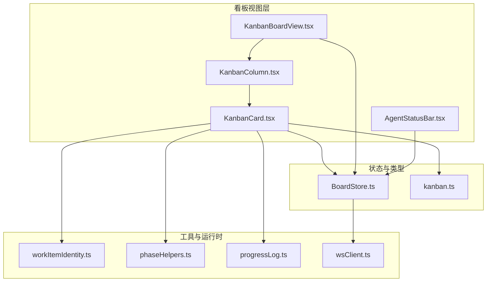
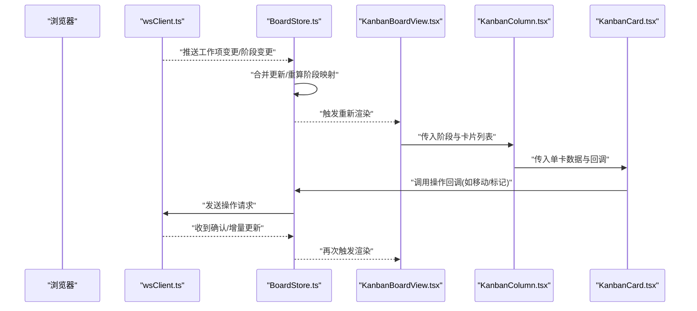
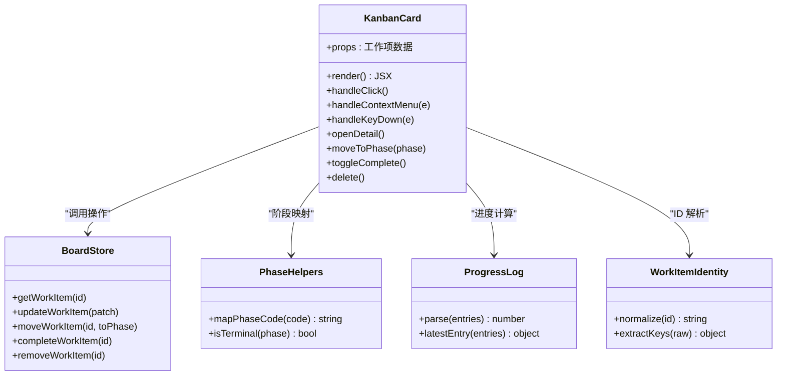
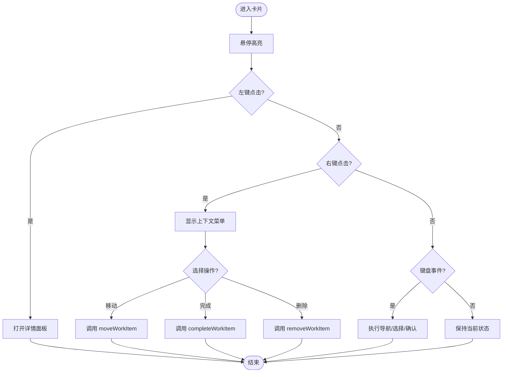
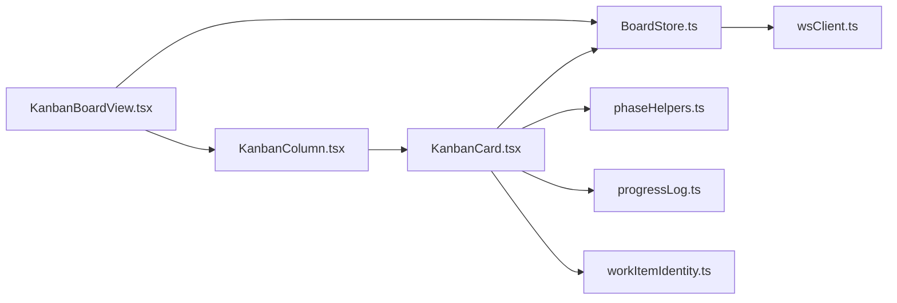

# 任务卡片组件

<cite>
**本文引用的文件**   
- [KanbanCard.tsx](file://opc/plugins/office_ui/frontend_src/kanban/KanbanCard.tsx)
- [KanbanColumn.tsx](file://opc/plugins/office_ui/frontend_src/kanban/KanbanColumn.tsx)
- [KanbanBoardView.tsx](file://opc/plugins/office_ui/frontend_src/kanban/KanbanBoardView.tsx)
- [BoardStore.ts](file://opc/plugins/office_ui/frontend_src/kanban/BoardStore.ts)
- [kanban.css](file://opc/plugins/office_ui/frontend_src/kanban/kanban.css)
- [kanban.ts](file://opc/plugins/office_ui/frontend_src/types/kanban.ts)
- [workItemIdentity.ts](file://opc/plugins/office_ui/frontend_src/lib/workItemIdentity.ts)
- [phaseHelpers.ts](file://opc/plugins/office_ui/frontend_src/lib/phaseHelpers.ts)
- [progressLog.ts](file://opc/plugins/office_ui/frontend_src/lib/progressLog.ts)
- [wsClient.ts](file://opc/plugins/office_ui/frontend_src/lib/wsClient.ts)
- [TaskHeaderBar.tsx](file://opc/plugins/office_ui/frontend_src/chat/TaskHeaderBar.tsx)
- [TaskUserInputPanel.tsx](file://opc/plugins/office_ui/frontend_src/chat/TaskUserInputPanel.tsx)
- [AgentStatusBar.tsx](file://opc/plugins/office_ui/frontend_src/kanban/AgentStatusBar.tsx)
</cite>

## 目录
1. [简介](#简介)
2. [项目结构](#项目结构)
3. [核心组件](#核心组件)
4. [架构总览](#架构总览)
5. [详细组件分析](#详细组件分析)
6. [依赖关系分析](#依赖关系分析)
7. [性能考虑](#性能考虑)
8. [故障排查指南](#故障排查指南)
9. [结论](#结论)
10. [附录](#附录)

## 简介
本技术文档围绕 OpenOPC 前端 Office UI 中的“任务卡片”（KanbanCard）组件，系统性阐述其设计模式、功能特性与扩展点。内容覆盖：
- 卡片展示逻辑：标题、状态指示器、操作按钮、进度条等
- 交互能力：点击展开详情、右键菜单、悬停效果、键盘导航
- 数据绑定机制：工作项信息映射、实时更新（WebSocket）
- 样式系统：优先级颜色编码、标签显示、进度指示
- 自定义扩展点：内容插槽、操作钩子、样式覆盖
- 可访问性与国际化支持

## 项目结构
任务卡片位于 office_ui 插件的前端源码中，采用 React + TypeScript 实现，并与 BoardStore 和 WebSocket 客户端协同完成数据驱动渲染。

图表来源
- [KanbanBoardView.tsx](file://opc/plugins/office_ui/frontend_src/kanban/KanbanBoardView.tsx)
- [KanbanCard.tsx](file://opc/plugins/office_ui/frontend_src/kanban/KanbanCard.tsx)
- [KanbanColumn.tsx](file://opc/plugins/office_ui/frontend_src/kanban/KanbanColumn.tsx)
- [BoardStore.ts](file://opc/plugins/office_ui/frontend_src/kanban/BoardStore.ts)
- [kanban.ts](file://opc/plugins/office_ui/frontend_src/types/kanban.ts)
- [workItemIdentity.ts](file://opc/plugins/office_ui/frontend_src/lib/workItemIdentity.ts)
- [phaseHelpers.ts](file://opc/plugins/office_ui/frontend_src/lib/phaseHelpers.ts)
- [progressLog.ts](file://opc/plugins/office_ui/frontend_src/lib/progressLog.ts)
- [wsClient.ts](file://opc/plugins/office_ui/frontend_src/lib/wsClient.ts)
- [AgentStatusBar.tsx](file://opc/plugins/office_ui/frontend_src/kanban/AgentStatusBar.tsx)

章节来源
- [KanbanBoardView.tsx](file://opc/plugins/office_ui/frontend_src/kanban/KanbanBoardView.tsx)
- [KanbanCard.tsx](file://opc/plugins/office_ui/frontend_src/kanban/KanbanCard.tsx)
- [KanbanColumn.tsx](file://opc/plugins/office_ui/frontend_src/kanban/KanbanColumn.tsx)
- [BoardStore.ts](file://opc/plugins/office_ui/frontend_src/kanban/BoardStore.ts)
- [kanban.ts](file://opc/plugins/office_ui/frontend_src/types/kanban.ts)
- [workItemIdentity.ts](file://opc/plugins/office_ui/frontend_src/lib/workItemIdentity.ts)
- [phaseHelpers.ts](file://opc/plugins/office_ui/frontend_src/lib/phaseHelpers.ts)
- [progressLog.ts](file://opc/plugins/office_ui/frontend_src/lib/progressLog.ts)
- [wsClient.ts](file://opc/plugins/office_ui/frontend_src/lib/wsClient.ts)
- [AgentStatusBar.tsx](file://opc/plugins/office_ui/frontend_src/kanban/AgentStatusBar.tsx)

## 核心组件
- KanbanCard：单张任务卡片的展示与交互单元，负责渲染标题、状态、优先级、标签、进度、操作按钮，并处理点击、右键、悬停与键盘事件。
- KanbanColumn：列容器，按阶段分组渲染卡片，提供拖拽目标区域与列级操作。
- KanbanBoardView：看板根视图，聚合列与全局状态，连接 BoardStore 与 WebSocket。
- BoardStore：看板状态集中管理，维护工作项集合、阶段映射、选中态、排序与过滤，并提供更新回调。
- 类型定义 kanban.ts：定义工作项、阶段、卡片属性等数据结构契约。
- 辅助库：
  - workItemIdentity.ts：工作项标识解析与归一化
  - phaseHelpers.ts：阶段名称、顺序与转换规则
  - progressLog.ts：进度日志解析与百分比计算
  - wsClient.ts：WebSocket 通信封装，用于实时推送

章节来源
- [KanbanCard.tsx](file://opc/plugins/office_ui/frontend_src/kanban/KanbanCard.tsx)
- [KanbanColumn.tsx](file://opc/plugins/office_ui/frontend_src/kanban/KanbanColumn.tsx)
- [KanbanBoardView.tsx](file://opc/plugins/office_ui/frontend_src/kanban/KanbanBoardView.tsx)
- [BoardStore.ts](file://opc/plugins/office_ui/frontend_src/kanban/BoardStore.ts)
- [kanban.ts](file://opc/plugins/office_ui/frontend_src/types/kanban.ts)
- [workItemIdentity.ts](file://opc/plugins/office_ui/frontend_src/lib/workItemIdentity.ts)
- [phaseHelpers.ts](file://opc/plugins/office_ui/frontend_src/lib/phaseHelpers.ts)
- [progressLog.ts](file://opc/plugins/office_ui/frontend_src/lib/progressLog.ts)
- [wsClient.ts](file://opc/plugins/office_ui/frontend_src/lib/wsClient.ts)

## 架构总览
看板采用“状态集中 + 组件订阅”的单向数据流模式。BoardStore 作为单一事实源，通过 WebSocket 接收后端增量更新；各组件仅消费状态，不直接修改共享数据。

图表来源
- [wsClient.ts](file://opc/plugins/office_ui/frontend_src/lib/wsClient.ts)
- [BoardStore.ts](file://opc/plugins/office_ui/frontend_src/kanban/BoardStore.ts)
- [KanbanBoardView.tsx](file://opc/plugins/office_ui/frontend_src/kanban/KanbanBoardView.tsx)
- [KanbanColumn.tsx](file://opc/plugins/office_ui/frontend_src/kanban/KanbanColumn.tsx)
- [KanbanCard.tsx](file://opc/plugins/office_ui/frontend_src/kanban/KanbanCard.tsx)

## 详细组件分析

### KanbanCard 组件
- 职责
  - 渲染工作项基本信息：标题、描述摘要、负责人、创建时间等
  - 状态指示器：基于阶段与运行态显示进行中、阻塞、已完成等
  - 优先级与标签：根据优先级映射颜色，标签以轻量徽章呈现
  - 进度指示：结合进度日志计算百分比并可视化
  - 操作按钮：打开详情、快速移动、标记完成、删除等
  - 交互：点击展开详情面板、右键上下文菜单、悬停高亮、键盘导航（Tab/Enter/Space/方向键）
- 数据绑定
  - 从 BoardStore 获取工作项快照，使用 workItemIdentity 解析唯一标识
  - 使用 phaseHelpers 将内部阶段码映射为可读文本
  - 使用 progressLog 解析最近进度条目，计算完成度
- 交互流程
  - 点击：触发 onOpenDetail，由父级或路由打开 TaskHeaderBar 或详情页
  - 右键：弹出上下文菜单，支持常用操作（复制链接、移动到某阶段等）
  - 键盘：支持焦点可见性、回车确认、空格切换选中、方向键在卡片间移动
- 可扩展点
  - 内容插槽：允许外部注入额外元信息或自定义头部/尾部
  - 操作钩子：注册自定义动作（如审批、回滚），统一接入操作栏
  - 样式覆盖：通过 CSS 变量或类名覆盖优先级色板、进度条、标签样式

图表来源
- [KanbanCard.tsx](file://opc/plugins/office_ui/frontend_src/kanban/KanbanCard.tsx)
- [BoardStore.ts](file://opc/plugins/office_ui/frontend_src/kanban/BoardStore.ts)
- [phaseHelpers.ts](file://opc/plugins/office_ui/frontend_src/lib/phaseHelpers.ts)
- [progressLog.ts](file://opc/plugins/office_ui/frontend_src/lib/progressLog.ts)
- [workItemIdentity.ts](file://opc/plugins/office_ui/frontend_src/lib/workItemIdentity.ts)

章节来源
- [KanbanCard.tsx](file://opc/plugins/office_ui/frontend_src/kanban/KanbanCard.tsx)
- [BoardStore.ts](file://opc/plugins/office_ui/frontend_src/kanban/BoardStore.ts)
- [phaseHelpers.ts](file://opc/plugins/office_ui/frontend_src/lib/phaseHelpers.ts)
- [progressLog.ts](file://opc/plugins/office_ui/frontend_src/lib/progressLog.ts)
- [workItemIdentity.ts](file://opc/plugins/office_ui/frontend_src/lib/workItemIdentity.ts)

#### 卡片交互流程图（点击/右键/键盘）

图表来源
- [KanbanCard.tsx](file://opc/plugins/office_ui/frontend_src/kanban/KanbanCard.tsx)
- [BoardStore.ts](file://opc/plugins/office_ui/frontend_src/kanban/BoardStore.ts)

### KanbanColumn 组件
- 职责
  - 按阶段分组渲染卡片列表
  - 提供拖拽放置区，接收来自其他列的卡片
  - 显示列头统计（数量、平均进度等）
- 与 KanbanCard 的关系
  - 向卡片传递只读数据与操作回调
  - 监听拖拽事件，调用 BoardStore 的移动接口

章节来源
- [KanbanColumn.tsx](file://opc/plugins/office_ui/frontend_src/kanban/KanbanColumn.tsx)
- [BoardStore.ts](file://opc/plugins/office_ui/frontend_src/kanban/BoardStore.ts)

### KanbanBoardView 组件
- 职责
  - 初始化 BoardStore 与 WebSocket 连接
  - 渲染所有列与全局控制（筛选、搜索、排序）
  - 承载详情面板与全局通知
- 与 BoardStore 的关系
  - 订阅 store 变更，驱动全量重渲染
  - 暴露全局操作入口（批量移动、导出等）

章节来源
- [KanbanBoardView.tsx](file://opc/plugins/office_ui/frontend_src/kanban/KanbanBoardView.tsx)
- [BoardStore.ts](file://opc/plugins/office_ui/frontend_src/kanban/BoardStore.ts)

### 状态与类型
- BoardStore
  - 维护工作项集合、阶段映射、选中态、排序与过滤
  - 提供原子更新方法，确保一致性
- kanban.ts
  - 定义工作项、阶段、卡片属性等类型契约，保证前后端一致

章节来源
- [BoardStore.ts](file://opc/plugins/office_ui/frontend_src/kanban/BoardStore.ts)
- [kanban.ts](file://opc/plugins/office_ui/frontend_src/types/kanban.ts)

### 辅助库
- workItemIdentity.ts：规范化工作项 ID，避免重复与歧义
- phaseHelpers.ts：阶段名称映射、终态判断、顺序约束
- progressLog.ts：解析进度日志条目，计算百分比与最新状态
- wsClient.ts：封装 WebSocket 连接、消息编解码、断线重连

章节来源
- [workItemIdentity.ts](file://opc/plugins/office_ui/frontend_src/lib/workItemIdentity.ts)
- [phaseHelpers.ts](file://opc/plugins/office_ui/frontend_src/lib/phaseHelpers.ts)
- [progressLog.ts](file://opc/plugins/office_ui/frontend_src/lib/progressLog.ts)
- [wsClient.ts](file://opc/plugins/office_ui/frontend_src/lib/wsClient.ts)

## 依赖关系分析
- 组件耦合
  - KanbanCard 低耦合于 BoardStore，仅通过回调与只读数据交互
  - KanbanColumn 对拖拽与列级状态有局部耦合
  - KanbanBoardView 作为编排者，持有全局状态与布局
- 外部依赖
  - WebSocket 客户端提供实时数据通道
  - 类型定义保障数据结构稳定
- 潜在循环依赖
  - 组件之间无直接相互导入，依赖通过 props 与 store 解耦

图表来源
- [KanbanCard.tsx](file://opc/plugins/office_ui/frontend_src/kanban/KanbanCard.tsx)
- [KanbanColumn.tsx](file://opc/plugins/office_ui/frontend_src/kanban/KanbanColumn.tsx)
- [KanbanBoardView.tsx](file://opc/plugins/office_ui/frontend_src/kanban/KanbanBoardView.tsx)
- [BoardStore.ts](file://opc/plugins/office_ui/frontend_src/kanban/BoardStore.ts)
- [phaseHelpers.ts](file://opc/plugins/office_ui/frontend_src/lib/phaseHelpers.ts)
- [progressLog.ts](file://opc/plugins/office_ui/frontend_src/lib/progressLog.ts)
- [workItemIdentity.ts](file://opc/plugins/office_ui/frontend_src/lib/workItemIdentity.ts)
- [wsClient.ts](file://opc/plugins/office_ui/frontend_src/lib/wsClient.ts)

章节来源
- [KanbanCard.tsx](file://opc/plugins/office_ui/frontend_src/kanban/KanbanCard.tsx)
- [KanbanColumn.tsx](file://opc/plugins/office_ui/frontend_src/kanban/KanbanColumn.tsx)
- [KanbanBoardView.tsx](file://opc/plugins/office_ui/frontend_src/kanban/KanbanBoardView.tsx)
- [BoardStore.ts](file://opc/plugins/office_ui/frontend_src/kanban/BoardStore.ts)
- [phaseHelpers.ts](file://opc/plugins/office_ui/frontend_src/lib/phaseHelpers.ts)
- [progressLog.ts](file://opc/plugins/office_ui/frontend_src/lib/progressLog.ts)
- [workItemIdentity.ts](file://opc/plugins/office_ui/frontend_src/lib/workItemIdentity.ts)
- [wsClient.ts](file://opc/plugins/office_ui/frontend_src/lib/wsClient.ts)

## 性能考虑
- 渲染优化
  - 使用只读 props 与 memo 化减少不必要的重渲染
  - 大列表场景下启用虚拟滚动（可在外层容器引入）
- 状态更新
  - 合并增量更新，避免整表重建
  - 节流/防抖高频事件（如输入框、拖拽）
- 网络与内存
  - WebSocket 断线重连与消息去重
  - 及时清理未使用的监听器与定时器

[本节为通用指导，无需特定文件引用]

## 故障排查指南
- 卡片不更新
  - 检查 BoardStore 是否收到 WebSocket 推送
  - 确认工作项 ID 是否被正确规范化
- 进度条异常
  - 校验 progressLog 解析逻辑与数据格式
  - 确认阶段终态时进度是否强制为 100%
- 右键菜单不可用
  - 检查事件冒泡与阻止默认行为
  - 确认上下文菜单定位与层级
- 键盘导航失效
  - 验证 tabIndex 与 focus 管理
  - 检查 Enter/Space 事件绑定

章节来源
- [wsClient.ts](file://opc/plugins/office_ui/frontend_src/lib/wsClient.ts)
- [BoardStore.ts](file://opc/plugins/office_ui/frontend_src/kanban/BoardStore.ts)
- [progressLog.ts](file://opc/plugins/office_ui/frontend_src/lib/progressLog.ts)
- [workItemIdentity.ts](file://opc/plugins/office_ui/frontend_src/lib/workItemIdentity.ts)

## 结论
KanbanCard 组件以清晰的数据流与良好的扩展点，实现了任务卡片的高可用展示与交互。通过 BoardStore 与 WebSocket 的协作，保证了实时性与一致性；借助类型定义与辅助库，提升了可维护性与健壮性。建议在生产环境中结合虚拟化与性能监控进一步优化大规模看板体验。

[本节为总结性内容，无需特定文件引用]

## 附录

### 样式系统与主题
- 优先级颜色编码：通过 CSS 变量或类名映射不同优先级到色板
- 标签显示：轻量徽章样式，支持多标签堆叠与溢出省略
- 进度指示：线性进度条，支持动画与无障碍提示

章节来源
- [kanban.css](file://opc/plugins/office_ui/frontend_src/kanban/kanban.css)

### 可访问性支持
- 语义化标签与 ARIA 属性
- 焦点管理与键盘可达性
- 屏幕阅读器友好的状态与错误提示

章节来源
- [KanbanCard.tsx](file://opc/plugins/office_ui/frontend_src/kanban/KanbanCard.tsx)

### 国际化处理
- 文案抽取至 i18n 资源文件
- 动态语言切换与本地化格式化（日期、数字）

章节来源
- [KanbanCard.tsx](file://opc/plugins/office_ui/frontend_src/kanban/KanbanCard.tsx)

### 自定义扩展点清单
- 内容插槽
  - 头部插槽：插入额外元信息或徽标
  - 尾部插槽：附加备注或附件预览
- 操作钩子
  - 注册自定义动作，统一接入操作栏与快捷键
- 样式覆盖
  - 通过 CSS 变量覆盖色板、圆角、阴影等视觉属性

章节来源
- [KanbanCard.tsx](file://opc/plugins/office_ui/frontend_src/kanban/KanbanCard.tsx)
- [kanban.css](file://opc/plugins/office_ui/frontend_src/kanban/kanban.css)

### 相关界面联动
- 详情面板：TaskHeaderBar 展示工作项详情与对话历史
- 用户输入：TaskUserInputPanel 提供即时反馈与指令输入
- 代理状态：AgentStatusBar 显示代理运行状态与耗时

章节来源
- [TaskHeaderBar.tsx](file://opc/plugins/office_ui/frontend_src/chat/TaskHeaderBar.tsx)
- [TaskUserInputPanel.tsx](file://opc/plugins/office_ui/frontend_src/chat/TaskUserInputPanel.tsx)
- [AgentStatusBar.tsx](file://opc/plugins/office_ui/frontend_src/kanban/AgentStatusBar.tsx)