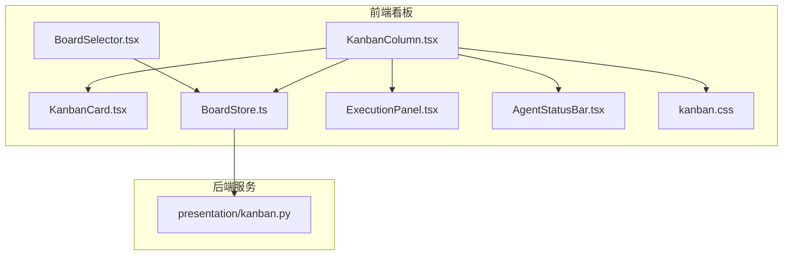
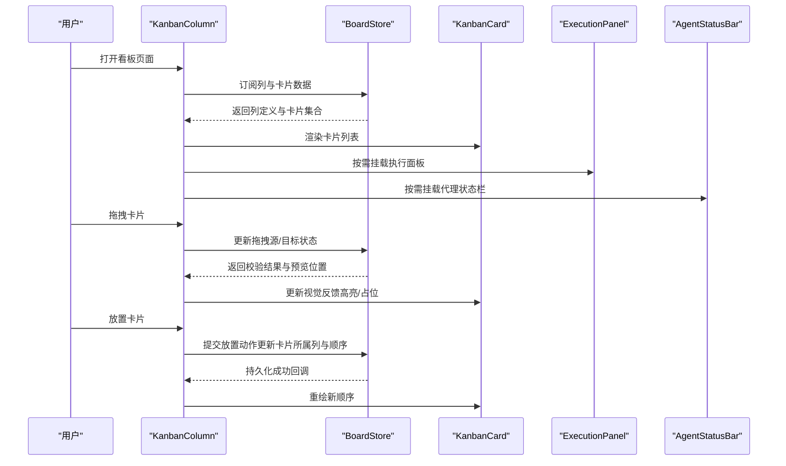
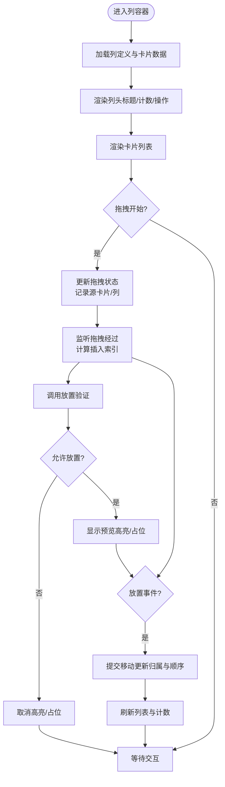
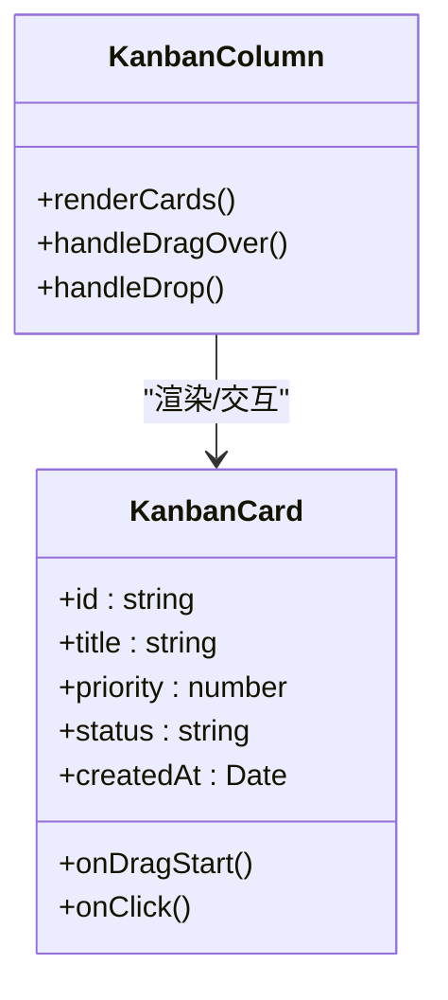
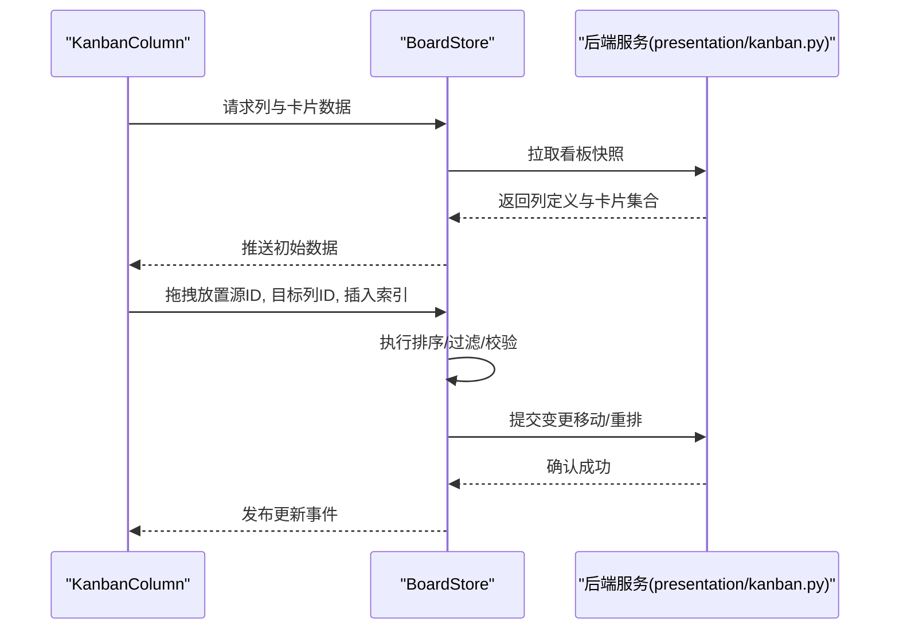
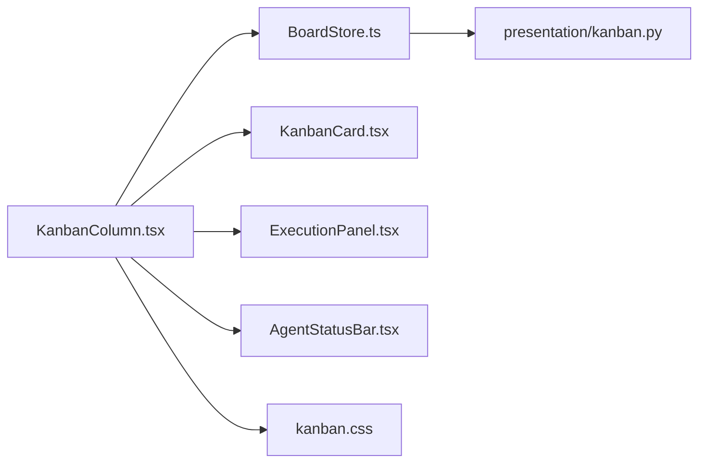

# 列容器组件

<cite>
**本文引用的文件**   
- [KanbanColumn.tsx](file://opc/plugins/office_ui/frontend_src/kanban/KanbanColumn.tsx)
- [KanbanCard.tsx](file://opc/plugins/office_ui/frontend_src/kanban/KanbanCard.tsx)
- [BoardStore.ts](file://opc/plugins/office_ui/frontend_src/kanban/BoardStore.ts)
- [BoardSelector.tsx](file://opc/plugins/office_ui/frontend_src/kanban/BoardSelector.tsx)
- [ExecutionPanel.tsx](file://opc/plugins/office_ui/frontend_src/kanban/ExecutionPanel.tsx)
- [AgentStatusBar.tsx](file://opc/plugins/office_ui/frontend_src/kanban/AgentStatusBar.tsx)
- [kanban.css](file://opc/plugins/office_ui/frontend_src/kanban/kanban.css)
- [kanban.ts](file://opc/plugins/office_ui/presentation/kanban.py)
</cite>

## 目录
1. [简介](#简介)
2. [项目结构](#项目结构)
3. [核心组件](#核心组件)
4. [架构总览](#架构总览)
5. [详细组件分析](#详细组件分析)
6. [依赖关系分析](#依赖关系分析)
7. [性能考虑](#性能考虑)
8. [故障排查指南](#故障排查指南)
9. [结论](#结论)
10. [附录](#附录)

## 简介
本技术文档聚焦于 OpenOPC 前端看板中的“列容器组件”（KanbanColumn），围绕其架构设计、状态管理、拖拽交互、排序与过滤逻辑、自定义配置以及性能优化进行系统化说明。目标是帮助开发者快速理解并扩展该组件，同时为使用者提供清晰的配置与排障指引。

## 项目结构
OpenOPC 的看板 UI 位于 office_ui 插件的前端源码中，其中 KanbanColumn 及其相关模块集中在 kanban 目录下；后端通过 presentation/kanban.py 暴露数据契约与服务接口，供前端消费。

图表来源
- [KanbanColumn.tsx](file://opc/plugins/office_ui/frontend_src/kanban/KanbanColumn.tsx)
- [KanbanCard.tsx](file://opc/plugins/office_ui/frontend_src/kanban/KanbanCard.tsx)
- [BoardStore.ts](file://opc/plugins/office_ui/frontend_src/kanban/BoardStore.ts)
- [BoardSelector.tsx](file://opc/plugins/office_ui/frontend_src/kanban/BoardSelector.tsx)
- [ExecutionPanel.tsx](file://opc/plugins/office_ui/frontend_src/kanban/ExecutionPanel.tsx)
- [AgentStatusBar.tsx](file://opc/plugins/office_ui/frontend_src/kanban/AgentStatusBar.tsx)
- [kanban.css](file://opc/plugins/office_ui/frontend_src/kanban/kanban.css)
- [kanban.py](file://opc/plugins/office_ui/presentation/kanban.py)

章节来源
- [KanbanColumn.tsx](file://opc/plugins/office_ui/frontend_src/kanban/KanbanColumn.tsx)
- [BoardStore.ts](file://opc/plugins/office_ui/frontend_src/kanban/BoardStore.ts)
- [kanban.py](file://opc/plugins/office_ui/presentation/kanban.py)

## 核心组件
- 列容器（KanbanColumn）：负责渲染列头信息、卡片列表区域、拖拽目标区域，以及列级操作按钮与统计计数。
- 卡片（KanbanCard）：单条工作项的展示与交互单元，支持点击展开详情、状态变更等。
- 看板状态（BoardStore）：集中管理看板数据、列定义、卡片集合、排序与过滤规则、拖拽状态等。
- 执行面板（ExecutionPanel）：在列内或侧边展示任务执行进度与日志。
- 代理状态栏（AgentStatusBar）：显示当前代理运行状态，辅助用户感知任务执行情况。
- 样式（kanban.css）：列布局、拖拽高亮、悬停反馈等视觉表现。

章节来源
- [KanbanColumn.tsx](file://opc/plugins/office_ui/frontend_src/kanban/KanbanColumn.tsx)
- [KanbanCard.tsx](file://opc/plugins/office_ui/frontend_src/kanban/KanbanCard.tsx)
- [BoardStore.ts](file://opc/plugins/office_ui/frontend_src/kanban/BoardStore.ts)
- [ExecutionPanel.tsx](file://opc/plugins/office_ui/frontend_src/kanban/ExecutionPanel.tsx)
- [AgentStatusBar.tsx](file://opc/plugins/office_ui/frontend_src/kanban/AgentStatusBar.tsx)
- [kanban.css](file://opc/plugins/office_ui/frontend_src/kanban/kanban.css)

## 架构总览
KanbanColumn 作为列容器，向上依赖 BoardStore 获取列定义与卡片数据，向下渲染 KanbanCard 列表，并通过拖拽事件系统与 BoardStore 协作完成跨列移动。执行面板与代理状态栏作为可选子组件嵌入列内，增强可观测性。

图表来源
- [KanbanColumn.tsx](file://opc/plugins/office_ui/frontend_src/kanban/KanbanColumn.tsx)
- [BoardStore.ts](file://opc/plugins/office_ui/frontend_src/kanban/BoardStore.ts)
- [KanbanCard.tsx](file://opc/plugins/office_ui/frontend_src/kanban/KanbanCard.tsx)
- [ExecutionPanel.tsx](file://opc/plugins/office_ui/frontend_src/kanban/ExecutionPanel.tsx)
- [AgentStatusBar.tsx](file://opc/plugins/office_ui/frontend_src/kanban/AgentStatusBar.tsx)

## 详细组件分析

### 列容器（KanbanColumn）
- 职责边界
  - 列头信息展示：标题、图标、筛选标签、计数统计。
  - 卡片列表管理：按排序与过滤后的顺序渲染卡片。
  - 拖拽目标区域：监听 dragover/drop，计算插入位置，提供视觉反馈。
  - 操作按钮：新增卡片、批量操作、列设置入口。
- 状态管理
  - 列标题与描述：来自列定义。
  - 计数统计：基于当前可见卡片集合计算。
  - 拖拽状态：记录拖拽源卡片 ID、目标列 ID、插入索引、是否允许放置。
  - 排序与过滤：由 BoardStore 维护，列容器仅消费最终视图。
- 交互流程
  - 拖拽开始：从卡片组件触发，向 BoardStore 上报源卡片与源列。
  - 拖拽经过：列容器根据鼠标位置计算候选插入索引，更新预览样式。
  - 放置验证：调用 BoardStore 的放置校验逻辑（如列权限、状态机约束）。
  - 放置完成：更新卡片归属与顺序，刷新视图。

图表来源
- [KanbanColumn.tsx](file://opc/plugins/office_ui/frontend_src/kanban/KanbanColumn.tsx)
- [BoardStore.ts](file://opc/plugins/office_ui/frontend_src/kanban/BoardStore.ts)
- [kanban.css](file://opc/plugins/office_ui/frontend_src/kanban/kanban.css)

章节来源
- [KanbanColumn.tsx](file://opc/plugins/office_ui/frontend_src/kanban/KanbanColumn.tsx)
- [BoardStore.ts](file://opc/plugins/office_ui/frontend_src/kanban/BoardStore.ts)
- [kanban.css](file://opc/plugins/office_ui/frontend_src/kanban/kanban.css)

### 卡片（KanbanCard）
- 职责边界
  - 展示卡片关键信息（标题、优先级、时间戳、状态标签等）。
  - 承载拖拽起点，响应点击以展开详情或进入编辑模式。
- 与列容器的协作
  - 向列容器广播拖拽开始事件，携带卡片 ID 与元数据。
  - 接收列容器下发的视觉反馈（如被选中、半透明）。

图表来源
- [KanbanCard.tsx](file://opc/plugins/office_ui/frontend_src/kanban/KanbanCard.tsx)
- [KanbanColumn.tsx](file://opc/plugins/office_ui/frontend_src/kanban/KanbanColumn.tsx)

章节来源
- [KanbanCard.tsx](file://opc/plugins/office_ui/frontend_src/kanban/KanbanCard.tsx)
- [KanbanColumn.tsx](file://opc/plugins/office_ui/frontend_src/kanban/KanbanColumn.tsx)

### 看板状态（BoardStore）
- 职责边界
  - 维护列定义、卡片集合、排序规则、过滤条件。
  - 处理拖拽相关的状态变更与放置校验。
  - 提供订阅/通知机制，驱动 UI 增量更新。
- 关键能力
  - 排序算法：支持按时间、优先级、状态等多键排序。
  - 过滤逻辑：按状态、标签、负责人等维度过滤。
  - 放置验证：检查目标列是否允许、状态机是否允许转换、是否存在循环依赖等。
  - 持久化：将变更同步至后端服务。

图表来源
- [BoardStore.ts](file://opc/plugins/office_ui/frontend_src/kanban/BoardStore.ts)
- [kanban.py](file://opc/plugins/office_ui/presentation/kanban.py)

章节来源
- [BoardStore.ts](file://opc/plugins/office_ui/frontend_src/kanban/BoardStore.ts)
- [kanban.py](file://opc/plugins/office_ui/presentation/kanban.py)

### 执行面板与代理状态栏
- 执行面板（ExecutionPanel）
  - 在列内或侧边展示任务执行进度、步骤日志与错误摘要。
  - 与 BoardStore 联动，当卡片状态变化时自动刷新。
- 代理状态栏（AgentStatusBar）
  - 显示当前代理的运行状态（空闲/运行/失败），辅助定位问题。

章节来源
- [ExecutionPanel.tsx](file://opc/plugins/office_ui/frontend_src/kanban/ExecutionPanel.tsx)
- [AgentStatusBar.tsx](file://opc/plugins/office_ui/frontend_src/kanban/AgentStatusBar.tsx)

### 样式与视觉反馈
- 列容器样式
  - 列宽自适应、卡片间距、滚动行为。
  - 拖拽高亮、占位符、禁用态样式。
- 卡片样式
  - 优先级颜色标记、状态徽标、悬停效果。

章节来源
- [kanban.css](file://opc/plugins/office_ui/frontend_src/kanban/kanban.css)

## 依赖关系分析
- 组件耦合
  - KanbanColumn 强依赖 BoardStore 的数据与事件。
  - KanbanCard 弱依赖 KanbanColumn（通过事件总线或上下文传递）。
  - ExecutionPanel 与 AgentStatusBar 为可选依赖，按需挂载。
- 外部依赖
  - 后端服务 presentation/kanban.py 提供数据契约与变更接口。
  - 样式文件 kanban.css 提供统一视觉规范。

图表来源
- [KanbanColumn.tsx](file://opc/plugins/office_ui/frontend_src/kanban/KanbanColumn.tsx)
- [BoardStore.ts](file://opc/plugins/office_ui/frontend_src/kanban/BoardStore.ts)
- [KanbanCard.tsx](file://opc/plugins/office_ui/frontend_src/kanban/KanbanCard.tsx)
- [ExecutionPanel.tsx](file://opc/plugins/office_ui/frontend_src/kanban/ExecutionPanel.tsx)
- [AgentStatusBar.tsx](file://opc/plugins/office_ui/frontend_src/kanban/AgentStatusBar.tsx)
- [kanban.css](file://opc/plugins/office_ui/frontend_src/kanban/kanban.css)
- [kanban.py](file://opc/plugins/office_ui/presentation/kanban.py)

章节来源
- [KanbanColumn.tsx](file://opc/plugins/office_ui/frontend_src/kanban/KanbanColumn.tsx)
- [BoardStore.ts](file://opc/plugins/office_ui/frontend_src/kanban/BoardStore.ts)
- [kanban.py](file://opc/plugins/office_ui/presentation/kanban.py)

## 性能考虑
- 虚拟滚动
  - 对长列表采用虚拟滚动策略，仅渲染可视区域内的卡片，降低 DOM 节点数量与重排开销。
- 增量更新
  - 使用不可变数据结构与细粒度订阅，避免整列重渲染；仅在必要字段变化时触发局部更新。
- 内存管理
  - 及时释放不再使用的拖拽临时对象与事件监听器；对大对象进行引用清理。
- 计算优化
  - 排序与过滤结果缓存，结合稳定排序键减少重复计算。
  - 对耗时操作（如复杂过滤）采用惰性求值与分片处理。
- 网络与持久化
  - 合并多次拖拽落盘请求，减少后端压力；失败重试与幂等写入保障一致性。

[本节为通用性能建议，不直接分析具体文件]

## 故障排查指南
- 拖拽无响应
  - 检查 dragstart/dragover/drop 事件是否正确绑定与冒泡。
  - 确认放置验证逻辑未因权限或状态机约束而拒绝。
- 视觉反馈异常
  - 核对 CSS 类名与选择器是否匹配；检查高亮/占位样式是否被覆盖。
- 排序/过滤不符合预期
  - 检查排序键与比较函数实现；确认过滤条件组合逻辑。
- 数据不同步
  - 查看 BoardStore 的事件订阅链路；确认后端返回结构与前端期望一致。
- 性能抖动
  - 启用虚拟滚动；减少不必要的重渲染；检查是否有全局状态频繁变更导致全量更新。

章节来源
- [BoardStore.ts](file://opc/plugins/office_ui/frontend_src/kanban/BoardStore.ts)
- [kanban.css](file://opc/plugins/office_ui/frontend_src/kanban/kanban.css)

## 结论
KanbanColumn 作为看板的核心容器，通过清晰的状态管理与事件驱动模型，实现了列头展示、卡片管理、拖拽交互、排序与过滤等功能。配合 BoardStore 的集中式数据管理与后端服务的数据契约，整体架构具备良好的可扩展性与可维护性。建议在大规模数据场景下优先引入虚拟滚动与增量更新策略，以提升用户体验与系统稳定性。

[本节为总结性内容，不直接分析具体文件]

## 附录
- 列定义与显示选项
  - 列标识、标题、图标、默认排序键、是否允许跨列移动、可见性控制等。
- 行为参数
  - 拖拽阈值、动画时长、占位符高度、最大并发拖拽数等。
- 参考入口
  - 看板选择器（BoardSelector）用于切换看板实例，间接影响列容器数据源。

章节来源
- [BoardSelector.tsx](file://opc/plugins/office_ui/frontend_src/kanban/BoardSelector.tsx)
- [BoardStore.ts](file://opc/plugins/office_ui/frontend_src/kanban/BoardStore.ts)