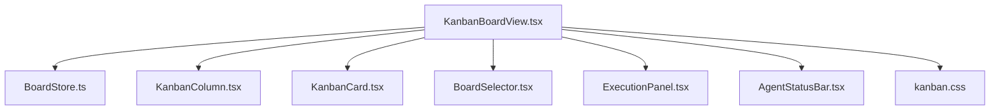
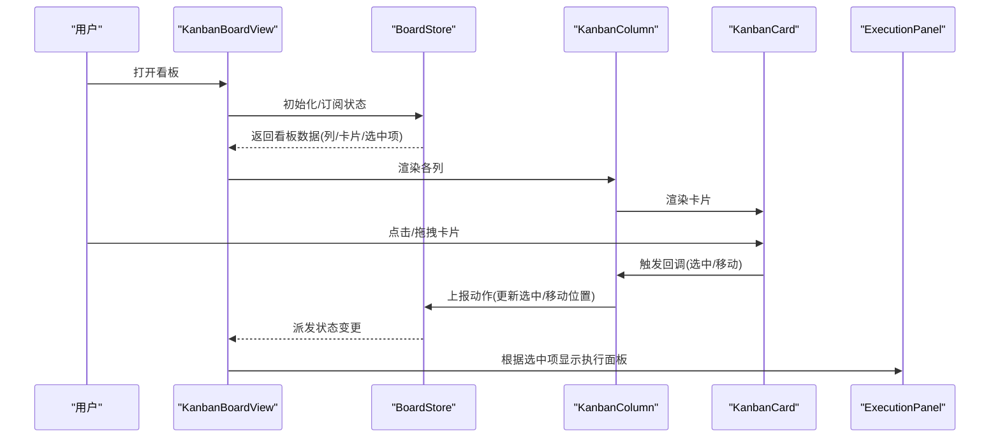
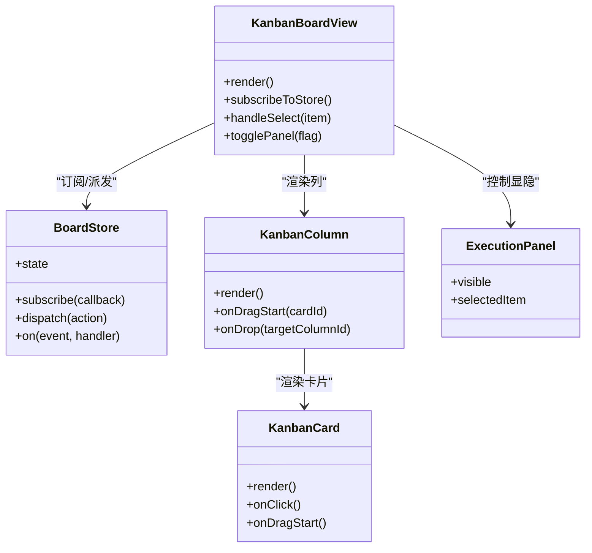
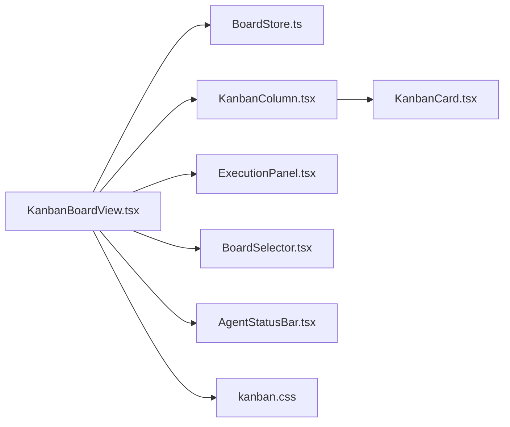

# 看板主视图

<cite>
**本文引用的文件**   
- [KanbanBoardView.tsx](file://opc/plugins/office_ui/frontend_src/kanban/KanbanBoardView.tsx)
- [BoardStore.ts](file://opc/plugins/office_ui/frontend_src/kanban/BoardStore.ts)
- [KanbanColumn.tsx](file://opc/plugins/office_ui/frontend_src/kanban/KanbanColumn.tsx)
- [KanbanCard.tsx](file://opc/plugins/office_ui/frontend_src/kanban/KanbanCard.tsx)
- [BoardSelector.tsx](file://opc/plugins/office_ui/frontend_src/kanban/BoardSelector.tsx)
- [ExecutionPanel.tsx](file://opc/plugins/office_ui/frontend_src/kanban/ExecutionPanel.tsx)
- [AgentStatusBar.tsx](file://opc/plugins/office_ui/frontend_src/kanban/AgentStatusBar.tsx)
- [kanban.css](file://opc/plugins/office_ui/frontend_src/kanban/kanban.css)
</cite>

## 目录
1. [简介](#简介)
2. [项目结构](#项目结构)
3. [核心组件](#核心组件)
4. [架构总览](#架构总览)
5. [详细组件分析](#详细组件分析)
6. [依赖关系分析](#依赖关系分析)
7. [性能考虑](#性能考虑)
8. [故障排查指南](#故障排查指南)
9. [结论](#结论)
10. [附录](#附录)

## 简介
本文件为 OpenOPC 前端看板主视图组件 KanbanBoardView 的技术文档。内容覆盖组件的架构设计、渲染与布局逻辑、状态协调机制、生命周期管理、响应式适配策略、配置项说明以及性能优化实践，帮助开发者快速理解并扩展该组件。

## 项目结构
看板相关的前端代码位于 office_ui 插件的 frontend_src/kanban 目录下，核心文件包括：
- 主视图容器：KanbanBoardView.tsx
- 数据层：BoardStore.ts
- 列与卡片：KanbanColumn.tsx、KanbanCard.tsx
- 辅助面板与选择器：BoardSelector.tsx、ExecutionPanel.tsx、AgentStatusBar.tsx
- 样式：kanban.css

图表来源
- [KanbanBoardView.tsx](file://opc/plugins/office_ui/frontend_src/kanban/KanbanBoardView.tsx)
- [BoardStore.ts](file://opc/plugins/office_ui/frontend_src/kanban/BoardStore.ts)
- [KanbanColumn.tsx](file://opc/plugins/office_ui/frontend_src/kanban/KanbanColumn.tsx)
- [KanbanCard.tsx](file://opc/plugins/office_ui/frontend_src/kanban/KanbanCard.tsx)
- [BoardSelector.tsx](file://opc/plugins/office_ui/frontend_src/kanban/BoardSelector.tsx)
- [ExecutionPanel.tsx](file://opc/plugins/office_ui/frontend_src/kanban/ExecutionPanel.tsx)
- [AgentStatusBar.tsx](file://opc/plugins/office_ui/frontend_src/kanban/AgentStatusBar.tsx)
- [kanban.css](file://opc/plugins/office_ui/frontend_src/kanban/kanban.css)

章节来源
- [KanbanBoardView.tsx](file://opc/plugins/office_ui/frontend_src/kanban/KanbanBoardView.tsx)
- [BoardStore.ts](file://opc/plugins/office_ui/frontend_src/kanban/BoardStore.ts)
- [KanbanColumn.tsx](file://opc/plugins/office_ui/frontend_src/kanban/KanbanColumn.tsx)
- [KanbanCard.tsx](file://opc/plugins/office_ui/frontend_src/kanban/KanbanCard.tsx)
- [BoardSelector.tsx](file://opc/plugins/office_ui/frontend_src/kanban/BoardSelector.tsx)
- [ExecutionPanel.tsx](file://opc/plugins/office_ui/frontend_src/kanban/ExecutionPanel.tsx)
- [AgentStatusBar.tsx](file://opc/plugins/office_ui/frontend_src/kanban/AgentStatusBar.tsx)
- [kanban.css](file://opc/plugins/office_ui/frontend_src/kanban/kanban.css)

## 核心组件
- KanbanBoardView：看板主视图容器，负责整体布局、列集合渲染、与 BoardStore 的状态同步、事件分发与生命周期管理。
- BoardStore：看板数据与状态中心，提供订阅、变更通知、跨面板共享状态（如选中任务、执行面板可见性）。
- KanbanColumn：单列容器，负责列头信息、列内卡片列表渲染、拖拽区域与交互回调。
- KanbanCard：单张任务卡片，展示关键信息、状态标识与点击/拖拽行为。
- BoardSelector：看板选择器，切换不同看板或过滤维度。
- ExecutionPanel：执行详情面板，与当前选中的工作项联动。
- AgentStatusBar：代理状态条，显示运行中代理的概览状态。
- kanban.css：看板主题与响应式样式。

章节来源
- [KanbanBoardView.tsx](file://opc/plugins/office_ui/frontend_src/kanban/KanbanBoardView.tsx)
- [BoardStore.ts](file://opc/plugins/office_ui/frontend_src/kanban/BoardStore.ts)
- [KanbanColumn.tsx](file://opc/plugins/office_ui/frontend_src/kanban/KanbanColumn.tsx)
- [KanbanCard.tsx](file://opc/plugins/office_ui/frontend_src/kanban/KanbanCard.tsx)
- [BoardSelector.tsx](file://opc/plugins/office_ui/frontend_src/kanban/BoardSelector.tsx)
- [ExecutionPanel.tsx](file://opc/plugins/office_ui/frontend_src/kanban/ExecutionPanel.tsx)
- [AgentStatusBar.tsx](file://opc/plugins/office_ui/frontend_src/kanban/AgentStatusBar.tsx)
- [kanban.css](file://opc/plugins/office_ui/frontend_src/kanban/kanban.css)

## 架构总览
KanbanBoardView 作为“容器型”视图，遵循“单向数据流 + 集中状态”的模式：
- 数据源：BoardStore 维护看板元数据、列定义、卡片集合、选中项、执行面板开关等。
- 视图层：KanbanBoardView 读取 Store 派生数据，渲染列与卡片；子组件通过回调将用户操作上报至 Store。
- 交互层：拖拽、点击、筛选等操作统一由 Store 处理，保证多面板一致性与可预测性。

图表来源
- [KanbanBoardView.tsx](file://opc/plugins/office_ui/frontend_src/kanban/KanbanBoardView.tsx)
- [BoardStore.ts](file://opc/plugins/office_ui/frontend_src/kanban/BoardStore.ts)
- [KanbanColumn.tsx](file://opc/plugins/office_ui/frontend_src/kanban/KanbanColumn.tsx)
- [KanbanCard.tsx](file://opc/plugins/office_ui/frontend_src/kanban/KanbanCard.tsx)
- [ExecutionPanel.tsx](file://opc/plugins/office_ui/frontend_src/kanban/ExecutionPanel.tsx)

## 详细组件分析

### KanbanBoardView 组件
职责与能力
- 容器渲染：按列集合渲染列容器，并在顶部集成看板选择器、执行面板开关、代理状态条等。
- 布局管理：使用弹性布局与网格策略，支持横向滚动与自适应列宽；在窄屏下启用纵向堆叠或隐藏次要元素。
- 状态协调：从 BoardStore 订阅看板数据与全局 UI 状态（如选中项、面板显隐），并将用户交互转换为 Store 动作。
- 生命周期：
  - 初始化：挂载时建立对 BoardStore 的订阅，加载看板元数据与初始列/卡片数据。
  - 数据加载：监听 Store 的数据就绪事件，必要时触发增量刷新。
  - 销毁：卸载时取消订阅、清理拖拽监听与定时器，避免内存泄漏。
- 事件总线：对外暴露必要回调（如选中项变化、面板显隐）供父级路由或侧边栏消费。

与 BoardStore 的交互模式
- 数据订阅：通过 Store 提供的订阅接口获取看板快照与增量更新。
- 事件监听：监听 Store 的变更事件，驱动局部重渲染而非全量重建。
- 状态更新：将用户操作封装为标准动作，交由 Store 进行不可变更新与持久化。

响应式布局实现
- 断点策略：基于 CSS 媒体查询与 JS 尺寸检测，在小屏幕下调整列间距、隐藏非关键信息、启用纵向滚动。
- 自适应列宽：列容器采用最小宽度与最大宽度约束，结合 flex-wrap 与 overflow-x 控制。
- 面板折叠：在窄屏下自动折叠执行面板与侧边信息，优先保留看板主体。

配置选项（示例）
- 主题设置：支持明暗主题、高对比度模式、色板变量。
- 显示模式：紧凑/标准/宽松三种密度；是否显示进度条、标签、时间戳等。
- 交互行为：是否允许拖拽、双击展开详情、键盘导航开关。
- 性能开关：虚拟滚动阈值、懒加载批次大小、去抖延迟。

章节来源
- [KanbanBoardView.tsx](file://opc/plugins/office_ui/frontend_src/kanban/KanbanBoardView.tsx)
- [BoardStore.ts](file://opc/plugins/office_ui/frontend_src/kanban/BoardStore.ts)
- [kanban.css](file://opc/plugins/office_ui/frontend_src/kanban/kanban.css)

### BoardStore 状态中心
职责与能力
- 数据模型：维护看板 ID、列定义、卡片集合、选中项、执行面板可见性等。
- 状态更新：提供不可变更新方法，确保每次变更产生新引用，便于 React 高效比对。
- 订阅与派发：支持多消费者订阅同一份状态，变更时仅向订阅者派发差异。
- 事件系统：定义标准化事件（如 card.move、card.select、panel.toggle），用于跨组件通信。
- 持久化：可选地将关键状态落盘，恢复时重建最近一次会话。

与 KanbanBoardView 的协作
- 初始化阶段：BoardStore 提供默认值与空态占位，视图据此渲染骨架屏。
- 运行时：视图只读状态，所有写操作通过 Store 的动作完成，保证单一事实来源。
- 错误边界：当后端数据异常时，Store 抛出结构化错误，视图捕获并降级显示。

章节来源
- [BoardStore.ts](file://opc/plugins/office_ui/frontend_src/kanban/BoardStore.ts)

### KanbanColumn 与 KanbanCard
- KanbanColumn：负责列头标题、计数、过滤条件、拖放目标区；接收来自 Card 的回调并转发到 Store。
- KanbanCard：展示任务摘要、优先级、负责人、状态徽标；处理点击选中、拖拽开始、右键菜单等交互。

图表来源
- [KanbanBoardView.tsx](file://opc/plugins/office_ui/frontend_src/kanban/KanbanBoardView.tsx)
- [BoardStore.ts](file://opc/plugins/office_ui/frontend_src/kanban/BoardStore.ts)
- [KanbanColumn.tsx](file://opc/plugins/office_ui/frontend_src/kanban/KanbanColumn.tsx)
- [KanbanCard.tsx](file://opc/plugins/office_ui/frontend_src/kanban/KanbanCard.tsx)
- [ExecutionPanel.tsx](file://opc/plugins/office_ui/frontend_src/kanban/ExecutionPanel.tsx)

章节来源
- [KanbanColumn.tsx](file://opc/plugins/office_ui/frontend_src/kanban/KanbanColumn.tsx)
- [KanbanCard.tsx](file://opc/plugins/office_ui/frontend_src/kanban/KanbanCard.tsx)

### 辅助组件
- BoardSelector：切换看板上下文，触发 Store 的看板切换动作。
- ExecutionPanel：根据选中项动态加载执行日志与进度，支持展开/收起。
- AgentStatusBar：聚合代理运行状态，提供快速定位与跳转。

章节来源
- [BoardSelector.tsx](file://opc/plugins/office_ui/frontend_src/kanban/BoardSelector.tsx)
- [ExecutionPanel.tsx](file://opc/plugins/office_ui/frontend_src/kanban/ExecutionPanel.tsx)
- [AgentStatusBar.tsx](file://opc/plugins/office_ui/frontend_src/kanban/AgentStatusBar.tsx)

## 依赖关系分析
- 组件耦合：KanbanBoardView 与 BoardStore 强耦合（读写状态），与列/卡片弱耦合（通过 props 与回调）。
- 外部依赖：CSS 样式与主题变量、可能的第三方拖拽库（若使用）、WebSocket/HTTP 客户端（由 Store 内部封装）。
- 潜在循环：应避免在 Store 中直接引入视图组件，防止循环依赖。

图表来源
- [KanbanBoardView.tsx](file://opc/plugins/office_ui/frontend_src/kanban/KanbanBoardView.tsx)
- [BoardStore.ts](file://opc/plugins/office_ui/frontend_src/kanban/BoardStore.ts)
- [KanbanColumn.tsx](file://opc/plugins/office_ui/frontend_src/kanban/KanbanColumn.tsx)
- [KanbanCard.tsx](file://opc/plugins/office_ui/frontend_src/kanban/KanbanCard.tsx)
- [BoardSelector.tsx](file://opc/plugins/office_ui/frontend_src/kanban/BoardSelector.tsx)
- [ExecutionPanel.tsx](file://opc/plugins/office_ui/frontend_src/kanban/ExecutionPanel.tsx)
- [AgentStatusBar.tsx](file://opc/plugins/office_ui/frontend_src/kanban/AgentStatusBar.tsx)
- [kanban.css](file://opc/plugins/office_ui/frontend_src/kanban/kanban.css)

章节来源
- [KanbanBoardView.tsx](file://opc/plugins/office_ui/frontend_src/kanban/KanbanBoardView.tsx)
- [BoardStore.ts](file://opc/plugins/office_ui/frontend_src/kanban/BoardStore.ts)

## 性能考虑
- 虚拟滚动：对长列表列启用虚拟滚动，仅渲染可视区域内的卡片，降低 DOM 节点数量与重排成本。
- 懒加载：列内卡片按需加载详情与缩略图，首屏优先渲染关键信息。
- 批处理更新：合并高频事件（如拖拽过程中的中间状态），减少不必要的重渲染。
- 稳定键值：为卡片与列提供稳定的 key，提升 Diff 效率。
- 防抖与节流：搜索、筛选、窗口尺寸变化等事件使用防抖/节流策略。
- 样式优化：使用 CSS 变量与硬件加速属性，避免频繁计算布局。

[本节为通用性能建议，不直接分析具体文件]

## 故障排查指南
常见问题与定位思路
- 状态不同步：检查 Store 的订阅是否正确注册与注销，确认动作派发路径无遗漏。
- 拖拽失效：验证拖拽事件绑定是否在正确时机挂载，目标列的 drop 区域是否被遮挡。
- 渲染卡顿：开启性能面板观察重绘范围，确认是否因缺少 key 导致全量重建。
- 响应式异常：检查媒体查询断点与 JS 尺寸监听是否冲突，必要时增加调试日志。
- 内存泄漏：确认组件卸载时解绑了事件监听与定时器。

章节来源
- [BoardStore.ts](file://opc/plugins/office_ui/frontend_src/kanban/BoardStore.ts)
- [KanbanBoardView.tsx](file://opc/plugins/office_ui/frontend_src/kanban/KanbanBoardView.tsx)

## 结论
KanbanBoardView 以集中式状态为核心，配合清晰的组件分层与响应式布局，提供了可扩展、高性能的看板体验。通过规范化的 Store 交互与完善的生命周期管理，可在复杂业务场景下保持可维护性与稳定性。

## 附录
- 术语
  - 看板：一组按状态划分的列与卡片的可视化集合。
  - 工作项：看板中的单个任务卡片。
  - 代理：后台运行的自动化角色或进程。
- 参考文件
  - 主视图与样式：[KanbanBoardView.tsx](file://opc/plugins/office_ui/frontend_src/kanban/KanbanBoardView.tsx)、[kanban.css](file://opc/plugins/office_ui/frontend_src/kanban/kanban.css)
  - 状态中心：[BoardStore.ts](file://opc/plugins/office_ui/frontend_src/kanban/BoardStore.ts)
  - 列与卡片：[KanbanColumn.tsx](file://opc/plugins/office_ui/frontend_src/kanban/KanbanColumn.tsx)、[KanbanCard.tsx](file://opc/plugins/office_ui/frontend_src/kanban/KanbanCard.tsx)
  - 辅助面板：[BoardSelector.tsx](file://opc/plugins/office_ui/frontend_src/kanban/BoardSelector.tsx)、[ExecutionPanel.tsx](file://opc/plugins/office_ui/frontend_src/kanban/ExecutionPanel.tsx)、[AgentStatusBar.tsx](file://opc/plugins/office_ui/frontend_src/kanban/AgentStatusBar.tsx)