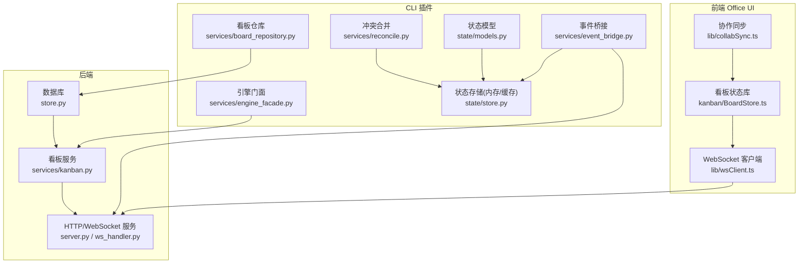
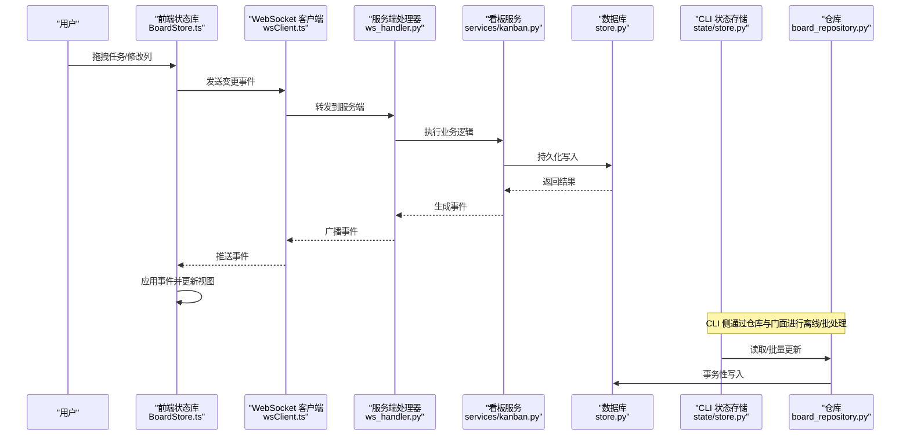
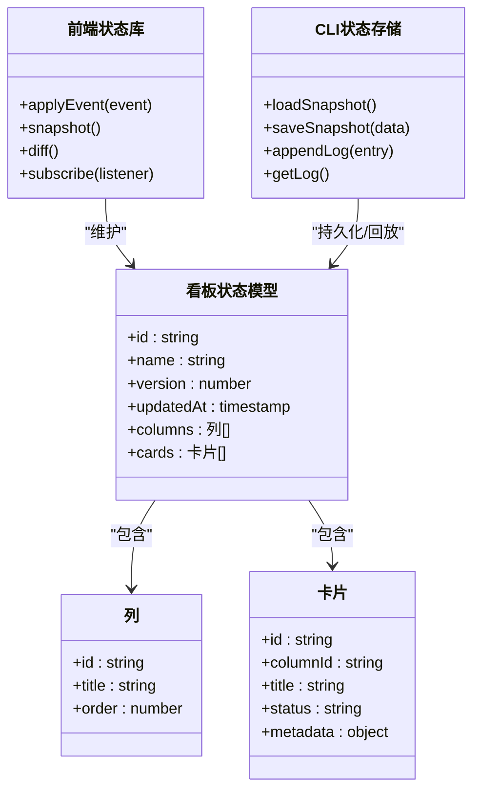
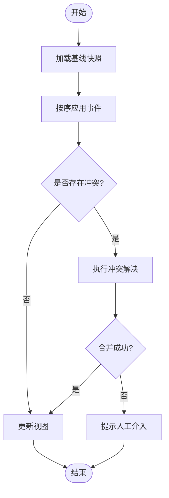
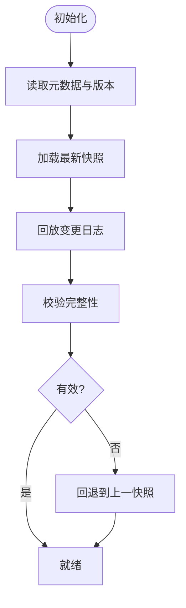
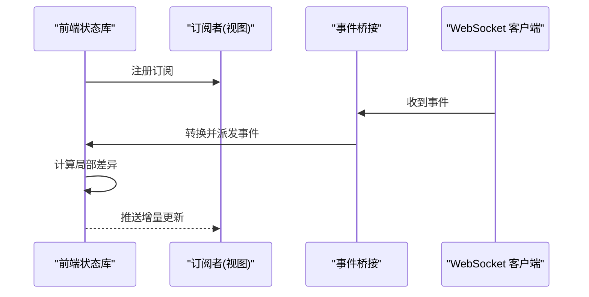
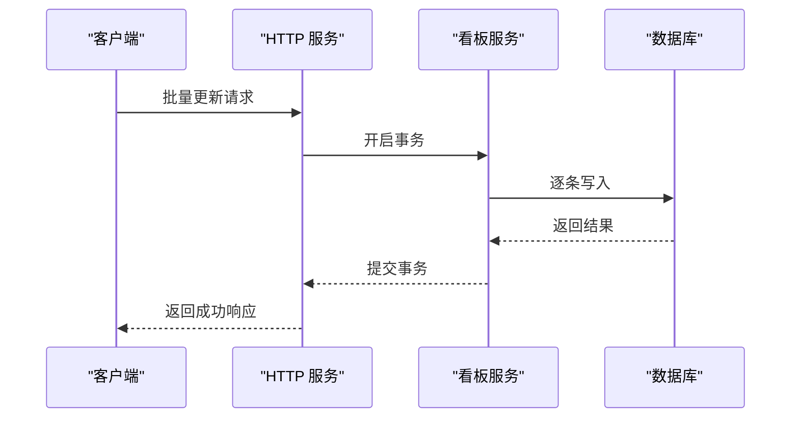
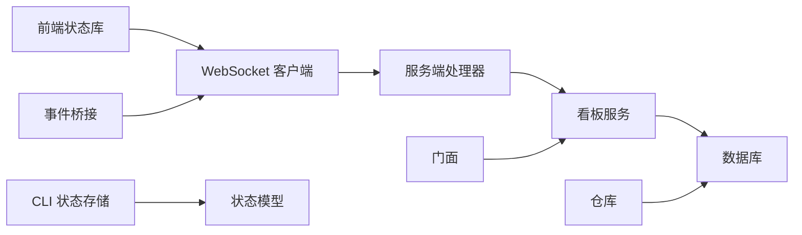

# 看板状态管理

<cite>
**本文引用的文件**   
- [kanban.py](file://opc/presentation/kanban.py)
- [store.py](file://opc/database/store.py)
- [board_repository.py](file://opc/plugins/cli_board/services/board_repository.py)
- [engine_facade.py](file://opc/plugins/cli_board/services/engine_facade.py)
- [event_bridge.py](file://opc/plugins/cli_board/services/event_bridge.py)
- [reconcile.py](file://opc/plugins/cli_board/services/reconcile.py)
- [models.py](file://opc/plugins/cli_board/state/models.py)
- [store.py](file://opc/plugins/cli_board/state/store.py)
- [BoardStore.ts](file://opc/plugins/office_ui/frontend_src/kanban/BoardStore.ts)
- [collabSync.ts](file://opc/plugins/office_ui/frontend_src/lib/collabSync.ts)
- [wsClient.ts](file://opc/plugins/office_ui/frontend_src/lib/wsClient.ts)
- [server.py](file://opc/plugins/office_ui/server.py)
- [ws_handler.py](file://opc/plugins/office_ui/ws_handler.py)
- [kanban.py](file://opc/plugins/office_ui/services/kanban.py)
- [test_board_state.py](file://tests/cli_board/test_board_state.py)
- [test_repository.py](file://tests/cli_board/test_repository.py)
</cite>

## 目录
1. [简介](#简介)
2. [项目结构](#项目结构)
3. [核心组件](#核心组件)
4. [架构总览](#架构总览)
5. [详细组件分析](#详细组件分析)
6. [依赖关系分析](#依赖关系分析)
7. [性能考虑](#性能考虑)
8. [故障排查指南](#故障排查指南)
9. [结论](#结论)
10. [附录](#附录)

## 简介
本技术文档围绕 OpenOPC 的看板状态管理系统，聚焦 BoardStore 的状态架构设计、数据流与变更追踪、同步策略（本地与服务器）、持久化机制、订阅通知系统、API 接口以及调试工具。文档面向开发者与维护者，既提供高层架构概览，也深入到关键实现细节，帮助读者理解并扩展看板状态管理能力。

## 项目结构
看板状态管理涉及后端服务、CLI 插件、前端 UI 与数据库层：
- 后端服务与数据库：负责状态存储、版本迁移与事务性读写
- CLI 插件：封装仓库访问、引擎交互、事件桥接与冲突合并
- 前端 Office UI：维护本地状态、WebSocket 通信、协作同步与渲染
- 测试：覆盖状态一致性、仓库行为与端到端流程

图表来源
- [store.py](file://opc/database/store.py)
- [kanban.py](file://opc/plugins/office_ui/services/kanban.py)
- [server.py](file://opc/plugins/office_ui/server.py)
- [ws_handler.py](file://opc/plugins/office_ui/ws_handler.py)
- [board_repository.py](file://opc/plugins/cli_board/services/board_repository.py)
- [engine_facade.py](file://opc/plugins/cli_board/services/engine_facade.py)
- [event_bridge.py](file://opc/plugins/cli_board/services/event_bridge.py)
- [reconcile.py](file://opc/plugins/cli_board/services/reconcile.py)
- [models.py](file://opc/plugins/cli_board/state/models.py)
- [store.py](file://opc/plugins/cli_board/state/store.py)
- [BoardStore.ts](file://opc/plugins/office_ui/frontend_src/kanban/BoardStore.ts)
- [wsClient.ts](file://opc/plugins/office_ui/frontend_src/lib/wsClient.ts)
- [collabSync.ts](file://opc/plugins/office_ui/frontend_src/lib/collabSync.ts)

章节来源
- [kanban.py](file://opc/presentation/kanban.py)
- [store.py](file://opc/database/store.py)
- [board_repository.py](file://opc/plugins/cli_board/services/board_repository.py)
- [engine_facade.py](file://opc/plugins/cli_board/services/engine_facade.py)
- [event_bridge.py](file://opc/plugins/cli_board/services/event_bridge.py)
- [reconcile.py](file://opc/plugins/cli_board/services/reconcile.py)
- [models.py](file://opc/plugins/cli_board/state/models.py)
- [store.py](file://opc/plugins/cli_board/state/store.py)
- [BoardStore.ts](file://opc/plugins/office_ui/frontend_src/kanban/BoardStore.ts)
- [collabSync.ts](file://opc/plugins/office_ui/frontend_src/lib/collabSync.ts)
- [wsClient.ts](file://opc/plugins/office_ui/frontend_src/lib/wsClient.ts)
- [server.py](file://opc/plugins/office_ui/server.py)
- [ws_handler.py](file://opc/plugins/office_ui/ws_handler.py)
- [kanban.py](file://opc/plugins/office_ui/services/kanban.py)

## 核心组件
- 状态模型与存储（CLI）：定义看板状态的数据结构与内存态存储，提供增删改查、快照与变更日志能力
- 仓库与门面（CLI）：封装对数据库的 CRUD 与批量操作，屏蔽底层差异；门面统一调用引擎相关能力
- 事件桥接与合并（CLI）：将服务端事件映射为本地状态变更，并在必要时执行冲突检测与合并
- 前端状态库（Office UI）：维护当前看板视图状态，处理用户交互、增量更新与重放
- 协作同步（Office UI）：基于 WebSocket 的事件流，实现多端一致性与冲突解决
- 后端服务与处理器：暴露 API 与 WS 通道，协调数据库与业务逻辑

章节来源
- [models.py](file://opc/plugins/cli_board/state/models.py)
- [store.py](file://opc/plugins/cli_board/state/store.py)
- [board_repository.py](file://opc/plugins/cli_board/services/board_repository.py)
- [engine_facade.py](file://opc/plugins/cli_board/services/engine_facade.py)
- [event_bridge.py](file://opc/plugins/cli_board/services/event_bridge.py)
- [reconcile.py](file://opc/plugins/cli_board/services/reconcile.py)
- [BoardStore.ts](file://opc/plugins/office_ui/frontend_src/kanban/BoardStore.ts)
- [collabSync.ts](file://opc/plugins/office_ui/frontend_src/lib/collabSync.ts)
- [wsClient.ts](file://opc/plugins/office_ui/frontend_src/lib/wsClient.ts)
- [kanban.py](file://opc/plugins/office_ui/services/kanban.py)
- [server.py](file://opc/plugins/office_ui/server.py)
- [ws_handler.py](file://opc/plugins/office_ui/ws_handler.py)

## 架构总览
看板状态管理采用“前后端分离 + 事件驱动”的架构：
- 前端通过 WebSocket 接收增量事件，应用至本地状态库，触发 UI 更新
- 后端通过 HTTP 提供快照与批量操作，WS 推送变更事件
- CLI 插件作为中间层，聚合仓库、门面与合并器，支撑 TUI 与自动化场景
- 数据库层提供持久化、迁移与事务保障

图表来源
- [BoardStore.ts](file://opc/plugins/office_ui/frontend_src/kanban/BoardStore.ts)
- [wsClient.ts](file://opc/plugins/office_ui/frontend_src/lib/wsClient.ts)
- [ws_handler.py](file://opc/plugins/office_ui/ws_handler.py)
- [kanban.py](file://opc/plugins/office_ui/services/kanban.py)
- [store.py](file://opc/database/store.py)
- [store.py](file://opc/plugins/cli_board/state/store.py)
- [board_repository.py](file://opc/plugins/cli_board/services/board_repository.py)

## 详细组件分析

### BoardStore 状态架构设计
- 状态结构定义
  - 使用强类型模型描述看板、列、卡片等实体及其关系，确保序列化与反序列化的稳定性
  - 引入版本号与时间戳字段，用于冲突检测与恢复
- 数据流管理
  - 前端状态库维护当前视图状态，按事件顺序应用增量更新
  - CLI 状态存储提供内存态快照与变更日志，便于调试与回放
- 变更追踪机制
  - 记录每次变更的来源、时间戳与影响范围
  - 支持生成状态快照，用于回滚与审计

图表来源
- [models.py](file://opc/plugins/cli_board/state/models.py)
- [store.py](file://opc/plugins/cli_board/state/store.py)
- [BoardStore.ts](file://opc/plugins/office_ui/frontend_src/kanban/BoardStore.ts)

章节来源
- [models.py](file://opc/plugins/cli_board/state/models.py)
- [store.py](file://opc/plugins/cli_board/state/store.py)
- [BoardStore.ts](file://opc/plugins/office_ui/frontend_src/kanban/BoardStore.ts)

### 状态同步策略（本地与服务器、冲突检测与解决）
- 同步策略
  - 首次加载：前端请求服务端快照，建立基线状态
  - 增量同步：通过 WebSocket 推送事件，前端按序应用
  - 断线恢复：连接重建后拉取缺失事件或全量快照
- 冲突检测
  - 基于版本号与时间戳比较，识别并发修改
  - 检查同一实体的多次变更是否产生不可合并的语义冲突
- 冲突解决算法
  - 优先服务端权威版本，结合本地未提交变更进行最小侵入式合并
  - 对可合并字段进行自动合并，不可合并字段标记人工介入

图表来源
- [collabSync.ts](file://opc/plugins/office_ui/frontend_src/lib/collabSync.ts)
- [reconcile.py](file://opc/plugins/cli_board/services/reconcile.py)
- [event_bridge.py](file://opc/plugins/cli_board/services/event_bridge.py)

章节来源
- [collabSync.ts](file://opc/plugins/office_ui/frontend_src/lib/collabSync.ts)
- [reconcile.py](file://opc/plugins/cli_board/services/reconcile.py)
- [event_bridge.py](file://opc/plugins/cli_board/services/event_bridge.py)

### 状态持久化机制（序列化、版本兼容、恢复）
- 数据序列化
  - 使用稳定 schema 的 JSON 或等效格式，保证跨版本可读性
  - 关键字段包含 id、version、timestamp，便于校验与恢复
- 版本兼容性
  - 在模型中声明版本字段，迁移时根据版本选择适配逻辑
  - 向后兼容旧版本字段，弃用字段保留但忽略
- 恢复策略
  - 从最近快照恢复，并回放后续日志条目
  - 若日志不完整，回退到上一个完整快照并提示修复

图表来源
- [models.py](file://opc/plugins/cli_board/state/models.py)
- [store.py](file://opc/plugins/cli_board/state/store.py)

章节来源
- [models.py](file://opc/plugins/cli_board/state/models.py)
- [store.py](file://opc/plugins/cli_board/state/store.py)

### 状态订阅与通知系统（观察者模式与性能优化）
- 观察者模式
  - 前端状态库提供 subscribe/unsubscribe 接口，监听状态变更事件
  - CLI 事件桥接将服务端事件转换为内部事件，分发到订阅者
- 性能优化
  - 批量事件合并，减少 UI 重绘次数
  - 局部 diff 计算，仅更新受影响节点
  - 去抖与节流，避免高频事件导致抖动

图表来源
- [BoardStore.ts](file://opc/plugins/office_ui/frontend_src/kanban/BoardStore.ts)
- [event_bridge.py](file://opc/plugins/cli_board/services/event_bridge.py)
- [wsClient.ts](file://opc/plugins/office_ui/frontend_src/lib/wsClient.ts)

章节来源
- [BoardStore.ts](file://opc/plugins/office_ui/frontend_src/kanban/BoardStore.ts)
- [event_bridge.py](file://opc/plugins/cli_board/services/event_bridge.py)
- [wsClient.ts](file://opc/plugins/office_ui/frontend_src/lib/wsClient.ts)

### 状态操作 API（CRUD、批量处理、事务管理）
- CRUD 操作
  - 创建/更新/删除看板、列、卡片等实体
  - 支持按 ID 查询与条件过滤
- 批量处理
  - 提供批量创建/更新接口，减少网络往返
  - 支持事务边界，确保原子性
- 事务管理
  - 后端以数据库事务包裹批量写入，失败回滚
  - 前端在批量操作期间禁用部分交互，避免不一致

图表来源
- [kanban.py](file://opc/plugins/office_ui/services/kanban.py)
- [store.py](file://opc/database/store.py)
- [board_repository.py](file://opc/plugins/cli_board/services/board_repository.py)

章节来源
- [kanban.py](file://opc/plugins/office_ui/services/kanban.py)
- [store.py](file://opc/database/store.py)
- [board_repository.py](file://opc/plugins/cli_board/services/board_repository.py)

### 状态调试工具（快照、变更日志、性能分析）
- 状态快照
  - 导出当前状态快照，用于问题复现与对比
  - 支持导入快照进行快速恢复
- 变更日志
  - 记录所有变更事件，包括来源、时间与内容摘要
  - 提供按时间窗口筛选与回放功能
- 性能分析
  - 统计事件处理耗时与 UI 更新频率
  - 输出热点路径与瓶颈指标，辅助优化

章节来源
- [store.py](file://opc/plugins/cli_board/state/store.py)
- [BoardStore.ts](file://opc/plugins/office_ui/frontend_src/kanban/BoardStore.ts)

## 依赖关系分析
- 组件耦合
  - 前端状态库依赖 WebSocket 客户端与服务端处理器
  - CLI 插件依赖仓库与门面，间接依赖数据库
- 外部依赖
  - 数据库提供持久化与事务
  - WebSocket 提供实时通信
- 潜在循环依赖
  - 通过事件桥接与门面解耦，避免直接循环引用

图表来源
- [BoardStore.ts](file://opc/plugins/office_ui/frontend_src/kanban/BoardStore.ts)
- [wsClient.ts](file://opc/plugins/office_ui/frontend_src/lib/wsClient.ts)
- [ws_handler.py](file://opc/plugins/office_ui/ws_handler.py)
- [kanban.py](file://opc/plugins/office_ui/services/kanban.py)
- [store.py](file://opc/database/store.py)
- [store.py](file://opc/plugins/cli_board/state/store.py)
- [models.py](file://opc/plugins/cli_board/state/models.py)
- [board_repository.py](file://opc/plugins/cli_board/services/board_repository.py)
- [engine_facade.py](file://opc/plugins/cli_board/services/engine_facade.py)
- [event_bridge.py](file://opc/plugins/cli_board/services/event_bridge.py)

章节来源
- [BoardStore.ts](file://opc/plugins/office_ui/frontend_src/kanban/BoardStore.ts)
- [wsClient.ts](file://opc/plugins/office_ui/frontend_src/lib/wsClient.ts)
- [ws_handler.py](file://opc/plugins/office_ui/ws_handler.py)
- [kanban.py](file://opc/plugins/office_ui/services/kanban.py)
- [store.py](file://opc/database/store.py)
- [store.py](file://opc/plugins/cli_board/state/store.py)
- [models.py](file://opc/plugins/cli_board/state/models.py)
- [board_repository.py](file://opc/plugins/cli_board/services/board_repository.py)
- [engine_facade.py](file://opc/plugins/cli_board/services/engine_facade.py)
- [event_bridge.py](file://opc/plugins/cli_board/services/event_bridge.py)

## 性能考虑
- 事件批处理与合并，降低 UI 更新开销
- 局部差异计算，避免整树重渲染
- 去抖与节流，抑制高频输入导致的抖动
- 批量 API 与事务，减少网络往返与锁竞争
- 快照与日志分段，提升恢复效率

[本节为通用指导，不直接分析具体文件]

## 故障排查指南
- 常见问题
  - 状态不一致：检查事件顺序与版本号，确认冲突解决策略
  - 恢复失败：验证快照完整性与日志连续性
  - 性能退化：定位热点事件与批量操作瓶颈
- 诊断步骤
  - 导出快照与日志，对比前后差异
  - 回放事件，复现场景并定位错误
  - 查看服务端日志与数据库事务状态

章节来源
- [test_board_state.py](file://tests/cli_board/test_board_state.py)
- [test_repository.py](file://tests/cli_board/test_repository.py)

## 结论
看板状态管理通过清晰的状态模型、稳健的同步与持久化机制、高效的订阅通知与完善的调试工具，实现了高可用与可扩展的看板系统。建议在生产环境中持续监控事件处理性能与冲突率，并结合快照与日志进行定期健康检查。

[本节为总结，不直接分析具体文件]

## 附录
- 术语表
  - 快照：某一时刻的完整状态副本
  - 变更日志：按时间顺序记录的变更事件集合
  - 冲突解决：对并发修改进行合并或仲裁的策略
- 参考实现路径
  - 状态模型与存储：[models.py](file://opc/plugins/cli_board/state/models.py)、[store.py](file://opc/plugins/cli_board/state/store.py)
  - 仓库与门面：[board_repository.py](file://opc/plugins/cli_board/services/board_repository.py)、[engine_facade.py](file://opc/plugins/cli_board/services/engine_facade.py)
  - 事件桥接与合并：[event_bridge.py](file://opc/plugins/cli_board/services/event_bridge.py)、[reconcile.py](file://opc/plugins/cli_board/services/reconcile.py)
  - 前端状态库与协作同步：[BoardStore.ts](file://opc/plugins/office_ui/frontend_src/kanban/BoardStore.ts)、[collabSync.ts](file://opc/plugins/office_ui/frontend_src/lib/collabSync.ts)
  - 服务端与处理器：[kanban.py](file://opc/plugins/office_ui/services/kanban.py)、[server.py](file://opc/plugins/office_ui/server.py)、[ws_handler.py](file://opc/plugins/office_ui/ws_handler.py)
  - 数据库层：[store.py](file://opc/database/store.py)