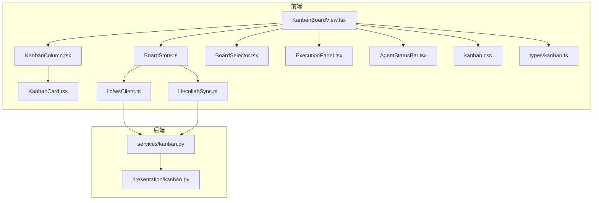
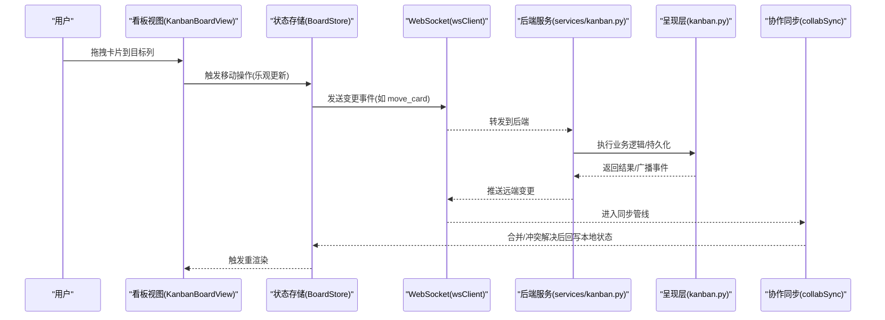
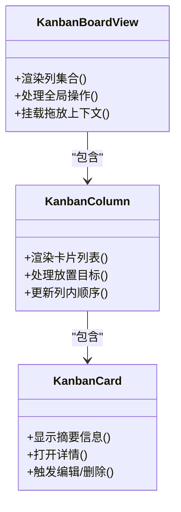
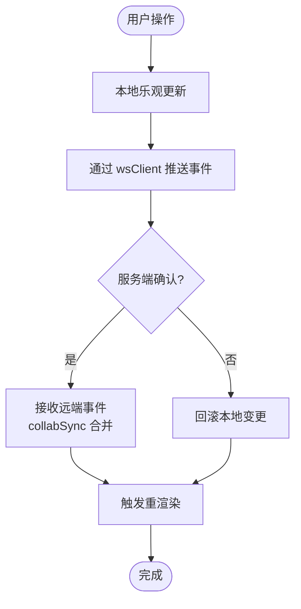
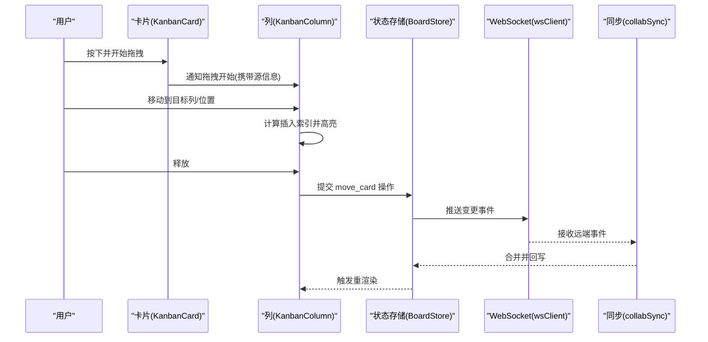
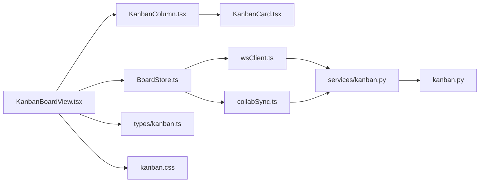

# 看板界面

<cite>
**本文引用的文件**   
- [KanbanBoardView.tsx](file://opc/plugins/office_ui/frontend_src/kanban/KanbanBoardView.tsx)
- [KanbanColumn.tsx](file://opc/plugins/office_ui/frontend_src/kanban/KanbanColumn.tsx)
- [KanbanCard.tsx](file://opc/plugins/office_ui/frontend_src/kanban/KanbanCard.tsx)
- [BoardStore.ts](file://opc/plugins/office_ui/frontend_src/kanban/BoardStore.ts)
- [BoardSelector.tsx](file://opc/plugins/office_ui/frontend_src/kanban/BoardSelector.tsx)
- [ExecutionPanel.tsx](file://opc/plugins/office_ui/frontend_src/kanban/ExecutionPanel.tsx)
- [AgentStatusBar.tsx](file://opc/plugins/office_ui/frontend_src/kanban/AgentStatusBar.tsx)
- [kanban.css](file://opc/plugins/office_ui/frontend_src/kanban/kanban.css)
- [kanban.ts](file://opc/plugins/office_ui/frontend_src/types/kanban.ts)
- [wsClient.ts](file://opc/plugins/office_ui/frontend_src/lib/wsClient.ts)
- [collabSync.ts](file://opc/plugins/office_ui/frontend_src/lib/collabSync.ts)
- [kanban.py](file://opc/presentation/kanban.py)
- [services/kanban.py](file://opc/plugins/office_ui/services/kanban.py)
</cite>

## 目录
1. [简介](#简介)
2. [项目结构](#项目结构)
3. [核心组件](#核心组件)
4. [架构总览](#架构总览)
5. [详细组件分析](#详细组件分析)
6. [依赖关系分析](#依赖关系分析)
7. [性能考虑](#性能考虑)
8. [故障排查指南](#故障排查指南)
9. [结论](#结论)
10. [附录](#附录)

## 简介
本文件面向 OpenOPC 的 Web 看板界面，系统性说明其核心功能与实现要点。看板用于可视化展示任务卡片、管理列（阶段）以及通过拖拽在列间移动任务。文档覆盖：
- 看板数据模型与状态管理机制
- 任务卡片的交互能力（编辑、移动、删除、详情查看）
- 拖拽流程（开始、进行中、结束）的实现思路
- 响应式布局与适配策略
- 自定义配置（列定义、卡片模板、颜色主题）
- 多端同步与冲突解决机制

## 项目结构
看板前端位于 office_ui 插件的前端源码中，采用 React + TypeScript 组织；后端提供 Kanban 服务与 WebSocket 事件桥接，负责持久化与协作同步。

图表来源
- [KanbanBoardView.tsx](file://opc/plugins/office_ui/frontend_src/kanban/KanbanBoardView.tsx)
- [KanbanColumn.tsx](file://opc/plugins/office_ui/frontend_src/kanban/KanbanColumn.tsx)
- [KanbanCard.tsx](file://opc/plugins/office_ui/frontend_src/kanban/KanbanCard.tsx)
- [BoardStore.ts](file://opc/plugins/office_ui/frontend_src/kanban/BoardStore.ts)
- [BoardSelector.tsx](file://opc/plugins/office_ui/frontend_src/kanban/BoardSelector.tsx)
- [ExecutionPanel.tsx](file://opc/plugins/office_ui/frontend_src/kanban/ExecutionPanel.tsx)
- [AgentStatusBar.tsx](file://opc/plugins/office_ui/frontend_src/kanban/AgentStatusBar.tsx)
- [kanban.css](file://opc/plugins/office_ui/frontend_src/kanban/kanban.css)
- [kanban.ts](file://opc/plugins/office_ui/frontend_src/types/kanban.ts)
- [wsClient.ts](file://opc/plugins/office_ui/frontend_src/lib/wsClient.ts)
- [collabSync.ts](file://opc/plugins/office_ui/frontend_src/lib/collabSync.ts)
- [kanban.py](file://opc/presentation/kanban.py)
- [services/kanban.py](file://opc/plugins/office_ui/services/kanban.py)

章节来源
- [KanbanBoardView.tsx](file://opc/plugins/office_ui/frontend_src/kanban/KanbanBoardView.tsx)
- [BoardStore.ts](file://opc/plugins/office_ui/frontend_src/kanban/BoardStore.ts)
- [kanban.ts](file://opc/plugins/office_ui/frontend_src/types/kanban.ts)
- [wsClient.ts](file://opc/plugins/office_ui/frontend_src/lib/wsClient.ts)
- [collabSync.ts](file://opc/plugins/office_ui/frontend_src/lib/collabSync.ts)
- [kanban.py](file://opc/presentation/kanban.py)
- [services/kanban.py](file://opc/plugins/office_ui/services/kanban.py)

## 核心组件
- 看板视图容器：负责渲染列集合、承载全局状态、处理用户操作入口（新建、切换看板、打开执行面板等）。
- 列组件：按列渲染任务卡片，并处理该列内的拖放目标区域。
- 卡片组件：展示任务摘要信息，支持点击查看详情、快捷编辑、删除等交互。
- 看板状态存储：集中管理看板元数据、列顺序、卡片列表及变更历史，协调本地乐观更新与远端同步。
- 选择器与辅助面板：看板切换、执行进度与代理状态展示。
- 类型定义：统一前后端数据结构契约。
- 样式：看板布局、卡片尺寸、拖拽高亮、响应式断点等。

章节来源
- [KanbanBoardView.tsx](file://opc/plugins/office_ui/frontend_src/kanban/KanbanBoardView.tsx)
- [KanbanColumn.tsx](file://opc/plugins/office_ui/frontend_src/kanban/KanbanColumn.tsx)
- [KanbanCard.tsx](file://opc/plugins/office_ui/frontend_src/kanban/KanbanCard.tsx)
- [BoardStore.ts](file://opc/plugins/office_ui/frontend_src/kanban/BoardStore.ts)
- [BoardSelector.tsx](file://opc/plugins/office_ui/frontend_src/kanban/BoardSelector.tsx)
- [ExecutionPanel.tsx](file://opc/plugins/office_ui/frontend_src/kanban/ExecutionPanel.tsx)
- [AgentStatusBar.tsx](file://opc/plugins/office_ui/frontend_src/kanban/AgentStatusBar.tsx)
- [kanban.css](file://opc/plugins/office_ui/frontend_src/kanban/kanban.css)
- [kanban.ts](file://opc/plugins/office_ui/frontend_src/types/kanban.ts)

## 架构总览
看板采用“前端状态驱动 + 后端事件驱动”的双向同步架构。前端以 BoardStore 为单一事实源，进行乐观更新并通过 wsClient 将变更推送至后端 services/kanban.py；collabSync 负责合并远端增量与冲突消解。后端 kanban.py 暴露 API 与事件通道，供多客户端协作。

图表来源
- [KanbanBoardView.tsx](file://opc/plugins/office_ui/frontend_src/kanban/KanbanBoardView.tsx)
- [BoardStore.ts](file://opc/plugins/office_ui/frontend_src/kanban/BoardStore.ts)
- [wsClient.ts](file://opc/plugins/office_ui/frontend_src/lib/wsClient.ts)
- [collabSync.ts](file://opc/plugins/office_ui/frontend_src/lib/collabSync.ts)
- [services/kanban.py](file://opc/plugins/office_ui/services/kanban.py)
- [kanban.py](file://opc/presentation/kanban.py)

## 详细组件分析

### 看板视图与列/卡片渲染
- 看板视图负责加载当前看板、渲染列集合、挂载拖放上下文，并提供全局操作入口（新建任务、切换看板、打开执行面板等）。
- 列组件维护列内卡片顺序，接收来自上层的状态变更，并在拖放命中时提供视觉反馈。
- 卡片组件展示关键信息（标题、标签、优先级、负责人等），并绑定点击、编辑、删除等事件。

图表来源
- [KanbanBoardView.tsx](file://opc/plugins/office_ui/frontend_src/kanban/KanbanBoardView.tsx)
- [KanbanColumn.tsx](file://opc/plugins/office_ui/frontend_src/kanban/KanbanColumn.tsx)
- [KanbanCard.tsx](file://opc/plugins/office_ui/frontend_src/kanban/KanbanCard.tsx)

章节来源
- [KanbanBoardView.tsx](file://opc/plugins/office_ui/frontend_src/kanban/KanbanBoardView.tsx)
- [KanbanColumn.tsx](file://opc/plugins/office_ui/frontend_src/kanban/KanbanColumn.tsx)
- [KanbanCard.tsx](file://opc/plugins/office_ui/frontend_src/kanban/KanbanCard.tsx)

### 数据模型与状态管理
- 类型契约：kanban.ts 定义看板、列、卡片、状态字段等结构，确保前后端一致。
- 状态存储：BoardStore 维护当前看板、列顺序、卡片集合、选中项、撤销栈等，并提供增删改查与批量操作的原子方法。
- 同步机制：BoardStore 在本地先做乐观更新，随后通过 wsClient 上报变更；collabSync 监听远端事件，进行合并与冲突解决，再回写 Store。

图表来源
- [BoardStore.ts](file://opc/plugins/office_ui/frontend_src/kanban/BoardStore.ts)
- [wsClient.ts](file://opc/plugins/office_ui/frontend_src/lib/wsClient.ts)
- [collabSync.ts](file://opc/plugins/office_ui/frontend_src/lib/collabSync.ts)
- [kanban.ts](file://opc/plugins/office_ui/frontend_src/types/kanban.ts)

章节来源
- [BoardStore.ts](file://opc/plugins/office_ui/frontend_src/kanban/BoardStore.ts)
- [wsClient.ts](file://opc/plugins/office_ui/frontend_src/lib/wsClient.ts)
- [collabSync.ts](file://opc/plugins/office_ui/frontend_src/lib/collabSync.ts)
- [kanban.ts](file://opc/plugins/office_ui/frontend_src/types/kanban.ts)

### 拖拽功能实现
- 拖拽开始：在卡片上按下并记录源卡片 ID、源列 ID、目标位置等信息，同时创建拖拽幽灵元素。
- 拖拽中：根据鼠标位置计算目标列与插入索引，实时更新预览高亮与占位符。
- 拖拽结束：校验合法性，提交移动事件到 BoardStore，触发乐观更新与远端同步；若失败则回滚。

图表来源
- [KanbanCard.tsx](file://opc/plugins/office_ui/frontend_src/kanban/KanbanCard.tsx)
- [KanbanColumn.tsx](file://opc/plugins/office_ui/frontend_src/kanban/KanbanColumn.tsx)
- [BoardStore.ts](file://opc/plugins/office_ui/frontend_src/kanban/BoardStore.ts)
- [wsClient.ts](file://opc/plugins/office_ui/frontend_src/lib/wsClient.ts)
- [collabSync.ts](file://opc/plugins/office_ui/frontend_src/lib/collabSync.ts)

章节来源
- [KanbanCard.tsx](file://opc/plugins/office_ui/frontend_src/kanban/KanbanCard.tsx)
- [KanbanColumn.tsx](file://opc/plugins/office_ui/frontend_src/kanban/KanbanColumn.tsx)
- [BoardStore.ts](file://opc/plugins/office_ui/frontend_src/kanban/BoardStore.ts)
- [wsClient.ts](file://opc/plugins/office_ui/frontend_src/lib/wsClient.ts)
- [collabSync.ts](file://opc/plugins/office_ui/frontend_src/lib/collabSync.ts)

### 任务卡片交互
- 详情查看：点击卡片打开详情面板或侧边栏，展示完整描述、附件、进度日志等。
- 编辑：支持快速修改标题、标签、优先级、负责人等字段，保存后触发同步。
- 移动：通过拖拽或在详情中调整阶段。
- 删除：二次确认后删除卡片，并广播变更。

章节来源
- [KanbanCard.tsx](file://opc/plugins/office_ui/frontend_src/kanban/KanbanCard.tsx)
- [BoardStore.ts](file://opc/plugins/office_ui/frontend_src/kanban/BoardStore.ts)

### 看板选择与执行面板
- 看板选择器：支持在多看板之间切换，切换时重新拉取对应列与卡片数据。
- 执行面板：展示当前任务的执行进度、日志与人工输入入口，与看板联动。

章节来源
- [BoardSelector.tsx](file://opc/plugins/office_ui/frontend_src/kanban/BoardSelector.tsx)
- [ExecutionPanel.tsx](file://opc/plugins/office_ui/frontend_src/kanban/ExecutionPanel.tsx)

### 代理状态条
- 展示当前代理的运行状态、负载与告警提示，便于在看板上下文中感知系统健康度。

章节来源
- [AgentStatusBar.tsx](file://opc/plugins/office_ui/frontend_src/kanban/AgentStatusBar.tsx)

### 响应式设计与布局适配
- 使用 CSS 变量与媒体查询控制列宽、卡片间距、滚动行为与触摸友好性。
- 在小屏设备上自动减少每行列数、隐藏次要信息、优化触控区域。
- 通过 CSS 类名与主题变量实现暗色/亮色主题切换。

章节来源
- [kanban.css](file://opc/plugins/office_ui/frontend_src/kanban/kanban.css)

### 自定义配置
- 列定义：可在配置中声明列的顺序、名称、过滤规则与可见性。
- 卡片模板：支持按任务类型或标签渲染不同卡片内容区块。
- 颜色主题：通过主题变量与样式覆盖实现品牌化配色。

章节来源
- [kanban.ts](file://opc/plugins/office_ui/frontend_src/types/kanban.ts)
- [kanban.css](file://opc/plugins/office_ui/frontend_src/kanban/kanban.css)

### 数据同步与冲突解决
- 乐观更新：本地立即反映用户操作，提升交互流畅度。
- 事件驱动：通过 wsClient 将变更推送到后端 services/kanban.py，再由 kanban.py 广播给其他客户端。
- 冲突解决：collabSync 基于操作语义（如移动、重排）进行合并，必要时引入版本号/时间戳与幂等键避免重复应用。

章节来源
- [BoardStore.ts](file://opc/plugins/office_ui/frontend_src/kanban/BoardStore.ts)
- [wsClient.ts](file://opc/plugins/office_ui/frontend_src/lib/wsClient.ts)
- [collabSync.ts](file://opc/plugins/office_ui/frontend_src/lib/collabSync.ts)
- [services/kanban.py](file://opc/plugins/office_ui/services/kanban.py)
- [kanban.py](file://opc/presentation/kanban.py)

## 依赖关系分析
- 组件耦合：KanbanBoardView 聚合列与全局状态；列与卡片为父子关系，职责清晰。
- 状态与网络：BoardStore 依赖 wsClient 与 collabSync，形成“本地状态—网络—远端—合并”闭环。
- 前后端契约：kanban.ts 作为类型契约，约束前后端数据结构一致性。

图表来源
- [KanbanBoardView.tsx](file://opc/plugins/office_ui/frontend_src/kanban/KanbanBoardView.tsx)
- [KanbanColumn.tsx](file://opc/plugins/office_ui/frontend_src/kanban/KanbanColumn.tsx)
- [KanbanCard.tsx](file://opc/plugins/office_ui/frontend_src/kanban/KanbanCard.tsx)
- [BoardStore.ts](file://opc/plugins/office_ui/frontend_src/kanban/BoardStore.ts)
- [wsClient.ts](file://opc/plugins/office_ui/frontend_src/lib/wsClient.ts)
- [collabSync.ts](file://opc/plugins/office_ui/frontend_src/lib/collabSync.ts)
- [services/kanban.py](file://opc/plugins/office_ui/services/kanban.py)
- [kanban.py](file://opc/presentation/kanban.py)
- [kanban.ts](file://opc/plugins/office_ui/frontend_src/types/kanban.ts)
- [kanban.css](file://opc/plugins/office_ui/frontend_src/kanban/kanban.css)

章节来源
- [KanbanBoardView.tsx](file://opc/plugins/office_ui/frontend_src/kanban/KanbanBoardView.tsx)
- [BoardStore.ts](file://opc/plugins/office_ui/frontend_src/kanban/BoardStore.ts)
- [kanban.ts](file://opc/plugins/office_ui/frontend_src/types/kanban.ts)

## 性能考虑
- 局部更新：仅对受影响的列与卡片进行最小化重渲染，避免整板刷新。
- 虚拟滚动：当单列卡片数量较大时，建议启用虚拟滚动以减少 DOM 节点压力。
- 批处理合并：collabSync 对短时间内多个远端事件进行批处理合并，降低重绘次数。
- 防抖与节流：搜索、筛选与拖拽过程中的高频事件应进行节流，避免过度计算。
- 图片与附件懒加载：详情页中的大资源按需加载，减少首屏开销。

[本节为通用指导，不直接分析具体文件]

## 故障排查指南
- 拖拽无响应
  - 检查是否启用了拖放上下文与命中检测逻辑。
  - 确认目标列的放置区域未被遮挡或禁用。
- 移动后未生效或被回滚
  - 查看 wsClient 连接状态与服务端返回码。
  - 检查 collabSync 的合并策略与幂等键是否正确生成。
- 多端不一致
  - 核对远端事件到达顺序与本地操作序列号。
  - 确认是否存在并发编辑同一卡片的场景，必要时引入锁定或协商机制。
- 样式错乱
  - 检查 CSS 变量与媒体查询是否被覆盖。
  - 确认主题切换后相关类名已正确更新。

章节来源
- [BoardStore.ts](file://opc/plugins/office_ui/frontend_src/kanban/BoardStore.ts)
- [wsClient.ts](file://opc/plugins/office_ui/frontend_src/lib/wsClient.ts)
- [collabSync.ts](file://opc/plugins/office_ui/frontend_src/lib/collabSync.ts)
- [kanban.css](file://opc/plugins/office_ui/frontend_src/kanban/kanban.css)

## 结论
OpenOPC 看板界面以清晰的组件分层与统一的状态管理为核心，结合乐观更新与协作同步，提供了流畅的拖拽体验与一致的跨端数据视图。通过类型契约、样式变量与可配置列/模板，系统具备良好的可扩展性与可定制性。后续可在虚拟滚动、冲突协商与更丰富的卡片模板方面持续优化。

[本节为总结性内容，不直接分析具体文件]

## 附录
- 术语
  - 看板：一组有序列与卡片的集合，用于可视化工作流。
  - 列：表示任务所处阶段或状态的分组容器。
  - 卡片：单个任务的最小可视单元。
  - 乐观更新：本地立即应用变更，失败时再回滚。
  - 幂等键：保证相同操作多次应用不会产生副作用的唯一标识。

[本节为概念性内容，不直接分析具体文件]