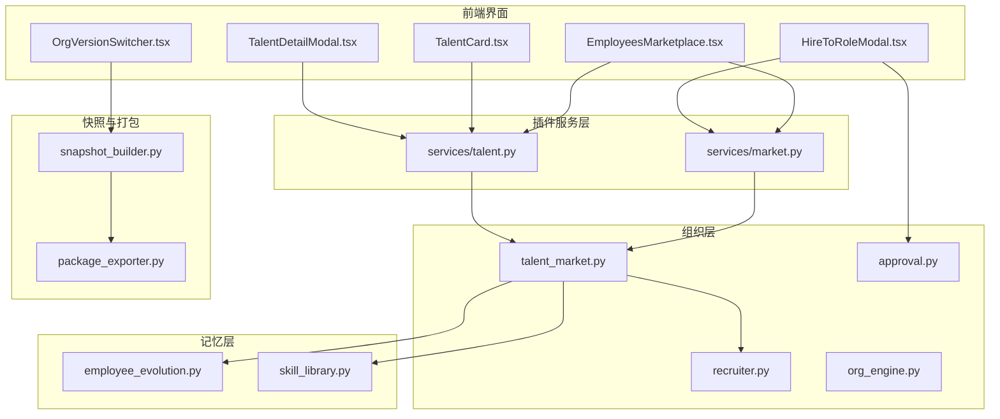
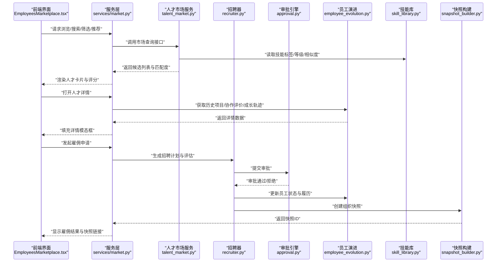
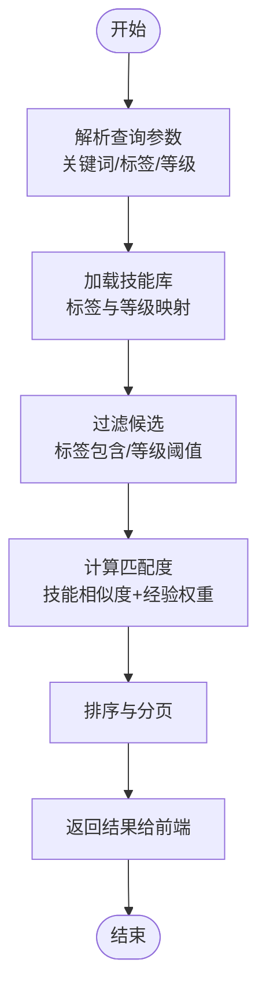
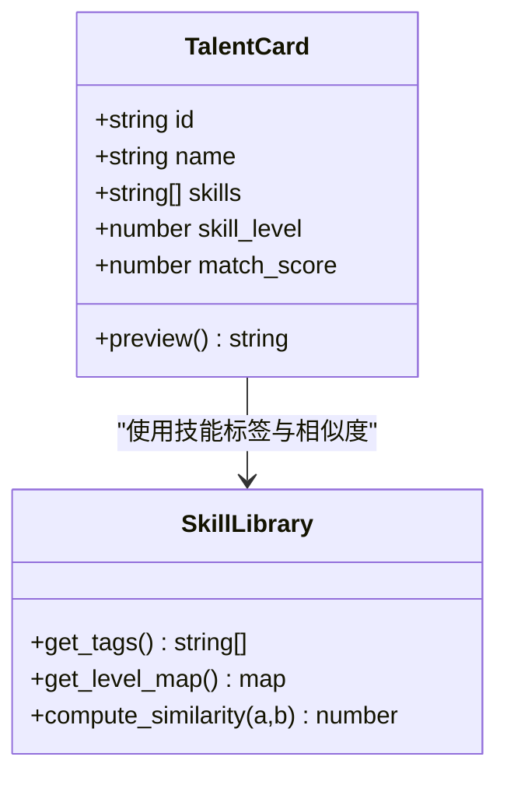
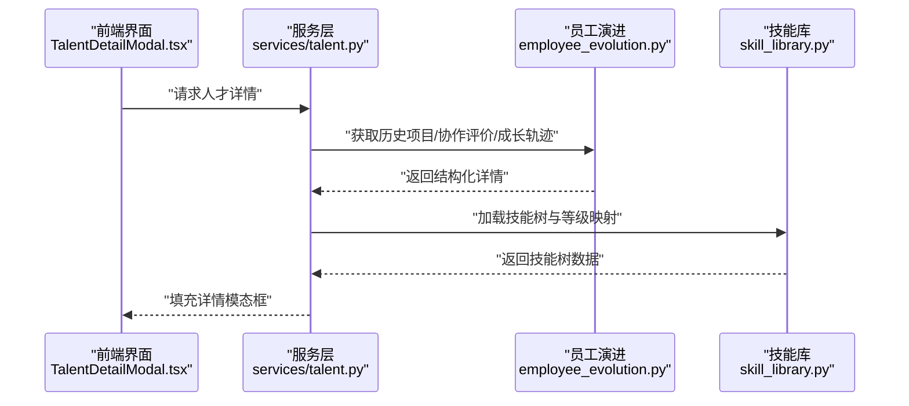
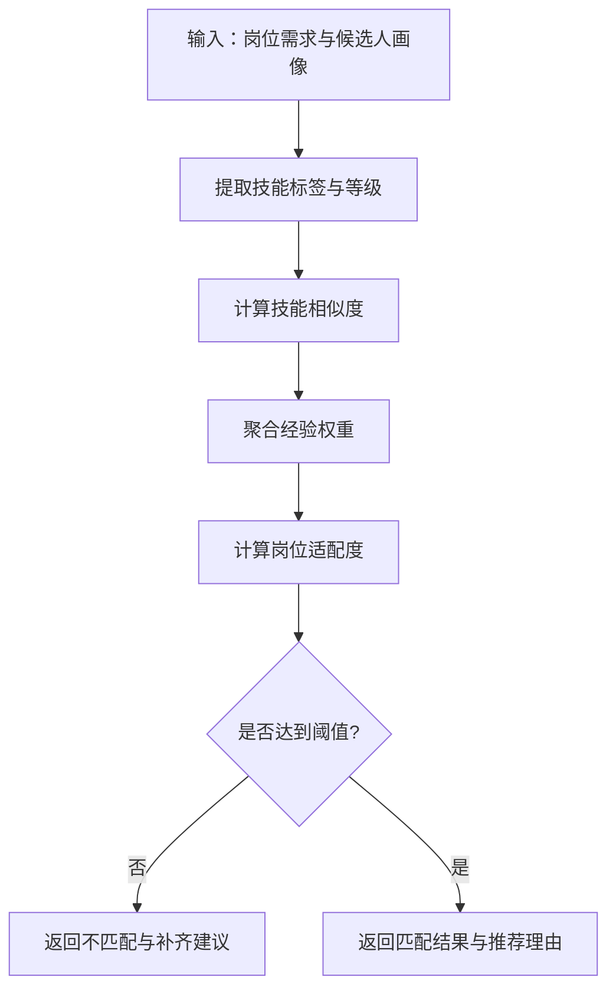
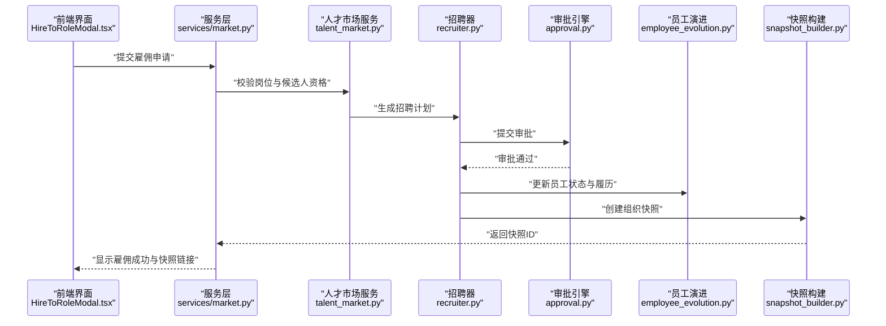
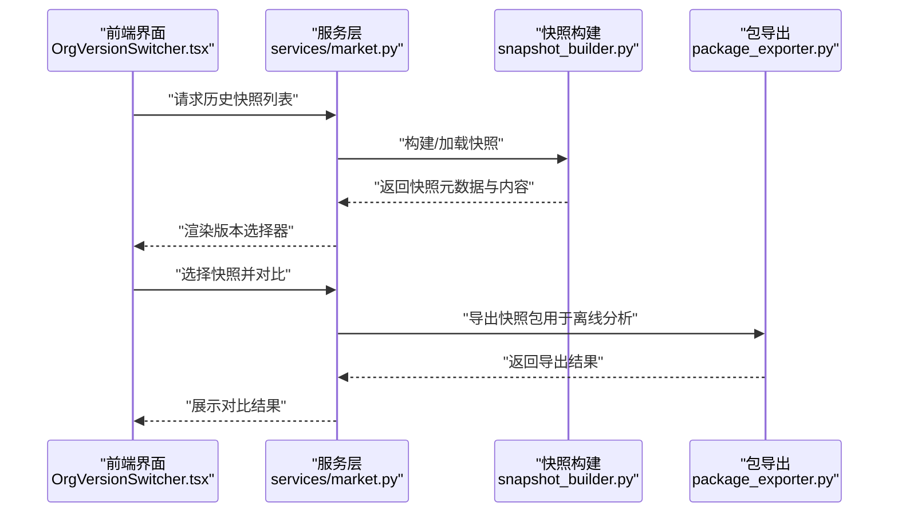
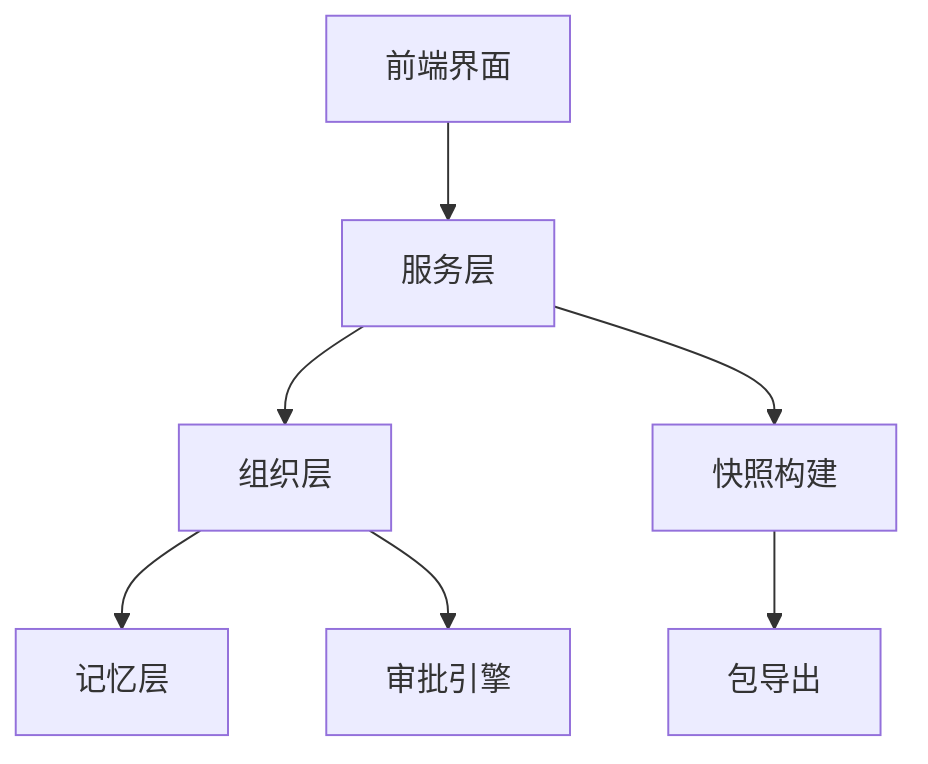

# 人才市场

<cite>
**本文引用的文件**   
- [talent_market.py](file://opc/layer2_organization/talent_market.py)
- [recruiter.py](file://opc/layer2_organization/recruiter.py)
- [org_engine.py](file://opc/layer2_organization/org_engine.py)
- [approval.py](file://opc/layer2_organization/approval.py)
- [employee_evolution.py](file://opc/layer5_memory/employee_evolution.py)
- [skill_library.py](file://opc/layer5_memory/skill_library.py)
- [market.py](file://opc/plugins/office_ui/services/market.py)
- [talent.py](file://opc/plugins/office_ui/services/talent.py)
- [EmployeesMarketplace.tsx](file://opc/plugins/office_ui/frontend_src/org/EmployeesMarketplace.tsx)
- [TalentCard.tsx](file://opc/plugins/office_ui/frontend_src/org/TalentCard.tsx)
- [TalentDetailModal.tsx](file://opc/plugins/office_ui/frontend_src/org/TalentDetailModal.tsx)
- [HireToRoleModal.tsx](file://opc/plugins/office_ui/frontend_src/org/HireToRoleModal.tsx)
- [OrgVersionSwitcher.tsx](file://opc/plugins/office_ui/frontend_src/org/OrgVersionSwitcher.tsx)
- [snapshot_builder.py](file://opc/plugins/office_ui/snapshot_builder.py)
- [package_exporter.py](file://opc/market/package_exporter.py)
- [test_talent_hire_handler.py](file://tests/test_talent_hire_handler.py)
</cite>

## 目录
1. [简介](#简介)
2. [项目结构](#项目结构)
3. [核心组件](#核心组件)
4. [架构总览](#架构总览)
5. [详细组件分析](#详细组件分析)
6. [依赖分析](#依赖分析)
7. [性能考虑](#性能考虑)
8. [故障排查指南](#故障排查指南)
9. [结论](#结论)
10. [附录](#附录)

## 简介
本章节面向OpenOPC“人才市场”功能，系统性说明其浏览与搜索、筛选与推荐、人才卡片与详情模态框、匹配算法、雇佣与解雇流程、版本控制与快照、以及导入导出与批量操作等能力。文档以代码仓库中的实际实现为依据，提供从前端到后端、从业务逻辑到数据模型的端到端解读，帮助读者快速理解并高效使用或扩展该功能。

## 项目结构
人才市场相关代码主要分布在以下层次：
- 组织层（Python）：负责人才市场核心业务、招聘与审批、员工演进与技能库等
- 记忆层（Python）：维护员工历史、能力成长轨迹与技能资产
- 插件服务层（Python）：为Office UI提供REST风格的API封装
- 前端界面（TypeScript/React）：提供人才市场页面、人才卡片、详情弹窗、雇佣流程与版本切换等交互
- 市场打包与快照（Python）：提供组织快照构建与包导出能力

图表来源
- [talent_market.py](file://opc/layer2_organization/talent_market.py)
- [recruiter.py](file://opc/layer2_organization/recruiter.py)
- [approval.py](file://opc/layer2_organization/approval.py)
- [org_engine.py](file://opc/layer2_organization/org_engine.py)
- [employee_evolution.py](file://opc/layer5_memory/employee_evolution.py)
- [skill_library.py](file://opc/layer5_memory/skill_library.py)
- [market.py](file://opc/plugins/office_ui/services/market.py)
- [talent.py](file://opc/plugins/office_ui/services/talent.py)
- [EmployeesMarketplace.tsx](file://opc/plugins/office_ui/frontend_src/org/EmployeesMarketplace.tsx)
- [TalentCard.tsx](file://opc/plugins/office_ui/frontend_src/org/TalentCard.tsx)
- [TalentDetailModal.tsx](file://opc/plugins/office_ui/frontend_src/org/TalentDetailModal.tsx)
- [HireToRoleModal.tsx](file://opc/plugins/office_ui/frontend_src/org/HireToRoleModal.tsx)
- [OrgVersionSwitcher.tsx](file://opc/plugins/office_ui/frontend_src/org/OrgVersionSwitcher.tsx)
- [snapshot_builder.py](file://opc/plugins/office_ui/snapshot_builder.py)
- [package_exporter.py](file://opc/market/package_exporter.py)

章节来源
- [talent_market.py](file://opc/layer2_organization/talent_market.py)
- [recruiter.py](file://opc/layer2_organization/recruiter.py)
- [org_engine.py](file://opc/layer2_organization/org_engine.py)
- [approval.py](file://opc/layer2_organization/approval.py)
- [employee_evolution.py](file://opc/layer5_memory/employee_evolution.py)
- [skill_library.py](file://opc/layer5_memory/skill_library.py)
- [market.py](file://opc/plugins/office_ui/services/market.py)
- [talent.py](file://opc/plugins/office_ui/services/talent.py)
- [EmployeesMarketplace.tsx](file://opc/plugins/office_ui/frontend_src/org/EmployeesMarketplace.tsx)
- [TalentCard.tsx](file://opc/plugins/office_ui/frontend_src/org/TalentCard.tsx)
- [TalentDetailModal.tsx](file://opc/plugins/office_ui/frontend_src/org/TalentDetailModal.tsx)
- [HireToRoleModal.tsx](file://opc/plugins/office_ui/frontend_src/org/HireToRoleModal.tsx)
- [OrgVersionSwitcher.tsx](file://opc/plugins/office_ui/frontend_src/org/OrgVersionSwitcher.tsx)
- [snapshot_builder.py](file://opc/plugins/office_ui/snapshot_builder.py)
- [package_exporter.py](file://opc/market/package_exporter.py)

## 核心组件
- 人才市场服务（talent_market.py）：提供人才的检索、筛选、排序与推荐接口；承载匹配度计算与岗位适配度评估；驱动招聘工作流。
- 招聘器（recruiter.py）：将市场结果转化为可执行的招聘动作，包括候选生成、面试/评估编排、录用建议。
- 审批引擎（approval.py）：对雇佣、解雇、调岗等关键变更进行审批校验与状态流转。
- 组织引擎（org_engine.py）：作为组织运行时入口，协调人才市场与角色、席位、权限等组织资源。
- 员工演进（employee_evolution.py）：记录员工的历史项目、协作评价、能力成长轨迹与版本快照。
- 技能库（skill_library.py）：维护技能标签、等级体系与相似度度量基础。
- Office UI服务（services/market.py, services/talent.py）：对外暴露浏览、搜索、详情、雇佣、解雇、快照与导入导出等API。
- 前端界面（EmployeesMarketplace.tsx, TalentCard.tsx, TalentDetailModal.tsx, HireToRoleModal.tsx, OrgVersionSwitcher.tsx）：实现浏览与搜索、筛选与推荐、人才卡片与详情展示、雇佣流程与版本切换。
- 快照与打包（snapshot_builder.py, package_exporter.py）：构建组织快照、支持历史状态查看与对比分析，并提供导出能力。

章节来源
- [talent_market.py](file://opc/layer2_organization/talent_market.py)
- [recruiter.py](file://opc/layer2_organization/recruiter.py)
- [approval.py](file://opc/layer2_organization/approval.py)
- [org_engine.py](file://opc/layer2_organization/org_engine.py)
- [employee_evolution.py](file://opc/layer5_memory/employee_evolution.py)
- [skill_library.py](file://opc/layer5_memory/skill_library.py)
- [market.py](file://opc/plugins/office_ui/services/market.py)
- [talent.py](file://opc/plugins/office_ui/services/talent.py)
- [EmployeesMarketplace.tsx](file://opc/plugins/office_ui/frontend_src/org/EmployeesMarketplace.tsx)
- [TalentCard.tsx](file://opc/plugins/office_ui/frontend_src/org/TalentCard.tsx)
- [TalentDetailModal.tsx](file://opc/plugins/office_ui/frontend_src/org/TalentDetailModal.tsx)
- [HireToRoleModal.tsx](file://opc/plugins/office_ui/frontend_src/org/HireToRoleModal.tsx)
- [OrgVersionSwitcher.tsx](file://opc/plugins/office_ui/frontend_src/org/OrgVersionSwitcher.tsx)
- [snapshot_builder.py](file://opc/plugins/office_ui/snapshot_builder.py)
- [package_exporter.py](file://opc/market/package_exporter.py)

## 架构总览
下图展示了从前端到后端再到存储与快照的完整调用链路，涵盖浏览、搜索、筛选、推荐、详情、雇佣与版本切换等关键路径。

图表来源
- [EmployeesMarketplace.tsx](file://opc/plugins/office_ui/frontend_src/org/EmployeesMarketplace.tsx)
- [market.py](file://opc/plugins/office_ui/services/market.py)
- [talent_market.py](file://opc/layer2_organization/talent_market.py)
- [recruiter.py](file://opc/layer2_organization/recruiter.py)
- [approval.py](file://opc/layer2_organization/approval.py)
- [employee_evolution.py](file://opc/layer5_memory/employee_evolution.py)
- [skill_library.py](file://opc/layer5_memory/skill_library.py)
- [snapshot_builder.py](file://opc/plugins/office_ui/snapshot_builder.py)

## 详细组件分析

### 浏览与搜索：技能标签筛选、能力等级过滤、智能推荐
- 浏览与搜索
  - 前端通过市场服务API发起查询，支持按关键词、技能标签集合、能力等级范围进行过滤，并按匹配度排序。
  - 服务层将查询参数透传到人才市场服务，后者结合技能库进行标签匹配与等级过滤。
- 智能推荐
  - 基于岗位需求与候选人画像，计算技能相似度与经验权重，输出推荐得分与理由摘要。
  - 推荐策略可配置，支持多目标优化（如技能覆盖、经验年限、协作评价）。

图表来源
- [talent_market.py](file://opc/layer2_organization/talent_market.py)
- [skill_library.py](file://opc/layer5_memory/skill_library.py)
- [market.py](file://opc/plugins/office_ui/services/market.py)
- [EmployeesMarketplace.tsx](file://opc/plugins/office_ui/frontend_src/org/EmployeesMarketplace.tsx)

章节来源
- [talent_market.py](file://opc/layer2_organization/talent_market.py)
- [skill_library.py](file://opc/layer5_memory/skill_library.py)
- [market.py](file://opc/plugins/office_ui/services/market.py)
- [EmployeesMarketplace.tsx](file://opc/plugins/office_ui/frontend_src/org/EmployeesMarketplace.tsx)

### 人才卡片：技能概览、能力评分、匹配度计算、快速预览
- 技能概览
  - 在卡片中展示核心技能标签与等级分布，便于快速识别候选人的技术栈与专长。
- 能力评分
  - 综合技能等级、历史项目贡献与协作评价，给出多维评分与总分。
- 匹配度计算
  - 基于岗位需求与候选人画像，计算技能覆盖度与经验契合度，输出百分比匹配度。
- 快速预览
  - 点击卡片可展开轻量预览，显示最近项目、关键成果与协作反馈摘要。

图表来源
- [TalentCard.tsx](file://opc/plugins/office_ui/frontend_src/org/TalentCard.tsx)
- [skill_library.py](file://opc/layer5_memory/skill_library.py)
- [talent.py](file://opc/plugins/office_ui/services/talent.py)

章节来源
- [TalentCard.tsx](file://opc/plugins/office_ui/frontend_src/org/TalentCard.tsx)
- [skill_library.py](file://opc/layer5_memory/skill_library.py)
- [talent.py](file://opc/plugins/office_ui/services/talent.py)

### 人才详情模态框：技能树、历史项目、协作评价、能力成长轨迹
- 完整技能树
  - 展示技能的层级结构与掌握程度，支持展开/折叠与路径导航。
- 历史项目记录
  - 列出参与的项目、角色、时间线与产出物摘要。
- 协作评价
  - 汇总来自同事与管理者的评价与反馈，形成可视化雷达图或评分条。
- 能力成长轨迹
  - 按时间轴展示技能提升、项目里程碑与认证记录，支持版本切换查看不同阶段的能力状态。

图表来源
- [TalentDetailModal.tsx](file://opc/plugins/office_ui/frontend_src/org/TalentDetailModal.tsx)
- [talent.py](file://opc/plugins/office_ui/services/talent.py)
- [employee_evolution.py](file://opc/layer5_memory/employee_evolution.py)
- [skill_library.py](file://opc/layer5_memory/skill_library.py)

章节来源
- [TalentDetailModal.tsx](file://opc/plugins/office_ui/frontend_src/org/TalentDetailModal.tsx)
- [talent.py](file://opc/plugins/office_ui/services/talent.py)
- [employee_evolution.py](file://opc/layer5_memory/employee_evolution.py)
- [skill_library.py](file://opc/layer5_memory/skill_library.py)

### 人才匹配算法：技能相似度、经验权重、岗位适配度
- 技能相似度
  - 基于技能标签集合与等级向量，采用加权余弦相似度或Jaccard指数衡量重叠度。
- 经验权重评估
  - 根据项目时长、角色复杂度与产出质量赋予经验权重，影响最终匹配分。
- 岗位适配度分析
  - 将岗位需求拆解为必需技能与加分技能，分别计算覆盖度与差距，输出适配度与建议补齐项。

图表来源
- [talent_market.py](file://opc/layer2_organization/talent_market.py)
- [skill_library.py](file://opc/layer5_memory/skill_library.py)
- [recruiter.py](file://opc/layer2_organization/recruiter.py)

章节来源
- [talent_market.py](file://opc/layer2_organization/talent_market.py)
- [skill_library.py](file://opc/layer5_memory/skill_library.py)
- [recruiter.py](file://opc/layer2_organization/recruiter.py)

### 雇佣与解雇流程：审批工作流、合同管理、交接程序
- 雇佣流程
  - 前端通过雇佣模态框选择岗位与合同条款，提交后进入审批工作流。
  - 审批通过后，系统更新员工状态、分配席位与权限，并生成组织快照。
- 解雇流程
  - 发起解雇申请，触发审批与交接检查，确保项目与资产交接完成后再执行解雇。
- 合同管理
  - 记录合同版本、生效时间与终止条件，支持历史版本回溯与审计。
- 交接程序
  - 自动生成交接清单，包括文档、代码、权限与待办事项，确保平稳过渡。

图表来源
- [HireToRoleModal.tsx](file://opc/plugins/office_ui/frontend_src/org/HireToRoleModal.tsx)
- [market.py](file://opc/plugins/office_ui/services/market.py)
- [talent_market.py](file://opc/layer2_organization/talent_market.py)
- [recruiter.py](file://opc/layer2_organization/recruiter.py)
- [approval.py](file://opc/layer2_organization/approval.py)
- [employee_evolution.py](file://opc/layer5_memory/employee_evolution.py)
- [snapshot_builder.py](file://opc/plugins/office_ui/snapshot_builder.py)

章节来源
- [HireToRoleModal.tsx](file://opc/plugins/office_ui/frontend_src/org/HireToRoleModal.tsx)
- [market.py](file://opc/plugins/office_ui/services/market.py)
- [talent_market.py](file://opc/layer2_organization/talent_market.py)
- [recruiter.py](file://opc/layer2_organization/recruiter.py)
- [approval.py](file://opc/layer2_organization/approval.py)
- [employee_evolution.py](file://opc/layer5_memory/employee_evolution.py)
- [snapshot_builder.py](file://opc/plugins/office_ui/snapshot_builder.py)

### 版本控制与快照：历史状态查看与对比分析
- 版本切换
  - 前端提供组织版本切换器，允许用户在不同快照间切换，查看历史组织状态。
- 快照构建
  - 后端在关键事件（雇佣、解雇、调岗）时自动生成快照，记录组织结构与人员状态。
- 对比分析
  - 支持两个快照之间的差异对比，突出新增/移除的人员、变更的岗位与权限。

图表来源
- [OrgVersionSwitcher.tsx](file://opc/plugins/office_ui/frontend_src/org/OrgVersionSwitcher.tsx)
- [snapshot_builder.py](file://opc/plugins/office_ui/snapshot_builder.py)
- [package_exporter.py](file://opc/market/package_exporter.py)
- [market.py](file://opc/plugins/office_ui/services/market.py)

章节来源
- [OrgVersionSwitcher.tsx](file://opc/plugins/office_ui/frontend_src/org/OrgVersionSwitcher.tsx)
- [snapshot_builder.py](file://opc/plugins/office_ui/snapshot_builder.py)
- [package_exporter.py](file://opc/market/package_exporter.py)
- [market.py](file://opc/plugins/office_ui/services/market.py)

### 导入导出与批量操作
- 导入
  - 支持批量导入人才档案与技能信息，校验必填字段与格式，失败项提供错误明细。
- 导出
  - 支持导出当前组织的人才数据与快照包，便于归档与迁移。
- 批量操作
  - 支持批量调整岗位、批量更新技能等级、批量发送通知与邀请。

章节来源
- [market.py](file://opc/plugins/office_ui/services/market.py)
- [talent.py](file://opc/plugins/office_ui/services/talent.py)
- [package_exporter.py](file://opc/market/package_exporter.py)

## 依赖分析
- 组件耦合
  - 前端界面依赖服务层API，服务层依赖组织层与记忆层；审批引擎贯穿雇佣与解雇流程。
- 外部依赖
  - 快照构建与包导出依赖底层存储与文件系统；技能库提供相似度计算基础。
- 潜在循环依赖
  - 组织引擎与市场服务之间保持单向依赖，避免循环引用。

图表来源
- [org_engine.py](file://opc/layer2_organization/org_engine.py)
- [market.py](file://opc/plugins/office_ui/services/market.py)
- [talent.py](file://opc/plugins/office_ui/services/talent.py)
- [approval.py](file://opc/layer2_organization/approval.py)
- [snapshot_builder.py](file://opc/plugins/office_ui/snapshot_builder.py)
- [package_exporter.py](file://opc/market/package_exporter.py)

章节来源
- [org_engine.py](file://opc/layer2_organization/org_engine.py)
- [market.py](file://opc/plugins/office_ui/services/market.py)
- [talent.py](file://opc/plugins/office_ui/services/talent.py)
- [approval.py](file://opc/layer2_organization/approval.py)
- [snapshot_builder.py](file://opc/plugins/office_ui/snapshot_builder.py)
- [package_exporter.py](file://opc/market/package_exporter.py)

## 性能考虑
- 缓存策略
  - 对热门技能标签与常用匹配规则进行缓存，减少重复计算开销。
- 分页与懒加载
  - 前端对人才列表采用分页与懒加载，详情模态框按需加载历史项目与评价。
- 异步处理
  - 雇佣与解雇等长耗时操作采用异步任务与进度回调，提升用户体验。
- 索引优化
  - 对技能标签与等级建立索引，加速筛选与排序。

[本节为通用性能指导，无需特定文件来源]

## 故障排查指南
- 常见问题
  - 审批失败：检查审批规则与权限配置，确认合同条款与岗位配额。
  - 快照不一致：核对快照构建时机与数据一致性，必要时重新构建快照。
  - 导入失败：校验文件格式与必填字段，查看错误明细并修正。
- 调试工具
  - 使用测试用例验证雇佣处理流程与快照构建逻辑。
  - 通过日志与监控定位服务层与组织层的异常点。

章节来源
- [test_talent_hire_handler.py](file://tests/test_talent_hire_handler.py)

## 结论
OpenOPC人才市场以清晰的职责分层与完善的API封装，实现了从浏览搜索、筛选推荐到雇佣解雇的全链路能力。配合快照与导出机制，提供了强大的版本控制与数据分析支撑。建议在后续迭代中持续优化匹配算法的可解释性与性能，完善批量操作的幂等性与回滚机制，进一步提升系统的稳定性与易用性。

[本节为总结性内容，无需特定文件来源]

## 附录
- 术语表
  - 匹配度：候选人满足岗位需求的综合评分
  - 快照：组织在某时刻的结构与状态副本
  - 审批工作流：对关键变更进行校验与批准的流程
- 参考实现路径
  - 浏览与搜索：[talent_market.py](file://opc/layer2_organization/talent_market.py)、[market.py](file://opc/plugins/office_ui/services/market.py)
  - 详情与演进：[talent.py](file://opc/plugins/office_ui/services/talent.py)、[employee_evolution.py](file://opc/layer5_memory/employee_evolution.py)
  - 雇佣与审批：[recruiter.py](file://opc/layer2_organization/recruiter.py)、[approval.py](file://opc/layer2_organization/approval.py)
  - 快照与导出：[snapshot_builder.py](file://opc/plugins/office_ui/snapshot_builder.py)、[package_exporter.py](file://opc/market/package_exporter.py)