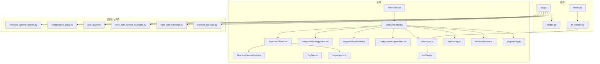
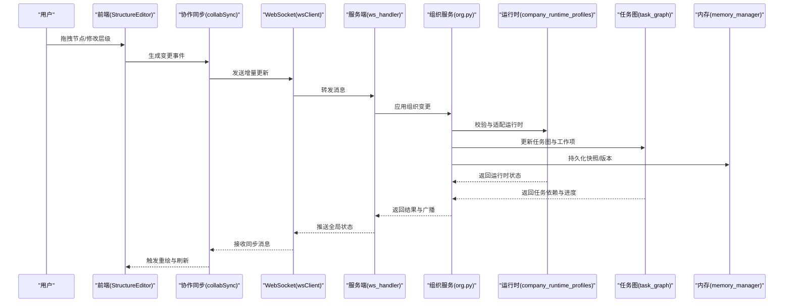
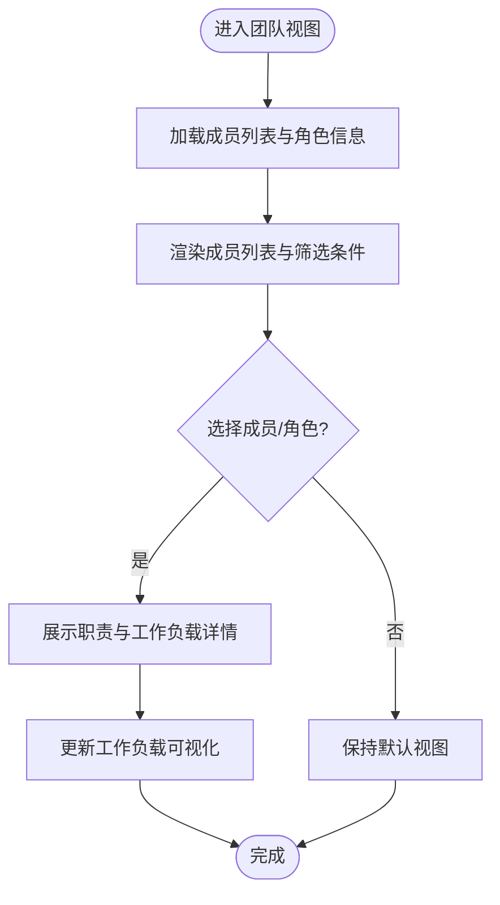
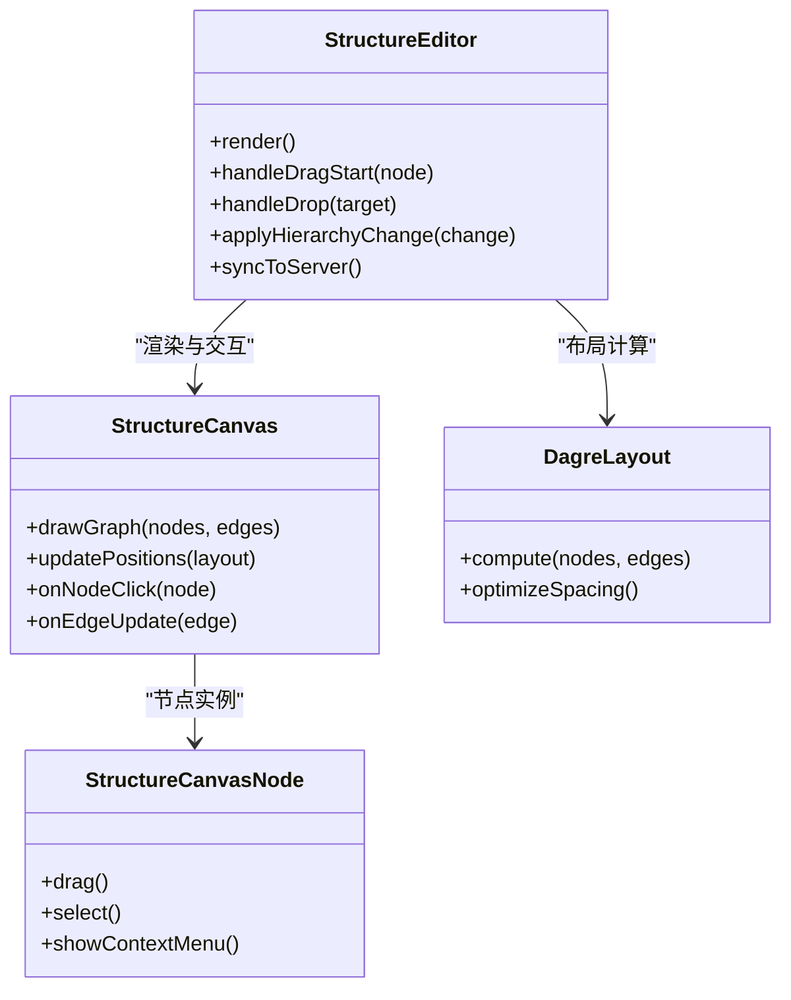
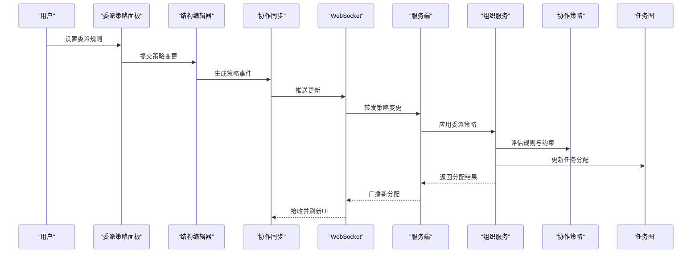
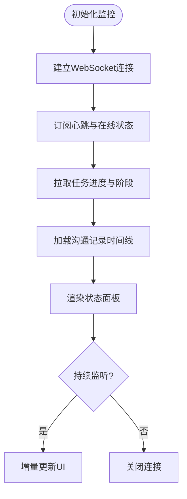
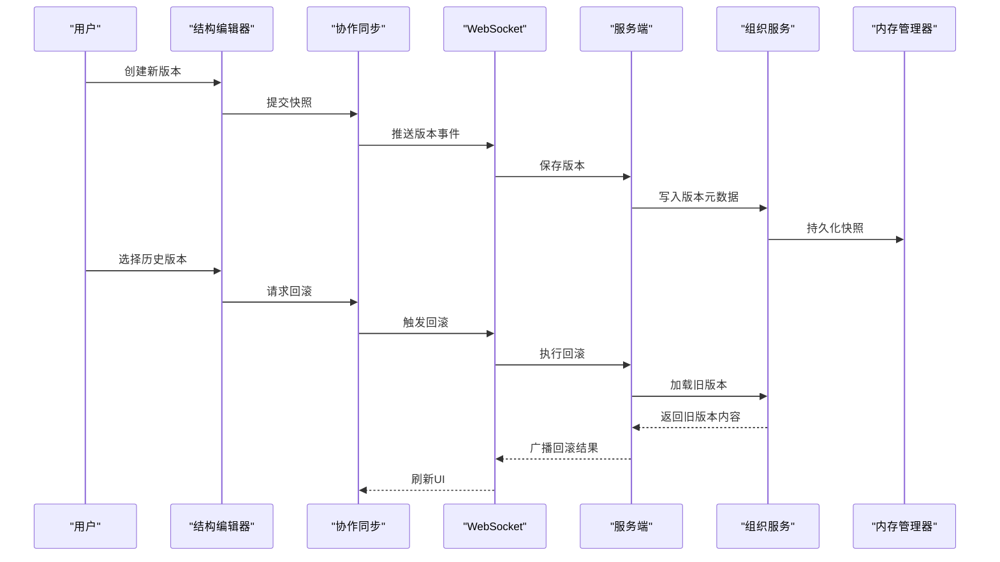
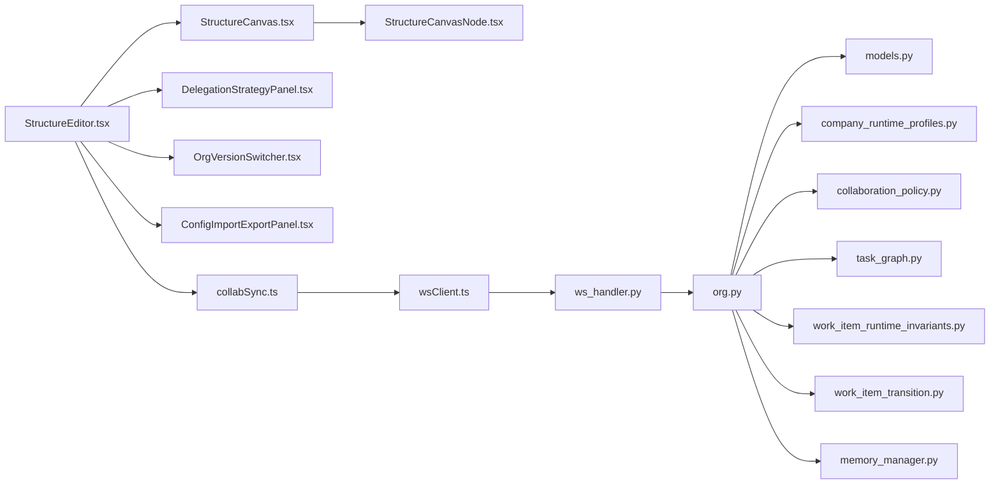

# 团队视图

<cite>
**本文引用的文件**   
- [TeamView.tsx](file://opc/plugins/office_ui/frontend_src/org/TeamView.tsx)
- [StructureEditor.tsx](file://opc/plugins/office_ui/frontend_src/org/StructureEditor.tsx)
- [StructureCanvas.tsx](file://opc/plugins/office_ui/frontend_src/org/StructureCanvas.tsx)
- [StructureCanvasNode.tsx](file://opc/plugins/office_ui/frontend_src/org/StructureCanvasNode.tsx)
- [DelegationStrategyPanel.tsx](file://opc/plugins/office_ui/frontend_src/org/DelegationStrategyPanel.tsx)
- [OrgTab.tsx](file://opc/plugins/office_ui/frontend_src/org/OrgTab.tsx)
- [OrgVersionSwitcher.tsx](file://opc/plugins/office_ui/frontend_src/org/OrgVersionSwitcher.tsx)
- [ConfigImportExportPanel.tsx](file://opc/plugins/office_ui/frontend_src/org/ConfigImportExportPanel.tsx)
- [dagreLayout.ts](file://opc/plugins/office_ui/frontend_src/org/dagreLayout.ts)
- [org.css](file://opc/plugins/office_ui/frontend_src/org/org.css)
- [structure.css](file://opc/plugins/office_ui/frontend_src/org/structure.css)
- [team.css](file://opc/plugins/office_ui/frontend_src/org/team.css)
- [collabSync.ts](file://opc/plugins/office_ui/frontend_src/org/lib/collabSync.ts)
- [wsClient.ts](file://opc/plugins/office_ui/frontend_src/org/lib/wsClient.ts)
- [runtimeOrg.ts](file://opc/plugins/office_ui/frontend_src/org/lib/runtimeOrg.ts)
- [sessionRuntime.ts](file://opc/plugins/office_ui/frontend_src/org/lib/sessionRuntime.ts)
- [progressLog.ts](file://opc/plugins/office_ui/frontend_src/org/lib/progressLog.ts)
- [roleWorkItems.test.ts](file://opc/plugins/office_ui/frontend_src/org/lib/roleWorkItems.test.ts)
- [workItemIdentity.ts](file://opc/plugins/office_ui/frontend_src/org/lib/workItemIdentity.ts)
- [turnIdentity.ts](file://opc/plugins/office_ui/frontend_src/org/lib/turnIdentity.ts)
- [messageTimelineIdentity.ts](file://opc/plugins/office_ui/frontend_src/org/lib/messageTimelineIdentity.ts)
- [org.py](file://opc/plugins/office_ui/services/org.py)
- [models.py](file://opc/plugins/office_ui/services/models.py)
- [server.py](file://opc/plugins/office_ui/server.py)
- [ws_handler.py](file://opc/plugins/office_ui/ws_handler.py)
- [company_runtime_profiles.py](file://opc/core/layer2_organization/company_runtime_profiles.py)
- [collaboration_policy.py](file://opc/core/layer2_organization/collaboration_policy.py)
- [task_graph.py](file://opc/core/layer2_organization/task_graph.py)
- [work_item_runtime_invariants.py](file://opc/core/layer2_organization/work_item_runtime_invariants.py)
- [work_item_transition.py](file://opc/core/layer2_organization/work_item_transition.py)
- [memory_manager.py](file://opc/core/layer5_memory/memory_manager.py)
</cite>

## 目录
1. [简介](#简介)
2. [项目结构](#项目结构)
3. [核心组件](#核心组件)
4. [架构总览](#架构总览)
5. [详细组件分析](#详细组件分析)
6. [依赖关系分析](#依赖关系分析)
7. [性能考量](#性能考量)
8. [故障排查指南](#故障排查指南)
9. [结论](#结论)
10. [附录](#附录)

## 简介
本章节面向OpenOPC的“团队视图”功能，提供从前端到后端、从交互到数据同步的全链路说明。团队视图围绕以下目标展开：
- 可视化展示团队结构与成员职责，支持拖拽调整与层级修改
- 提供委派策略面板，配置任务委派规则、自动分配算法与人工干预入口
- 实时监控团队协作状态（在线状态、任务进度、沟通记录）
- 团队配置的版本管理（变更历史、回滚、协作编辑）
- 团队性能指标分析与优化建议
- 团队配置的导入导出与模板共享

## 项目结构
团队视图由前端React组件、样式、布局算法、实时通信库以及后端服务共同组成。关键路径如下：
- 前端组织视图与编辑器：org目录下的TSX组件与CSS
- 实时协作与WebSocket：lib目录下的客户端库
- 后端服务与模型：services目录下的Python模块
- 运行时与持久化：core层中的组织与任务运行相关模块

图表来源
- [TeamView.tsx](file://opc/plugins/office_ui/frontend_src/org/TeamView.tsx)
- [StructureEditor.tsx](file://opc/plugins/office_ui/frontend_src/org/StructureEditor.tsx)
- [StructureCanvas.tsx](file://opc/plugins/office_ui/frontend_src/org/StructureCanvas.tsx)
- [StructureCanvasNode.tsx](file://opc/plugins/office_ui/frontend_src/org/StructureCanvasNode.tsx)
- [DelegationStrategyPanel.tsx](file://opc/plugins/office_ui/frontend_src/org/DelegationStrategyPanel.tsx)
- [OrgTab.tsx](file://opc/plugins/office_ui/frontend_src/org/OrgTab.tsx)
- [OrgVersionSwitcher.tsx](file://opc/plugins/office_ui/frontend_src/org/OrgVersionSwitcher.tsx)
- [ConfigImportExportPanel.tsx](file://opc/plugins/office_ui/frontend_src/org/ConfigImportExportPanel.tsx)
- [dagreLayout.ts](file://opc/plugins/office_ui/frontend_src/org/dagreLayout.ts)
- [collabSync.ts](file://opc/plugins/office_ui/frontend_src/org/lib/collabSync.ts)
- [wsClient.ts](file://opc/plugins/office_ui/frontend_src/org/lib/wsClient.ts)
- [runtimeOrg.ts](file://opc/plugins/office_ui/frontend_src/org/lib/runtimeOrg.ts)
- [sessionRuntime.ts](file://opc/plugins/office_ui/frontend_src/org/lib/sessionRuntime.ts)
- [progressLog.ts](file://opc/plugins/office_ui/frontend_src/org/lib/progressLog.ts)
- [org.py](file://opc/plugins/office_ui/services/org.py)
- [models.py](file://opc/plugins/office_ui/services/models.py)
- [server.py](file://opc/plugins/office_ui/server.py)
- [ws_handler.py](file://opc/plugins/office_ui/ws_handler.py)
- [company_runtime_profiles.py](file://opc/core/layer2_organization/company_runtime_profiles.py)
- [collaboration_policy.py](file://opc/core/layer2_organization/collaboration_policy.py)
- [task_graph.py](file://opc/core/layer2_organization/task_graph.py)
- [work_item_runtime_invariants.py](file://opc/core/layer2_organization/work_item_runtime_invariants.py)
- [work_item_transition.py](file://opc/core/layer2_organization/work_item_transition.py)
- [memory_manager.py](file://opc/core/layer5_memory/memory_manager.py)

章节来源
- [TeamView.tsx](file://opc/plugins/office_ui/frontend_src/org/TeamView.tsx)
- [StructureEditor.tsx](file://opc/plugins/office_ui/frontend_src/org/StructureEditor.tsx)
- [StructureCanvas.tsx](file://opc/plugins/office_ui/frontend_src/org/StructureCanvas.tsx)
- [StructureCanvasNode.tsx](file://opc/plugins/office_ui/frontend_src/org/StructureCanvasNode.tsx)
- [DelegationStrategyPanel.tsx](file://opc/plugins/office_ui/frontend_src/org/DelegationStrategyPanel.tsx)
- [OrgTab.tsx](file://opc/plugins/office_ui/frontend_src/org/OrgTab.tsx)
- [OrgVersionSwitcher.tsx](file://opc/plugins/office_ui/frontend_src/org/OrgVersionSwitcher.tsx)
- [ConfigImportExportPanel.tsx](file://opc/plugins/office_ui/frontend_src/org/ConfigImportExportPanel.tsx)
- [dagreLayout.ts](file://opc/plugins/office_ui/frontend_src/org/dagreLayout.ts)
- [org.css](file://opc/plugins/office_ui/frontend_src/org/org.css)
- [structure.css](file://opc/plugins/office_ui/frontend_src/org/structure.css)
- [team.css](file://opc/plugins/office_ui/frontend_src/org/team.css)

## 核心组件
本节聚焦团队视图的关键前端组件及其职责：
- TeamView：作为组织视图的入口容器，聚合结构编辑器、委派策略面板、版本切换器与导入导出面板
- StructureEditor：负责团队结构的整体编辑流程，协调画布、节点、布局与同步
- StructureCanvas：基于Dagre的有向无环图渲染，承载节点与边的绘制与交互
- StructureCanvasNode：单个角色/成员的节点表示，支持拖拽、选择与上下文操作
- DelegationStrategyPanel：委派策略的配置界面，包含规则设置、自动分配与人工干预入口
- OrgVersionSwitcher：版本切换器，用于查看与回滚团队配置的历史版本
- ConfigImportExportPanel：导入导出面板，支持团队配置的序列化与模板共享

章节来源
- [TeamView.tsx](file://opc/plugins/office_ui/frontend_src/org/TeamView.tsx)
- [StructureEditor.tsx](file://opc/plugins/office_ui/frontend_src/org/StructureEditor.tsx)
- [StructureCanvas.tsx](file://opc/plugins/office_ui/frontend_src/org/StructureCanvas.tsx)
- [StructureCanvasNode.tsx](file://opc/plugins/office_ui/frontend_src/org/StructureCanvasNode.tsx)
- [DelegationStrategyPanel.tsx](file://opc/plugins/office_ui/frontend_src/org/DelegationStrategyPanel.tsx)
- [OrgVersionSwitcher.tsx](file://opc/plugins/office_ui/frontend_src/org/OrgVersionSwitcher.tsx)
- [ConfigImportExportPanel.tsx](file://opc/plugins/office_ui/frontend_src/org/ConfigImportExportPanel.tsx)

## 架构总览
团队视图采用前后端分离架构，前端通过WebSocket与服务端进行实时同步；后端将组织配置映射到公司运行时与任务图，并维护工作项生命周期与权限约束。

图表来源
- [StructureEditor.tsx](file://opc/plugins/office_ui/frontend_src/org/StructureEditor.tsx)
- [collabSync.ts](file://opc/plugins/office_ui/frontend_src/org/lib/collabSync.ts)
- [wsClient.ts](file://opc/plugins/office_ui/frontend_src/org/lib/wsClient.ts)
- [ws_handler.py](file://opc/plugins/office_ui/ws_handler.py)
- [org.py](file://opc/plugins/office_ui/services/org.py)
- [company_runtime_profiles.py](file://opc/core/layer2_organization/company_runtime_profiles.py)
- [task_graph.py](file://opc/core/layer2_organization/task_graph.py)
- [memory_manager.py](file://opc/core/layer5_memory/memory_manager.py)

## 详细组件分析

### 团队视图布局与成员列表
- 整体布局：左侧为团队成员列表与筛选区，中部为结构画布，右侧为委派策略与详情面板
- 成员列表：按角色分组显示，支持搜索、排序与批量操作
- 职责分配：每个节点展示当前职责范围、关联工作项数量与负载指标
- 工作负载展示：以颜色深浅或数值标签呈现，便于识别瓶颈

章节来源
- [TeamView.tsx](file://opc/plugins/office_ui/frontend_src/org/TeamView.tsx)
- [team.css](file://opc/plugins/office_ui/frontend_src/org/team.css)
- [org.css](file://opc/plugins/office_ui/frontend_src/org/org.css)

### 结构编辑器：拖拽、层级与实时同步
- 拖拽调整：在画布中拖拽节点改变父子关系，自动校验无环约束
- 层级修改：支持提升、降级与移动至同级，实时更新边连接
- 实时同步：通过collabSync与wsClient将变更推送到服务端，其他客户端收到后重绘
- 布局算法：使用dagreLayout计算节点位置，避免重叠并保持可读性

图表来源
- [StructureEditor.tsx](file://opc/plugins/office_ui/frontend_src/org/StructureEditor.tsx)
- [StructureCanvas.tsx](file://opc/plugins/office_ui/frontend_src/org/StructureCanvas.tsx)
- [StructureCanvasNode.tsx](file://opc/plugins/office_ui/frontend_src/org/StructureCanvasNode.tsx)
- [dagreLayout.ts](file://opc/plugins/office_ui/frontend_src/org/dagreLayout.ts)

章节来源
- [StructureEditor.tsx](file://opc/plugins/office_ui/frontend_src/org/StructureEditor.tsx)
- [StructureCanvas.tsx](file://opc/plugins/office_ui/frontend_src/org/StructureCanvas.tsx)
- [StructureCanvasNode.tsx](file://opc/plugins/office_ui/frontend_src/org/StructureCanvasNode.tsx)
- [dagreLayout.ts](file://opc/plugins/office_ui/frontend_src/org/dagreLayout.ts)
- [structure.css](file://opc/plugins/office_ui/frontend_src/org/structure.css)

### 委派策略面板：规则、自动分配与人工干预
- 任务委派规则：定义角色到任务的匹配条件、优先级与约束
- 自动分配算法：根据技能、负载与历史表现进行智能匹配
- 人工干预接口：允许管理员手动指派或覆盖自动结果，并记录审计日志

图表来源
- [DelegationStrategyPanel.tsx](file://opc/plugins/office_ui/frontend_src/org/DelegationStrategyPanel.tsx)
- [StructureEditor.tsx](file://opc/plugins/office_ui/frontend_src/org/StructureEditor.tsx)
- [collabSync.ts](file://opc/plugins/office_ui/frontend_src/org/lib/collabSync.ts)
- [wsClient.ts](file://opc/plugins/office_ui/frontend_src/org/lib/wsClient.ts)
- [ws_handler.py](file://opc/plugins/office_ui/ws_handler.py)
- [org.py](file://opc/plugins/office_ui/services/org.py)
- [collaboration_policy.py](file://opc/core/layer2_organization/collaboration_policy.py)
- [task_graph.py](file://opc/core/layer2_organization/task_graph.py)

章节来源
- [DelegationStrategyPanel.tsx](file://opc/plugins/office_ui/frontend_src/org/DelegationStrategyPanel.tsx)
- [collaboration_policy.py](file://opc/core/layer2_organization/collaboration_policy.py)

### 团队协作状态监控：在线、进度与沟通
- 在线状态：通过心跳与WebSocket连接状态判断成员是否活跃
- 任务进度跟踪：读取工作项阶段与里程碑，结合进度日志进行可视化
- 沟通记录查看：按时间线展示会话消息，支持过滤与检索

章节来源
- [wsClient.ts](file://opc/plugins/office_ui/frontend_src/org/lib/wsClient.ts)
- [progressLog.ts](file://opc/plugins/office_ui/frontend_src/org/lib/progressLog.ts)
- [sessionRuntime.ts](file://opc/plugins/office_ui/frontend_src/org/lib/sessionRuntime.ts)
- [messageTimelineIdentity.ts](file://opc/plugins/office_ui/frontend_src/org/lib/messageTimelineIdentity.ts)

### 团队配置版本管理：历史、回滚与协作编辑
- 变更历史：每次组织配置变更都会生成版本快照，支持对比与回溯
- 回滚功能：一键恢复到指定版本，确保稳定性与可恢复性
- 协作编辑：多用户同时编辑时，通过冲突检测与合并策略保证一致性

图表来源
- [OrgVersionSwitcher.tsx](file://opc/plugins/office_ui/frontend_src/org/OrgVersionSwitcher.tsx)
- [collabSync.ts](file://opc/plugins/office_ui/frontend_src/org/lib/collabSync.ts)
- [wsClient.ts](file://opc/plugins/office_ui/frontend_src/org/lib/wsClient.ts)
- [ws_handler.py](file://opc/plugins/office_ui/ws_handler.py)
- [org.py](file://opc/plugins/office_ui/services/org.py)
- [memory_manager.py](file://opc/core/layer5_memory/memory_manager.py)

章节来源
- [OrgVersionSwitcher.tsx](file://opc/plugins/office_ui/frontend_src/org/OrgVersionSwitcher.tsx)
- [memory_manager.py](file://opc/core/layer5_memory/memory_manager.py)

### 团队性能指标：效率、瓶颈与建议
- 工作效率统计：基于任务完成量、周期时长与资源利用率计算
- 瓶颈识别：通过任务图依赖与负载分布定位阻塞点
- 优化建议：自动生成结构调整与人员调配建议

章节来源
- [task_graph.py](file://opc/core/layer2_organization/task_graph.py)
- [roleWorkItems.test.ts](file://opc/plugins/office_ui/frontend_src/org/lib/roleWorkItems.test.ts)

### 导入导出与模板共享
- 导入导出：支持团队配置的JSON/YAML序列化与反序列化
- 模板共享：将常用结构保存为模板，供其他团队复用
- 校验机制：导入前进行结构完整性与兼容性检查

章节来源
- [ConfigImportExportPanel.tsx](file://opc/plugins/office_ui/frontend_src/org/ConfigImportExportPanel.tsx)
- [models.py](file://opc/plugins/office_ui/services/models.py)

## 依赖关系分析
团队视图的前端组件与后端服务之间存在清晰的依赖链，确保数据一致性与实时性。

图表来源
- [StructureEditor.tsx](file://opc/plugins/office_ui/frontend_src/org/StructureEditor.tsx)
- [StructureCanvas.tsx](file://opc/plugins/office_ui/frontend_src/org/StructureCanvas.tsx)
- [StructureCanvasNode.tsx](file://opc/plugins/office_ui/frontend_src/org/StructureCanvasNode.tsx)
- [DelegationStrategyPanel.tsx](file://opc/plugins/office_ui/frontend_src/org/DelegationStrategyPanel.tsx)
- [OrgVersionSwitcher.tsx](file://opc/plugins/office_ui/frontend_src/org/OrgVersionSwitcher.tsx)
- [ConfigImportExportPanel.tsx](file://opc/plugins/office_ui/frontend_src/org/ConfigImportExportPanel.tsx)
- [collabSync.ts](file://opc/plugins/office_ui/frontend_src/org/lib/collabSync.ts)
- [wsClient.ts](file://opc/plugins/office_ui/frontend_src/org/lib/wsClient.ts)
- [ws_handler.py](file://opc/plugins/office_ui/ws_handler.py)
- [org.py](file://opc/plugins/office_ui/services/org.py)
- [models.py](file://opc/plugins/office_ui/services/models.py)
- [company_runtime_profiles.py](file://opc/core/layer2_organization/company_runtime_profiles.py)
- [collaboration_policy.py](file://opc/core/layer2_organization/collaboration_policy.py)
- [task_graph.py](file://opc/core/layer2_organization/task_graph.py)
- [work_item_runtime_invariants.py](file://opc/core/layer2_organization/work_item_runtime_invariants.py)
- [work_item_transition.py](file://opc/core/layer2_organization/work_item_transition.py)
- [memory_manager.py](file://opc/core/layer5_memory/memory_manager.py)

章节来源
- [org.py](file://opc/plugins/office_ui/services/org.py)
- [models.py](file://opc/plugins/office_ui/services/models.py)
- [server.py](file://opc/plugins/office_ui/server.py)
- [ws_handler.py](file://opc/plugins/office_ui/ws_handler.py)

## 性能考量
- 布局计算复杂度：Dagre布局在大规模图中可能产生较高CPU开销，建议分页渲染与增量更新
- WebSocket消息节流：对高频变更进行合并与去抖，减少网络压力
- 前端渲染优化：虚拟滚动与懒加载，避免大列表卡顿
- 后端并发控制：组织变更需加锁或CAS，防止竞态条件

[本节为通用指导，不直接分析具体文件]

## 故障排查指南
- 连接问题：检查WebSocket连接状态与心跳响应，确认wsClient是否正常重连
- 同步异常：查看collabSync的事件队列与冲突解决逻辑，必要时重置本地状态
- 版本回滚失败：验证memory_manager的快照完整性与org服务的权限校验
- 委派策略错误：核对collaboration_policy的规则语法与约束条件

章节来源
- [wsClient.ts](file://opc/plugins/office_ui/frontend_src/org/lib/wsClient.ts)
- [collabSync.ts](file://opc/plugins/office_ui/frontend_src/org/lib/collabSync.ts)
- [memory_manager.py](file://opc/core/layer5_memory/memory_manager.py)
- [collaboration_policy.py](file://opc/core/layer2_organization/collaboration_policy.py)

## 结论
团队视图通过可视化的结构编辑器、灵活的委派策略与强大的版本管理能力，为OpenOPC提供了高效的团队协作体验。结合实时同步与性能监控，系统能够在复杂组织中保持高可用与可扩展性。

[本节为总结性内容，不直接分析具体文件]

## 附录
- 样式文件：org.css、structure.css、team.css定义了组件的视觉风格与布局
- 身份标识：workItemIdentity.ts、turnIdentity.ts、messageTimelineIdentity.ts用于唯一标识工作项、回合与消息时间线

章节来源
- [org.css](file://opc/plugins/office_ui/frontend_src/org/org.css)
- [structure.css](file://opc/plugins/office_ui/frontend_src/org/structure.css)
- [team.css](file://opc/plugins/office_ui/frontend_src/org/team.css)
- [workItemIdentity.ts](file://opc/plugins/office_ui/frontend_src/org/lib/workItemIdentity.ts)
- [turnIdentity.ts](file://opc/plugins/office_ui/frontend_src/org/lib/turnIdentity.ts)
- [messageTimelineIdentity.ts](file://opc/plugins/office_ui/frontend_src/org/lib/messageTimelineIdentity.ts)