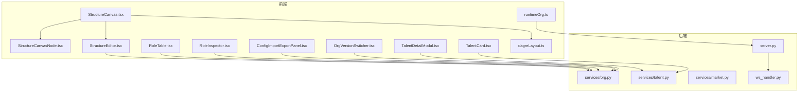
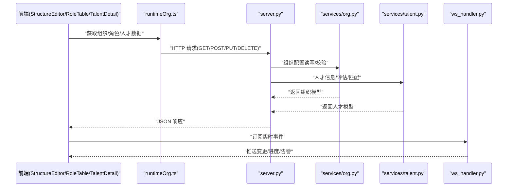
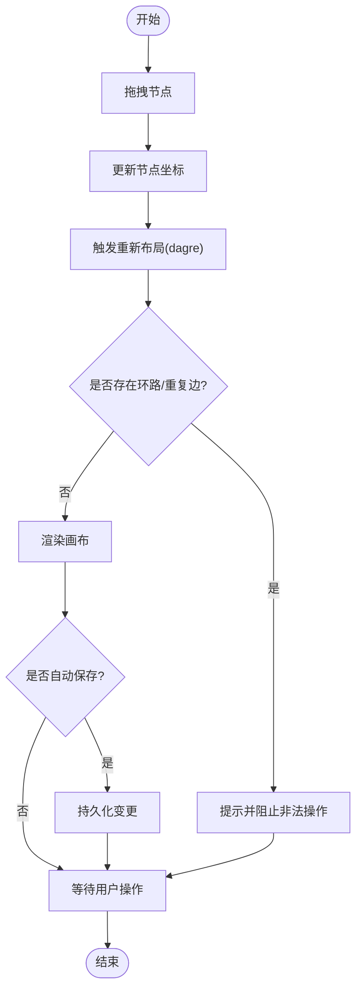
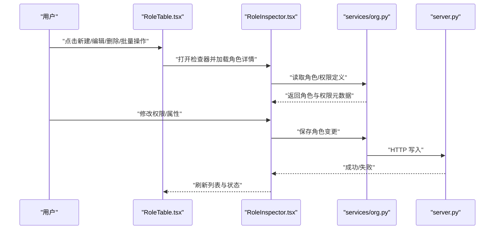
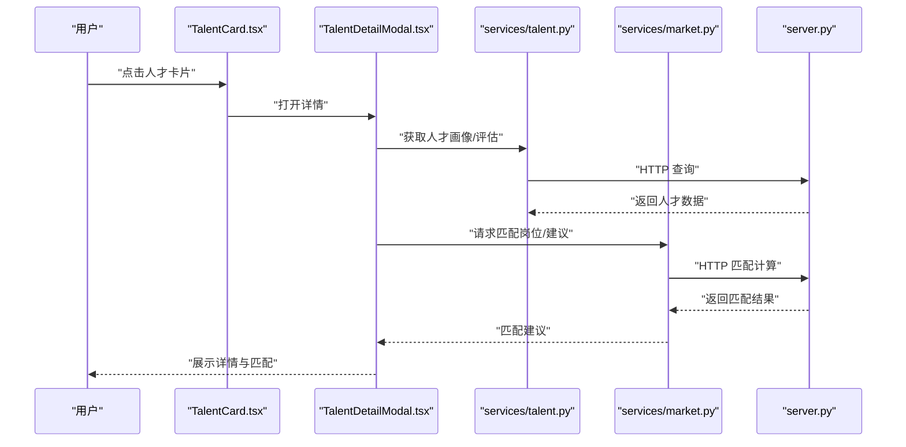
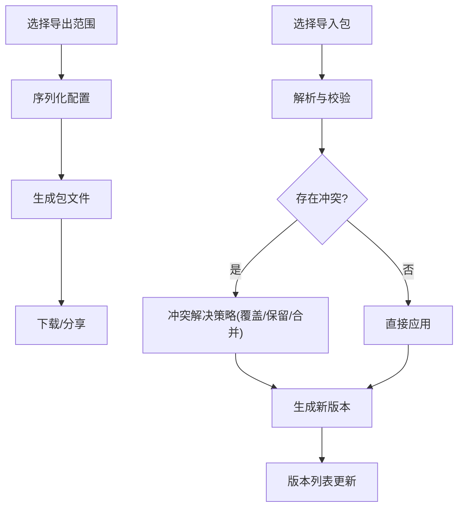
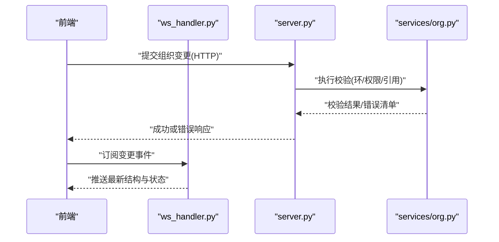
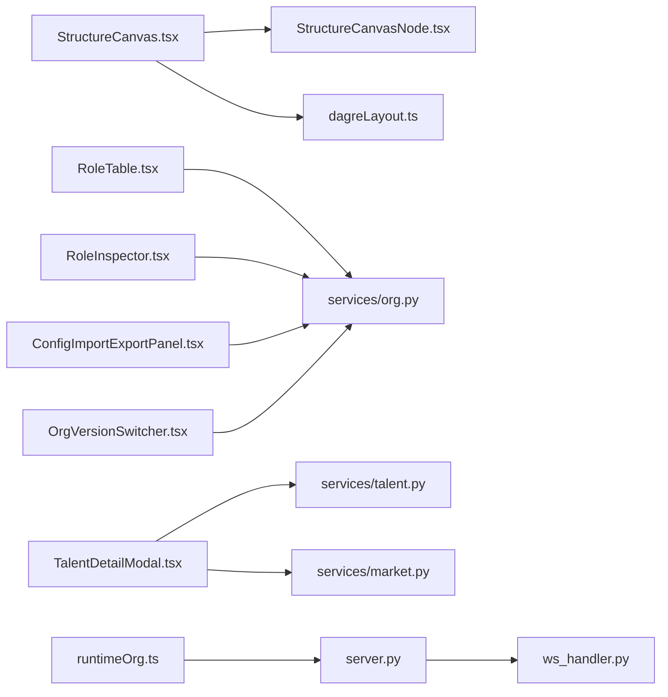

# 组织管理界面

<cite>
**本文引用的文件**   
- [org.py](file://opc/plugins/office_ui/services/org.py)
- [talent.py](file://opc/plugins/office_ui/services/talent.py)
- [market.py](file://opc/plugins/office_ui/services/market.py)
- [server.py](file://opc/plugins/office_ui/server.py)
- [ws_handler.py](file://opc/plugins/office_ui/ws_handler.py)
- [StructureCanvas.tsx](file://opc/plugins/office_ui/frontend_src/org/StructureCanvas.tsx)
- [StructureCanvasNode.tsx](file://opc/plugins/office_ui/frontend_src/org/StructureCanvasNode.tsx)
- [StructureEditor.tsx](file://opc/plugins/office_ui/frontend_src/org/StructureEditor.tsx)
- [dagreLayout.ts](file://opc/plugins/office_ui/frontend_src/org/dagreLayout.ts)
- [RoleTable.tsx](file://opc/plugins/office_ui/frontend_src/org/RoleTable.tsx)
- [RoleInspector.tsx](file://opc/plugins/office_ui/frontend_src/org/RoleInspector.tsx)
- [TalentDetailModal.tsx](file://opc/plugins/office_ui/frontend_src/org/TalentDetailModal.tsx)
- [TalentCard.tsx](file://opc/plugins/office_ui/frontend_src/org/TalentCard.tsx)
- [ConfigImportExportPanel.tsx](file://opc/plugins/office_ui/frontend_src/org/ConfigImportExportPanel.tsx)
- [OrgVersionSwitcher.tsx](file://opc/plugins/office_ui/frontend_src/org/OrgVersionSwitcher.tsx)
- [runtimeOrg.ts](file://opc/plugins/office_ui/frontend_src/lib/runtimeOrg.ts)
- [org.css](file://opc/plugins/office_ui/frontend_src/org/org.css)
- [structure.css](file://opc/plugins/office_ui/frontend_src/org/structure.css)
</cite>

## 目录
1. [简介](#简介)
2. [项目结构](#项目结构)
3. [核心组件](#核心组件)
4. [架构总览](#架构总览)
5. [详细组件分析](#详细组件分析)
6. [依赖关系分析](#依赖关系分析)
7. [性能考虑](#性能考虑)
8. [故障排查指南](#故障排查指南)
9. [结论](#结论)
10. [附录](#附录)

## 简介
本文件面向 OpenOPC 的组织管理界面，聚焦以下能力：
- 组织架构可视化与编辑：节点拖拽、连线管理与层级展示
- 角色配置与管理：角色的增删改查、权限设置与批量操作
- 人才管理：人才详情模态框、技能展示、能力评估与匹配建议
- 组织配置导入导出与版本管理
- 实时预览与一致性校验机制

该文档从前端到后端服务进行分层说明，并提供架构图、时序图与流程图，帮助读者快速理解实现与扩展点。

## 项目结构
组织管理相关的前端代码位于 office_ui 插件的 frontend_src/org 目录，后端服务位于 services 与 server/ws_handler 模块中。关键文件如下：
- 前端
  - 组织结构画布与编辑器：StructureCanvas.tsx、StructureCanvasNode.tsx、StructureEditor.tsx、dagreLayout.ts
  - 角色表格与检查器：RoleTable.tsx、RoleInspector.tsx
  - 人才卡片与详情：TalentCard.tsx、TalentDetailModal.tsx
  - 配置导入导出与版本切换：ConfigImportExportPanel.tsx、OrgVersionSwitcher.tsx
  - 运行时组织数据桥接：runtimeOrg.ts
  - 样式：org.css、structure.css
- 后端
  - 组织服务：services/org.py
  - 人才服务：services/talent.py
  - 市场（岗位/人才）服务：services/market.py
  - HTTP 路由与服务入口：server.py
  - WebSocket 事件处理：ws_handler.py

图表来源
- [StructureCanvas.tsx](file://opc/plugins/office_ui/frontend_src/org/StructureCanvas.tsx)
- [StructureCanvasNode.tsx](file://opc/plugins/office_ui/frontend_src/org/StructureCanvasNode.tsx)
- [StructureEditor.tsx](file://opc/plugins/office_ui/frontend_src/org/StructureEditor.tsx)
- [dagreLayout.ts](file://opc/plugins/office_ui/frontend_src/org/dagreLayout.ts)
- [RoleTable.tsx](file://opc/plugins/office_ui/frontend_src/org/RoleTable.tsx)
- [RoleInspector.tsx](file://opc/plugins/office_ui/frontend_src/org/RoleInspector.tsx)
- [TalentDetailModal.tsx](file://opc/plugins/office_ui/frontend_src/org/TalentDetailModal.tsx)
- [TalentCard.tsx](file://opc/plugins/office_ui/frontend_src/org/TalentCard.tsx)
- [ConfigImportExportPanel.tsx](file://opc/plugins/office_ui/frontend_src/org/ConfigImportExportPanel.tsx)
- [OrgVersionSwitcher.tsx](file://opc/plugins/office_ui/frontend_src/org/OrgVersionSwitcher.tsx)
- [runtimeOrg.ts](file://opc/plugins/office_ui/frontend_src/lib/runtimeOrg.ts)
- [org.py](file://opc/plugins/office_ui/services/org.py)
- [talent.py](file://opc/plugins/office_ui/services/talent.py)
- [market.py](file://opc/plugins/office_ui/services/market.py)
- [server.py](file://opc/plugins/office_ui/server.py)
- [ws_handler.py](file://opc/plugins/office_ui/ws_handler.py)

章节来源
- [org.py](file://opc/plugins/office_ui/services/org.py)
- [talent.py](file://opc/plugins/office_ui/services/talent.py)
- [market.py](file://opc/plugins/office_ui/services/market.py)
- [server.py](file://opc/plugins/office_ui/server.py)
- [ws_handler.py](file://opc/plugins/office_ui/ws_handler.py)
- [StructureCanvas.tsx](file://opc/plugins/office_ui/frontend_src/org/StructureCanvas.tsx)
- [StructureCanvasNode.tsx](file://opc/plugins/office_ui/frontend_src/org/StructureCanvasNode.tsx)
- [StructureEditor.tsx](file://opc/plugins/office_ui/frontend_src/org/StructureEditor.tsx)
- [dagreLayout.ts](file://opc/plugins/office_ui/frontend_src/org/dagreLayout.ts)
- [RoleTable.tsx](file://opc/plugins/office_ui/frontend_src/org/RoleTable.tsx)
- [RoleInspector.tsx](file://opc/plugins/office_ui/frontend_src/org/RoleInspector.tsx)
- [TalentDetailModal.tsx](file://opc/plugins/office_ui/frontend_src/org/TalentDetailModal.tsx)
- [TalentCard.tsx](file://opc/plugins/office_ui/frontend_src/org/TalentCard.tsx)
- [ConfigImportExportPanel.tsx](file://opc/plugins/office_ui/frontend_src/org/ConfigImportExportPanel.tsx)
- [OrgVersionSwitcher.tsx](file://opc/plugins/office_ui/frontend_src/org/OrgVersionSwitcher.tsx)
- [runtimeOrg.ts](file://opc/plugins/office_ui/frontend_src/lib/runtimeOrg.ts)

## 核心组件
- 组织结构画布与编辑器
  - 负责渲染树形/有向图结构，支持节点拖拽、连线创建与删除、自动布局与层级展示
  - 通过编辑器协调保存、撤销/重做与变更同步
- 角色表格与检查器
  - 提供角色列表、筛选、分页、批量选择与批量操作
  - 右侧检查器用于查看与编辑角色属性、权限与关联岗位
- 人才卡片与详情模态框
  - 展示人才基本信息、技能标签、能力评分与匹配度
  - 支持打开详情、查看历史评估与推荐岗位
- 配置导入导出与版本管理
  - 支持将当前组织配置导出为可共享包，或从包导入并合并策略
  - 版本切换器用于在不同快照之间切换与回滚
- 运行时组织数据桥接
  - 统一封装对后端 REST/WS 的调用，提供缓存与状态同步

章节来源
- [StructureCanvas.tsx](file://opc/plugins/office_ui/frontend_src/org/StructureCanvas.tsx)
- [StructureCanvasNode.tsx](file://opc/plugins/office_ui/frontend_src/org/StructureCanvasNode.tsx)
- [StructureEditor.tsx](file://opc/plugins/office_ui/frontend_src/org/StructureEditor.tsx)
- [dagreLayout.ts](file://opc/plugins/office_ui/frontend_src/org/dagreLayout.ts)
- [RoleTable.tsx](file://opc/plugins/office_ui/frontend_src/org/RoleTable.tsx)
- [RoleInspector.tsx](file://opc/plugins/office_ui/frontend_src/org/RoleInspector.tsx)
- [TalentDetailModal.tsx](file://opc/plugins/office_ui/frontend_src/org/TalentDetailModal.tsx)
- [TalentCard.tsx](file://opc/plugins/office_ui/frontend_src/org/TalentCard.tsx)
- [ConfigImportExportPanel.tsx](file://opc/plugins/office_ui/frontend_src/org/ConfigImportExportPanel.tsx)
- [OrgVersionSwitcher.tsx](file://opc/plugins/office_ui/frontend_src/org/OrgVersionSwitcher.tsx)
- [runtimeOrg.ts](file://opc/plugins/office_ui/frontend_src/lib/runtimeOrg.ts)
- [org.py](file://opc/plugins/office_ui/services/org.py)
- [talent.py](file://opc/plugins/office_ui/services/talent.py)
- [market.py](file://opc/plugins/office_ui/services/market.py)
- [server.py](file://opc/plugins/office_ui/server.py)
- [ws_handler.py](file://opc/plugins/office_ui/ws_handler.py)

## 架构总览
整体采用“前端可视化 + 后端服务”的分层架构。前端通过 runtimeOrg 聚合 API 调用，组织/人才/市场等页面分别调用对应服务；WebSocket 用于实时事件推送（如任务进度、协作消息）。

图表来源
- [runtimeOrg.ts](file://opc/plugins/office_ui/frontend_src/lib/runtimeOrg.ts)
- [server.py](file://opc/plugins/office_ui/server.py)
- [org.py](file://opc/plugins/office_ui/services/org.py)
- [talent.py](file://opc/plugins/office_ui/services/talent.py)
- [ws_handler.py](file://opc/plugins/office_ui/ws_handler.py)

## 详细组件分析

### 组织结构画布与编辑器
- 功能要点
  - 节点拖拽：在画布上移动节点位置，实时更新坐标与布局
  - 连线管理：支持创建父子/依赖连线，删除连线，冲突检测
  - 层级展示：基于 DAG 布局算法自动计算层级与间距
  - 实时预览：编辑过程中即时渲染，避免频繁落盘
- 交互流程
  - 用户拖拽节点 -> 更新本地状态 -> 触发重排 -> 可选保存
  - 新增/删除连线 -> 校验环路与重复边 -> 提交变更
- 布局算法
  - 使用 dagre 类库进行层次化布局，保证父子关系清晰、连线不交叉

图表来源
- [StructureCanvas.tsx](file://opc/plugins/office_ui/frontend_src/org/StructureCanvas.tsx)
- [StructureCanvasNode.tsx](file://opc/plugins/office_ui/frontend_src/org/StructureCanvasNode.tsx)
- [StructureEditor.tsx](file://opc/plugins/office_ui/frontend_src/org/StructureEditor.tsx)
- [dagreLayout.ts](file://opc/plugins/office_ui/frontend_src/org/dagreLayout.ts)

章节来源
- [StructureCanvas.tsx](file://opc/plugins/office_ui/frontend_src/org/StructureCanvas.tsx)
- [StructureCanvasNode.tsx](file://opc/plugins/office_ui/frontend_src/org/StructureCanvasNode.tsx)
- [StructureEditor.tsx](file://opc/plugins/office_ui/frontend_src/org/StructureEditor.tsx)
- [dagreLayout.ts](file://opc/plugins/office_ui/frontend_src/org/dagreLayout.ts)

### 角色表格与权限检查器
- 功能要点
  - 角色 CRUD：新增、编辑、删除、复制模板
  - 权限设置：勾选式权限矩阵，支持按模块/动作维度配置
  - 批量管理：多选后批量赋权/解权、批量迁移至新模板
  - 搜索与筛选：按名称、标签、状态过滤
- 交互流程
  - 选中行 -> 打开右侧检查器 -> 修改权限 -> 保存 -> 刷新列表
  - 批量操作 -> 二次确认 -> 提交批量请求 -> 结果反馈

图表来源
- [RoleTable.tsx](file://opc/plugins/office_ui/frontend_src/org/RoleTable.tsx)
- [RoleInspector.tsx](file://opc/plugins/office_ui/frontend_src/org/RoleInspector.tsx)
- [org.py](file://opc/plugins/office_ui/services/org.py)
- [server.py](file://opc/plugins/office_ui/server.py)

章节来源
- [RoleTable.tsx](file://opc/plugins/office_ui/frontend_src/org/RoleTable.tsx)
- [RoleInspector.tsx](file://opc/plugins/office_ui/frontend_src/org/RoleInspector.tsx)
- [org.py](file://opc/plugins/office_ui/services/org.py)
- [server.py](file://opc/plugins/office_ui/server.py)

### 人才详情模态框与匹配建议
- 功能要点
  - 技能展示：以标签/进度条形式呈现硬技能与软技能
  - 能力评估：显示历史评估分数、趋势与建议提升项
  - 匹配算法：根据岗位要求与人才画像计算匹配度，给出推荐岗位
- 交互流程
  - 点击人才卡片 -> 打开详情模态框 -> 加载画像与评估 -> 查看匹配建议 -> 发起雇佣/转岗流程

图表来源
- [TalentCard.tsx](file://opc/plugins/office_ui/frontend_src/org/TalentCard.tsx)
- [TalentDetailModal.tsx](file://opc/plugins/office_ui/frontend_src/org/TalentDetailModal.tsx)
- [talent.py](file://opc/plugins/office_ui/services/talent.py)
- [market.py](file://opc/plugins/office_ui/services/market.py)
- [server.py](file://opc/plugins/office_ui/server.py)

章节来源
- [TalentCard.tsx](file://opc/plugins/office_ui/frontend_src/org/TalentCard.tsx)
- [TalentDetailModal.tsx](file://opc/plugins/office_ui/frontend_src/org/TalentDetailModal.tsx)
- [talent.py](file://opc/plugins/office_ui/services/talent.py)
- [market.py](file://opc/plugins/office_ui/services/market.py)
- [server.py](file://opc/plugins/office_ui/server.py)

### 配置导入导出与版本管理
- 功能要点
  - 导出：将当前组织配置打包为可分发格式（含角色、岗位、人才映射等）
  - 导入：解析包并执行合并策略（覆盖/保留/冲突解决）
  - 版本管理：列出历史版本，支持切换与回滚
- 交互流程
  - 选择导出范围 -> 生成包 -> 下载
  - 选择包 -> 预览差异 -> 应用导入 -> 生成新版本
  - 版本列表 -> 切换目标版本 -> 刷新界面

图表来源
- [ConfigImportExportPanel.tsx](file://opc/plugins/office_ui/frontend_src/org/ConfigImportExportPanel.tsx)
- [OrgVersionSwitcher.tsx](file://opc/plugins/office_ui/frontend_src/org/OrgVersionSwitcher.tsx)
- [org.py](file://opc/plugins/office_ui/services/org.py)
- [server.py](file://opc/plugins/office_ui/server.py)

章节来源
- [ConfigImportExportPanel.tsx](file://opc/plugins/office_ui/frontend_src/org/ConfigImportExportPanel.tsx)
- [OrgVersionSwitcher.tsx](file://opc/plugins/office_ui/frontend_src/org/OrgVersionSwitcher.tsx)
- [org.py](file://opc/plugins/office_ui/services/org.py)
- [server.py](file://opc/plugins/office_ui/server.py)

### 实时预览与一致性校验
- 实时预览
  - 通过 WebSocket 接收后端推送的结构变更、任务进度与协作事件，前端增量更新视图
- 一致性校验
  - 前端在保存前进行基础校验（必填字段、唯一性、类型）
  - 后端在服务层执行深度校验（环检测、权限闭合、引用完整性），并返回错误明细

图表来源
- [ws_handler.py](file://opc/plugins/office_ui/ws_handler.py)
- [server.py](file://opc/plugins/office_ui/server.py)
- [org.py](file://opc/plugins/office_ui/services/org.py)

章节来源
- [ws_handler.py](file://opc/plugins/office_ui/ws_handler.py)
- [server.py](file://opc/plugins/office_ui/server.py)
- [org.py](file://opc/plugins/office_ui/services/org.py)

## 依赖关系分析
- 前端内部依赖
  - StructureCanvas 依赖 StructureCanvasNode 与 dagreLayout
  - RoleTable 与 RoleInspector 共同消费 org 服务
  - TalentDetailModal 依赖 talent 与 market 服务
  - ConfigImportExportPanel 与 OrgVersionSwitcher 均依赖 org 服务
- 前后端耦合
  - runtimeOrg 作为统一客户端，屏蔽 HTTP/WS 细节
  - server.py 路由转发至 services/* 模块
  - ws_handler.py 处理实时事件，与 services 协同

图表来源
- [StructureCanvas.tsx](file://opc/plugins/office_ui/frontend_src/org/StructureCanvas.tsx)
- [StructureCanvasNode.tsx](file://opc/plugins/office_ui/frontend_src/org/StructureCanvasNode.tsx)
- [dagreLayout.ts](file://opc/plugins/office_ui/frontend_src/org/dagreLayout.ts)
- [RoleTable.tsx](file://opc/plugins/office_ui/frontend_src/org/RoleTable.tsx)
- [RoleInspector.tsx](file://opc/plugins/office_ui/frontend_src/org/RoleInspector.tsx)
- [TalentDetailModal.tsx](file://opc/plugins/office_ui/frontend_src/org/TalentDetailModal.tsx)
- [talent.py](file://opc/plugins/office_ui/services/talent.py)
- [market.py](file://opc/plugins/office_ui/services/market.py)
- [ConfigImportExportPanel.tsx](file://opc/plugins/office_ui/frontend_src/org/ConfigImportExportPanel.tsx)
- [OrgVersionSwitcher.tsx](file://opc/plugins/office_ui/frontend_src/org/OrgVersionSwitcher.tsx)
- [runtimeOrg.ts](file://opc/plugins/office_ui/frontend_src/lib/runtimeOrg.ts)
- [server.py](file://opc/plugins/office_ui/server.py)
- [ws_handler.py](file://opc/plugins/office_ui/ws_handler.py)

章节来源
- [org.py](file://opc/plugins/office_ui/services/org.py)
- [talent.py](file://opc/plugins/office_ui/services/talent.py)
- [market.py](file://opc/plugins/office_ui/services/market.py)
- [server.py](file://opc/plugins/office_ui/server.py)
- [ws_handler.py](file://opc/plugins/office_ui/ws_handler.py)
- [StructureCanvas.tsx](file://opc/plugins/office_ui/frontend_src/org/StructureCanvas.tsx)
- [StructureCanvasNode.tsx](file://opc/plugins/office_ui/frontend_src/org/StructureCanvasNode.tsx)
- [dagreLayout.ts](file://opc/plugins/office_ui/frontend_src/org/dagreLayout.ts)
- [RoleTable.tsx](file://opc/plugins/office_ui/frontend_src/org/RoleTable.tsx)
- [RoleInspector.tsx](file://opc/plugins/office_ui/frontend_src/org/RoleInspector.tsx)
- [TalentDetailModal.tsx](file://opc/plugins/office_ui/frontend_src/org/TalentDetailModal.tsx)
- [ConfigImportExportPanel.tsx](file://opc/plugins/office_ui/frontend_src/org/ConfigImportExportPanel.tsx)
- [OrgVersionSwitcher.tsx](file://opc/plugins/office_ui/frontend_src/org/OrgVersionSwitcher.tsx)
- [runtimeOrg.ts](file://opc/plugins/office_ui/frontend_src/lib/runtimeOrg.ts)

## 性能考虑
- 画布渲染
  - 大组织规模下，优先使用虚拟滚动与按需渲染节点
  - 布局计算异步化，避免阻塞主线程
- 网络与缓存
  - 对只读数据（角色定义、岗位模板）启用浏览器缓存与失效策略
  - 批量操作合并请求，减少往返次数
- 实时事件
  - 对高频事件进行节流与去抖，避免 UI 抖动
  - 增量更新而非全量重绘

[本节为通用指导，无需源码引用]

## 故障排查指南
- 常见问题
  - 画布无法保存：检查后端校验错误清单（环、重复边、缺失必填）
  - 权限未生效：确认角色权限矩阵已保存且无冲突规则
  - 匹配结果为空：检查人才画像与岗位要求的标签对齐情况
  - 导入失败：核对包版本兼容性与字段映射
- 定位方法
  - 前端控制台查看网络请求与 WebSocket 事件
  - 后端日志关注 services 层的校验与异常堆栈
  - 使用版本切换器回滚到上一稳定版本

章节来源
- [org.py](file://opc/plugins/office_ui/services/org.py)
- [server.py](file://opc/plugins/office_ui/server.py)
- [ws_handler.py](file://opc/plugins/office_ui/ws_handler.py)

## 结论
OpenOPC 组织管理界面通过可视化画布、角色配置与人才管理三大模块，形成完整的组织运营闭环。结合配置导入导出与版本管理，以及实时预览与一致性校验，既满足日常运维效率，也保障系统稳定性与可演进性。建议在后续迭代中持续优化大规模数据的渲染性能与匹配算法的可解释性。

[本节为总结性内容，无需源码引用]

## 附录
- 样式参考
  - org.css：组织页全局样式
  - structure.css：画布与节点样式
- 运行时组织数据
  - runtimeOrg.ts：统一的数据访问与状态同步

章节来源
- [org.css](file://opc/plugins/office_ui/frontend_src/org/org.css)
- [structure.css](file://opc/plugins/office_ui/frontend_src/org/structure.css)
- [runtimeOrg.ts](file://opc/plugins/office_ui/frontend_src/lib/runtimeOrg.ts)