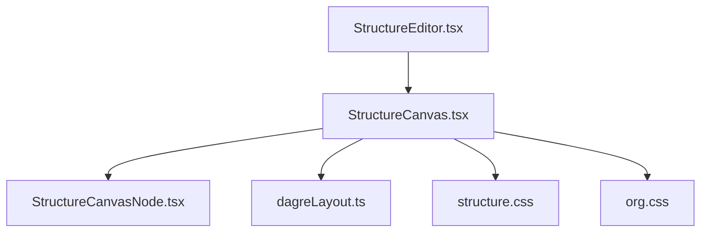
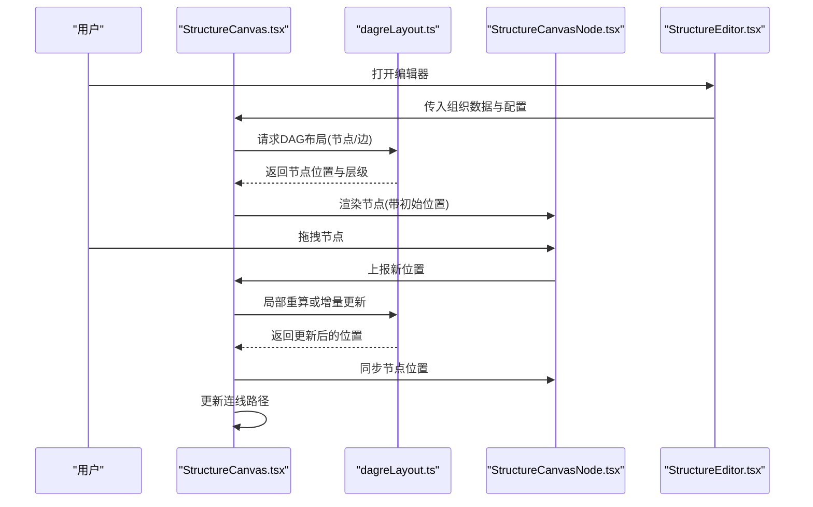
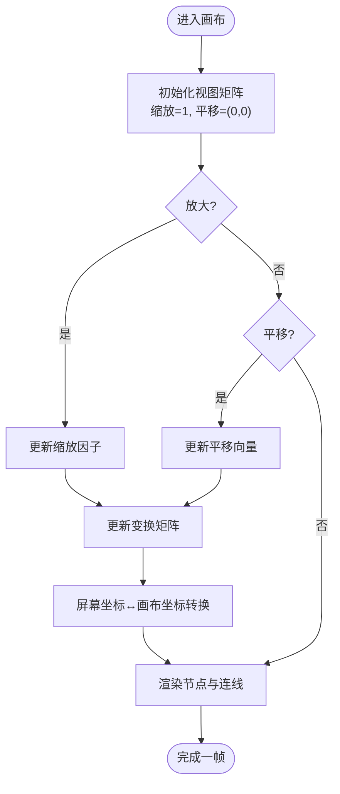
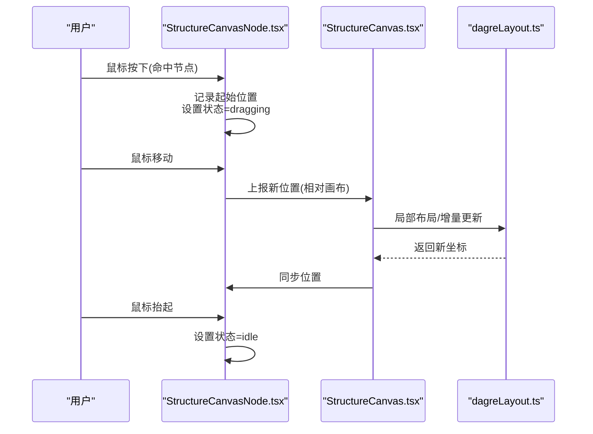
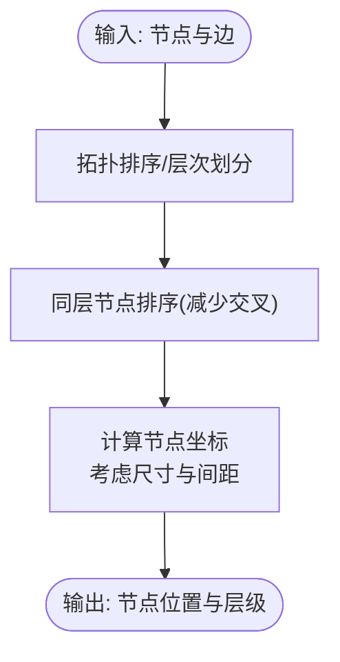
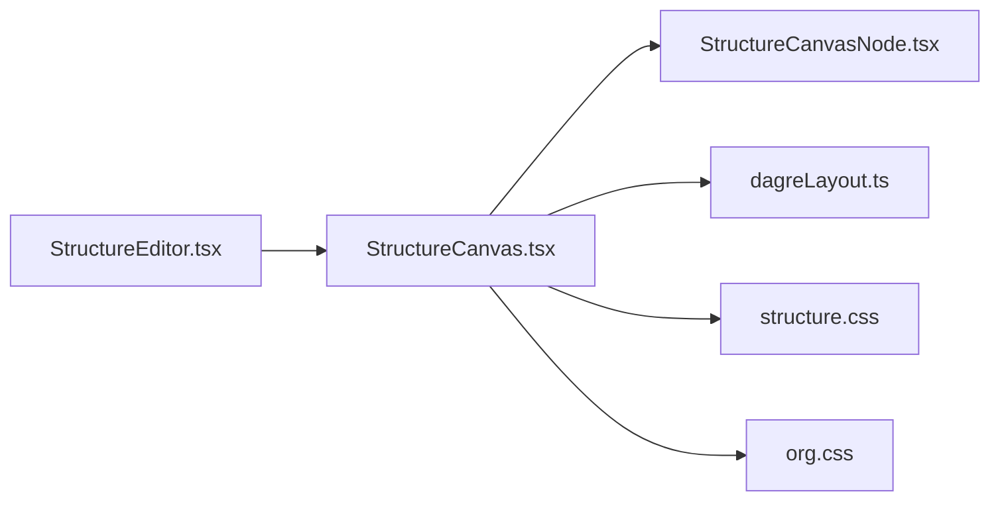

# 组织结构画布

<cite>
**本文引用的文件**   
- [StructureCanvas.tsx](file://opc/plugins/office_ui/frontend_src/org/StructureCanvas.tsx)
- [StructureCanvasNode.tsx](file://opc/plugins/office_ui/frontend_src/org/StructureCanvasNode.tsx)
- [dagreLayout.ts](file://opc/plugins/office_ui/frontend_src/org/dagreLayout.ts)
- [StructureEditor.tsx](file://opc/plugins/office_ui/frontend_src/org/StructureEditor.tsx)
- [org.css](file://opc/plugins/office_ui/frontend_src/org/org.css)
- [structure.css](file://opc/plugins/office_ui/frontend_src/org/structure.css)
</cite>

## 目录
1. [简介](#简介)
2. [项目结构](#项目结构)
3. [核心组件](#核心组件)
4. [架构总览](#架构总览)
5. [详细组件分析](#详细组件分析)
6. [依赖关系分析](#依赖关系分析)
7. [性能考虑](#性能考虑)
8. [故障排查指南](#故障排查指南)
9. [结论](#结论)
10. [附录](#附录)

## 简介
本技术文档面向OpenOPC“组织结构画布”前端实现，聚焦以下目标：
- 可视化渲染机制与DAG布局算法（节点定位计算）
- 节点拖拽交互（鼠标事件、状态管理、边界约束）
- 连线系统（父子关系绘制、动态更新、样式定制）
- 层级可视化（树形展开折叠、深度控制）
- 缩放与平移（视图变换、坐标转换）
- 节点编辑（双击编辑、属性修改、实时预览）
- 性能优化（虚拟滚动、增量渲染等）

## 项目结构
组织结构画布位于Office UI插件的前端源码中，关键文件如下：
- 画布容器与主逻辑：StructureCanvas.tsx
- 节点渲染与交互：StructureCanvasNode.tsx
- DAG布局计算：dagreLayout.ts
- 编辑器入口与编排：StructureEditor.tsx
- 样式：org.css、structure.css

图表来源
- [StructureEditor.tsx](file://opc/plugins/office_ui/frontend_src/org/StructureEditor.tsx)
- [StructureCanvas.tsx](file://opc/plugins/office_ui/frontend_src/org/StructureCanvas.tsx)
- [StructureCanvasNode.tsx](file://opc/plugins/office_ui/frontend_src/org/StructureCanvasNode.tsx)
- [dagreLayout.ts](file://opc/plugins/office_ui/frontend_src/org/dagreLayout.ts)
- [structure.css](file://opc/plugins/office_ui/frontend_src/org/structure.css)
- [org.css](file://opc/plugins/office_ui/frontend_src/org/org.css)

章节来源
- [StructureCanvas.tsx](file://opc/plugins/office_ui/frontend_src/org/StructureCanvas.tsx)
- [StructureCanvasNode.tsx](file://opc/plugins/office_ui/frontend_src/org/StructureCanvasNode.tsx)
- [dagreLayout.ts](file://opc/plugins/office_ui/frontend_src/org/dagreLayout.ts)
- [StructureEditor.tsx](file://opc/plugins/office_ui/frontend_src/org/StructureEditor.tsx)
- [structure.css](file://opc/plugins/office_ui/frontend_src/org/structure.css)
- [org.css](file://opc/plugins/office_ui/frontend_src/org/org.css)

## 核心组件
- StructureCanvas.tsx：画布容器，负责数据绑定、视图变换（缩放/平移）、连线层与节点层组织、布局触发与增量更新。
- StructureCanvasNode.tsx：单个节点的渲染与交互，包含拖拽、双击编辑、悬停高亮、选中态等。
- dagreLayout.ts：基于DAG的层次布局计算，输出节点位置与层级信息，供画布进行定位与连线。
- StructureEditor.tsx：编辑器外壳，聚合画布、工具栏、侧边面板等，提供全局状态与事件桥接。
- structure.css / org.css：画布与节点样式，包括连线样式、节点尺寸、阴影、选中态等。

章节来源
- [StructureCanvas.tsx](file://opc/plugins/office_ui/frontend_src/org/StructureCanvas.tsx)
- [StructureCanvasNode.tsx](file://opc/plugins/office_ui/frontend_src/org/StructureCanvasNode.tsx)
- [dagreLayout.ts](file://opc/plugins/office_ui/frontend_src/org/dagreLayout.ts)
- [StructureEditor.tsx](file://opc/plugins/office_ui/frontend_src/org/StructureEditor.tsx)
- [structure.css](file://opc/plugins/office_ui/frontend_src/org/structure.css)
- [org.css](file://opc/plugins/office_ui/frontend_src/org/org.css)

## 架构总览
画布采用“数据驱动 + 布局计算 + 分层渲染”的架构：
- 数据层：组织结构图（节点与父子边）
- 布局层：dagreLayout.ts计算DAG层次与坐标
- 渲染层：StructureCanvas.tsx将节点与连线分别渲染到不同图层
- 交互层：StructureCanvasNode.tsx处理拖拽、双击编辑等；画布层处理缩放/平移

图表来源
- [StructureCanvas.tsx](file://opc/plugins/office_ui/frontend_src/org/StructureCanvas.tsx)
- [dagreLayout.ts](file://opc/plugins/office_ui/frontend_src/org/dagreLayout.ts)
- [StructureCanvasNode.tsx](file://opc/plugins/office_ui/frontend_src/org/StructureCanvasNode.tsx)
- [StructureEditor.tsx](file://opc/plugins/office_ui/frontend_src/org/StructureEditor.tsx)

## 详细组件分析

### 画布容器（StructureCanvas.tsx）
职责
- 接收并缓存组织数据（节点、边、层级）
- 调用布局模块计算节点坐标
- 维护视图变换矩阵（缩放/平移）
- 管理连线层与节点层的渲染顺序
- 响应数据变化，触发增量布局与渲染

关键点
- 视图变换：通过CSS transform或SVG viewBox实现缩放和平移，统一在画布根元素上应用
- 坐标转换：屏幕坐标与画布坐标之间的双向转换，用于拖拽命中检测与连线锚点计算
- 增量更新：仅对受影响的子树或节点进行重布局与重绘，避免全量重排
- 连线层：使用独立图层绘制父子边，支持曲线/折线、箭头、虚线等样式

章节来源
- [StructureCanvas.tsx](file://opc/plugins/office_ui/frontend_src/org/StructureCanvas.tsx)

#### 视图变换与坐标转换流程

图表来源
- [StructureCanvas.tsx](file://opc/plugins/office_ui/frontend_src/org/StructureCanvas.tsx)

### 节点渲染与交互（StructureCanvasNode.tsx）
职责
- 渲染节点内容（名称、图标、状态等）
- 处理鼠标事件：按下、移动、抬起、双击
- 管理拖拽状态：开始拖拽、拖拽中、结束拖拽
- 边界约束：限制节点在画布可视区域内
- 双击编辑：弹出编辑表单，修改属性后实时更新预览

关键点
- 拖拽状态机：idle → dragging → dropped
- 命中检测：根据节点矩形与鼠标位置判断是否命中
- 碰撞与避让：可选启用，避免节点重叠
- 实时预览：编辑时即时反馈，提交后持久化

章节来源
- [StructureCanvasNode.tsx](file://opc/plugins/office_ui/frontend_src/org/StructureCanvasNode.tsx)

#### 拖拽交互时序

图表来源
- [StructureCanvasNode.tsx](file://opc/plugins/office_ui/frontend_src/org/StructureCanvasNode.tsx)
- [StructureCanvas.tsx](file://opc/plugins/office_ui/frontend_src/org/StructureCanvas.tsx)
- [dagreLayout.ts](file://opc/plugins/office_ui/frontend_src/org/dagreLayout.ts)

### DAG布局算法（dagreLayout.ts）
职责
- 输入：有向无环图（节点、父子边）
- 输出：每个节点的(x,y)坐标与层级信息
- 支持：最小间距、层级高度、节点尺寸、方向（自上而下/自左向右）

关键点
- 层次划分：按拓扑排序确定层级
- 交叉最小化：调整同层节点顺序以减少边交叉
- 坐标分配：依据节点尺寸与间距计算最终位置
- 增量模式：当少量节点变化时，仅重算受影响区域

章节来源
- [dagreLayout.ts](file://opc/plugins/office_ui/frontend_src/org/dagreLayout.ts)

#### 布局计算流程图

图表来源
- [dagreLayout.ts](file://opc/plugins/office_ui/frontend_src/org/dagreLayout.ts)

### 编辑器外壳（StructureEditor.tsx）
职责
- 聚合画布、工具栏、侧边面板
- 管理全局状态（主题、语言、权限）
- 提供事件总线，连接画布与后端服务

章节来源
- [StructureEditor.tsx](file://opc/plugins/office_ui/frontend_src/org/StructureEditor.tsx)

### 样式与主题（structure.css / org.css）
职责
- 定义连线样式（颜色、粗细、虚线、箭头）
- 定义节点样式（圆角、阴影、选中态、禁用态）
- 定义画布背景与网格（可选）

章节来源
- [structure.css](file://opc/plugins/office_ui/frontend_src/org/structure.css)
- [org.css](file://opc/plugins/office_ui/frontend_src/org/org.css)

## 依赖关系分析

图表来源
- [StructureEditor.tsx](file://opc/plugins/office_ui/frontend_src/org/StructureEditor.tsx)
- [StructureCanvas.tsx](file://opc/plugins/office_ui/frontend_src/org/StructureCanvas.tsx)
- [StructureCanvasNode.tsx](file://opc/plugins/office_ui/frontend_src/org/StructureCanvasNode.tsx)
- [dagreLayout.ts](file://opc/plugins/office_ui/frontend_src/org/dagreLayout.ts)
- [structure.css](file://opc/plugins/office_ui/frontend_src/org/structure.css)
- [org.css](file://opc/plugins/office_ui/frontend_src/org/org.css)

章节来源
- [StructureEditor.tsx](file://opc/plugins/office_ui/frontend_src/org/StructureEditor.tsx)
- [StructureCanvas.tsx](file://opc/plugins/office_ui/frontend_src/org/StructureCanvas.tsx)
- [StructureCanvasNode.tsx](file://opc/plugins/office_ui/frontend_src/org/StructureCanvasNode.tsx)
- [dagreLayout.ts](file://opc/plugins/office_ui/frontend_src/org/dagreLayout.ts)
- [structure.css](file://opc/plugins/office_ui/frontend_src/org/structure.css)
- [org.css](file://opc/plugins/office_ui/frontend_src/org/org.css)

## 性能考虑
- 增量渲染：仅在节点位置或可见性变化时重绘相关区域，避免整图画布刷新
- 虚拟滚动：对超大组织图，仅渲染视口内节点与连线，提升首屏与滚动性能
- 布局节流：拖拽过程中降低布局频率，使用requestAnimationFrame合并更新
- 连线批处理：批量计算与绘制连线，减少DOM/SVG操作次数
- 样式复用：通过CSS变量与类名复用，减少重复样式计算

[本节为通用性能建议，不直接分析具体文件]

## 故障排查指南
常见问题与定位要点
- 连线错位：检查坐标转换函数是否正确处理缩放/平移；确认连线锚点取自节点中心或边缘
- 拖拽卡顿：确认拖拽状态机未重复触发；检查布局调用是否被节流；必要时开启增量布局
- 双击编辑无效：验证双击事件冒泡是否被阻止；确认编辑弹窗挂载点正确
- 节点越界：检查边界约束逻辑是否覆盖所有拖拽分支
- 样式异常：核对structure.css与org.css中的选择器优先级与变量值

章节来源
- [StructureCanvas.tsx](file://opc/plugins/office_ui/frontend_src/org/StructureCanvas.tsx)
- [StructureCanvasNode.tsx](file://opc/plugins/office_ui/frontend_src/org/StructureCanvasNode.tsx)
- [structure.css](file://opc/plugins/office_ui/frontend_src/org/structure.css)
- [org.css](file://opc/plugins/office_ui/frontend_src/org/org.css)

## 结论
组织结构画布以数据驱动为核心，结合DAG布局与分层渲染，实现了高效的可视化展示与丰富的交互能力。通过增量更新、视图变换与样式定制，满足了复杂组织结构的编辑与呈现需求。后续可进一步引入虚拟滚动与更精细的布局策略，以支撑更大规模的组织图。

[本节为总结性内容，不直接分析具体文件]

## 附录
- 术语
  - DAG：有向无环图
  - 视图变换：缩放与平移的组合
  - 增量渲染：仅更新变化的部分
- 参考文件
  - [StructureCanvas.tsx](file://opc/plugins/office_ui/frontend_src/org/StructureCanvas.tsx)
  - [StructureCanvasNode.tsx](file://opc/plugins/office_ui/frontend_src/org/StructureCanvasNode.tsx)
  - [dagreLayout.ts](file://opc/plugins/office_ui/frontend_src/org/dagreLayout.ts)
  - [StructureEditor.tsx](file://opc/plugins/office_ui/frontend_src/org/StructureEditor.tsx)
  - [structure.css](file://opc/plugins/office_ui/frontend_src/org/structure.css)
  - [org.css](file://opc/plugins/office_ui/frontend_src/org/org.css)