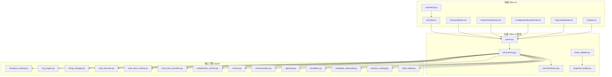
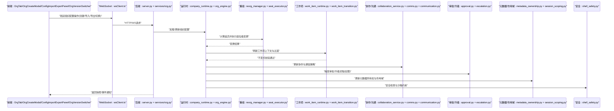
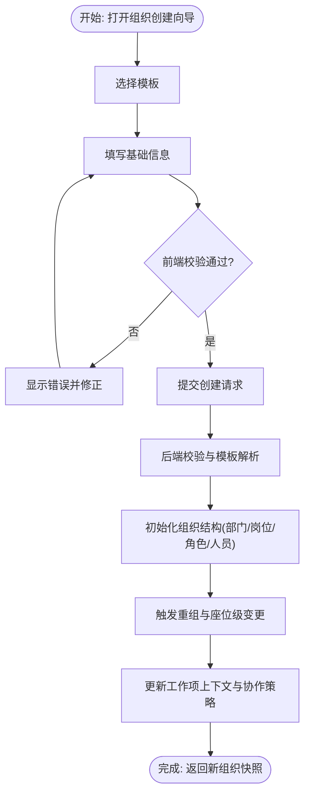
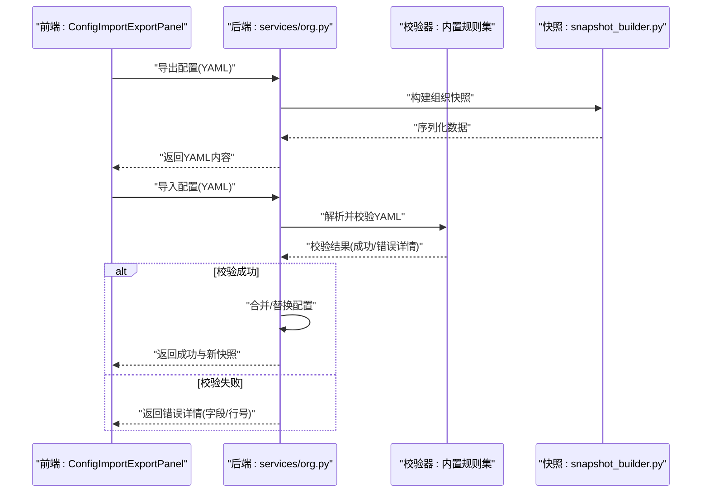
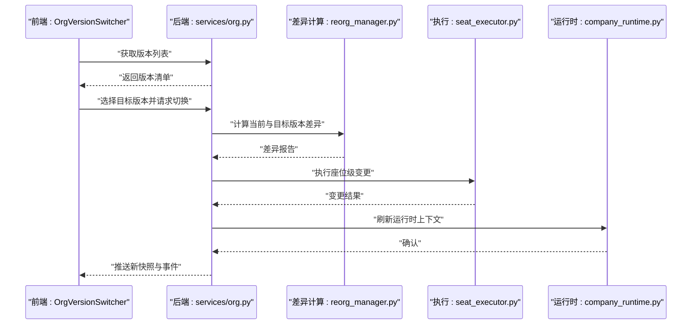
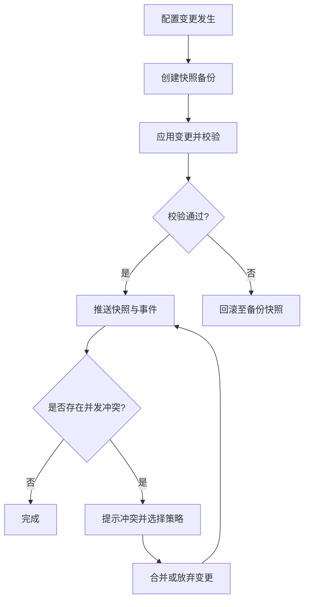
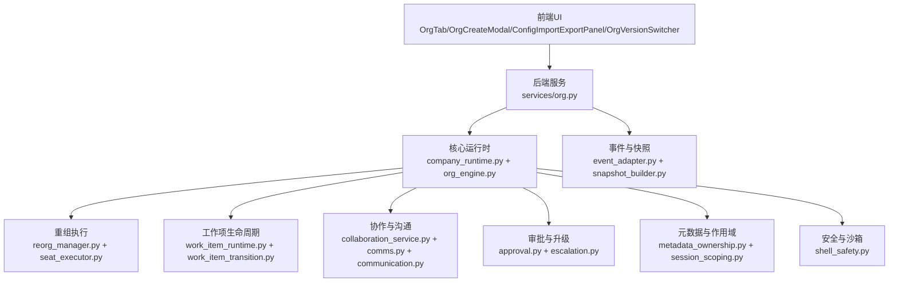

# 组织配置管理

<cite>
**本文引用的文件**   
- [org_config.py](file://opc/core/org_config.py)
- [config.py](file://opc/core/config.py)
- [company_runtime.py](file://opc/layer2_organization/company_runtime.py)
- [org_engine.py](file://opc/layer2_organization/org_engine.py)
- [reorg_manager.py](file://opc/layer2_organization/reorg_manager.py)
- [seat_executor.py](file://opc/layer2_organization/seat_executor.py)
- [work_item_runtime.py](file://opc/layer2_organization/work_item_runtime.py)
- [work_item_transition.py](file://opc/layer2_organization/work_item_transition.py)
- [phase_hooks.py](file://opc/layer2_organization/phase_hooks.py)
- [collaboration_service.py](file://opc/layer2_organization/collaboration_service.py)
- [comms.py](file://opc/layer2_organization/comms.py)
- [communication.py](file://opc/layer2_organization/communication.py)
- [approval.py](file://opc/layer2_organization/approval.py)
- [esc alation.py](file://opc/layer2_organization/escalation.py)
- [metadata_ownership.py](file://opc/layer2_organization/metadata_ownership.py)
- [session_scoping.py](file://opc/layer2_organization/session_scoping.py)
- [shell_safety.py](file://opc/layer2_organization/shell_safety.py)
- [task_graph.py](file://opc/layer2_organization/task_graph.py)
- [goal_manager.py](file://opc/layer2_organization/goal_manager.py)
- [recruiter.py](file://opc/layer2_organization/recruiter.py)
- [talent_market.py](file://opc/layer2_organization/talent_market.py)
- [company_mode.py](file://opc/layer2_organization/company_mode.py)
- [custom_runtime.py](file://opc/layer2_organization/custom_runtime.py)
- [gate_harness.py](file://opc/layer2_organization/gate_harness.py)
- [org_work_item_planner.py](file://opc/layer2_organization/org_work_item_planner.py)
- [output_contract.py](file://opc/layer2_organization/output_contract.py)
- [prompt_contract.py](file://opc/layer2_organization/prompt_contract.py)
- [reactivation_sweeper.py](file://opc/layer2_organization/reactivation_sweeper.py)
- [heartbeat.py](file://opc/layer2_organization/heartbeat.py)
- [turn_mode.py](file://opc/layer2_organization/turn_mode.py)
- [work_item_identity.py](file://opc/layer2_organization/work_item_identity.py)
- [work_item_links.py](file://opc/layer2_organization/work_item_links.py)
- [work_item_context_view.py](file://opc/layer2_organization/work_item_context_view.py)
- [work_item_runtime_invariants.py](file://opc/layer2_organization/work_item_runtime_invariants.py)
- [data_acquisition_policy.py](file://opc/layer2_organization/data_acquisition_policy.py)
- [collaboration_policy.py](file://opc/layer2_organization/collaboration_policy.py)
- [CompanyRuntimeProfiles](file://opc/layer2_organization/company_runtime_profiles.py)
- [CompanyRuntimeIdentity](file://opc/layer2_organization/company_runtime_identity.py)
- [OrgTab.tsx](file://opc/plugins/office_ui/frontend_src/org/OrgTab.tsx)
- [OrgCreateModal.tsx](file://opc/plugins/office_ui/frontend_src/org/OrgCreateModal.tsx)
- [ConfigImportExportPanel.tsx](file://opc/plugins/office_ui/frontend_src/org/ConfigImportExportPanel.tsx)
- [OrgVersionSwitcher.tsx](file://opc/plugins/office_ui/frontend_src/org/OrgVersionSwitcher.tsx)
- [StructureEditor.tsx](file://opc/plugins/office_ui/frontend_src/org/StructureEditor.tsx)
- [StructureCanvas.tsx](file://opc/plugins/office_ui/frontend_src/org/StructureCanvas.tsx)
- [StructureCanvasNode.tsx](file://opc/plugins/office_ui/frontend_src/org/StructureCanvasNode.tsx)
- [RoleTable.tsx](file://opc/plugins/office_ui/frontend_src/org/RoleTable.tsx)
- [TeamView.tsx](file://opc/plugins/office_ui/frontend_src/org/TeamView.tsx)
- [TalentCard.tsx](file://opc/plugins/office_ui/frontend_src/org/TalentCard.tsx)
- [TalentDetailModal.tsx](file://opc/plugins/office_ui/frontend_src/org/TalentDetailModal.tsx)
- [HireToRoleModal.tsx](file://opc/plugins/office_ui/frontend_src/org/HireToRoleModal.tsx)
- [ArchitectureMarketplace.tsx](file://opc/plugins/office_ui/frontend_src/org/ArchitectureMarketplace.tsx)
- [EmployeesMarketplace.tsx](file://opc/plugins/office_ui/frontend_src/org/EmployeesMarketplace.tsx)
- [delegation_strategy_panel.tsx](file://opc/plugins/office_ui/frontend_src/org/DelegationStrategyPanel.tsx)
- [org.css](file://opc/plugins/office_ui/frontend_src/org/org.css)
- [structure.css](file://opc/plugins/office_ui/frontend_src/org/structure.css)
- [team.css](file://opc/plugins/office_ui/frontend_src/org/team.css)
- [marketplace.css](file://opc/plugins/office_ui/frontend_src/org/marketplace.css)
- [dagreLayout.ts](file://opc/plugins/office_ui/frontend_src/org/dagreLayout.ts)
- [runtimeOrg.ts](file://opc/plugins/office_ui/frontend_src/lib/runtimeOrg.ts)
- [wsClient.ts](file://opc/plugins/office_ui/frontend_src/lib/wsClient.ts)
- [server.py](file://opc/plugins/office_ui/server.py)
- [services/org.py](file://opc/plugins/office_ui/services/org.py)
- [services/factory.py](file://opc/plugins/office_ui/services/factory.py)
- [event_adapter.py](file://opc/plugins/office_ui/event_adapter.py)
- [snapshot_builder.py](file://opc/plugins/office_ui/snapshot_builder.py)
- [test_org_config_import_handler.py](file://tests/test_org_config_import_handler.py)
- [test_org_config_roundtrip.py](file://tests/test_org_config_roundtrip.py)
- [test_company_org_config_alignment.py](file://tests/test_company_org_config_alignment.py)
- [test_org_saved_crud.py](file://tests/test_org_saved_crud.py)
- [agent_config.yaml](file://config/agent_config.yaml)
- [channel_config.yaml](file://config/channel_config.yaml)
- [company_corporate_config.yaml](file://config/company_corporate_config.yaml)
- [llm_config.yaml](file://config/llm_config.yaml)
- [system_config.yaml](file://config/system_config.yaml)
</cite>

## 目录
1. [简介](#简介)
2. [项目结构](#项目结构)
3. [核心组件](#核心组件)
4. [架构总览](#架构总览)
5. [详细组件分析](#详细组件分析)
6. [依赖关系分析](#依赖关系分析)
7. [性能考虑](#性能考虑)
8. [故障排查指南](#故障排查指南)
9. [结论](#结论)
10. [附录](#附录)

## 简介
本文件面向OpenOPC的组织配置管理能力，聚焦以下目标：
- 组织创建向导：模板选择、基础信息配置与组织结构初始化流程。
- 配置导入导出面板：YAML格式支持、数据验证规则与错误处理机制。
- 版本切换器：多版本并行管理、差异对比与一键切换。
- 配置文件语法规范与最佳实践：字段定义、依赖关系与约束规则。
- 配置热重载：实时更新、回滚保护与冲突解决。
- 配置迁移工具：版本升级、数据转换与兼容性检查。
- 安全性与权限控制：访问审计与操作日志记录。

## 项目结构
围绕“组织配置管理”的前后端关键位置如下：
- 前端UI（Office UI插件）
  - 组织相关页面与交互：OrgTab、OrgCreateModal、ConfigImportExportPanel、OrgVersionSwitcher、StructureEditor等。
  - 运行时组织视图与状态同步：runtimeOrg.ts、wsClient.ts。
  - 样式与布局：org.css、structure.css、team.css、marketplace.css。
- 后端服务（Office UI Server）
  - 组织服务接口：services/org.py、services/factory.py。
  - 事件适配与快照构建：event_adapter.py、snapshot_builder.py。
- 核心引擎（Layer2 Organization）
  - 组织运行期、编排与策略：company_runtime.py、org_engine.py、reorg_manager.py、seat_executor.py等。
  - 工作项生命周期与上下文：work_item_runtime.py、work_item_transition.py、work_item_context_view.py等。
  - 协作与沟通：collaboration_service.py、comms.py、communication.py。
  - 审批与升级：approval.py、escalation.py。
  - 元数据所有权与会话作用域：metadata_ownership.py、session_scoping.py。
  - 安全与沙箱：shell_safety.py。
  - 任务图与目标管理：task_graph.py、goal_manager.py。
  - 招聘与人才市场：recruiter.py、talent_market.py。
  - 模式与自定义运行时：company_mode.py、custom_runtime.py。
  - 门禁与规划：gate_harness.py、org_work_item_planner.py。
  - 输出与提示契约：output_contract.py、prompt_contract.py。
  - 其他支撑：reactivation_sweeper.py、heartbeat.py、turn_mode.py、work_item_identity.py、work_item_links.py、work_item_runtime_invariants.py、data_acquisition_policy.py、collaboration_policy.py、company_runtime_profiles.py、company_runtime_identity.py。
- 测试与示例配置
  - 单元测试覆盖导入导出、往返一致性、保存CRUD等。
  - 示例YAML配置位于config目录。

图表来源
- [OrgTab.tsx](file://opc/plugins/office_ui/frontend_src/org/OrgTab.tsx)
- [OrgCreateModal.tsx](file://opc/plugins/office_ui/frontend_src/org/OrgCreateModal.tsx)
- [ConfigImportExportPanel.tsx](file://opc/plugins/office_ui/frontend_src/org/ConfigImportExportPanel.tsx)
- [OrgVersionSwitcher.tsx](file://opc/plugins/office_ui/frontend_src/org/OrgVersionSwitcher.tsx)
- [StructureEditor.tsx](file://opc/plugins/office_ui/frontend_src/org/StructureEditor.tsx)
- [runtimeOrg.ts](file://opc/plugins/office_ui/frontend_src/lib/runtimeOrg.ts)
- [wsClient.ts](file://opc/plugins/office_ui/frontend_src/lib/wsClient.ts)
- [server.py](file://opc/plugins/office_ui/server.py)
- [services/org.py](file://opc/plugins/office_ui/services/org.py)
- [services/factory.py](file://opc/plugins/office_ui/services/factory.py)
- [event_adapter.py](file://opc/plugins/office_ui/event_adapter.py)
- [snapshot_builder.py](file://opc/plugins/office_ui/snapshot_builder.py)
- [company_runtime.py](file://opc/layer2_organization/company_runtime.py)
- [org_engine.py](file://opc/layer2_organization/org_engine.py)
- [reorg_manager.py](file://opc/layer2_organization/reorg_manager.py)
- [seat_executor.py](file://opc/layer2_organization/seat_executor.py)
- [work_item_runtime.py](file://opc/layer2_organization/work_item_runtime.py)
- [work_item_transition.py](file://opc/layer2_organization/work_item_transition.py)
- [collaboration_service.py](file://opc/layer2_organization/collaboration_service.py)
- [comms.py](file://opc/layer2_organization/comms.py)
- [communication.py](file://opc/layer2_organization/communication.py)
- [approval.py](file://opc/layer2_organization/approval.py)
- [escalation.py](file://opc/layer2_organization/escalation.py)
- [metadata_ownership.py](file://opc/layer2_organization/metadata_ownership.py)
- [session_scoping.py](file://opc/layer2_organization/session_scoping.py)
- [shell_safety.py](file://opc/layer2_organization/shell_safety.py)

章节来源
- [OrgTab.tsx](file://opc/plugins/office_ui/frontend_src/org/OrgTab.tsx)
- [server.py](file://opc/plugins/office_ui/server.py)
- [services/org.py](file://opc/plugins/office_ui/services/org.py)
- [company_runtime.py](file://opc/layer2_organization/company_runtime.py)
- [org_engine.py](file://opc/layer2_organization/org_engine.py)

## 核心组件
本节从前后端协同角度，概述组织配置管理的核心能力与职责边界。

- 前端组织界面
  - 组织标签页与入口：负责展示组织概览、导航到创建/编辑/导入导出/版本切换等子功能。
  - 组织创建向导：引导用户选择模板、填写基础信息、生成初始组织结构。
  - 配置导入导出面板：提供YAML格式的导入/导出、校验反馈与错误定位。
  - 版本切换器：列出可用版本、展示差异、执行一键切换。
  - 结构与角色编辑器：可视化编辑组织架构、角色与团队视图。
- 后端组织服务
  - 组织服务接口：封装组织配置的读取、写入、版本化、导入导出、切换等API。
  - 工厂与适配器：根据配置动态装配运行时组件（如协作、通信、审批、升级等）。
  - 事件适配与快照：将内部状态转换为前端可消费的快照，并桥接WebSocket事件。
- 核心引擎（组织运行期）
  - 公司运行时与编排：维护组织全局状态、生命周期钩子、阶段流转与工作项调度。
  - 重组与座位执行：在版本切换或结构调整时，计算差异并执行增量变更。
  - 工作项生命周期：确保工作项在配置变更后仍满足不变式与契约。
  - 协作与沟通：跨角色/会话的协作策略、消息路由与可见性控制。
  - 审批与升级：对敏感变更进行审批流与升级路径控制。
  - 元数据所有权与会话作用域：明确配置与数据的归属范围与隔离策略。
  - 安全与沙箱：限制危险操作，保障配置变更的安全性。

章节来源
- [services/org.py](file://opc/plugins/office_ui/services/org.py)
- [services/factory.py](file://opc/plugins/office_ui/services/factory.py)
- [event_adapter.py](file://opc/plugins/office_ui/event_adapter.py)
- [snapshot_builder.py](file://opc/plugins/office_ui/snapshot_builder.py)
- [company_runtime.py](file://opc/layer2_organization/company_runtime.py)
- [org_engine.py](file://opc/layer2_organization/org_engine.py)
- [reorg_manager.py](file://opc/layer2_organization/reorg_manager.py)
- [seat_executor.py](file://opc/layer2_organization/seat_executor.py)
- [work_item_runtime.py](file://opc/layer2_organization/work_item_runtime.py)
- [work_item_transition.py](file://opc/layer2_organization/work_item_transition.py)
- [collaboration_service.py](file://opc/layer2_organization/collaboration_service.py)
- [comms.py](file://opc/layer2_organization/comms.py)
- [communication.py](file://opc/layer2_organization/communication.py)
- [approval.py](file://opc/layer2_organization/approval.py)
- [escalation.py](file://opc/layer2_organization/escalation.py)
- [metadata_ownership.py](file://opc/layer2_organization/metadata_ownership.py)
- [session_scoping.py](file://opc/layer2_organization/session_scoping.py)
- [shell_safety.py](file://opc/layer2_organization/shell_safety.py)

## 架构总览
下图展示了从前端到后端再到核心引擎的调用链与数据流向，突出组织配置的关键路径。

图表来源
- [server.py](file://opc/plugins/office_ui/server.py)
- [services/org.py](file://opc/plugins/office_ui/services/org.py)
- [company_runtime.py](file://opc/layer2_organization/company_runtime.py)
- [org_engine.py](file://opc/layer2_organization/org_engine.py)
- [reorg_manager.py](file://opc/layer2_organization/reorg_manager.py)
- [seat_executor.py](file://opc/layer2_organization/seat_executor.py)
- [work_item_runtime.py](file://opc/layer2_organization/work_item_runtime.py)
- [work_item_transition.py](file://opc/layer2_organization/work_item_transition.py)
- [collaboration_service.py](file://opc/layer2_organization/collaboration_service.py)
- [comms.py](file://opc/layer2_organization/comms.py)
- [communication.py](file://opc/layer2_organization/communication.py)
- [approval.py](file://opc/layer2_organization/approval.py)
- [escalation.py](file://opc/layer2_organization/escalation.py)
- [metadata_ownership.py](file://opc/layer2_organization/metadata_ownership.py)
- [session_scoping.py](file://opc/layer2_organization/session_scoping.py)
- [shell_safety.py](file://opc/layer2_organization/shell_safety.py)

## 详细组件分析

### 组织创建向导
- 模板选择
  - 前端提供模板列表与预览，用户选择后填充默认组织结构与角色。
  - 后端根据模板生成初始配置快照，并进行基本校验。
- 基础信息配置
  - 包括组织名称、描述、治理策略、协作与通信偏好等。
  - 输入在前端做即时校验，提交后在后端进行二次校验与持久化。
- 组织结构初始化
  - 基于模板与基础信息，生成部门、岗位、角色与人员映射。
  - 触发重组流程，计算座位级变更并应用，同时更新工作项上下文与协作策略。

图表来源
- [OrgCreateModal.tsx](file://opc/plugins/office_ui/frontend_src/org/OrgCreateModal.tsx)
- [services/org.py](file://opc/plugins/office_ui/services/org.py)
- [reorg_manager.py](file://opc/layer2_organization/reorg_manager.py)
- [seat_executor.py](file://opc/layer2_organization/seat_executor.py)
- [work_item_runtime.py](file://opc/layer2_organization/work_item_runtime.py)
- [collaboration_service.py](file://opc/layer2_organization/collaboration_service.py)

章节来源
- [OrgCreateModal.tsx](file://opc/plugins/office_ui/frontend_src/org/OrgCreateModal.tsx)
- [services/org.py](file://opc/plugins/office_ui/services/org.py)
- [reorg_manager.py](file://opc/layer2_organization/reorg_manager.py)
- [seat_executor.py](file://opc/layer2_organization/seat_executor.py)
- [work_item_runtime.py](file://opc/layer2_organization/work_item_runtime.py)
- [collaboration_service.py](file://opc/layer2_organization/collaboration_service.py)

### 配置导入导出面板
- YAML格式支持
  - 导出：将当前组织配置序列化为YAML，便于备份与共享。
  - 导入：解析YAML为内部配置模型，支持增量合并与全量替换两种模式。
- 数据验证规则
  - 必填字段、类型约束、枚举值、引用完整性（如角色/岗位存在性）、循环依赖检测。
  - 导入前进行预检，失败时返回具体行号与字段定位。
- 错误处理机制
  - 前端展示结构化错误信息，支持一键跳转到问题字段。
  - 后端记录错误上下文，必要时触发回滚保护，避免脏写。

图表来源
- [ConfigImportExportPanel.tsx](file://opc/plugins/office_ui/frontend_src/org/ConfigImportExportPanel.tsx)
- [services/org.py](file://opc/plugins/office_ui/services/org.py)
- [snapshot_builder.py](file://opc/plugins/office_ui/snapshot_builder.py)

章节来源
- [ConfigImportExportPanel.tsx](file://opc/plugins/office_ui/frontend_src/org/ConfigImportExportPanel.tsx)
- [services/org.py](file://opc/plugins/office_ui/services/org.py)
- [snapshot_builder.py](file://opc/plugins/office_ui/snapshot_builder.py)
- [test_org_config_import_handler.py](file://tests/test_org_config_import_handler.py)
- [test_org_config_roundtrip.py](file://tests/test_org_config_roundtrip.py)

### 版本切换器
- 多版本并行管理
  - 每个版本以快照形式存储，支持按时间线或标签查看。
  - 切换不破坏历史版本，保证可回溯。
- 差异对比
  - 计算两个版本间的增删改差异，包括组织节点、角色、策略等。
  - 前端以高亮方式展示差异点，支持过滤与搜索。
- 一键切换
  - 选择目标版本后，后端执行重组与座位级变更，更新工作项上下文与协作策略。
  - 切换完成后推送新快照至前端，保持UI一致。

图表来源
- [OrgVersionSwitcher.tsx](file://opc/plugins/office_ui/frontend_src/org/OrgVersionSwitcher.tsx)
- [services/org.py](file://opc/plugins/office_ui/services/org.py)
- [reorg_manager.py](file://opc/layer2_organization/reorg_manager.py)
- [seat_executor.py](file://opc/layer2_organization/seat_executor.py)
- [company_runtime.py](file://opc/layer2_organization/company_runtime.py)

章节来源
- [OrgVersionSwitcher.tsx](file://opc/plugins/office_ui/frontend_src/org/OrgVersionSwitcher.tsx)
- [services/org.py](file://opc/plugins/office_ui/services/org.py)
- [reorg_manager.py](file://opc/layer2_organization/reorg_manager.py)
- [seat_executor.py](file://opc/layer2_organization/seat_executor.py)
- [company_runtime.py](file://opc/layer2_organization/company_runtime.py)

### 配置文件语法规范与最佳实践
- 字段定义
  - 组织基础信息：名称、描述、标识符、创建时间、版本等。
  - 组织结构：部门、岗位、角色、人员映射及其层级关系。
  - 策略与契约：协作策略、通信策略、输出契约、提示契约等。
  - 运行时参数：工作项规划、目标管理、任务图、审批与升级策略。
- 依赖关系
  - 角色与岗位需先于人员分配；策略引用需确保目标存在。
  - 工作项上下文与过渡依赖运行时配置，变更时需保持一致性。
- 约束规则
  - 唯一性：标识符不可重复。
  - 完整性：外键引用必须存在，禁止悬空指针。
  - 循环性：组织结构与依赖图禁止环。
  - 幂等性：导入与切换操作应支持幂等执行。
- 最佳实践
  - 使用模板快速初始化，再逐步定制。
  - 小步快跑：每次变更尽量小而集中，便于差异对比与回滚。
  - 版本化：为重要变更打标签，便于追踪与审计。
  - 校验先行：导入前进行预检，减少线上风险。

章节来源
- [org_config.py](file://opc/core/org_config.py)
- [config.py](file://opc/core/config.py)
- [output_contract.py](file://opc/layer2_organization/output_contract.py)
- [prompt_contract.py](file://opc/layer2_organization/prompt_contract.py)
- [work_item_runtime.py](file://opc/layer2_organization/work_item_runtime.py)
- [work_item_transition.py](file://opc/layer2_organization/work_item_transition.py)
- [company_corporate_config.yaml](file://config/company_corporate_config.yaml)
- [agent_config.yaml](file://config/agent_config.yaml)
- [channel_config.yaml](file://config/channel_config.yaml)
- [llm_config.yaml](file://config/llm_config.yaml)
- [system_config.yaml](file://config/system_config.yaml)

### 配置的热重载机制
- 实时更新
  - 后端在配置变更后推送快照与事件，前端通过WebSocket实时刷新。
  - 局部更新：仅变更受影响区域，减少重绘与计算开销。
- 回滚保护
  - 切换前创建快照备份，失败时自动回滚至上一稳定版本。
  - 校验失败不持久化，避免脏写。
- 冲突解决
  - 并发修改采用乐观锁或版本号比较，后写者需合并或放弃。
  - 冲突时提示用户选择保留策略（本地优先/远端优先/手动合并）。

图表来源
- [services/org.py](file://opc/plugins/office_ui/services/org.py)
- [snapshot_builder.py](file://opc/plugins/office_ui/snapshot_builder.py)
- [event_adapter.py](file://opc/plugins/office_ui/event_adapter.py)
- [wsClient.ts](file://opc/plugins/office_ui/frontend_src/lib/wsClient.ts)

章节来源
- [services/org.py](file://opc/plugins/office_ui/services/org.py)
- [snapshot_builder.py](file://opc/plugins/office_ui/snapshot_builder.py)
- [event_adapter.py](file://opc/plugins/office_ui/event_adapter.py)
- [wsClient.ts](file://opc/plugins/office_ui/frontend_src/lib/wsClient.ts)

### 配置迁移工具
- 版本升级
  - 提供迁移脚本或API，将旧版配置转换为新版模型。
  - 支持灰度迁移：先在沙箱环境验证，再应用到生产。
- 数据转换
  - 字段映射、枚举值更新、结构扁平化或嵌套化。
  - 批量处理与进度反馈，支持断点续转。
- 兼容性检查
  - 检查依赖是否满足、策略是否兼容、契约是否一致。
  - 输出兼容性报告，标注潜在风险与建议。

章节来源
- [reorg_manager.py](file://opc/layer2_organization/reorg_manager.py)
- [seat_executor.py](file://opc/layer2_organization/seat_executor.py)
- [company_runtime.py](file://opc/layer2_organization/company_runtime.py)
- [org_engine.py](file://opc/layer2_organization/org_engine.py)

### 安全性与权限控制
- 访问审计
  - 记录配置变更的操作人、时间、变更内容与结果。
  - 审计日志可查询、导出与告警。
- 操作日志记录
  - 关键操作（导入、切换、删除）记录详细上下文。
  - 日志分级与采样，避免性能影响。
- 权限控制
  - 基于角色的访问控制（RBAC），限制敏感操作。
  - 会话作用域隔离，防止越权访问。
- 安全策略
  - 沙箱执行限制危险命令。
  - 审批与升级流程对高风险变更进行强制审核。

章节来源
- [metadata_ownership.py](file://opc/layer2_organization/metadata_ownership.py)
- [session_scoping.py](file://opc/layer2_organization/session_scoping.py)
- [shell_safety.py](file://opc/layer2_organization/shell_safety.py)
- [approval.py](file://opc/layer2_organization/approval.py)
- [escalation.py](file://opc/layer2_organization/escalation.py)

## 依赖关系分析
组织配置管理涉及大量模块协作，以下为关键依赖关系图。

图表来源
- [OrgTab.tsx](file://opc/plugins/office_ui/frontend_src/org/OrgTab.tsx)
- [OrgCreateModal.tsx](file://opc/plugins/office_ui/frontend_src/org/OrgCreateModal.tsx)
- [ConfigImportExportPanel.tsx](file://opc/plugins/office_ui/frontend_src/org/ConfigImportExportPanel.tsx)
- [OrgVersionSwitcher.tsx](file://opc/plugins/office_ui/frontend_src/org/OrgVersionSwitcher.tsx)
- [services/org.py](file://opc/plugins/office_ui/services/org.py)
- [company_runtime.py](file://opc/layer2_organization/company_runtime.py)
- [org_engine.py](file://opc/layer2_organization/org_engine.py)
- [reorg_manager.py](file://opc/layer2_organization/reorg_manager.py)
- [seat_executor.py](file://opc/layer2_organization/seat_executor.py)
- [work_item_runtime.py](file://opc/layer2_organization/work_item_runtime.py)
- [work_item_transition.py](file://opc/layer2_organization/work_item_transition.py)
- [collaboration_service.py](file://opc/layer2_organization/collaboration_service.py)
- [comms.py](file://opc/layer2_organization/comms.py)
- [communication.py](file://opc/layer2_organization/communication.py)
- [approval.py](file://opc/layer2_organization/approval.py)
- [escalation.py](file://opc/layer2_organization/escalation.py)
- [metadata_ownership.py](file://opc/layer2_organization/metadata_ownership.py)
- [session_scoping.py](file://opc/layer2_organization/session_scoping.py)
- [shell_safety.py](file://opc/layer2_organization/shell_safety.py)
- [event_adapter.py](file://opc/plugins/office_ui/event_adapter.py)
- [snapshot_builder.py](file://opc/plugins/office_ui/snapshot_builder.py)

章节来源
- [services/org.py](file://opc/plugins/office_ui/services/org.py)
- [company_runtime.py](file://opc/layer2_organization/company_runtime.py)
- [org_engine.py](file://opc/layer2_organization/org_engine.py)
- [reorg_manager.py](file://opc/layer2_organization/reorg_manager.py)
- [seat_executor.py](file://opc/layer2_organization/seat_executor.py)
- [work_item_runtime.py](file://opc/layer2_organization/work_item_runtime.py)
- [work_item_transition.py](file://opc/layer2_organization/work_item_transition.py)
- [collaboration_service.py](file://opc/layer2_organization/collaboration_service.py)
- [comms.py](file://opc/layer2_organization/comms.py)
- [communication.py](file://opc/layer2_organization/communication.py)
- [approval.py](file://opc/layer2_organization/approval.py)
- [escalation.py](file://opc/layer2_organization/escalation.py)
- [metadata_ownership.py](file://opc/layer2_organization/metadata_ownership.py)
- [session_scoping.py](file://opc/layer2_organization/session_scoping.py)
- [shell_safety.py](file://opc/layer2_organization/shell_safety.py)
- [event_adapter.py](file://opc/plugins/office_ui/event_adapter.py)
- [snapshot_builder.py](file://opc/plugins/office_ui/snapshot_builder.py)

## 性能考虑
- 增量更新：仅在配置变更范围内计算差异，避免全量重建。
- 快照缓存：常用快照与差异结果缓存，提升切换与对比速度。
- 异步处理：导入导出与迁移任务异步执行，提供进度与取消能力。
- 事件节流：高频事件合并与去抖，降低前端渲染压力。
- 资源隔离：不同组织/会话的资源隔离，避免相互干扰。

[本节为通用指导，无需特定文件来源]

## 故障排查指南
- 导入失败
  - 检查YAML语法与字段约束，关注错误定位的行号与字段名。
  - 使用预检模式，提前发现潜在问题。
- 切换失败
  - 查看差异报告与执行日志，确认座位级变更是否成功。
  - 若触发回滚，检查备份快照是否完整。
- 实时刷新异常
  - 检查WebSocket连接状态与事件订阅是否正确。
  - 确认后端推送的快照是否与当前版本一致。
- 权限与审计
  - 核对操作日志与审计记录，定位越权或误操作。
  - 检查RBAC策略与会话作用域配置。

章节来源
- [test_org_config_import_handler.py](file://tests/test_org_config_import_handler.py)
- [test_org_config_roundtrip.py](file://tests/test_org_config_roundtrip.py)
- [test_org_saved_crud.py](file://tests/test_org_saved_crud.py)
- [test_company_org_config_alignment.py](file://tests/test_company_org_config_alignment.py)

## 结论
OpenOPC的组织配置管理通过前后端协同与核心引擎的深度集成，提供了完整的组织创建、配置导入导出、版本切换、热重载、迁移与安全管控能力。建议在实际使用中遵循最小变更原则、版本化与审计要求，并结合模板与差异对比工具，提升配置管理的效率与可靠性。

[本节为总结性内容，无需特定文件来源]

## 附录
- 示例配置文件
  - agent_config.yaml、channel_config.yaml、company_corporate_config.yaml、llm_config.yaml、system_config.yaml
- 前端样式与布局
  - org.css、structure.css、team.css、marketplace.css
- 可视化与布局算法
  - dagreLayout.ts用于组织结构图的布局计算

章节来源
- [agent_config.yaml](file://config/agent_config.yaml)
- [channel_config.yaml](file://config/channel_config.yaml)
- [company_corporate_config.yaml](file://config/company_corporate_config.yaml)
- [llm_config.yaml](file://config/llm_config.yaml)
- [system_config.yaml](file://config/system_config.yaml)
- [org.css](file://opc/plugins/office_ui/frontend_src/org/org.css)
- [structure.css](file://opc/plugins/office_ui/frontend_src/org/structure.css)
- [team.css](file://opc/plugins/office_ui/frontend_src/org/team.css)
- [marketplace.css](file://opc/plugins/office_ui/frontend_src/org/marketplace.css)
- [dagreLayout.ts](file://opc/plugins/office_ui/frontend_src/org/dagreLayout.ts)