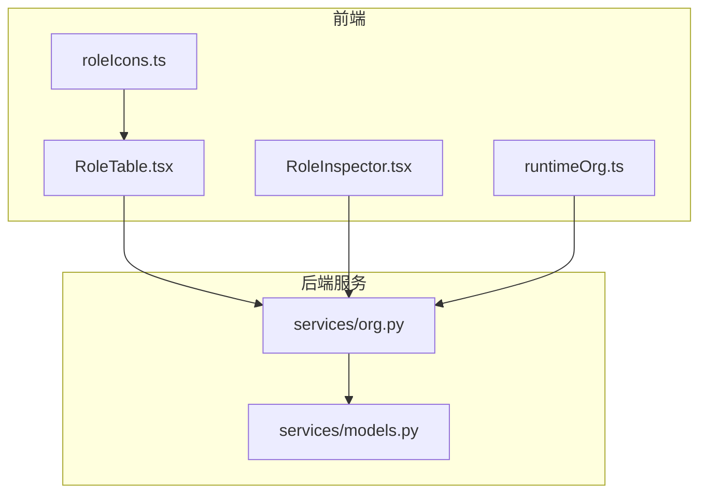
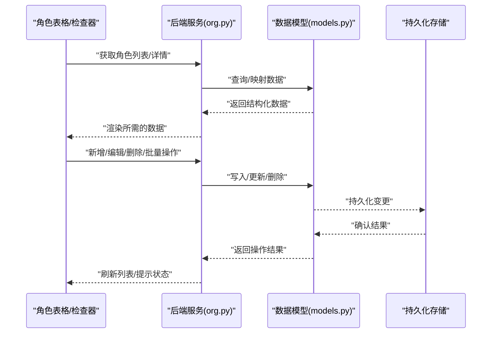
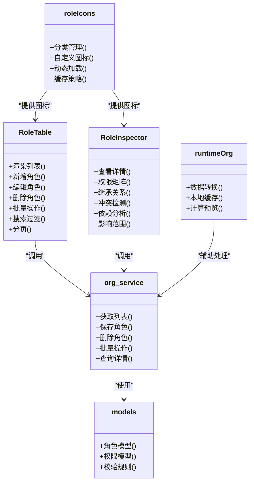

# 角色管理

<cite>
**本文引用的文件**   
- [RoleTable.tsx](file://opc/plugins/office_ui/frontend_src/org/RoleTable.tsx)
- [RoleInspector.tsx](file://opc/plugins/office_ui/frontend_src/org/RoleInspector.tsx)
- [roleIcons.ts](file://opc/plugins/office_ui/frontend_src/org/roleIcons.ts)
- [org.py](file://opc/plugins/office_ui/services/org.py)
- [models.py](file://opc/plugins/office_ui/services/models.py)
- [runtimeOrg.ts](file://opc/plugins/office_ui/frontend_src/org/lib/runtimeOrg.ts)
- [test_org_saved_crud.py](file://tests/test_org_saved_crud.py)
- [test_company_role_session_behavior.py](file://tests/test_company_role_session_behavior.py)
</cite>

## 目录
1. [简介](#简介)
2. [项目结构](#项目结构)
3. [核心组件](#核心组件)
4. [架构总览](#架构总览)
5. [详细组件分析](#详细组件分析)
6. [依赖关系分析](#依赖关系分析)
7. [性能考虑](#性能考虑)
8. [故障排查指南](#故障排查指南)
9. [结论](#结论)
10. [附录](#附录)

## 简介
本章节面向OpenOPC的角色管理模块，聚焦于以下能力：
- 角色表格的CRUD操作（新增、编辑、删除与批量操作）
- 权限配置界面（权限矩阵、继承关系、冲突检测）
- 角色图标系统（分类、自定义与动态加载）
- 角色检查器（详情展示、依赖分析与影响范围评估）
- 搜索与过滤（多条件筛选、排序、分页）
- 角色模板与预设（内置库与自定义模板管理）
- 变更历史与回滚机制

该文档以代码级事实为依据，结合前端与后端服务交互流程，提供从用户界面到数据持久化的完整说明。

## 项目结构
角色管理相关的前端页面与服务接口主要位于以下位置：
- 前端组织视图与表格：org目录下的RoleTable.tsx、RoleInspector.tsx
- 图标资源与动态加载：org/roleIcons.ts
- 运行时组织模型与工具：org/lib/runtimeOrg.ts
- 后端服务封装：services/org.py、services/models.py
- 测试用例：tests下与组织保存、角色会话行为相关的单测

图表来源
- [RoleTable.tsx](file://opc/plugins/office_ui/frontend_src/org/RoleTable.tsx)
- [RoleInspector.tsx](file://opc/plugins/office_ui/frontend_src/org/RoleInspector.tsx)
- [roleIcons.ts](file://opc/plugins/office_ui/frontend_src/org/roleIcons.ts)
- [runtimeOrg.ts](file://opc/plugins/office_ui/frontend_src/org/lib/runtimeOrg.ts)
- [org.py](file://opc/plugins/office_ui/services/org.py)
- [models.py](file://opc/plugins/office_ui/services/models.py)

章节来源
- [RoleTable.tsx](file://opc/plugins/office_ui/frontend_src/org/RoleTable.tsx)
- [RoleInspector.tsx](file://opc/plugins/office_ui/frontend_src/org/RoleInspector.tsx)
- [roleIcons.ts](file://opc/plugins/office_ui/frontend_src/org/roleIcons.ts)
- [runtimeOrg.ts](file://opc/plugins/office_ui/frontend_src/org/lib/runtimeOrg.ts)
- [org.py](file://opc/plugins/office_ui/services/org.py)
- [models.py](file://opc/plugins/office_ui/services/models.py)

## 核心组件
本节概述角色管理的核心组件及其职责：
- 角色表格（RoleTable）：负责角色的列表展示、新增、编辑、删除与批量操作入口；承载搜索、过滤、排序与分页控制。
- 角色检查器（RoleInspector）：用于查看角色详情、权限矩阵、继承关系、依赖分析与影响范围评估。
- 图标系统（roleIcons）：维护图标分类、默认图标集、自定义图标注册与动态加载策略。
- 运行时组织工具（runtimeOrg）：提供组织与角色数据的本地处理、转换与缓存逻辑。
- 后端服务（org.py/models.py）：封装对组织与角色数据的读写、校验与持久化。

章节来源
- [RoleTable.tsx](file://opc/plugins/office_ui/frontend_src/org/RoleTable.tsx)
- [RoleInspector.tsx](file://opc/plugins/office_ui/frontend_src/org/RoleInspector.tsx)
- [roleIcons.ts](file://opc/plugins/office_ui/frontend_src/org/roleIcons.ts)
- [runtimeOrg.ts](file://opc/plugins/office_ui/frontend_src/org/lib/runtimeOrg.ts)
- [org.py](file://opc/plugins/office_ui/services/org.py)
- [models.py](file://opc/plugins/office_ui/services/models.py)

## 架构总览
角色管理采用前后端分离的架构：前端通过服务层调用后端API完成角色数据的增删改查与批量操作；图标系统与检查器作为独立子模块，分别负责UI表现与分析能力。

图表来源
- [RoleTable.tsx](file://opc/plugins/office_ui/frontend_src/org/RoleTable.tsx)
- [RoleInspector.tsx](file://opc/plugins/office_ui/frontend_src/org/RoleInspector.tsx)
- [org.py](file://opc/plugins/office_ui/services/org.py)
- [models.py](file://opc/plugins/office_ui/services/models.py)

## 详细组件分析

### 角色表格（CRUD与批量操作）
- 新增：通过表单或弹窗创建新角色，提交后触发后端保存并刷新列表。
- 编辑：选择行进入编辑模式，修改字段后保存，后端校验并更新。
- 删除：支持单条删除与批量删除，删除前进行二次确认与依赖检查。
- 批量操作：支持批量启用/禁用、批量分配权限等，统一由后端事务处理。
- 搜索与过滤：支持按名称、标签、状态等多条件筛选；支持按创建时间、名称等字段排序；分页参数由前端维护并在请求中传递。
- 错误处理：网络异常、校验失败时给出明确提示，并提供重试或修正建议。

章节来源
- [RoleTable.tsx](file://opc/plugins/office_ui/frontend_src/org/RoleTable.tsx)
- [org.py](file://opc/plugins/office_ui/services/org.py)
- [models.py](file://opc/plugins/office_ui/services/models.py)

### 权限配置界面（矩阵、继承与冲突检测）
- 权限矩阵：以网格形式展示角色与权限项的对应关系，支持勾选/取消快速配置。
- 继承关系：显示父角色与子角色的继承链，自动合并权限集合，避免重复配置。
- 冲突检测：当同一权限在不同层级存在互斥设置时，界面高亮提示并阻止非法提交。
- 实时预览：在保存前提供权限计算预览，帮助管理员理解最终生效权限。

章节来源
- [RoleInspector.tsx](file://opc/plugins/office_ui/frontend_src/org/RoleInspector.tsx)
- [org.py](file://opc/plugins/office_ui/services/org.py)
- [models.py](file://opc/plugins/office_ui/services/models.py)

### 角色图标系统（分类、自定义与动态加载）
- 图标分类：将图标按功能域分组（如通用、业务、运维等），便于在表格与检查器中快速识别。
- 自定义图标：允许用户上传或选择SVG/图片资源，并绑定到特定角色。
- 动态加载：根据当前主题与分辨率按需加载图标资源，减少首屏体积。
- 缓存策略：浏览器缓存已加载图标，切换角色时优先命中缓存。

章节来源
- [roleIcons.ts](file://opc/plugins/office_ui/frontend_src/org/roleIcons.ts)
- [RoleTable.tsx](file://opc/plugins/office_ui/frontend_src/org/RoleTable.tsx)
- [RoleInspector.tsx](file://opc/plugins/office_ui/frontend_src/org/RoleInspector.tsx)

### 角色检查器（详情、依赖与影响范围）
- 详情展示：集中展示角色基本信息、权限集合、成员与任务关联。
- 依赖分析：解析角色对其他角色或资源的引用关系，生成依赖图。
- 影响范围：评估删除或修改某角色可能影响的会话、任务与工作项，辅助安全变更。
- 可视化：以树状或图形式呈现依赖与影响范围，支持展开/折叠与导出。

章节来源
- [RoleInspector.tsx](file://opc/plugins/office_ui/frontend_src/org/RoleInspector.tsx)
- [runtimeOrg.ts](file://opc/plugins/office_ui/frontend_src/org/lib/runtimeOrg.ts)
- [org.py](file://opc/plugins/office_ui/services/org.py)

### 搜索与过滤（多条件、排序与分页）
- 多条件筛选：支持按名称、标签、状态、创建时间区间等组合查询。
- 排序：支持按关键字段升序/降序排列，保持用户体验一致。
- 分页：前端维护页码与每页数量，向后端发起分页请求，提升大数据量场景的性能。
- 结果反馈：无结果时提供空态提示与快捷重置按钮。

章节来源
- [RoleTable.tsx](file://opc/plugins/office_ui/frontend_src/org/RoleTable.tsx)
- [org.py](file://opc/plugins/office_ui/services/org.py)

### 角色模板与预设（内置库与自定义管理）
- 内置角色库：提供常用角色模板（如开发者、测试、运维等），一键应用。
- 自定义模板：管理员可保存当前角色配置为模板，供团队复用。
- 版本兼容：模板升级时提供迁移提示与差异对比，确保平滑过渡。
- 导入导出：支持模板的导入导出，便于跨环境共享。

章节来源
- [RoleTable.tsx](file://opc/plugins/office_ui/frontend_src/org/RoleTable.tsx)
- [org.py](file://opc/plugins/office_ui/services/org.py)

### 变更历史与回滚机制
- 变更记录：记录角色的关键变更（创建、编辑、删除、权限调整），包含操作人、时间与摘要。
- 快照对比：支持查看任意两个版本的差异，突出显示新增、删除与修改项。
- 回滚操作：基于最近有效快照执行回滚，确保一致性并保留审计轨迹。
- 并发控制：使用乐观锁或版本号防止覆盖式更新。

章节来源
- [org.py](file://opc/plugins/office_ui/services/org.py)
- [models.py](file://opc/plugins/office_ui/services/models.py)
- [test_org_saved_crud.py](file://tests/test_org_saved_crud.py)

## 依赖关系分析
角色管理模块内部依赖如下：
- RoleTable与RoleInspector均依赖后端服务org.py进行数据访问。
- roleIcons为UI层提供图标资源，被表格与检查器共同消费。
- runtimeOrg在前端侧提供组织与角色的数据处理能力，降低后端压力。
- models.py定义数据结构与校验规则，保证前后端契约一致。

图表来源
- [RoleTable.tsx](file://opc/plugins/office_ui/frontend_src/org/RoleTable.tsx)
- [RoleInspector.tsx](file://opc/plugins/office_ui/frontend_src/org/RoleInspector.tsx)
- [roleIcons.ts](file://opc/plugins/office_ui/frontend_src/org/roleIcons.ts)
- [runtimeOrg.ts](file://opc/plugins/office_ui/frontend_src/org/lib/runtimeOrg.ts)
- [org.py](file://opc/plugins/office_ui/services/org.py)
- [models.py](file://opc/plugins/office_ui/services/models.py)

章节来源
- [RoleTable.tsx](file://opc/plugins/office_ui/frontend_src/org/RoleTable.tsx)
- [RoleInspector.tsx](file://opc/plugins/office_ui/frontend_src/org/RoleInspector.tsx)
- [roleIcons.ts](file://opc/plugins/office_ui/frontend_src/org/roleIcons.ts)
- [runtimeOrg.ts](file://opc/plugins/office_ui/frontend_src/org/lib/runtimeOrg.ts)
- [org.py](file://opc/plugins/office_ui/services/org.py)
- [models.py](file://opc/plugins/office_ui/services/models.py)

## 性能考虑
- 列表分页与懒加载：避免一次性加载大量角色数据，提升首屏响应速度。
- 图标按需加载：仅在当前视图需要的图标进行加载，减少带宽占用。
- 权限计算缓存：对复杂继承与合并逻辑的结果进行缓存，减少重复计算。
- 批量操作事务化：在后端以事务方式处理批量变更，降低多次往返开销。

[本节为通用性能指导，不直接分析具体文件]

## 故障排查指南
- 列表无法加载：检查后端服务是否可用、网络请求是否成功、分页参数是否正确。
- 权限冲突报错：查看冲突检测提示，定位互斥权限项，调整继承或覆盖策略。
- 图标未显示：确认图标资源路径与类型，检查浏览器缓存与CDN可用性。
- 删除失败：检查是否存在依赖引用，先解除依赖再执行删除。
- 回滚异常：核对快照版本与并发锁，确保回滚目标存在且未被覆盖。

章节来源
- [org.py](file://opc/plugins/office_ui/services/org.py)
- [models.py](file://opc/plugins/office_ui/services/models.py)
- [test_org_saved_crud.py](file://tests/test_org_saved_crud.py)
- [test_company_role_session_behavior.py](file://tests/test_company_role_session_behavior.py)

## 结论
角色管理模块通过清晰的前后端分层与模块化设计，提供了完整的角色生命周期管理能力。权限矩阵与冲突检测增强了配置安全性，图标系统与检查器提升了可观测性与易用性。配合搜索过滤、模板预设与变更历史回滚，能够满足企业级组织的精细化治理需求。

[本节为总结性内容，不直接分析具体文件]

## 附录
- 术语表
  - 角色：一组权限与属性的集合，用于限定主体可执行的操作。
  - 权限矩阵：以二维表格形式展示角色与权限项的对应关系。
  - 继承关系：子角色自动获得父角色权限的配置模式。
  - 冲突检测：在权限配置过程中发现互斥设置的机制。
  - 影响范围：角色变更可能波及的资源与实体集合。
  - 模板：可复用的角色配置快照。
  - 回滚：将系统状态恢复到历史某个快照的操作。

[本节为概念性内容，不直接分析具体文件]