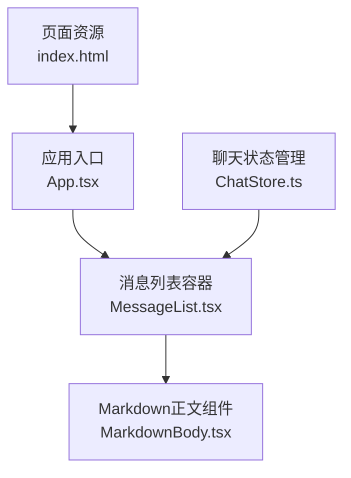
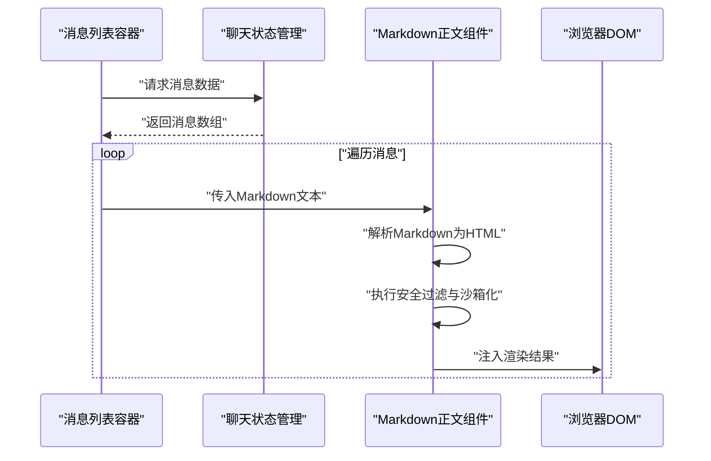
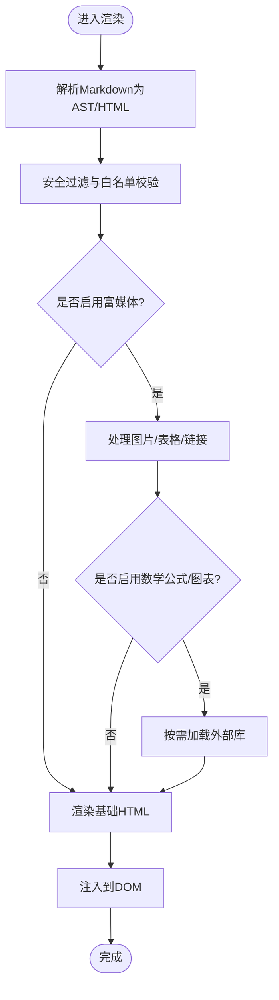
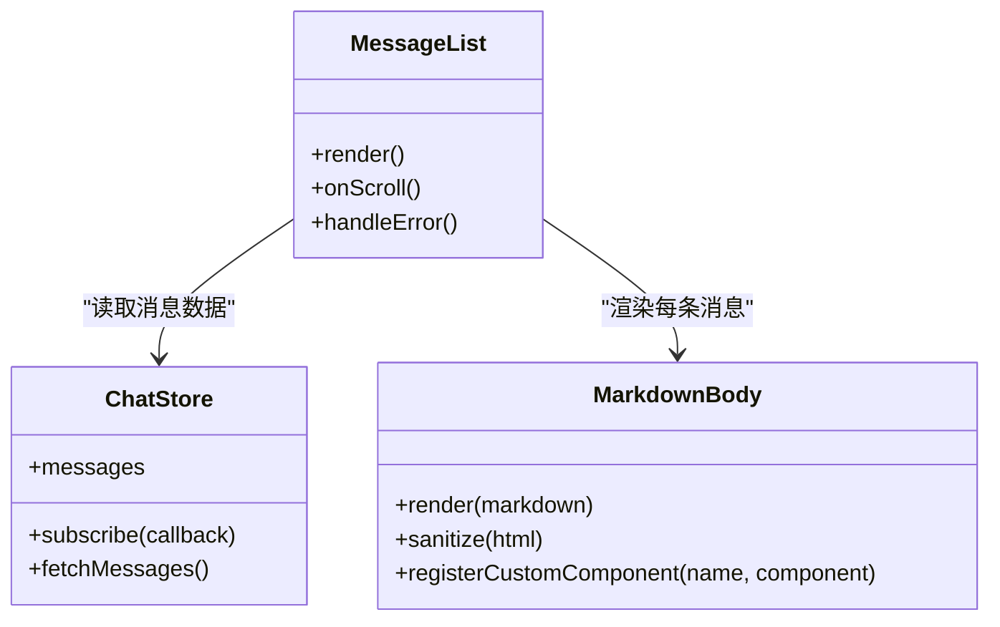
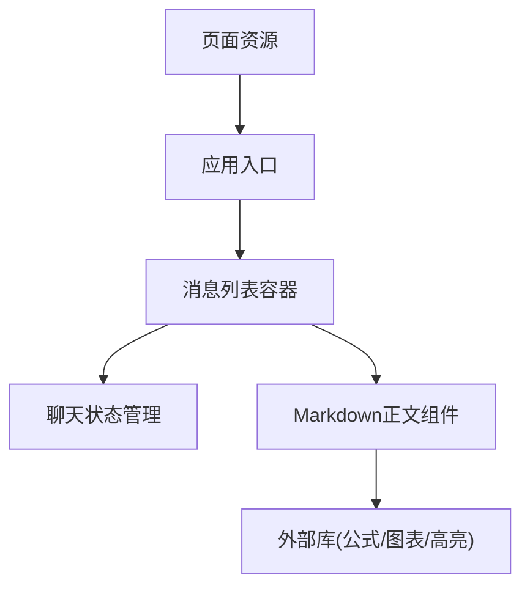

# Markdown内容渲染

<cite>
**本文引用的文件**   
- [MarkdownBody.tsx](file://opc/plugins/office_ui/frontend_src/chat/MarkdownBody.tsx)
- [MessageList.tsx](file://opc/plugins/office_ui/frontend_src/chat/MessageList.tsx)
- [ChatStore.ts](file://opc/plugins/office_ui/frontend_src/chat/ChatStore.ts)
- [App.tsx](file://opc/plugins/office_ui/frontend_src/App.tsx)
- [index.html](file://opc/plugins/office_ui/frontend_dist/assets/index.html)
</cite>

## 目录
1. [简介](#简介)
2. [项目结构](#项目结构)
3. [核心组件](#核心组件)
4. [架构总览](#架构总览)
5. [详细组件分析](#详细组件分析)
6. [依赖关系分析](#依赖关系分析)
7. [性能考虑](#性能考虑)
8. [故障排查指南](#故障排查指南)
9. [结论](#结论)
10. [附录](#附录)

## 简介
本文件面向OpenOPC聊天界面的Markdown渲染子系统，聚焦于前端侧的Markdown解析与渲染流程、安全沙箱机制、扩展点（自定义组件注册与样式覆盖）、富媒体处理（图片、表格、链接）、数学公式与图表渲染支持，以及模板与主题定制方法。文档同时提供性能优化与安全加固的最佳实践建议，帮助开发者在保障安全的前提下获得良好的渲染体验。

## 项目结构
与Markdown渲染直接相关的前端代码位于 office_ui 插件的前端源码中，关键文件包括：
- 消息列表容器：负责将消息数据转换为可渲染的UI节点
- Markdown正文组件：负责将Markdown文本渲染为HTML并注入到DOM
- 聊天状态管理：负责消息数据的获取、缓存与更新
- 应用入口与页面资源：负责加载前端资源与初始化应用

图示来源
- [App.tsx](file://opc/plugins/office_ui/frontend_src/App.tsx)
- [MessageList.tsx](file://opc/plugins/office_ui/frontend_src/chat/MessageList.tsx)
- [MarkdownBody.tsx](file://opc/plugins/office_ui/frontend_src/chat/MarkdownBody.tsx)
- [ChatStore.ts](file://opc/plugins/office_ui/frontend_src/chat/ChatStore.ts)
- [index.html](file://opc/plugins/office_ui/frontend_dist/assets/index.html)

章节来源
- [App.tsx](file://opc/plugins/office_ui/frontend_src/App.tsx)
- [MessageList.tsx](file://opc/plugins/office_ui/frontend_src/chat/MessageList.tsx)
- [MarkdownBody.tsx](file://opc/plugins/office_ui/frontend_src/chat/MarkdownBody.tsx)
- [ChatStore.ts](file://opc/plugins/office_ui/frontend_src/chat/ChatStore.ts)
- [index.html](file://opc/plugins/office_ui/frontend_dist/assets/index.html)

## 核心组件
- Markdown正文组件：接收Markdown字符串，将其转换为HTML片段，并通过受控方式插入到页面中。该组件是渲染流程的核心，承担语法转换、安全过滤与富媒体处理等职责。
- 消息列表容器：遍历消息集合，将每条消息的Markdown内容交由Markdown正文组件渲染，并提供滚动、折叠、展开等交互能力。
- 聊天状态管理：维护消息队列、增量更新、去重与缓存策略，确保渲染输入的稳定性和一致性。
- 应用入口与页面资源：负责加载必要的脚本与样式，初始化全局配置（如是否启用数学公式或图表渲染）。

章节来源
- [MarkdownBody.tsx](file://opc/plugins/office_ui/frontend_src/chat/MarkdownBody.tsx)
- [MessageList.tsx](file://opc/plugins/office_ui/frontend_src/chat/MessageList.tsx)
- [ChatStore.ts](file://opc/plugins/office_ui/frontend_src/chat/ChatStore.ts)
- [App.tsx](file://opc/plugins/office_ui/frontend_src/App.tsx)
- [index.html](file://opc/plugins/office_ui/frontend_dist/assets/index.html)

## 架构总览
下图展示了从消息数据到最终渲染的端到端流程，包括状态读取、Markdown转换、安全过滤与DOM注入的关键步骤。

图示来源
- [MessageList.tsx](file://opc/plugins/office_ui/frontend_src/chat/MessageList.tsx)
- [ChatStore.ts](file://opc/plugins/office_ui/frontend_src/chat/ChatStore.ts)
- [MarkdownBody.tsx](file://opc/plugins/office_ui/frontend_src/chat/MarkdownBody.tsx)

## 详细组件分析

### Markdown正文组件（MarkdownBody）
- 功能要点
  - 将Markdown文本解析为HTML片段
  - 对生成的HTML进行安全过滤，移除潜在危险标签与事件处理器
  - 支持代码块高亮、表格、链接、图片等富媒体元素
  - 可选启用数学公式与图表渲染（通过外部库集成）
  - 暴露扩展点以注册自定义组件与覆盖默认样式
- 安全沙箱机制
  - 使用白名单策略限制允许的HTML标签与属性
  - 剥离内联事件处理器与协议不安全的链接
  - 对iframe、script、style等高风险元素进行严格管控
  - 对图片与外链资源采用受限加载策略（如仅允许HTTPS与同源）
- 扩展方法
  - 自定义组件注册：通过注册表机制将特定标记映射到React组件
  - 样式覆盖：提供CSS变量或类名约定，便于主题定制
  - 插件式渲染器：针对特殊语法（如Mermaid、KaTeX）提供可选加载与按需启用
- 富媒体处理逻辑
  - 图片：校验URL合法性与大小限制，懒加载以提升性能
  - 表格：生成标准table结构，支持响应式滚动与列宽自适应
  - 链接：自动添加目标与权限控制，必要时打开新窗口并提示风险
- 数学公式与图表
  - 数学公式：在启用时加载KaTeX或MathJax，并对公式内容进行转义与隔离
  - 图表：在启用时加载Mermaid或其他图表库，渲染前进行语法校验与错误回退

图示来源
- [MarkdownBody.tsx](file://opc/plugins/office_ui/frontend_src/chat/MarkdownBody.tsx)

章节来源
- [MarkdownBody.tsx](file://opc/plugins/office_ui/frontend_src/chat/MarkdownBody.tsx)

### 消息列表容器（MessageList）
- 功能要点
  - 订阅聊天状态变化，增量更新消息列表
  - 将每条消息的Markdown内容交给Markdown正文组件渲染
  - 提供折叠/展开、滚动定位、错误边界等交互与容错
- 与状态管理的协作
  - 通过状态管理获取消息数据，避免重复请求
  - 对长列表进行虚拟化或分页渲染，减少DOM压力

图示来源
- [MessageList.tsx](file://opc/plugins/office_ui/frontend_src/chat/MessageList.tsx)
- [ChatStore.ts](file://opc/plugins/office_ui/frontend_src/chat/ChatStore.ts)
- [MarkdownBody.tsx](file://opc/plugins/office_ui/frontend_src/chat/MarkdownBody.tsx)

章节来源
- [MessageList.tsx](file://opc/plugins/office_ui/frontend_src/chat/MessageList.tsx)
- [ChatStore.ts](file://opc/plugins/office_ui/frontend_src/chat/ChatStore.ts)

### 聊天状态管理（ChatStore）
- 功能要点
  - 维护消息队列、去重与缓存策略
  - 提供订阅与增量更新接口，保证渲染稳定性
  - 支持断线重试与错误恢复
- 与渲染的关系
  - 作为渲染的数据源，确保Markdown文本的完整性与顺序性
  - 在大数据量场景下配合虚拟列表提升性能

章节来源
- [ChatStore.ts](file://opc/plugins/office_ui/frontend_src/chat/ChatStore.ts)

### 应用入口与页面资源（App.tsx / index.html）
- 功能要点
  - 初始化全局配置（如是否启用数学公式、图表渲染）
  - 加载必要的第三方库（KaTeX、Mermaid等）
  - 挂载根组件并启动消息监听
- 与渲染的关系
  - 决定渲染能力的开关与外部依赖的加载时机
  - 提供主题与样式的初始注入点

章节来源
- [App.tsx](file://opc/plugins/office_ui/frontend_src/App.tsx)
- [index.html](file://opc/plugins/office_ui/frontend_dist/assets/index.html)

## 依赖关系分析
- 组件耦合
  - 消息列表容器依赖聊天状态管理与Markdown正文组件
  - Markdown正文组件可能依赖外部库（KaTeX、Mermaid）与样式资源
- 外部依赖
  - 数学公式渲染：KaTeX或MathJax
  - 图表渲染：Mermaid或其他可视化库
  - 代码高亮：Prism.js或Highlight.js
- 潜在循环依赖
  - 通过状态管理解耦数据与视图，避免组件间直接循环引用

图示来源
- [MessageList.tsx](file://opc/plugins/office_ui/frontend_src/chat/MessageList.tsx)
- [ChatStore.ts](file://opc/plugins/office_ui/frontend_src/chat/ChatStore.ts)
- [MarkdownBody.tsx](file://opc/plugins/office_ui/frontend_src/chat/MarkdownBody.tsx)
- [App.tsx](file://opc/plugins/office_ui/frontend_src/App.tsx)
- [index.html](file://opc/plugins/office_ui/frontend_dist/assets/index.html)

章节来源
- [MessageList.tsx](file://opc/plugins/office_ui/frontend_src/chat/MessageList.tsx)
- [ChatStore.ts](file://opc/plugins/office_ui/frontend_src/chat/ChatStore.ts)
- [MarkdownBody.tsx](file://opc/plugins/office_ui/frontend_src/chat/MarkdownBody.tsx)
- [App.tsx](file://opc/plugins/office_ui/frontend_src/App.tsx)
- [index.html](file://opc/plugins/office_ui/frontend_dist/assets/index.html)

## 性能考虑
- 渲染优化
  - 对长列表使用虚拟滚动或分页加载，减少DOM节点数量
  - 对Markdown内容做增量更新，避免整段重渲染
  - 对图片与外部资源启用懒加载与预连接
- 外部库按需加载
  - 仅在用户可见区域或显式启用时加载KaTeX、Mermaid等重型库
  - 对代码高亮库进行分片加载与语言按需激活
- 内存与CPU
  - 及时释放不再使用的渲染结果与事件监听器
  - 对复杂Markdown进行预处理与缓存，降低重复计算

[本节为通用指导，无需具体文件来源]

## 故障排查指南
- 常见问题
  - 数学公式未显示：检查是否启用相应开关与外部库是否成功加载
  - 图表渲染失败：确认Mermaid语法正确且库已加载；查看控制台错误信息
  - 图片无法加载：检查URL协议与跨域策略，确认资源可达
  - 代码高亮异常：确认语言标识符与高亮库版本兼容
- 调试建议
  - 在Markdown正文组件中添加日志输出，跟踪解析与过滤阶段
  - 使用浏览器开发者工具审查DOM结构与样式注入情况
  - 对安全过滤规则进行单元测试，验证白名单策略的有效性

章节来源
- [MarkdownBody.tsx](file://opc/plugins/office_ui/frontend_src/chat/MarkdownBody.tsx)

## 结论
OpenOPC聊天界面的Markdown渲染子系统通过清晰的组件分层、严格的安全沙箱与可扩展的渲染机制，在保证安全性的前提下提供了丰富的富媒体与数学公式、图表渲染能力。结合按需加载与虚拟滚动等性能优化手段，可在大规模消息场景下保持流畅的用户体验。建议在生产环境中持续完善安全策略与监控告警，并根据业务需求灵活扩展自定义组件与主题样式。

[本节为总结性内容，无需具体文件来源]

## 附录
- 模板与主题定制指南
  - 通过CSS变量与类名约定覆盖默认样式
  - 在应用入口集中注入主题资源与全局配置
  - 利用Markdown正文组件的扩展点注册自定义组件，实现业务特定的渲染逻辑
- 最佳实践
  - 始终启用安全过滤与白名单策略
  - 对第三方库进行版本锁定与最小化引入
  - 对渲染结果进行自动化测试与回归验证

[本节为补充说明，无需具体文件来源]