# 实时通信机制

<cite>
**本文引用的文件**   
- [ws_handler.py](file://opc/plugins/office_ui/ws_handler.py)
- [server.py](file://opc/plugins/office_ui/server.py)
- [wsClient.ts](file://opc/plugins/office_ui/frontend_src/lib/wsClient.ts)
- [collabSync.ts](file://opc/plugins/office_ui/frontend_src/lib/collabSync.ts)
- [comms.py](file://opc/plugins/office_ui/services/comms.py)
- [event_adapter.py](file://opc/plugins/office_ui/event_adapter.py)
- [chat_store.py](file://opc/plugins/office_ui/chat_store.py)
- [session.py](file://opc/channels/session.py)
- [message_bus.py](file://opc/layer0_interaction/message_bus.py)
- [heartbeat.py](file://opc/layer2_organization/heartbeat.py)
- [collaboration_service.py](file://opc/layer2_organization/collaboration_service.py)
- [collaboration_rpc.py](file://opc/layer4_tools/collaboration_rpc.py)
- [collaboration_dispatch.py](file://opc/layer4_tools/collaboration_dispatch.py)
</cite>

## 目录
1. [简介](#简介)
2. [项目结构](#项目结构)
3. [核心组件](#核心组件)
4. [架构总览](#架构总览)
5. [详细组件分析](#详细组件分析)
6. [依赖关系分析](#依赖关系分析)
7. [性能考虑](#性能考虑)
8. [故障排查指南](#故障排查指南)
9. [结论](#结论)
10. [附录](#附录)

## 简介
本文件面向OpenOPC聊天界面的实时通信机制，聚焦于WebSocket客户端与服务端交互、消息协议与序列化、协作同步（多人编辑冲突解决与状态一致性）、消息队列与优先级、离线消息处理与同步策略、连接监控与故障恢复，以及安全认证与权限控制。文档以代码级实现为依据，结合前后端关键模块进行系统化说明，并提供可视化图示帮助理解。

## 项目结构
与实时通信相关的核心位置：
- 前端WebSocket客户端与协作同步库：frontend_src/lib/wsClient.ts、frontend_src/lib/collabSync.ts
- 后端WebSocket处理器与HTTP服务：ws_handler.py、server.py
- 服务层通信封装与事件适配：services/comms.py、event_adapter.py
- 会话与消息总线：channels/session.py、layer0_interaction/message_bus.py
- 心跳与协作服务：layer2_organization/heartbeat.py、layer2_organization/collaboration_service.py
- 协作RPC与分发：layer4_tools/collaboration_rpc.py、layer4_tools/collaboration_dispatch.py

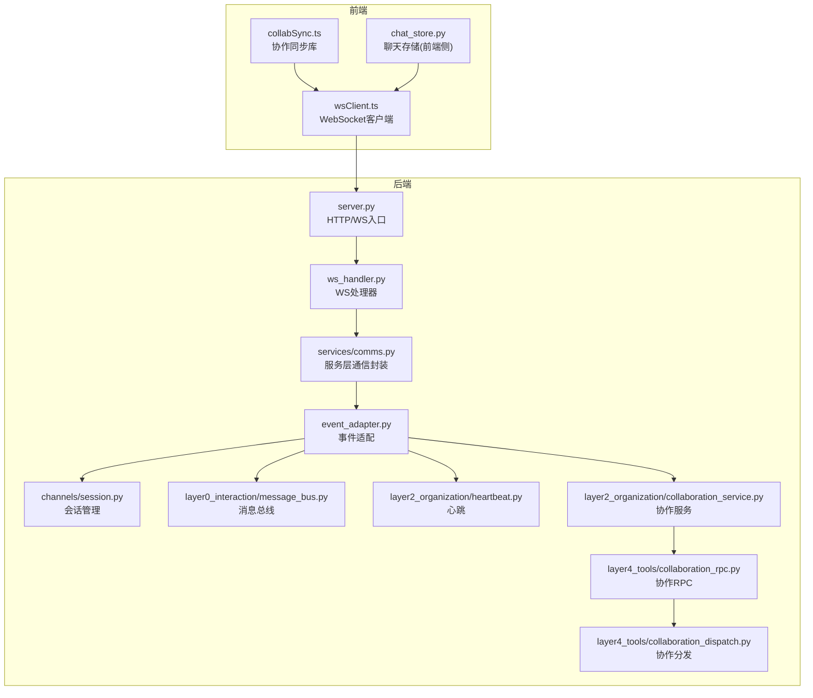

图表来源
- [wsClient.ts](file://opc/plugins/office_ui/frontend_src/lib/wsClient.ts)
- [collabSync.ts](file://opc/plugins/office_ui/frontend_src/lib/collabSync.ts)
- [server.py](file://opc/plugins/office_ui/server.py)
- [ws_handler.py](file://opc/plugins/office_ui/ws_handler.py)
- [comms.py](file://opc/plugins/office_ui/services/comms.py)
- [event_adapter.py](file://opc/plugins/office_ui/event_adapter.py)
- [session.py](file://opc/channels/session.py)
- [message_bus.py](file://opc/layer0_interaction/message_bus.py)
- [heartbeat.py](file://opc/layer2_organization/heartbeat.py)
- [collaboration_service.py](file://opc/layer2_organization/collaboration_service.py)
- [collaboration_rpc.py](file://opc/layer4_tools/collaboration_rpc.py)
- [collaboration_dispatch.py](file://opc/layer4_tools/collaboration_dispatch.py)

章节来源
- [ws_handler.py](file://opc/plugins/office_ui/ws_handler.py)
- [server.py](file://opc/plugins/office_ui/server.py)
- [wsClient.ts](file://opc/plugins/office_ui/frontend_src/lib/wsClient.ts)
- [collabSync.ts](file://opc/plugins/office_ui/frontend_src/lib/collabSync.ts)
- [comms.py](file://opc/plugins/office_ui/services/comms.py)
- [event_adapter.py](file://opc/plugins/office_ui/event_adapter.py)
- [session.py](file://opc/channels/session.py)
- [message_bus.py](file://opc/layer0_interaction/message_bus.py)
- [heartbeat.py](file://opc/layer2_organization/heartbeat.py)
- [collaboration_service.py](file://opc/layer2_organization/collaboration_service.py)
- [collaboration_rpc.py](file://opc/layer4_tools/collaboration_rpc.py)
- [collaboration_dispatch.py](file://opc/layer4_tools/collaboration_dispatch.py)

## 核心组件
- WebSocket客户端(wsClient.ts)：负责建立连接、心跳检测、断线重连、消息发送与接收、错误处理与状态上报。
- 协作同步(collabSync.ts)：提供基于操作转换或CRDT的协同编辑能力，维护本地与远端一致状态，处理并发冲突。
- 后端WS处理器(ws_handler.py)：接入HTTP服务，鉴权与会话绑定，路由消息到服务层，广播与订阅。
- 服务层通信(comms.py)：统一对外接口，封装消息序列化和反序列化，协调事件适配器与业务服务。
- 事件适配器(event_adapter.py)：将外部事件转换为内部事件模型，驱动会话、消息总线、心跳与协作服务。
- 会话(session.py)：管理用户会话上下文、权限与资源访问范围。
- 消息总线(message_bus.py)：进程内事件分发与订阅，解耦各子系统。
- 心跳(heartbeat.py)：服务端心跳探测与超时清理。
- 协作服务(collaboration_service.py)：编排协作流程，调用协作RPC与分发器。
- 协作RPC(collaboration_rpc.py)：定义协作操作的RPC接口与参数契约。
- 协作分发(collaboration_dispatch.py)：根据目标对象与权限选择具体执行者。

章节来源
- [wsClient.ts](file://opc/plugins/office_ui/frontend_src/lib/wsClient.ts)
- [collabSync.ts](file://opc/plugins/office_ui/frontend_src/lib/collabSync.ts)
- [ws_handler.py](file://opc/plugins/office_ui/ws_handler.py)
- [comms.py](file://opc/plugins/office_ui/services/comms.py)
- [event_adapter.py](file://opc/plugins/office_ui/event_adapter.py)
- [session.py](file://opc/channels/session.py)
- [message_bus.py](file://opc/layer0_interaction/message_bus.py)
- [heartbeat.py](file://opc/layer2_organization/heartbeat.py)
- [collaboration_service.py](file://opc/layer2_organization/collaboration_service.py)
- [collaboration_rpc.py](file://opc/layer4_tools/collaboration_rpc.py)
- [collaboration_dispatch.py](file://opc/layer4_tools/collaboration_dispatch.py)

## 架构总览
整体采用“前端WS客户端 + 后端WS处理器 + 服务层 + 事件总线”的分层架构。前端通过wsClient.ts维持长连接，使用collabSync.ts保证多人编辑一致性；后端ws_handler.py完成鉴权与会话绑定，将消息交由comms.py进行序列化与路由，event_adapter.py将外部事件转为内部事件，驱动session、message_bus、heartbeat与collaboration_service等子系统。

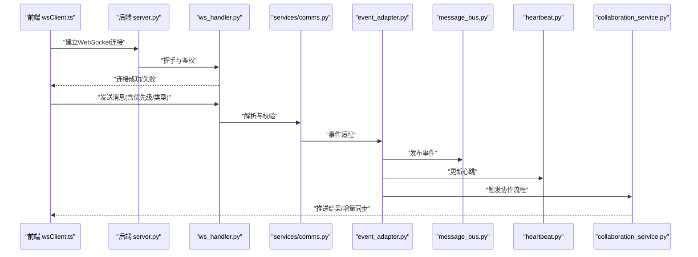

图表来源
- [wsClient.ts](file://opc/plugins/office_ui/frontend_src/lib/wsClient.ts)
- [server.py](file://opc/plugins/office_ui/server.py)
- [ws_handler.py](file://opc/plugins/office_ui/ws_handler.py)
- [comms.py](file://opc/plugins/office_ui/services/comms.py)
- [event_adapter.py](file://opc/plugins/office_ui/event_adapter.py)
- [message_bus.py](file://opc/layer0_interaction/message_bus.py)
- [heartbeat.py](file://opc/layer2_organization/heartbeat.py)
- [collaboration_service.py](file://opc/layer2_organization/collaboration_service.py)

## 详细组件分析

### WebSocket客户端实现(wsClient.ts)
- 连接建立：在页面初始化时尝试建立WebSocket连接，携带必要的认证信息与会话标识。
- 心跳检测：周期性发送心跳帧，若服务端无响应则判定为异常并触发重连。
- 断线重连：采用指数退避策略，避免雪崩；支持最大重试次数与上限间隔。
- 消息发送与接收：对消息进行序列化与优先级标记；按类型分派到不同处理器。
- 错误处理：捕获网络异常、协议错误与业务错误，记录日志并上报状态。
- 状态上报：向UI层暴露连接状态、重连次数、最近错误等信息。

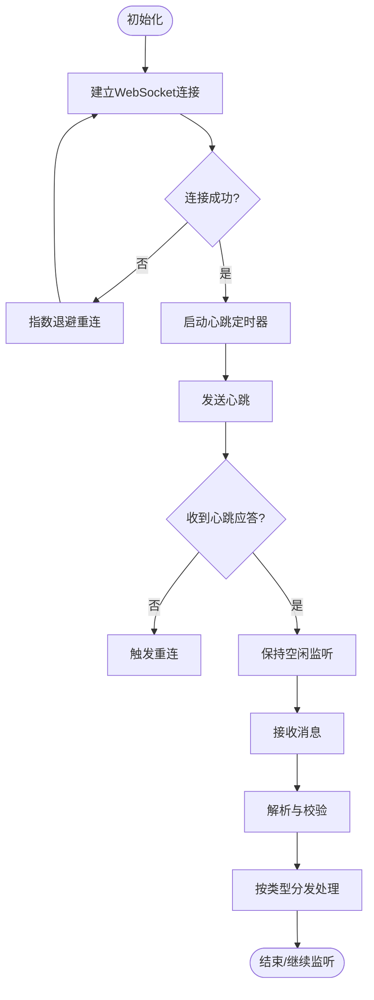

图表来源
- [wsClient.ts](file://opc/plugins/office_ui/frontend_src/lib/wsClient.ts)

章节来源
- [wsClient.ts](file://opc/plugins/office_ui/frontend_src/lib/wsClient.ts)

### 协作同步功能(collabSync.ts)
- 冲突解决：采用操作转换(OT)或CRDT策略，确保多端编辑最终一致。
- 状态一致性：维护本地版本向量与远端确认号，应用增量变更。
- 合并策略：对插入、删除、替换等操作进行归一化与排序，避免乱序。
- 乐观更新：先本地应用再等待服务端确认，失败时回滚。
- 冲突提示：当检测到不可自动解决的冲突时，提示用户介入。

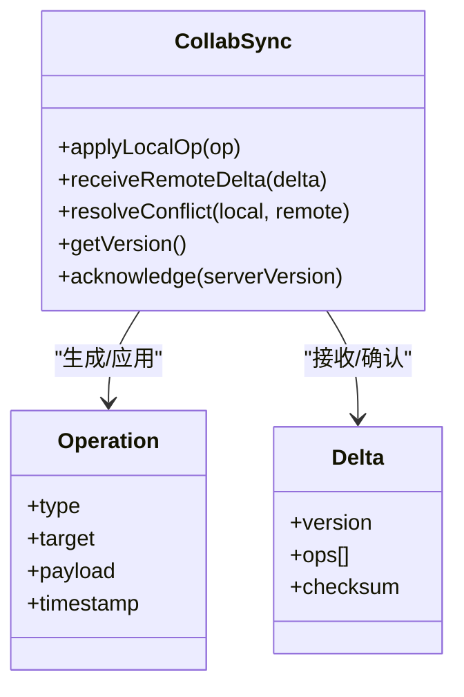

图表来源
- [collabSync.ts](file://opc/plugins/office_ui/frontend_src/lib/collabSync.ts)

章节来源
- [collabSync.ts](file://opc/plugins/office_ui/frontend_src/lib/collabSync.ts)

### 后端WS处理器(ws_handler.py)
- 鉴权与会话绑定：在握手阶段验证令牌与会话有效性，绑定用户身份与权限。
- 消息路由：根据消息类型路由至对应处理器，支持优先级队列。
- 广播与订阅：将系统事件广播给相关会话，支持细粒度频道。
- 错误与限流：对非法请求返回明确错误码，实施速率限制保护。

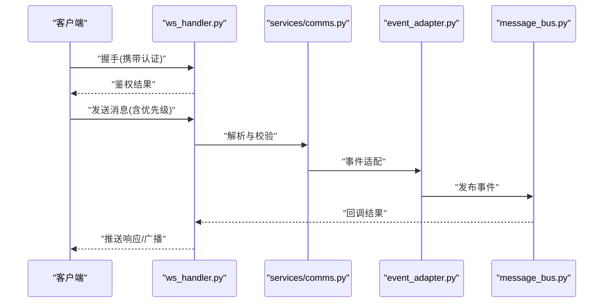

图表来源
- [ws_handler.py](file://opc/plugins/office_ui/ws_handler.py)
- [comms.py](file://opc/plugins/office_ui/services/comms.py)
- [event_adapter.py](file://opc/plugins/office_ui/event_adapter.py)
- [message_bus.py](file://opc/layer0_interaction/message_bus.py)

章节来源
- [ws_handler.py](file://opc/plugins/office_ui/ws_handler.py)
- [comms.py](file://opc/plugins/office_ui/services/comms.py)
- [event_adapter.py](file://opc/plugins/office_ui/event_adapter.py)
- [message_bus.py](file://opc/layer0_interaction/message_bus.py)

### 服务层通信与事件适配(comms.py、event_adapter.py)
- comms.py：统一消息序列化/反序列化，封装业务接口，协调事件适配器与业务服务。
- event_adapter.py：将外部事件转换为内部事件模型，驱动会话、消息总线、心跳与协作服务。

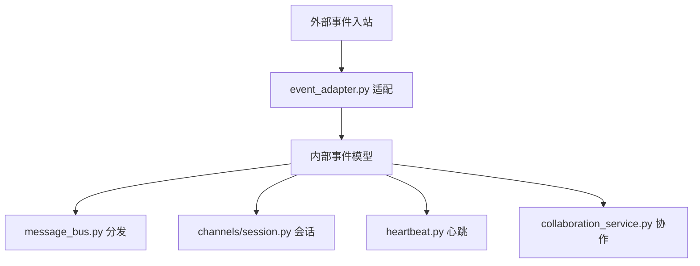

图表来源
- [comms.py](file://opc/plugins/office_ui/services/comms.py)
- [event_adapter.py](file://opc/plugins/office_ui/event_adapter.py)
- [session.py](file://opc/channels/session.py)
- [message_bus.py](file://opc/layer0_interaction/message_bus.py)
- [heartbeat.py](file://opc/layer2_organization/heartbeat.py)
- [collaboration_service.py](file://opc/layer2_organization/collaboration_service.py)

章节来源
- [comms.py](file://opc/plugins/office_ui/services/comms.py)
- [event_adapter.py](file://opc/plugins/office_ui/event_adapter.py)
- [session.py](file://opc/channels/session.py)
- [message_bus.py](file://opc/layer0_interaction/message_bus.py)
- [heartbeat.py](file://opc/layer2_organization/heartbeat.py)
- [collaboration_service.py](file://opc/layer2_organization/collaboration_service.py)

### 协作RPC与分发(collaboration_rpc.py、collaboration_dispatch.py)
- collaboration_rpc.py：定义协作操作的RPC接口与参数契约，确保跨模块调用的一致性。
- collaboration_dispatch.py：根据目标对象与权限选择具体执行者，支持多实例与负载均衡。

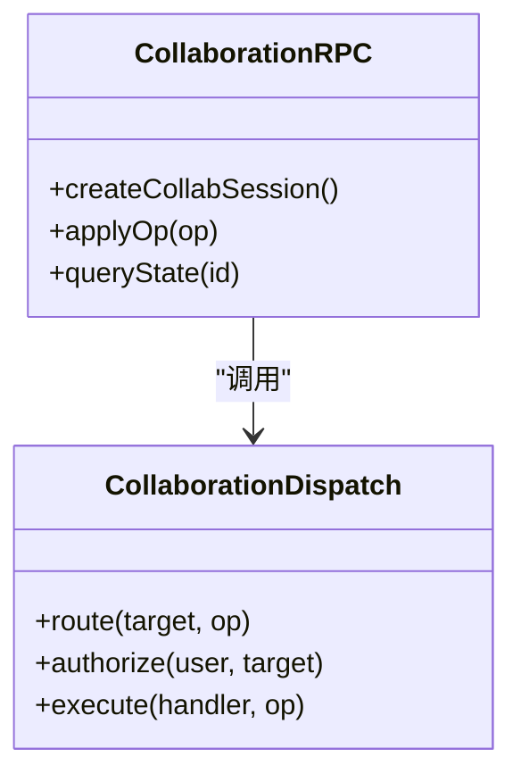

图表来源
- [collaboration_rpc.py](file://opc/layer4_tools/collaboration_rpc.py)
- [collaboration_dispatch.py](file://opc/layer4_tools/collaboration_dispatch.py)

章节来源
- [collaboration_rpc.py](file://opc/layer4_tools/collaboration_rpc.py)
- [collaboration_dispatch.py](file://opc/layer4_tools/collaboration_dispatch.py)

### 消息队列与优先级处理
- 优先级设计：消息包含优先级字段，高优先级优先处理，低优先级可批量合并。
- 队列实现：后端使用内存队列或持久化队列，按优先级出队；前端按类型与优先级缓存待发送消息。
- 背压与限流：在高负载时丢弃低优先级消息或延迟处理，保障关键路径稳定。

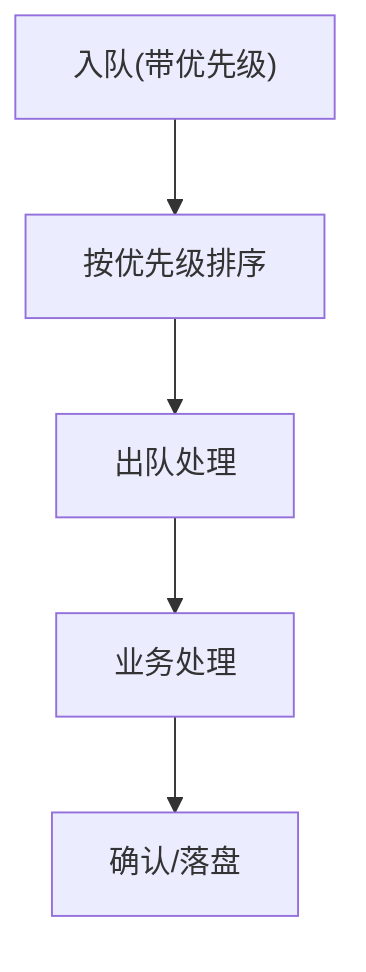

图表来源
- [ws_handler.py](file://opc/plugins/office_ui/ws_handler.py)
- [comms.py](file://opc/plugins/office_ui/services/comms.py)
- [message_bus.py](file://opc/layer0_interaction/message_bus.py)

章节来源
- [ws_handler.py](file://opc/plugins/office_ui/ws_handler.py)
- [comms.py](file://opc/plugins/office_ui/services/comms.py)
- [message_bus.py](file://opc/layer0_interaction/message_bus.py)

### 离线消息处理与同步策略
- 离线缓存：前端在网络断开时将消息写入本地队列，恢复后批量重发。
- 去重与幂等：服务端对消息进行唯一键校验，避免重复处理。
- 增量同步：客户端携带最后确认版本号，服务端返回增量差异，减少带宽消耗。
- 冲突回滚：若服务端拒绝某条消息，客户端回滚本地状态并提示用户。

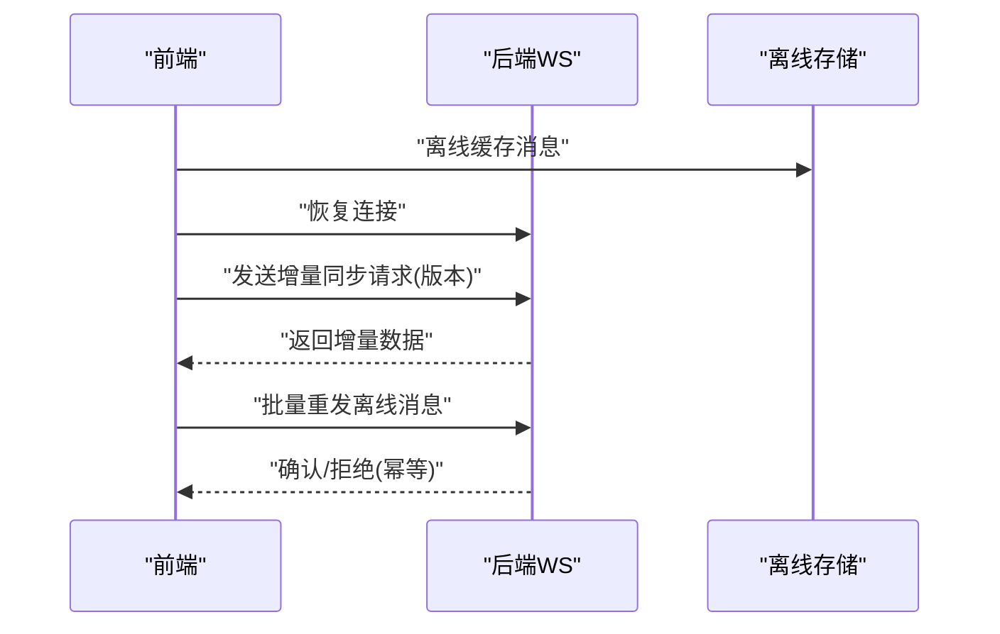

图表来源
- [wsClient.ts](file://opc/plugins/office_ui/frontend_src/lib/wsClient.ts)
- [ws_handler.py](file://opc/plugins/office_ui/ws_handler.py)
- [comms.py](file://opc/plugins/office_ui/services/comms.py)

章节来源
- [wsClient.ts](file://opc/plugins/office_ui/frontend_src/lib/wsClient.ts)
- [ws_handler.py](file://opc/plugins/office_ui/ws_handler.py)
- [comms.py](file://opc/plugins/office_ui/services/comms.py)

### 连接状态监控与故障恢复
- 监控指标：连接状态、心跳延迟、重连次数、错误码分布。
- 告警与自愈：超过阈值触发告警，自动降级或切换备用通道。
- 健康检查：定期自检与探针，快速定位问题节点。

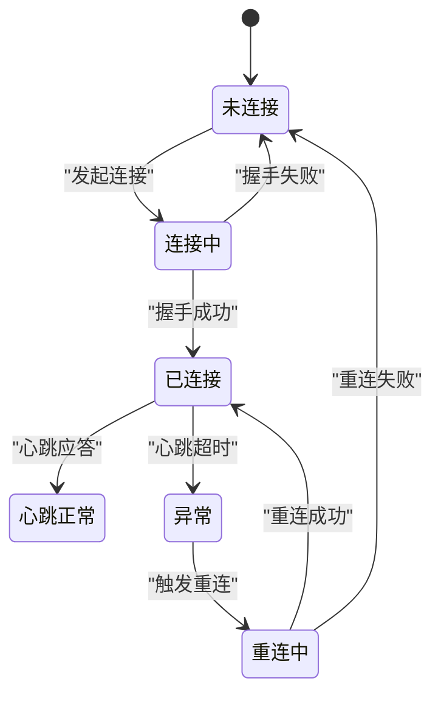

图表来源
- [wsClient.ts](file://opc/plugins/office_ui/frontend_src/lib/wsClient.ts)
- [heartbeat.py](file://opc/layer2_organization/heartbeat.py)

章节来源
- [wsClient.ts](file://opc/plugins/office_ui/frontend_src/lib/wsClient.ts)
- [heartbeat.py](file://opc/layer2_organization/heartbeat.py)

### 安全认证与权限控制
- 认证：握手阶段校验令牌与会话，绑定用户身份。
- 授权：基于会话与资源访问范围，校验用户对协作对象的读写权限。
- 审计：记录关键操作与权限决策，便于追溯。
- 防护：防重放、限流与输入校验，防止恶意攻击。

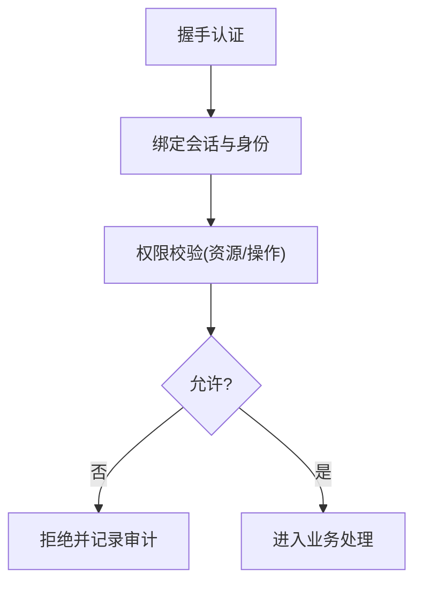

图表来源
- [ws_handler.py](file://opc/plugins/office_ui/ws_handler.py)
- [session.py](file://opc/channels/session.py)
- [collaboration_dispatch.py](file://opc/layer4_tools/collaboration_dispatch.py)

章节来源
- [ws_handler.py](file://opc/plugins/office_ui/ws_handler.py)
- [session.py](file://opc/channels/session.py)
- [collaboration_dispatch.py](file://opc/layer4_tools/collaboration_dispatch.py)

## 依赖关系分析
- 前端依赖：wsClient.ts依赖collabSync.ts进行协作同步，依赖chat_store.py进行状态持久化。
- 后端依赖：ws_handler.py依赖comms.py进行消息处理，event_adapter.py驱动session、message_bus、heartbeat与collaboration_service。
- 协作链路：collaboration_service.py通过collaboration_rpc.py调用collaboration_dispatch.py完成具体执行。

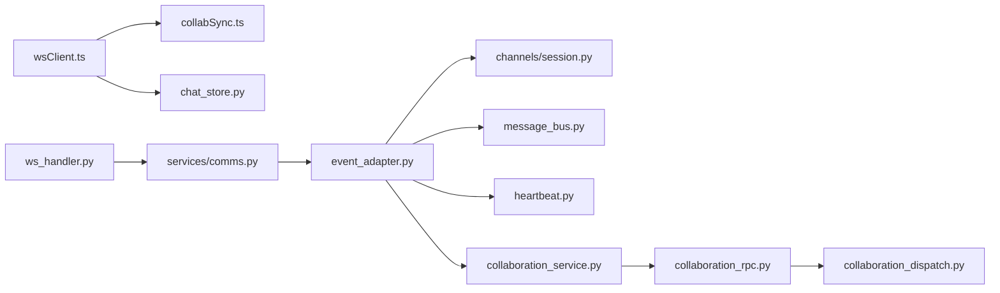

图表来源
- [wsClient.ts](file://opc/plugins/office_ui/frontend_src/lib/wsClient.ts)
- [collabSync.ts](file://opc/plugins/office_ui/frontend_src/lib/collabSync.ts)
- [chat_store.py](file://opc/plugins/office_ui/chat_store.py)
- [ws_handler.py](file://opc/plugins/office_ui/ws_handler.py)
- [comms.py](file://opc/plugins/office_ui/services/comms.py)
- [event_adapter.py](file://opc/plugins/office_ui/event_adapter.py)
- [session.py](file://opc/channels/session.py)
- [message_bus.py](file://opc/layer0_interaction/message_bus.py)
- [heartbeat.py](file://opc/layer2_organization/heartbeat.py)
- [collaboration_service.py](file://opc/layer2_organization/collaboration_service.py)
- [collaboration_rpc.py](file://opc/layer4_tools/collaboration_rpc.py)
- [collaboration_dispatch.py](file://opc/layer4_tools/collaboration_dispatch.py)

章节来源
- [wsClient.ts](file://opc/plugins/office_ui/frontend_src/lib/wsClient.ts)
- [collabSync.ts](file://opc/plugins/office_ui/frontend_src/lib/collabSync.ts)
- [chat_store.py](file://opc/plugins/office_ui/chat_store.py)
- [ws_handler.py](file://opc/plugins/office_ui/ws_handler.py)
- [comms.py](file://opc/plugins/office_ui/services/comms.py)
- [event_adapter.py](file://opc/plugins/office_ui/event_adapter.py)
- [session.py](file://opc/channels/session.py)
- [message_bus.py](file://opc/layer0_interaction/message_bus.py)
- [heartbeat.py](file://opc/layer2_organization/heartbeat.py)
- [collaboration_service.py](file://opc/layer2_organization/collaboration_service.py)
- [collaboration_rpc.py](file://opc/layer4_tools/collaboration_rpc.py)
- [collaboration_dispatch.py](file://opc/layer4_tools/collaboration_dispatch.py)

## 性能考虑
- 心跳间隔与超时：合理设置心跳周期与超时阈值，平衡实时性与资源消耗。
- 消息批处理：低优先级消息批量合并发送，降低网络开销。
- 增量同步：仅传输差异数据，减少带宽占用。
- 背压与限流：在高负载时主动丢弃或延迟非关键消息，保障核心路径。
- 索引与缓存：对高频查询的数据建立索引与缓存，提升响应速度。

[本节为通用指导，不直接分析具体文件]

## 故障排查指南
- 连接失败：检查握手鉴权参数、网络可达性与证书配置。
- 心跳超时：查看心跳日志与网络延迟，调整超时阈值。
- 重连风暴：确认指数退避策略是否生效，避免同时大量重连。
- 协作冲突：检查操作转换/CRDT实现是否正确，核对版本向量与确认号。
- 权限错误：审查会话绑定与权限策略，确认资源访问范围。
- 消息丢失：核查幂等键与去重逻辑，确认离线队列与重发机制。

章节来源
- [ws_handler.py](file://opc/plugins/office_ui/ws_handler.py)
- [wsClient.ts](file://opc/plugins/office_ui/frontend_src/lib/wsClient.ts)
- [collabSync.ts](file://opc/plugins/office_ui/frontend_src/lib/collabSync.ts)
- [heartbeat.py](file://opc/layer2_organization/heartbeat.py)

## 结论
OpenOPC聊天界面的实时通信机制通过前后端分层设计与协作同步库，实现了稳定的WebSocket连接、可靠的心跳与重连、高效的协作编辑与冲突解决、完善的离线消息处理与增量同步，以及严格的安全认证与权限控制。建议在生产环境中持续优化心跳与限流策略，完善监控与告警，确保系统在大规模并发下的稳定性与一致性。

[本节为总结性内容，不直接分析具体文件]

## 附录
- 术语表
  - OT：操作转换，用于多人编辑冲突解决
  - CRDT：无冲突复制数据类型，用于最终一致性
  - 幂等：多次执行不会产生副作用
  - 增量同步：仅传输差异数据以提升效率
- 参考实现路径
  - WebSocket客户端：[wsClient.ts](file://opc/plugins/office_ui/frontend_src/lib/wsClient.ts)
  - 协作同步库：[collabSync.ts](file://opc/plugins/office_ui/frontend_src/lib/collabSync.ts)
  - 后端WS处理器：[ws_handler.py](file://opc/plugins/office_ui/ws_handler.py)
  - 服务层通信：[comms.py](file://opc/plugins/office_ui/services/comms.py)
  - 事件适配：[event_adapter.py](file://opc/plugins/office_ui/event_adapter.py)
  - 会话管理：[session.py](file://opc/channels/session.py)
  - 消息总线：[message_bus.py](file://opc/layer0_interaction/message_bus.py)
  - 心跳：[heartbeat.py](file://opc/layer2_organization/heartbeat.py)
  - 协作服务：[collaboration_service.py](file://opc/layer2_organization/collaboration_service.py)
  - 协作RPC：[collaboration_rpc.py](file://opc/layer4_tools/collaboration_rpc.py)
  - 协作分发：[collaboration_dispatch.py](file://opc/layer4_tools/collaboration_dispatch.py)