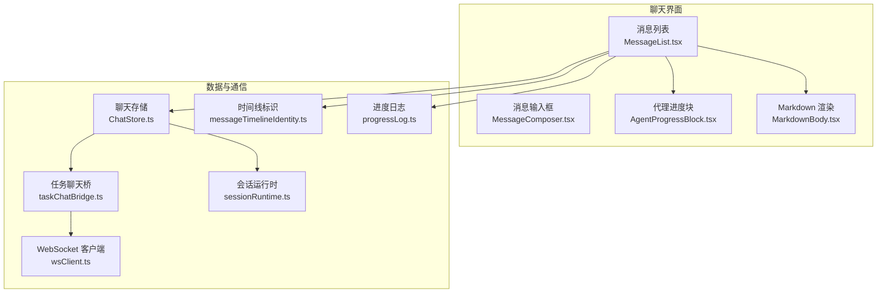
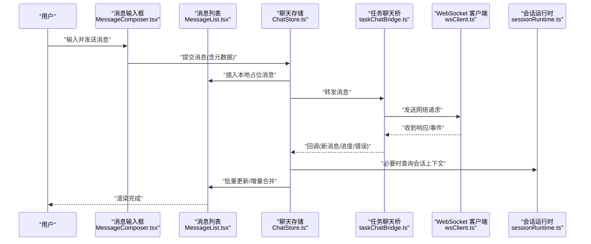
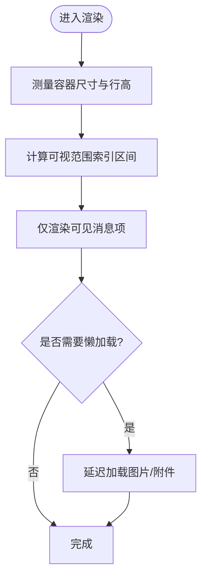
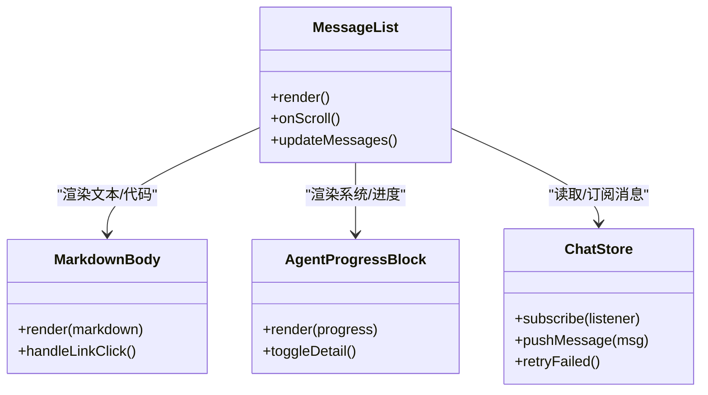
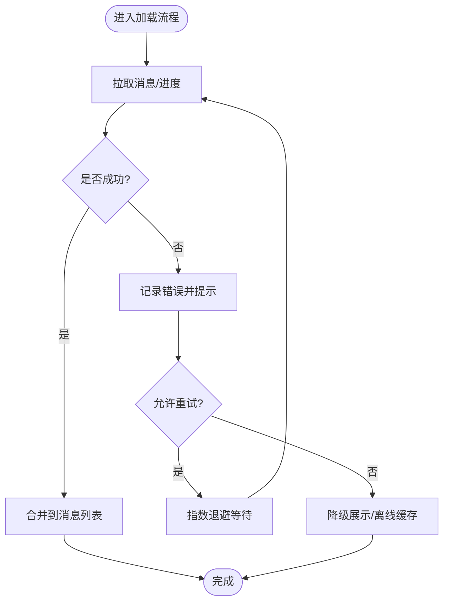
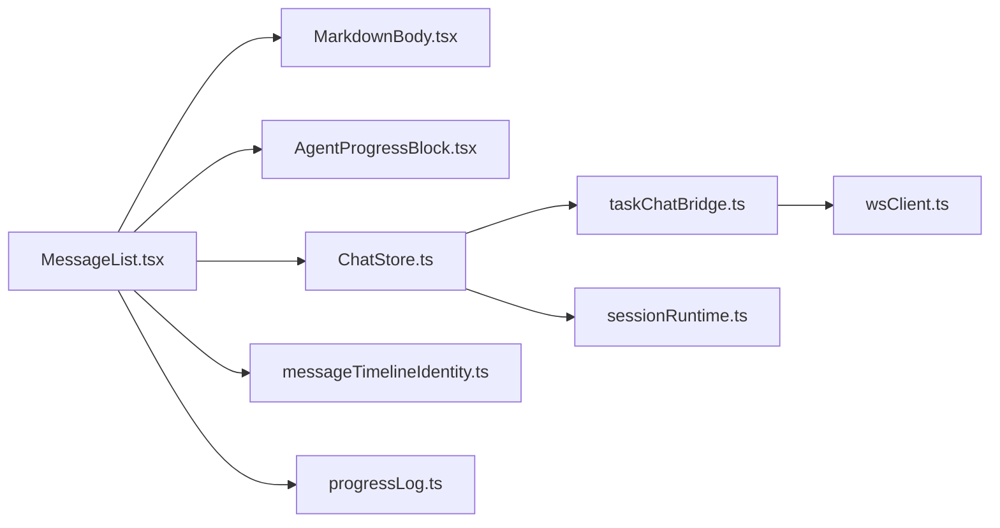

# 消息列表组件

<cite>
**本文引用的文件**   
- [MessageList.tsx](file://opc/plugins/office_ui/frontend_src/chat/MessageList.tsx)
- [MessageList.test.tsx](file://opc/plugins/office_ui/frontend_src/chat/MessageList.test.tsx)
- [MarkdownBody.tsx](file://opc/plugins/office_ui/frontend_src/chat/MarkdownBody.tsx)
- [ChatStore.ts](file://opc/plugins/office_ui/frontend_src/chat/ChatStore.ts)
- [messageTimelineIdentity.ts](file://opc/plugins/office_ui/frontend_src/chat/lib/messageTimelineIdentity.ts)
- [progressLog.ts](file://opc/plugins/office_ui/frontend_src/chat/lib/progressLog.ts)
- [taskChatBridge.ts](file://opc/plugins/office_ui/frontend_src/chat/lib/taskChatBridge.ts)
- [wsClient.ts](file://opc/plugins/office_ui/frontend_src/chat/lib/wsClient.ts)
- [sessionRuntime.ts](file://opc/plugins/office_ui/frontend_src/chat/lib/sessionRuntime.ts)
- [AgentProgressBlock.tsx](file://opc/plugins/office_ui/frontend_src/chat/AgentProgressBlock.tsx)
- [MessageComposer.tsx](file://opc/plugins/office_ui/frontend_src/chat/MessageComposer.tsx)
- [index.html](file://opc/plugins/office_ui/frontend_dist/index.html)
</cite>

## 目录
1. [简介](#简介)
2. [项目结构](#项目结构)
3. [核心组件](#核心组件)
4. [架构总览](#架构总览)
5. [详细组件分析](#详细组件分析)
6. [依赖关系分析](#依赖关系分析)
7. [性能考虑](#性能考虑)
8. [故障排查指南](#故障排查指南)
9. [结论](#结论)
10. [附录](#附录)

## 简介
本文件面向 OpenOPC 聊天界面的“消息列表”组件，聚焦以下目标：
- 渲染机制：消息项的虚拟化渲染、滚动优化与性能调优策略
- 多类型消息渲染：文本、代码块、附件、系统消息的处理方式
- 状态管理：加载、错误处理与重试机制
- 搜索与过滤：实现思路与可扩展点
- 样式定制与主题适配：如何扩展与覆盖默认样式
- 性能监控与内存泄漏防护：关键指标与最佳实践

## 项目结构
消息列表相关的前端源码位于 office_ui 插件的 frontend_src/chat 目录下，核心文件包括：
- 列表容器与渲染入口：MessageList.tsx
- Markdown 内容渲染：MarkdownBody.tsx
- 进度/系统消息卡片：AgentProgressBlock.tsx
- 数据与事件桥接：ChatStore.ts、taskChatBridge.ts、wsClient.ts、sessionRuntime.ts
- 时间线标识与进度日志：messageTimelineIdentity.ts、progressLog.ts
- 测试与示例：MessageList.test.tsx、tests/message-list-scroll.*

图表来源
- [MessageList.tsx](file://opc/plugins/office_ui/frontend_src/chat/MessageList.tsx)
- [MarkdownBody.tsx](file://opc/plugins/office_ui/frontend_src/chat/MarkdownBody.tsx)
- [AgentProgressBlock.tsx](file://opc/plugins/office_ui/frontend_src/chat/AgentProgressBlock.tsx)
- [ChatStore.ts](file://opc/plugins/office_ui/frontend_src/chat/ChatStore.ts)
- [taskChatBridge.ts](file://opc/plugins/office_ui/frontend_src/chat/lib/taskChatBridge.ts)
- [wsClient.ts](file://opc/plugins/office_ui/frontend_src/chat/lib/wsClient.ts)
- [sessionRuntime.ts](file://opc/plugins/office_ui/frontend_src/chat/lib/sessionRuntime.ts)
- [messageTimelineIdentity.ts](file://opc/plugins/office_ui/frontend_src/chat/lib/messageTimelineIdentity.ts)
- [progressLog.ts](file://opc/plugins/office_ui/frontend_src/chat/lib/progressLog.ts)

章节来源
- [MessageList.tsx](file://opc/plugins/office_ui/frontend_src/chat/MessageList.tsx)
- [MessageList.test.tsx](file://opc/plugins/office_ui/frontend_src/chat/MessageList.test.tsx)
- [MarkdownBody.tsx](file://opc/plugins/office_ui/frontend_src/chat/MarkdownBody.tsx)
- [ChatStore.ts](file://opc/plugins/office_ui/frontend_src/chat/ChatStore.ts)
- [messageTimelineIdentity.ts](file://opc/plugins/office_ui/frontend_src/chat/lib/messageTimelineIdentity.ts)
- [progressLog.ts](file://opc/plugins/office_ui/frontend_src/chat/lib/progressLog.ts)
- [taskChatBridge.ts](file://opc/plugins/office_ui/frontend_src/chat/lib/taskChatBridge.ts)
- [wsClient.ts](file://opc/plugins/office_ui/frontend_src/chat/lib/wsClient.ts)
- [sessionRuntime.ts](file://opc/plugins/office_ui/frontend_src/chat/lib/sessionRuntime.ts)
- [AgentProgressBlock.tsx](file://opc/plugins/office_ui/frontend_src/chat/AgentProgressBlock.tsx)
- [MessageComposer.tsx](file://opc/plugins/office_ui/frontend_src/chat/MessageComposer.tsx)
- [index.html](file://opc/plugins/office_ui/frontend_dist/index.html)

## 核心组件
- 消息列表容器（MessageList）
  - 负责消息集合的展示、滚动定位、虚拟窗口化渲染、可见区域计算与增量更新。
  - 与 ChatStore 交互获取消息快照，按时间线标识排序并去重。
  - 对不同类型消息进行分发渲染：文本、代码块、附件、系统/进度消息等。
- Markdown 渲染器（MarkdownBody）
  - 将 Markdown 文本转换为富文本 DOM，支持语法高亮、链接点击、图片预览等。
- 代理进度块（AgentProgressBlock）
  - 用于显示任务执行过程中的阶段性信息、工具调用摘要、错误提示等。
- 聊天存储（ChatStore）
  - 维护消息队列、加载状态、错误状态、分页与重试逻辑；提供订阅与批量更新接口。
- 任务聊天桥（taskChatBridge）与 WebSocket 客户端（wsClient）
  - 封装消息发送、接收、断线重连、心跳保活与幂等投递。
- 会话运行时（sessionRuntime）
  - 暴露会话级能力（如上下文注入、权限控制），为消息生命周期提供支撑。
- 时间线标识（messageTimelineIdentity）与进度日志（progressLog）
  - 保证消息唯一性与可追踪性，辅助折叠/展开与增量合并。

章节来源
- [MessageList.tsx](file://opc/plugins/office_ui/frontend_src/chat/MessageList.tsx)
- [MarkdownBody.tsx](file://opc/plugins/office_ui/frontend_src/chat/MarkdownBody.tsx)
- [AgentProgressBlock.tsx](file://opc/plugins/office_ui/frontend_src/chat/AgentProgressBlock.tsx)
- [ChatStore.ts](file://opc/plugins/office_ui/frontend_src/chat/ChatStore.ts)
- [taskChatBridge.ts](file://opc/plugins/office_ui/frontend_src/chat/lib/taskChatBridge.ts)
- [wsClient.ts](file://opc/plugins/office_ui/frontend_src/chat/lib/wsClient.ts)
- [sessionRuntime.ts](file://opc/plugins/office_ui/frontend_src/chat/lib/sessionRuntime.ts)
- [messageTimelineIdentity.ts](file://opc/plugins/office_ui/frontend_src/chat/lib/messageTimelineIdentity.ts)
- [progressLog.ts](file://opc/plugins/office_ui/frontend_src/chat/lib/progressLog.ts)

## 架构总览
消息列表的数据流从后端到前端的关键路径如下：
- 用户通过消息输入框发送消息
- 聊天存储创建本地占位消息并触发 UI 渲染
- 任务聊天桥通过 WebSocket 推送至服务端
- 服务端处理后回推新消息或进度事件
- 聊天存储合并增量、更新状态，消息列表按需重新渲染

图表来源
- [MessageComposer.tsx](file://opc/plugins/office_ui/frontend_src/chat/MessageComposer.tsx)
- [MessageList.tsx](file://opc/plugins/office_ui/frontend_src/chat/MessageList.tsx)
- [ChatStore.ts](file://opc/plugins/office_ui/frontend_src/chat/ChatStore.ts)
- [taskChatBridge.ts](file://opc/plugins/office_ui/frontend_src/chat/lib/taskChatBridge.ts)
- [wsClient.ts](file://opc/plugins/office_ui/frontend_src/chat/lib/wsClient.ts)
- [sessionRuntime.ts](file://opc/plugins/office_ui/frontend_src/chat/lib/sessionRuntime.ts)

## 详细组件分析

### 消息列表渲染机制（虚拟化与滚动优化）
- 虚拟化渲染
  - 仅渲染可视区域内的消息项，结合容器高度与单条消息预估高度计算首尾索引，避免全量挂载。
  - 使用稳定键值（基于时间线标识）作为 key，确保重排最小化。
- 滚动优化
  - 滚动时采用节流/防抖策略减少重绘；在快速滚动期间暂停非关键渲染（如图片懒加载）。
  - 新增消息自动滚动到底部时，优先保持“用户阅读位置”不变，仅在明确需要时追加滚动。
- 性能调优
  - 对长文本与复杂 Markdown 进行分片渲染与延迟解析。
  - 对大附件与媒体资源启用懒加载与缩略图缓存。
  - 对频繁更新的进度消息采用局部更新而非整批重渲染。

图表来源
- [MessageList.tsx](file://opc/plugins/office_ui/frontend_src/chat/MessageList.tsx)
- [messageTimelineIdentity.ts](file://opc/plugins/office_ui/frontend_src/chat/lib/messageTimelineIdentity.ts)

章节来源
- [MessageList.tsx](file://opc/plugins/office_ui/frontend_src/chat/MessageList.tsx)
- [MessageList.test.tsx](file://opc/plugins/office_ui/frontend_src/chat/MessageList.test.tsx)

### 多类型消息渲染逻辑
- 文本消息
  - 通过 MarkdownBody 渲染，支持段落、列表、表格、链接等基础元素。
  - 超长文本采用截断与“展开/收起”交互，避免一次性渲染大量节点。
- 代码块
  - 使用语法高亮与行号显示；对超大文件启用虚拟滚动与按需加载片段。
  - 复制按钮与下载链接提升可用性。
- 附件
  - 根据 MIME 类型选择预览策略：图片缩略图、PDF 预览、文档下载等。
  - 失败态提供重试与降级方案（如仅显示文件名与大小）。
- 系统消息与进度
  - AgentProgressBlock 统一承载任务阶段、工具调用摘要、错误提示等。
  - 支持折叠/展开与一键跳转至相关上下文。

图表来源
- [MessageList.tsx](file://opc/plugins/office_ui/frontend_src/chat/MessageList.tsx)
- [MarkdownBody.tsx](file://opc/plugins/office_ui/frontend_src/chat/MarkdownBody.tsx)
- [AgentProgressBlock.tsx](file://opc/plugins/office_ui/frontend_src/chat/AgentProgressBlock.tsx)
- [ChatStore.ts](file://opc/plugins/office_ui/frontend_src/chat/ChatStore.ts)

章节来源
- [MessageList.tsx](file://opc/plugins/office_ui/frontend_src/chat/MessageList.tsx)
- [MarkdownBody.tsx](file://opc/plugins/office_ui/frontend_src/chat/MarkdownBody.tsx)
- [AgentProgressBlock.tsx](file://opc/plugins/office_ui/frontend_src/chat/AgentProgressBlock.tsx)

### 消息状态管理（加载、错误与重试）
- 加载状态
  - 首次拉取与分页加载时显示骨架屏或占位消息，避免闪烁。
  - 增量合并时使用乐观更新，失败则回滚。
- 错误处理
  - 网络异常、解析失败、权限不足等错误以友好提示呈现，并提供重试入口。
  - 对不可恢复错误记录诊断信息（如时间戳、消息 ID、错误码）。
- 重试机制
  - 指数退避与最大重试次数限制，避免雪崩。
  - 支持手动重试与批量重试操作。

图表来源
- [ChatStore.ts](file://opc/plugins/office_ui/frontend_src/chat/ChatStore.ts)
- [wsClient.ts](file://opc/plugins/office_ui/frontend_src/chat/lib/wsClient.ts)

章节来源
- [ChatStore.ts](file://opc/plugins/office_ui/frontend_src/chat/ChatStore.ts)
- [wsClient.ts](file://opc/plugins/office_ui/frontend_src/chat/lib/wsClient.ts)

### 消息搜索与过滤
- 搜索
  - 基于关键词的高亮匹配，支持正则与模糊匹配。
  - 搜索结果以锚点形式跳转到对应消息位置，并保持滚动可见。
- 过滤
  - 按消息类型（文本/代码/附件/系统）、来源、时间范围筛选。
  - 过滤结果即时刷新，同时保留当前滚动位置。
- 性能
  - 对大规模历史消息采用惰性索引与分片检索，避免主线程阻塞。

章节来源
- [MessageList.tsx](file://opc/plugins/office_ui/frontend_src/chat/MessageList.tsx)
- [ChatStore.ts](file://opc/plugins/office_ui/frontend_src/chat/ChatStore.ts)

### 样式定制与主题适配
- 样式定制
  - 通过 CSS 变量与类名覆盖默认样式，支持暗色/亮色主题切换。
  - 针对代码块、附件预览、进度卡片提供独立样式入口。
- 主题适配
  - 遵循 WCAG 对比度要求，确保可读性。
  - 动态字体缩放与无障碍标签增强。

章节来源
- [MessageList.tsx](file://opc/plugins/office_ui/frontend_src/chat/MessageList.tsx)
- [MarkdownBody.tsx](file://opc/plugins/office_ui/frontend_src/chat/MarkdownBody.tsx)
- [AgentProgressBlock.tsx](file://opc/plugins/office_ui/frontend_src/chat/AgentProgressBlock.tsx)

### 性能监控与内存泄漏防护
- 监控指标
  - 渲染帧率、首屏时间、滚动卡顿次数、内存占用峰值。
  - 消息数量与虚拟窗口命中率统计。
- 内存泄漏防护
  - 组件卸载时清理定时器、事件监听与 WebSocket 连接。
  - 大对象引用及时置空，避免闭包持有强引用。
  - 图片与附件 URL 释放后回收缓存条目。

章节来源
- [MessageList.tsx](file://opc/plugins/office_ui/frontend_src/chat/MessageList.tsx)
- [wsClient.ts](file://opc/plugins/office_ui/frontend_src/chat/lib/wsClient.ts)

## 依赖关系分析
消息列表与其周边模块的依赖关系如下：

图表来源
- [MessageList.tsx](file://opc/plugins/office_ui/frontend_src/chat/MessageList.tsx)
- [MarkdownBody.tsx](file://opc/plugins/office_ui/frontend_src/chat/MarkdownBody.tsx)
- [AgentProgressBlock.tsx](file://opc/plugins/office_ui/frontend_src/chat/AgentProgressBlock.tsx)
- [ChatStore.ts](file://opc/plugins/office_ui/frontend_src/chat/ChatStore.ts)
- [taskChatBridge.ts](file://opc/plugins/office_ui/frontend_src/chat/lib/taskChatBridge.ts)
- [wsClient.ts](file://opc/plugins/office_ui/frontend_src/chat/lib/wsClient.ts)
- [sessionRuntime.ts](file://opc/plugins/office_ui/frontend_src/chat/lib/sessionRuntime.ts)
- [messageTimelineIdentity.ts](file://opc/plugins/office_ui/frontend_src/chat/lib/messageTimelineIdentity.ts)
- [progressLog.ts](file://opc/plugins/office_ui/frontend_src/chat/lib/progressLog.ts)

章节来源
- [MessageList.tsx](file://opc/plugins/office_ui/frontend_src/chat/MessageList.tsx)
- [ChatStore.ts](file://opc/plugins/office_ui/frontend_src/chat/ChatStore.ts)
- [wsClient.ts](file://opc/plugins/office_ui/frontend_src/chat/lib/wsClient.ts)

## 性能考虑
- 渲染层面
  - 严格虚拟化窗口，避免全量渲染；对静态内容使用 memoization。
  - 对长文本与复杂 Markdown 进行分片与延迟解析。
- 网络与状态
  - 增量合并与乐观更新，失败回滚；指数退避重试。
  - 批量更新合并，减少重渲染次数。
- 资源管理
  - 图片与附件懒加载与缩略图缓存；URL 释放后清理引用。
  - 大文件分块下载与断点续传（如适用）。
- 可观测性
  - 埋点收集关键指标（FPS、内存、滚动卡顿），定期上报与分析。

[本节为通用指导，不直接分析具体文件]

## 故障排查指南
- 常见问题
  - 消息不更新：检查 ChatStore 订阅与增量合并逻辑；确认 wsClient 连接状态。
  - 滚动抖动：确认虚拟化窗口计算是否正确；避免在滚动回调中进行昂贵操作。
  - 附件无法加载：检查网络与权限；查看重试与降级逻辑。
  - 内存增长：排查未清理的事件监听、定时器与大对象引用。
- 调试建议
  - 打开浏览器开发者工具的性能面板，录制滚动与渲染过程。
  - 使用内存快照对比组件挂载/卸载前后差异。
  - 在关键路径添加日志（如消息 ID、时间戳、错误码）。

章节来源
- [MessageList.tsx](file://opc/plugins/office_ui/frontend_src/chat/MessageList.tsx)
- [ChatStore.ts](file://opc/plugins/office_ui/frontend_src/chat/ChatStore.ts)
- [wsClient.ts](file://opc/plugins/office_ui/frontend_src/chat/lib/wsClient.ts)

## 结论
消息列表组件通过虚拟化渲染、增量合并与稳健的状态管理，实现了在高吞吐场景下的流畅体验。配合完善的错误处理、重试机制与性能监控，能够在复杂业务需求下保持稳定与可维护性。后续可在搜索与过滤、主题适配与无障碍方面持续优化，进一步提升用户体验。

[本节为总结，不直接分析具体文件]

## 附录
- 相关文件入口
  - 前端页面入口：index.html
  - 聊天界面主入口：frontend_src/chat 目录下的各组件与库

章节来源
- [index.html](file://opc/plugins/office_ui/frontend_dist/index.html)