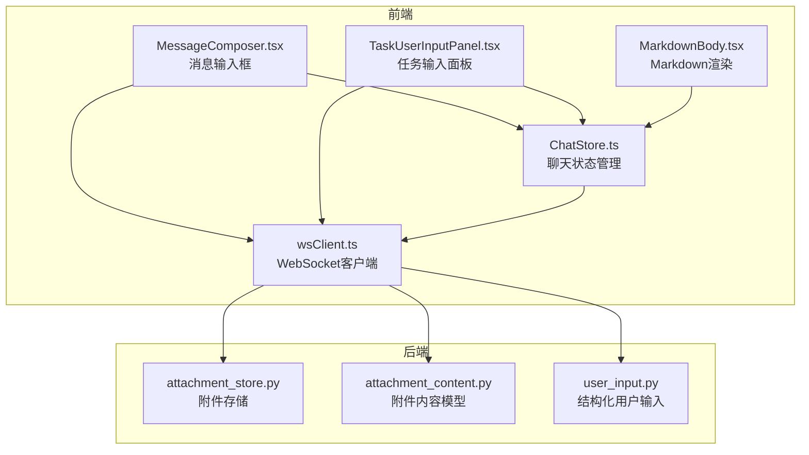
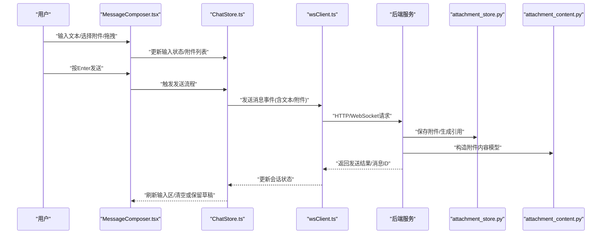
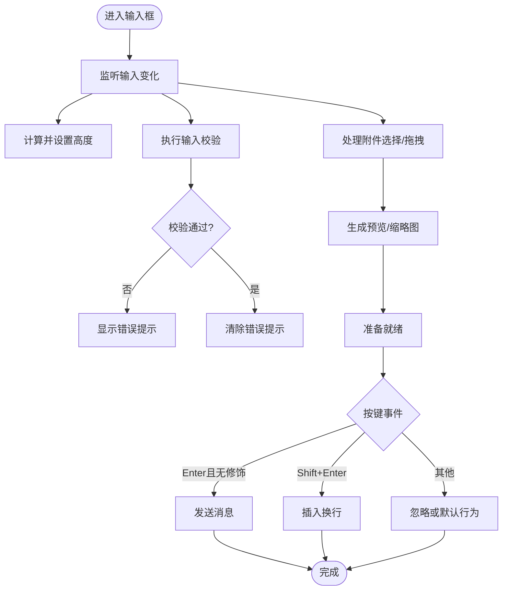
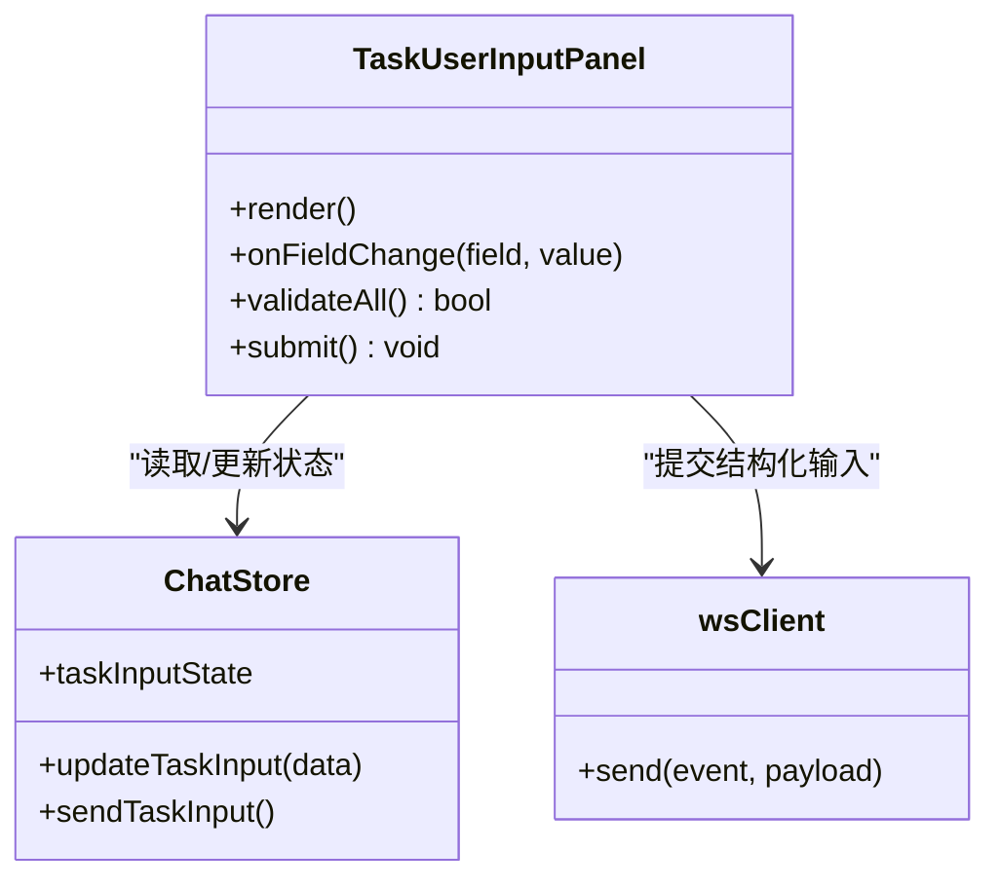
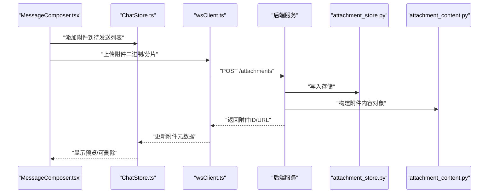
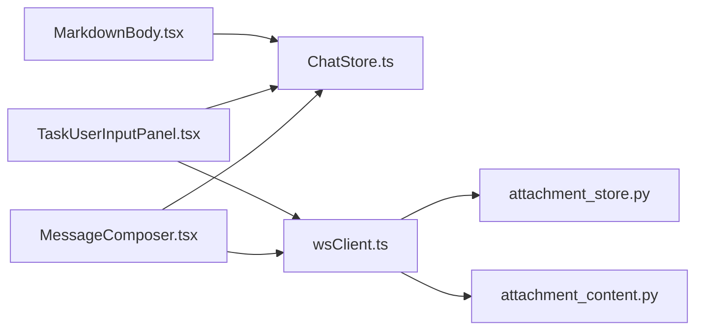

# 消息输入组件

<cite>
**本文引用的文件**   
- [MessageComposer.tsx](file://opc/plugins/office_ui/frontend_src/chat/MessageComposer.tsx)
- [TaskUserInputPanel.tsx](file://opc/plugins/office_ui/frontend_src/chat/TaskUserInputPanel.tsx)
- [MarkdownBody.tsx](file://opc/plugins/office_ui/frontend_src/chat/MarkdownBody.tsx)
- [ChatStore.ts](file://opc/plugins/office_ui/frontend_src/chat/ChatStore.ts)
- [wsClient.ts](file://opc/plugins/office_ui/frontend_src/lib/wsClient.ts)
- [attachment_store.py](file://opc/core/attachment_store.py)
- [attachment_content.py](file://opc/core/attachment_content.py)
- [user_input.py](file://opc/layer4_tools/user_input.py)
</cite>

## 目录
1. [简介](#简介)
2. [项目结构](#项目结构)
3. [核心组件](#核心组件)
4. [架构总览](#架构总览)
5. [详细组件分析](#详细组件分析)
6. [依赖关系分析](#依赖关系分析)
7. [性能与体验优化](#性能与体验优化)
8. [故障排查指南](#故障排查指南)
9. [结论](#结论)
10. [附录](#附录)

## 简介
本文件面向OpenOPC聊天界面的“消息输入组件”，聚焦以下能力：
- 多行文本输入、自动高度调整与输入校验
- 快捷键支持（Enter发送、Shift+Enter换行）
- 文件上传与附件处理（拖拽上传、预览、删除）
- Markdown输入支持与实时预览
- 任务输入面板的结构化输入与数据绑定
- 输入组件的自定义配置与扩展方法
- 输入体验优化与错误提示机制

## 项目结构
与消息输入相关的代码主要分布在前端React组件与后端附件/用户输入工具中。前端负责交互与渲染，后端提供附件存储与结构化输入能力。

图表来源
- [MessageComposer.tsx](file://opc/plugins/office_ui/frontend_src/chat/MessageComposer.tsx)
- [TaskUserInputPanel.tsx](file://opc/plugins/office_ui/frontend_src/chat/TaskUserInputPanel.tsx)
- [MarkdownBody.tsx](file://opc/plugins/office_ui/frontend_src/chat/MarkdownBody.tsx)
- [ChatStore.ts](file://opc/plugins/office_ui/frontend_src/chat/ChatStore.ts)
- [wsClient.ts](file://opc/plugins/office_ui/frontend_src/lib/wsClient.ts)
- [attachment_store.py](file://opc/core/attachment_store.py)
- [attachment_content.py](file://opc/core/attachment_content.py)
- [user_input.py](file://opc/layer4_tools/user_input.py)

章节来源
- [MessageComposer.tsx](file://opc/plugins/office_ui/frontend_src/chat/MessageComposer.tsx)
- [TaskUserInputPanel.tsx](file://opc/plugins/office_ui/frontend_src/chat/TaskUserInputPanel.tsx)
- [MarkdownBody.tsx](file://opc/plugins/office_ui/frontend_src/chat/MarkdownBody.tsx)
- [ChatStore.ts](file://opc/plugins/office_ui/frontend_src/chat/ChatStore.ts)
- [wsClient.ts](file://opc/plugins/office_ui/frontend_src/lib/wsClient.ts)
- [attachment_store.py](file://opc/core/attachment_store.py)
- [attachment_content.py](file://opc/core/attachment_content.py)
- [user_input.py](file://opc/layer4_tools/user_input.py)

## 核心组件
- 消息输入框（MessageComposer）
  - 多行文本输入、自动高度调整
  - 快捷键：Enter发送、Shift+Enter换行
  - 附件选择与拖拽上传、预览与删除
  - Markdown输入与实时预览切换
  - 输入校验与错误提示
- 任务输入面板（TaskUserInputPanel）
  - 结构化输入表单与数据绑定
  - 与任务上下文联动，提交结构化数据
- Markdown渲染（MarkdownBody）
  - 将Markdown文本渲染为富文本展示
- 聊天状态管理（ChatStore）
  - 维护输入内容、附件列表、预览状态等
- WebSocket客户端（wsClient）
  - 将消息与附件事件发送至后端服务
- 后端附件与输入工具
  - attachment_store.py：附件持久化与访问
  - attachment_content.py：附件内容模型定义
  - user_input.py：结构化用户输入处理

章节来源
- [MessageComposer.tsx](file://opc/plugins/office_ui/frontend_src/chat/MessageComposer.tsx)
- [TaskUserInputPanel.tsx](file://opc/plugins/office_ui/frontend_src/chat/TaskUserInputPanel.tsx)
- [MarkdownBody.tsx](file://opc/plugins/office_ui/frontend_src/chat/MarkdownBody.tsx)
- [ChatStore.ts](file://opc/plugins/office_ui/frontend_src/chat/ChatStore.ts)
- [wsClient.ts](file://opc/plugins/office_ui/frontend_src/lib/wsClient.ts)
- [attachment_store.py](file://opc/core/attachment_store.py)
- [attachment_content.py](file://opc/core/attachment_content.py)
- [user_input.py](file://opc/layer4_tools/user_input.py)

## 架构总览
消息输入组件的前端通过状态管理与WebSocket与后端通信；附件由后端统一存储并提供访问；任务输入面板在特定上下文中使用结构化输入。

图表来源
- [MessageComposer.tsx](file://opc/plugins/office_ui/frontend_src/chat/MessageComposer.tsx)
- [ChatStore.ts](file://opc/plugins/office_ui/frontend_src/chat/ChatStore.ts)
- [wsClient.ts](file://opc/plugins/office_ui/frontend_src/lib/wsClient.ts)
- [attachment_store.py](file://opc/core/attachment_store.py)
- [attachment_content.py](file://opc/core/attachment_content.py)

## 详细组件分析

### 消息输入框（MessageComposer）
- 多行文本输入与自动高度调整
  - 监听输入变化，根据内容行数动态调整容器高度，确保长文本无需滚动即可编辑
- 快捷键支持
  - Enter：发送消息
  - Shift+Enter：插入换行符，不触发发送
  - 可配置是否允许Ctrl/Cmd+Enter作为发送组合键
- 附件处理
  - 点击按钮选择文件
  - 支持拖拽文件到输入区域进行上传
  - 显示附件缩略图/文件名，支持删除已选附件
  - 对文件大小与类型进行前置校验，失败时给出明确提示
- Markdown输入与实时预览
  - 提供切换开关，在“纯文本”和“Markdown预览”之间切换
  - 预览模式使用MarkdownBody渲染当前输入内容
- 输入验证与错误提示
  - 空文本检测、长度限制、敏感词过滤（可选）
  - 错误信息以轻量提示形式显示在输入区下方
- 自定义与扩展
  - 可通过props注入自定义校验器、快捷键映射、附件过滤器
  - 暴露回调用于记录日志、埋点或触发外部动作

图表来源
- [MessageComposer.tsx](file://opc/plugins/office_ui/frontend_src/chat/MessageComposer.tsx)
- [MarkdownBody.tsx](file://opc/plugins/office_ui/frontend_src/chat/MarkdownBody.tsx)

章节来源
- [MessageComposer.tsx](file://opc/plugins/office_ui/frontend_src/chat/MessageComposer.tsx)
- [MarkdownBody.tsx](file://opc/plugins/office_ui/frontend_src/chat/MarkdownBody.tsx)

### 任务输入面板（TaskUserInputPanel）
- 结构化输入
  - 基于任务上下文生成表单字段（如下拉、单选、数值、日期等）
  - 字段值双向绑定至本地状态，提交前进行格式与范围校验
- 数据绑定与提交
  - 将结构化数据序列化为后端期望的模型
  - 通过WebSocket发送，并在成功后更新任务状态
- 与消息输入的关系
  - 在需要结构化信息的场景下替代自由文本输入
  - 可与普通消息输入并存，提供“切换到结构化输入”的入口

图表来源
- [TaskUserInputPanel.tsx](file://opc/plugins/office_ui/frontend_src/chat/TaskUserInputPanel.tsx)
- [ChatStore.ts](file://opc/plugins/office_ui/frontend_src/chat/ChatStore.ts)
- [wsClient.ts](file://opc/plugins/office_ui/frontend_src/lib/wsClient.ts)

章节来源
- [TaskUserInputPanel.tsx](file://opc/plugins/office_ui/frontend_src/chat/TaskUserInputPanel.tsx)
- [ChatStore.ts](file://opc/plugins/office_ui/frontend_src/chat/ChatStore.ts)
- [wsClient.ts](file://opc/plugins/office_ui/frontend_src/lib/wsClient.ts)

### Markdown输入与实时预览（MarkdownBody）
- 将输入的Markdown文本渲染为富文本
- 支持常见语法（标题、列表、链接、代码块等）
- 在输入框内提供“预览”视图，便于用户确认格式效果

章节来源
- [MarkdownBody.tsx](file://opc/plugins/office_ui/frontend_src/chat/MarkdownBody.tsx)

### 附件处理机制（前端与后端协作）
- 前端
  - 支持点击选择与拖拽上传
  - 生成预览（图片缩略图、文件名列表）
  - 删除已选附件，更新本地状态
- 后端
  - 接收附件并持久化存储
  - 生成附件元数据与访问路径
  - 在消息体中附加附件引用

图表来源
- [MessageComposer.tsx](file://opc/plugins/office_ui/frontend_src/chat/MessageComposer.tsx)
- [ChatStore.ts](file://opc/plugins/office_ui/frontend_src/chat/ChatStore.ts)
- [wsClient.ts](file://opc/plugins/office_ui/frontend_src/lib/wsClient.ts)
- [attachment_store.py](file://opc/core/attachment_store.py)
- [attachment_content.py](file://opc/core/attachment_content.py)

章节来源
- [MessageComposer.tsx](file://opc/plugins/office_ui/frontend_src/chat/MessageComposer.tsx)
- [ChatStore.ts](file://opc/plugins/office_ui/frontend_src/chat/ChatStore.ts)
- [wsClient.ts](file://opc/plugins/office_ui/frontend_src/lib/wsClient.ts)
- [attachment_store.py](file://opc/core/attachment_store.py)
- [attachment_content.py](file://opc/core/attachment_content.py)

## 依赖关系分析
- 组件耦合
  - MessageComposer依赖ChatStore进行状态同步，依赖wsClient进行网络通信
  - TaskUserInputPanel同样依赖ChatStore与wsClient，但侧重结构化数据
  - MarkdownBody仅负责渲染，低耦合
- 外部依赖
  - 后端附件存储与内容模型为输入组件提供附件能力支撑
  - WebSocket客户端封装了连接、重试与事件分发

图表来源
- [MessageComposer.tsx](file://opc/plugins/office_ui/frontend_src/chat/MessageComposer.tsx)
- [TaskUserInputPanel.tsx](file://opc/plugins/office_ui/frontend_src/chat/TaskUserInputPanel.tsx)
- [MarkdownBody.tsx](file://opc/plugins/office_ui/frontend_src/chat/MarkdownBody.tsx)
- [ChatStore.ts](file://opc/plugins/office_ui/frontend_src/chat/ChatStore.ts)
- [wsClient.ts](file://opc/plugins/office_ui/frontend_src/lib/wsClient.ts)
- [attachment_store.py](file://opc/core/attachment_store.py)
- [attachment_content.py](file://opc/core/attachment_content.py)

章节来源
- [MessageComposer.tsx](file://opc/plugins/office_ui/frontend_src/chat/MessageComposer.tsx)
- [TaskUserInputPanel.tsx](file://opc/plugins/office_ui/frontend_src/chat/TaskUserInputPanel.tsx)
- [MarkdownBody.tsx](file://opc/plugins/office_ui/frontend_src/chat/MarkdownBody.tsx)
- [ChatStore.ts](file://opc/plugins/office_ui/frontend_src/chat/ChatStore.ts)
- [wsClient.ts](file://opc/plugins/office_ui/frontend_src/lib/wsClient.ts)
- [attachment_store.py](file://opc/core/attachment_store.py)
- [attachment_content.py](file://opc/core/attachment_content.py)

## 性能与体验优化
- 输入性能
  - 防抖/节流：对输入变化进行节流，避免频繁重排与渲染
  - 增量渲染：仅在预览模式下渲染Markdown，减少不必要的计算
- 附件上传
  - 分片上传与大文件断点续传（由后端支持）
  - 压缩与格式转换：对图片进行前端压缩后再上传
- 用户体验
  - 即时反馈：上传进度、错误提示、成功通知
  - 键盘导航：Tab顺序合理，焦点管理清晰
  - 无障碍：ARIA标签、屏幕阅读器友好

[本节为通用指导，不涉及具体文件分析]

## 故障排查指南
- 常见问题
  - 无法发送：检查网络连接、WebSocket状态、消息是否为空
  - 附件上传失败：检查文件大小/类型限制、存储空间、权限
  - Markdown预览异常：检查语法是否正确、是否存在不支持的语法
- 定位步骤
  - 查看浏览器控制台与网络面板的错误信息
  - 检查ChatStore中的状态变更与wsClient的事件日志
  - 在后端日志中搜索附件上传与消息发送相关条目
- 恢复建议
  - 重试机制：网络抖动时自动重试
  - 降级策略：预览失败回退为纯文本
  - 清理缓存：清除本地草稿与未完成的附件队列

章节来源
- [ChatStore.ts](file://opc/plugins/office_ui/frontend_src/chat/ChatStore.ts)
- [wsClient.ts](file://opc/plugins/office_ui/frontend_src/lib/wsClient.ts)
- [attachment_store.py](file://opc/core/attachment_store.py)

## 结论
消息输入组件通过前后端协作实现了丰富的输入体验：多行文本、自动高度、快捷键、附件上传与预览、Markdown实时预览以及任务结构化输入。借助清晰的依赖关系与可扩展的设计，该组件能够灵活适配不同业务场景，并通过完善的错误提示与性能优化保障良好的用户体验。

[本节为总结性内容，不涉及具体文件分析]

## 附录
- 自定义配置项（示例）
  - 最大文本长度、是否启用Markdown预览、附件大小限制、支持的MIME类型
  - 快捷键映射（例如是否允许Ctrl+Enter发送）
  - 校验规则（正则表达式、白名单/黑名单）
- 扩展方法
  - 注入自定义校验器与附件处理器
  - 替换Markdown渲染器或增加新的预览选项
  - 接入第三方上传服务或存储服务

[本节为概念性说明，不涉及具体文件分析]