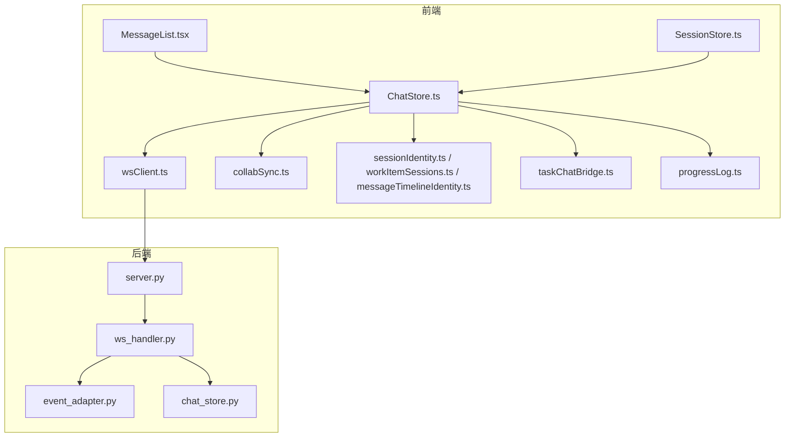
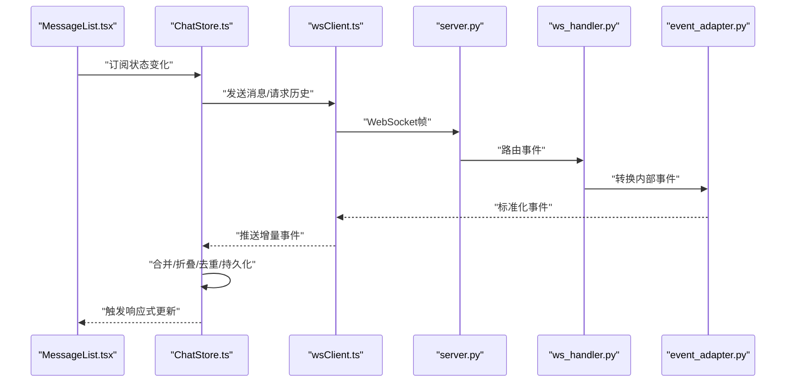
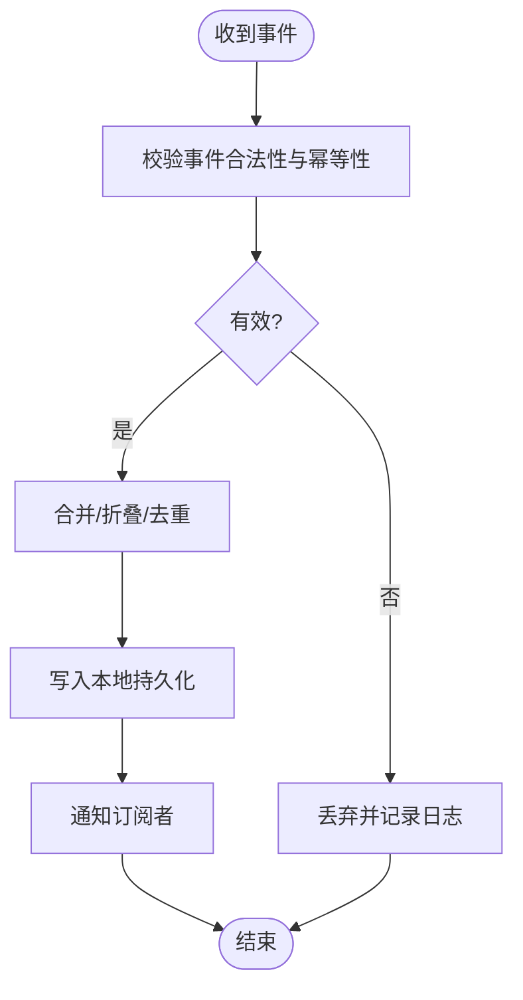
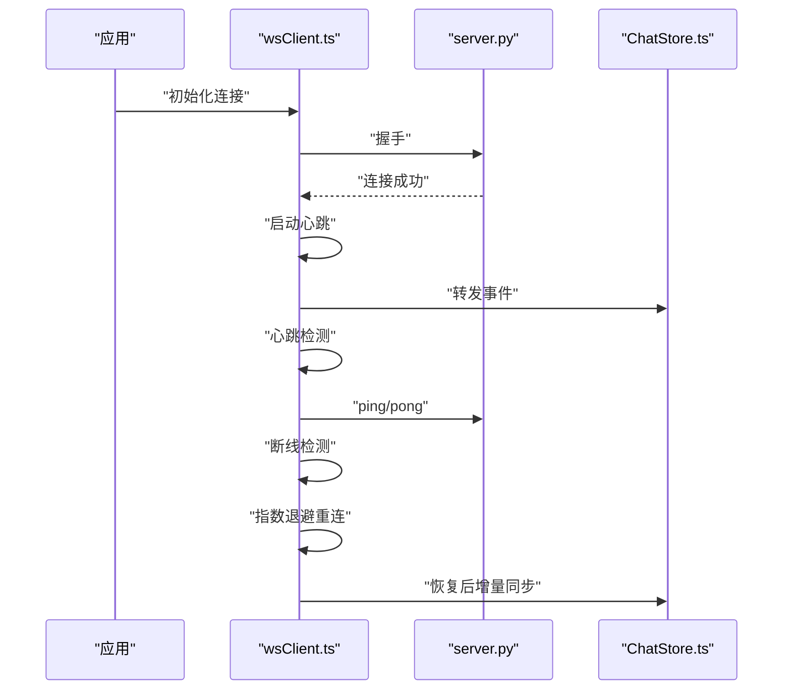
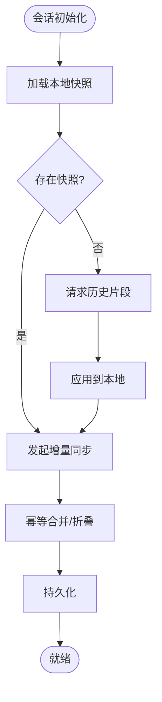
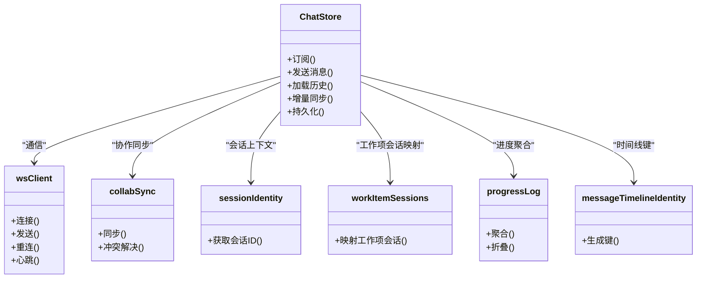

# 聊天状态管理

<cite>
**本文引用的文件**   
- [ChatStore.ts](file://opc/plugins/office_ui/frontend_src/chat/ChatStore.ts)
- [ChatStore.test.ts](file://opc/plugins/office_ui/frontend_src/chat/ChatStore.test.ts)
- [MessageList.tsx](file://opc/plugins/office_ui/frontend_src/chat/MessageList.tsx)
- [MessageList.test.tsx](file://opc/plugins/office_ui/frontend_src/chat/MessageList.test.tsx)
- [wsClient.ts](file://opc/plugins/office_ui/frontend_src/lib/wsClient.ts)
- [wsClient.test.ts](file://opc/plugins/office_ui/frontend_src/lib/wsClient.test.ts)
- [collabSync.ts](file://opc/plugins/office_ui/frontend_src/lib/collabSync.ts)
- [sessionIdentity.ts](file://opc/plugins/office_ui/frontend_src/lib/sessionIdentity.ts)
- [workItemSessions.ts](file://opc/plugins/office_ui/frontend_src/lib/workItemSessions.ts)
- [taskChatBridge.ts](file://opc/plugins/office_ui/frontend_src/lib/taskChatBridge.ts)
- [messageTimelineIdentity.ts](file://opc/plugins/office_ui/frontend_src/lib/messageTimelineIdentity.ts)
- [progressLog.ts](file://opc/plugins/office_ui/frontend_src/lib/progressLog.ts)
- [SessionStore.ts](file://opc/plugins/office_ui/frontend_src/stores/SessionStore.ts)
- [SessionStore.test.ts](file://opc/plugins/office_ui/frontend_src/stores/SessionStore.test.ts)
- [chat_store.py](file://opc/plugins/office_ui/chat_store.py)
- [ws_handler.py](file://opc/plugins/office_ui/ws_handler.py)
- [server.py](file://opc/plugins/office_ui/server.py)
- [event_adapter.py](file://opc/plugins/office_ui/event_adapter.py)
- [test_chat_store_progress_folding.py](file://tests/test_chat_store_progress_folding.py)
</cite>

## 目录
1. [简介](#简介)
2. [项目结构](#项目结构)
3. [核心组件](#核心组件)
4. [架构总览](#架构总览)
5. [详细组件分析](#详细组件分析)
6. [依赖关系分析](#依赖关系分析)
7. [性能考虑](#性能考虑)
8. [故障排查指南](#故障排查指南)
9. [结论](#结论)
10. [附录](#附录)

## 简介
本文件面向OpenOPC办公界面中的“聊天状态管理”子系统，聚焦于前端ChatStore的设计与实现、WebSocket连接管理与实时消息更新、消息持久化策略（本地存储、历史加载、增量同步）、状态变更监听与响应式更新、错误处理与重连逻辑，以及调试工具与开发模式下的状态查看方法。同时给出性能优化与内存清理建议，帮助读者快速理解并高效维护该模块。

## 项目结构
聊天状态管理涉及前端状态层、通信层与后端服务层的协同：
- 前端状态层：ChatStore负责会话内消息状态、进度事件聚合、折叠与去重；SessionStore负责跨会话的会话列表与切换；lib下提供WS客户端、协作同步、身份标识等能力。
- 前端UI层：MessageList等组件订阅ChatStore状态进行渲染。
- 后端服务层：ws_handler负责WebSocket事件分发，event_adapter将内部事件转换为统一协议，server提供HTTP/WebSocket入口，chat_store.py提供服务端聊天状态辅助能力。

图表来源
- [ChatStore.ts](file://opc/plugins/office_ui/frontend_src/chat/ChatStore.ts)
- [MessageList.tsx](file://opc/plugins/office_ui/frontend_src/chat/MessageList.tsx)
- [wsClient.ts](file://opc/plugins/office_ui/frontend_src/lib/wsClient.ts)
- [collabSync.ts](file://opc/plugins/office_ui/frontend_src/lib/collabSync.ts)
- [sessionIdentity.ts](file://opc/plugins/office_ui/frontend_src/lib/sessionIdentity.ts)
- [workItemSessions.ts](file://opc/plugins/office_ui/frontend_src/lib/workItemSessions.ts)
- [taskChatBridge.ts](file://opc/plugins/office_ui/frontend_src/lib/taskChatBridge.ts)
- [progressLog.ts](file://opc/plugins/office_ui/frontend_src/lib/progressLog.ts)
- [SessionStore.ts](file://opc/plugins/office_ui/frontend_src/stores/SessionStore.ts)
- [server.py](file://opc/plugins/office_ui/server.py)
- [ws_handler.py](file://opc/plugins/office_ui/ws_handler.py)
- [event_adapter.py](file://opc/plugins/office_ui/event_adapter.py)
- [chat_store.py](file://opc/plugins/office_ui/chat_store.py)

章节来源
- [ChatStore.ts](file://opc/plugins/office_ui/frontend_src/chat/ChatStore.ts)
- [MessageList.tsx](file://opc/plugins/office_ui/frontend_src/chat/MessageList.tsx)
- [wsClient.ts](file://opc/plugins/office_ui/frontend_src/lib/wsClient.ts)
- [SessionStore.ts](file://opc/plugins/office_ui/frontend_src/stores/SessionStore.ts)
- [server.py](file://opc/plugins/office_ui/server.py)
- [ws_handler.py](file://opc/plugins/office_ui/ws_handler.py)
- [event_adapter.py](file://opc/plugins/office_ui/event_adapter.py)
- [chat_store.py](file://opc/plugins/office_ui/chat_store.py)

## 核心组件
- ChatStore：聊天状态的核心，负责消息集合、进度事件聚合、折叠与去重、时间线标识、增量同步、本地持久化与恢复、状态变更通知。
- wsClient：封装WebSocket连接生命周期、心跳、断线重连、消息编解码与重试策略。
- collabSync：协作同步桥接，协调多端状态一致性。
- SessionStore：会话级元数据与切换，驱动ChatStore按会话隔离状态。
- MessageList：消费ChatStore状态进行渲染，支持滚动、分页与交互。
- 后端ws_handler与event_adapter：接收前端WS消息，路由到业务处理器，并将内部事件标准化后推送给前端。
- chat_store.py：服务端聊天状态辅助能力，配合前端完成历史加载与增量同步。

章节来源
- [ChatStore.ts](file://opc/plugins/office_ui/frontend_src/chat/ChatStore.ts)
- [wsClient.ts](file://opc/plugins/office_ui/frontend_src/lib/wsClient.ts)
- [collabSync.ts](file://opc/plugins/office_ui/frontend_src/lib/collabSync.ts)
- [SessionStore.ts](file://opc/plugins/office_ui/frontend_src/stores/SessionStore.ts)
- [MessageList.tsx](file://opc/plugins/office_ui/frontend_src/chat/MessageList.tsx)
- [ws_handler.py](file://opc/plugins/office_ui/ws_handler.py)
- [event_adapter.py](file://opc/plugins/office_ui/event_adapter.py)
- [chat_store.py](file://opc/plugins/office_ui/chat_store.py)

## 架构总览
聊天状态管理采用“前端状态中心 + WebSocket实时通道 + 后端事件适配”的分层架构。前端通过wsClient建立长连接，后端ws_handler根据事件类型分派到具体处理器，event_adapter将内部事件转换为统一协议返回前端。ChatStore作为单一事实源，对UI提供稳定的响应式视图。

图表来源
- [MessageList.tsx](file://opc/plugins/office_ui/frontend_src/chat/MessageList.tsx)
- [ChatStore.ts](file://opc/plugins/office_ui/frontend_src/chat/ChatStore.ts)
- [wsClient.ts](file://opc/plugins/office_ui/frontend_src/lib/wsClient.ts)
- [server.py](file://opc/plugins/office_ui/server.py)
- [ws_handler.py](file://opc/plugins/office_ui/ws_handler.py)
- [event_adapter.py](file://opc/plugins/office_ui/event_adapter.py)

## 详细组件分析

### ChatStore：消息状态存储与会话管理
- 设计要点
  - 以会话为维度隔离状态，结合sessionIdentity与工作项会话映射，确保多会话并发安全。
  - 消息集合包含普通消息与进度事件两类；进度事件通过progressLog进行聚合与折叠，减少冗余渲染。
  - 使用messageTimelineIdentity生成稳定时间线键，保障排序与去重。
  - 提供增量同步接口，基于服务端游标或时间戳拉取差异，避免全量刷新。
  - 本地持久化策略：在关键状态变更后落盘，启动时优先恢复本地快照，再与服务器增量对齐。
  - 响应式更新：对外暴露观察者接口，UI组件可订阅变更，仅重绘受影响区域。
- 关键流程
  - 初始化：加载会话元数据 -> 恢复本地历史 -> 发起增量同步 -> 建立WS订阅。
  - 收到事件：校验幂等 -> 合并/折叠 -> 持久化 -> 通知订阅者。
  - 用户输入：构造消息 -> 发送WS -> 乐观插入本地 -> 等待确认回调修正。
- 复杂度与优化
  - 消息合并与折叠采用哈希索引+有序容器，近似O(1)定位与O(log n)插入。
  - 大会话分页加载，按需渲染可见窗口，降低首屏压力。
- 错误处理
  - 对重复事件做幂等过滤；对非法事件丢弃并记录日志；对不可恢复错误回滚局部状态。

图表来源
- [ChatStore.ts](file://opc/plugins/office_ui/frontend_src/chat/ChatStore.ts)
- [progressLog.ts](file://opc/plugins/office_ui/frontend_src/lib/progressLog.ts)
- [messageTimelineIdentity.ts](file://opc/plugins/office_ui/frontend_src/lib/messageTimelineIdentity.ts)
- [sessionIdentity.ts](file://opc/plugins/office_ui/frontend_src/lib/sessionIdentity.ts)
- [workItemSessions.ts](file://opc/plugins/office_ui/frontend_src/lib/workItemSessions.ts)

章节来源
- [ChatStore.ts](file://opc/plugins/office_ui/frontend_src/chat/ChatStore.ts)
- [progressLog.ts](file://opc/plugins/office_ui/frontend_src/lib/progressLog.ts)
- [messageTimelineIdentity.ts](file://opc/plugins/office_ui/frontend_src/lib/messageTimelineIdentity.ts)
- [sessionIdentity.ts](file://opc/plugins/office_ui/frontend_src/lib/sessionIdentity.ts)
- [workItemSessions.ts](file://opc/plugins/office_ui/frontend_src/lib/workItemSessions.ts)
- [test_chat_store_progress_folding.py](file://tests/test_chat_store_progress_folding.py)

### WebSocket连接管理与实时消息更新
- 连接生命周期
  - 建立连接：握手成功后注册事件监听器，启动心跳保活。
  - 心跳与超时：周期性ping/pong，超时触发重连。
  - 断线重连：指数退避+抖动，最大重试次数限制，失败上报监控。
  - 消息可靠性：带序列号或时间戳的事件，前端按序应用，丢失则触发补拉。
- 与ChatStore集成
  - wsClient将标准化事件投递至ChatStore；ChatStore负责合并与持久化。
  - 支持批量事件批处理，减少UI抖动。
- 错误与降级
  - 网络异常：自动重连，必要时提示用户。
  - 服务端异常：根据错误码决定重试或终止。

图表来源
- [wsClient.ts](file://opc/plugins/office_ui/frontend_src/lib/wsClient.ts)
- [server.py](file://opc/plugins/office_ui/server.py)
- [ChatStore.ts](file://opc/plugins/office_ui/frontend_src/chat/ChatStore.ts)

章节来源
- [wsClient.ts](file://opc/plugins/office_ui/frontend_src/lib/wsClient.ts)
- [wsClient.test.ts](file://opc/plugins/office_ui/frontend_src/lib/wsClient.test.ts)
- [server.py](file://opc/plugins/office_ui/server.py)
- [ChatStore.ts](file://opc/plugins/office_ui/frontend_src/chat/ChatStore.ts)

### 消息持久化策略：本地存储、历史加载与增量同步
- 本地存储
  - 会话级快照：包括消息列表、进度折叠态、已读标记、游标等。
  - 写策略：变更落盘，必要时异步批写，避免阻塞主线程。
- 历史加载
  - 首次进入会话：优先加载本地快照，若缺失则向后端请求历史片段。
  - 分页加载：按时间窗或数量分页，保持滚动位置稳定。
- 增量同步
  - 基于游标/时间戳的差异拉取，合并冲突遵循“服务端为准”。
  - 幂等合并：依据messageTimelineIdentity生成的键去重。
- 一致性保证
  - 本地与远端不一致时，触发全量校验或分段校验，修复损坏条目。

图表来源
- [ChatStore.ts](file://opc/plugins/office_ui/frontend_src/chat/ChatStore.ts)
- [messageTimelineIdentity.ts](file://opc/plugins/office_ui/frontend_src/lib/messageTimelineIdentity.ts)
- [chat_store.py](file://opc/plugins/office_ui/chat_store.py)

章节来源
- [ChatStore.ts](file://opc/plugins/office_ui/frontend_src/chat/ChatStore.ts)
- [chat_store.py](file://opc/plugins/office_ui/chat_store.py)
- [messageTimelineIdentity.ts](file://opc/plugins/office_ui/frontend_src/lib/messageTimelineIdentity.ts)

### 状态变更监听与响应式更新机制
- 订阅模型
  - ChatStore暴露订阅接口，UI组件可按需订阅特定字段或视图投影。
  - 变更粒度控制：细粒度字段变更与粗粒度视图重建并存。
- 渲染优化
  - 虚拟列表与窗口化渲染，仅渲染可视区域。
  - 列表项稳定key，避免不必要的重排。
- 测试验证
  - 针对进度折叠与消息渲染行为编写单元测试，确保响应式链路正确。

章节来源
- [MessageList.tsx](file://opc/plugins/office_ui/frontend_src/chat/MessageList.tsx)
- [MessageList.test.tsx](file://opc/plugins/office_ui/frontend_src/chat/MessageList.test.tsx)
- [ChatStore.ts](file://opc/plugins/office_ui/frontend_src/chat/ChatStore.ts)

### 错误处理与重连逻辑
- 前端
  - 连接层：心跳超时、网络异常、服务端关闭等场景触发重连。
  - 状态层：对非法事件丢弃、对幂等冲突回滚、对不可恢复错误提示用户。
- 后端
  - ws_handler对异常事件捕获并返回标准错误码，event_adapter统一包装。
  - 服务端限流与背压，防止风暴式事件导致雪崩。
- 恢复策略
  - 断线期间缓存本地操作，重连后回放或协商合并。
  - 会话级一致性检查，必要时触发全量同步。

章节来源
- [wsClient.ts](file://opc/plugins/office_ui/frontend_src/lib/wsClient.ts)
- [wsClient.test.ts](file://opc/plugins/office_ui/frontend_src/lib/wsClient.test.ts)
- [ws_handler.py](file://opc/plugins/office_ui/ws_handler.py)
- [event_adapter.py](file://opc/plugins/office_ui/event_adapter.py)

### 调试工具与开发模式状态查看
- 开发模式
  - 启用调试开关后，可在控制台输出状态快照、事件流水与性能指标。
  - 提供快捷键或面板查看当前会话的消息树、进度折叠态与游标。
- 常用命令
  - 导出当前会话快照用于问题复现。
  - 重置本地状态并重新同步，用于修复不一致。
- 测试支撑
  - 针对进度折叠、消息渲染、WS重连等路径提供单测与端到端用例。

章节来源
- [ChatStore.test.ts](file://opc/plugins/office_ui/frontend_src/chat/ChatStore.test.ts)
- [MessageList.test.tsx](file://opc/plugins/office_ui/frontend_src/chat/MessageList.test.tsx)
- [wsClient.test.ts](file://opc/plugins/office_ui/frontend_src/lib/wsClient.test.ts)
- [test_chat_store_progress_folding.py](file://tests/test_chat_store_progress_folding.py)

## 依赖关系分析
- 组件耦合
  - ChatStore依赖wsClient进行通信，依赖collabSync进行协作同步，依赖sessionIdentity与workItemSessions进行会话上下文解析，依赖progressLog进行进度聚合，依赖messageTimelineIdentity进行稳定键生成。
  - UI组件仅依赖ChatStore的只读视图，避免直接访问底层数据结构。
- 外部依赖
  - WebSocket与服务端ws_handler对接，event_adapter定义前后端契约。
  - 本地存储由浏览器API或持久化库提供。
- 潜在循环依赖
  - 通过职责分离与接口抽象避免循环引用；如需要，使用延迟加载或事件总线解耦。

图表来源
- [ChatStore.ts](file://opc/plugins/office_ui/frontend_src/chat/ChatStore.ts)
- [wsClient.ts](file://opc/plugins/office_ui/frontend_src/lib/wsClient.ts)
- [collabSync.ts](file://opc/plugins/office_ui/frontend_src/lib/collabSync.ts)
- [sessionIdentity.ts](file://opc/plugins/office_ui/frontend_src/lib/sessionIdentity.ts)
- [workItemSessions.ts](file://opc/plugins/office_ui/frontend_src/lib/workItemSessions.ts)
- [progressLog.ts](file://opc/plugins/office_ui/frontend_src/lib/progressLog.ts)
- [messageTimelineIdentity.ts](file://opc/plugins/office_ui/frontend_src/lib/messageTimelineIdentity.ts)

章节来源
- [ChatStore.ts](file://opc/plugins/office_ui/frontend_src/chat/ChatStore.ts)
- [wsClient.ts](file://opc/plugins/office_ui/frontend_src/lib/wsClient.ts)
- [collabSync.ts](file://opc/plugins/office_ui/frontend_src/lib/collabSync.ts)
- [sessionIdentity.ts](file://opc/plugins/office_ui/frontend_src/lib/sessionIdentity.ts)
- [workItemSessions.ts](file://opc/plugins/office_ui/frontend_src/lib/workItemSessions.ts)
- [progressLog.ts](file://opc/plugins/office_ui/frontend_src/lib/progressLog.ts)
- [messageTimelineIdentity.ts](file://opc/plugins/office_ui/frontend_src/lib/messageTimelineIdentity.ts)

## 性能考虑
- 渲染性能
  - 使用虚拟列表与窗口化渲染，仅渲染可视区域，减少DOM节点数量。
  - 列表项使用稳定key，避免重排与重绘。
- 状态更新
  - 批量事件批处理，合并多次变更，减少订阅通知次数。
  - 细粒度订阅，仅更新受影响的UI片段。
- 内存管理
  - 会话切换时释放旧会话的大对象引用，避免内存泄漏。
  - 定期清理过期快照与中间态，控制磁盘占用。
- I/O优化
  - 本地持久化异步批写，避免阻塞主线程。
  - 增量同步优先，仅在必要时触发全量校验。

[本节为通用指导，不直接分析具体文件]

## 故障排查指南
- 常见问题
  - 消息未显示：检查wsClient连接状态与事件是否到达ChatStore；确认幂等键是否冲突。
  - 进度未折叠：检查progressLog聚合规则与折叠阈值配置。
  - 历史加载缓慢：检查分页参数与本地快照完整性；必要时触发全量校验。
  - 频繁重连：检查心跳间隔与超时阈值；观察服务端限流与背压策略。
- 诊断步骤
  - 启用调试模式，导出会话快照与事件流水。
  - 对比本地快照与服务端游标，定位不一致点。
  - 使用单测覆盖关键路径，复现问题并回归验证。
- 参考用例
  - 进度折叠相关测试：用于验证折叠逻辑与边界条件。
  - WS重连与事件顺序测试：用于验证可靠性与幂等性。

章节来源
- [test_chat_store_progress_folding.py](file://tests/test_chat_store_progress_folding.py)
- [wsClient.test.ts](file://opc/plugins/office_ui/frontend_src/lib/wsClient.test.ts)
- [ChatStore.test.ts](file://opc/plugins/office_ui/frontend_src/chat/ChatStore.test.ts)
- [MessageList.test.tsx](file://opc/plugins/office_ui/frontend_src/chat/MessageList.test.tsx)

## 结论
聊天状态管理通过ChatStore集中管理消息与会话状态，结合wsClient的可靠传输与后端event_adapter的统一协议，实现了高可用、可扩展的实时聊天体验。通过本地持久化与增量同步，系统在弱网与离线场景下仍能提供良好可用性。配合完善的调试工具与测试覆盖，便于快速定位与修复问题。建议在后续迭代中持续优化渲染与I/O路径，进一步提升性能与稳定性。

## 附录
- 术语
  - 会话：一次对话的上下文，包含消息、进度与元数据。
  - 增量同步：基于游标或时间戳的差异拉取，避免全量刷新。
  - 幂等：同一事件多次应用结果一致。
- 相关文件索引
  - 前端状态与通信：ChatStore.ts、wsClient.ts、collabSync.ts、SessionStore.ts
  - 身份与时间线：sessionIdentity.ts、workItemSessions.ts、messageTimelineIdentity.ts
  - 进度与桥接：progressLog.ts、taskChatBridge.ts
  - 后端服务：server.py、ws_handler.py、event_adapter.py、chat_store.py
  - 测试与调试：ChatStore.test.ts、MessageList.test.tsx、wsClient.test.ts、test_chat_store_progress_folding.py