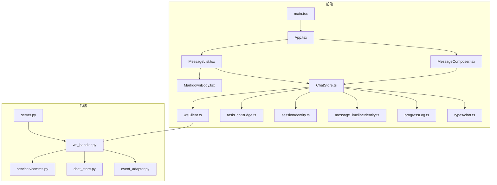
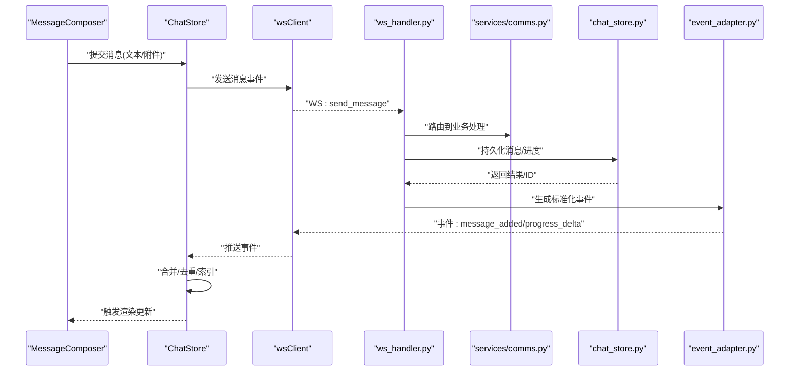
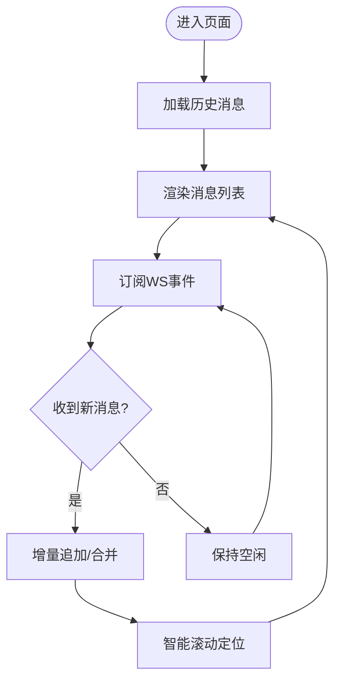
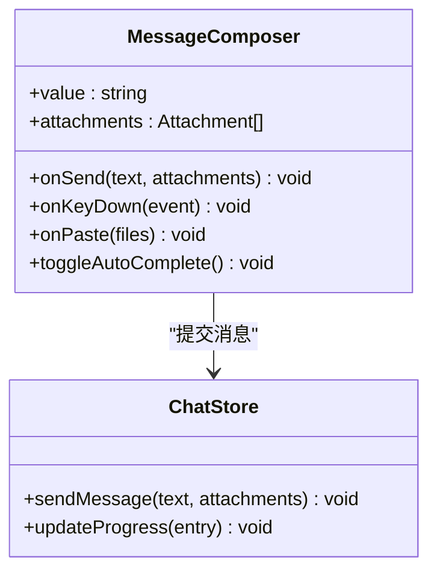
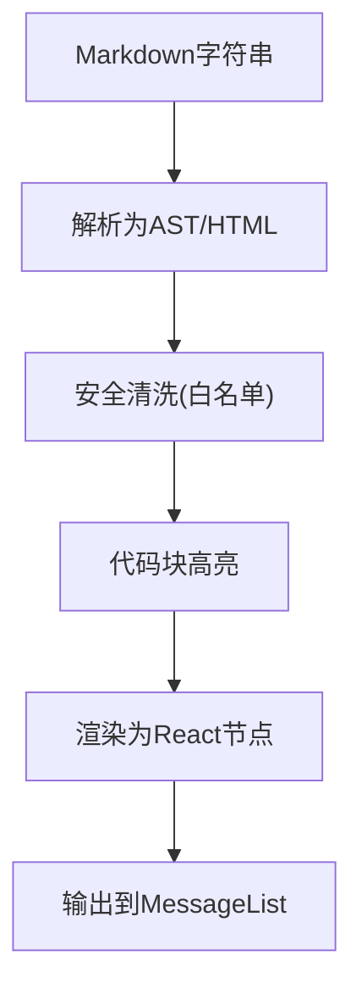
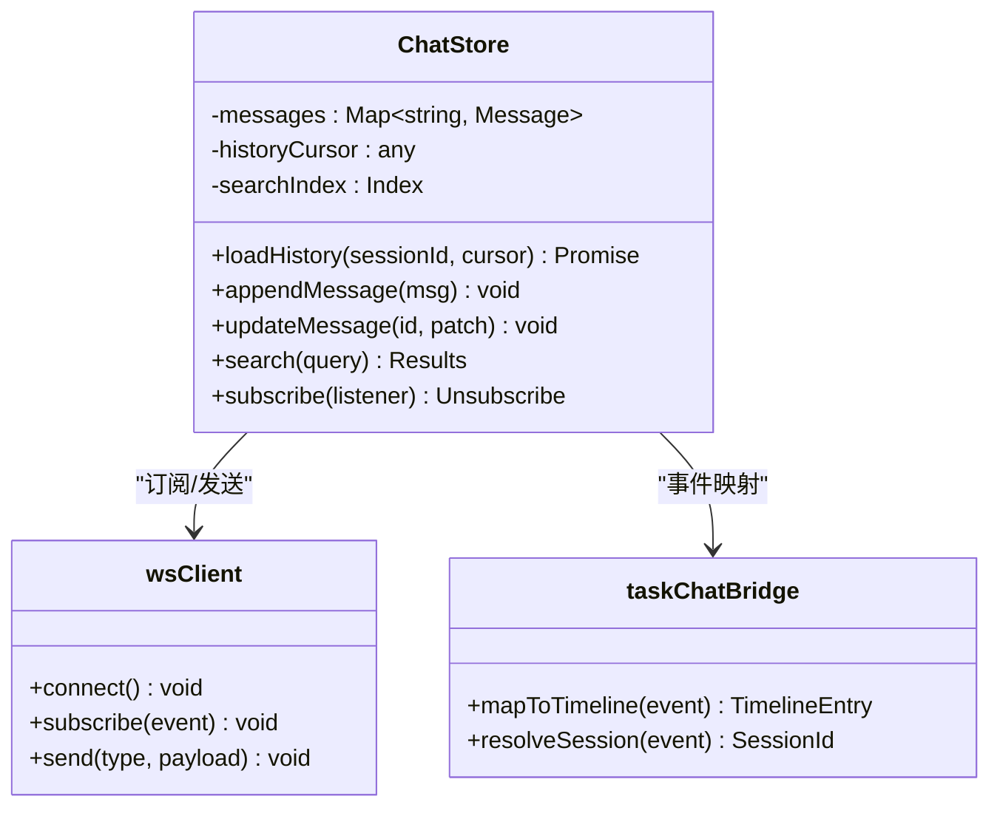
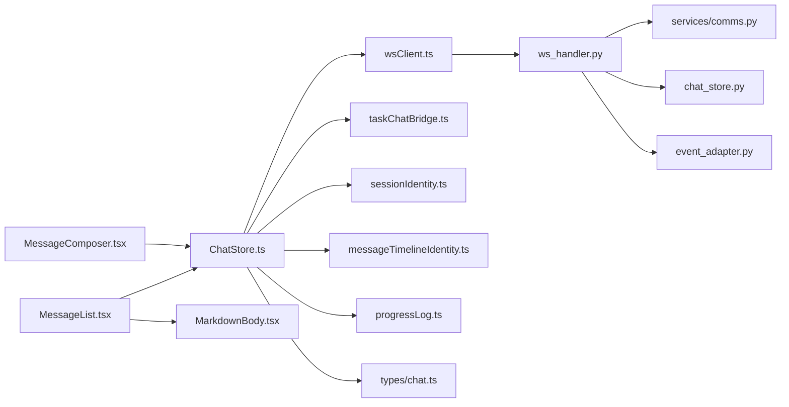

# 聊天界面

<cite>
**本文引用的文件**   
- [App.tsx](file://opc/plugins/office_ui/frontend_src/App.tsx)
- [main.tsx](file://opc/plugins/office_ui/frontend_src/main.tsx)
- [MessageList.tsx](file://opc/plugins/office_ui/frontend_src/chat/MessageList.tsx)
- [MessageComposer.tsx](file://opc/plugins/office_ui/frontend_src/chat/MessageComposer.tsx)
- [MarkdownBody.tsx](file://opc/plugins/office_ui/frontend_src/chat/MarkdownBody.tsx)
- [ChatStore.ts](file://opc/plugins/office_ui/frontend_src/chat/ChatStore.ts)
- [wsClient.ts](file://opc/plugins/office_ui/frontend_src/lib/wsClient.ts)
- [taskChatBridge.ts](file://opc/plugins/office_ui/frontend_src/lib/taskChatBridge.ts)
- [sessionIdentity.ts](file://opc/plugins/office_ui/frontend_src/lib/sessionIdentity.ts)
- [messageTimelineIdentity.ts](file://opc/plugins/office_ui/frontend_src/lib/messageTimelineIdentity.ts)
- [progressLog.ts](file://opc/plugins/office_ui/frontend_src/lib/progressLog.ts)
- [server.py](file://opc/plugins/office_ui/server.py)
- [ws_handler.py](file://opc/plugins/office_ui/ws_handler.py)
- [comms.py](file://opc/plugins/office_ui/services/comms.py)
- [chat_store.py](file://opc/plugins/office_ui/chat_store.py)
- [event_adapter.py](file://opc/plugins/office_ui/event_adapter.py)
- [types/chat.ts](file://opc/plugins/office_ui/frontend_src/types/chat.ts)
</cite>

## 目录
1. [简介](#简介)
2. [项目结构](#项目结构)
3. [核心组件](#核心组件)
4. [架构总览](#架构总览)
5. [详细组件分析](#详细组件分析)
6. [依赖关系分析](#依赖关系分析)
7. [性能与内存优化](#性能与内存优化)
8. [故障排查指南](#故障排查指南)
9. [结论](#结论)
10. [附录](#附录)

## 简介
本文件面向OpenOPC的Web聊天界面，聚焦以下目标：
- 消息列表渲染、实时消息更新与用户输入处理
- 消息组件设计：文本消息、富文本消息、代码块与附件的渲染逻辑
- Markdown内容的解析与显示机制
- 用户输入组件：多行输入、快捷键支持、自动完成
- 聊天状态管理：消息存储、历史加载与搜索
- 样式定制与主题切换方法
- 性能优化与内存管理策略

## 项目结构
聊天界面位于前端工程 office_ui 中，采用React + TypeScript实现，后端通过WebSocket提供实时通信。关键路径如下：
- 前端入口与根应用：main.tsx、App.tsx
- 聊天UI：chat/MessageList.tsx、chat/MessageComposer.tsx、chat/MarkdownBody.tsx
- 状态与数据流：chat/ChatStore.ts、lib/wsClient.ts、lib/taskChatBridge.ts
- 类型定义：types/chat.ts
- 后端服务与WS处理器：server.py、ws_handler.py、services/comms.py、chat_store.py、event_adapter.py

图表来源
- [main.tsx:1-50](file://opc/plugins/office_ui/frontend_src/main.tsx#L1-L50)
- [App.tsx:1-120](file://opc/plugins/office_ui/frontend_src/App.tsx#L1-L120)
- [MessageList.tsx:1-200](file://opc/plugins/office_ui/frontend_src/chat/MessageList.tsx#L1-L200)
- [MessageComposer.tsx:1-200](file://opc/plugins/office_ui/frontend_src/chat/MessageComposer.tsx#L1-L200)
- [MarkdownBody.tsx:1-150](file://opc/plugins/office_ui/frontend_src/chat/MarkdownBody.tsx#L1-L150)
- [ChatStore.ts:1-300](file://opc/plugins/office_ui/frontend_src/chat/ChatStore.ts#L1-L300)
- [wsClient.ts:1-200](file://opc/plugins/office_ui/frontend_src/lib/wsClient.ts#L1-L200)
- [taskChatBridge.ts:1-150](file://opc/plugins/office_ui/frontend_src/lib/taskChatBridge.ts#L1-L150)
- [sessionIdentity.ts:1-100](file://opc/plugins/office_ui/frontend_src/lib/sessionIdentity.ts#L1-L100)
- [messageTimelineIdentity.ts:1-100](file://opc/plugins/office_ui/frontend_src/lib/messageTimelineIdentity.ts#L1-L100)
- [progressLog.ts:1-120](file://opc/plugins/office_ui/frontend_src/lib/progressLog.ts#L1-L120)
- [types/chat.ts:1-200](file://opc/plugins/office_ui/frontend_src/types/chat.ts#L1-L200)
- [server.py:1-120](file://opc/plugins/office_ui/server.py#L1-L120)
- [ws_handler.py:1-200](file://opc/plugins/office_ui/ws_handler.py#L1-L200)
- [comms.py:1-150](file://opc/plugins/office_ui/services/comms.py#L1-L150)
- [chat_store.py:1-200](file://opc/plugins/office_ui/chat_store.py#L1-L200)
- [event_adapter.py:1-150](file://opc/plugins/office_ui/event_adapter.py#L1-L150)

章节来源
- [main.tsx:1-50](file://opc/plugins/office_ui/frontend_src/main.tsx#L1-L50)
- [App.tsx:1-120](file://opc/plugins/office_ui/frontend_src/App.tsx#L1-L120)

## 核心组件
- 消息列表（MessageList）：负责渲染会话消息、滚动定位、增量更新与虚拟滚动（如启用）。
- 消息编辑器（MessageComposer）：多行输入、快捷键（如Enter发送）、可选自动完成、附件选择与预览。
- Markdown渲染（MarkdownBody）：将Markdown内容转换为HTML并安全展示，支持代码块高亮、链接与图片等。
- 聊天状态（ChatStore）：集中管理消息集合、会话标识、进度日志、历史加载、搜索索引与去重。
- WebSocket客户端（wsClient）：连接后端、订阅事件、发送消息、断线重连与心跳。
- 任务桥接（taskChatBridge）：将任务上下文与聊天事件关联，统一时间线与身份映射。
- 类型定义（types/chat.ts）：消息、附件、进度条目等数据结构契约。

章节来源
- [MessageList.tsx:1-200](file://opc/plugins/office_ui/frontend_src/chat/MessageList.tsx#L1-L200)
- [MessageComposer.tsx:1-200](file://opc/plugins/office_ui/frontend_src/chat/MessageComposer.tsx#L1-L200)
- [MarkdownBody.tsx:1-150](file://opc/plugins/office_ui/frontend_src/chat/MarkdownBody.tsx#L1-L150)
- [ChatStore.ts:1-300](file://opc/plugins/office_ui/frontend_src/chat/ChatStore.ts#L1-L300)
- [wsClient.ts:1-200](file://opc/plugins/office_ui/frontend_src/lib/wsClient.ts#L1-L200)
- [taskChatBridge.ts:1-150](file://opc/plugins/office_ui/frontend_src/lib/taskChatBridge.ts#L1-L150)
- [types/chat.ts:1-200](file://opc/plugins/office_ui/frontend_src/types/chat.ts#L1-L200)

## 架构总览
聊天系统由“前端UI + 状态层 + WS客户端”与“后端WS服务 + 事件适配 + 聊天存储”组成。前端通过wsClient订阅后端事件，ChatStore维护消息与进度；后端ws_handler接收客户端消息，调用comms与chat_store进行持久化与广播，event_adapter将内部事件标准化为前端可消费的消息格式。

图表来源
- [MessageComposer.tsx:1-200](file://opc/plugins/office_ui/frontend_src/chat/MessageComposer.tsx#L1-L200)
- [ChatStore.ts:1-300](file://opc/plugins/office_ui/frontend_src/chat/ChatStore.ts#L1-L300)
- [wsClient.ts:1-200](file://opc/plugins/office_ui/frontend_src/lib/wsClient.ts#L1-L200)
- [ws_handler.py:1-200](file://opc/plugins/office_ui/ws_handler.py#L1-L200)
- [comms.py:1-150](file://opc/plugins/office_ui/services/comms.py#L1-L150)
- [chat_store.py:1-200](file://opc/plugins/office_ui/chat_store.py#L1-L200)
- [event_adapter.py:1-150](file://opc/plugins/office_ui/event_adapter.py#L1-L150)

## 详细组件分析

### 消息列表（MessageList）
- 渲染策略：按时间线顺序渲染消息，支持增量追加与滚动锚定；对长列表可采用虚拟滚动以减少DOM节点数量。
- 实时更新：监听ChatStore的事件，仅对新增或变更的消息进行局部更新，避免全量重渲染。
- 交互能力：点击复制、展开折叠、跳转至特定消息、搜索高亮匹配片段。
- 性能要点：稳定key（基于messageTimelineIdentity），避免不必要的re-render；懒加载历史消息。

图表来源
- [MessageList.tsx:1-200](file://opc/plugins/office_ui/frontend_src/chat/MessageList.tsx#L1-L200)
- [ChatStore.ts:1-300](file://opc/plugins/office_ui/frontend_src/chat/ChatStore.ts#L1-L300)
- [messageTimelineIdentity.ts:1-100](file://opc/plugins/office_ui/frontend_src/lib/messageTimelineIdentity.ts#L1-L100)

章节来源
- [MessageList.tsx:1-200](file://opc/plugins/office_ui/frontend_src/chat/MessageList.tsx#L1-L200)
- [messageTimelineIdentity.ts:1-100](file://opc/plugins/office_ui/frontend_src/lib/messageTimelineIdentity.ts#L1-L100)

### 消息编辑器（MessageComposer）
- 多行输入：支持换行（Shift+Enter），回车发送（可配置）。
- 快捷键：全局快捷键绑定（如Ctrl/Cmd+Enter发送），Tab补全（若启用）。
- 自动完成：基于当前会话上下文与工具提示词建议，提供候选项插入。
- 附件处理：选择文件后生成预览与缩略图，上传成功后嵌入消息体。
- 校验与反馈：输入长度限制、非法字符过滤、错误提示与重试。

图表来源
- [MessageComposer.tsx:1-200](file://opc/plugins/office_ui/frontend_src/chat/MessageComposer.tsx#L1-L200)
- [ChatStore.ts:1-300](file://opc/plugins/office_ui/frontend_src/chat/ChatStore.ts#L1-L300)

章节来源
- [MessageComposer.tsx:1-200](file://opc/plugins/office_ui/frontend_src/chat/MessageComposer.tsx#L1-L200)

### Markdown渲染（MarkdownBody）
- 解析流程：将Markdown字符串转换为AST/HTML，注入安全白名单，渲染为React节点。
- 代码块：语法高亮、行号、复制按钮；大段代码使用虚拟渲染或分页。
- 富文本元素：表格、列表、引用、图片、链接；图片懒加载与占位符。
- 安全性：过滤危险标签与属性，防止XSS；外链在新窗口打开。
- 扩展点：自定义指令与组件插槽（如进度卡片、附件卡片）。

图表来源
- [MarkdownBody.tsx:1-150](file://opc/plugins/office_ui/frontend_src/chat/MarkdownBody.tsx#L1-L150)

章节来源
- [MarkdownBody.tsx:1-150](file://opc/plugins/office_ui/frontend_src/chat/MarkdownBody.tsx#L1-L150)

### 聊天状态（ChatStore）
- 消息存储：以Map/List混合结构维护消息，按会话隔离；支持去重与幂等更新。
- 历史加载：分页拉取、游标/时间戳断点续传；预取下一页提升体验。
- 搜索功能：构建倒排索引，支持关键词高亮与快速跳转。
- 进度日志：合并progress delta，折叠重复条目，保留最新摘要。
- 会话与时间线：结合sessionIdentity与messageTimelineIdentity保证唯一性与排序。

图表来源
- [ChatStore.ts:1-300](file://opc/plugins/office_ui/frontend_src/chat/ChatStore.ts#L1-L300)
- [wsClient.ts:1-200](file://opc/plugins/office_ui/frontend_src/lib/wsClient.ts#L1-L200)
- [taskChatBridge.ts:1-150](file://opc/plugins/office_ui/frontend_src/lib/taskChatBridge.ts#L1-L150)
- [sessionIdentity.ts:1-100](file://opc/plugins/office_ui/frontend_src/lib/sessionIdentity.ts#L1-L100)
- [messageTimelineIdentity.ts:1-100](file://opc/plugins/office_ui/frontend_src/lib/messageTimelineIdentity.ts#L1-L100)
- [progressLog.ts:1-120](file://opc/plugins/office_ui/frontend_src/lib/progressLog.ts#L1-L120)

章节来源
- [ChatStore.ts:1-300](file://opc/plugins/office_ui/frontend_src/chat/ChatStore.ts#L1-L300)
- [progressLog.ts:1-120](file://opc/plugins/office_ui/frontend_src/lib/progressLog.ts#L1-L120)

### WebSocket客户端（wsClient）
- 连接管理：自动重连、指数退避、心跳保活。
- 事件订阅：按会话/频道订阅，减少无关流量。
- 消息发送：序列化payload，失败重试与超时控制。
- 错误处理：网络异常降级、离线队列与恢复。

章节来源
- [wsClient.ts:1-200](file://opc/plugins/office_ui/frontend_src/lib/wsClient.ts#L1-L200)

### 后端服务（ws_handler / comms / chat_store / event_adapter）
- ws_handler：接收WS消息，鉴权与会话路由，分发到comms与chat_store。
- comms：业务编排，调用工具链与外部服务，产出结构化结果。
- chat_store：持久化消息、进度与元数据，提供查询接口。
- event_adapter：将内部事件标准化为前端可消费的JSON事件，确保一致性。

章节来源
- [ws_handler.py:1-200](file://opc/plugins/office_ui/ws_handler.py#L1-L200)
- [comms.py:1-150](file://opc/plugins/office_ui/services/comms.py#L1-L150)
- [chat_store.py:1-200](file://opc/plugins/office_ui/chat_store.py#L1-L200)
- [event_adapter.py:1-150](file://opc/plugins/office_ui/event_adapter.py#L1-L150)

## 依赖关系分析
- 前端模块耦合：
  - MessageList依赖ChatStore与MarkdownBody，低耦合于具体消息类型。
  - MessageComposer依赖ChatStore与types/chat.ts，解耦于传输协议。
  - ChatStore依赖wsClient、taskChatBridge、sessionIdentity、messageTimelineIdentity与progressLog。
- 前后端契约：
  - types/chat.ts定义消息、附件、进度等结构，前后端保持一致。
  - ws_handler与wsClient约定事件名与载荷格式。

图表来源
- [MessageList.tsx:1-200](file://opc/plugins/office_ui/frontend_src/chat/MessageList.tsx#L1-L200)
- [MessageComposer.tsx:1-200](file://opc/plugins/office_ui/frontend_src/chat/MessageComposer.tsx#L1-L200)
- [MarkdownBody.tsx:1-150](file://opc/plugins/office_ui/frontend_src/chat/MarkdownBody.tsx#L1-L150)
- [ChatStore.ts:1-300](file://opc/plugins/office_ui/frontend_src/chat/ChatStore.ts#L1-L300)
- [wsClient.ts:1-200](file://opc/plugins/office_ui/frontend_src/lib/wsClient.ts#L1-L200)
- [taskChatBridge.ts:1-150](file://opc/plugins/office_ui/frontend_src/lib/taskChatBridge.ts#L1-L150)
- [sessionIdentity.ts:1-100](file://opc/plugins/office_ui/frontend_src/lib/sessionIdentity.ts#L1-L100)
- [messageTimelineIdentity.ts:1-100](file://opc/plugins/office_ui/frontend_src/lib/messageTimelineIdentity.ts#L1-L100)
- [progressLog.ts:1-120](file://opc/plugins/office_ui/frontend_src/lib/progressLog.ts#L1-L120)
- [types/chat.ts:1-200](file://opc/plugins/office_ui/frontend_src/types/chat.ts#L1-L200)
- [ws_handler.py:1-200](file://opc/plugins/office_ui/ws_handler.py#L1-L200)
- [comms.py:1-150](file://opc/plugins/office_ui/services/comms.py#L1-L150)
- [chat_store.py:1-200](file://opc/plugins/office_ui/chat_store.py#L1-L200)
- [event_adapter.py:1-150](file://opc/plugins/office_ui/event_adapter.py#L1-L150)

章节来源
- [types/chat.ts:1-200](file://opc/plugins/office_ui/frontend_src/types/chat.ts#L1-L200)

## 性能与内存优化
- 列表渲染
  - 使用稳定的key（messageTimelineIdentity）减少重排。
  - 虚拟滚动：仅渲染可视区域节点，降低DOM压力。
  - 增量更新：基于diff与不可变数据，避免整表重绘。
- 历史加载
  - 分页与游标：按需加载，避免一次性载入大量历史。
  - 预取下一页：在滚动接近底部时提前请求。
- Markdown渲染
  - 代码块懒渲染与分页；大文档分片渲染。
  - 图片懒加载与占位符，减少首屏资源。
- 状态管理
  - 去重与幂等：基于消息ID合并增量，避免重复条目。
  - 搜索索引：增量更新倒排索引，避免全量扫描。
- WebSocket
  - 心跳与重连：保障稳定性，避免频繁重建连接。
  - 事件过滤：按会话订阅，减少无效事件处理。
- 内存管理
  - 及时释放：断开会话时清理订阅与缓存。
  - 对象池：复用正则与解析器实例，减少GC压力。

[本节为通用指导，不直接分析具体文件]

## 故障排查指南
- 无法连接WS
  - 检查wsClient连接状态与重连策略；确认后端server.py与ws_handler.py运行正常。
- 消息未显示
  - 核对event_adapter输出的事件结构是否符合types/chat.ts；查看ChatStore是否成功合并与触发更新。
- 历史加载失败
  - 检查chat_store分页参数与游标；确认ws_handler是否正确转发历史请求。
- Markdown渲染异常
  - 检查MarkdownBody的安全清洗规则与高亮插件；确认输入是否为合法Markdown。
- 搜索无结果
  - 验证搜索索引是否随消息更新而增量刷新；检查查询词规范化逻辑。

章节来源
- [wsClient.ts:1-200](file://opc/plugins/office_ui/frontend_src/lib/wsClient.ts#L1-L200)
- [event_adapter.py:1-150](file://opc/plugins/office_ui/event_adapter.py#L1-L150)
- [ChatStore.ts:1-300](file://opc/plugins/office_ui/frontend_src/chat/ChatStore.ts#L1-L300)
- [chat_store.py:1-200](file://opc/plugins/office_ui/chat_store.py#L1-L200)
- [MarkdownBody.tsx:1-150](file://opc/plugins/office_ui/frontend_src/chat/MarkdownBody.tsx#L1-L150)

## 结论
OpenOPC聊天界面通过清晰的前后端分层与事件驱动架构，实现了高效的消息渲染、实时同步与可扩展的Markdown渲染。借助ChatStore的状态管理与wsClient的稳定通信，系统在性能与可靠性方面具备良好基础。后续可在虚拟滚动、搜索索引与渲染分片等方面进一步优化，以提升大规模会话下的用户体验。

[本节为总结性内容，不直接分析具体文件]

## 附录
- 样式定制与主题切换
  - 在MarkdownBody与MessageList中引入CSS变量或主题类，通过外层容器切换主题模式（明/暗）。
  - 为代码块与附件卡片提供主题钩子，便于统一风格。
- 快捷键与自动完成
  - 在MessageComposer中注册全局键盘事件，区分编辑态与全局态。
  - 自动完成建议可从sessionIdentity与taskChatBridge提供的上下文派生。
- 类型契约
  - 严格遵循types/chat.ts定义，确保前后端一致；新增字段需同步更新event_adapter与ws_handler。

[本节为补充说明，不直接分析具体文件]