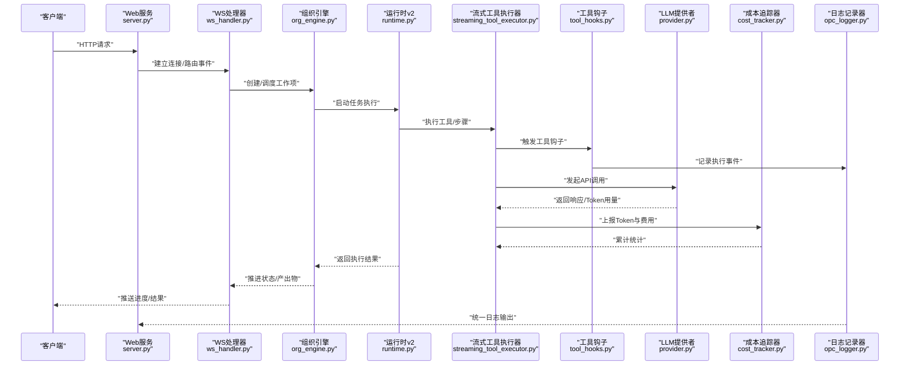
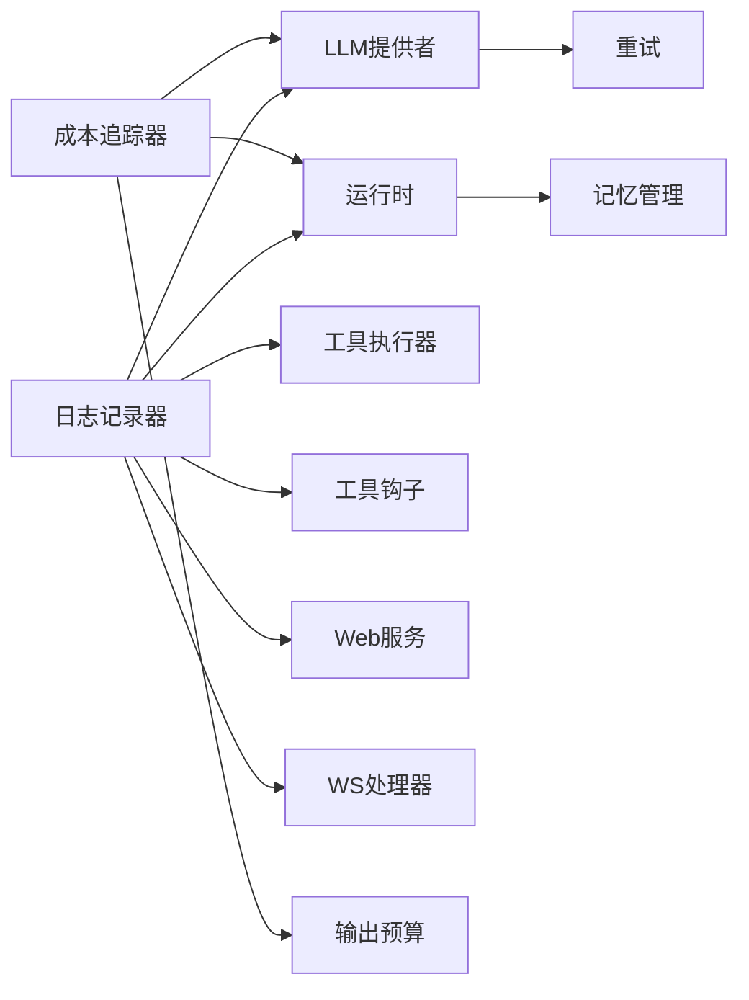

# 可观测性系统

<cite>
**本文引用的文件**   
- [opc_logger.py](file://opc/layer6_observability/opc_logger.py)
- [cost_tracker.py](file://opc/layer6_observability/cost_tracker.py)
- [system_config.yaml](file://config/system_config.yaml)
- [llm_config.yaml](file://config/llm_config.yaml)
- [agent_config.yaml](file://config/agent_config.yaml)
- [channel_config.yaml](file://config/channel_config.yaml)
- [company_corporate_config.yaml](file://config/company_corporate_config.yaml)
- [provider.py](file://opc/llm/provider.py)
- [retry.py](file://opc/llm/retry.py)
- [message_bus.py](file://opc/layer0_interaction/message_bus.py)
- [org_engine.py](file://opc/layer2_organization/org_engine.py)
- [runtime.py](file://opc/layer3_agent/runtime_v2/runtime.py)
- [streaming_tool_executor.py](file://opc/layer3_agent/runtime_v2/streaming_tool_executor.py)
- [tool_hooks.py](file://opc/layer3_agent/runtime_v2/tool_hooks.py)
- [output_budget.py](file://opc/layer4_tools/output_budget.py)
- [memory_manager.py](file://opc/layer5_memory/memory_manager.py)
- [server.py](file://opc/plugins/office_ui/server.py)
- [ws_handler.py](file://opc/plugins/office_ui/ws_handler.py)
</cite>

## 目录
1. [简介](#简介)
2. [项目结构](#项目结构)
3. [核心组件](#核心组件)
4. [架构总览](#架构总览)
5. [详细组件分析](#详细组件分析)
6. [依赖关系分析](#依赖关系分析)
7. [性能考量](#性能考量)
8. [故障排查指南](#故障排查指南)
9. [结论](#结论)
10. [附录](#附录)

## 简介
本文件面向OpenOPC的可观测性子系统，聚焦日志记录、成本追踪、性能监控指标、分布式追踪与链路跟踪、告警与通知配置、日志聚合与分析工具使用建议，以及性能瓶颈识别与优化策略。目标是帮助运维团队有效监控系统健康状态，快速定位问题并持续优化系统表现。

## 项目结构
可观测性相关代码集中在 opc/layer6_observability 目录，包含日志记录器与成本追踪器；同时，LLM调用、运行时执行、工具执行与UI层均埋点了关键指标与事件，便于端到端观测。

```mermaid
graph TB
subgraph "可观测性"
LOG["日志记录器<br/>opc/layer6_observability/opc_logger.py"]
COST["成本追踪器<br/>opc/layer6_observability/cost_tracker.py"]
end
subgraph "LLM层"
LLMProv["LLM提供者<br/>opc/llm/provider.py"]
Retry["重试机制<br/>opc/llm/retry.py"]
end
subgraph "组织与运行"
OrgEngine["组织引擎<br/>opc/layer2_organization/org_engine.py"]
RuntimeV2["运行时v2<br/>opc/layer3_agent/runtime_v2/runtime.py"]
StreamExec["流式工具执行器<br/>opc/layer3_agent/runtime_v2/streaming_tool_executor.py"]
ToolHooks["工具钩子<br/>opc/layer3_agent/runtime_v2/tool_hooks.py"]
end
subgraph "工具与记忆"
OutputBudget["输出预算控制<br/>opc/layer4_tools/output_budget.py"]
MemMgr["记忆管理<br/>opc/layer5_memory/memory_manager.py"]
end
subgraph "消息与UI"
MsgBus["消息总线<br/>opc/layer0_interaction/message_bus.py"]
Server["Web服务<br/>opc/plugins/office_ui/server.py"]
WSHandler["WS处理器<br/>opc/plugins/office_ui/ws_handler.py"]
end
LOG --> OrgEngine
LOG --> RuntimeV2
LOG --> StreamExec
LOG --> ToolHooks
LOG --> LLMProv
LOG --> Retry
LOG --> OutputBudget
LOG --> MemMgr
LOG --> MsgBus
LOG --> Server
LOG --> WSHandler
COST --> LLMProv
COST --> OutputBudget
COST --> RuntimeV2
```

图表来源
- [opc_logger.py](file://opc/layer6_observability/opc_logger.py)
- [cost_tracker.py](file://opc/layer6_observability/cost_tracker.py)
- [provider.py](file://opc/llm/provider.py)
- [retry.py](file://opc/llm/retry.py)
- [org_engine.py](file://opc/layer2_organization/org_engine.py)
- [runtime.py](file://opc/layer3_agent/runtime_v2/runtime.py)
- [streaming_tool_executor.py](file://opc/layer3_agent/runtime_v2/streaming_tool_executor.py)
- [tool_hooks.py](file://opc/layer3_agent/runtime_v2/tool_hooks.py)
- [output_budget.py](file://opc/layer4_tools/output_budget.py)
- [memory_manager.py](file://opc/layer5_memory/memory_manager.py)
- [message_bus.py](file://opc/layer0_interaction/message_bus.py)
- [server.py](file://opc/plugins/office_ui/server.py)
- [ws_handler.py](file://opc/plugins/office_ui/ws_handler.py)

章节来源
- [opc_logger.py](file://opc/layer6_observability/opc_logger.py)
- [cost_tracker.py](file://opc/layer6_observability/cost_tracker.py)
- [system_config.yaml](file://config/system_config.yaml)
- [llm_config.yaml](file://config/llm_config.yaml)
- [agent_config.yaml](file://config/agent_config.yaml)
- [channel_config.yaml](file://config/channel_config.yaml)
- [company_corporate_config.yaml](file://config/company_corporate_config.yaml)

## 核心组件
- 日志记录器：提供结构化日志能力，支持按模块/级别过滤、上下文注入（如会话ID、工作项ID）、统一格式输出，便于集中采集与检索。
- 成本追踪器：围绕LLM调用统计Token消耗，结合模型定价策略计算费用，并提供汇总与明细查询接口。
- 运行时与工具执行埋点：在任务编排、工具执行、流式处理等关键路径记录耗时、错误率、吞吐等指标。
- UI与服务层埋点：通过WebSocket推送进度与事件，服务端记录请求生命周期与异常。

章节来源
- [opc_logger.py](file://opc/layer6_observability/opc_logger.py)
- [cost_tracker.py](file://opc/layer6_observability/cost_tracker.py)
- [runtime.py](file://opc/layer3_agent/runtime_v2/runtime.py)
- [streaming_tool_executor.py](file://opc/layer3_agent/runtime_v2/streaming_tool_executor.py)
- [tool_hooks.py](file://opc/layer3_agent/runtime_v2/tool_hooks.py)
- [server.py](file://opc/plugins/office_ui/server.py)
- [ws_handler.py](file://opc/plugins/office_ui/ws_handler.py)

## 架构总览
下图展示了从用户请求到LLM调用、工具执行、记忆存取与结果回传的完整链路，并在各阶段记录日志与指标，供成本追踪与性能分析使用。

图表来源
- [server.py](file://opc/plugins/office_ui/server.py)
- [ws_handler.py](file://opc/plugins/office_ui/ws_handler.py)
- [org_engine.py](file://opc/layer2_organization/org_engine.py)
- [runtime.py](file://opc/layer3_agent/runtime_v2/runtime.py)
- [streaming_tool_executor.py](file://opc/layer3_agent/runtime_v2/streaming_tool_executor.py)
- [tool_hooks.py](file://opc/layer3_agent/runtime_v2/tool_hooks.py)
- [provider.py](file://opc/llm/provider.py)
- [cost_tracker.py](file://opc/layer6_observability/cost_tracker.py)
- [opc_logger.py](file://opc/layer6_observability/opc_logger.py)

## 详细组件分析

### 日志记录器（opc_logger）
- 设计要点
  - 结构化字段：时间戳、级别、模块、上下文键值对（会话ID、工作项ID、用户标识等）。
  - 分级输出：DEBUG/INFO/WARN/ERROR/FATAL，便于不同环境切换。
  - 上下文传播：在异步与并发场景下保持上下文一致性。
  - 输出目标：控制台、文件、或外部日志收集器（可通过配置切换）。
- 配置项
  - 日志级别、输出路径、格式化模板、是否包含堆栈信息、采样率等。
- 使用建议
  - 在关键路径（入口、分支、异常、外部调用前后）插入日志。
  - 避免打印敏感数据，必要时脱敏。
  - 为长链路操作附加trace_id以便跨模块关联。

章节来源
- [opc_logger.py](file://opc/layer6_observability/opc_logger.py)
- [system_config.yaml](file://config/system_config.yaml)

### 成本追踪器（cost_tracker）
- 功能范围
  - API调用统计：调用次数、成功/失败、延迟分布。
  - Token消耗计算：输入/输出Token计数，结合模型定价策略估算费用。
  - 费用分析：按会话、工作项、模型、渠道维度汇总。
- 数据模型
  - 调用记录：模型名、方法、输入长度、输出长度、耗时、状态码、错误类型。
  - 计费参数：单价表、折扣策略、币种换算。
- 集成点
  - 在LLM提供者返回后上报Token与费用。
  - 在工具执行与运行时阶段记录资源使用与耗时。
- 配置项
  - 模型定价表、采样窗口、聚合粒度、导出格式。

章节来源
- [cost_tracker.py](file://opc/layer6_observability/cost_tracker.py)
- [provider.py](file://opc/llm/provider.py)
- [llm_config.yaml](file://config/llm_config.yaml)

### 运行时与工具执行埋点
- 运行时（runtime）
  - 记录任务生命周期事件：开始、暂停、恢复、完成、失败。
  - 记录阶段转换与钩子执行耗时。
- 流式工具执行器（streaming_tool_executor）
  - 记录分块传输、增量处理、背压与超时。
- 工具钩子（tool_hooks）
  - 在工具调用前后注入日志与指标，统一捕获异常与返回值。

章节来源
- [runtime.py](file://opc/layer3_agent/runtime_v2/runtime.py)
- [streaming_tool_executor.py](file://opc/layer3_agent/runtime_v2/streaming_tool_executor.py)
- [tool_hooks.py](file://opc/layer3_agent/runtime_v2/tool_hooks.py)

### LLM调用与重试
- 提供者（provider）
  - 封装外部LLM接口，统一入参出参与错误映射。
  - 记录请求ID、模型版本、速率限制与配额信息。
- 重试（retry）
  - 指数退避、最大重试次数、可重试错误分类。
  - 重试期间记录中间状态与最终失败原因。

章节来源
- [provider.py](file://opc/llm/provider.py)
- [retry.py](file://opc/llm/retry.py)

### 输出预算与记忆管理
- 输出预算（output_budget）
  - 控制单次输出的Token上限，防止超限导致费用飙升。
  - 记录预算使用率与截断事件。
- 记忆管理（memory_manager）
  - 记录读写次数、缓存命中率、压缩比例与持久化开销。

章节来源
- [output_budget.py](file://opc/layer4_tools/output_budget.py)
- [memory_manager.py](file://opc/layer5_memory/memory_manager.py)

### UI与服务层
- Web服务（server）
  - 记录HTTP请求生命周期、路由匹配、鉴权与限流。
- WebSocket处理器（ws_handler）
  - 记录连接建立/断开、消息收发、错误重连与心跳。

章节来源
- [server.py](file://opc/plugins/office_ui/server.py)
- [ws_handler.py](file://opc/plugins/office_ui/ws_handler.py)

## 依赖关系分析
- 耦合与内聚
  - 日志记录器作为横切关注点被广泛引用，提升内聚性与一致性。
  - 成本追踪器依赖LLM提供者与运行时，形成清晰的单向依赖。
- 外部依赖
  - LLM提供商、消息总线、存储后端、网络I/O。
- 潜在循环依赖
  - 通过分层与接口隔离避免循环，确保可观测性组件不反向依赖业务逻辑。

图表来源
- [opc_logger.py](file://opc/layer6_observability/opc_logger.py)
- [cost_tracker.py](file://opc/layer6_observability/cost_tracker.py)
- [provider.py](file://opc/llm/provider.py)
- [retry.py](file://opc/llm/retry.py)
- [runtime.py](file://opc/layer3_agent/runtime_v2/runtime.py)
- [streaming_tool_executor.py](file://opc/layer3_agent/runtime_v2/streaming_tool_executor.py)
- [tool_hooks.py](file://opc/layer3_agent/runtime_v2/tool_hooks.py)
- [output_budget.py](file://opc/layer4_tools/output_budget.py)
- [memory_manager.py](file://opc/layer5_memory/memory_manager.py)
- [server.py](file://opc/plugins/office_ui/server.py)
- [ws_handler.py](file://opc/plugins/office_ui/ws_handler.py)

## 性能考量
- 指标定义与采集
  - 延迟：P50/P90/P99，区分首字节时间与总耗时。
  - 吞吐：QPS、消息吞吐、工具调用吞吐。
  - 错误率：按模块/接口维度统计。
  - 资源：CPU、内存、磁盘IO、网络带宽。
  - 成本：Token/次、费用/会话、费用/模型。
- 采集方式
  - 在关键函数入口/出口打点，使用高精度计时器。
  - 异步任务采用上下文传递的trace_id进行关联。
  - 批量上报与采样降低开销。
- 优化建议
  - 减少不必要的日志与序列化开销，按需开启调试级别。
  - 合并小对象写入，使用缓冲队列。
  - 对热点路径引入缓存与批处理。
  - 合理设置重试与退避策略，避免雪崩。

[本节为通用指导，无需具体文件来源]

## 故障排查指南
- 常见问题定位
  - 高延迟：检查LLM提供者响应、重试次数、网络抖动。
  - 高错误率：查看错误分类与堆栈，确认限流与配额。
  - 费用异常：核对Token计数与定价表，检查输出预算是否生效。
  - 内存泄漏：观察记忆管理与持久化写入频率。
- 诊断流程
  - 从UI/WS层入手，获取trace_id与请求ID。
  - 在运行时与工具执行器中定位慢步骤。
  - 在LLM提供者与重试模块确认外部依赖状态。
  - 使用成本追踪器核对Token与费用明细。
- 告警与通知
  - 基于阈值（延迟、错误率、费用）触发告警。
  - 通知渠道：邮件、IM、短信等，按严重级别路由。
  - 示例规则（概念性）：
    - P99延迟超过阈值持续N分钟。
    - 错误率超过阈值且绝对数量大于N。
    - 每小时费用超过预算。
    - 重试成功率低于阈值。

章节来源
- [retry.py](file://opc/llm/retry.py)
- [cost_tracker.py](file://opc/layer6_observability/cost_tracker.py)
- [server.py](file://opc/plugins/office_ui/server.py)
- [ws_handler.py](file://opc/plugins/office_ui/ws_handler.py)

## 结论
通过统一的日志记录与成本追踪，结合运行时与工具执行的深度埋点，OpenOPC实现了端到端的可观测性。配合合理的指标定义、告警规则与日志聚合分析工具，运维团队能够高效监控健康状态、快速定位问题并持续优化性能与成本。

## 附录

### 配置选项参考
- 系统配置（system_config.yaml）
  - 日志级别、输出目标、采样率、时区与编码。
- LLM配置（llm_config.yaml）
  - 模型列表、密钥、超时、重试策略、价格表。
- 代理配置（agent_config.yaml）
  - 默认工具集、输出预算、上下文窗口大小。
- 渠道配置（channel_config.yaml）
  - 通知渠道、回调地址、重试与退避。
- 企业配置（company_corporate_config.yaml）
  - 组织级策略、权限、审计开关。

章节来源
- [system_config.yaml](file://config/system_config.yaml)
- [llm_config.yaml](file://config/llm_config.yaml)
- [agent_config.yaml](file://config/agent_config.yaml)
- [channel_config.yaml](file://config/channel_config.yaml)
- [company_corporate_config.yaml](file://config/company_corporate_config.yaml)

### 分布式追踪与链路跟踪
- 链路标识
  - 为每次请求生成唯一trace_id，贯穿UI、WS、组织引擎、运行时、工具执行与LLM调用。
- 上下文传播
  - 在异步与并发场景中通过上下文传递trace_id与span信息。
- 可视化
  - 将日志与指标汇聚至可视化平台，按trace_id串联全链路视图。

章节来源
- [message_bus.py](file://opc/layer0_interaction/message_bus.py)
- [org_engine.py](file://opc/layer2_organization/org_engine.py)
- [runtime.py](file://opc/layer3_agent/runtime_v2/runtime.py)
- [streaming_tool_executor.py](file://opc/layer3_agent/runtime_v2/streaming_tool_executor.py)
- [tool_hooks.py](file://opc/layer3_agent/runtime_v2/tool_hooks.py)
- [server.py](file://opc/plugins/office_ui/server.py)
- [ws_handler.py](file://opc/plugins/office_ui/ws_handler.py)

### 日志聚合与分析工具使用建议
- 采集
  - 使用日志采集器抓取标准输出或文件，解析JSON结构化字段。
- 索引
  - 按trace_id、模块、级别、错误类型建立索引，支持快速检索。
- 分析
  - 构建仪表盘展示延迟、吞吐、错误率与费用趋势。
  - 使用SQL或DSL进行多维分析，定位异常根因。
- 告警
  - 基于规则引擎实现阈值告警与动态基线告警。

[本节为通用指导，无需具体文件来源]